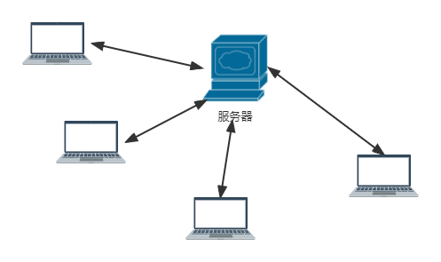
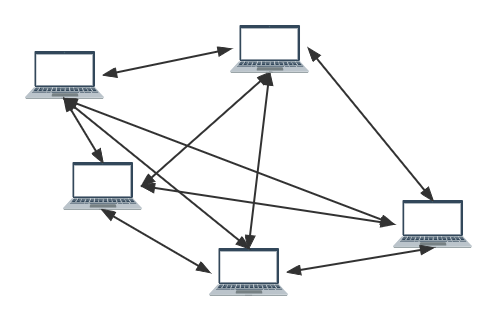
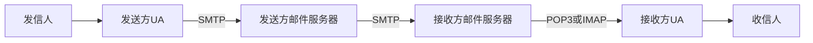
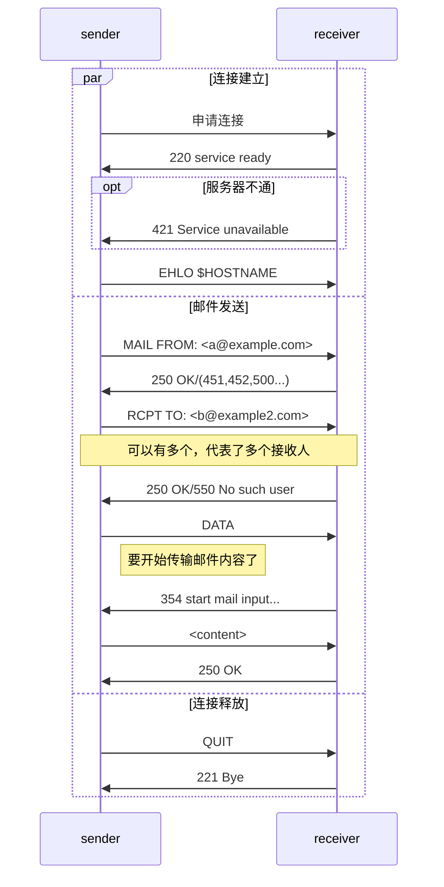
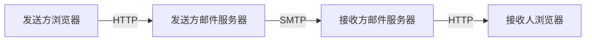
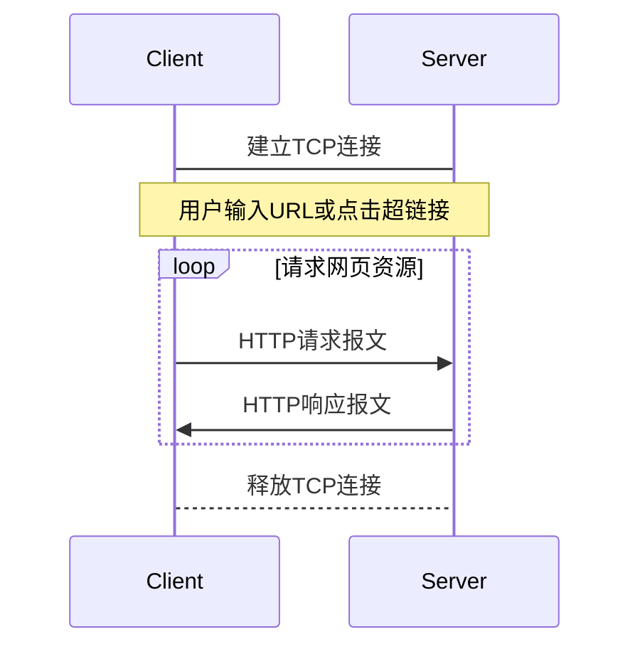

---
tags:
  - 408考研复习
  - 计算机网络
---

应用层
===

??? summary "应用层的功能"
    1. 文件传输、访问和管理（FTP）
    2. 电子邮件（SMTP、POP3等）
    3. 虚拟终端（HTTP）
    4. 查询服务和远程作业登录（DNS）

## 网络应用模型
!!! summary "两种模型的对比"
	|            |       C/S     |      P2P   |
	|:----------:|:-------------:|:----------:|
	|角色划分|客户端PC即可，服务端需要配置较好 |无明确划分 |
	|体系结构|资源和服务在服务器端，软件修改和升级也在服务器端；客户端程序简单 |资源分布式存储 |
	|安全性 |安全性措施容易实现|安全性难以保障
	|数据传输量|易出现瓶颈 |不存在瓶颈问题 |
	| |服务器需要保持联网运行状态|Peer不需要保持联网状态|
	| |双向不对称，下行远大于上行| |
	| | |使用服务人数越多效率越高 |

### 客户端/服务器模型（C/S模型）
<figure markdown>

<figcaption>C/S模型</figcaption>
</figure>

客户端
: 请求计算服务的主机。间歇性接入网络，可能使用动态IP地址，不与其它客户机直接通信

服务器
: 提供计算服务的设备。永久提供服务，有永久性访问地址/域名

应用：Web、FTP、远程登录、电子邮件……

### 对等模型（P2P模型）
<figure markdown>

<figcaption>P2P模型</figcaption>
</figure>

不存在永远在线的服务器。每个节点都可以同时充当客户端和服务器的角色，因此可扩展性好，网络健壮性强。

## DNS系统
!!! summary ""
	DNS将域名解析为IP地址

### 层次域名空间
DNS采用树形结构空间
```
. （根域名）
|---.com/.org/.edu 类属域名（顶级域名）
|     |
|     |-----example1.com  二级域名（权限域名）
|     |         |-------a.example1.com
|     |         |-------b.example1.com
|     |         | ...
|     |-----example2.com  二级域名
|     |...
|---.cn/.jp/.uk 国家域名（顶级域名）
|
|---.arpa 基础结构域名/反向域名 --- in-addr.arpa（专门用于反向解析）
```

### 域名服务器

根域名服务器
: 由ICANN管理，负责协调全球域名系统的运行

TLD域名服务器
: 管理和维护顶级域名

权威域名服务器
: 负责一个区的域名服务器

本地域名服务器
: 企业/组织的DNS服务器

### 域名解析过程
=== "递归解析"
	```mermaid
	sequenceDiagram
		participant Resolver
		participant local as 本地服务器
		participant root as 根服务器
		participant dotcom as .com服务器
		participant examplecom as example.com服务器
		Resolver->>local: www.example.com的地址？
		local->>root: www.example.com的地址？
		root->>dotcom: www.example.com的地址？
		dotcom->>examplecom: www.example.com的地址？
		examplecom->>dotcom: 1.2.3.4
		dotcom->>root: 1.2.3.4
		root->>local: 1.2.3.4
		local->>Resolver: 1.2.3.4
	```

=== "迭代解析"
	```mermaid
	sequenceDiagram
		participant Resolver
		participant local as 本地服务器
		participant root as 根服务器
		participant dotcom as .com服务器
		participant examplecom as example.com服务器
		Resolver->>local: www.example.com的地址？
		local->>root: www.example.com的地址？
		root->>local: .com名字服务器的地址
		local->>dotcom: www.example.com的地址？
		dotcom->>local: example.com名字服务器的地址
		local->>examplecom: www.example.com的地址？
		examplecom->>local: 1.2.3.4
		local->>Resolver: 1.2.3.4
	```

## 文件传输协议FTP
!!! summary ""
	文件传输协议FTP提供不同种类主机系统之间的文件传输能力，是基于客户端/服务器模型的协议，由TCP实现可靠传输。

!!! summary "FTP传输模式"
    * 文本模式，以文本序列传输数据
    * 二进制模式，以二进制序列传输数据

FTP服务器进程包含一个主进程和多个从属进程。

### FTP协议的工作原理
FTP地址可以使用用户名&密码登录，也可以匿名（`anonymous`）登录
### 控制连接与数据连接
* 一次FTP会话中，控制连接只有一个，数据连接可以有多个。
* 控制连接用于传送请求，端口号为21，始终保持
* 数据连接用于传送数据，端口号一般为20，只在数据传输时建立
    * 是否使用TCP20端口建立数据连接与传输模式有关，主动方式使用TCP20，被动方式由服务器和客户端自行协商，一般大于1024
## 电子邮件
一封电子邮件一般包含：

* 信封（收件人地址）
* 内容
    * 首部（发件人地址、收件人地址、主题、日期……）
    * 主体（主要内容）
### 电子邮件系统与组成结构


用户代理
: 电子邮件客户端，如Outlook、Thunderbird、Foxmail

邮件服务器
: 发送&接收邮件，向发件人报告邮件传送结果

### SMTP协议和POP3协议
#### SMTP协议
SMTP规定了在两个相互通信的SMTP进程应该如何交换信息，规定了14条命令和21种应答信息。



!!! bug "SMTP缺点"
	* 不能传送可执行文件或其他二进制对象
	* 仅限传送7位ASCII码
	* 服务器会拒绝超过一定长度的邮件
#### POP3协议
邮局协议提供从服务器下载、删除邮件等功能，采用C/S模型，使用TCP传输数据，访问端口为110。

与SMTP类似，POP3也采用基于ASCII文本的命令/应答消息。
### 电子邮件格式与MIME
* MIME使得电子邮件系统可以支持声音、图像、视频、多种国家语言等，现在多用于浏览器
    * 通过MIME，将非ASCII码转化为可用于SMTP传输的ASCII码
### IMAP协议
* IMAP协议比POP3协议更先进，支持邮件的管理、搜索、排序等功能。
* IMAP允许用户只读取邮件的某一部分，而不必下载整封邮件。
### 基于万维网的电子协议（Web邮件）
用户可以使用浏览器访问邮件服务器，称为Web邮件。通过浏览器，使用HTTP与邮件服务器进行交互，实现邮件的编辑、发送、接收、阅读等功能。



!!! warning ""
	邮件服务器之间传送邮件仍然使用SMTP。
## 万维网和HTTP协议
### WWW的概念和组成结构
万维网（WWW，World Wide Web）是一个覆盖全球的分布式信息仓库，是无数个网络站点和网页的集合。

* 万维网的资源使用统一资源定位符URL标识。
	``` title="URL的一般形式"
    <协议>://<主机名>:<端口号>/<路径> 
    ```

	=== "协议名"
		双方应用程序通信使用的协议，如http、ftp、mailto、telnet等，默认为 `http`

	=== "主机名"
		提供服务的服务器域名

	=== "端口号"
		服务器进程的标识，默认为 `80`

	=== "路径"
		网页文件的路径和名称

* Web网页使用超文本标记语言HTML编写，通过超文本传输协议HTTP传送给使用者。
* 万维网以客户端/服务器方式工作，建立在TCP连接基础上。
### HTTP协议
!!! summary ""
	HTTP协议定义了浏览器（万维网客户进程〉怎样向万维网服务器请求万维网文档，以及服务器怎样把文档传送给浏览器。



* 协议特点
	* 无状态（识别用户用cookie技术，它是存储在用户主机中的文本文件）
	* 本身无连接（交换报文之前无需建立HTTP连接）
* 连接方式
	* 持久连接 `Connection: Keep-Alive`
    * 非持久连接 `Connection: Close`
* 报文结构
    * 请求行（请求报文）/状态行（响应报文）
  		* 请求行包括：方法、URL、版本，中间以空格分隔，末尾为回车换行符
    	* 状态行包括：版本、状态码、短语，中间以空格分隔，末尾为回车换行符
        * 状态码
			* 1xx：请求已被服务器接收，继续处理
			* 2xx：请求已成功被服务器接收、理解、并接受
			* 3xx：需要后续操作才能完成这一请求
			* 4xx：请求有语法错误或请求无法实现
			* 5xx：服务器未能实现合法的请求
        * 方法
      		* GET
        	* POST
            * PUT
            * HEAD
            * DELETE
            * TRACE
            * CONNECT
            * OPTIONS
    * 首部行
  		* 由若干首部字段组成，每个首部字段包括：首部字段名、冒号、首部字段值，中间以空格分隔，末尾为回车换行符
    	* 首部行结束后，还有一个回车换行符
    * 实体主体