---
tags:
  - 408考研复习
  - 计算机网络
---

数据链路层
===

??? summary "数据链路层的功能"
    1. 为网络层提供服务
    2. 链路管理
    3. 组帧
    4. 流量控制
    5. 差错控制

## 基本概念
数据链路层负责通过一条链路从一个结点向另一个物理链路直接相连的相邻结点传送数据报。

结点
: 主机和路由器

链路
: 网络中两个结点之间的物理通道

数据链路
: 网络中两个结点之间的逻辑通道

帧
: 链路层的协议数据单元，封装网络层数据报

## 链路层功能
数据链路层有五大功能：

1. 为网络层提供服务
    * 无确认无连接服务
    * 有确认无连接服务
    * 有确认面向连接服务
2. 链路管理，即连接的建立、维持和释放（用于面向连接的服务）
3. 组帧
4. 流量控制
5. 差错控制（帧错/位错）
### 封装为帧
将网络层的IP数据报添加头部和尾部，形成链路层数据传送单元 *帧*。接收端在收到物理层上交的比特流后，就能根据首部和尾部的标记，从收到的比特流中识别帧的开始和结束。

```text
  +--------+-----------+---------+
  |  首部   |  数据部分  |  尾部   |
  +--------+-----------+---------+
  |        |<-  MTU  ->|         |
帧定界                          帧定界
  |<-          帧长             ->|
```

帧同步：接收端能够从接收到的二进制比特流中区分出帧的起始和终止位置。
#### 组帧方法
* 字符计数法
* 字符（节）填充法
* 零比特填充法
* 违规编码法

!!! tip "提示"
    在“透明传输”一节中，将进一步介绍这些方法

### 透明传输
不管所传数据是什么样的比特组合，都应当能够在链路上进行传送。当所传数据中比特组合恰好与控制信息一样时，就必须采取适当措施，使得接收方不会将这样的数据误认为是控制信息。
#### 字符计数法
帧首部使用一个计数字段（第一个字节，8位）来标明帧内字符数。

!!! bug ""
    如果计数字段错误，则会导致该帧结束位错误，又会导致后面所有的帧都发生错误。双方失去同步。
#### 字符填充法
以`SOH`和`EOT`（均为一个字节）标记帧的开始和结束。如果帧内数据中包含`SOH`或`EOT`，则在其前面添加一个`ESC`（转义字符）。

!!! bug ""
    实现较复杂，兼容性差
#### 零比特填充法
首部和尾部的标志相同，均为`01111110`。

* 发送时，只要发现连续的5个1，就立即填入1个0。
* 接收时，先确认边界，再扫描比特流，发现连续的5个1，就把后面的0删除。

!!! success ""
    保证了透明传输
#### 违规编码法
曼彻斯特编码不会出现高-高或低-低的情况，因此可以利用这一特性，使用这两种组合界定帧起始/帧终止。
### 差错控制
差错总是由于噪声引起的。

* 全局性：线路本身电气特性造成的热噪声，解决：提高信噪比
* 局部性：外界特定的短暂原因造成的冲击噪声，解决：利用编码技术解决
#### 差错的分类
* 位错：比特位出错，1变0，0变1
* 帧错

    === "丢失"
        ```text
        [#1]-[#2]-[#3] --> [#1]-[#3]
        ```
    
    === "重复"
        ```text
        [#1]-[#2]-[#3] --> [#1]-[#2]-[#2]-[#3]
        ```
    
    === "失序"
        ```text
        [#1]-[#2]-[#3] --> [#1]-[#3]-[#2]
        ```

数据链路层的差错控制主要强调的是 *比特错*
#### 检错编码
##### 奇偶校验码
使用`n-1`位信息元和`1`位校验元，在接收到数据的首位添加一个校验元，使得`1`的个数为奇数（寄校验码）或偶数（偶校验码）。

!!! info "特点"
    只能检验出奇数个比特错误，检错能力为50%。
##### 循环冗余码CRC
计算冗余码

1. 加0
    * 若生成多项式 $G(x)$ 的阶为 $r$，则加 $r$ 个0
2. 模2除法
    * 数据加0后除以多项式，余数为所求冗余码（FCS/CRC检验码）的比特序列。

最终发送的数据：`数据||检验序列FCS`

接收端：`数据||检验序列FCS`除以多项式，余数为0，则无差错，否则有差错。无差错帧可以接收，有差错帧需要丢弃。

#### 纠错编码——海明码
!!! abstract "工作原理"
    “牵一发而动全身”，通过增加冗余位，使得任意一个比特的改变都会导致整个比特序列的改变。

!!! success "能力"
    发现双比特错，纠正单比特错。

1. 确定校验码位数r
    * 海明不等式：$2^r\ge k+r+1$，其中r为冗余信息位，k为信息位
2. 确定校验码和数据的位置
    * 校验码 $P_1P_2\cdots P_n$ 放在 $2^n$ 次方的位置上，剩余位置从左到右依序放入数据
3. 求出校验码的值
    * 令所有要校验的位异或运算的结果为0，$P_n$ 对应第n位是1的数据。
4. 检错并纠错
    * 令所有要校验的位异或运算。
    * 从 $P_n$ 写到 $P_1$，所对应二进制编码对应的十进制数即为出错位。
### 流量控制与可靠传输
较高发送速度和较低接收能力不匹配，会造成传输出错。因此流量控制是非常必要的一项工作。

|     方法      | 发送窗口 | 接收窗口 |
|:-----------:|:----:|:----:|
|   停止-等待协议   |  =1  |  =1  |
| 后退N帧协议（GBN） | \>1  |  =1  |
| 选择重传协议（SR）  | \>1  | \>1  |

!!! tip ""
    GBN和SR都属于 **滑动窗口协议**，停止-等待协议也可以看作窗口为1的滑动窗口协议。
#### 停止-等待协议
##### 无差错
每发送1个数据帧就停止并等待，因此只需使用1个bit来编号。

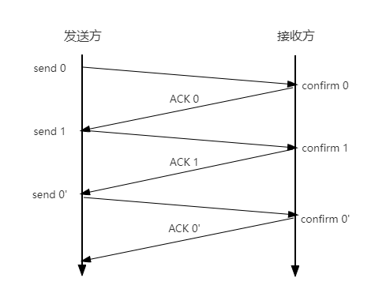
##### 有差错
=== "帧丢失/帧出错"
    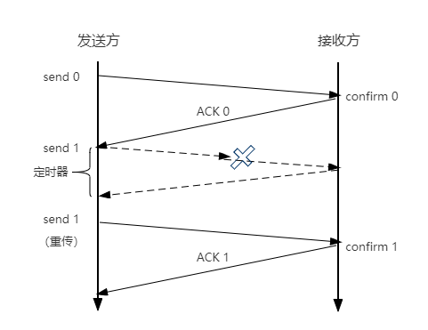

=== "ACK丢失"
    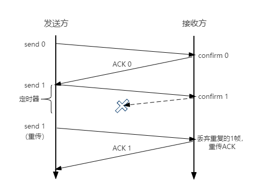

=== "ACK迟到"
    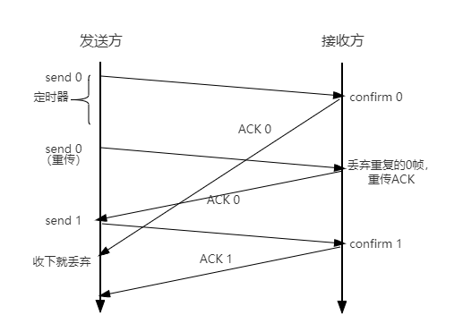

##### 性能分析
* 信道利用率：$(\dfrac{L/C}{T})$，T为发送周期，L为发送数据总比特量，C为发送方数据传输率
    * 停止-等待协议的信道利用率很低，$U=\dfrac{T_D}{T_D+RTT+T_A}$
* 信道吞吐率=信道利用率×发送方的发送速率
#### 后退N帧协议GBN
!!! info "停等协议的弊端"
    太闲了，停等协议一次只发1个帧，等到接收方回复一个确认帧，发送方才会发送新的帧。

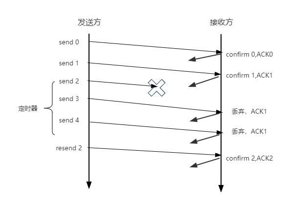

!!! warning "窗口长度不能为无限"
    n 个比特对帧编号，则发送窗口尺寸 $W_T$ 应满足 $1\le W_T\le 2^n-1$，否则接收方无法区别新帧和旧帧。

##### 发送方处理
* 上层调用：检查窗口是否已满，若未满则发送新帧，否则等待。
* 收到ACK：GBN是累积确认方式，表明接收方已经收到n号帧和它之前的全部帧。
* 超时事件：一段时间内如果没有收到ACK，则重传所有已发送但未被确认的帧。
##### 接收方处理
* 如果正确有序地收到n号帧，则发送ACK，且交付其中的数据给上层。
* 否则，丢弃该帧，为最近按序接收的帧重新发送ACK。
    * 接收方自行维护 `expected_seq_num` 作为下一个按序接收的帧序号。
##### 性能分析
* 因连续发送数据帧而提高了信道利用率
* 在重传时必须把原来已经正确传送的数据帧重传，使传送效率低

!!! abstract "GBN总结"
    1. 累积确认（偶尔捎带确认）
    2. 按序接受
    3. 确认序列号最大，按序到达的帧
    4. 发送窗口最大 $2^n-1$，接收窗口为1
#### 选择重传协议SR
!!! info ""
    能不能只重传出错的帧？设置单个确认，设置接收窗口

!!! warning "窗口长度不能为无限"
    n 个比特对帧编号，则发送窗口和接收窗口尺寸应满足 $W_T\le 2^{n-1},W_R\le 2^{n-1}$，且发送窗口最好等于接收窗口，否则接收方无法区别新帧和旧帧。

##### 发送方处理
* 上层调用：检查下一个可用于该帧的序号。
* 收到ACK：窗口向前移动至未确认地址的最小序号。
* 超时事件：每个帧都有自己的定时器，一个超时事件发生后只重传一个帧。
##### 接收方处理
* 接收窗口内的帧 **来者不拒**。失序帧缓存，且立即向发送方发送ACK确认该帧。
* 收集一批连续帧后交付给上层，然后向前移动滑动窗口。

!!! abstract "SR总结"
    1. 对数据帧逐一确认，收一个确认一个
    2. 只重传出错帧
    3. 接收方有缓存
    4. 发送窗口和接收窗口最大为 $2^n-1$
## 介质访问控制
!!! summary "总结"
    介质访问控制就是采用一定的措施，让两对节点之间通信不会相互干扰。

### 传输数据使用的两种链路
=== "点对点"
    两个相邻节点通过一个链路相连，没有第三者。常用于广域网。

=== "广播式"
    所有主机共享通信介质。常用于局域网。典型拓扑为总线型或星型。

### 静态划分信道——信道划分介质访问控制
!!! summary ""
    基于多路复用技术划分资源。

!!! warning ""
    * 网络负载重时，信道利用率高，公平
    * 网络负载轻时，信道利用率低

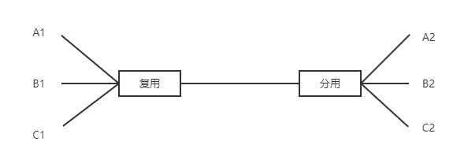
#### 频分多路复用FDM
各用户占用不同的带宽资源（频率带宽Hz），用户在分配到一定频带后，在通信过程中自始至终占用这个频带。
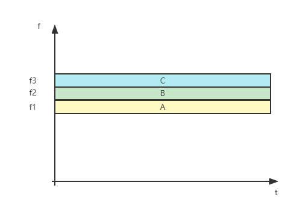
#### 时分多路复用TDM
将时间划分为一段段等长的时分复用帧（TDM帧），每个用户在每个TDM帧中占用固定序号的时隙。
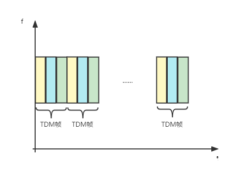
#### 波分多路复用WDM
波分多路复用是光的频分复用，在光纤中传输各种不同波长（频率）的光信号。
#### 码分多路复用CDM
每个用户分配一个唯一的m bit码片序列，0用`-1`表示，1用`+1`表示。

* 编码信号为原始数据与码片序列的点积。如发送比特1（+1），则发送自己的m bit码片序列；如发送比特0（-1），则发送自己的m bit码片序列的反码。
* 多个站点发送数据时，各站点芯片序列相互正交（对应位相乘相加和为0）。

!!! info ""
    * 合并：各路数据在信道中线性相加
    * 分离：合并数据与源站规格化内积

### 动态划分信道
!!! summary ""
    信道并非在用户通信时固定分配给用户。又称多点接入。
#### 随机访问介质控制
!!! summary ""
    用户根据随机意愿发送信息，发送信息时，可以独占信道带宽。

!!! warning ""
    * 网络负载重时，产生冲突开销
    * 网络负载轻时，共享信道效率高，单个站点可使用全部信道带宽。

##### ALOHA协议（不听就说）
* 纯ALOHA协议：想发就发
    * 每个站点可在任意时间发送数据，不关心信道是否被占用
    * 如发送失败，经随机延时后再发送
    * 检测：接收方负责，如果发现数据帧错误，就不予确认，发送方一定时间内收不到反馈就判断发生了冲突
* 时隙ALOHA协议
    * 把时间分为时隙（时间片），时隙长度对应一帧的传输时间
    * 所有用户在时间片开始时刻同步接入网络信道，若发生冲突，就需要等待下一个时间片再开始发送

##### CSMA协议（先听再说）
!!! summary "协议思想"
    发送帧之前，监听信道。

* CS：载波侦听/监听，每一个站在发送数据之前要检测一下总线上是否有其他计算机在发送数据。
    !!! info ""
        当几个站同时在总线上发送数据时，总线上的信号电压摆动值将会增大（互相叠加）。当一个站检测到的信号电压摆动值超过一定门限值时，就认为总线上至少有两个站同时在发送数据，表明产生了碰撞，即发生了冲突。

* MA：多路访问/多点接入，表示许多计算机以多点接入的方式连接在一根总线上。

=== "1-坚持CSMA"
    监听信道忙之后的坚持。空闲则直接传输，不必等待。忙则一直监听，直到空闲马上传输。

    !!! success ""
        只要媒体空闲，站点就马上发送，避免了媒体利用率的损失。

    !!! fail ""
        假如有两个或两个以上的站点有数据要发送，冲突就不可避免。

=== "非坚持CSMA"
    监听信道忙之后就不继续监听。空闲则直接传输，不必等待。忙则等待一个随机的时间之后再进行监听。

    !!! success ""
        采用随机的重发延迟时间可以减少冲突发生的可能性。

    !!! fail ""
        可能存在大家都在延迟等待过程中，使得媒体仍可能处于空闲状态，媒体使用率降低.

=== "p-坚持CSMA"
    对于监听信道空闲的处理。空闲则以p概率直接传输，不必等待；概率1-p等待到下一个时间槽再传输。忙则等待一个随机的时间之后再进行监听。

    !!! success ""
        既能像非坚持算法那样减少冲突，又能像1-坚持算法那样减少媒体空闲时间的这种方案。

    !!! fail ""
        发生冲突后还是坚持把数据发完，造成了浪费。

##### CSMA/CA协议（先听再说，边听边说）
!!! summary ""
    CA(Collision Avoidance)：碰撞避免

工作原理

* 发送数据前，检测信道是否空闲
    * 若信道空闲，发出RTS帧（Request To Send）`(发射端地址,接收端地址,发送持续时间)`
    * 若信道忙，则等待
    * CSMA/CA采用能量检测、载波检测和能量载波混合检测的方式来检测信道是否空闲
* 接收端一旦收到RTS，发送CTS（Clear To Send）响应
* 发送端一旦收到CTS，开始发送数据帧，并且预约信道，告知其它站点自己需要传输的时间
* 接收端接收到数据后，使用CRC校验数据是否正确，如果数据正确，则响应ACK帧
* 发送方接受到ACK后，进行下一帧发送；如果没有收到，则一直重传，直到规定次数位置（二进制指数退避算法）

##### CSMA/CD协议（先听再说，边听边说）
!!! summary ""
    CD(Collision Detection)：碰撞检测

工作原理

* 发送数据前，检测信道是否空闲
    * 若信道空闲，发出RTS帧（Request To Send）`(发射端地址,接收端地址,发送持续时间)`
    * 若信道忙，则等待
    * CSMA/CD通过电缆中电压的变化来检测信道是否空闲
* 接收端一旦收到RTS，发送CTS（Clear To Send）响应
* 发送端一旦收到CTS，开始发送数据帧，并且预约信道，告知其它站点自己需要传输的时间
* 接收端接收到数据后，使用CRC校验数据是否正确，如果数据正确，则响应ACK帧
* 发送方接受到ACK后，进行下一帧发送；如果没有收到，则一直重传，直到规定次数位置（二进制指数退避算法）

!!! fail ""
    CSMA/CD不能用于无线局域网，因为它无法进行360°的信道碰撞检测，其次是存在隐蔽站问题。

??? abstract "截断二进制指数退避算法"
    1. 确认基本退避时间为争用期 $2\tau$
    2. 定义重传次数 k为`min(重传次数 ,10)`
    3. 从 $(0,1,\cdots,2^k-1)$ 中随机取出一个数 $r$，重传退避时间为 $2r\tau$。
    4. 当重传达到16次时，认为网络出现故障，停止重传并向高层判断出错。

??? info "最小帧长"
    帧的传播时延至少要是信号在总线中传播时延的两倍。

    $$
    最小帧长=总线传播时延\times 数据传输速率 \times 2
    $$

    以太网的最短帧长为64B。

#### 轮询访问介质访问控制
!!! summary ""
    既不产生冲突，又占用全部带宽。

##### 轮询协议
主结点轮流邀请从属节点是否发送数据。

!!! success ""
    每一次只允许一台主机发送数据，不会产生冲突

!!! fail ""
    轮询开销，等待延迟，单点故障

##### 令牌传递协议
每个结点在一定时间内拥有发送数据的权利（令牌）。应用于令牌环网（物理星型逻辑环形）。

!!! info "令牌"
    令牌帧是一个特殊MAC控制帧，用于控制数据包的发送。

!!! success ""
    令牌环网不存在数据碰撞冲突

!!! fail ""
    令牌开销，等待延迟，单点故障

## 局域网
### 基本概念
局域网（Local Area Network，LAN）是指在某一区域内由多台计算机互联成的计算机组，使用广播信道。
#### 特点
* 覆盖地理范围小
* 使用专门传输介质联网，数据传输速率高（10Mb/s~10Gb/s）
* 通信延迟时间短，误码率低，可靠性高
* 各站为平等关系，共享传输信道
* 多采用分布式控制和广播式通信，能进行广播和组播
#### 主要要素
=== "网络拓扑"
    
    === "星型"
        中心节点是控制中心，构形简单，建网容易，便于控制和管理。但可靠性低，存在单点故障。

        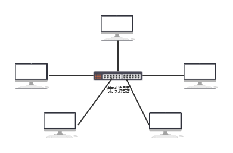

    === "总线型"
        可靠性高，共享资源能力强。

        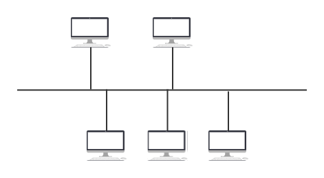

    === "环形"
        通信设备和线路较节省，但存在单点故障问题，且不便扩充。

        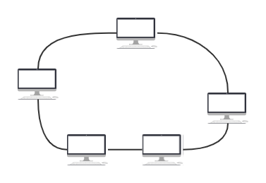

    === "树型"
        易于扩展，易于隔离故障，也容易有单点故障。

        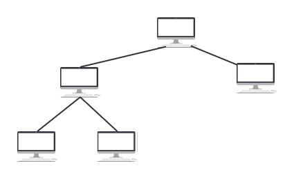

=== "传输介质"

    === "有线局域网"
        常用介质为双绞线、同轴电缆和光纤

    === "无线局域网"
        常用介质为电磁波

=== "介质访问控制方法"

    === "CSMA/CD"
        常用于总线型局域网，也用于树型网络

    === "令牌总线"
        常用于总线型局域网，也用于树型网络

    === "令牌环"
        用于环形局域网，如令牌环网
#### 局域网分类
=== "以太网"
    应用最为广泛的局域网，包括标准以太网、快速以太网、千兆以太网和10G以太网，都符合IEEE 802.3 系列标准规范。

=== "令牌环网"
    物理上采用星形拓扑结构，逻辑上是环形拓扑结构

=== "FDDI网"
    物理上采用双环拓扑结构，逻辑上是环形拓扑结构

=== "ATM网"
    使用53字节固定长度单元进行交换

=== "无线局域网"
    采用 IEEE 802.11 标准
#### IEEE 802标准
IEEE 802标准是IEEE组织制定的一系列标准，用于定义局域网的物理层、数据链路层和网络层的通信协议。

* MAC子层和LLC子层
    * IEEE802标准所描述的局域网参考模型只对应OSI参考模型的数据链路层和物理层，它将数据链路层划分为逻辑链路层LLC子层和介质访问控制MAC子层
    * LLC子层：识别网络层协议，然后对它们进行封装
    * MAC子层：数据帧的封装与卸载、帧的寻址和识别、帧的接收和发送、链路管理、帧的差错控制。屏蔽了不同物理链路种类的差异性。

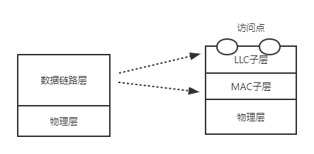
### 以太网
以太网（Ethernet）是由Xerox公司创建并由Xerox、Intel和DEC公司联合开发的基带总线局域网规范，使用CSMA/CD技术。

#### 特点
* 造价低廉
* 应用最广泛
* 组网简单
* 满足网络速率要求
#### 标准
=== "DIX Ethernet V2"
    第一个局域网产品（以太网）规约。

=== "IEEE 802.3"
    IEEE 802委员会802.3工作组制定的第一个IEEE的以太网标准。
#### 服务
以太网提供无连接，不可靠服务

无连接
: 发送方和接收方之间没有握手过程

不可靠
: 不对发送方的数据帧编号，接收方不向发送方进行确认，差错帧直接丢弃，差错纠正由高层负责

!!! note ""
    以太网只实现无差错接受，不实现可靠传输

#### 10Base-T以太网
* Base：基带信号
* 10：速率10Mb/s
* T：双绞线，10Base-T采用无屏蔽双绞线（UTP）
* 物理上采用星型拓扑，逻辑上总线型，每段双绞线最长100米
* 采用曼彻斯特编码
* 采用CSMA/CD协议
#### 适配器和MAC地址
计算机通过通信适配器与外界局域网连接。适配器上的ROM存储器中包含了计算机硬件地址MAC地址。

* MAC地址是全球唯一的48位二进制地址，前24位代表厂家，后24位厂家自行指定，使用6个十六进制数表示。
#### 以太网MAC帧格式（V2）
```text
               6        6      2       46~1500         4
           +--------+--------+----+------------------+----+
           | 目的地址| 源地址  |类型 |     数据          |FCS |       MAC层
           +----------------------------------------------+
                                  ↑
+----------+----------------------------------------------+
|    8B    |                   以太网MAC帧                 |        物理层
+----------+----------------------------------------------+
     ↓
+-----------------------+----------+
|    前同步码 7B         |  定界符1B |
+-----------------------+----------+
```
#### 高速以太网
!!! abstract ""
    速率不小于100Mb/s的以太网称为高速以太网

=== "100Base-T以太网"
    在双绞线上传送100Mb/s基带信号的星型拓扑以太网，仍使用IEEE802.3的CSMA/CD协议。支持全双工和半双工，可在全双工方式下工作而无冲突。

=== "吉比特以太网"
    在光纤或双绞线上传送1Gb/s信号。支持全双工和半双工，可在全双工方式下工作而无冲突。

=== "10吉比特以太网"
    在光纤上传输10Gb/s信号。只支持全双工，无争用问题。

### 无线局域网
无线局域网（Wireless LAN，WLAN）是指利用无线电波传输数据的局域网。
#### IEEE802.11标准
IEE802.11是无线局域网通用的标准，它是由IEEE所定义的无线网络通信的标准。

* WiFi是802.11b和802.11g所定义的标准，满足这两个标准属于WiFi。

* 802.11MAC帧头格式
    ```text
      2         2         6       6        6       2        6
    +------+----------+--------+-------+-------+---------+------+
    |帧控制 | 生存周期ID|  地址1  | 地址2  | 地址3  | 序列控制 | 地址4 |
    +------+----------+--------+-------+-------+---------+------+
                         RA       TA       DA               SA
                        接收端    发送端 目的地址（主机）    源地址（主机）
                       （基站）  （基站）
    ```

* 802.11帧类型

    | 功能             |  To DS   | From DS | Addr1 | Addr2 | Addr3 | Addr 4 |
    |:--------:|:-----:|:-------:|:-----:|:-----:|:-----:|:------:|
    | IBSS           |    0     |0|DA|SA|BSSID|无|
    | To AP（基础结构型）   |    0     |1|BSSID|SA|DA|无|
    | From AP（基础结构型） |    1     |0|DA|BSSID|SA|无|
    | WDS（无线分布式系统）  |    1     |1|RA|TA|DA|SA|

#### 无线局域网的分类
* 有固定基础设施的无线局域网
    * 服务集标识符也就是我们平常所说的”Wifi名称“
* 无固定基础设施无线局域网的自组织网络

## 广域网
### 基本概念
广域网（Wide Area Network，WAN）是指覆盖范围较大的网络，一般指跨越城市、省、国家的网络。其通信子网使用分组交换技术。
### PPP协议
点对点协议PPP是目前使用最广泛的数据链路层协议，用户使用拨号电话接入因特网时一般都使用PPP协议。只支持全双工链路。

* 应满足
    * 简单
    * 封装成帧
    * 透明传输
    * 多种网络层协议
    * 多种类型链路
    * 差错检测
    * 检测连接状态
    * 最大传送单元
    * 网络层地址协商
    * 数据压缩协商
* 无需满足
    * 纠错（只需要检错）
    * 流量控制
    * 对帧编序号
    * 多点线路（不支持，只需满足点对点之间的连接过程）
### 三个组成部分
* 一个将IP数据报封装到串行链路的方法
* 链路控制协议LCP：建立并维护数据链路连接，身份验证
* 网络控制协议NCP：每个不同的网络层协议需要一个相应的NCP来配置，为网络层协议建立和配置逻辑连接
### PPP帧格式
> 帧格式以字节为单位，传输的数据都是整数个字节，因此PPP协议面向字节

```text
|<------首部------------->|<-------IP数据报------>|<-------尾部----->|
+----+----+----+---------+----------------------+------------+-----+
| 7E | FF | 03 |  协议   |      信息部分          |    FCS     |  7E |
+----+----+----+---------+----------------------+------------+-----+
  1    1    1      2            <=1500B               2         1
```
## 链路层设备
### 集线器
物理层通过集线器扩展以太网的两种方法
=== "光纤"
    光纤长度长，信号损耗小。
    
    * 调制器：电信号→光信号
    * 解调器：光信号→电信号

=== "通过主干集线器"
    将每个小集线器连接到一个主干集线器上。一个冲突域内主机变多，发生冲突概率变大，效率变低

### 网桥&交换机
!!! info ""
    为了解决主干集线器方式的冲突大、效率低问题，出现了网桥（交换机的前身）和交换机

网桥根据MAC帧的目的地址对帧进行转发和过滤。当网桥收到一个帧时，并不向所有端口转发此帧，而是先检查此帧的目的MAC地址，然后再确定将该帧转发到哪一个接口，或者是把它丢弃。

!!! success "网桥的优点"
    * 过滤通信量，增大吞吐量
    * 扩大了物理范围
    * 提高了可靠性
    * 可互连不同物理层

#### 网桥的分类
##### 透明网桥
通过自学习来构建转发表。每一个通过网桥的数据包都会被记录下网桥收到数据时数据对应的地址和网桥自己的接口，通过许许多多的数据包的构造的缓存，网桥就可以知道哪个数据包在哪个接口，以后如果要穿数据包就知道要往哪个接口发送数据包了。
##### 源路由网桥
在发送时，直接将最佳路径放到帧首部。那么网桥如何获得最佳路径？通过广播方式想目标地址发送广播，此时可能会经过不同路由产生不同的路径，目标地址收到后再将每一条路径都发一个响应帧给网桥，网桥经过对比就知道哪个接口最快了。

#### 以太网交换机
> 随着技术的发展，网桥的接口越来越多，就变成了以太网交换机。

* 交换机通常有十几个端口，每个端口都可以直接连接主机或者连接集线器
* 交换机同网桥一样，每个端口引出的区域都是一个冲突域
* 交换机可以独占传输媒体带宽，交换机端口连接的集线器/主机都是独占媒体带宽，不同于集线器带宽被平分

两种交换方式

=== "直通式"
    查完目的地址（6B长）就立刻转发。延迟小，但可靠性低，不支持不同速率端口的交换。

=== "存储转发式"
    将帧放入高速缓存，并检查是否正确，正确则转发，错误则丢弃。延迟大，但可靠性高，支持不同速率端口的交换。

!!! info "广播域和冲突域"
    * 广播域：网络中能接受任一设备发出的广播帧的所有设备的集合。
    * 冲突域：在同一冲突域中的每一个节点都能收到所有被发送的帧。

    |        | 能否隔离冲突域 | 能否隔离广播域 |
    |:------:|:-----------:|:------------:|
    |物理层设备|×|×|
    |链路层设备|√|×|
    |网络层设备|√|√|