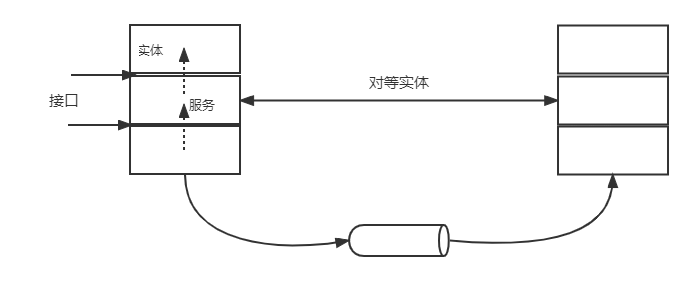
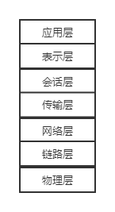
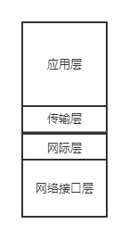
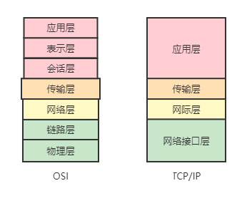
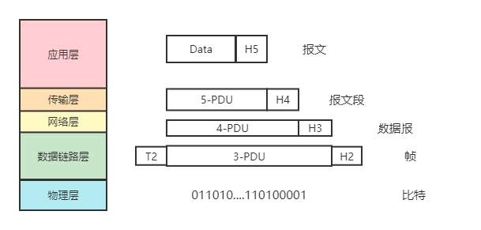

---
tags:
  - 408考研复习
  - 计算机网络
---

计算机网络概述
===

!!! summary "概念"
    计算机网络是将分散的、具有独立功能的计算机系统，通过通信设备和线路连接起来，由功能软件实现资源共享和信息传输的系统。

* 计算机网络是互连的（互联互通）、自洽的（无主从关系）计算机集合。

## 一、计算机网络的组成

### 组成部分

硬件
: 不同硬件之间实现互联互通。

软件
: 授权用户对网络资源的访问，提供通信和用户所需要的各种网络服务。

协议
: 定义了两个或多个通信实体之间交换的报文格式和次序，以及在报文传输和/或接收或其他事件方面所采取的动作。由语法、语义、同步三要素组成。

### 工作方式

边缘部分
: 由所有连接在互联网上的主机组成。这部分是用户直接使用的，用来进行通信（传送数据、音频或视频）和资源共享。

核心部分
: 由大量网络和连接这些网络的路由器组成。这部分是为边缘部分提供服务的（提供连通性和交换）。

### 功能组成

通信子网
: 实现网络通信功能的设备及其软件的集合称为网络的通信子网。

!!! summary ""
    OSI 的网络层、数据链路层以及物理层属于通信子网。

资源子网
: 网络中实现资源共享功能的设备及其软件的集合称为资源子网。

!!! summary ""
    OSI 的应用层、表示层、会话层属于资源子网。

## 二、计算机网络的功能
1. 数据通信
2. 资源共享
3. 分布式处理
4. 提高可靠性
5. 负载均衡

等等

## 三、计算机网络的分类

=== "分布范围"

    ||WAN广域网|MAN城域网|LAN局域网|PAN个域网|
    |:--:|:--:|:--:|:--:|:--:|
    |覆盖范围|几十公里到几千公里|介于10~100公里间|几米至10公里以内|很小区域（如一个房间）|
    |传输媒介|电话线、高速数据线、卫星、微波|100Mbps光缆或调制解调器|无线WiFi或100/1000Mbps网线|无线WiFi或红外线|
    |常用协议|frame-relay、PPP、HDLC和SDLC|ATM、DQDB和SMDS|以太网 IEEE802.3标准|蓝牙、USB等|
    |网络所有权|私有或公用|私有或公用|私有|私有|

=== "使用者"
    
    === "公用网"
        由网络服务提供商建设，供公用用户使用的通信网络。公共网络的通信线路是共享给用户使用的。

    === "专用网"
        网络基础设施和网络中的信息资源属于单个组织，并且由该组织对网络实施管理的网络结构。

=== "交换技术"

    === "电路交换"
        电路交换网络中的信息按顺序在专用线路上传输，若要保持持续通话，在整个会话期间必须沿其路径预留所需的资源。

        ```mermaid
        graph LR
            A["建立连接（占用通信资源）"]-->B["通话（一直占用通信资源）"]-->C["释放连接（归还通信资源）"]
        ```

    === "报文交换"
        报文交换网络采用存储转发（Store-Forward）的技术将数据从源点传送到目的地，传输数据的逻辑单元称为报文（Message）

    === "分组交换"
        分组交换网络以分组（Packet）为单位采用存储转发技术进行数据传输和交换。

=== "拓扑结构"

    === "总线型"
        通过一根称为总线的传输线路将网络中的所有节点连接起来。各个节点之间通过电缆直接连接，所以这种拓扑结构所需要的电缆长度是最短的。

    === "星型"
        各节点通过点到点的方式连接到一个中央节点。节点之间的通信必须经过中央节点。

    === "环型"
        传输介质从一个端系统连接至另一个端系统，直到将所有的端系统连成环型。

    === "网状型"
        各节点通过传输线连接起来，并且每一个节点至少与其他两个节点相连。

=== "传输技术"

    === "广播式网络"
        在网络中只有一个单一的通信信道，由这个网络中所有的主机所共享。即多个计算机连接到一条通信线路上的不同分支点上，任意一个节点所发出的报文分组被其他所有节点接受。发送的分组中有一个地址域，指明了该分组的目标接受者和源地址。

    === "点对点网络"
        由许多互相连接的节点构成，在每对机器之间都有一条专用的通信信道，当一台计算机发送数据分组后，它会根据目的地址，经过一系列的中间设备的转发，直至到达目的节点

## 四、计算机网络标准化工作
!!! tip "意义"
    实现不同厂家的软硬件的联通。

* 分类
  * 法定标准（如OSI）
  * 事实标准（如TCP/IP）
* 相关组织
  * ISO国际标准化组织
  * ITU国际电信联盟
  * IEEE
  * IETF
  * ……

## 五、计算机网络的性能指标

!!! warning "请分清速率和容量的单位进制"
    * 速率是 $10^3$ 进制
    * 容量是 $2^{10}$ 进制

!!! info ""
    1 B(yte) 字节 = 8 b(it) 比特

### 1. 速率
在数据传输中，两个设备之间数据流动的物理速度称为传输速率，也称数据率或比特率。单位为位每秒（b/s或bps）。

* 数据传输的理想情况

### 2. 带宽
* 两种定义：
    1. 模拟带宽：频带的宽度，$f_高-f_低$，单位为赫兹（Hz）
    2. 数字带宽：从一点到另一点所能通过的最高数据量（网络设备支持的最高速度），单位为位每秒（b/s或bps）。
  
    !!! tip "单位转换"
        $$
        \begin{align}
        1 Tb/s &= 10^3 Gb/s\\
        1 Gb/s &= 10^3 Mb/s\\
        1 Mb/s &= 10^3 Kb/s\\
        1 Kb/s &= 10^3 b/s
        \end{align}
        $$

### 3. 吞吐量
单位时间内通过某个网络（或信道、端口）的数据量，单位为位每秒（b/s或bps）。

* 会受到带宽或网络的额定速率限制。链路传输的实际状况。

### 4. 时延
指数据（报文/分组/比特流）从网络（或链路）的一端传送到另一端所需的时间，也叫延迟或迟延。单位为秒（s）。

时延的种类

发送时延 $t_1$
: 或称为传输时延。从发送数据帧的第一个比特算起，到该帧的最后一个比特发送完毕所需的时间。计算公式为 $t_1=\dfrac{数据帧长度}{信道带宽}$

传播时延 $t_2$
: 电磁波在信道中需要传播一定的距离而花费的时间。计算公式为 $t_2=\dfrac{信道长度}{电磁波在信道上的传播速率}$

排队时延 $t_3$
: 分组在输入队列中排队等待处理，在输出队列中等待转发，就形成了排队时延。

处理时延 $t_4$
: 主机或路由器处理（检查错误、找出口等）所收到的分组的时间。

总时延为上述四种时延的加和。

$$
\begin{align}
t_总=t_1+t_2+t_3+t_4
\end{align}
$$

#### 时延带宽积
时延带宽积是以比特为单位的链路长度，$时延带宽积=传播时延 \times 带宽$ ，单位为 bit。

#### 往返时延RTT
从发送方发送数据开始，到发送方收到接收方的确认（接收方收到数据后立即发送确认），总共经历的时延。

* 包括
  * 往返传播时延 = 传播时延 &times; 2
  * 末端处理时间（接收方对数据处理的时间）

!!! tip "提示"
    `ping` 命令可以得到时延值。在中文操作系统上，`时间=` 后面的值即为RTT值。

    ```plain title="ping www.baidu.com的运行结果"
    C:\Users\{REDACTED_USER}>ping www.baidu.com
    
    正在 Ping www.a.shifen.com [39.156.66.14] 具有 32 字节的数据:
    来自 39.156.66.14 的回复: 字节=32 时间=5ms TTL=48
    来自 39.156.66.14 的回复: 字节=32 时间=6ms TTL=48
    来自 39.156.66.14 的回复: 字节=32 时间=8ms TTL=48
    来自 39.156.66.14 的回复: 字节=32 时间=9ms TTL=48
    
    39.156.66.14 的 Ping 统计信息:
    数据包: 已发送 = 4，已接收 = 4，丢失 = 0 (0% 丢失)，
    往返行程的估计时间(以毫秒为单位):
    最短 = 5ms，最长 = 9ms，平均 = 7ms
    ```

### 5. 利用率
* 信道利用率：有数据通过的时间占总时间的比值。
* 网络利用率：信道利用率的加权平均值。

## 六、计算机网络体系结构和模型
### 1. 计算机网络分层结构

??? help "分层的意义"
    * 各层之间相互独立
    * 灵活性好
    * 结构上可分割
    * 易于实现和维护
    * 能够促进标准化工作

<figure markdown>

<figcaption>分层示意图</figcaption>
</figure>

### 2. 协议、接口及服务
* 协议保证能向上一级提供服务，使用本层服务的实体只能看见服务而看不到协议。
* 协议是控制对等实体之间通信的规则，是“水平”的；而服务由下层通过层间接口提供给上层，是“垂直”的。
* 同一系统相邻两层的实体进行交互的地方称为服务访问点SAP（Service Access Point）。
### 3. 模型
#### ISO/OSI模型 
法定标准 
{ .md-tag }

<figure markdown>

<figcaption>OSI七层参考模型</figcaption>
</figure>

=== "应用层"
    为特定类型网络应用提供访问OSI环境的手段

=== "表示层"
    处理在两个通信系统中交换信息的表示方式

=== "会话层"
    向表示层实体/用户提供建立连接的方式并在连接上有序传输数据

=== "传输层"
    主机中端到端之间的透明数据传输

=== "网络层"
    数据以网络协议数据单元（分组）为单位进行传输

=== "数据链路层"
    将网络层的数据报组装成帧

=== "物理层"
    在物理媒体上实现比特流的透明传输

#### TCP/IP模型
事实标准 
{ .md-tag }

<figure markdown>

<figcaption>TCP/IP四层参考模型</figcaption>
</figure>

=== "应用层"
    包含所有的高层协议，对应于OSI的应用、表示、会话层

=== "传输层"
    负责在源主机和目标主机的应用程序间提供端到端的数据传输服务，对应于OSI的传输层，核心协议为TCP或UDP

=== "网际层"
    主要负责处理来自传输层的分组，在功能上类似于OSI的网络层，核心协议为IP

=== "网络接口层"
    对应于OSI模型的物理层和数据链路层，TCP/IP标准没有在该层定义协议

!!! info "OSI与TCP/IP模型的对照"
    <figure markdown>
    
    <figcaption>两参考模型对比</figcaption>
    </figure>

!!! info "计算机网络中的5层体系"
    综合OSI和TCP/IP模型的优点，在计算机网络的学习中，常常采用如下所示的五层协议体系结构：
    <figure markdown>
    
    <figcaption>五层参考模型</figcaption>
    </figure>