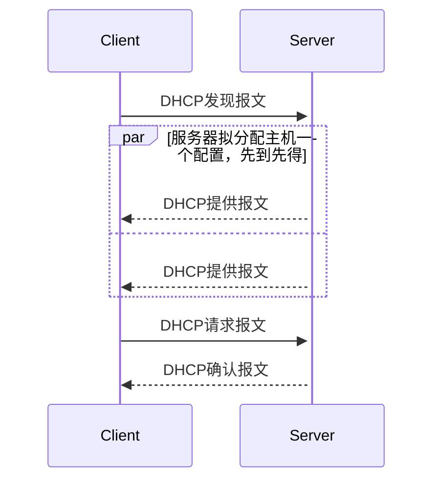

---
tags:
  - 408考研复习
  - 计算机网络
---

网络层
===

??? summary "网络层的功能"
    1. 路由选择与分组转发
    2. 异构网络互联
    3. 拥塞控制

## 路由算法

### 静态路由算法
* 管理员手工配置路由信息
* 适合拓扑变化不大的网络

### 动态路由算法
* 路由器间彼此交换信息，按照路由算法优化路由表项
* 适合大型网络
* 又可分为全局性和分散性路由算法

    === "全局性路由算法"
        所有路由器掌握完整的网络拓扑和链路费用信息

    === "分散性路由算法"
        路由器只掌握物理相连的邻居和链路费用

## 距离—向量路由算法

??? summary "距离-向量算法"
    1. 对于每一个相邻路由器发过来的RIP数据报，将其中的所有“距离”值+1，“下一跳”改为发来的那个路由器
    2. 对每一个项目，检查：
        1. 若原路由表没有 RIP 中的目的网络 N，直接添加到原路由表中
        2. 若原路由表中有 RIP 中的目的网络 N，但下一跳地址不是 X ，选择跳数少的替换。如果两者跳数一样，则保留原路由表的项。
        3. 若原路由表中有 RIP 中的目的网络 N，且下一跳地址是 X，使用收到的项替换
    3. 180秒内没有收到某邻居的报文，则判定该邻居断路，删除并修改与之相关的所有信息
    4. 每隔30秒重复以上过程

* RIP是一种分布式的基于距离向量的路由选择协议，该协议要求网络中的每一个路由器维护一个从它自己到其他每一个目的网络的唯一最佳距离记录
    * 距离即为跳数，即从源端口到目的端口所经过的路由器个数，经过一个路由器跳数+1
    * 如果跳数 > 15，则表示网络不可达，因为RIP协议一条路由最多允许包含15个路由器
* 性质
    1. 仅和相邻路由器交换信息
    2. 交换的是自己的路由表
    3. 每30秒交换一次
        * 如果180秒内没有收到某个邻居的通告，则判定邻居通路“消失”，并作相应更新
* 初始状态下，路由器只知道直接连接的网络距离（1），在若干次更新后，所有路由器最终都会知道到达本自治系统任何一个网络的最短距离和下一跳路由的地址，即<strong>“收敛”</strong>
* 好消息传得快，坏消息传得慢
    * 当网络出现故障时，要经过比较长的时间才会传播到所有路由器，收敛慢
* 通过UDP传递

## 链路状态算法

??? summary "链路状态算法"
    1. 每个路由器向它的邻居节点发送Hello问候分组，并了解邻居节点的网络地址。
    2. 设置到它的每个邻居成本度量metric
    3. 构造DD数据库描述分组，向邻站给出自己的链路状态数据库中所有链路状态的摘要信息
    4. 如果DD分组的摘要自己都有，则邻站不作处理；如果有没有的或者有更新的，则发送LSR链路状态请求分组请求这些信息
    5. 收到邻站的LSR分组后，发送LSU链路状态更新分组进行更新
    6. 更新完毕后，邻站返回一个LSAck链路状态确认分组进行确认
    7. 使用Dijkstra算法根据自己的链路状态数据库构造到其他节点间的最短路径

    只要一个路由器的链路状态发生变化，就重复第5、6、7步

* OSPF叫做开放最短路径优先算法
    * “开放”是指该算法为公开发表，不受某一家公司控制
    * 最短路径优先使用了Dijkstra提出的最短路径算法SPF
* 性质
    1. 和自治系统内所有的路由器交换信息，使用洪泛法
        * 最终整个区域内的所有路由器得到了这个信息的一个副本，根据这些信息可以重构全网的拓扑图
    2. 交换与本路由器相邻的所有路由器的链接状态
    3. 仅当链路状态发生变化时，路由器才向所有路由器洪泛发送此消息
* 其他特点
    * 每隔30分钟，刷新一次数据库的链路状态
    * 尤其适用于规模大的互联网
    * 收敛速度很快，不存在坏消息传得慢的问题
* 通过IP传递

## BGP协议
* 性质
    1. 和其他自治系统的“发言人”交换信息
    2. 交换网络可达性信息
    3. 网络状态发生变化时交换
* BGP-4中定义的四种报文

    === "OPEN"
        与相邻的另一个BGP发言人建立关系并认证发送方

    === "UPDATE"
        通告路径相关的更新

    === "KEEPALIVE"
        周期证实联通性；也用于确认OPEN报文

    === "NOTIFICATION"
        报告先前报文差错；也用于关闭连接

* 通过TCP传递

## IP

### IP数据包

=== "IPv4"
    ```text
    0-------4-------8--------------16------19---------24---------31位
    | 版本   |首部长度|   服务类型    |           总长度            |
    --------------------------------------------------------------
    |     标识                      |分段标志|    段偏移           |
    --------------------------------------------------------------
    |   生存时间     |  协议         |    首部校验和               |
    --------------------------------------------------------------
    |                     源地址                                  |
    --------------------------------------------------------------
    |                     目的地址                                |
    --------------------------------------------------------------
    |        可选字段（变长）                   |  填充             |
    --------------------------------------------------------------
    |                          数据部分                           |
    --------------------------------------------------------------
    ```

=== "IPv6"
    ```text
    0-------4--------8----------------16-------------------24----------------31位
    | 版本号 | 优先级 |                  流标签                                |
    --------------------------------------------------------------------------
    |     有效载荷长度                 |  下一个包头         |   跳数限制       |
    --------------------------------------------------------------------------
    |                           源IP地址（16字节）                             |
    --------------------------------------------------------------------------
    |                            目的IP地址（16字节）                          |
    --------------------------------------------------------------------------
    |                            扩展包头+净荷                                 |
    --------------------------------------------------------------------------
    ```

### IPv4
* IPv4地址是全世界唯一的32位（4字节）标识符
* 表示：点分十进制
    * 分类的IP地址：A-E类

    ```text
    -0--1--2--3-------8------16--------24--------32
    |0 | 网络号(1B)   |        主机号              |  A类（0~127，0和127保留）
    |1 |0 |网络号(2B)         |   主机号           |  B类（128~191）
    |1 |1 |0 |网络号(3B)                | 主机号   |  C类（192~223）
    |1 |1 |1 |0 |               多播              |  D类（224~239）
    |1 |1 |1 |1 |               保留              |  E类（240~255）
    ----------------------------------------------
    ```

    * 特殊的IP地址
        * 网络号和主机号均为0：表示默认路由
        * 网络号为0，主机号不为0：表示本网内的主机
        * 网络号和主机号均为1：本网广播地址
        * 网络号为特定值（$\neq 127$）时
            * 主机号为0：表示一个网络
            * 主机号为1：表示一个直接广播地址
        * 网络号为127时，为环回地址
        * 不可直接用于公网

* 私有IP地址
    ```text
    10.0.0.0     -  10.255.255.255
    172.16.0.0   -  172.31.255.255
    192.168.0.0  -  192.168.255.255
    ```

### IPv6
* 从根本上解决IP地址不够的问题
    * 更大的地址空间：128位（16B）

=== "简化首部"
    只有7个固定域，撤消了有关分段的域和校验和域，以便更快地处理分组，提高路由器的吞吐量，缩短延时

=== "更好的支持选项"
    选项是有次序的，以便路由器可简单地跳过与它无关的选项，加快分组的处理速度

=== "增强了安全性"
    认证和隐私是关键特征

=== "更加关注服务质量"
    支持QoS

* IPv6地址表示：冒分十六进制
    ```text
    FDEC:BA98:0074:3210:000F:BBFF:0000:FFFF
                      ↓
    FDEC:BA98:74:3210:F:BBFF:0:FFFF(压缩，去掉前导0，连续0只留一个)

    FDEC:0:0:0:0:BBFF:0:FFFF
              ↓
    FDEC::BBFF:0:FFFF(进一步压缩，用一对冒号取代连续的0，仅可取代一次)
    ```

* 与IPv4的兼容

    === "双栈"
        同时运行IPv4和IPv6两套协议，若是主机，那么它既拥有IPv4地址，也拥有IPv6地址

    === "隧道"
        IPv6头部与包体载荷当作IPv4包的有效载荷在IPv4网络中传输

    === "包头翻译"
        IPv4网络边界的设备将IPv6协议的数据包头转换为IPv4发给仅使用IPv4的主机

### NAT
在专用网内部的一些主机本来已经分配到了本地IP地址（即仅在本专用网内使用的专用地址），但现在又想和因特网上的主机通信（并不需要加密）时，可使用NAT方法。

* 在每次同外部主机通信时，需要由NAT路由器或软件将地址和端口号改变为路由器自己的（同时建立本地映射），才能正常通信。

### 子网划分与子网掩码、CIDR
* 在 ARPANET 的早期，IP 地址的设计不够合理，IP地址空间的利用率比较低，且两级IP地址不够灵活
    - 从主机号借用若干位作为子网号 subnet-id，而主机号host-id 也就相应减少了若干位。这种做法叫作划分子网(subnetting)
    - 使用子网掩码(subnet mask，网络号+子网号部分为全1，主机号部分为全0的特殊IP地址)可以找出 IP 地址中的子网部分。
* <span class="stressed">子网掩码与IP地址逐位相与得到子网网络地址</span>

??? summary "在划分子网的情况下路由器转发分组的过程"
    1. 从收到的分组的首部提取目的 IP 地址 D。
    2. 对路由器直接相连的网络进行检查，先用各网络的子网掩码和 D 逐位相“与” ，看是否和相应的网络地址匹配。若匹配，则将分组直接交付。否则就是间接交付，执行(3)。
    3. 若路由表中有目的地址为 D 的特定主机路由，则将分组传送给指明的下一跳路由器；否则，执行(4)。
    4. 对路由表中的每一行的子网掩码和 D 逐位相“与”，若其结果与该行的目的网络地址匹配，则将分组传送给该行指明的下一跳路由器；否则，执行(5)。
    5. 若路由表中有一个默认路由，则将分组传送给路由表中所指明的默认路由器；否则，执行(6)。
    6. 报告转发分组出错。

* 无分类编址CIDR，融合子网地址与子网掩码，方便划分
    ```text
    IP = <IP>/<前缀位数>
    ```

    - CIDR块：网络前缀都相同的连续IP地址

        ```text
        128.14.35.7/20，地址块128.14.32.0/20

          128        14       35        7
        10000000  00001110 0010|0011 00000111
        -----------------------|
        10000000  00001110 0010|0000 00000000 (最小，128.14.32.0)
        10000000  00001110 0010|1111 11111111 (最大，128.14.47.255)
        11111111  11111111 1111|0000 00000000 (地址掩码，255.255.240.0)
        ```

### 构成超网
* 将多个子网聚合成一个较大的子网，叫做构成超网(supernetting)
    - 使用 CIDR 时，路由表中的每个项目由“网络前缀”和“下一跳地址”组成。在查找路由表时可能会得到不止一个匹配结果。
    - 应当从匹配结果中选择具有最长网络前缀的路由：最长前缀匹配
    - 网络前缀越长，其地址块就越小，因而路由就越具体

### ARP协议

```text
ARP表
---------------------------
| ip addr | mac addr | ttl |
---------------------------
|...      |   ...    |     |
----------------------------
```

* 地址解析协议用于获取网络节点的物理地址（MAC地址），传输数据时必须使用这个地址
* MAC地址是适配器成帧的必要条件
* 当源节点知道目的节点的IP地址，希望获取目的节点的MAC地址时，首先查看ARP表是否有目的节点IP地址和MAC地址的映射记录，如果有记录，源节点直接将目的节点的MAC地址交给它的适配器，如果源点的ARP表没有记录，就产生一个ARP查询分组。适配器用广播MAC地址封装此ARP查询分组。这个广播帧被其他所有节点收到，每个接收节点都把该帧的ARP分组传给它的网络层，每个节点检查它的IP地址是否与ARP分组中的目的IP地址匹配。若匹配，则返回一个ARP响应分组。源节点适配器由此可获得目的节点的MAC地址。

### DHCP协议
* DHCP（动态主机配置协议）是一个局域网的网络协议。指的是由服务器控制一段IP地址范围，客户机登录服务器时就可以自动获得服务器分配的IP地址和子网掩码。
* 使用客户端-服务器结构的应用层协议，基于UDP
* 工作流程



### ICMP协议
* 因特网控制报文协议为差错报告和网络探询提供特定的ICMP报文
* 差错报告
    * 终点不可达
    * 源点抑制

        !!! danger ""
            目前已不再使用

    * 时间超过
    * 参数问题
    * 改变路由

* 询问报文
    * 回声请求与回答报文
    * 时间戳请求与回答报文
    * 掩码地址请求与回答报文

        !!! danger ""
            目前已不再使用

    * 路由器请求与回答报文

        !!! danger ""
            目前已不再使用

* 应用

    === "ping(Packet InterNet Groper)"
        * PING 用来测试两个主机之间的连通性。
        * PING 使用了 ICMP 回声请求与回送回答报文。
        * PING 是应用层直接使用网络层 ICMP 的例子，它没有通过运输层的 TCP 或UDP。

    === "traceroute"
        * 用来跟踪一个分组从源点到终点的路径。
        * 使用了时间戳请求与回答报文。
        * 从源主机向目的主机发送一连串的IP数据报，其中封装的是无法交付的UDP用户数据报
            - 第一个数据报的TTL设为1，第一个路由器收到后TTL变为0，丢弃，并发送ICMP超时消息报文
            - 第二个数据报的TTL设为2，第二个路由器收到后TTL变为0，丢弃，并发送ICMP超时消息报文
            - …….
            - 最后一个数据报到达目的主机时，TTL为1，因无法交付发送ICMP目的地不可达消息

## IP组播
* 组播可明显减少网络中资源的消耗
* 组播地址：D类地址(`224.0.0.0` ~ `239.255.255.255`)，每个小组成员使用同一个组地址，只能用于目标地址

## 移动IP
移动节点以固定的网络IP地址，实现跨越不同网段的漫游功能，并能保证基于网络IP的网络权限在漫游过程中不发生任何改变。


=== "归属代理"
    移动节点永久 IP 地址所在网络称为归属网络。在该网络中，代表移动节点执行移动管理功能的实体叫做归属代理。
    
=== "外部代理"
    又称为外地代理；在外部网络中，帮助移动节点完成移动管理功能的实体。称为外部代理。
    
=== "永久地址"
    又称为归属地址/主地址，移动站点在归属网络中的原始地址。
    
=== "转交地址"
    又称为辅助地址，移动站点在外部网络中使用的临时地址。

### 移动网络通信过程

## 网络层设备
路由器：转发分组，有多个输入端口和输出端口。


