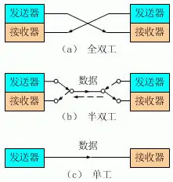
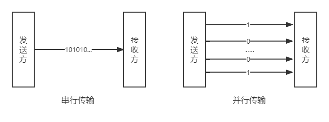
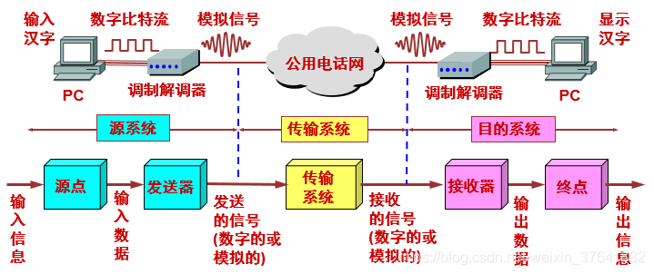
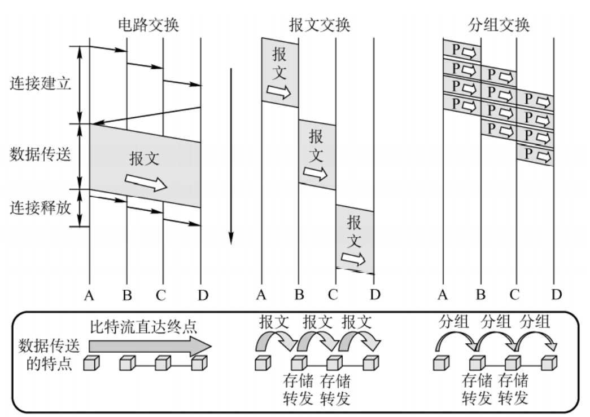

---
tags:
  - 408考研复习
  - 计算机网络
---

物理层
===

??? summary "物理层的功能"
    1. 为数据端设备提供传送数据的通路
    2. 传输数据

## 通信基础
!!! cite ""
	物理层解决如何在连接各种计算机的传输媒体上传播数据比特流。

### 数字通信的基本概念

数据（Data)
: 消息的载体，是对客观事实进行描述与记载的物理符号。在计算机网络中，数据通常可以理解为在网络中存储、处理和传输的二进制数字编码。

信号（Signal）
: 数据在传输过程中电信号的表现形式。可分为数字信号和模拟信号。

    * 模拟信号的电平连续变化
    * 数字信号的电平是离散的（0/1比特序列）

信道（Channel）
: 信号的通道，是任何通信系统最基本的组成部分，用来将发送设备的信号传送给接收端。分为传送数字脉冲信号（离散信号）的数字信道和传输连续模拟信号的模拟信道。

    * 按照传输媒介不同，信道可分有线信道和无线信道。

码元（Symbol）
: 承载信息量的基本符号单位。数字通信中常用时间间隔相同的符号表示一个二进制数字，这样时间间隔内的信号称为二进制码元，这个间隔被称作 **码元长度**。

    * k进制码元有k个离散状态。

速率（Rate）
: 数据的传输速率，表示单位时间内传输的数据量。

    * 码元速率：单位时间内数字通信系统内传输的码元个数（脉冲个数/信号变化次数），单位波特（Baud）。

        !!! info ""
            码元速率与进制数无关

    * 信息速率：单位时间内数字通信系统内传输的二进制码元个数，单位为比特每秒（b/s）。

        !!! example ""
            一个码元携带 n bit 信息量，则 M Baud 码元传输速率为 $M\times n$ bit/s 信息速率。

#### 三种通信方式
<figure markdown>

<figcaption>三种通信方式：单工、半双工、全双工</figcaption>
</figure>

单工
: 数据传输是单向的。一方固定为发送端，另一方固定为接收端，信息只能沿一个方向传输，使用一根传输线。

半双工
: 数据可以在一个信号载体的两个方向上传输，但是不能同时传输，使用同一根传输线。

全双工
: 任意一方在发送数据的同时也能接收数据，两者同步进行，使用两根传输线。

#### 两种数据传输方式
<figure markdown>

<figcaption>两种数据传输方式：串行传输、并行传输</figcaption>
</figure>

串行传输
: 使用一条数据线，将数据一位一位地依次传输，每一位数据占据一个固定的时间长度。只需要少数几条线就可以在系统间交换信息。

并行传输
: 数据以成组的方式，在多条并行信道上同时进行传输，是在传输中有多个数据位同时在设备之间进行的传输。

!!! summary "总结"
	串行传输速度慢，费用低，适合远距离传输。并行传输速度快，费用高，适合近距离传输。

### 数字通信的理论基础
1. 失真
    * 信号在传输过程中与原有信号或标准相比发生偏差。
    * 失真的一种现象：码间串扰
        * 码元传输太快了，接收端收到的信号波形失去了码元之间清晰的界限。
2. 奈氏准则（奈奎斯特定理）
	
    理想低通条件下，为了避免码间串扰，极限码元传输速率为 2W Baud，W是信道带宽，单位为Hz。此时，极限数据传输率为 $2W \log_2{V}$ bit/s，其中V为离散电平的数目。
	
	!!! note "注意"
		* 码元传输速率有上限，但是信息传输速率未作限制
		* 信道频带越宽，就可以用更高速率进行码元有效传输
   		* 提升传输速率的关键在于提高每个码元携带的比特数量（V）

3. 香农定理
	* 信号越强，则噪声影响相对较小 → 信噪比很重要！
    * 信噪比（S/N）= 信号平均功率/噪声平均功率，单位dB（分贝）
        
        $$
        dB（值）=10\log_{10}{(S/N)}
        $$

    * 在带宽受限且有噪声的信道中，为了不产生误差，信息传输速率有上限值 $W\log_2{(1+S/N)}$ bit/s，其中S/N为信噪比，单位为dB；W是信道带宽，单位为Hz。

	!!! note "注意"
		* 实际信道传输速率会低不少
		* W无上限或<s>S/N无上限</s>（这不太可能），那么极限传输速率也无上限
      
### 编码与调制
<figure markdown>

<figcaption>两台计算机的数据通信过程</figcaption>
</figure>

!!! quote ""
	要传输数据，但数据是不能直接传输的，必须转换成信号。而当我们要使用数据时，是不能直接使用信号的，需把信号转换成数据。

* 在不改变信号性质的前提下，仅对数字基带信号的波形进行变换，称为编码，编码后产生的信号仍为数字信号，可以在数字信道中传输
* 将数字基带信号的范围搬移到较高频段，并转换为模拟信号，称为调制，调制后产生的信号是模拟信号，模拟信号可以在模拟信道中传输
#### 数字数据→数字信号
1. 非归零编码NRZ
	* 低电平表示0，高电平表示1，表示完一个码元后电压不需要回到0
    * 存在发送方和接受方的同步问题
    * 归零编码RZ：信号电平在一个码元内要恢复到零
    * 反向不归零编码NRZI：信号电平翻转表示0，电平不变表示1
2. 曼彻斯特编码
	* 双相码：将一个码元分为相等的两部分
	* 正电压跳变表示0，负电压跳变表示1
3. 差分曼彻斯特编码
	* 修改形式的曼彻斯特编码
    * 每位的中间跳变只用来同步时钟信号。0或1的取值判断由起始处有无电压跳变表示，有跳变为0，无跳变为1。

#### 数字数据→模拟信号
模拟信号传输的都是在数字载波信号上完成的，与模拟信号调制为模拟信号的方法类似，可以利用调制频率、振幅和相位三种载波特性之一或组合。基本调制方法有：

幅移键控(Amplitude Shift Keying，ASK)
: 载波幅度随着基带信号的变化而变化。2ASK恒定振幅表示1，载波关闭表示0。

频移键控(Frequency Shift Keying，FSK)
: 载波频率随着基带信号的变化而变化。2FSK不同的两个频率表示0和1。

相移键控(Phase Shift Keying，PSK)
: 载波相位随着基带信号的变化而变化。2PSK不同的两个相位表示0和1。

QAM：结合ASK和PSK的调制方法。

#### 模拟数据→数字信号
模拟信号编码为数字信号最常见的就是跳冲编码调制（Pulse Code Modulation,PCM）。脉冲编码的过程为采样、量化和编码。

采样
: 对模拟信号进行周期性扫描，把时间上连续的信号变成时间上离散的信号。采样必须遵循奈奎斯特采样定理才能保证无失真地恢复原模拟信号。

	!!! tip "Nyquist采样定理"
		采样率 $f_s$ 必须大于等于被采样信号最高频率分量的两倍。即：$f_s\ge 2f_{N}$

量化
: 利用抽样值将其幅度离散，用先规定的一组电平值把抽样值用最接近的电平值来代替。规定的电平值通常用二进制表示。

编码
: 用一组二进制码组来表示每一个有固定电平的量化值。

	!!! info ""
		然而实际上量化是在编码过程中同时完成的，故编码过程也称为模/数变换，记作A/D。

#### 模拟信号→模拟信号
由于基降信号包含许多低频信息或直流信息，而很多传输介质并不能传输这些信息，因此需要使用调制器对基带信号进行调制。

1. 调幅（AM）：依据传输的原始模拟数据信号变化来调整载波的振幅。
2. 调频（FM）：依据传输的原始模拟数据信号变化来调整载波的频率。
3. 调相（PM）：依据传输的原始模拟数据信号变化来调整载波的初始相位。

### 数据交换方式
!!! quote "什么是数据交换"
	数据交换（Data Switching）是指在多个数据终端设备之间，为任意两个终端设备建立数据通信临时互连通路的过程。

	<figure markdown>
	
	<figcaption>电路交换、报文交换和分组交换的比较</figcaption>
	</figure>

#### 电路交换（Circuit Switching）
最典型的电路交换网络：电话网络

特征：通信双方独占其使用的通信资源。

#### 报文交换（Message Switching）
将要发送的数据整体作为报文，如一个文件，以报文为单位进行传输。采用 _存储+转发_ 的交换方式。

#### 分组交换（Package Switching）
将报文分成若干个小的分组，以分组为单位进行传输。采用 _存储+转发_ 的交换方式。

需要将报文拆分与重组，且每个分组需要添加分组头（存储分组的元信息）。

### 数据报与虚电路

|          对比          |                  虚电路                   |                    数据报                     |
|:--------------------:|:--------------------------------------:|:------------------------------------------:|
|        连接的建立         |                  必须有                   |                    不需要                     |
|         目的地址         |       仅在建立阶段使用，之后每个分组使用长度较短的虚电路号       |               每个分组都有完整的目的地址                |
|         路由选择         |          属于同一条虚电路的分组按照同一路由转发           |              每个分组独立进行路由选择和转发               |
|         分组顺序         |                保证分组有序到达                |                 不保证分组有序到达                  |
|         可靠性          |                可靠性由网络保证                |                 可靠性由用户主机保证                 |
|       对网络故障适应性       |          所有经过故障节点的虚电路均不能正常工作           |       出故障的节点丢失分组，其他分组路径选择发生变化，可以正常传输       |
|      差错处理和流量控制       |             可由分组交换网或用户主机负责             |           由用户主机进行流量控制，不保证数据报可靠性            |

#### 数据报方式
1. 数据报为网络层提供无连接服务。
2. 同一报文的不同分组可以由不同路径通过通信子网。
3. 同一报文的不同分组到达目的节点时可能出现乱序、重复及丢失现象。
4. 每一个分组在传输过程中都必须带有目的地址和源地址。

#### 虚电路方式
> 结合了电路交换和数据报方式的优点

1. 虚电路为网络层提供连接服务。
2. 一次通信的所有分组都通过虑电路顺序传送分组不需携带源地址、目的地址等信息包含虚电路号，相对数据报方式开销小，同一报文的不同分组到达目的结点时不会乱序、重复或丢失。
3. 分组通过虚电路上的每个节点时，节点只进行差错检测，不需进行路由选择。

## 传输介质
!!! info "什么是传输介质"
	介于发送和接收设备之间的物理通路（0层）
### 导向型传输介质
!!! info inline end "理解导向型传输介质"
	电磁波被导向沿着固定媒介传播（“火车”型）

1. 双绞线
	* 两根相互绝缘、并排 **绞合** 的铜导线

	    ??? faq "绞合的意义"
            每一根导线在传输中辐射出来的电波会被另一根线上发出的电波抵消，从而减少电磁干扰。

	* 根据有无屏蔽层，双绞线分为屏蔽双绞线（Shielded Twisted Pair，STP）与非屏蔽双绞线（Unshielded Twisted Pair，UTP）。屏蔽双绞线在双绞线与外层绝缘封套之间有一个金属屏蔽层。

2. 同轴电缆
	* 同轴电缆（Coaxial Cable）是一种电线及信号传输线，一般是由四层物料造成：最内里是一条导电铜线，线的外面有一层塑胶（作绝缘体、电介质之用）围拢，绝缘体外面又有一层薄的网状导电体（一般为铜或合金），然后导电体外面是最外层的绝缘物料作为外皮。
	* 基带同轴电缆可用于局域网，宽带同轴电缆可用于有线电视。
	* 抗干扰特性比双绞线稍微好一些。

3. 光纤
	* 光导纤维的简写，是一种由玻璃或塑料制成的纤维，可作为光传导工具。原理为光的全反射。
	* 优点：频带宽、损耗小、中继距离长、抗干扰性好、体积小、重量轻。

### 非导向型传输介质
!!! info inline end "理解非导向型传输介质"
	也称为无线通信或无限制传输，它们无需使用物理导体即可传输电磁波（“飞机”型）
1. 无线电波
	* 信号向所有方向传播，有较强穿透能力
	* 常用于移动通信：电话
2. 微波
	* 信号沿固定方向传播
	* 频率高、范围宽，因此数据率高
	* 常用于地面微波接力通信或卫星通信
3. 红外线、激光
	* 信号沿固定方向传播
	* 把要传输的信号转换为各自的信号格式（红外线信号/激光信号），再传播

### 物理层接口特性

=== "机械特性"
	主要定义物理连接的特性，规定物理连接时所采用的规格、引线的数目、引脚的数量和排列情况。

=== "电气特性"
	规定传输二进制位时，线路上信号的电压高低、阻抗匹配、传输速率和距离限制等。

=== "功能特性"
	指明某条线上出现的某一电平表示何种意义，接口部件的信号线的用途。

=== "规程/过程特性"
	主要定义各条物理线路的工作规程和时序关系。

## 物理层设备
!!! tip "存在原因"
	信道中传输的信号随着距离的增加而有所衰减，中继器和集线器可以解决信号衰减问题。

### 中继器（Repeater）
负责在两个节点的物理层上按位传递信息，完成信号的复制、整形和放大功能，从而延长信号传输距离。

!!! quote "5-4-3规则[^1]"
	在10M以太网中，网络总长度最多有5个子网段，4个中继器，最多有3个子网段可接网络设备。

### 集线器（Hub）
集线器是一种多端口的中继器，它可以将多个节点的信号复制到多个端口上，从而实现多个节点的连接。

!!! note ""
	集线器不可分割冲突域（遇到冲突就需要退避一段时间），故实际所连于其上的设备平分带宽。

[^1]: https://www.computernetworkingnotes.com/networking-tutorials/ethernet-5-4-3-rule-explained.html