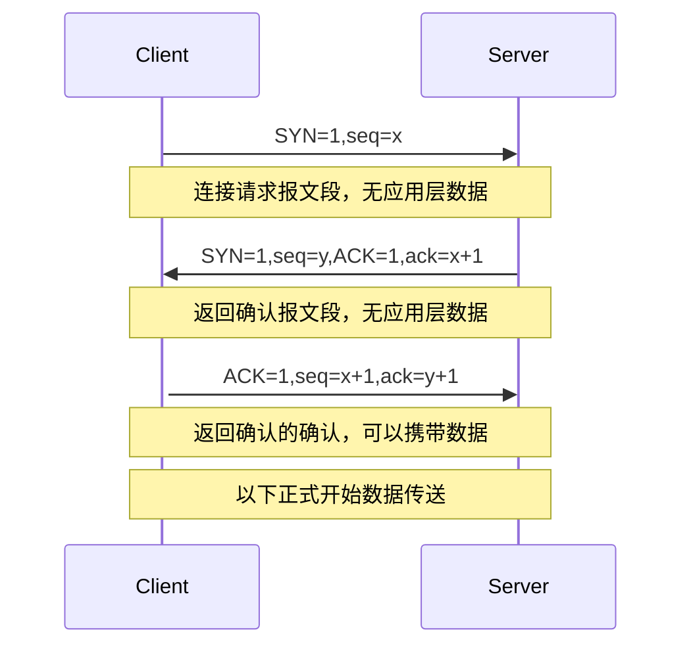
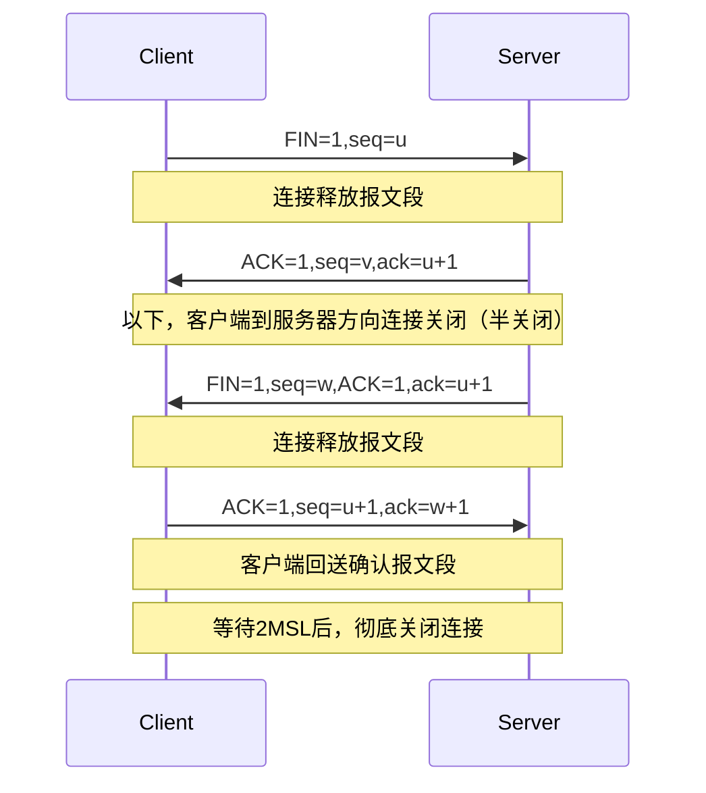
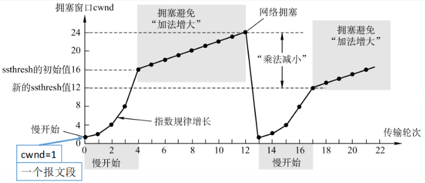
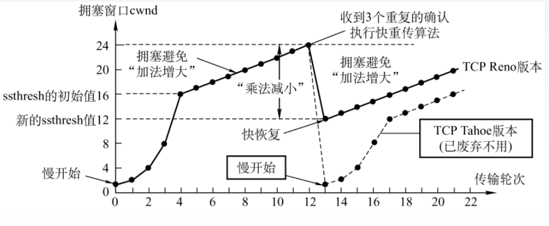

传输层
===

## 传输层提供的服务
### 功能
* 提供进程-进程（主机）之间的逻辑通信
* 复用和分用
* 传输层对收到的报文进行差错检测
### 寻址和端口
* 复用：应用层所有的应用进程都可以通过传输层传输到网络层
* 分用：传输层从网络层收到数据后交付指明的应用进程
* 逻辑端口（软件端口）
    * 标识主机的应用进程
    * 长度为16比特，能表示65535个不同端口号
        * 服务端使用
            * 0~1023：熟知端口号（TCP/IP使用）
        
                !!! info "一些常见协议的端口号"
				    | 协议名 | 端口号 |
                    |:--:|:--:|
                    |FTP|21|
                    |TELNET|23|
                    |SMTP|25|
                    |DNS|53|
                    |TFTP|69|
                    |HTTP|80|
                    |SNMP|161|

            * 1024~49151：登记端口号

        * 客户端使用：49152~65535，客户进程运行时动态选择

* 套接字（Socket）：唯一标识网络上的主机和其上一个进程 `(IP, port)`

### 无连接服务与面向连接服务
#### 面向连接服务
双方在通信前，事先建立一条虚拟的通信线路，经过建立连接、维护链接、释放连接三个过程。
#### 无连接服务
通信双方不需要事先建立通信线路，只有传输数据的过程。

!!! info "两种常见协议对比"
	| TCP | UDP |
	|:--:|:--:|
	|可靠| 不可靠|
    |面向连接|无连接|
    |时延大|时延小|
	|适用于大文件|适用于小文件|

## UDP 协议
!!! summary ""
	UDP 协议是一种无连接的（减少开销：8B，减少发送数据之前的时延）、不可靠的（最大努力交付）、面向报文（应用层给UDP多长，UDP就照样发送，即一次发送一个完整的报文）的传输层协议。在 IP 数据报服务之上添加了复用分用和差错检测的功能。

无拥塞控制，适合实时应用。
### UDP 数据报
``` title="用户数据报结构"
0                  15 16                 31
+--------------------+-------------------+
|    16位源端口号      |   16位目的端口号    |
+--------------------+-------------------+
|    16位UDP长度      |   16位UDP校验和     |
+--------------------+-------------------+
|                  数据                   |
+----------------------------------------+
```

* 除数据之外的部分属于 UDP 首部

	=== "源端口号"
		数据发送进程的标识
	=== "目的端口号"
		数据接收进程的标识
    === "数据报长度"
		整个UDP数据包的长度
	=== "校验和"
		用于判断数据报的传输是否有错

* 分用时，找不到对应的目的端口号，就丢弃报文，并给发送方发送 ICMP“端口不可达”差错报告保报文。
### UDP 校验
#### 校验和计算
1. 发送方将要校验的数据按16位为一组分组
	* 最后一组不足16位则填充0
2. 各组对应位相加
    * 如果有进位则加到低16位
3. 对最终结果取反码，所得结果即为校验和，填入校验位发送

!!! success ""
	接收方收到数据报后，将要校验的数据（以及校验和）分为16位一组，按位累加，如果累加的结果为全1，则认为数据报传输正确
#### 伪首部
``` title="伪首部结构"
0                           31位
+----------------------------+
|     源IP地址                |
+----------------------------+
|     目的IP地址              |
+----------------------------+
| 0  | 0x11（协议号）|数据报长度 |
+----------------------------+
```

伪首部只有在计算校验和时才出现，不向下传送也不向上递交。

## TCP 协议
!!! summary ""
	TCP 协议是一种面向连接（数据传送前建立连接，数据传输结束后释放连接）的、可靠的、基于字节流的传输层协议。

每一条TCP连接只能有两个端点（点对点），提供全双工通信。
### TCP 报文
``` title="TCP 报文段结构"
0                  15 16                 31
+--------------------+-------------------+
|    16位源端口号      |   16位目的端口号    |
+--------------------+-------------------+
|                 发送序号                 |
+----------------------------------------+
|                 确认序号                 |
+----------------------------------------+
|段头长度|保留| 控制位  |     窗口大小        |
+----------------------------------------+
|      校验和         |     紧急指针        |
+----------------------------------------+
|           选项（长度可变） |       填充    |
+--------------------+-------------------+
|                  数据                   |
+----------------------------------------+
```

=== "源端口号"
	数据发送进程的标识
=== "目的端口号"
	数据接收进程的标识
=== "发送序号"
	发送方发送的第一个字节的序号（seq）
=== "确认序号"
	期望收到对方下一个字节的序号，如果确认号为N，则到序号N-1为止的所有数据都已正确收到（ack）
=== "段头长度"
	首部长度，TCP报文段的数据起始处距离TCP报文段起始处有多远，以4字节为单位
=== "控制位"
	=== "紧急位URG"
		URG=1表明报文段携带紧急数据，不用在缓存中排队
	=== "确认位ACK"
		ACK=1表明确认序号有效
	=== "推送位PSH"
		PSH=1表明接收方应尽快将数据交给应用层
	=== "复位RST"
		RST=1表明应立即释放TCP连接并重新建立传输连接
	=== "同步位SYN"
		SYN=1表明这是一个连接请求或连接接受报文
	=== "终止位FIN"
		FIN=1表明此报文段的发送方的数据已经发送完毕，并要求释放TCP连接
=== "窗口大小"
	本端可以接收的字节数，即现在允许对方发送的数据量
=== "校验和"
	检验首部+数据，用于判断数据报的传输是否有错。要加上12B伪首部（协议号为0x6）
=== "紧急指针"
	在URG=1时，指示紧急数据的位置
=== "选项"
	用于TCP的增强功能，长度可变（0~40字节）
### TCP 连接管理


TCP 连接的建立采用客户服务器方式。
#### 连接建立【三次握手】

#### 连接释放【四次挥手】


!!! warning ""
	MSL是最长报文段寿命，即一个TCP报文段从源主机传输到目的主机的最长时间，由计时器设置，一般设置为120秒。
### TCP 可靠传输
* 校验（与UDP一样，增加伪首部）
* 序号（累计ACK确认之前的所有数据）
* 确认
* 重传（规定时间内没有确认就要重传，该规定时间一般为RTT环回时间，自适应）
### TCP 流量控制与拥塞控制
#### 流量控制
发送方根据<strong>接收方</strong>的反馈确定能够发送的数据量，因此不会出现因发送方发送速度过快而淹没接收方的情况。

* TCP 利用<strong>滑动窗口机制</strong>实现流量控制。根据缓存大小调整接收窗口`rwnd`，发送窗口`swnd`为`rwnd`和`cwnd`中较小的一个，`cwnd`为拥塞窗口，`cwnd`的值由拥塞控制算法决定。
* TCP 为每一个连接设有持续计时器，只要TCP连接一方收到对方的零窗口通知，就启动持续计时器
    * 每次持续计时器设置时间到期，发送一个零窗口探测报文段，要求接收方给出当前窗口值，若仍为0，则发送方重置持续计时器。
#### 拥塞控制
在<strong>网络中</strong>的负载过大时，源主机的TCP实体减小发送速率，以缓解网络中的拥塞情况。

##### 慢启动——拥塞避免
<figure markdown>

<figcaption>慢启动——拥塞避免曲线</figcaption>
</figure>

* 刚开始进行指数增长，到达 ssthresh 之后，进行加法增长。
* 遇到网络拥塞之后，降到初始值，重复之前的步骤。新的 ssthresh 设为拥塞时窗口大小的一半。
##### 快重传——快恢复
<figure markdown>

<figcaption>快重传——快恢复曲线</figcaption>
</figure>

* 前面的步骤和之前一样。不同的是降低拥塞窗口的时机和大小不同。如图所示，当收到3个重复的确认时，执行快重传算法，拥塞窗口降到原来的一半。