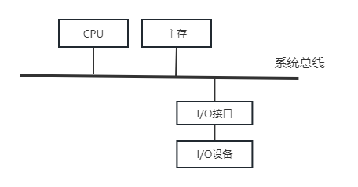
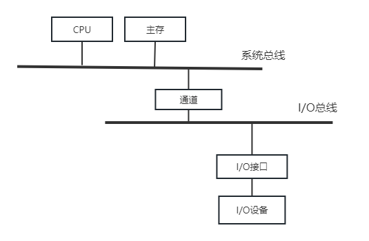
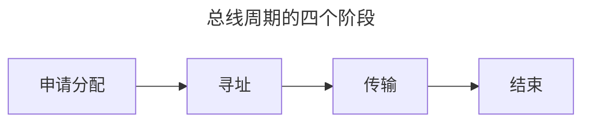
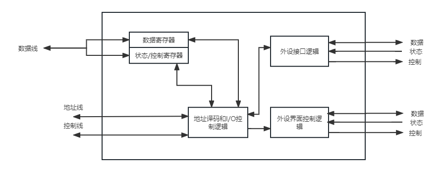
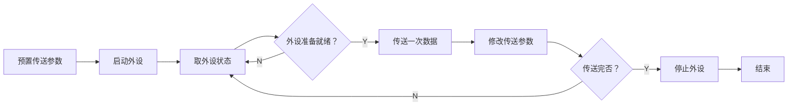
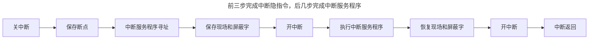

总线和输入输出系统
===

## 总线
### 基本概念
总线是构成计算机系统的互联机构，是多个系统功能部件之间进行数据传送的公共通路。

#### 分类
* 按照数据传送方向，可分为单向传输总线和双向传输总线
* 按照时序控制方式，可分为同步总线和异步总线
* 按照信号线功能，可分为数据总线、地址总线和控制总线
* 按照信号传输模式，可分为并行传输总线和串行传输总线
* 按照在计算机系统中所处的位置，可分为片内总线、系统总线、I/O总线和外部总线（通信总线）
* 按照用途分类，可分为内部总线、系统总线和I/O总线

#### 特性

机械特性
: 尺寸、形状、管脚数、排列顺序

功能特性
: 每根传输线的功能

电气特性
: 每一根线上信号的传递方向和有效电平范围

时间特性
: 信号的时序关系

### 组成和性能指标
#### 总线的组成

数据总线
: 传送数据信息

地址总线
: 传送地址

控制总线
: 传送控制信号和时序

电源线和地线
: 为总线上的器件提供电源和地线

#### 总线的性能指标

总线频率
: 反映总线工作的速率（f），单位通常是MHz

总线宽度
: 数据总线的位数（w），单位是b（位），通常与处理器字长相一致

总线传输速率
: 总线上可传输的数据总量，单位是MB/s。总线传输速率=总线频率*总线宽度/8

#### 总线的其它参数指标

同步方式
: 同步、异步

多路复用
: 地址线和数据线能否共用一条物理线

信号线数量
: 数据线、控制线和地址线的总和

总线控制方式
: 传输方式、配置方式、中断分配和仲裁方式等

#### 总线的连接方式
##### 单总线结构
使用单一的系统总线来连接CPU、主存和I/O设备。

<figure markdown>

<figcaption>单总线结构示意图</figcaption>
</figure>

!!! success ""
    结构简单，成本低，易于接入新的设备

!!! failure ""
    带宽低、负载重，多个部件只能争用唯一的总线，且不支持并发传送操作

!!! summary "特点"
    * 连接在总线上的逻辑部件必须高速运行
    * 当CPU取一条指令时，首先将程序计数器PC中的地址一起送至总线上，但只有地址与总线传输的地址相对应的设备才会执行数据传送操作
    * 对输入/输出设备的操作，完全与对主存的操作方法一样
    * 某些外围设备也可以指定地址
    * 容易扩展成多CPU系统

##### 多总线结构
单总线系统的信息传送效率和吞吐量受到很大限制，因此产生了多总线结构。

<figure markdown>

<figcaption>双总线结构（带通道）</figcaption>
</figure>

!!! summary "多总线结构特点"
    * CPU与cache之间采用高速CPU总线，主存连在系统总线上，通过桥，CPU总线、系统总线和高速总线彼此相连
    * 高速总线通过扩充总线接口与扩充总线相连，扩充总线可以连接串行工作方式的 I/O 设备
    * 多总线结构中，高速、中速、低速设备连接到不同的总线上同时进行工作，提高了总线的效率和吞吐量
    * 存储总线的增加减轻了系统总线的负担，提高了并行性
    * 由于外设和内存处于不同的总线，需要增加I/O指令

### 事务和定时
#### 总线周期

=== "申请分配"
    由需要使用总线的主模块（或主设备）提出申请，经总线仲裁机构决定将下一传输周期的总线使用权授予某一申请者。也可将此阶段细分为传输请求和总线仲裁两个阶段。
=== "寻址"
    获得使用权的主模块通过总线发出本次要访问的从模块的地址及有关命令，启动参与本次传输的从模块。
=== "传输"
    主模块和从模块进行数据交换，可单向或双向进行数据传送。
=== "结束"
    主模块的有关信息均从系统总线上撤除，让出总线使用权。

#### 总线定时
> 总线定时是指总线在双方交换数据的过程中需要时间上配合关系的控制，这种控制称为总线定时，它的实质是一种协议或规则

##### 同步定时方式
!!! summary ""
    总线控制器采用一个统一的时钟信号来协调发送和接收双方的传送定时关系，适用于总线长度较短及总线所接部件存取时间比较接近的系统

[//]: # (todo 同步读、同步写时序图)

!!! success ""
    传送速度快，总线控制逻辑简单

!!! failure ""
    主从设备需要强制同步，不灵活

##### 异步定时方式
!!! summary ""
    主设备提出交换信息的“请求”信号，经接口传送到从设备；从设备接到主设备的请求后，通过接口向主设备发出“回答”信号

* 不互锁：主从设备在发送信号无需等待对方确认，当自己认为对方收到信号后便开始发送下一次信号
* 半互锁：主设备发送请求信号后必须收到从设备的应答才可以撤销请求信号，存在互锁关系。而从设备发出应答信号后无需等待主设备确认便可撤销其回答信号，不存在互锁关系
* 全互锁：当主模块发送请求信号后必须等待从模块发送应答信号后才能撤销信号，又互锁关系。当从模块发送应答信号后必须等待主模块确认，当收到确认信号后才能撤销信号，也存在互锁关系

!!! success ""
    总线周期长度可变，能保证两个工作速度相差很大的部件或设备之间可靠地进行信息交换，自动适应时间的配合

!!! failure ""
    比同步控制方式稍复杂一些，速度比同步定时方式慢

## I/O接口
### 基本概念
I/O 接口是指 CPU、主存和外围设备之间通过系统总线进行连接的标准化逻辑部件

I/O 接口的主要功能

* 实现主机和外设的通信联络控制
* 进行地址译码和设备选择
* 实现数据缓冲
* 信号格式转换
* 传送控制命令和状态信息

<figure markdown>

<figcaption>基本结构</figcaption>
</figure>

### I/O端口及其编址
I/O 端口是指接口电路中可被 CPU 直接访问的寄存器，主要有数据端口、状态端口和控制端口

|      |  可读  |  可写  |
|:----:|:----:|:----:|
| 数据端口 |  ✅   |  ✅   |
| 状态端口 |  ✅   |  ❌   |
| 控制端口 |  ❌   |  ✅   |

#### 编址方式
=== "统一编址（存储器映射）"
    把 I/O 端口当作存储器的单元进行地址分配，用统一的访存指令访问 I/O 端口。

    !!! success ""
        CPU访问I/O端口灵活、方便，有较大编址空间

    !!! failure ""
        占用存储器地址，使内容容量变小，利用存储器编址的I/O设备进行数据输入输出等操作速度较慢

=== "独立编址（I/O映射）"
    把 I/O 端口当作特殊的寄存器，用专门的 I/O 指令访问 I/O 端口。

    !!! success ""
        程序编制清晰，易于理解

    !!! failure ""
        一般只能对端口进行传送操作，控制复杂
### 外部设备
> 除了主机以外，能与计算机交换信息的装置（外围设备）

#### 输入设备
##### 键盘
通过“按键”输入各种信息，每个键起开关作用，所以称为键开关。

* 字符键
* 控制功能键
##### 鼠标
控制显示器上光标移动的输入设备。分为机械式鼠标和光电式鼠标。

基本原理都是将鼠标的移动距离和方向变为脉冲信号发送给计算机，计算机再把这些信号转换为显示器光标的坐标信息。
#### 输出设备
##### 显示设备
以可见光的形式传递和处理信息的设备。

* 指标
    - 分辨率（宽x高）：显示器所能表示的像素个数，越高越清晰
    - 灰度级（二进制位）：黑白显示器中所显示的像素点的亮暗差别，或彩色显示器中颜色的不同
    - 刷新频率：显示器每秒刷新的次数，越高越不容易闪烁
    - 刷新存储器，容量M=分辨率r\*灰度级g；带宽=容量\*刷新频率

=== "字符显示器"
    以点阵为基础，构造字符。点阵存入 ROM 构成的字符发生器中

=== "图形显示器"
    用计算机手段表示现实世界的各种事物（主观图像）

=== "图像显示器"
    显示由摄像机摄取下来存入计算机的数字图像（客观图像）

=== "CRT 显示器"
    采用光栅扫描的方式，电子束从左上角开始沿水平方向从左向右有规律地扫描整个屏幕，扫描到右下角的时候重新从左上角开始扫描

=== "LCD 显示器"
    利用偏光板的特性，上下两盘栅栏之间互相垂直的偏光板之间充满液晶，而这其中的液晶起到了改变偏振角和控制通过的光数量的作用，总而言之，不加电压，光源可以通过，加了电压，光源不能通过，利用电场控制液晶转动，从而形成不同的亮度

##### 打印机
将计算机的处理结果以字符或图形的形式输出到纸质介质上长期保存

按照打印工作原理区分：击打式打印机、非击打式打印机

按照打印工作方式区分：串行打印机（逐字）、行式打印机（逐行）、页式打印机（逐页）
#### 外存储器
##### 磁表面存储器
存储容量大，位成本低，在计算机系统中作为辅助大容量存储器使用

* 写入：给磁头通电流，利用磁头使载磁体（盘片）具有不同的磁化状态，两种状态对应二进制信息的1和0
* 读出：磁头不通电流，判别不同的磁化状态

技术指标

容量
: 整个磁介质存储器所能存储的二进制信息总量，存储容量和存储密度直接相关

记录密度
: 又称为存储密度，可以用：道密度、位密度以及面密度(道密度×位密度)来表示

平均存取时间
: 存取时间包括寻道时间、旋转延迟和传输时间

数据传输率
: 磁介质存储器在单位时间内向主机传送数据的位数或字节数

##### 磁盘阵列
有组织的把一些硬盘驱动器给组装在一起，分隔交叉存储，并行访问

!!! success ""
    * 成本低，功耗小，传输速率高
    * 提供容错功能

RAID 的分级

| RAID 级别 |          名称           | 数据磁盘数 | 可正常工作的最多失效磁盘数 | 检测磁盘数 |
|:-------:|:---------------------:| :------: | :------------------: | :------: |
| RAID 0  |      无冗余无校验磁盘阵列       | 8 | 0 | 0 |
| RAID 1  |        镜像磁盘阵列         | 8 | 1 | 8 |
| RAID 2  |       纠错汉明码磁盘阵列       | 8 | 1 | 4 |
| RAID 3  |     位交叉奇偶校验的磁盘阵列      | 8 | 1 | 1 |
| RAID 4  |      块奇偶校验的磁盘阵列       | 8 | 1 | 1 |
| RAID 5  |    无独立校验盘的奇偶校验磁盘阵列    | 8 | 1 | 1 |
| RAID 6  |   双维无独立礁岩盘的奇偶校验磁盘阵列   | 8 | 2 | 2 |

##### 光盘存储器
利用光学原理进行读、写

=== "CD-ROM"
    只读型光盘，容量为 700MB 左右。光盘上的信息以坑点形式分布。

=== "CD-R"
    一次写，多次读光盘。允许多次分段写数据。

=== "CD-RW"
    可重复写光盘。使用特殊水晶复合物作为记录介质。

=== "DVD-ROM"
    两面都可写数据的光盘，容量为 4.7GB 左右。

=== "蓝光盘"
    存储容量可达 25GB，波长越短，存储容量越大。

##### 固态硬盘
高性能闪存技术硬盘
## I/O控制方式
### 程序查询方式
在这种方式下，数据在 CPU 和外围设备之间的传送完全靠计算机程序编制。CPU 有”踏步“等待现象，CPU与I/O串行工作

!!! success ""
    接口设计简单，设备量少

!!! failure ""
    CPU 等待时间较多，一段时间内只能与一台外设交换信息，效率较低

### 程序中断方式
!!! summary "中断"
    中断指计算机执行现行程序过程中，出现某些急需处理的情况或特殊请求，CPU 暂停现行程序转而去处理那些异常情况或特殊请求，处理完毕后 CPU 又自动返回现行程序的断点处继续执行原程序剩下的操作

CPU 在程序中安排好在某时刻启动外设，然后 CPU 继续执行原来的程序，一旦外设准备就绪便主动向 CPU 发出中断请求，而 CPU 若可以立即响应则暂时中止正在执行的程序，转而去执行中断服务为外设服务，在中断服务程序中完成一次主机与外设的数据传输，然后返回原来的程序

#### 中断请求
中断源向CPU发出中断请求信号

* 内中断和外中断
    - 外中断一般指来自处理器和内存以外的部件引起的中断。如I/O中断、定时器中断等
    - 内中断指处理器和内存内部产生的中断。如程序运算引起的错误
* 硬件中断和软件中断
    - 硬件中断是指通过外部的硬件产生的中断，属于外中断
    - 软件中断是指通过某条指令产生的中断，属于内中断
* 非屏蔽中断和可屏蔽中断
    - 非屏蔽中断是一种硬件中断，此种中断通过不可屏蔽中断请求 NMI（Non Maskable Interrupt）控制，不受中断标志位 IF 的影响，即使在 IF=0（关中断）的情况下也会被响应
    - 可屏蔽中断也是一种硬件中断，通过中断请求标记触发器 INTR 控制，且受中断标志位 IF 的影响，在关中断情况下不接受中断请求

#### 中断判优
* 中断系统在任一瞬间只能响应一个中断请求，而中断源发出的中断请求往往是随机的，因此当多个中断源同时发出中断请求时，就需要中断判优逻辑确定响应哪个中断源的中断请求
* 中断判优可硬件实现也可软件实现
    - 硬件实现通过硬件排队器实现，可设置在 CPU 中，又可以分散在各个中断源中
    - 软件实现通过查询程序实现
* 优先级
    - 硬件中断>软件中断
    - 非屏蔽中断>可屏蔽中断
    - DMA请求>I/O设备传送的中断请求
    - 高速设备>低速设备
    - 输入设备>输出设备
    - 实时设备>普通设备

!!! summary "CPU响应中断必须满足的条件"
    - [x] 存在中断请求
    - [x] CPU允许中断，且处于开中断状态（IF=1）
    - [x] 一条指令执行完毕，且没有更紧迫的任务

#### 中断隐指令
* CPU 响应中断到执行中断服务程序，期间好需要经过一些由硬件直接实现的操作，这些操作就被叫做中断隐指令
* 中断隐指令并不是真正的系统指令，没有操作码，是一种不允许也不可能为用户使用的特殊指令
* 包括
    - 关中断
    - 保存断点
    - 引出中断服务程序
#### 中断向量
* 中断服务程序的入口地址又称为中断向量。系统会将所有的中断向量集中存储到存储器的某个区域，该区域因此称为中断向量表
* 在 CPU 响应中断后，中断硬件自动将中断向量地址传送到 CPU，由 CPU 实现进程切换，此方法称为中断向量法，采用中断向量法的中断称为向量中断
#### 中断处理过程

#### 多重中断和中断屏蔽字
* CPU 在执行某个中断服务程序时，出现新的更高优先级的中断请求，此时若 CPU 对新的中断请求不予响应，此种中断称为单重中断；若 CPU 暂停现行中断服务程序，去处理新的中断请求，则称为多重中断，也即嵌套中断
* 中断屏蔽技术主要用于多重中断，CPU 必须满足下面的条件才能具有多重中断的能力
    - [x] 中断服务程序中提前设置开中断指令
    - [x] 优先级别高的中断源有权中断优先级别低的中断源
* 每个中断源都有一个屏蔽触发器，1 表示屏蔽该中断源的请求，0 表示可以正常申请，所有屏蔽触发器组合起来构成一个屏蔽字寄存器，其内容称为屏蔽字
### DMA方式
该方式是一种完全由硬件进行成组信息传送的控制方式，在外设与内存之间开辟一条“直接数据通道”，使外设不通过 CPU 而直接与内存进行数据传送，从而提高数据传送速率

!!! summary "特点"
    * 主存可被CPU和外设访问。
    * 在数据块传送时，主存地址的确定、传送数据的计数等由硬件电路直接实现。
    * 主存中开辟专门的缓冲区，及时供给和接收外设的数据。
    * CPU 和外设并行工作。
    * 在传送开始前需要通过程序进行预处理，结束后要通过中断方式进行后处理。

#### DMA控制器
DMA 方式下对数据传送过程中进行控制的硬件称为 DMA 控制器，I/O 设备需要传输数据时，DMA 控制器向 CPU 提出 DMA 传送请求，CPU 响应后让出系统总线，DMA 控制器接管总线并进行数据传输。

* 主存地址计数器：存放要交换数据的主存地址
* 传送长度计数器：记录传送数据的长度，计数溢出时，数据即传送完毕，自动发中断请求信号
* 数据缓冲寄存器：暂存每次传送的数据
* DMA 请求触发器：每当 I/O 设备准备好数据后，给出一个控制信号，使 DMA 请求触发器置位
* “控制/状态”逻辑：由控制和时序电路及状态标志组成，用于指定传送方向，修改传送参数，并对 DMA 请求信号和 CPU 响应信号进行协调和同步
* 中断机构：当一个数据块传送完毕后触发中断机构，向 CPU 提出中断请求

#### DMA 访存方式
为了避免当 I/O 设备和 CPU 同时访问主存时，产生冲突，DMA 控制器和 CPU 通常采用以下三种方式访存

停止 CPU 访存
: 当进行 DMA 传送时，要求 CPU 放弃地址线、数据线和有关控制线的使用权，当 DMA 传送结束后，CPU 才恢复原有权力；此方式下，当 DMA 传送数据时，CPU 基本处于不工作状态或保持原始状态

DMA 与 CPU 交替访存
: 将一个 CPU 周期划分为两个子周期，一个供 DMA 访存，一个供 CPU 访存。此方式下不需要总线使用权的申请、建立和归还过程，总线使用权通过分时控制。适用于 CPU 的工作周期比主存存取周期长的情况

周期挪用（周期窃取）
: 前两种方式的折中

#### DMA 传送过程

=== "预处理阶段"
    * 由 CPU 执行几条输入输出指令，测试设备状态
    * 向 DMA 控制器的设备地址寄存器中送入设备号并启动设备
    * 向内存地址计数器送入起始地址
    * 向字计数器送入交换的数据字个数

=== "DMA 传送阶段"
    * 外设准备好一次数据传送后，接口向主机发DMA请求。
    * CPU响应DMA请求，把总线使用权让给DMA控制器。DMA控制器控制源、目的端口准备传送数据。
    * DMA周期挪用一次，交换一个数据信息。
    * 归还总线使用权，修改主存地址指针和传送计数值。
    * 判断这批数据是否传送完毕：是，结束该工作阶段；没有，开始传送下一个数据。

=== "后处理阶段"
    * DMA 向主机发出中断请求，CPU 执行服务程序查询 DMA 接口状态，根据状态进行不同的处理

!!! summary "DMA 方式与中断方式的区别"
    |  | 中断 | DMA |
    |:--:|:--:|:--:|
    | 中断 CPU 的时机 | 在每个数据传送完成之后中断 CPU | 一批数据传送结束时中断 CPU |
    | 数据传送 | 由 CPU 控制完成 | 在 DMA 控制器下完成 |
    | 核心 | 以 CPU 为核心 | 以存储器为核心（因此可与 CPU 并行工作）|
    | 传输单位 | 以字节为单位 | 以数据块为单位 |
