中央处理器（CPU）
===

## CPU 的功能和基本结构
### CPU的功能
<figure markdown>
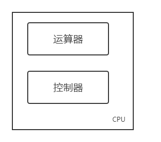
<figcaption>CPU的基本结构</figcaption>
</figure>

指令控制
: 程序是一个指令序列，这些指令的相互顺序不能任意颠倒，必须严格按程序规定的顺序进行，因此，保证指令按顺序执行程序是CPU的首要任务。

操作控制
: CPU管理并产生由内存取出的每条指令的操作信号，把各种操作信号送往相应的部件，从而控制这些部件按指令的要求进行动作。

时间控制
: 对各种操作实施时间上的定时。

数据加工
: 对数据进行算术运算和逻辑运算处理，是CPU的根本任务。

中断处理 
: 由于接收到来自外围硬件（相对于中央处理器和内存）的异步信号或来自软件的同步信号，而进行相应的硬件／软件处理。发出这样的信号称为进行中断请求（interrupt request，IRQ）。

### CPU 的基本结构
#### 运算器
<figure markdown>
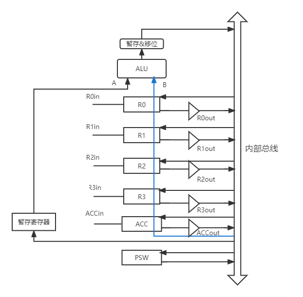
<figcaption>运算器对数据进行加工</figcaption>
</figure>

=== "算术逻辑单元 ALU"
	用来执行算术运算和逻辑运算。

=== "通用寄存器组"
	用于存放操作数（源操作数、目的操作数和中间结果）和各种地址信息。

=== "暂存寄存器"
	用于暂存从主存读来的数据，防止破坏原有内容。

=== "累加寄存器 ACC"
	用于暂存ALU运算的结果。

=== "程序状态字寄存器 PSW"
	保存由算术指令和逻辑指令运算或测试结果建立的各种条件代码。

=== "移位器"
	用于加速移位操作。

#### 控制器
<figure markdown>
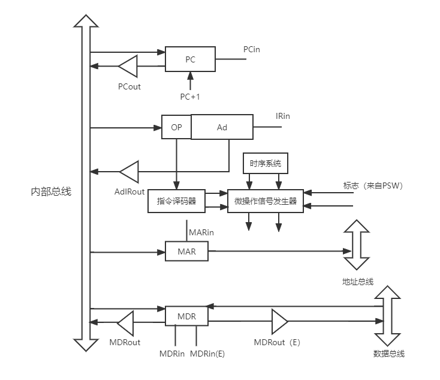
<figcaption>控制器协调并控制计算机各部件执行程序的指令序列</figcaption>
</figure>

=== "程序计数器PC"
	指出下一条指令在主存中的地址。

=== "指令寄存器IR"
	保存当前正在执行的一条指令。

=== "指令译码器ID"
	对操作码字段进行译码。

=== "微操作信号发生器"
	称为控制单元CU。

	> 微操作是指令可分解的最基本操作。

=== "时序系统"
	产生一定的时序信号，保证机器的各个功能部件有节奏地进行信息传送，加工、信息储存。

=== "存储器地址寄存器MAR"	
	用来保存数据被传输到的位置的地址或者数据来源位置的地址。

=== "存储器数据寄存器MDR"
	用来保存要被写入地址单元或者从地址单元读入的数据。

!!! info "用户可见（可编程）的寄存器"
	通用寄存器组、PSW、PC

!!! info "用户不可见（不可编程）的寄存器"
	MAR、MDR、IF、暂存寄存器

## 指令周期的数据流
### 指令周期
* CPU从主存种每取出并执行一条指令所需的全部时间，由若干个机器周期（CPU周期）表示，一个机器周期包含若干时钟周期（节拍/T周期/CPU时钟周期）
    * 时钟周期是CPU操作的最基本单位。
    * 每个指令周期内机器周期数可以不等，每个机器周期内的节拍数也可以不等。
* 一条指令周期中：
    * 空指令NOP包含：取指
    * 加法指令ADD、乘法指令MUL包含：取指、执行，其中乘法指令执行时间稍长
    * 间接寻址指令包含：取指、间址、执行
    * 带中断周期的指令包含：指令执行 + 中断部分
### 指令周期流程
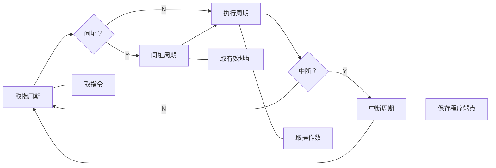
#### 取指周期
!!! abstract ""
	根据PC中的内容取出指令代码并存放于IR中。

1. 当前指令的地址送至存储器地址寄存器：`(PC)->MAR`
2. CU发出控制信号（读），经控制总线传到主存：`1->R`
3. 将MAR所指主存内容经数据总线送入MDR：`M(MAR)->MDR`
4. MDR中的内容（指令）送入IR：`(MDR)->IR`
5. CU发出控制信号，形成下一条指令地址：`(PC)+1->PC`
#### 间址周期
!!! abstract ""
	根据IR中指令地址码取得操作数有效地址。

1. 指令地址码送入MAR：`Ad(IR)->MAR` 或 `Ad(MDR)->MAR`
2. CU发出控制信号（读），经控制总线传到主存：`1->R`
3. 将MAR所指主存内容经数据总线送入MDR：`M(MAR)->MDR`
4. 【可选】有效地址送入指令地址码字段：`MDR->Ad(IR)`
    
    ??? question "为什么这一步可选？"
	    下一步（执行周期）也可以从MDR中取得地址码。

#### 执行周期
!!! abstract ""
	根据指令字的操作码和操作数进行相应的操作。

!!! warning "注意"
	执行周期的指令有很多种，无法使用统一的数据流图表示。
#### 中断周期
!!! abstract ""
	保存断点，送中断向量，处理中断请求。

1. CU控制SP地址减1，修改后的地址送入MAR：`(SP)-1->SP,(SP)->MAR` 或 `断点地址->MAR`
2. CU发出控制信号，启动主存写操作：`1->W`
3. 断点送入MDR：`(PC)->MDR`
4. CU控制将中断服务程序入口地址送入PC：`向量地址->PC`

!!! warning "tip"
	前三步主要进行了断点的保存。
### 指令执行方案
#### 单指令周期
对所有指令选用相同的执行时间完成，指令周期取决于执行时间最长指令的执行时间。

* 串行执行，使用计数器实现
#### 多指令周期
对不同指令选用不同的执行时间完成。

* 串行执行，但需要更复杂的硬件设计。
#### 流水线方案
在每一个时钟周期启动一条指令，尽量让多条指令同时运行，但各自处于不同的运行步骤中。

* 指令之间并行执行。
## 数据通路的功能和基本结构
### CPU内部总线方式
CPU内部共同通路，同一台计算机系统的各部件共享，可以存在一条或多条。

* 寄存器之间数据传送
    ```
    (PC)->MAR
    (PC)->Bus  PCout有效
    Bus->MAR   MARin有效
    ```
* 主存与CPU之间的数据传送
    ```
    读指令：
    1. (PC)->Bus->MAR
       PCout, MARin 有效
    2，1->R
       CU 发出读命令
    3. MEM(MAR)->MDR
       MDRin 有效
    4. (MDR)->Bus->IR
       MDRout, IRin 有效
    ```
* 执行算术或逻辑运算
    ```
    加法指令
    1. AD(IR)->Bus->MAR
       ADout, MARin 有效 / ADIRout, MARin 有效
    2. 1->R 读命令
    3. MEM(MAR)->Bus->MDR
       MDRin 有效
    4. (MDR)->Bus->Y
       MDRout, Yin 有效，操作数 -> Y
    5. (ACC)+(Y)->Z
       ACCout 和 Yin 有效，操作数 -> Z，CU 向 ALU 发送加命令
    6， Z(->Bus->)ACC
       Zout, ACCin 有效，结果 -> ACC
    ```
### 专用数据通路方式
各部件之间有一条直接通路，由控制信号控制。根据运行时数据和地址流动方向安排线路。

<figure markdown>
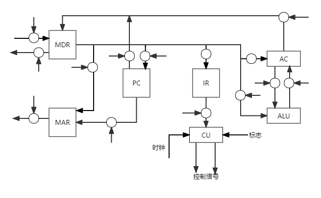
<figcaption>注意，图中的小圆点是三态门</figcaption>
</figure>

## 控制器的结构和功能
### 控制器的功能
<figure markdown>
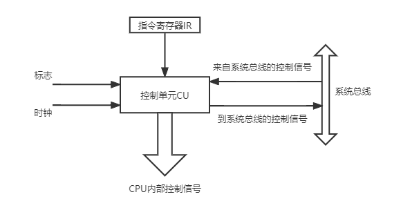
<figcaption>控制器的输入和输出</figcaption>
</figure>

* 取指和指示下一条指令在主存的位置
* 对指令进行译码或测试，产生相应信号
* 指挥并控制CPU、主存、输入输出设备之间的数据流动方向
### 控制器的结构
#### 硬布线（组合逻辑电路+触发器实现）
<figure markdown>
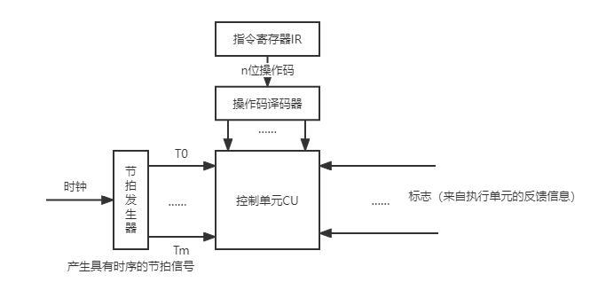
<figcaption>硬布线结构简图</figcaption>
</figure>

##### 设计步骤
1. 分析每个操作的微操作序列
2. 选择CPU控制方式
    * 同步控制方式：来自统一的时钟信号，控制电路简单，运行慢
    * 异步控制方式：不存在基准时标信号，应答联络方式，控制电路复杂，运行快
    * 联合控制方式：大部分同步，小部分异步
3. 安排微操作时序
    * 安排原则
		1. 微操作的先后顺序不更改
		2. 被控对象不同的微操作，尽量安排在同一节拍完成
		3. 占用时间较短的微操作，尽量安排在同一节拍完成，可以有先后顺序
4. 电路设计
    * 列出操作时间表
    * 写出微操作命令的最简表达式
    * 画出逻辑图
#### 微程序
事先将微操作控制信号存储在专门的存储器（控制存储器）中，将每一条机器指令编写成一个微程序。

* 微命令是直接作用于部件或控制门电路的控制命令，是构成控制信号序列的最小单位。
* 微操作是微命令的执行过程，微程序是一系列微指令的有序集合。
* 从控制存储器中读取一条微指令并执行相应的微操作所需的时间称为微周期。在微程序控制的机器中，微周期是它的主要时序信号。通常一个时钟周期为一个微周期。
* 存放微程序的存储器是控制存储器CM。也称为微程序存储器。
* 互斥性微命令编码为不同命令，相容性微命令编码为相同命令。
##### 微程序控制器结构
<figure markdown>
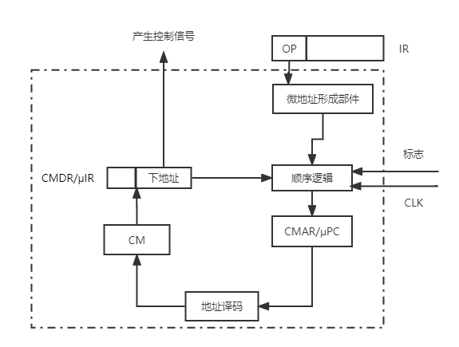
<figcaption>微程序控制器结构</figcaption>
</figure>

微指令格式

水平型
: 一次能定义并执行多个并行操作，组成为微操作码和微地址码

垂直型
: 由微操作码字段规定微指令功能，组成为微操作码、目的地址和源地址

混合型：水平型+垂直型

!!! info "两种微指令对比"
	|| 微指令 | 微程序 |
	|:--|:--:|:--:|
    |水平型|长，编写麻烦|短，执行快|
	|垂直型|短，便于编写|长，执行慢|

编码方式

!!! tip "目标"
	保证速度，缩短字长

直接编码
: 每一位代表一个微操作命令，某位为 `1` 表示控制信号有效。执行快，并行性好，但是字长过长。

字段直接编码
: 将微指令操作控制字段划分为若干个子字段，每个子字段内的所有微命令进行统一编码。

	!!! info "划分原则"
		* 互斥微命令划分在同一字段，相容微命令划分在不同字段。
		* 留一个编码状态（如`000`）代表不进行操作。
		* 每个子字段定义的微命令不要太多。

字段间接编码
: 某些微命令由另一个字段中某些微命令解释。进一步缩短了指令字长，但是并行性差。

##### 地址形成方式
1. 下地址字段指出（断定方式）
2. 机器指令操作码字段
3. 增量计数器：`(CMAR)+1->CMAR`
4. 分支转移
5. 测试网络
6. 由硬件产生入口地址

##### 设计步骤
1. 分析每个操作的微操作序列
2. 写出微操作指令和节拍安排
    
    !!! tip ""
   		在已有指令基础上，需要补充的微操作指令有
		
        * 取指阶段：`Ad(CMDR)->CMAR;OP(IR)->CMAR`
		* 执行阶段：`Ad(CMDR)->CMAR`

3. 确定微指令格式
4. 编写微指令码点

## 指令流水线
一条指令的执行过程可以分为多个阶段（或过程），根据计算机的不同，分法也不同。

一般分为取指、分析、执行三步

=== "取指"
	根据PC内容访问主存储器，取出一条指令送到IR中。

=== "分析"
	对指令操作码进行译码，按照给定寻址方式和地址字段中的内容形成操作数的有效地址EA，并从有效地址EA中取出操作数。

=== "执行"
	根据操作码字段，完成指令规定的功能，即把运算结果写到通用寄存器或主存中。

!!! info "提示"
	也可以把每条指令的执行过程分为4个或5个阶段，分成5个阶段也是常见的做法。

以下设取指、分析、执行3个阶段的时间相等，用t表示，按以下几种执行方式分析n条指令的执行时间。

### 顺序执行方式（串行执行方式）
传统冯·诺伊曼机采用顺序执行方式，又称串行执行方式。总耗时 $T=n\times 3t=3nt$

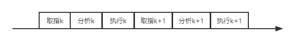

!!! success ""
	控制简单，硬件代价小

!!! failure ""
	执行指令速度慢，各部件利用率低
### 一次重叠执行方式
总耗时 $T=3t+(n-1)\times 2t=(2n+1)t$

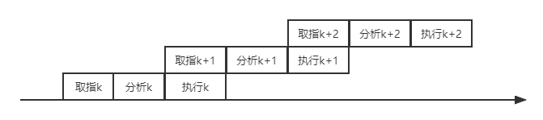

!!! success ""
	程序的执行时间缩短了，各功能部件的利用率明细提高

!!! failure ""
	硬件开销较大，且控制过程也变得复杂
### 二次重叠执行方式
这是一种理想的指令执行方式，处理机中同时有3条指令在执行。总耗时 $T=3t+(n-1)\times t=(2+n)t$

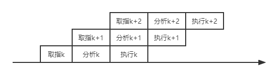
### 流水线表示方法
#### 指令执行过程图
主要用于分析指令执行过程以及影响流水线的因素。

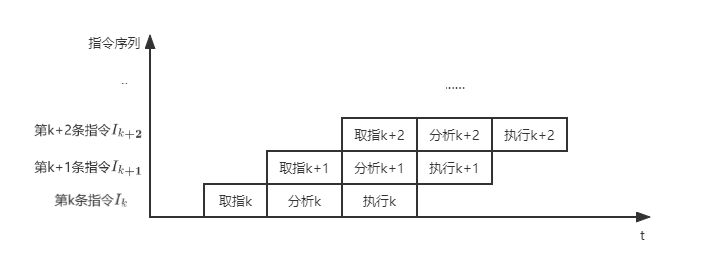
#### 时空图
主要用于分析流水线的性能。

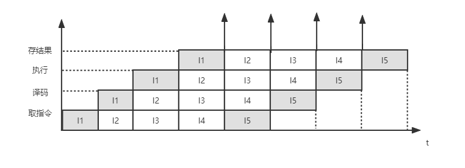

!!! abstract "什么是空间"
	不同阶段所对应的不同的硬件资源
### 性能指标
理想情况下，流水线时空图如下：
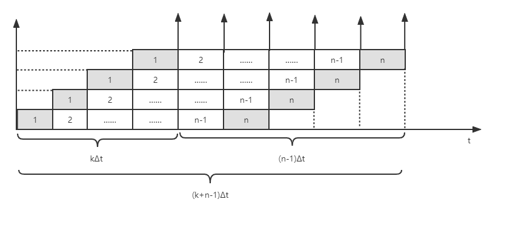
#### 吞吐率
吞吐率是在单位时间内流水线所完成的任务数量，即单位时间内流水线所完成的指令条数。

设任务数为n，处理完成n个任务所用的时间为 $T_k$，则计算流水线吞吐率（TP）最基本的公式为

$$
TP=\dfrac{n}{T_k}
$$

$T_k=(k+n-1)\Delta t$，实际吞吐率为 $TP=\dfrac{n}{(k+n-1)\Delta t}$。当连续输入的任务 $n\to \infty$ 时，最大吞吐率 $TP_{max}=\dfrac{1}{\delta t}$

一条指令执行分为k个阶段，每个阶段耗时 $\Delta t$，一般取 $\Delta t$ 为一个时钟周期

#### 加速比
完成同样一批任务，**不使用流水线所用时间** 与 **使用流水线所用时间** 之比。

设 $T_0$ 表示不使用流水线时的执行时间，$T_k$ 表示使用流水线时的执行时间，则计算流水线加速比S的基本公式为

$$
S=\dfrac{T_0}{T_k}
$$

单独完成一个任务耗时为 $k\Delta t$，则顺序完成n个任务耗时 $T_0=nk\Delta t$，实际加速比为 $S=\dfrac{kn\Delta t}{(k+n-1)\Delta t}=\dfrac{kn}{k+n-1}$。

当连续输入的任务 $n\to \infty$ 时，最大加速比为 $S_{max}=k$

#### 效率
流水线的设备利用率称为流水线的效率。在时空图上，定义为 **完成n个任务占用的时空区有效面积** 与 **n个任务所用的时间与k个流水段所围成的时空区总面积** 之比。一般公式为

$$
E=\dfrac{T_0}{kT_k}
$$

当连续输入的任务 $n\to \infty$ 时，最高效率 $E_{max}=1$
### 影响流水线的因素
#### 结构相关（资源冲突）
多条指令在同一时刻争用同一资源。

!!! success "解决方案"
	* 后一相关指令暂停一周期
	* 资源重复配置
#### 数据相关（数据冲突）
在一个程序中，存在必须等待前一条指令执行完才能执行后一条指令的情况。

!!! success "解决方案"
	* 相关指令及其后续暂停一至几个周期（硬件阻塞stall或软件插入NOP）
	* 数据旁路技术
	* 编译优化

类型：RAW、WAR、WAW
#### 控制相关（控制冲突）
同时遇到转移指令和其他改变PC值的指令。

!!! success "解决方案"
    * 尽早判别转移
    * 预取两个方向上的目标指令
    * 提高目标方向的猜准率
### 流水线分类
1. 流水线使用级别：部件功能级、处理机级和处理机间级流水线
	* 部件功能级：将复杂算术逻辑组成流水线工作方式
    * 处理机级：把一条指令解释过程分成多个子过程
    * 处理机间级：宏流水，每一个处理机完成某一专门任务，各个处理机所得到的结果需存放在与下一个处理机所共享的存储器中
2. 流水线可以完成的功能：单功能流水线和多功能流水线
	* 单功能流水线：只能完成一种固定的专门功能的流水线
	* 多功能流水线：通过各段间不同的连接方式能完成多种功能的流水线
3. 同一时间内各段之间连接的方式：动态流水线和静态流水线
	* 静态流水线：在同一时间内，流水线的各段只能按照同一种功能的连接方式工作
    * 动态流水线：在同一时间内，当某些段正在实现某种运算时，另一些段正在进行另一种运算
4. 各个功能段之间是否有反馈信号：线性流水线和非线性流水线
    * 线性流水线：从输入到输出，每个功能段只经过一次，不存在反馈回路
    * 非线性流水线：从输入到输出，某些功能段将数次通过流水线，存在反馈回路，适合递归运算
### 多发技术
1. 超标量技术
    * 每个时钟周期内并发多条独立指令
    * 不能调整指令的执行顺序
2. 超流水技术
    * 一个时钟周期内再分段，一个功能部件使用多次
    * 不能调整指令的执行顺序
3. 超长指令字
	* 将多条能并行操作的指令组合成一条
## 多处理器
### SISD
* 单指令流：CPU同一时间段内只能处理一个指令序列
* 单数据流：每一条指令只能处理特定的一两个数据
### SIMD
* 单指令流：每一个时刻同样只能执行一条指令
* 多数据流：一条指令的执行可以同时处理很多个具有相同特征的数据，对这些数据的处理都是相同的
### MIMD
* 多指令流：每个处理器都有自己的指令流
* 多数据流：一条指令的执行可以同时处理很多个具有相同特征的数据，对这些数据的处理都是相同的
* 可以组成共享存储多处理器SMP系统或多计算机系统（分布式计算系统）
### 向量处理器
是面向向量型并行计算，以流水线结构为主的并行处理计算机系统
### 硬件多线程
||细粒度多线程|粗粒度多线程|同时多线程SMT|
|:--|:--:|:--:|:--:|
|指令发射|轮流发射|连续几个时钟周期，都发射同一线程的指令序列，流水线阻塞时，切换另一个线程|一个时钟周期内，同时发射多个线程的指令|
|线程切换频率|每个时钟周期切换一次|流水线阻塞时切换一次||
|线程切换代价|低|高，需要重载||
|并行性|指令级并行，线程间不并行|指令级并行，线程间不并行|指令级并行，线程级并行|

### 多核处理器
多个处理单元集成到单个CPU中，每个处理单元称为一个核（core）

* 可共用/不共用cache
* 线程（多进程）执行，真正的多线程
### 共享内存多处理器
具有共享的单一物理地址空间的多处理器