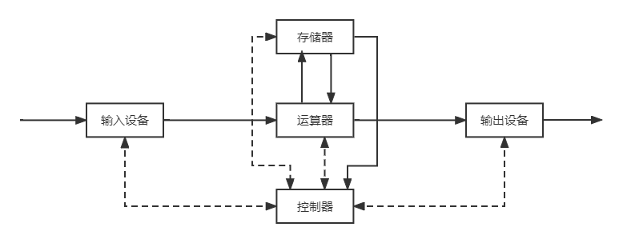
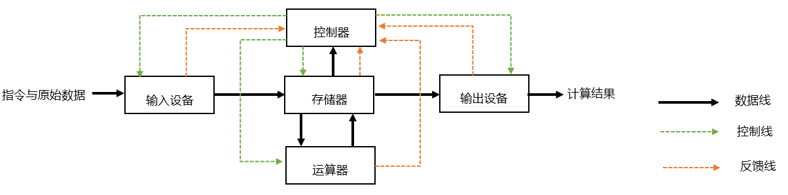

---
tags:
  - 408考研复习
  - 计算机组成原理
---

计算机系统概述
===

## 计算机发展历程

### 计算机的分类

||数字计算机|模拟计算机|
|:--|:--:|:--:|
|数据表示方式|数字0/1|电压|
|计算方式|数字计数|电压组合和测量值|
|控制方式|程序控制|盘上连线|
|精度|高|低|
|数据存储量|大|小|
|逻辑判断能力|强|无|

* 数字计算机

    专用计算机
    : 专用机是最有效、最经济和最快速的计算机，但是它的适应性很差
    
    通用计算机
    : 通用计算机适应性很大，但是牺牲了效率、速度和经济性

    * 通用计算机根据体积、简易性、功率损耗、性能指标、数据存储容量、指令系统规模和机器价格等可以分为：超级计算机、大型机、服务器、工作站、微型机、单片机

### 计算机发展历程
* 计算机的五代变化

    === "1946-1957"
        电子管计算机：数据处理

    === "1958-1964"
        晶体管计算机：工业控制

    === "1965-1971"
        中小规模集成电路计算机：小型计算机

    === "1972-1990"
        大规模和超大规模集成电路计算机：微型计算机

    === "1991开始"
        巨大规模集成电路计算机：单片机

    * 新一代的计算机：光计算机，生物计算机，量子计算机等等

* 半导体存储器的发展

    === "20世纪50~60年代"
        所有计算机存储器都是由微小的铁磁体环

    === "1970年"
        仙童半导体公司生产出了第一个较大容量半导体存储器

    === "1970年以后"
        半导体存储器经历了11代：单个芯片1KB、4KB、16KB、64KB、256KB、1MB、4MB、16MB、64MB、256MB、1GB。

* 微处理器的发展

    === "1971-1973年"
        * 此阶段为4位或低档8位微处理器
        * Intel 4004是第一个将CPU所有元件都放在同一块芯片内的产品，是4位微处理器，标志着微处理器的诞生
        * Intel 8008是第一个8位微处理器

    === "1974-1977年"
        * 此阶段为中高档的8位微处理器
        * 典型微处理器有Intel 8080/8085，Zilog公司的Z80和Motorola公司的M6800

    === "1978-1984年"
        * 此阶段为16位微处理器时代
        * Intel 8086、8088、80286

    === "1985-1992年"
        * 32位高档微处理器时代
        * Intel 80386DX、80486（突破100万个晶体管）

    === "1993-2005年"
        * 64位高档微处理器，奔腾（pentium）系列微处理器时代
        * MMX（MultiMedia Extensions，多媒体扩展指令集）是英特尔于1996年发明的一项多媒体指令增强技术这些指令可以一次处理多个数据，MMX技术在软件的配合下，就可以得到更好的性能。

    === "2005年至今"
        * 酷睿（core）系列微处理器时代

### 计算机系统的层次结构
* 数字计算机的基本要素

    控制器
    : 控制计算机的各部件有条不紊地工作，具体来说，就是按照一定的顺序一条接着一条取指令、指令译码、执行指令。

    运算器
    : 进行算术运算和逻辑运算，通常称为ALU（算术逻辑运算部件） 
        
    !!! note "注意"
        计算机内部参与运算的数字是二进制的

    存储器
    : 存储数据和程序（指令）

    !!! note "注意"
        * 存储单元：保存一个数据的若干个触发器
        * 地址：每个存储单元的编号
        * 存储容量：所有存储单元的总数

    输入设备
    : 把人们所熟悉的某种信息形式变换为机器内部所能接收和识别的二进制信息形式

    输出设备
    : 把计算机处理的结果变换为人或其他机器设备所能接收和识别的信息形式

    !!! summary "适配器和总线"
        适配器：它使得被连接的外围设备通过系统总线与主机进行联系，以便使主机和外围设备并行协调地工作
        总线：构成计算机系统的骨架，是多个系统部件之间进行数据传送的公共通路。

* 硬件组成

    === "冯·诺依曼型计算机"
        <figure markdown>
        
        <figcaption>冯诺依曼计算机以运算器为中心</figcaption>
        </figure>

        * 指令
            * 指令和数据用二进制表示，混合存储在同一存储器中（存储程序）
            * 指令由操作码和地址码组成
        * 五大部件：包括控制器、运算器、存储器、输入设备、输出设备

    === "现代计算机"
        <figure markdown>
        
        <figcaption>现代计算机以存储器为中心</figcaption>
        </figure>

        * 现代计算机已将运算器和控制器集成为CPU
            * 由于运算器和控制器被集成为CPU，所以可认为现代计算机由三大部分组成：CPU、I/O设备(Input/Output Equipment)、主存储器(MM, Main Memory)。

* 性能指标

    === "吞吐量"
        一台计算机在某一时间间隔内能够处理的信息量

    === "响应时间"
        从输入有效到系统产生响应之间的时间度量

    === "利用率"
        在给定的时间间隔内系统被实际使用的时间所占的比率

    === "机器字长"
        * CPU一次能处理数据的位数 = 寄存器位数 = 数据总线长度(MAR)
        * “x位系统”

    === "存储容量"
        * 存储器可存储的二进制数据总数 = 存储单元个数 &times; 存储字长
        * 容量 = 数据总线长度(MAR) &times; 数据总线宽度(MDR)

    === "运算速度"
        依赖于机器的主频、操作类型、存储器访问时间等

        === "主频/时钟周期"
            * CPU的工作节拍受主时钟控制，主时钟产生固定频率的时钟，主时钟的频率($f$)叫做CPU的主频，用来表示微处理器的运行速度，主频的单位是MHz、GHz
            * 主频的倒数称为CPU时钟周期（T），度量单位是微秒、纳秒

        === "CPU 执行时间"
            表示CPU执行一般程序所占用的CPU时间，可用下式计算

            $$
            CPU 执行时间  = CPU时钟周期数 \times CPU 时钟周期
            $$

        === "CPI"
            表示执行一条指令所需的平均时钟周期数

            $$
            CPI = 执行某段程序所需的CPU时钟周期数 \div 程序包含的指令条数
            $$

        === "MIPS"
            每秒能执行多少百万条指令

            $$
            MIPS=指令数÷程序执行时间÷ 10^6
            $$

        === "MFLOPS"
            * FLOPS：每秒钟浮点运算次数
                - $FLOPS=程序中的浮点操作次数 \div 程序执行时间$
            * MFLOPS：每秒百万次浮点运算次数
                - $MFLOPS=程序中的浮点操作次数 \div 程序执行时间 \div 10^6$

* 软件组成

    系统软件
    : 用来简化程序设计，简化使用方法，提高计算机的使用效率，发挥和扩大计算机的功能及用途。

    应用软件
    : 用户利用计算机来解决某些问题而编制的程序。

* 多级结构

    第一级：微程序设计级或逻辑电路级
    : 由机器硬件直接执行微指令
    
    第二级：一般机器级
    : 由微程序解释机器指令系统实现
    
    第三级：操作系统级
    : 由操作系统程序实现。这些操作系统由机器指令和广义指令组成
    
    第四级：汇编语言级
    : 给程序人员提供一种符号形式语言，以减少程序编写的复杂性。这一级由汇编程序支持和执行
    
    第五级：高级语言级
    : 面向用户的，为方便用户编写应用程序而设置的。由各种高级语言编译程序支持和执行
