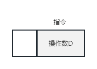
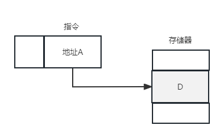
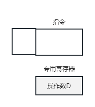
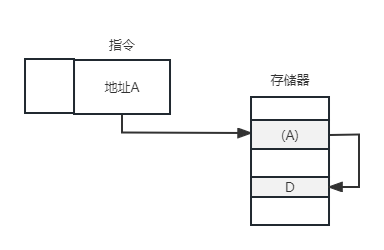
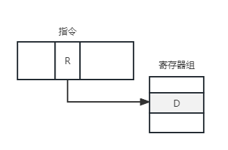
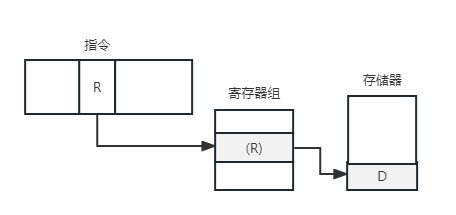
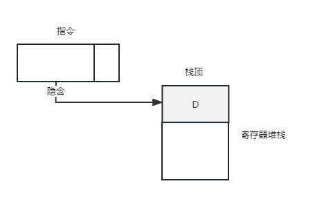
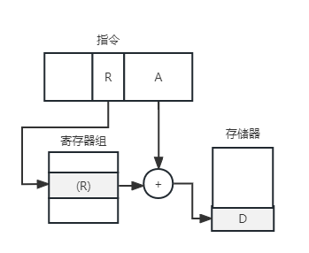

指令系统
===

## 指令系统的基本概念

!!! summary ""
    一台计算机中所有机器指令的集合，称为这台计算机的指令系统。

计算机的程序是由一系列机器指令组成的。

## 指令格式
指令格式通常由操作码字段和地址码字段组成。

### 操作码OP
操作码表征指令的操作特性和功能。

* 操作码字段位数取决于计算机指令系统的规模。

### 地址码A
地址码指定参与操作的操作数的地址。

* 根据一条指令中有几个操作数地址，可以将该指令称为几操作数指令或几地址指令。

    !!! info ""
        以下设指令字长和存储字长均为32位，操作码占8位

    === "四地址指令"
        `(A1) OP (A2) -> A3`，A4指向下一条指令地址。4次访存，寻址范围 $2^6=64$
    
    === "三地址指令"
        `(A1) OP (A2) -> A3`，四地址中的A4被PC代替。4次访存，寻址范围扩大至 $2^8=256$
    
    === "二地址指令"
        `(A1) OP (A2) -> A1 或 A2`，三地址中的A3被A1或A2代替。4次访存，寻址范围扩大至 $2^{12}=4K$
    
    === "一地址指令"
        `(ACC) OP (A1) -> ACC`（访存2次）或 `OP(A1) -> A1`（访存3次），寻址范围 $2^{24}=16M$
    
    === "零地址指令"
        只有操作码，没有地址码。如NOP、停机、关中断，栈顶、次栈顶指令。

* 一个指令字中包含二进制代码的位数，称为指令字长度。机器字长是指计算机能直接处理的二进制数据的位数。
    - 单字长指令：指令字长度等于机器字长
    - 半字长指令：指令字长度等于半个机器字长
    - 双字长指令：指令字长度等于两个机器字长

### 定长操作码指令格式
在指令字的最高位部分分配固定的若干位表示操作码。若操作码n位，可以表示 $2^n$ 条指令

!!! success ""
    简化了计算机硬件设计，提高了指令译码和识别速度

!!! danger ""
    留给表示操作数地址的位数有限

### 扩展操作码指令格式
全部指令的操作码字段位数不固定，且分散在指令字的不同位置上

!!! success ""
    指令字长有限的前提下仍保持比较丰富的指令种类

!!! danger ""
    增加了指令译码和分析的难度，使控制器设计复杂化

## 寻址方式
### 指令的寻址方式
#### 顺序寻址
执行一段程序时，通常是一条指令接一条指令的顺序进行，称为顺序寻址。为此，需要使用程序计数器PC来计数指令的顺序号。
#### 跳跃寻址
当程序转移执行的顺序时，指令寻址采用跳跃寻址，此时下条指令的地址码由本指令给出。
### 操作数的寻址方式
形成操作数有效地址的方法称为寻址方式。
```text 
+----------+----------+----------+
|  操作码   | 寻址特征   | 形式地址  |
+----------+----------+----------+
```
#### 有效地址
* 形式地址A：”偏移量“，指令中给出的操作数地址
* 有效地址EA：操作数的真实地址
#### 常见寻址方式
<!-- todo 示意图 -->

=== "立即寻址"
    

    * 指令地址字段指出的不是操作数的地址，而是操作数本身
    * 执行时不访存

=== "直接寻址"
    

    * 在指令格式的地址字段直接指出操作数在内存的地址A
    * 执行阶段访存一次

=== "隐含寻址"
    

    * 指令中隐含操作数的地址

=== "间接寻址"
    

    * 指令地址字段中的形式地址A不是操作数的真正地址，而是操作数地址的指示器
    * 执行阶段访存两次

=== "寄存器寻址"
    

    * 操作数放在CPU的通用寄存器中
    * 执行阶段不访存

=== "寄存器间接寻址"
    

    * 操作数放在CPU的通用寄存器中，指示器放在CPU的通用寄存器中
    * 执行阶段访存一次

=== "堆栈寻址"
    

    * SP：栈顶地址
    * 进栈PUSH：`(SP)-1->SP`
    * 出栈POP：`(SP)+1->SP`

=== "偏移寻址"
    

    * 直接寻址和寄存器间接寻址方式的结合
    * 常用的偏移寻址方法
        - 相对寻址：`EA=A+(PC)`，隐含引用的专用寄存器是程序计数器PC
        - 基址寻址：`EA=A+(BR)`，被引用的专用寄存器含有存储器地址，地址字段含有一个相对于该地址的偏移量
        - 变址寻址：`EA=A+(IX)`，被引用的专用寄存器含有对主存地址的正偏移量

=== "块寻址"
    * 一次传送多个字节的寻址方式 `(块起始地址,块长度)`
=== "段寻址"
    * 段寄存器+寄存器（16位偏移量）形成20位物理地址
## CISC和RISC的基本概念
### CISC
复杂指令计算机系统称为CISC，复杂庞大，字长不固定，通用寄存器较少，绝大多数采用微程序控制，难以编译优化

!!! tip ""
    X86架构的CPU是CISC

### RISC
> 最常使用的简单指令仅占指令总数的20%，但在程序中出现的频率高达80%

精简指令计算机系统称为RISC，简单，字长固定，采用组合逻辑控制，可以优化编译

!!! tip ""
    ARM、MIPS架构的CPU是RISC