存储器
===

## 存储器的分类

### 存储介质

* 半导体存储器：TTL、MOS
* 磁表面存储器：磁盘、磁鼓、磁带
* 磁芯
* 光盘

### 存取方式

* 存储时间与存储单元的物理位置无关（随机存储器）：RAM、ROM
* 存储时间与存储单元的物理位置有关（串行存储器）：磁盘、磁带

### 存储内容可变性

* 只读存储器：ROM
* 既能读出又能写入：RAM

### 信息易失性

* 易失性存储器：RAM
    - 断电后信息消失
    - 又分静态RAM（SRAM）和动态RAM（DRAM）
* 非易失性存储器：ROM、PROM、EPROM、EEPROM
    - 断电后仍然能保存信息
    - PROM允许一次编程，写入后不可改变
    - EPROM和EEPROM都允许多次编程

### 系统中的作用

* 主存储器
* 高速缓冲存储器（cache）
* 辅助存储器
* 闪存Flash

## 存储器的层次结构

!!! tip ""
    存储器同时兼顾容量大、速度快、成本低是困难的，故计算机系统中采用多级存储器体系结构

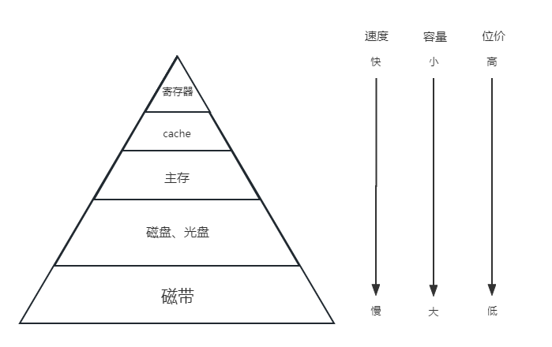

=== "高速缓冲存储器"
    计算机系统中的一个高速小容量半导体存储器。存取速度快，但存储容量小。

=== "主存储器"
    计算机系统主要的存储器。能和cache交换数据和指令。

=== "外存储器"
    大容量辅助存储器。存储容量大，位成本低。

### 多级存储

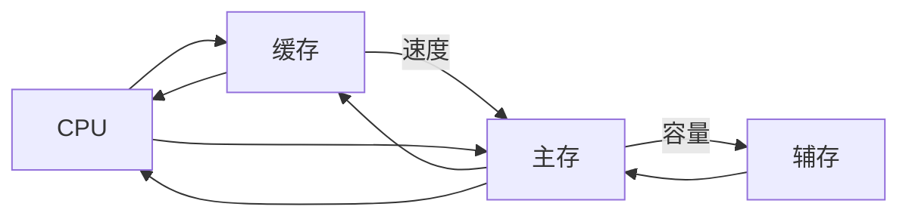

CPU约10ns，缓存约20ns，主存约200ns，辅存约10ms

## 半导体随机存取存储器

??? summary "动态RAM（DRAM）和静态RAM（SRAM）的比较"
    | | DRAM | SRAM |
    |:--:|:--:|:--:|
    |存储原理|电容|触发器|
    |芯片引脚|少|多|
    |功耗|小|大|
    |价格|低|高|
    |速度|慢|快|
    |刷新|有|无|

半导体存储芯片主要由存储矩阵、译码驱动电路和读/写电路组成。
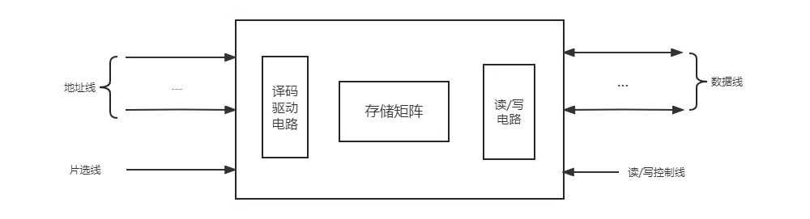

* 片选线：选择存储芯片
* 读/写控制线：进行读/写操作
* 译码驱动：将地址总线的地址送来的地址号翻译成对应存储单元的选择信号
    <!-- todo 配图 -->
    - 线选法（单译码）：一根字选线对应一根存储单元
    - 重合法（双译码）：将线选法中单一的地址译码器分成了行地址译码器和列地址译码器，行和列的交汇处共同锁定一个单元

### SRAM 存储器

<!-- todo SRAM示意图 -->
双稳态触发器（6管MOS）存储信息，非破坏性读出，断电丢失。

SRAM采用二级译码方式，将地址分为x向、y向两部分，第一级进行x向、y向独立译码，然后在存储阵列中完成第二级译码

=== "读操作"
    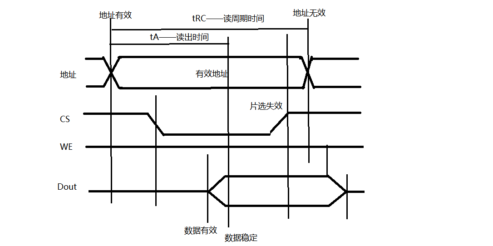
    
    * 读操作时，必须保证片选信号为低电平，读写信号为高电平。

=== "写操作"
    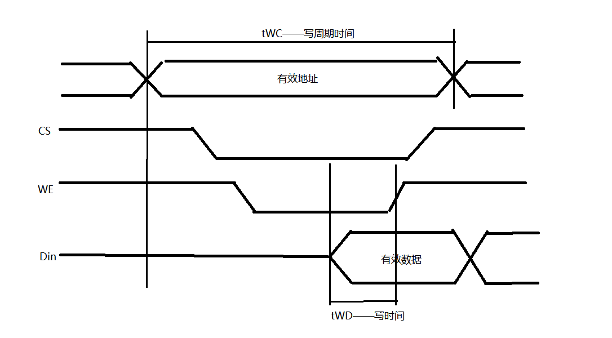
    
    * 执行写操作时，读写信号为低电平。

#### SRAM 芯片例子

<figure markdown>
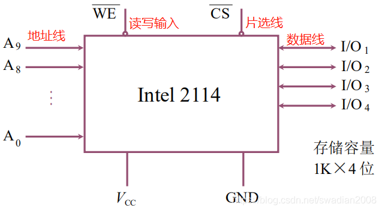
<figcaption>Intel 2114 RAM芯片结构</figcaption>
</figure>

1Kx4位，由4096个基本单元电路组成

### DRAM 存储器

使用电容上的电荷存储信息，分为三管式和单管式两种。

=== "读操作"
    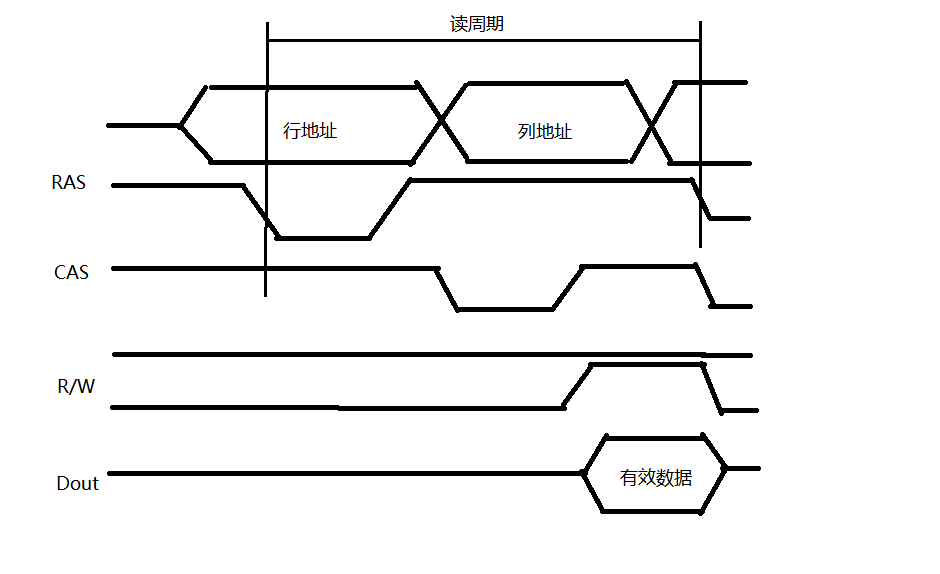

=== "写操作"
    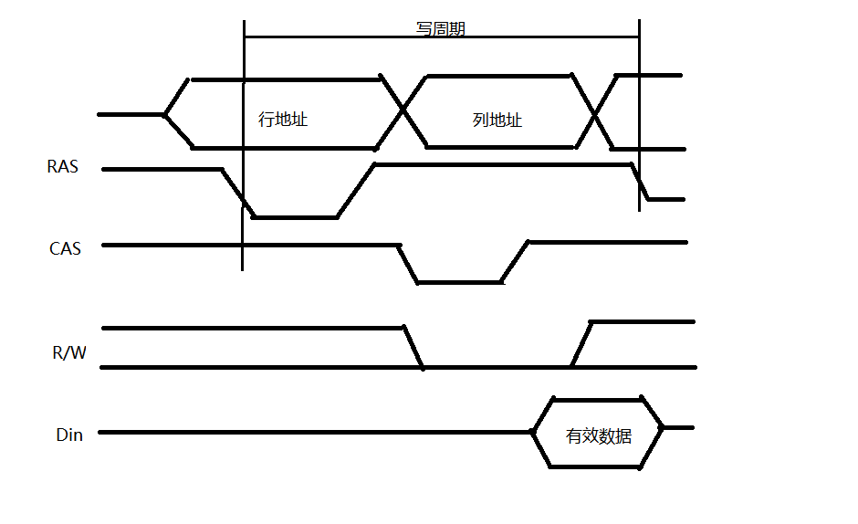

#### 刷新

<figure markdown>
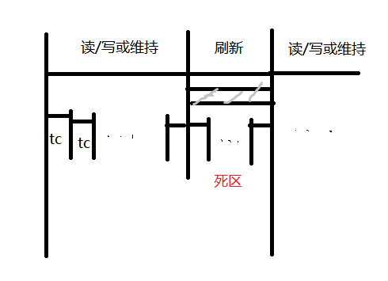
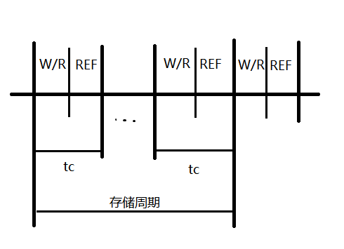
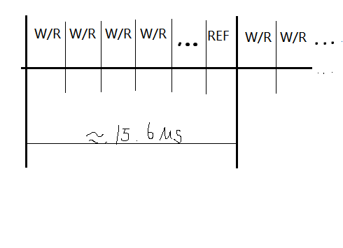
<figcaption>三种刷新方法</figcaption>
</figure>

* 集中刷新：在规定的一个刷新周期内，对全部存储单元逐行进行刷新
    - 刷新的时候不能进行读写，称为“死区“
* 分散刷新：对每行存取单元的刷新分散到每个存储周期完成
    - 好处是没有死区
* 异步刷新：分散刷新与集中刷新相结合

!!! summary ""
    对于128x128矩阵的存储芯片进行刷新，存储周期为0.5μs，刷新周期为2ms：

	- 集中刷新需要64μs刷新时间，可计算“死区”所占比率为 $128\div 400\times 100\% =3.2\%$
	- （读写周期为0.5μs，存储周期为1μs）分散刷新需要128μs刷新时间
	- 异步刷新每隔 $2000\mu s\div 128\approx 15.6\mu s$ 刷新一行，每行用 0.5μs 用来刷新，死时间也为0.5μs

### 只读存储器 ROM

工作时只能读出，不能写入。其中存储的原始数据，必须在它工作之前写入。主要分为掩模ROM和可编程ROM两类。

结构简单，可靠性高

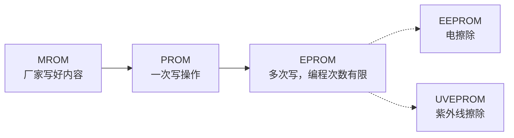

### 闪速存储器 Flash

计算机电擦除，价格便宜，集成度高，擦除速度快

* 浮空栅上带许多电子（负电荷）存储0，不带电荷存储1

!!! tip "固态硬盘SSD"
    基于闪存使用电子存储芯片阵列制成的硬盘

## 主存储器

### 并行存储器

!!! summary ""
    提高CPU访问存储器的速度，需要空间或时间上并行

#### 双端口存储器

<figure markdown>
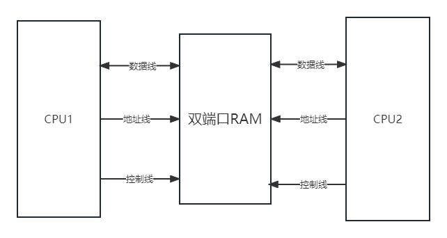
<figcaption>双端口存储器示意图</figcaption>
</figure>

两个CPU同时异步地访问RAM。

??? faq "为什么要异步访问"
    两个CPU同时对相同地址访存时，在以下两种情况会发生错误：
    * 两个端口同时对同一地址单元写入数据
    * 两个端口同时对同一地址单元进行操作，一个写入数据，一个读出数据

    双端口存储器采用BUSY标志进行解决这个问题。

#### 多模块存储器

为了解决I/O问题，除了寻找更高速的原件和采用存储器层次结构外，调整主存的结构也可以提高访存速度。

=== "单体多字处理器"
    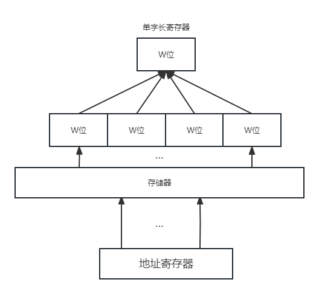
    
    增大了存储器的宽度

	!!! success ""
		提高了单体存储器的工作速度

	!!! failure ""
		指令和数据在主存内必须是连续存放的，一旦遇到转移指令，或操作数不能连续存放，这种方法效果便不明显

=== "多体并行处理器"
    多体并行存储器划分为两种：高位交叉多体并行存储器和低位交叉多体并行处理器。

	<figure markdown>
	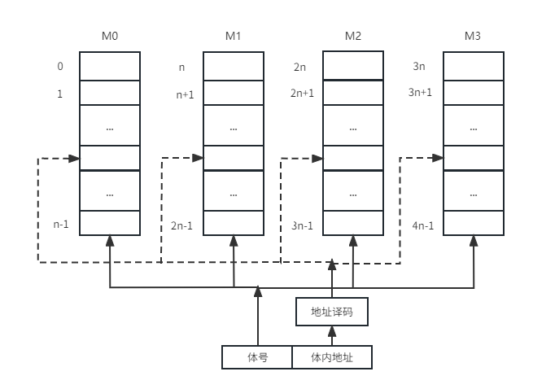
	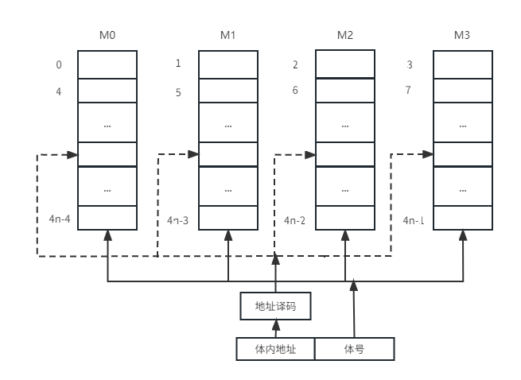
	<figcaption>高位交叉（上）和低位交叉（下）多体并行存储器</figcaption>
	</figure>

!!! tip "定量分析"
    假设模块存取一个字的存储周期为T，总线传送周期为t，存储器的交叉模块数为m。

	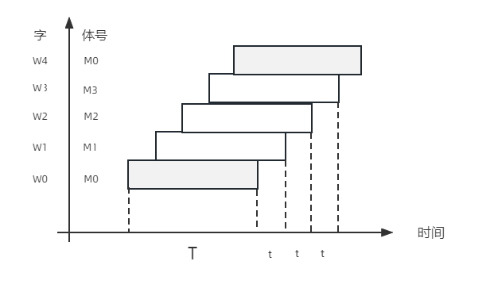

	* 实现流水线方式，应当满足 $T=mt$
	* 交叉存储器的模块数应当大于 $\dfrac{T}{t}$
	* 连续存取m个字的时间为 $t_1=T+(m-1)t$
	* 顺序方式存储器连续读取m个字所需时间为 $t_2=mT$

	由于 $t_1\lt t_2$，交叉存储器的带宽大大提高了。

### 主存储器与CPU的连接

<figure markdown>
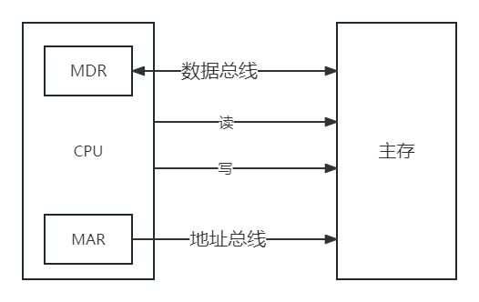
<figcaption>CPU与主存的连接示意图</figcaption>
</figure>

#### 连接原理

* 数据总线：其位数与工作频率乘积正比于数据传输率
* 地址总线：其位数决定了可寻址的最大空间
* 控制总线

#### 容量扩展

单个存储芯片容量有限，故需扩展

##### 位扩展法

增加存储字长。地址、片选、读写控制并联，数据端分别引出。

<figure markdown>
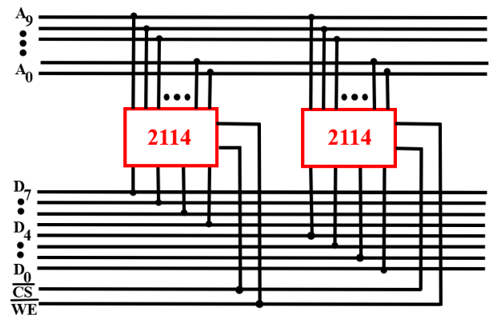
<figcaption>2片1kx4位扩展为1kx8位</figcaption>
</figure>

##### 字扩展法

增加存储字的数量。地址、数据、读写控制并联，片选区分范围。

<figure markdown>
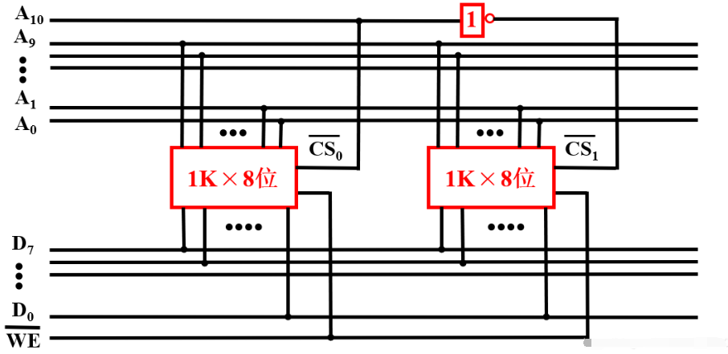
<figcaption>2片1kx8位扩展为2kx8位</figcaption>
</figure>

##### 字位同时扩展法

地址线并联，数据线与片选结合。

<figure markdown>
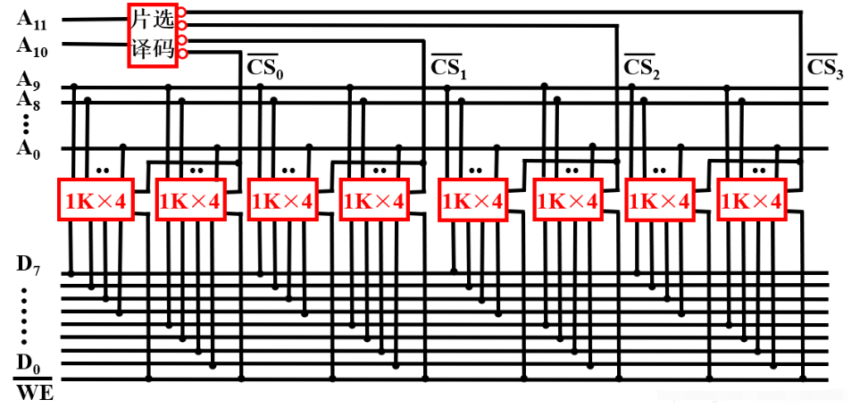
<figcaption>8片1kx8位扩展为4kx8位</figcaption>
</figure>

#### 地址分配和片选

* 片选：CPU要实现对存储单元的访问，首先要选择存储芯片
    - 线选法：高位地址线接至存储芯片片选端，每次1位有效
    - 译码片选法：通过地址译码器芯片产生片选信号
* 自选：地址码→存储单元，芯片片内逻辑完成译码

#### 存储器与CPU的连接

* 合理选择类型和数量
* CPU低位地址线与存储芯片相连
* 存储器经过扩位后于CPU数据线一致，直接连接
* 读写命令线
    - 高电平读，低电平写
    - 分离：RD读控制端，WE写控制端
* 片选线：芯片选中

## 高速缓冲存储器Cache

Cache是介于CPU和主存之间的小容量存储器，存取速度比主存快，由高速的SRAM组成。

!!! summary "cache的存在意义"
    解决CPU和主存之间速度不匹配的问题。其原理是程序运行中的空间局部性和时间局部性特征。

!!! warning ""
    CPU和Cache之间的数据交换以字为单位，而cache与主存之间的数据交换以cache块为单位。

### 工作原理

* cache除包含SRAM外，还要有控制逻辑。控制逻辑一般与主存控制逻辑合成在一起，也可由CPU内部实现。
* CPU发出读请求，cache控制逻辑先检查cache中是否有该数据，若有，则直接从cache中读出，否则从主存中读出并存入cache中，必要时替换。
* 指标
  
    命中率
    : $H=\dfrac{N_C}{N_C+N_m}$，其中 $N_C$ 表示 cache 完成存取的总次数，$N_m$ 表示主存完成存取的总次数。

    平均访问时间
    : $t_a=Ht_c+(1-H)t_m$，其中$t_c$ 表示命中时 cache 的访问时间，$t_m$ 表示未命中时主存的访问时间。

    访问效率
    : $e=\dfrac{t_c}{t_a}=\dfrac{t_c}{Ht_c+(1-H)t_m}=\dfrac{1}{H+(1-H)r}=\dfrac{1}{r+(1-r)H}$，其中 $r=\dfrac{t_m}{t_c}$ 表示主存慢于cache的倍率。

!!! summary ""
    命中率与程序的行为、cache容量、组织方式、块的大小有关。

### 映射方式
cache与主存块的数据交换以块为单位，为了把主存块放到cache中，必须应用某种方法把主存地址定位到cache中，称为地址映射。
#### 直接方式
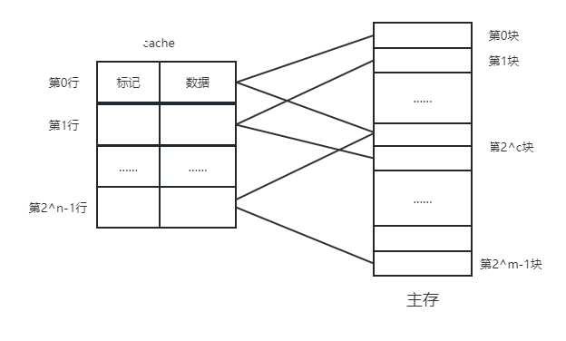

* 一个主存块只能拷贝到cache的一个特定行位置上去。行号=主存块号%总行数
* 地址结构：标记+行号+块内地址

!!! success ""
    对于一个任意地址，只需要对比一个标记，速度最快
!!! failure ""
    cache存储空间利用不充分，命中率低
#### 全相联方式
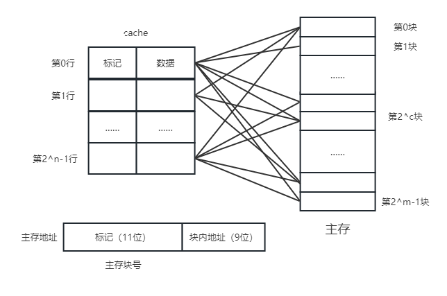

* 主存块可以放到cache的任意位置
* 地址结构：标记+块内地址

!!! success ""
    cache存储空间利用充分，命中率高
!!! failure ""
    需比较全部标记位，查找速度慢
#### 组相联方式
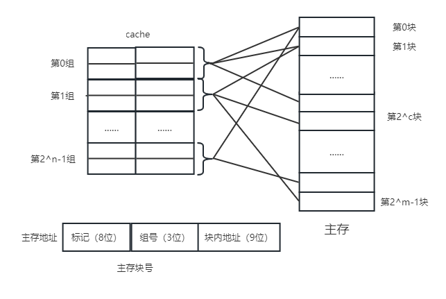

* 将cache分为u组，每组v行。主存块放到哪个组是固定的，存到该组哪一行是任意的。
    - 组号 q = 主存块号 % 总组数
* 地址结构：标记+组号+块内地址

!!! tip "N路组相联映射"
    每N个cache行为一组
### 主存块替换算法
Cache的工作原理决定了它尽量需要保留最新数据，当一个新主存块需要拷贝到cache，而允许存放此块的位置都被其他主存块占满时，就要产生替换。

对于直接映射来说，把此特定位置的原主存块换出即可。对于全相联和组相联映射来说，需要选择一个主存块换出。如何选取的问题就是替换算法。

先进先出（FIFO）
: 若cache已满，选择最先被调入的cache块替换

最不经常使用（LFU）
: 若cache已满，选择一段时间内被访问次数最少的cache块替换

近期最少使用（LRU）
: 若cache已满，将近期内长久未被访问过的cache块替换

随机替换
: 若cache已满，随机选取cache块替换

### cache写策略
Cache应当与主存内容保持一致，保持一致的方法有以下几种

=== "写命中Write hit"
    * 全写法 write through：同时修改cache和主存，一般使用写缓冲
        - 场景：数据准确率要求高，实时性高
    * 写回法 write back：只写cache不写主存，块失效时一次性写主存
        - 场景：写操作频繁/写密集型

=== "写不命中Write miss"
    * 写分配法 write allocate：将主存块调入cache，再写cache
        - 搭配写回法
    * 非写分配法 no write allocate：不将主存块调入cache，直接写主存
        - 搭配全写法
## 虚拟存储器

### 基本概念
虚拟存储器由主存和辅存组成，在硬件和软件的共同管理下工作，地址统一编制，形成了庞大的地址空间。需要辅助硬件处理虚——实地址对应关系。

* 虚拟地址——虚拟空间——逻辑地址，编程时涉及
* 物理地址——实地址空间——实地址，实际的主存单元地址

判断虚地址对应内容是否装入主存。若存在，直接访问；若不存在，把包含该内容的页或段调入主存再由CPU访问。

基本信息传送单位

* 段，按程序逻辑结构划分——段表——段式管理
* 页，按主存物理空间划分——页表——页式管理
* 段页式管理：先分段，段内分页

!!! tip "基本原理"
    虚拟存储器用到了程序的局部性原理，它是指程序在执行的过程中，常常会局部于某一存储单元附近，程序的局部性主要体现在空间局部性和时间局部性。
### 页式虚拟存储器
虚地址空间被分成等长大小的页，称为逻辑页；主存空间也被分成同样大小的页，称为物理页。虚拟地址有两个字段：虚页号和页内地址。
<!-- todo:地址映射过程图 -->

!!! success ""
    页面长度固定，页表简单，调入方便
!!! failure ""
    程序最后一页零头可能无法利用，处理、保护和共享不方便
### 段式虚拟存储器
段式虚拟存储器中，段具有逻辑独立性，易于实现程序的编译、管理和保护，也便于多道程序共享。虚拟地址分为两部分：段号和段内地址。
<!-- todo:地址映射过程图 -->

!!! success ""
    具有逻辑独立性，使它易于编译、管理、修改和保护，也便于多道程序的共享
!!! failure ""
    段长度可变，分配空间不便，容易在段间留下碎片，不好利用，造成浪费
### 段页式虚拟存储器
把程序按逻辑单位分段以后，再把每个段分成固定大小的页。程序对主存的调入/调出是按页面进行的，但它又可以按段实现共享和保护。虚地址分为段号、段内页号、页内地址三部分。
<!-- todo:地址映射过程图 -->

!!! success ""
    兼具页式和段式虚拟存储器的优点，可以按段实现共享和保护
!!! failure ""
    在地址变换过程中需要两次查表，系统开销比较大
### TLB快表
把经常访问页的页表项存放在Cache的TLB中，是主存慢表的副本，一般使用相联存储器。查找时快慢同时进行，提高了访问速度。

!!! summary "cache和虚拟存储器的比较"
    | 虚拟存储器 | Cache |
    | :--:| :--:|
    |软硬件共同实现，逻辑存储器|硬件存储器|
    |解决主存容量|解决系统速度|
    |未命中损失更大|未命中损失较小|
    |不命中时，先由硬盘调入内存|不命中时，主存和CPU直接通信调入cache|