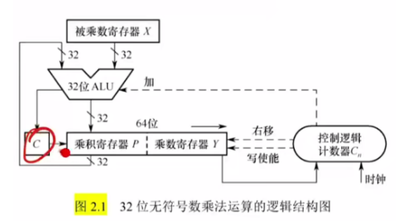
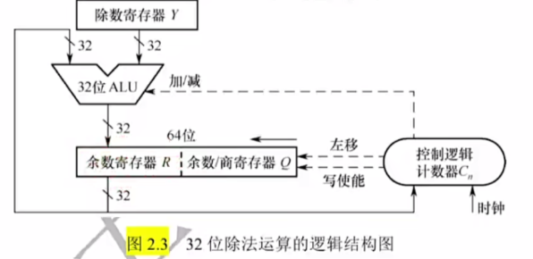

数据的表示与运算
===

## 数制与编码
### 进位计数制及相互转换

基数
: 每个数码位所用到的不同符号的个数，r进制的基数为r

!!! info "常见进制使用的符号"
	* 二进制：0、1（计算机的选择），用b（binary）表示
	* 八进制：0、1、2、3、4、5、6、7
	* 十进制：0、1、2、3、4、5、6、7、8、9，用D（decimal）表示
	* 十六进制：0、1、2、3、4、5、6、7、8、9、A、B、C、D、E、F，用H（hexadecimal）表示，也可以用0x作为前缀

	??? qa "为什么计算机选择了二进制"
		* 可使用两个稳定状态的物理器件表示
		* 0、1正好对应逻辑假、真，方便实现逻辑运算
		* 可以很方便地使用逻辑门电路实现算术运算

=== "其他进制转十进制"
	$$
	\overline{K_nK_{n-1}\cdots K_2K_1K_0K_{-1}K_{-2}\cdots K_{-m}} =K_nr^n+K_{n-1}r^{n-1}+\cdots+K_2r^2+K_1r^1+K_0r^0+K_{-1}r^{-1}+K_{-2}r^{-2}+\cdots +K_{-m}r^{-m}
	$$

=== "二进制与八进制、十六进制互转"
	
	=== "二进制转换为八进制、十六进制"
		* 在二进制转八进制时，3位一组，每组转换成对应的八进制符号
			```text
			1111000010.01101   二进制
			     ↓
		    001 111 000 010.011 010
			 1   7   0   2 . 3   2   八进制
			```
		* 在二进制转十六进制时，4位一组，每组转换成对应的十六进制符号
			```text
			1111000010.01101   二进制
			     ↓
			0011 1100 0010.0110 1000
              3    C    2 . 6    8    十六进制
			```

		!!! info ""
			小数点前在二进制最前面补0凑齐组，小数点后在最后面补0凑齐组

	=== "八进制、十六进制转换为二进制"
		* 在八进制转二进制时，每位八进制对应3位二进制
			```text
			  1  7   2 . 3   2   八进制
			     ↓
			001 110 010.010 000   二进制
			```

		* 在十六进制转二进制时，每位十六进制对应4位二进制
			```text
			  A    E   8    6  . 1  十六进制
			   ↓
			1010 1110 1000 0110.0001 二进制
			```

=== "十进制转任意进制"

	=== "整数"
		除基取余法，将整数部分不断除以基数r，得到从低位到高位的余数
		```text
		(75.3)10 整数部分为75
		75 / 2 = 37 ... 1
		37 / 2 = 18 ... 1
		18 / 2 = 9  ... 0
		9  / 2 = 4  ... 1
		4  / 2 = 2  ... 0
		2  / 2 = 1  ... 0
		1  / 2 = 1  ... 1   ↑
		(75)10=(1001011)2
		```

	=== "小数"
		乘基取整法，将小数部分不断乘以基数r，得到从高位到低位的余数
		```text
		(75.3)10 整数部分为75
		75 / 2 = 37 ... 1
		37 / 2 = 18 ... 1
		18 / 2 = 9  ... 0
		9  / 2 = 4  ... 1
		4  / 2 = 2  ... 0
		2  / 2 = 1  ... 0
		1  / 2 = 1  ... 1   ↑
		(75)10=(1001011)2
		```

### 真值和机器数

真值
: 符合人类习惯的数字，实际带正负号

机器数
: 数字实际存在机器里的形式，把正负号数字化了

### 字符和字符串
* 英文字符在计算机内的表示：ASCII码（8位）
    * 可印刷字符：32~126，其余为控制、通信字符
    * 数字：48（0011 0000）~57（0011 1001）
    * 大写字母：65（0100 0001）~90（0101 1010）
    * 小写字母：97（0110 0001）~122（0111 1010）
    * 后四位恰好是8421码
* 中文字符在计算机内的表示
    * GB2312-80：汉字+各种符号共7445个
    * GB18030-2005：变长字节编码，共收录汉字70244个
    * 区位码：94个区，每区94个位置
    * 国标码：区位码+`2020H`，防止信息交换时与“控制/通信字符”冲突
    * 汉字内码：国标码+`8080H`，防止信息交换时与ASCII码冲突
* 字符串的存储
    * 按字节编址，`s="abc"` 的存储
        ```text
		+------+-------+-------+-------+--------+-------
        |      |  61H  |  62H  |  63H  |   00H  |  ... 
        +------+-------+-------+-------+--------+-------
                   a        b      c        \0（字符串结束符）
        ```
    * 按字节编址，`s="abc啊"` 的存储
        
	    === "大端模式"
            数据的最高有效字节存放在低地址单元中。
	        ```text
            +------+-------+-------+-------+-------+--------+--------+-------
            |      |  61H  |  62H  |  63H  |   B0H |  A1H   |   00H  |  ... 
            +------+-------+-------+-------+-------+--------+--------+-------
                       a        b      c           啊            \0（字符串结束符）
            ```

	    === "小端模式"
            将数据的最高有效字节存放在高地址单元中。
	        ```text
	        +------+------+-------+-------+-------+-------+--------+-------
	        |      | 61H  |  62H  |  63H  |   A1H |  B0H  |   00H  |  ...
	        +------+------+-------+-------+-------+-------+--------+-------
	                  a        b      c           啊            \0（字符串结束符）
	        ```
      
## 定点数的表示和运算
### 定点数的表示
#### 无符号数
* 计算机通用寄存器的字长决定了计算机无符号位数的上限
* 全部二进制位是数值位，没有符号位
* 最小数字全0，最大数字全1
#### 有符号数
对有符号数而言，符号的“正”、“负”机器是无法识别的，但由于“正”、“负”恰好是两种截然不同的状态，如果用“0”表示“正”，用“1”表示负，这样符号也被数字化了，并且规定将它放在有效数字的前面，即组成了有符号数。

```text
+----+-----------------+
| x0 |       x         |
+----+-----------------+
 符号位     数值位
```

=== "原码"
	* 符号位为0表示整数，符号位为1表示负数，数值位即真值的绝对值。
	* 更便于人类理解

	!!! info ""
		原码存在+0(`0,0000000`)和-0(`1,0000000`)两种表示

	=== "整数"
		表示范围：$-(2^n-1)\le x \le 2^n-1$
		```text
		+----+------------------+
		| 符 | 2^n ...  2^1  2^0|
		+----+------------------+
         用 , 隔开
		```

	=== "小数"
		表示范围：$-(1-2^{-n})\le x \le 1-2^{-n}$
		```text
		+----+------------------+
		| 符 | 2^-1 2^-2 ...2^-n|
		+----+------------------+
         用 . 隔开
		```

=== "反码"
	* 符号位为0时，反码与原码相同；符号位为1时，反码为原码除符号位外各位取反。
	* 中间状态

=== "补码"
	* 正数补码=原码，负数补码=反码末位+1（考虑进位）。真值0只有一种形式。
	* 更便于计算机运算

	* 定点整数补码`1,0000000`表示 $x=2^{-7}$
		- n+1位字长表示范围 $-2^n\le x \le 2^n-1$
	* 定点小数补码`1.0000000`表示 $x=-1$
		- n+1位字长表示范围 $-1\le x\le 1-2^{-n}$

	!!! info ""
		补码尾数取反，末位加一可以得到相应原码

=== "移码"
	补码符号位取反，只能表示整数，真值0只有一种。

定点整数和定点小数表示范围

|  码制  |          定点整数           |              定点小数               | 数码个数  |
|:----:|:-----------------------:|:-------------------------------:|:-----:|
|  原码  | -(2^{n-1}-1)~+2^{n-1}-1 | -(1-2^{-(n-1)})~+(1-2^{-(n-1)}) | 2^n-1 |
|  反码  | -(2^{n-1}-1)~+2^{n-1}-1 | -(1-2^{-(n-1)})~+(1-2^{-(n-1)}) | 2^n-1 |
|  补码  |   -2^{n-1}~+2^{n-1}-1   |       -1~+(1-2^{-(n-1)})        | 2^n |
|  移码  |   -2^{n-1}~+2^{n-1}-1   |       -1~+(1-2^{-(n-1)})        | 2^n |

### 定点数的运算
#### 移位运算
* 算术移位
    * 移位过程中符号位保持不变，对象为有符号数
    * 正数：移位后的空位补0
    * 负数
        * 原码：空位补0，若不产生溢出，左移相当于乘上2，右移相当于除以2
        * 补码：左移空位补0，右移空位补1
        * 反码：空位补1
* 逻辑移位
    * 操作数作为无符号数看待
    * 右移：高位补0，低位舍弃
    * 左移：低位补0，高位舍弃
* 循环移位
    ```text
      n         32-n
    +----+-----------------+
    |    |                 |
    +----+-----------------+
              ↓
    +-----------------+----+
    |                 |    |
    +-----------------+----+
         32-n           n
    ```
    * 假设是对32bit整数进行操作，有以下循环移动公式
        * 循环左移：`y=(val>>(N-n)) | (val << n))`
        * 循环右移：`y=(val<<(32-n) | (val >> n))`

#### 符号扩展
将有符号数扩展到更长位数。

=== "正数"
    将符号位0移动到最高位，其他空位补0

=== "负数"

    === "原码"
        将符号位1移动到最高位，其他空位补0

    === "补码"
        将符号位1移动到最高位，整数其他空位补1，小数其他空位补0

    === "反码"
        将符号位1移动到最高位，其他空位补1

#### 加减运算
* 原码加减

    === "加法"
        * 两个数的符号位相同，结果的符号位与两个数的符号位相同
        * 两个数的符号位不同，结果的符号位与绝对值较大的数的符号位相同
    
    === "减法"
        减数符号取反转换为加法

* 补码加减（计算机常用）

    $$
    \begin{align*}
    [A+B]_补&=[A]_补+[B]_补 \\
    [A-B]_补&=[A]_补-[B]_补=[A]_补+[(-B)]_补
    \end{align*}
    $$

    * 因此，只需加法器。符号位也来运算

#### 乘除运算
##### 乘法
=== "原码一位乘法"
    欲计算原码表示的 $x_sx_1x_2\cdots x_n \times y_sy_1y_2\cdots y_n$：
    
    1. 乘积符号位为两数符号位异或
    2. 从乘数y的最低位开始，若其值为 1，则将x的数值位（n位）加到乘积数值位的高n位；若其值为 0，则不加。
    3. 乘积的数值位逻辑右移一位，乘数y逻辑右移一位。若上一步产生了进位，需要将进位也移动到乘积最高位。
    4. 将步骤2、3重复n次，即可得到乘积的数值位

=== "补码一位乘法（Booth算法）"
    欲计算补码表示的 $x_sx_1x_2\cdots x_n \times y_sy_1y_2\cdots y_n$：
    
    1. 采用双符号位，符号位也参与运算
    2. 乘积m的高 $(n+1)$ 位要加上 $(y_{i+1}−y_i)x$，也即根据乘数y的最后两位来确定对乘积的操作。进位舍去。
    3. 对乘积进行算术右移一位，乘数右移一位。
    4. 将步骤2、3重复 $(n+1)$ 次，最后一次不进行右移，即可得到乘积的数值位

##### 除法

=== "原码"
    === "恢复余数法"
        1. 商的初始值为 0，余数的初始值为被除数的数值位（$0.x_1x_2\cdots x_n$）。由于减去除数可以改为加上除数相反数的补码，为 $[0.y_1y_2\cdots y_n]_补$。
        2. 余数 = 余数 - 除数。若余数为负，商最低位置 0，同时余数 = 余数 + 除数；若余数为正，商最低位置 1。
        3. 将余数左移一位，空位置 0；商左移一位。
        4. 将步骤 2、3 重复进行 $(n+1)$ 次，最后一次循环商不再左移。首商为 1 时除法溢出；首商为 0 时舍去首商，得到最终的商和余数。

    === "加减交替法"
        1. 商的初始值为 0，余数的初始值为被除数的数值位（$0.x_1x_2\cdots x_n$）。加除数时为 $0.y_1y_2\cdots y_n$，而减除数用加除数相反数的补码作为替换，为 $[0.y_1y_2\cdots y_n]_补$。
        2. 余数 = 余数 - 除数。若余数小于 0，商最低位置 0；若余数大于 0，商最低位置 1。将商左移一位。
        3. 若余数为负，则余数左移一位后，余数 = 余数 + 除数；若余数为正，则余数左移一位后，余数 = 余数 - 除数。
        4. 将步骤 2、3 重复进行 $(n+1)$ 次，最后一次循环商不再左移。首商为 1 时除法溢出；首商为 0 时舍去首商，得到最终的商和余数。

=== "补码"
    加减交替法

    1. 符号位参加运算，商初始值为 0。对除数的减法改为加上除数相反数的补码。
    2. 若被除数与除数同号，余数 = 被除数 - 除数；若被除数与除数异号，余数 = 被除数 + 除数。
    3. 若余数与除数同号，商最低位置 1，余数左移一位后，余数 = 余数 - 除数；若余数与除数异号，商最低位置 0，余数左移一位后，余数 = 余数 + 除数。
    4. 商左移一位。
    5. 将步骤 3、4 重复进行 $(n+1)$ 次，最后一次余数和商不再左移，同时末位恒置 1。首商为 1 时除法溢出；首商为 0 时舍去首商，得到最终的商和余数。

#### 溢出判断

```text
下溢 |                | 上溢
<-----+-------0-------+---->
负+负                   正+正
```

=== "一位符号位"
    实际参与操作的两个数符号相同，结果与原操作数符号不同，即溢出
    
=== "数据位进位"
    符号位向高位进位记为 $C_s$，最高数值位进位记为 $C_1$，则如果 $C_s$ 和 $C_1$ 不同，即发生溢出
    
=== "双符号位（模4补码）"
    正数使用00，负数使用11，运算结果的两个符号位若不相同，则有溢出

    - `01` 为上溢，`10`为下溢

## 浮点数的表示和运算
### 浮点数的表示
```text
+-----+---------------+-----+---------------+
| Jf  |  J1J2....Jm   | Sf  |  S1S2....Sn   |
+-----+---------------+-----+---------------+
  阶符     阶码数值       数符      尾数数值
| <-   阶码 E     ->  | <-   尾数 M        ->|
```

阶码
: 反映浮点数的表示范围及小数点的实际位置，是常用补码或移码表示的定点整数

尾数
: 其数值部分的位数n反映浮点数的精度，是常用原码或补码表示的定点小数

#### 规格化
!!! summary ""
    规定尾数的最高数值位必须是一个有效值。
* 左规和右规
    * 左规：尾数算术左移1位，阶码减1
    * 右规：尾数算术右移1位，阶码加1（浮点数运算结果尾数出现溢出，双符号位01或10）
* 规格化尾数

    === "原码"
        * 正数：`0.10...0 ~ 0.11...1`，尾数表示范围为 $[\dfrac{1}{2},1-2^{-n}]$
        * 负数：`1.11...1 ~ 1.10...0`，尾数表示范围为 $[-(1-2^{-n}),-\dfrac{1}{2}]$

    === "补码"
        * 正数：`0.10...0 ~ 0.11...1`，尾数表示范围为 $[\dfrac{1}{2},1-2^{-n}]$
        * 负数：`1.00...0 ~ 1.01...1`，尾数表示范围为 $[-1,-(\dfrac{1}{2}+2^{-n})]$

#### IEEE 754标准
移码=真值+偏置值，在IEEE754标准中，偏置值取的是 $2^{n-1}-1$

```text
+------+------------------+----------------+
| ms   |        E         |        M       |
+------+------------------+----------------+
  数符      阶码（移码）        尾数（原码）隐藏最高位1
```

|         类型         | 数符 | 阶码位数  |  尾数位数  |  总位数   |     偏置值      |
|:------------------:|:---:|:-----:|:------:|:------:|:------------:|
|     短浮点数float      | 1 |   8   |   23   |   32   |   127(7FH)   |
|     长浮点数double     | 1 |  11   |   52   |   64   |  1023(3FFH)  |
|  临时浮点数long double  | 1 |  15   |  112   |  128   | 16383(3FFFH) |

规格化float真值：$(-1)^S\times 1.M\times 2^{E-127}$

规格化double真值：$(-1)^S\times 1.M\times 2^{E-1023}$

##### 表示范围

最小绝对值
: 尾数全为0，阶码真值最小-126，此时整体真值为 $(1.0)_2\times 2^{-126}$

最大绝对值
: 尾数全为1，阶码真值最大127，此时整体真值为 $(1.111...1)_2\times 2^{127}$

##### 特殊表示
* 阶码E全为0，尾数M不全为0时，表示非规格化小数
* 阶码E全为0，尾数M全为0时，表示真值 $\pm 0$
* 阶码E全为1，尾数M全为0时，表示无穷大 $\pm \infty$
* 阶码E全为1，尾数M不全为0时，表示非数值`NaN`
### 浮点数的加减运算
!!! tip ""
    在计算机中，加减法运算用补码实现，两个浮点数如果要进行加减法运算，它们的阶或者指数必须相等


#### 对阶
在计算机中，采用小阶向大阶看齐的方法，实现对阶。
#### 尾数求和
采用补码加法。
#### 规格化

左规
: 尾数左移一位，阶码减1，直到数符和第一数位不同为止（机器数表示方式是补码）。

右规
: 尾数右移一位，阶码加1。

#### 舍入

截断
: 将移出的数据一律舍去。

0舍1入
: 移掉的是1，则尾数末尾加1；移掉的是0，则不加。

（末位）恒置1法
: 将要保留的末位数据恒置1，无论右移掉的是1还是0，末位是1还是0。

#### 溢出判断
```text
|  上溢   |    负浮点数   | 下溢  |     正浮点数     |  上溢   |
+--------+--------------+------+-----------------+--------+
01,xxxx                 10,xxxx                   01,xxxxx
```

## 运算方法和运算电路
### 基本运算部件(算术逻辑单元ALU)
#### 功能
1. 算术运算：加减乘除
2. 逻辑运算：与或非
3. 辅助功能：移位、求补
#### ALU的结构（抽象）
```text
输入1       输入2
  |          |
  ↓          ↓
+----+     +----+
|    |     |    |
+    +-----+    +
|               | <--- 控制信号
+---------------+
       ↓
      输出
```

* 输入信号（操作数）
* 控制信号（指令译码产生）
* 输出信号（运算结果）
#### ALU的结构（实例）
```text
       F3-F0
         ↑
+--------------------+
|                    |
|        74181       |<- S0-S3, M
|        4位ALU      |
+--------------------+
   ↑      ↑      ↑
  B3-B0  A3-A0  C-1
```

* S0-S3和M：来自CU控制单元的控制信号。CU分析指令的操作是什么（加减乘除/逻辑运算），CU根据其分析结果发出控制信号
    * M表示的是该操作是逻辑运算还是算术运算：M = 1为逻辑运算，M = 0为算术运算
    * S0 - S3表示的是将要进行哪一种逻辑运算或者算术运算：有4个bit，可以表示16种不同的运算
* A0 - A3 和 B0 - B3：表示两个4bit的数据，分别从A0 - A3和B0 - B3输入
* F0 - F3：经过ALU运算后，得到4bit的数据，通过F0 - F3输出
#### 一位全加器
$$
\begin{align*}
C_i&=A_iB_i+(A_i\oplus B_i)C_{i-1}\\
S_i&=A_i\oplus B_i\oplus C_{i-1}
\end{align*}
$$

* $C_{i-1}$：低位的进位
* $S_i$：本位和

```text
          Si
           ↑
     +------------+
Ci <-|            |<-Ci-1
     |    FA      |
     |            |
     +------------+
          ↑  ↑
         Ai  Bi
```
#### 串行加法器
每次的产生的进位保存到进位触发器中，作为下次加法的进位

* 操作数n位，则进行n次加法
#### 并行加法器
将n个全加器串联起来，第 $i$ 个全加器输出的进位会作为第 $i + 1$ 个全加器的进位输入

=== "串行进位并行加法器"
    ```text
           Sn               S2          S1
           ↑                ↑           ↑
        +-----+           +-----+    +------+
     Cn←| FA  |←Cn-1...C2←| FA  |←C1-|  FA  |←C0
        +-----+           +-----+    +------+
         ↑  ↑               ↑ ↑        ↑  ↑
         An Bn              A2 B2      A1 B1   
    ```

=== "并行进位并行加法器"
    只与 $C_0$ 有关    

    $$
    \begin{align*}
    C_i=G_i+P_iC_{i-1}(G_i=A_iB_i, P_i=A_i\oplus B_i)
    \end{align*}
    $$
#### 标志位生成

=== "OF"
    溢出：最高位（n + 1位）的进位和次高位（第 n 位）的进位进行异或，对有符号数加减有意义

=== "SF"
    符号：输出结果的最高位（第n位），0正1负，对有符号数加减有意义

=== "ZF"
    零：运算结果为0，则为1；结果非0，则为0

=== "CF"
    进位/借位：最高位（n + 1位）的进位和sub（1为减法，0为加法）进行异或，对无符号数加减有意义

### 加减运算
#### 加法X+Y
X直接输入，Y经过多路选择器的0输入，sub的输入为0→cin为0
```text
       X          Y
       |          |(MUX=0)<--Sub=0
       A          B
       ↓          ↓
     +----+     +----+
Cout←|    |     |    |
     +    +-----+    +
     |               | <--- Cin=0
     +---------------+
            ↓
           输出
```
#### 减法X-Y
X直接输入，Y经过多路选择器的1输入，此时，Y的数据需要经过非门（按位取反），sub的输入为1（末位+1）→cin为1
```text
                  Y
                  ↓(not)
       X          ~Y
       |          |(MUX=1)<--Sub=1
       A          B
       ↓          ↓
     +----+     +----+
Cout←|    |     |    |
     +    +-----+    +
     |               | <--- Cin=1
     +---------------+
            ↓
           输出
```
### 乘除运算
#### 乘法
被乘数存放在被乘数寄存器X中，乘数存放在乘数寄存器Y中。

=== "无符号数乘法"
    

    * 乘积寄存器位P数和被乘数寄存器X、乘数寄存器Y相同，逻辑上乘积寄存器P、乘数寄存器Y和进位C是连在一起使用的（即逻辑右移时，原来的C作为现乘积寄存器的最高位，原乘积寄存器的最低位作为现乘数寄存器的最高位，原乘数寄存器的最低位舍弃）
    * ALU主要实现加法运算，C是两个数相加可能产生的进位：若当前乘数寄存器的最低位为0，则ALU左边输入乘积寄存器，右边输入0，计算结果输出到乘积寄存器中；若当前乘数寄存器的最低位为1，则ALU左边输入乘积寄存器，右边输入被乘数寄存器，计算结果输入到乘积寄存器中
    * ALU计算完成并输出数据后，进行逻辑右移
    * 控制逻辑发出加、右移和写使能控制信号；设乘数和被乘数位n位，则计数器从n开始计数，进行n轮加法、右移，每进行一轮加法和右移后，计数器 - 1
    * 两个n位数相乘，结果用2n位暂存，结果最终保留的是乘数寄存器中n bit，乘积寄存器舍弃。若乘积寄存器全0，则不发生溢出；只要有1，则发生溢出

=== "补码一位乘法"
    

    * 乘积寄存器位P数和被乘数寄存器X、乘数寄存器Y相同，逻辑上乘积寄存器P、乘数寄存器Y和辅助位是连在一起使用的（即算术右移时，原乘积寄存器的最低位作为现乘数寄存器的最高位，原乘数寄存器的最低位作为现辅助位，辅助位舍弃）
    * ALU主要实现加法运算：根据辅助位和乘数寄存器的最低位进行加/减法
        - 辅助位 - 乘数寄存器最低位 = 1，乘积寄存器 + X的补码
        - 辅助位 - 乘数寄存器最低位 = 0，不做加法
        - 辅助位 - 乘数寄存器最低位 = -1，乘积寄存器 + （-X）的补码（逻辑减法，实际加法）
    * ALU计算完成并输出数据后，进行算术右移（用符号位补空位）
    * 控制逻辑发出加、右移和写使能控制信号；设乘数和被乘数位n位，则计数器从n开始计数，进行n轮加法、右移，每进行一轮加法和右移后，计数器 - 1
    * 两个n位数相乘，结果用2n位暂存，结果最终保留的是乘数寄存器中的n bit，乘积寄存器舍弃。若高n + 1 bit为全0或全1，则不溢出；否则，溢出

#### 除法
n位定点数的除法运算，实际上是用一个2n位的数去除以一个n位的数，得到一个n位的商，因此需要对被除数进行扩展。

对于n位定点正小数，只要在被除数低位添n个0即可；对于n位定点正整数，只要在被除数的高位添n个0即可。


