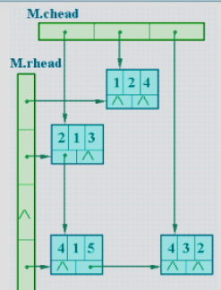

数组
===

## ADT类型定义
* 数据对象 $D=\{a_{j_1,j_2,..,j_i,...j_N} | j_i = 0,..., b_i -1, i=1,2,..,N a_{j_1,j_2,..,j_i,...j_N} \in ElemSet \}$
    * 称 N(>0) 为数组的维数，$b_i$ 为数组第 i 维的长度，$j_i$ 为数组元素的第i维下标
* 数据关系

$$
\begin{equation}\begin{split}
   &R=\{R_1,R_2,...,R_N\} \\
   &R_i = \{<a_{j_1,j_2,..,j_i,...j_N},a_{j_1,j_2,..,j_i,...j_N}> |0 \leq j_k \leq b_k-1, 1 \leq k \leq N \\ \text{且}
   &k \neq i, 0\leq j_i \leq b_i -2, a_{j_1 ,...,j_i ,...,j_N}, a_{j_1 ,...,j_i +1 ,...,j_N} \in D,i=2,...,N\}
\end{split}\end{equation}
$$

* 基本操作

    === "初始化"
        * `InitArray (&A, n, bound1, ..., boundn) `
            - 操作结果：若维数 n 和各维长度合法，则构造相应的数组 A。

    === "销毁结构"
        * `DestroyArray (&A)`
            - 初始条件：数组 A 已经存在。
            - 操作结果：销毁数组 A。

    === "获得数组元素的值"
        * `Value (A, &e, index1, ..., indexn)`
            - 初始条件：A 是 n 维数组，e 为元素变量，随后是 n 个下标值。
            - 操作结果：若各下标不超界，则e赋值为所指定的A的元素值，并返回OK。

    === "给数组元素赋值"
        * `Assign (&A, e, index1, ..., indexn)`
            - 初始条件：A 是 n 维数组，e 为元素变量，随后是 n 个下标值。
            - 操作结果：若下标不超界，则将 e 的值赋给A中指定下标的元素。

## 存储表示——顺序存储

=== "行优先"
    * 将数组元素按行排列，第i+1个行向量紧接在第i个行向量后面
    * 在PASCAL、C语言中是这样

=== "列优先"
    * 将数组元素按列排列，第j+1个列向量紧接在第j个列向量之后
    * FORTRAN语言即是如此

!!! tip "推广到多维数组"
    - 行优先顺序可规定为先排最右的下标，从右到左，最后排最左下标；列优先顺序与此相反，先排最左下标，从左向右，最后排最右下标
    - 以二维数组为例，二维数组 R[m][n] 中每个数据元素占L个存储地址，并以LOC(i, j) 表示下标为 (i, j) 的数据元素的存储地址，则该数组中任何一对下标 (i, j) 对应的数据元素
        - 在以行为主的顺序映象中存储地址为 $LOC (i, j) = LOC(0,0) + (i \times n + j) \times L$
        - 在以列为主的顺序映象中存储地址为 $LOC (i, j) = LOC(0,0) + (j \times m + i) \times L$

## 矩阵的压缩存储
### 对称矩阵
* 在一个n阶方阵A中，若元素满足下述性质：$a_{ij} =a_{ji},0 ≦i,j ≦n-1$ 则称A为对称矩阵
* 对称矩阵的元素关于主对角线对称，只需要用一个数组存放下三角或上三角的元素即可，这个一维数组的长度为 $\frac {(1+n)n}{2}$
* 令 $I=max(i,j)， J=min(i,j)$，则有

$$
\begin{equation}\begin{split}
&k=I \times \frac {I+1}{2}+J  (0 \leq k \lt \frac {n(n+1)}{2}) \\
&LOC(a_{ij})=LOC(sa[k])=LOC(sa[0])+k \times L=LOC(sa[0])+[ I× (I+1)/2+J ] \times L
\end{split}\end{equation}
$$

### 三角矩阵
* 以主对角线划分，三角矩阵有上三角和下三角两种。上三角矩阵的下三角（不包括主对角线）中的元素均为常数。下三角矩阵正好相反，它的主对角线上方均为常数。在大多数情况下，三角矩阵常数为零。
* 三角矩阵中的重复元素c可共享一个存储空间，其余的元素正好有 $\frac {(1+n)n}{2}$ 个，可压缩存储到向量`sa[0..n(n+1)/2]`中，其中c存放在向量的最后一个分量中
* 如果A是一个上三角矩阵，sa[k]和$a_{ij}$的对应关系为

$$
k=
\begin{cases}
i(2n-i+1)/2+j-i &i \leq j \\
n(n+1)/2 &i \gt j
\end{cases}
$$

* 如果A是一个下三角矩阵，sa[k]和$a_{ij}$的对应关系为

$$
k=
\begin{cases}
i(i+1)/2+j & i \leq j \\
n(n+1)/2 & i \gt j
\end{cases}
$$

### 对角矩阵
* 非零元素仅出现在主对角上($a_{ii},0≦i≦n-1$) ， 紧邻主对角线上面的那条对角线上($a_{i,i+1} ,0≦i≦n-2$)和 紧邻主对角线下面的那条对角线上($a_{i+1,i} ,0≦i≦n-2$)。
    - 显然，当 $\lvert i-j \rvert \gt 1$ 时，元素$a_{ij} =0$。
* 对角矩阵可按行优先顺序或对角线的顺序，将其压缩存储到一个向量中，并且也能找到每个非零元素和向量下标的对应关系。
    * 这个向量的长度是$3n-2$
    * 例如：一个三对角带状矩阵，除满足条件i=0，j=0、1，或i=n-1，j=n-2、n-1或1<i<n-1，j=i-1、i、i+1的元素$a_{ij}$ 外，其余元素都是零
    * 那么，它的非零元素和向量下标的对应关系为

        $$
        LOC(i,j)=LOC(0,0)+[3×i-1+(j-i+1)] ×L=LOC(0,0)+(2i+j) ×L
        $$

### 稀疏矩阵
* 假设在 m×n 的矩阵中有 t 个非零值元，令 $\delta=\frac {t}{m\times n}$，称 $\delta$ 为矩阵的稀疏因子，则通常认定 $\delta \le0.05$ 的矩阵为稀疏矩阵。
* 三元组顺序表：以顺序存储结构作为三元组线性表的存储结构，由此得到的稀疏矩阵的一种压缩存储方法，称之谓三元组顺序表。例如


    $$
    M=
    \begin{bmatrix}
    0 & 0 & 9 & 0 & -7 & 0 \\
    0 & 0 & 0 & 0 & 0 & 0 \\
    0 & 0 & 0 & 8 & 0 & 0 \\
    5 & 0 & 0 & 0 & 0 & 2 \\
    0 & 0 & 0 & 0 & 16 & 0 \\
    \end{bmatrix}
    $$

    其三元组线性表为 ((1,3,9),(1,5,-7),(3,4,8),(4,1,5),(4,6,2),(5,5,16))

    - 结构定义
        ```c
        const MAXSIZE=12500; // 假设非零元个数的最大值为12500
        typedef struct {
            int i, j; // 该非零元的行号和列号
            ElemType e; // 该非零元的值
        } Triple; // 三元组
        typedef struct {
            Triple data[MAXSIZE + 1]; // 非零元三元组表，data[0] 未用
            int mu,nu,tu; // 矩阵的行数、列数和非零元的个数
        } TSMatrix; // 三元组顺序表
        ```

* 十字链表
    - 如果矩阵运算的结果将增加或减少已知矩阵中的非零元的个数，则显然不宜采用顺序存储结构，而应以链式映象作为三元组线性表的存储结构。例如，

    $$
    M=
    \begin{bmatrix}
    0 & 4 & 0 \\
    3 & 0 & 0  \\
    0 & 0 & 0  \\
    5 & 0 & 2  \\
    \end{bmatrix}
    $$

    的十字链表如图所示。

    

    - 结构定义
        ```c
        typedef struct OLNode { // 结点结构定义
        int i, j; // 该非零元的行和列下标
        ElemType e;
        struct OLNode *right, *down; // 该非零元所在行表和列表的后继链域
        } *OLink;
        typedef struct { // 链表结构定义
        OLink *rhead, *chead; // 行和列链表头指针向量基址由CreateSMatrix分配
        int mu, nu, tu; // 稀疏矩阵的行数、列数和非零元个数
        } CrossList;
        ```

## 广义表(非考研内容)
