---
tags:
  - 408考研复习
  - 数据结构
comments: true
---

图
===

!!! summary ""
    在图形结构中，结点之间的关系可以是任意的，图中任意两个数据元素之间都可能相关

## 定义
图由一个顶点集和边集构成，通常写作：$Graph=(V,E)$ 。由于空的图在实际应用中没有意义，因此一般不讨论空的图，即V是顶点的有穷非空集合，而E是两个顶点之间的关系的集合。

=== "无向图"

    <figure markdown>
    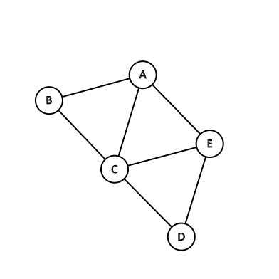
    <figcaption>无向图示例</figcaption>
    </figure>

    * 若 $\langle w,v \rangle \in E$ 且 $\langle v,w \rangle \in E$，以无序对 $(v, w)$ 代替这两个有序对，表示v和w之间的一条边(Edge)
        - 称v为弧尾(Tail)或初始点(Initial Node)，称w为 弧头(Head)或终端点(Terminal Node)
    * 例如，上图可表示为

    $$
    \begin{align}
    G_1 &= (V_1,E_1) \\
    V_1 &= \{A,B,C,D,E\} \\
    E_1 &= \{(A,B),(A,C),(A,E),(B,C),(C,D),(C,E),(D,E)\}
    \end{align}
    $$

=== "有向图"

    <figure markdown>
    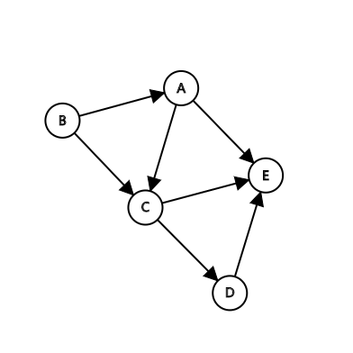
    <figcaption>有向图示例</figcaption>
    </figure>

    * 若 $\langle w,v \rangle \in E$，则 $\langle w,v \rangle$ 表示从v到w的一条弧(Arc)
    * 例如，上图可表示为

    $$
    \begin{align}
        G_2 &= (V_2,E_2) \\
        V_2 &= \{A,B,C,D,E\} \\
        E_2 &= \{\langle B,A\rangle ,\langle A,C\rangle ,\langle A,E\rangle ,\langle B,C\rangle ,\langle C,D\rangle ,\langle C,E\rangle ,\langle D,E\rangle \}
    \end{align}
    $$

* $\left | V \right |$ 表示图中顶点的个数（图的阶）
* $\left | E \right |$ 表示图中边的条数
* 完全图
    * 无向完全图：任意两个顶点之间都存在边，有 $\frac{n(n-1)}{2}$ 条边的无向图。其中 n 是结点个数。
    * 有向完全图：任意两个顶点之间都存在方向相反的弧，有 $n(n-1)$ 条边的有向图。其中 n 是结点个数。
* 有很少的边或弧（$\left | E \right |<\left | V \right |log_2\left | V \right |$）的图称为稀疏图，反之称为稠密图。
* 边和弧相关的数叫做边的权值，边有权的图称之为网。
* 邻接点：无向图 $G=(V,\{E\})$ ，如果边 $(V,V’) \in E$ ，则称 $V`$ 和 $V’$ 互为邻接点。边 $(V,V’)$ 和顶点 $V$ ， $V’$ 相关联。
* 顶点的度
    * 无向图：以v为端点的边的个数定义为顶点的度 $TD(v)$
        * $\sum_{i=1}^{n}TD(v_i)=2\left | E \right |$
    * 有向图：顶点的度为其出度和入度之和，其中出度（OD）定义为以该顶点为弧尾的弧的个数，入度（ID）定义为以该顶点为弧头的弧的个数。$TD(v)=OD(v)+ID(v)$
        *  $\sum_{i=1}^{n}ID(v_i)=\sum_{i=1}^{n}OD(v_i)=\left | E \right |$

* 子图和生成子图
    * 假设有两个图 $G=(V,\{E\})$ 和 $G’=(V’,\{E’\})$ ，如果 $V’ \subseteq V$ 且 $E’ \subseteq E$，则称 $G’$ 为 $G$ 的子图(subgraph)。
    * 生成子图意味着 $V(G)=V(G')$
* 路径
    * 若有向图 G 中 k+1 个顶点之间都有弧存在（即 $<v_0 ,v_1 >,<v_1 ,v_2 >，\cdots ,<v_{k-1} ,v_k>$ 是图 G 中的弧），则这个顶点的序列 $\{v_0 , v_1 ,\cdots , v_k \}$ 为从顶点 $v_0$ 到顶点 $v_k$ 的一条有向路径 。
    * 对无向图，相邻顶点之间存在边的 $k+1$ 个顶点序列构成一条长度为 $k$ 的无向路径。
    * 路径中弧的数目定义为路径长度，若序列中的顶点都不相同，则为简单路径。
    * 如果 $v_0$ 和 $v_k$ 是同一个顶点，则是一条由某个顶点出发又回到自身的路径，称这种路径为回路或环。
* 连通

    === "连通图"
        若<span class="stressed">无向图</span>中任意两个顶点之间都存在一条<span class="stressed">无向</span>路径，则称该无向图为连通图。
    
    === "强连通图"
        若<span class="stressed">有向图</span>中任意两个顶点之间都存在一条<span class="stressed">有向</span>路径，则称该有向图为强连通图。
    
    === "连通分量"
        <span class="stressed">非连通图</span>中各个极大连通子图称作该图的连通分量。
    
    === "强连通分量"
        非强连通的有向图中的极大强连通子图称作有向图的强连通分量。

* 生成树和生成森林

    === "生成树"
        一个含 n 个顶点的连通图的生成树是该图中的一个极小连通子图。它包含图中 n 个顶点和足以构成一棵树的 n-1 条边。
    
    === "生成森林"
        对于非连通图，对其每个连通分量可以构造一棵生成树，合成起来就是一个生成森林。

* 网
    * 在实际应用中，图的弧或边往往与具有一定意义的数相关，称这些数为“权”，带权的图通常称为“网”

## ADT类型定义
* 数据对象 V是具有相同特性的数据元素的集合，称为顶点集
* 数据关系

    $$
    \begin{align}
    R & = \{E \} \\
    E & = \{\langle v,w\rangle| v, w \in V且P(v,w)，\langle v,w\rangle 表示从v到w的弧，谓词P(v,w)定义了弧\langle v,w\rangle 的意义或信息\}
    \end{align}
    $$

* 基本操作

    === "结构建立与销毁"
        * `InitGraph(&G,V,VR)`
            - 初始条件：`V` 是图的顶点集，`VR` 是图中弧的集合。
            - 操作结果：按 `V` 和 `VR` 的定义构造图 `G`。
        * `DestroyGraph(&G)`
            - 初始条件：图 `G` 已存在。
            - 操作结果：销毁图 `G` 。

    === "添加及删除数据"
        * `InsertVex(&G,v)`
            * 初始条件：图 `G` 存在，`v` 和图中顶点有相同特征。
            * 操作结果：在图 `G` 中增添新顶点 `v`
        * `DeleteVex(&G,v)`
            * 初始条件：图 `G` 存在，`v` 是 `G` 中某个顶点。
            * 操作结果：删除 `G` 中顶点 `v` 及其相关的弧。
        * `PutVex(&G, v, value)`
            * 初始条件：图 `G` 存在，`v` 是 `G` 中某个顶点。
            * 操作结果：对 `v` 赋值 `value`。
        * `InsertArc(&G, v, w)`
            * 初始条件：图 `G` 存在，`v` 和 `w` 是 `G` 中两个顶点。
            * 操作结果：在G中增添弧`<v,w>`，若`G`是无向的，则还增添对称弧`<w,v>`。
        * `DeleteArc(&G, v, w)`
            * 初始条件：图 `G` 存在，`v` 和 `w` 是 `G` 中两个顶点。
            * 操作结果：在G中删除弧`<v,w>`，若`G`是无向的，则还删除对称弧`<w,v>`

    === "查找"
        * `GetVex(G, u)`
            - 初始条件：图 `G` 存在，`v` 是 `G` 中某个顶点。
            - 操作结果：返回 `v` 的值。
        * `LocateVex(G, u)`
            - 初始条件：图 `G` 存在，`u` 和 `G` 中顶点有相同特征。
            - 操作结果：若 `G` 中存在和 `u` 相同的顶点，则返回该顶点在图中位置；否则返回其它信息。
        * `FirstAdjVex(G, v)`
            - 初始条件：图 `G` 存在，`v` 是 `G` 中某个顶点。
            - 操作结果：返回 `v` 的第一个邻接点。若该顶点在 `G` 中没有邻接点，则返回“空” 。
        * `NextAdjVex(G, v, w)`
            - 初始条件：图 `G` 存在，`v` 是 `G` 中某个顶点，`w` 是 `v` 的邻接顶点。
            - 操作结果：返回 `v` 的（相对于 `w` 的）下一个邻接点。若 `w` 是 `v` 的最后一个邻接点，则返回“空”。

    === "遍历"
        * `DFSTraverse(G, Visit())`
            - 初始条件：图 `G` 存在，`Visit` 是顶点的应用函数。
            - 操作结果：对图`G`进行深度优先遍历。遍历过程中对每个顶点调用函数`Visit` 一次且仅一次。一旦 `visit()` 失败，则操作失败。
        * `BFSTraverse(G, Visit())`
            - 初始条件：图 `G` 存在，`Visit` 是顶点的应用函数。
            - 操作结果：对图`G`进行广度优先遍历。遍历过程中对每个顶点调用函数`Visit` 一次且仅一次。一旦 `visit()` 失败，则操作失败。

## 存储结构
### 邻接矩阵
假设图中顶点数为n，则图的邻接矩阵 $A(i,j)_{n \times n}$ 定义为

$$
\begin{align}
A[i][j]=
\begin{cases}
1 &V_i与V_j之间有弧或边存在\\
0 &其他
\end{cases}
\end{align}
$$

* 网的邻接矩阵定义为

$$
\begin{align}
A[i][j]=
\begin{cases}
W_{ij} &V_i与V_j之间有弧或边存在\\
\infty &其他
\end{cases}
\end{align}
$$

* 将图的顶点信息存储在一个一维数组中，并将它的邻接矩阵存储
在一个二维数组中即构成图的数组表示。

```c
#define MAX_VERTEX_NUM 20 // 最大顶点个数
typedef struct{
    VertexType Vex[MAX_VERTEX_NUM]; /*存放顶点的数据*/
    EdgeType Edge[MAX_VERTEX_NUM][MAX_VERTEX_NUM]; /*邻接矩阵*/
    int vexnum,arcnum; /*顶点数、边数*/
}MGraph;
```

* 每一行中“1”的个数为该顶点的出度，每一列中“1”的个数为该顶点的入度。
* 顶点的“第一个”邻接点就应该是该顶点所对应的行中值为非零元素的最小列号，其“下一个”邻接点就是同行中离它最近的值为非零元素的列号。
* 无向图的邻接矩阵为对称矩阵。每一行中“1”的个数恰为该顶点的“度”。
* 空间复杂度 $O(n^2)$ ，适用于稠密图

### 邻接表
类似于树的孩子链表，将和同一顶点“相邻接”的所有邻接点链接在一个单链表中，单链表的头指针则和顶点信息一起存储在一个一维数组中。

* 表结点由三个域组成：邻接点域、链域、数据域，头结点：数据域、链域

```text
     _______________    ________________________
     |data|firstarc |-->| adjvex | nextarc|info |
     ---------------    ------------------------
     |  ...         |
     ---------------
     |______________|
```

```c
#define MAX_VERTEX_NUM 20 // 最大顶点个数
// 边表
typedef struct ArcNode{
    int adjvex;
    struct ArcNode* next;
    //Infotype info;
}ArcNode;
// 顶点表
typedef struct VNode{
    VertexType data;
    ArcNode *first;
}VNode,AdjList[MAX_VERTEX_NUM];
// 邻接表
typedef struct{
    AdjList vertices;
    int vexnum,arcnum;
}ALGraph;
```

* 空间复杂度
    * 有向图 $O(\left | V \right |+ \left |E \right |)$
    * 无向图 $O(\left | V \right | +2 \left |E \right |)$
* 适用于稀疏图

### 十字链表
十字链表是有向图的另一种链式存储结构，目的是将在有向图的邻接表和逆邻接表中两次出现的同一条弧用一个结点表示。

```text
    ___________________________
    |data | firstin | firstout |    顶点结点
    ---------------------------

    _________________________________
    |tailvex|headvex|hlink|tlink|info|  弧结点
    ---------------------------------
```

```c
#define MAX_VERTEX_NUM 20
typedef struct ArcNode{
    int tailvex,headvex;
    struct ArcNode *hlink,*tlink;
}ArcNode;
typedef struct VNode{
    VertexType data;
    ArcNode *firstin, *firstout;
}VNode;
typedef struct{
    VNode xlist[MAX_VERTEX_NUM];
    int vexnum,arcnum;
}OLGraph;
```

* 十字链表 = 邻接表 + 逆邻接表

### 邻接多重表
若将无向图中表示同一条边的两个结点合在一起，将得到无向图的另一种表示方法--邻接多重表。

```text
    __________________
    |data | firstedge |    顶点结点
    ------------------

    _________________________________
    |ivex|ilink|jvex|jlink|info|mark |  边结点
    ---------------------------------
```

```c
#define MAX_VERTEX_NUM 20
typedef struct ArcNode{
    int ivex,jvex;
    struct ArcNode *ilink,*jlink;
}ArcNode;
typedef struct VNode{
    VertexType data;
    ArcNode *firstedge;
}VNode;
typedef struct{
    VNode adjmulist[MAX_VERTEX_NUM];
    int vexnum,arcnum;
}AMLGraph;
```

## 图的遍历
图的 “遍历” 是按照某种搜索方法对图中的每个顶点都进行一次访问且仅进行一次访问。

### 深度优先搜索
- 首先访问出发点`v`，并将其标记为已访问过
- 然后依次从`v`出发搜索`v`的每个邻接点`w`。若`w`未曾访问过，则以`w`为新的出发点继续进行深度优先遍历，直至图中所有和源点`v`有路径相通的顶点均已被访问为止。
- 若此时图中仍有未访问的顶点，则另选一个尚未访问的顶点为新的源点重复上述过程，直至图中所有的顶点均已被访问为止。
- 算法：
    ```c++
    bool visited[MAX_TREE_SIZE];
    void DFSTraverse(Graph G){
        for(int i=0;i<G.vexnum;++i) visited[i]=false;
        for(int i=0;i<G.vexnum;++i)
            if(!visited[i]) DFS(G,i);
    }
    void DFS(Graph G,int v){
        visit(v);
        visited[v]=true;
        for(w=FirstNeighbor(G,v);w>=0;w=NextNeighbor(G,v,w))
            if(!visited[w]) DFS(G,w);
    }
    ```

    * 时间复杂度：
        * $O(\left | V \right | ^2)$ (邻接矩阵)
        * $O(\left | V \right | + \left | E \right | )$ (邻接表)
    * 空间复杂度：$O(\left | V \right |)$

### 广度优先搜索
!!! summary ""
    换句话说，广度优先搜索就是以v为起始点，由近至远，依次访问和v有路径相通且最短路径长度为 1,2,... 的顶点

从图中某个顶点 `v` 出发：

- 在访问了 `v` 之后依次访问 `v` 的各个未曾访问过的邻接点。
- 然后分别从这些邻接点出发依次访问它们的邻接点，并使得“先被访问的顶点的邻接点”先于“后被访问的顶点的邻接点”进行访问，直至图中所有已被访问的顶点的邻接点都被访问到。
- 如若此时图中尚有顶点未被访问，则需另选一个未曾被访问过的顶点作为新的起始点，重复上述过程，直至图中所有顶点都被访问到为止。
- 算法：
    ```c++
    bool visited[MAX_TREE_SIZE];
    void BFSTraverse(Graph G){
        for(int i=0;i<G.vexnum;++i) visited[i]=false;
        InitQueue(Q);
        for(int i=0;i<G.vexnum;++i){
            if(!visited[i]) BFS(G,i);
        }
    }
    void BFS(Graph G,int v){
        visit(v);
        visited[v]=true;
        EnQueue(Q,v);
        while(!isEmpty(Q)){
            DeQueue(Q,v);
            for(w=FirstNeighbor(G,v);w>=0;w=NextNeighbor(G,v,w)){
                if(!visited[w]){
                    visit(w);
                    visited[w]=true;
                    EnQueue(Q,w);
                }
            }
        }
    }
    ```

    * 时间复杂度：
        * 邻接矩阵：$O(\left | V \right | ^2)$
        * 邻接表：$O(\left | V \right | + \left | E \right |)$
    * 空间复杂度：$O(\left | V \right |)$

## 图的基本应用

### 最小生成树(MST)
生成树中边的权值（代价）之和最小的树

* 普里姆(Prim)算法和克鲁斯卡尔(Kruskal) 算法是两个利用MST性质构造最小生成树的算法
    * 生成树形状不一定唯一，但是最小权值和唯一
    * MST的边数为顶点数减1

=== "Prim算法"

    * 算法描述
        * 初始化  $T = null$，添加 $G=(V,E)$ 的任意顶点 $u_0$ 使得 $V_T=\{u_0\}$ ，$E_T$ 为空集
        * 从 $G$ 中选择满足 $\{(u,v)|u \in V_T, v \in V-V_T\}$ 且具有最小权值的边 $(u,v)$ 并令 $V_T=V_T \cup \{v\}$，$E_T=E_T \cup \{(u,v)\}$，直到 $V_T=V$
        * 时间复杂度 $O(\left | V \right |^2)$，适用于稠密图

    ??? example "生成过程"
        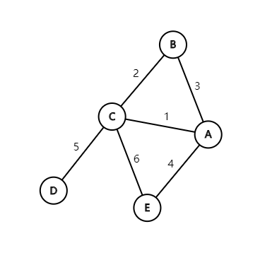

        === "第一步"
            
    
            ||min_weight|adjvex|
            |:--:|:--:|:--:|
            |A|0|0|
            |B|3|0|
            |C|1|0|
            |D|<math xmlns="http://www.w3.org/1998/Math/MathML" display="block"><mi mathvariant="normal">∞</mi></math>|0|
            |E|4|0|

        === "第二步"
            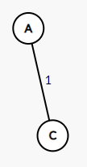
    
            ||min_weight|adjvex|
            |:--:|:--:|:--:|
            |A|0|0|
            |B|2|0|
            |C|0|0|
            |D|5|0|
            |E|4|0|

        === "第三步"
            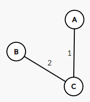
    
            ||min_weight|adjvex|
            |:--:|:--:|:--:|
            |A|0|0|
            |B|0|2|
            |C|0|0|
            |D|5|0|
            |E|4|0|

        === "第四步"
            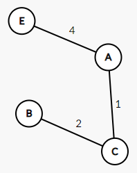
    
            ||min_weight|adjvex|
            |:--:|:--:|:--:|
            |A|0|0|
            |B|0|2|
            |C|0|0|
            |D|5|0|
            |E|0|0|

        === "第五步"
            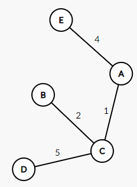
    
            ||min_weight|adjvex|
            |:--:|:--:|:--:|
            |A|0|0|
            |B|0|2|
            |C|0|0|
            |D|0|2|
            |E|0|0|

=== "Kruskal算法"

    * 算法描述
        * 初始化 $V_T=V$，$E_T=\emptyset$
            * 此时 $T$ 是一个仅含 $\left | V \right |$ 个顶点的森林
        * 然后依权值从小到大从连通网中选择不使森林中产生回路的边加入到森林中去，直到 $T$ 成为一棵树为止
        * 时间复杂度 $O(\left | E \right | \log \left | E \right |)$，适用于稀疏图

    ??? example "生成过程"
        

        === "第一步"
            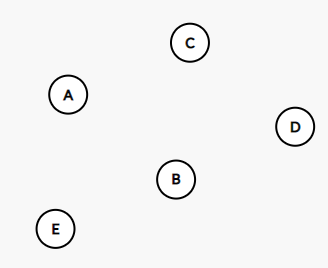

        === "第二步"
            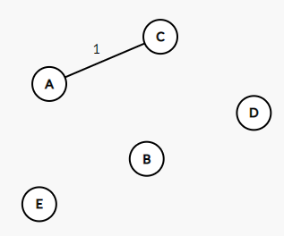

        === "第三步"
            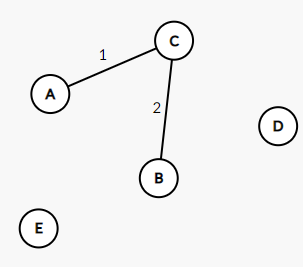

        === "第四步"
            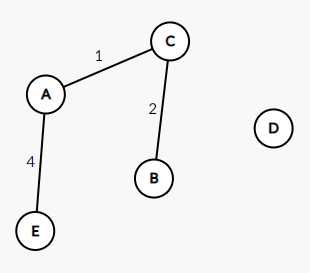

        === "第五步"
            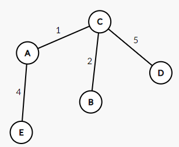

### 最短路径
对于网来说，两个顶点之间的路径长度是路径中 “弧的权值之和”。当两个顶点之间存在多条路径时，必然存在一条 “最短路径”。

* 单源点最短路径
    * 描述：已知一个有向网和网中某个源点，求得从该源点到图中其它各个顶点之间的最短路径
    * Dijkstra算法：“按各条最短路径长度递增的次序“产生最短路径
        * 辅助变量
            * `s[]`：已求得最短路径的终点的集合
            * `dist[]`：从源点到每个终点当前最短路径的长度
            * `path[]`：该最短路径中顶点的前驱结点
        * 算法描述
            * 初始化

            === "s"
                源点的下标为1，其余元素为0

            === "dist"
                `arcs[0][i]`为源点到各个顶点边的权值

            === "path"

                $$
                \begin{align}
                path[i]=
                \begin{cases}
                0&,v_0 \to v_i有边 \\
                -1&,其他情况
                \end{cases}
                \end{align}
                $$

            * 选择顶点 $v_j$ 使得 $dist[j]=Min\{dist[k]| v_k \in V-S\}$ ，并将顶点 $v_j$ 并入到集合`s`中
            * 对集合 $V-s$ 中所有顶点 $v_k$ ，若存在从 $v_j$ 指向该顶点的弧，且 $D[j]+w_{jk} <D[k]$ ，则修改 dist[k] 和 path[k] 的值为

            ```c
            dist[k]=dist[j]+arcs[j][k]
            path[k]=j
            ```

            * 最后，`dist[i]`为 $v_0 \to v_i$ 的最短路径长度值，沿`path[i]`倒回源点得到路径

        * 时间复杂度：$O(n^2)$
        * 在应用时，边的权值不能为负值

* 任意顶点间最短路径
    * Floyd算法
        * 基本思想是求得一个 n 阶方阵的序列 $A^{(-1)},A^{(0)},A^{(1)},\cdots ,A^({n-1})$
            * 其中$A^{(k)}[i][j]$ 表示 $v_i \to v_j$ 的最短路径长度，且该路径经过的顶点编号不大于k
            * $A^{(-1)}[i][j]=G.arcs[i][j]$
        * 算法描述
            * 初始化：$A^{(-1)}[i][j]=arcs[i][j]$
            * 递推：$A^{k}[i][j]=Min\{A^{(k-1)}[i][j], A^{(k-1)}[i][k]+A^{(k-1)}[k][j]\},k=0,1,\cdots ,n-1$
        * 时间复杂度：$O(n^3)$

### 拓扑排序(有向无环图DAG)
对于任何有向图而言，其拓扑排序为其所有结点的一个线性排序（对于同一个有向图而言可能存在多个这样的结点排序）。该排序满足这样的条件——对于图中的任意两个结点u和v，若存在一条有向边从u指向v，则在拓扑排序中u一定出现在v前面。

* AOV网：$\langle v_i,v_j \rangle$ 表示活动 $v_i$ 先于 $v_j$ 进行
* 算法
    1. 选择一个没有前驱的结点并输出
    2. 从图中删除该结点和所有以它为起点的有向边
    3. 重复1与2直到图为空或不存在无前驱结点（图中有环）

### 关键路径(AOE网)
<figure markdown>
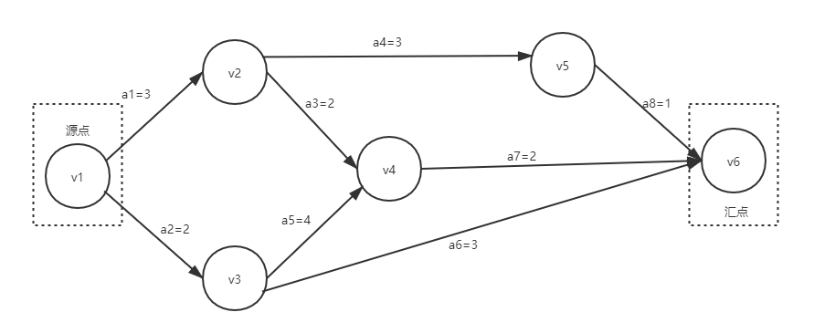
</figure>

* 从源点到汇点最大长度的路径称为关键路径，其上的活动是关键活动
* $V_k$ 最早发生时间 $V_e(k)$

    $$
    \begin{align}
    V_e(k)=
    \begin{cases}
    0&,源点 \\
    max\{V_e(j)+w(v_j,v_k)\}&,其他情况
    \end{cases}
    \end{align}
    $$

* $V_k$ 最迟发生时间 $V_l(k)$

    $$
    \begin{align}
    V_l(k)=
    \begin{cases}
    V_e(k)&,k是汇点 \\
    min\{V_e(k)-w(v_j,v_k)\}&,其他情况
    \end{cases}
    \end{align}
    $$

* $a_i$ 最早开始时间 $e(i)$
    * 若存在 $\langle v_k,v_j \rangle$ 表示 $a_i$，则 $e(i)=V_e(k)$
* $a_i$ 最迟开始时间 $l(i)$
    * 若存在 $\langle v_k,v_j \rangle$ 表示 $a_i$，则 $l(i)=V_i(j)-w(v_k,v_j)$
* $a_i$ 的差额 $d(i)=l(i)-e(i)$
    * $d(i)$ 为0的活动称为整个工程的关键路径
