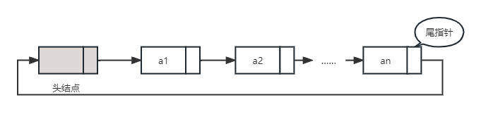
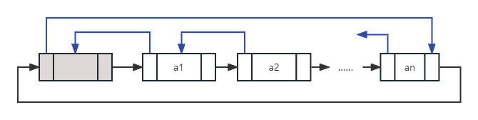

---
tags:
  - 408考研复习
  - 数据结构
comments: true
---

线性表
===

## 定义
由 $n(n≧0)$ 个数据元素(结点) $a_1,a_2,...,a_n$ 组成的有限序列，记作

$$
(a_1,a_2,..a_n)
$$

* 数据元素个数n是表的长度
*  $n=0$ 时称为空表
* $a$ 的下标 $i$ 称为 $a_i$ 在线性表中的位序


## 性质
* 在非空的线性表， 有且仅有一个开始结点 $a_1$ ，它没有直接前趋，而仅有一个直接后继 $a_2$
* 有且仅有一个终端结点 $a_n$ ，它没有直接后继，而仅有一个直接前趋 $a_{n-1}$
* 其余的内部结点 $a_i(2 \leq i \leq n-1)$ 都有且仅有一个直接前趋 $a_{i-1}$ 和一个直接后继 $a_{i+1}$

## ADT类型定义
* 数据对象 $D=\{a_i|a_i \in ElemSet, i=1,2,...,n, n \ge 0 \}$
* 数据关系 $R1=\{\left \langle a_{i-1},a_i\right \rangle|a_{i-1},a_i \in D, i=2,...,n \}$
* 基本操作

    === "结构建立与销毁"
        * `InitList(&L)`
            - 操作结果：构造一个空的线性表 `L` 。
        * `DestroyList(&L)`
            - 初始条件：线性表 `L` 已存在。
            - 操作结果：销毁线性表 `L` 。

    === "添加及删除数据"
        * `ListInsert(&L,i,e)`
            * 初始条件：线性表 `L` 已存在，`1≤i≤LengthList(L)+1`。
            * 操作结果：在 `L` 的第 `i` 个元素之前插入新的元素 `e`，`L` 的长度增1。
        * `ListDelete(&L,i,&e)`
            * 初始条件：线性表 `L` 已存在且非空，`1≤i≤LengthList(L)`。
            * 操作结果：删除 `L` 的第 `i` 个元素，并用 `e` 返回其值，`L` 的长度减1。
        * `PutElem(&L, i, &e)`
            * 初始条件：线性表 `L` 已存在，`1≤i≤LengthList(L)`。
            * 操作结果：`L` 中第 `i` 个元素赋值同 `e` 的值。

    === "查找"
        * `GetElem(L, i, &e)`
            - 初始条件：线性表 `L` 已存在，`1≤i≤LengthList(L)`。
            - 操作结果：用 `e` 返回 `L` 中第 i 个元素的值。
        * `LocateElem(L, e, compare())`
            - 初始条件：线性表 `L` 已存在，`compare()` 是元素比较函数。
            - 操作结果：返回 `L` 中第1个与 `e` 满足关系 `compare()` 的元素的位序。若这样的元素不存在，则返回值为0。
        * `PriorElem(L，cur_e，&pre_e)`
            - 初始条件：线性表 `L` 已存在。
            - 操作结果：若`cur_e`是`L`中的数据元素，则用`pre_e`返回它的前驱，否则操作失败，`pre_e` 无定义。
        * `NextElem(L, cur_e, &next_e)`
            - 初始条件：线性表 `L` 已存在。
            - 操作结果：若`cur_e`是`L`中的数据元素，则用`next_e`返回它的后继，否则操作失败，`next_e` 无定义

    === "遍历"
        * `ListTraverse(L,visit())`
            * 初始条件：线性表 `L` 已存在，`visit()` 为元素的访问函数。
            * 操作结果：依次对 `L` 的每个元素调用函数 `visit()`。一旦 `visit()`` 失败，则操作失败。

    === "其他"
        * `ClearList(&L)`
            * 初始条件：线性表 `L` 已存在。
            * 操作结果：将 `L` 重置为空表。
        * `ListEmpty(L)`
            * 初始条件：线性表`L`已存在。
            * 操作结果：若 `L` 为空表，则返回 `TRUE`，否则返回 `FALSE`。
        * `ListLength(L)`
            * 初始条件：线性表 `L` 已存在。
            * 操作结果：返回 `L` 中元素个数。

## 存储结构
### 顺序表
<figure markdown>

<figcaption>连续存储的顺序表</figcaption>
</figure>

* 用一组地址连续的存储单元，依次存放线性表中的数据元素
* 以"存储位置相邻"表示位序相继的两个数据元素之间的前驱和后继的关系
* 表中第一个元素的存储位置作为线性表的起始地址，称作线性表的基地址

!!! hint "数据元素的存储位置"
    假设每个数据元素占据的存储量是一个常量 C，则后继元素的存储地址和其前驱元素相隔一个常量，即：$LOC(a_i) = LOC(a_{i-1}) + C$ ，由此，每个数据元素的存储位置均可由第一个元素的基地址来表示，即

    $$
    LOC(a_i) = LOC(a_1) + (i-1) \times C
    $$

* 分配方式

    === "静态分配"
        ```c
        #define MAXSIZE 50;
        typedef struct{
            ElemType data[MAXSIZE]; // 存储空间
            int length; // 当前长度
        }SqList_static;
        ```

        * 当前数组空间不够时，无法增加容量

    === "动态分配"
        ```c
        #define MAXSIZE 50;
        typedef struct{
            ElemType *data; //存储空间基址
            int listSize; // 当前允许的最大存储容量
            int length;  // 当前长度
        }SqList_dynamic;
        ```

        * 基地址(`data`指针)使用`malloc()`(C)或`new`(C++)函数来申请，如果空间不够，可以使用`realloc()`(C)重新分配
        * 通常使用这种动态分配结构作为顺序表表示

* 基本操作的实现

    === "初始化"

        === "动态分配的顺序存储"
            * 时间复杂度为 $O(1)$

            ```c++
            void InitList(SqList &L， int maxsize)
            { // 构造一个空的线性表 L
                if (maxsize == 0)  maxsize = MAXSIZE;
                L.elem = new ElemType[maxsize];
                if (!L.elem) exit(1); // 存储分配失败
                L.length = 0; // 顺序表的初始长度为0
                L.listSize = maxsize; // 该顺序表可以存储元素的最大容量
            } // InitList
            ```

        === "静态分配的顺序存储"

            ```c++
            void initList(SqList &L)
            {
                 L.length=0;
            }
            ```

    === "元素定位"

        === "动态分配的顺序存储"
            * 时间复杂度为 $O(Length(L))$

            ```c++
            int LocateElem(SqList L, ElemType e，void(*compare)(ElemType， ElemType))
            {
                // 在顺序表L中查找第1个值与 e 满足判定条件compare()的元素，
                // 若找到，则返回其在 L 中的位序，否则返回0。
                i = 1; // i 的初值为第1元素的位序
                p = L.elem; // p 的初值为第1元素的存储位置
                while (i <= L.length && !(*compare)(*p++ ，e))
                ++i; // 依次进行判定
                if (i <= L.length) return i;// 找到满足判定条件的数据元素为第 i 个元素
                else return 0; // 该线性表中不存在满足判定的数据元素
            } // LocateElem
            ```

    === "插入元素"

        === "动态分配的顺序存储"
            * 时间复杂度为 $O(Length(L))$

            ```c++
            bool ListInsert(SqList &L，int pos， ElemType e)
            {
                // 若存储空间不满且1≤pos≤Listlength(L)+1，则在顺序表 L 的第 pos 个元素前插入新元素 e 且返回TRUE，否则返回FALSE
                if (pos < 1 || pos > L.length+1) return FALSE;// 位置不合法
                if (L.length >= L.listsize) return FALSE;//存储空间已满，无法插入
                for (j=L.length-1;j>=pos-1;--j)
                L.elem[j+1] = L.elem[j];// 插入位置及之后的元素右移
                *L.elem[pos-1] = e; // 插入 e
                ++L.length; // 表长增1
                return TRUE;
            } // ListInsert
            ```

    === "删除元素"

        === "动态分配的顺序存储"
            * 时间复杂度为 $O(Length(L))$

            ```c++
            bool ListDelete(SqList &L， int pos， ElemType &e)
            {
                // 若1≤pos≤Listlength(L)，则以 e 带回从顺序表 L 中删除的
                // 第 pos 个元素且返回 TRUE，否则返回 FALSE
                if ((pos < 1) || (pos > L.length)) return FALSE; // 删除位置不合法
                e = *L.elem[pos-1];
                for (j = pos; j <L.length；++j)
                L.elem[j-1] = L.elem[j]; // 被删除元素之后的元素左移
                --L.length; // 表长减1
                return TRUE;
            } // ListDelete
            ```

    === "销毁结构"

        === "动态分配的顺序存储"
            * 时间复杂度为 $O(1)$

            ```c++
            void DestroyList(SqList &L)
            {
                // 释放顺序表 L 所占存储空间
                delete[] L.elem;
                L.listsize = 0;
                L.length = 0;
            } // DestroyList_Sq
            ```

### 链表
<figure markdown>
{: loading=lazy }
{: loading=lazy }
<figcaption>单链表</figcaption>
</figure>

* 用一组任意的存储单元存储线性表的数据元素
* 对数据元素 $a_i$ 来说，除了存储其本身的信息之外，还需存储一个指示其直接后继的信息（指针）
* 以第一个数据元素的存储地址作为线性表的基地址，通常称它为头指针，线性表中所有数据元素都可以从头指针出发找到
* 单链表的最后一个元素的指针域是特殊的的，用NULL表示
* 在表示的时候，可能有头结点，也可能没有
    * 有头结点时，该结点中指针域的指针指向第一个元素结点，并令头指针指向头结点
* 结构表示
    ```c
    typedef struct LNode{
        ElemType data;
        struct LNode* next;
    }LNode,*Linklist;
    ```

* 基本操作

    === "初始化"
        * 时间复杂度为 $O(1)$
            ```c++
            void InitList(LinkList &L)
            {
                // 创建一个带头结点的空链表，L 为指向头结点的指针
                L = new LNode;
                if (!L) exit(1); // 存储空间分配失败
                L->next = NULL;
            } // InitList
            ```

    === "销毁结构"
        * 时间复杂度为 $O(Listlength(L))$
        ```c++
        void DestroyList(LinkList &L)
        {
            // 销毁以L为头指针的单链表，释放链表中所有结点空间
            LinkList p = L;
            while(p)
            {
                pTemp = p;
                p = p->next;
                delete pTemp;
            } // while
            L = NULL;
        } // DestroyList
        ```

    === "查找元素"
        * 时间复杂度为 $O(Listlength(L))$

        === "按值查找LocateElem(L,e,compare())"

            ```c++
            int LocateElem(LinkList L, ElemType e, int (*compare)(ElemType, ElemType)) {
                //在线性表L中查找第1个值与e满足compare()的元素的位序。若找到，则返回其在L中的位序，否则返回-1。
                int pos = 0;
                LNode *p = L->next;
                while (p) {
                    if ((*compare)(e,p->data)) {
                        return pos;
                    } else {
                        pos++;
                        p = p->next;
                    }
                }
                return -1;
            } // LocateElem
            ```

        === "按位查找GetElem(L,i,&e)"
            ```c++
            bool GetElem (LinkList L， int pos， ElemType &e){
            // 若1≤pos≤LengthList(L)，则用 e 带回指针L指向头结点的单链表中第 pos 个元素的值且返回函数值为TRUE,否则返回函数值为FALSE
                p = L->next; j =1; // 变量初始化，p 指向第一个结点
                while ( p && j< pos )
                {
                    // 顺结点的指针向后查找，直至 p 指到第pos个结点或 p 为空止
                    p = p->next; ++j;
                } // while
                if ( !p || j>pos ) return FALSE; // 链表中不存在第 pos 个结点
                e = p->data; // 取到第 pos 个元素
                return TRUE;
            } // GetElem
            ```

    === "插入元素"

        === "指定位置插入ListInsert(&L,pos,e)"
            * 时间复杂度为 $O(ListLength(L))$

            ```c++
            bool ListInsert(LinkList &L，int pos，ElemType e)
            {
                // 若1≤pos≤LengthList(L)+1，则在指针L指向头结点的单链表的第 pos 个元素之前插入新的元素 e，且返回函数值为 TRUE，否则不进行插入且返回函数值为 FALSE
                p=L; j=0;
                while(p && j<pos-1)
                { // 查找第pos-1个结点，并令指针p指向该结点
                    p=p->next;++j;
                } // while
                if (!p||j>pos-1) return FALSE; // 参数不合法
                LNode s=new LNode;
                if (!s) exit(1); // 存储空间分配失败
                s->data=e; // 创建新元素的结点
                s->next=p->next; p->next=s; // 修改指针
                return TRUE；
            } // ListInsert
            ```

        === "指定结点后插InsertNext(p,e)"
            * 时间复杂度为 $O(1)$

            ```c++
            bool InsertNext(LNode p, ElemType e)
            {
                // 在结点p的后继插入以e为数据的节点
                if(p==NULL) return false;
                LNode s = new LNode;
                if(!s) return false;
                s->next = p->next;
                s->data = e;
                p->next = s;
                return true;
            }
            ```

        === "指定结点前插InsertPriorNode(&L,p,e)"
            * 时间复杂度为 $O(ListLength(L))$

            === "有表头参数"
                ```c++
                bool InsertPriorNode(LinkList &L,LNode p,ElemType e)
                {
                    //在结点p的前驱插入元素e
                    if(p==NULL) return false;
                    LNode q = L;
                    while(q->next!==p) q = q->next;
                    q->data = e;
                    LNode s = new LNode;
                    if(!s) return false;
                    s->next = p;
                    q->next = s;
                    return true;
                }
                ```

            === "无表头参数"
                ```c++
                bool InsertPriorNode(LNode p,LNode s)
                {
                    // 在结点p的前驱插入结点s
                    if(p==NULL||s==NULL) return false;
                    s->next = p->next;
                    p->next = s;
                    ELemType temp = p->data;
                    p->data = s->data;
                    s->data = temp;
                    return true;
                }
                ```

    === "删除元素"
        * 时间复杂度为 $O(ListLength(L))$

        === "指定位置删除ListDelete(&L,i,&e)"
            ```c++
            bool ListDelete(LinkList &L， int pos， ElemType &e)
            {
                // 若1≤pos≤LengthList(L)，则删除指针L指向头结点的单链表中第 pos 个元素并以 e 带回其值，返回函数值为 TRUE，否则不进行删除操作且返回函数值为 FALSE
                p = L; j = 0;
                while (p->next && j < i-1)
                {p = p->next; ++j;} // 寻找第pos个结点，并令p指向其前驱
                if (!(p->next) || j > i-1)
                return FALSE; // 删除位置不合理
                q = p->next; p->next = q->next; // 修改指针
                e = q->data; delete(q); // 释放结点空间
                return TRUE;
            } // ListDelete
            ```

        === "指定节点删除DeleteNode(&L,p,&e)"
            ```c++
            bool DeleteNode(LinkList &L, LNode p,ElemType &e)
            {
                e = p->data;
                if(p->next!=NULL){
                    LNode q = p->next;
                    p->data = p->next->data;
                    p->next = q->next;
                    delete q;
                }
                else{
                    LNode temp = L;
                    while(temp->next!=p) temp = temp->next;
                    temp->next = NULL;
                    delete p;
                }
                return TRUE;
            }
            ```

    === "求表长"
        ```c++
        int length(LinkList L)
        {
            int len = 0;
            LNode *p = L->next;
            while(p->next){
                len++;
                p = p->next;
            }
        }
        ```

    === "建立单链表"

        === "头插法"
            * 在链表的开头插入一个新的节点，也就是，必须使得链表头Head指向新节点，该新节点指向原来是表头的第一个节点。
            * 生成的链表是逆序的

            ```c++
            void createList(LinkList &L,ElemType[] datas)
            {
                L = new LNode;
                if(!L) exit(1);
                L->next = NULL;
                int n = datas.length();
                for(int i = n; i > 0 ;--i){
                    LNode p = new LNode;
                    if(!p) exit(1);
                    p->data = datas[i-1];
                    p->next = L->next;
                    L->next = p;
                }
            }
            ```

        === "尾插法"
            * 在链表的尾部插入一个节点。尾插法生成一个新节点后直接插入链表的微端，也就是让原来最后一个节点指向该新节点。
            * 生成的链表是顺序的

            ```c++
            void createList(LinkList &L,ElemType[] datas)
            {
                L = new LNode;
                if(!L) exit(1);
                L->next = NULL;
                LNode r = L;
                int n = datas.length();
                for(int i = 0; i < n ;i++){
                    LNode p = new LNode;
                    if(!p) exit(1);
                    p->data = datas[i];
                    r->next = p;
                    r = r->next;
                }
                r->next = NULL;
            }
            ```

    === "判空"

        === "带头结点的单链表"
            ```c++
            bool isEmpty(LinkList L){
                return L->next==NULL;
            }
            ```

        === "不带头结点的单链表"
            ```c++
            bool isEmpty(LinkList L){
                return L==NULL;
            }
            ```

#### 静态链表
* 用数组描述的链表结构，数组的第零分量表示头结点，每个结点的指针域表示下一结点在数组中的相对位置
* 结构表示
    ```c
    #define MAXSIZE 100;
    typedef struct{
        ElemType data；
        int cur；
    }elem,SLinkList[MAXSIZE];
    ```

#### 循环链表
<figure markdown>
{: loading=lazy }
<figcaption>循环链表</figcaption>
</figure>

* 表中最后一个结点的指针域指向头结点，整个链表成为一个由链指针相链接的环，并且设立尾指针设成指向最后一个结点。
* 空的循环链表由只含一个自成循环的头结点表示。

!!! summary ""
    * 循环单链表的判空：`L->next==L`
    * 是否为循环单链表的尾结点：`p->next==L`

#### 双链表
<figure markdown>
{: loading=lazy }
<figcaption>双链表</figcaption>
</figure>

* 双向链表也是由指向头结点的头指针唯一确定，若将头尾结点链接起来则构成双向循环链表
* 其结点结构中含有两个指针域，其一指向数据元素的“直接后继”，另一指向数据元素的“直接前驱”
* 结构表示
    ```c
    typdef struct DNode{
        ElemType data;
        struct DNode *prior, *next;
    }DNode*,DLinkList
    ```
* 双链表的插入操作
    ```c++
    void insertNext(DNode p,DNode s)
    {
        // 在p结点之后插入结点s
        s->next = p->next;
        p->next = s;
        s->next->prior = s;
        s->prior = p;
    }
    ```
* 双链表的删除操作
    ```c++
    void deleteNode(DNode p,ELemType &e)
    {
        // 删除结点p的后继，用e返回数据元素
        DNode q = p->next;
        e = q->data;
        p->next = q->next;
        p->next->prior = p;
        delete q;
    }
    ```

!!! summary "顺序表 vs 链表 总结"

    ||顺序表|链表|
    |:--|:--|:--|
    |逻辑结构|线性结构|线性结构|
    |存储结构|顺序存储（随机存取）|随机存储|
    |操作-创建|需要预分配连续空间|仅分配头结点|
    |操作-销毁|系统回收（静态分配）<br>手动释放（动态分配）|依次释放掉每一个节点|
    |操作-增删|其他元素依次前移/后移<br> 复杂度 $O(n)$ |修改指针<br> 复杂度 $O(n)$ |
    |操作-查找|按位：$O(1)$ <br> 按值：$O(n)$ (若有序，可以达到 $O(log_2n)$ )| 按位： $O(n)$ <br> 按值：$O(n)$ |
    |特点|存储密度高|改变容量方便|
