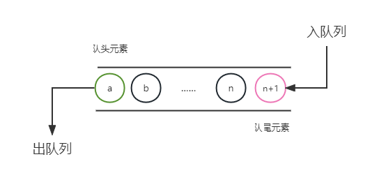
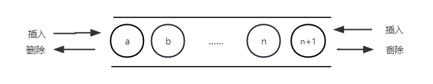

---
tags:
  - 408考研复习
  - 数据结构
comments: true
---

队列
===

## 定义

<figure>


<figcaption>队列（上）/双端队列（下）</figcaption>
</figure>

* 队列(Queue)也是一种运算受限的线性表。它只允许在表的一端进行插入，而在另一端进行删除。允许删除的一端称为队头(front)，允许插入的一端称为队尾(rear)。
* 因为先进入队列的成员总是先离开队列，队列亦称作先进先出(First In First Out)的线性表，简称FIFO表

## ADT类型定义
* 数据对象：$D=\{a_i | a_i \in ElemSet, i=1,2,...,n, n≥0 \}$
* 数据关系：$R1=\{\left \langle a_{i-1},a_i\right \rangle| a_{i-1},a_i \in D,  i=2,...,n\}$ 约定 $a_n$ 端为队列尾，$a_1$ 端为队列头
* 基本操作

    === "结构建立与销毁"
        * `InitQueue(&Q)`
            - 操作结果：构造一个空队列 `Q`。
        * `DestroyQueue(&Q)`
            - 初始条件：队列 `Q` 已存在。
            - 操作结果：队列 `Q` 被销毁。

    === "添加及删除数据"
        * `EnQueue(&Q, e)`
            - 初始条件：队列 `Q` 已存在。
            - 操作结果：插入元素 `e` 为新的队尾元素
        * `DeQueue(&Q, &e)`
            - 初始条件：队列 `Q` 已存在且非空。
            - 操作结果：删除 `Q` 的队头元素，并用 `e` 返回其值。

    === "查找"
        * `GetHead(Q, &e)`
            - 初始条件：队列 `Q` 已存在且非空。
            - 操作结果：用 `e` 返回`Q`的队头元素

    === "遍历"
        * `QueueTraverse(Q,visit())`
            * 初始条件：队列 `Q` 已存在且非空，`visit()` 为元素的访问函数。
            * 操作结果：依次对 `Q` 的每个元素调用函数 `visit()`。一旦 `visit()` 失败，则操作失败。

    === "其他"
        * `ClearQueue(&Q)`
            * 初始条件：队列 `Q` 已存在。
            * 操作结果：将 `Q` 清为空队列。
        * `QueueEmpty(Q)`
            * 初始条件：队列`Q`已存在。
            * 操作结果：若 `Q` 为空队列，则返回 `TRUE`，否则返回 `FALSE`。
        * `QueueLength(Q)`
            * 初始条件：队列 `Q` 已存在。
            * 操作结果：返回 `Q` 中元素个数，即队列的长度。

## 存储结构
### 顺序队列

=== "静态顺序队列"
    ```c
    #define MAXSIZE 100
    typedef struct{
        ElemType data[MAXSIZE];
        int front,rear;
    }SqQueue;
    ```

    !!! tip "循环静态顺序队列"
        * 最大限度的利用数组空间
        * 出入队列时修改指针注意对maxsize取余
            * 初始化建空队列时，令 front=rear=0；
            * 每当插入一个新的队尾元素后，尾指针 rear增1；
            * 每当删除一个队头元素之后，头指针front增1。
        * 队列中一共有 $(rear+Maxsize-front) \% Maxsize$ 个元素
        * 判满：`(Q.rear+1)%maxsize==Q.front`

=== "动态顺序队列"
    ```c
    #define MAXQSIZE 50
    typedef struct
    {
        ElemType *base;    /* 初始化的动态分配存储空间 */
        int front;       /* 头指针，若队列不空，指向队列头元素 */
        int rear;        /* 尾指针，若队列不空，指向队列尾元素的下一个位置 */
    }SqQueue;
    ```

* 基本操作的实现(循环的顺序队列)

    === "队列的创建"

        === "C"
            ```c
            Status InitQueue(SqQueue &Q)
            {
            // 构造一个最大存储空间为 maxsize 的空队列 Q
                Q.base = (ElemType*)malloc(MAXQSIZE * sizeof(ElemType));
                // 为循环队列分配存储空间
                if (!Q.base) exit(OVERFLOW); // 存储分配失败
                Q.front = Q.rear = 0;
                return OK;
            } // InitQueue
            ```

    === "判断队列是否为空"
        ```c++
        bool isEmpty(SqQueue Q)
        {
            return Q.rear==Q.front;
        }
        ```

    === "入队"

        === "C"
            ```c
            Status EnQueue(SqQueue &Q, ElemType e)
            {
                // 若当前队列不满，就在当前队列的尾元素之后，插入元素 e 为新的队列尾元素
                if ((Q.rear + 1) % MAXQSIZE == Q.front ) //注意判满的方法
                return ERROR;
                Q.base[Q.rear] = e;
                Q.rear = (Q.rear+1) % MAXQSIZE;
                return OK;
            }
            ```

        === "C++"
            ```c++
            bool EnQueue(SqQueue &Q,ElemType e)
            {
                if(Q.rear+1>=MAXSIZE) return false;
                else{
                    Q.data[Q.rear] = e;
                    Q.rear = Q.rear + 1;
                    return true;
                }
            }
            ```

    === "出队"

        === "C"
            ```c
            Status DeQueue (SqQueue &Q, ElemType &e)
            {
                // 若队列不空，则删除当前队列Q中的头元素，用 e 返回其值
                if (Q.front == Q.rear) //注意判空的方法
                return ERROR;
                e = Q.base[Q.front];
                Q.front = (Q.front+1) % MAXQSIZE;
                return OK;
            }
            ```

        === "C++"
            ```c++
            bool DeQueue(SqQueue &Q,ElemType &e)
            {
                if(Q.rear==Q.front) return false;
                else{
                    e = Q.data[Q.front];
                    Q.front = Q.front +1;
                    return true;
                }
            }
            ```

### 链队列
* 队列的链式存储结构简称为链队列，它是限制仅在表头删除和表尾插入的单链表。
* 结构定义
    ```c
    typedef struct LinkNode{
        ElemType data;
        struct LinkNode *next;
    }LinkNode,*LinkQueuePtr;
    typedef struct{
        LinkNode *front, *rear;
    }LinkQueue;
    ```

* 基本操作的实现

    === "构造空队列"
        构造一个空队列 Q

        === "C"
            ```c
            Status InitQueue (LinkQueue &Q)
            {
                Q.front = Q.rear = (LinkQueuePtr)malloc(sizeof(LinkNode));
                if (!Q.front) exit(OVERFLOW); // 存储分配失败
                Q.front->next = NULL;
                return OK;
            }
            ```

    === "销毁队列"
        销毁队列 Q

        === "C"
            ```c
            Status DestroyQueue(LinkQueue &Q)
            {
                while(Q.front)
                {
                    Q.rear = Q.front->next;
                    free(Q.front);
                    Q.front = Q.rear;
                }
                free(Q);
                Q = NULL;
                return OK;
            }
            ```

    === "入队"
        在当前队列的尾元素之后，插入元素 e 为新的队列尾元素

        === "C"
            ```c
            Status EnQueue(LinkQueue &Q,ElemType e)
            {
                p = (LinkQueuePtr) malloc(sizeof(LinkNode));
                if (!p) exit(OVERFLOW); // 存储分配失败
                p->data=e; p->next = NULL;
                Q.rear->next = p; // 修改尾结点的指针
                Q.rear = p; // 移动队尾指针
                return OK;
            }
            ```

    === "出队"
        若队列不空 ，则删除当前队列 Q 中的头元素,用 e 返回其值 ，并返回 TRUE，否则返回 FALSE

        === "C"
            ```c
            Status DeQueue(LinkQueue &Q, ElemType &e)
            {
                if (Q.front == Q.rear) // 链队列中只有一个头结点
                return FALSE;
                p = Q.front->next;
                e = p->data; // 返回被删元素
                Q.front->next = p->next; // 修改头结点指针
                if(Q.rear == p) Q.rear = Q.front;
                free(p); // 释放被删结点
                return OK;
            }
            ```

## 应用
### 树的层次遍历

!!! summary "核心思想"
    每次出队一个元素，就将该元素的孩子节点加入队列中，直到队列中元素个数为0时，出队的顺序就是该二叉树的层次遍历结果。

```c++ title="c++代码写法"
vector<vector<int>> levelOrder(TreeNode *root) {
    if (root == nullptr) return {};
    vector<vector<int>> ans;
    queue<TreeNode *> q;
    q.push(root);
    while (!q.empty()) {
        vector<int> vals;
        for (int n = q.size(); n--;) {
            // 取出队首元素
            auto node = q.front();
            q.pop();
            // 加入至结果集
            vals.push_back(node->val);
            // 推入非空左孩子
            if (node->left)  q.push(node->left);
            // 推入非空右孩子
            if (node->right) q.push(node->right);
        }
        ans.emplace_back(vals);
    }
    return ans;
}
```

### 图的广度优先遍历

具体算法见[图 > 图的广度优先遍历](graph.md#图的遍历)章节。使用了队列+辅助标记数组的方法。
