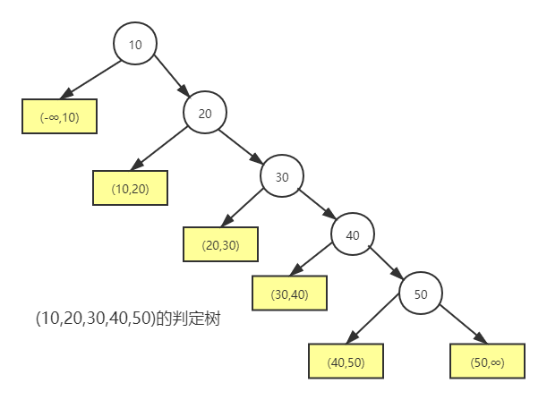
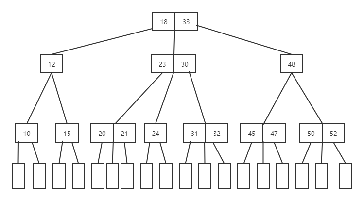
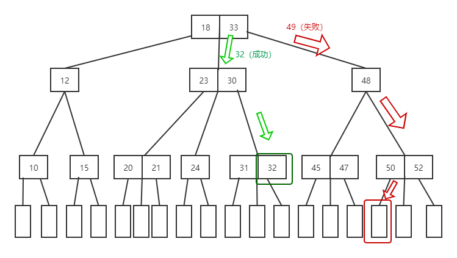
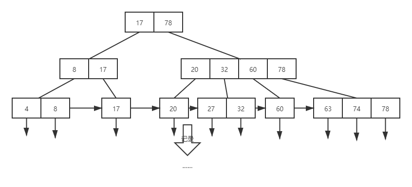

---
tags:
  - 408考研复习
  - 数据结构
---

查找
===

|算法|类型|时间复杂度|
|:--:|:--:|:--:|
|顺序查找|静态查找| $O(n)$ |
|折半查找|静态查找| $O(logn)$ |
|索引顺序（分块）查找|静态查找| $O(\log(m)+N/m)$ |
|B树/B+树|动态查找|--|
|哈希查找|--| $O(1)$ （无冲突）|

## 概念
根据给定的某个值，在查找表中确定一个其关键字等于给定值的数据元素。若表中存在这样的一个元素，则称查找是成功的，此时查找的结
果为给出整个数据元素的信息，或指示该数据元素在查找表中的位置；若表中不存在这样的元素，则称查找不成功。

* 关键字(key)：是数据元素中某个数据项的值，用它可以标识（识别）一个数据元素
* 平均查找长度（ASL）：关键字比较次数的平均值
* 查找表是由同一类型的数据元素(或记录)构成的集合

|操作|静态查找表|动态查找表|
|:--:|:--:|:--:|
|查询某个“特定的”数据元素是否在表中|√|√|
|检索某个“特定的”数据元素的各种属性|√|√|
|在查找表中插入一个数据元素|×|√|
|从查找表中删除某个数据元素|×|√|

??? summary "ADT抽象类型定义"

    === "静态查找表"

        ```text
        ADT StaticSearchTable {
            数据对象：D是具有相同特性的数据元素的集合。每个数据元素含有类型相同的关键字，可唯一标识数据元素。
            数据关系：D中所有数据元素同属一个集合。
            基本操作：
            CreateTable(&ST, n);
            操作结果：构造一个含 n 个数据元素的静态查找表 ST。
            DestroyTable(&ST);
            初始条件：静态查找表 ST 存在；
            操作结果：销毁查找表 ST。
            Search(ST, key);
            初始条件：静态查找表 ST 存在，key为和查找表中元素的
            关键字类型相同的给定值；
            操作结果：若ST中存在其关键字等于key 的数据元素，则函
            数值为该元素的值或在表中的位置，否则为“空”。
            Traverse(ST, Visit());
            初始条件：静态查找表 ST 存在，Visit 是对元素操作的应用
            函数；
            操作结果：按某种次序对ST的每个元素调用函数 visit() 一
            次且仅一次，一旦 visit() 失败，则操作失败。
        } ADT StaticSearchTable
        ```

        ```c
        typedef struct{
            ElemType *elem;
            int Tablelen;
        }SSTable;
        ```

    === "动态查找表"
        对于给定值key，若表中存在其关键字等于key的记录，则查找成功返回，否则插入关键字等于key的记录。

        ```text
        ADT DynamicSearchTable {
            数据对象D ：D是具有相同特性的数据元素的集合。每个数据元素含有类型相同的关键字，可唯一标识数据元素。
            数据关系R：数据元素同属一个集合。
            基本操作P：
            InitDSTable(&DT);
            操作结果：构造一个空的动态查找表 DT。
            DestroyDSTable(&DT);
            初始条件：动态查找表DT存在；
            操作结果：销毁动态查找表 DT。
            SearchDSTable(DT, key);
            初始条件：动态查找表DT存在，key为和关键字类型相同的给定值；
            操作结果：若DT中存在其关键字等于key的数据元素，则函数值为该元素的
            值或在表中的位置，否则为“空”。
            InsertDSTable(&DT, e);
            初始条件：动态查找表DT存在，e 为待插入的数据元素；
            操作结果：若DT中不存在其关键字等于e.key的数据元素，则插入e 到DT。
            DeleteDSTable(&T, key);
            初始条件：动态查找表DT存在，key为和关键字类型相同的给定值；
            操作结果：若DT中存在其关键字等于key的数据元素，则删除之。
            TraverseDSTable(DT, Visit());
            初始条件：动态查找表DT存在，Visit 是对结点操作的应用函数；
            操作结果：按某种次序对DT的每个结点调用函数visit()一次且至多一次。一
            旦 visit() 失败，则操作失败。
        } ADT DynamicSearchTable
        ```

## 顺序查找法
从表中最后一个记录开始，逐个进行记录的关键字和给定值的比较，若某个记录的关键字和给定值比较相等，则查找成功，找到所查记录；反之，若直至第一个记录，其关键字和给定值比较都不等，则表明表中没有所查记录， 查找不成功

* 无序线性表
    * 查找失败时，要遍历整个线性表

    ```c++
    int search_seq(SSTable ST,ElemType key)
    {
        ST.elem[0]=key;
        for(int i=ST.Tablelen;ST.elem[i]!=key;i--);
        return i;
    }
    ```

    !!! summary ""
        令 $P_i=\frac {1}{n}$，则平均查找长度的表达式为：

        $$
        \begin{align}
        ASL=
        \begin{cases}
        \frac{n+1}{2}&,查找成功 \\
        n+1&,查找失败
        \end{cases}
        \end{align}
        $$

* 有序线性表
    * 查找失败时，不一定要遍历整个线性表
    * 判定树：描述查找过程的二叉排序树

    

    !!! summary ""
        令 $P_i=\frac {1}{n}$，则平均查找长度的表达式为：

        $$
        \begin{align}
        ASL_{失败} = \sum_{i = 1}^{n} P_jC_j &= \sum_{j = 1}^{n} \frac{1}{n+1}(l_j-1) \\
        &= \frac {1+2+\cdots +n+n}{n+1} = \frac{n}{2}+\frac{n}{n+1}
        \end{align}
        $$


## 折半查找法
* 二分查找
    * 仅适用于有序的顺序表
    * 思想：key与中间比较，若相等，返回该元素位置；若不等，则在前半部分或后半部分寻找。

    ```c++
    int binary_search(SeqList L,ElemType key)
    {
        int low=0,high=L.Tablelen-1,mid;
        while(low<=high){
            mid=(low+high)/2;
            if(L.elem[mid]==key) return mid;
            else if(L.elem[mid]>key) high=mid-1;
            else low=mid+1;
        }
        return -1;
    }
    ```

    !!! summary ""
        令 $P_i=\frac {1}{n}$，则平均查找长度的表达式为：

        $$
        \begin{align}
        ASL_{成功} = \sum_{i = 1}^{n} P_iC_i &= \frac{1}{n} \sum_{j = 1}^{h} j \times 2^{j-1} \\
        &= \frac {1\times 1+2\times 2+\cdots +h\times 2^{h-1}}{n} \\
        &= \frac{n+1}{n}log_2(n+1)-1\\
        &\approx log_2(n+1)-1
        \end{align}
        $$

## 分块查找法
索引顺序查找是顺序查找的一种改进方法，通过建立“索引表”，对每个子表建立“索引项”来实现。

* 索引项包括
    * 关键字项：其值为该子表内的最大关键字
    * 指针项：指示该子表的第一个记录在表中的位置
* 索引表间有序，后面子表的所有关键字大于前面子表的最大关键字
* 算法：首先在索引表中进行折半或顺序查找，以确定待查关键字在分块有序表中所在“块”，块中记录是任意排列的，在“块”中进行顺序查找

!!! summary ""
    顺序表的表长为n，并均匀地分成b块，设每块长度为s，则平均查找长度的表达式为：

    $$
    \begin{align}
    ASL_{成功}=L_i+L_s=
    \begin{cases}
    \frac {s^2+2s+n}{2s}&,顺序查找索引 \\
    \log_2(\frac{n}{s}+1)+\frac{s}{2}&, 折半查找索引
    \end{cases}
    \end{align}
    $$

## B树和B+树

=== "B-树"
    B-树中所有结点中孩子结点个数的最大值成为B-树的阶，通常用m表示。
    

    * 一棵m阶B树或为空树，或为满足以下特性的m叉树：
        1. 树中每个结点至多有m棵子树
        2. 若根结点不是终端结点，则至少有两棵子树
        3. 除根结点外的所有非叶结点至少有 $\lceil \frac {m}{2} \rceil$ 棵子树
        4. 结点内各关键字互不相等且按从小到大排列
        5. 如果一个结点有n-1个关键字，那么该结点有n个分支。这n-1个关键字按照递增顺序排列
        6. 叶子结点处于同一层；可以用空指针表示，是查找失败到达的位置
    * 非叶结点的结构

        <table>
        <thead>
        <tr>
        <th style="text-align:center">n</th>
        <th style="text-align:center">k1</th>
        <th style="text-align:center">k2</th>
        <th style="text-align:center">...</th>
        <th style="text-align:center">kn</th>
        </tr>
        </thead>
        <tbody>
        <tr>
        <td style="text-align:center">p0</td>
        <td style="text-align:center">p1</td>
        <td style="text-align:center">p2</td>
        <td style="text-align:center">...</td>
        <td style="text-align:center">pn</td>
        </tr>
        </tbody>
        </table>

        - 其中，n为关键字的个数
        - $k_i$ 为该结点的关键字且满足 $ki<ki+1$
        - $i$ 为该结点的孩子结点指针且满足 $p_i$ 所指结点上的关键字大于 $k_i$ 且小于 $k_i+1$
        - $p_{i-1}$ 所指结点上的关键字小于$k_i$ ，$p_i$ 所指结点上的关键字大于 $k_i$

    * B-树的基本操作

    === "查找"
        1. 先让key与根结点中的关键字比较，如果key等于`k[i]`（`k[]`为结点内的关键字数组），则查找成功
        2. 若`key<k[1]`，则到`p[0]`所指示的子树中进行继续查找（`p[]``为结点内的指针数组），这里要注意B-树中每个结点的内部结构。
        3. 若`key>k[n]`，则到`p[n]`所指示的子树中继续查找。
        4. 若`k[i]<key<k[i+1]`，则沿着指针`p[i]`所指示的子树继续查找。
        5. 如果最后遇到空指针，则证明查找不成功。

        

    === "插入"
        * 在B-树的查找过程中，当遇到空指针时，则证明查找不成功，同时也找到了插入位置。在插入过程中有可能破坏B-树的特征，如新关键字的插入使得结点中关键字的个数超过规定个数，这时要进行结点的拆分。

        <!--来点例子-->

    === "删除"
        * 找到待删除的关键字，在结点中删除关键字的过程也有可能破坏B-树的特性，这时可能需要向其兄弟结点借关键字或者和其孩子结点进行关键字的交换，也可能需要进行结点的合并。

        <!--例子待补-->
        === "直接删除"

        === "兄弟够借"

        === "兄弟不够借"

=== "B+树"
    B+树的特点是能够保持数据稳定有序，其插入与修改拥有较稳定的对数时间复杂度。

    

    * 一个m阶的B+树具有如下几个特征：
        1. 每个分支结点最多有m棵子树。
        2. 有k个子树的中间节点包含有k个元素（B树中是k-1个元素），每个元素不保存数据，只用来索引，所有数据都保存在叶子节点。
        3. 所有的叶子结点中包含了全部关键字及指向相应记录的指针，叶结点中将关键字按大小顺序排列，并且相邻的结点按大小顺序连接起来。
        4. 所有的中间节点元素都同时存在于子节点，在子节点元素中是最大（或最小）元素。

## 散列表
在记录的存储位置和它的关键字之间建立一个确定的对应关系 $f$ ，使每个关键字和结构中一个惟一的存储位置相对应。因而在查找时，只要根据这个对应关系 $f$ 找到给定值 $K$ 的像 $f(K)$ 。若结构中存在关键字和 $K$ 相等的记录，则必定在 $f(K)$ 的存储位置上。在此，我们称这个对应关系 $f$ 为哈希(Hash)函数，按这个思想建立的表为哈希表。

* 若关键字不同而函数值相同，则称这两个关键字（对于该哈希函数而言）为“同义词”，并称这种现象为“冲突”。

### 哈希函数的构造方法

!!! summary "构造要求"
    1. 定义域包含全部需要存储的关键字，值域范围依赖于散列表的大小或地址范围
    2. 哈希函数的结果等概率均匀分布在整个地址空间中
    3. 尽量简单

=== "直接定址法"
    取关键字本身或关键字的某个线性函数值作为哈希表的地址，不会产生冲突

    $$
    H(k)=a \times k +b
    $$

=== "除留取余法"
    取关键字被某个不大于哈希表长 $m$ 的数 $p$ 除后所得余数作为哈希地址

    $$
    H(k)=k \% p
    $$

=== "数字分析法"
    如果可能出现的关键字的数位相同，且取值事先知道，则可对关键字进行分析，取其中“分布均匀”的若干位或它们的组合作为哈希表的地址

=== "平方取中法"
    如果关键字的所有各位分布都不均匀，则可取关键字的平方值的中间若干位作为哈希表的地址。由于一个数的平方值的中间几位数受该数所有位影响，将使随机分布的关键字得到的哈希函数值也随机。

    ```text
    例如，521^2 = 271441 取H(521)=7144
    ```

=== "折叠法"
    若关键字的位数很多，且每一位上数字分布大致均匀，则可采用移位叠加或间界叠加，即将关键字分成若干部分，然后以它们的叠加和(舍去进位)作为哈希地址。

    * 移位叠加是将分割后的每一部分的最低位对齐，然后相加；

    * 间界叠加是从一端向另一端沿分割界来回折叠，然后对齐相加。

    ```text
    例如，521+125+2=648 取H(5211252)=648
    ```

=== "随机数法"
    当关键字不等长时，可取关键字的某个伪随机函数值作为哈希地址

    $$
    H(k)=random(k)
    $$

### 处理冲突的方法
为产生冲突的地址寻找下一个哈希地址

=== "开放定址法"
    设法为发生冲突的关键字“找到”哈希表中另一个尚未被记录占用的位置

    $$
    H_i=(H(k)+d_i) \% m \quad i=0,1,2, \cdots ,k(k \le m-1)
    $$

    === "线性探查"

        $$
        d_i = 1,2,3,\cdots ,m-1
        $$

    === "平方探测"

        $$
        d_i = 0^2,1^2,-1^2,2^2,-2^2, \cdots ,k^2,-k^2 (k \le m/2)
        $$

    === "再散列"

        $$
        d_i = i \times Hash_2(k)
        $$

    === "伪随机序列"

        $$
        d_i = 伪随机序列
        $$

=== "拉链法"
    同义词存放在一个线性链表中，此时的哈希表以“指针数组”的形式出现，数组内各个分量存储相应哈希地址的链表的头指针

=== "建立一个公共溢出区"
    设立一个基本表`HashTable[0..m-1]`和一个溢出表`OverTable[0..v]`，所有关键字和基本表中关键字为同义词的记录，一旦冲突，都填入溢出表

!!! summary ""
    1. 给定K值，根据哈希函数求得哈希地址，若表中该位置上没有记录，则查找不成功；
    2. 否则，比较关键字，若关键字和给定值相等，则查找成功；
    3. 若不等，则依据建表时设定的处理冲突的方法寻找“下一个”地址，直至哈希表的某个位置为“空”或者表中所填记录的关键字等于给定值为止（该地址恰为新的记录的插入位置）

### 哈希表的查找效率
一般情况下，在哈希函数为“均匀”的前提下，哈希表的平均查找长度仅取决于处理冲突的方法和哈希表的装填因子

其中，装填因子定义为 $\alpha =\frac{表中记录数n}{哈希表的表长m}$
