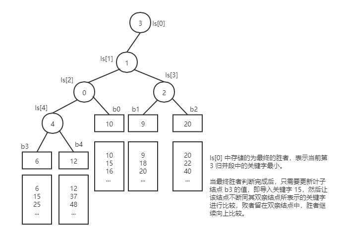
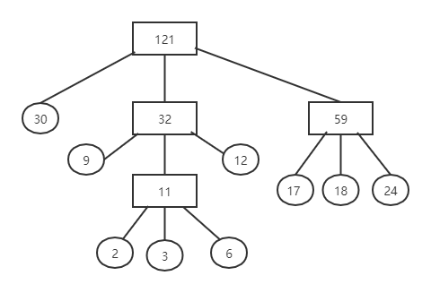

排序
===

!!! summary "排序算法总结"

    |算法|稳定性|空间复杂度|时间复杂度|顺序存储|链式存储|
    |:--:|:--:|:--:|:--:|:--:|:--:|
    |直接插入排序|√|<svg xmlns="http://www.w3.org/2000/svg" width="4.618ex" height="2.262ex" viewBox="0 -750 2041 1000" xmlns:xlink="http://www.w3.org/1999/xlink" aria-hidden="true" style=""><defs><path id="MJX-12-TEX-I-1D442" d="M740 435Q740 320 676 213T511 42T304 -22Q207 -22 138 35T51 201Q50 209 50 244Q50 346 98 438T227 601Q351 704 476 704Q514 704 524 703Q621 689 680 617T740 435ZM637 476Q637 565 591 615T476 665Q396 665 322 605Q242 542 200 428T157 216Q157 126 200 73T314 19Q404 19 485 98T608 313Q637 408 637 476Z"></path><path id="MJX-12-TEX-N-28" d="M94 250Q94 319 104 381T127 488T164 576T202 643T244 695T277 729T302 750H315H319Q333 750 333 741Q333 738 316 720T275 667T226 581T184 443T167 250T184 58T225 -81T274 -167T316 -220T333 -241Q333 -250 318 -250H315H302L274 -226Q180 -141 137 -14T94 250Z"></path><path id="MJX-12-TEX-N-31" d="M213 578L200 573Q186 568 160 563T102 556H83V602H102Q149 604 189 617T245 641T273 663Q275 666 285 666Q294 666 302 660V361L303 61Q310 54 315 52T339 48T401 46H427V0H416Q395 3 257 3Q121 3 100 0H88V46H114Q136 46 152 46T177 47T193 50T201 52T207 57T213 61V578Z"></path><path id="MJX-12-TEX-N-29" d="M60 749L64 750Q69 750 74 750H86L114 726Q208 641 251 514T294 250Q294 182 284 119T261 12T224 -76T186 -143T145 -194T113 -227T90 -246Q87 -249 86 -250H74Q66 -250 63 -250T58 -247T55 -238Q56 -237 66 -225Q221 -64 221 250T66 725Q56 737 55 738Q55 746 60 749Z"></path></defs><g stroke="currentColor" fill="currentColor" stroke-width="0" transform="matrix(1 0 0 -1 0 0)"><g data-mml-node="math"><g data-mml-node="mi"><use xlink:href="#MJX-12-TEX-I-1D442"></use></g><g data-mml-node="mo" transform="translate(763, 0)"><use xlink:href="#MJX-12-TEX-N-28"></use></g><g data-mml-node="mn" transform="translate(1152, 0)"><use xlink:href="#MJX-12-TEX-N-31"></use></g><g data-mml-node="mo" transform="translate(1652, 0)"><use xlink:href="#MJX-12-TEX-N-29"></use></g></g></g></svg>|<svg xmlns="http://www.w3.org/2000/svg" width="5.757ex" height="2.565ex" viewBox="0 -883.9 2544.6 1133.9" xmlns:xlink="http://www.w3.org/1999/xlink" aria-hidden="true" style=""><defs><path id="MJX-10-TEX-I-1D442" d="M740 435Q740 320 676 213T511 42T304 -22Q207 -22 138 35T51 201Q50 209 50 244Q50 346 98 438T227 601Q351 704 476 704Q514 704 524 703Q621 689 680 617T740 435ZM637 476Q637 565 591 615T476 665Q396 665 322 605Q242 542 200 428T157 216Q157 126 200 73T314 19Q404 19 485 98T608 313Q637 408 637 476Z"></path><path id="MJX-10-TEX-N-28" d="M94 250Q94 319 104 381T127 488T164 576T202 643T244 695T277 729T302 750H315H319Q333 750 333 741Q333 738 316 720T275 667T226 581T184 443T167 250T184 58T225 -81T274 -167T316 -220T333 -241Q333 -250 318 -250H315H302L274 -226Q180 -141 137 -14T94 250Z"></path><path id="MJX-10-TEX-I-1D45B" d="M21 287Q22 293 24 303T36 341T56 388T89 425T135 442Q171 442 195 424T225 390T231 369Q231 367 232 367L243 378Q304 442 382 442Q436 442 469 415T503 336T465 179T427 52Q427 26 444 26Q450 26 453 27Q482 32 505 65T540 145Q542 153 560 153Q580 153 580 145Q580 144 576 130Q568 101 554 73T508 17T439 -10Q392 -10 371 17T350 73Q350 92 386 193T423 345Q423 404 379 404H374Q288 404 229 303L222 291L189 157Q156 26 151 16Q138 -11 108 -11Q95 -11 87 -5T76 7T74 17Q74 30 112 180T152 343Q153 348 153 366Q153 405 129 405Q91 405 66 305Q60 285 60 284Q58 278 41 278H27Q21 284 21 287Z"></path><path id="MJX-10-TEX-N-32" d="M109 429Q82 429 66 447T50 491Q50 562 103 614T235 666Q326 666 387 610T449 465Q449 422 429 383T381 315T301 241Q265 210 201 149L142 93L218 92Q375 92 385 97Q392 99 409 186V189H449V186Q448 183 436 95T421 3V0H50V19V31Q50 38 56 46T86 81Q115 113 136 137Q145 147 170 174T204 211T233 244T261 278T284 308T305 340T320 369T333 401T340 431T343 464Q343 527 309 573T212 619Q179 619 154 602T119 569T109 550Q109 549 114 549Q132 549 151 535T170 489Q170 464 154 447T109 429Z"></path><path id="MJX-10-TEX-N-29" d="M60 749L64 750Q69 750 74 750H86L114 726Q208 641 251 514T294 250Q294 182 284 119T261 12T224 -76T186 -143T145 -194T113 -227T90 -246Q87 -249 86 -250H74Q66 -250 63 -250T58 -247T55 -238Q56 -237 66 -225Q221 -64 221 250T66 725Q56 737 55 738Q55 746 60 749Z"></path></defs><g stroke="currentColor" fill="currentColor" stroke-width="0" transform="matrix(1 0 0 -1 0 0)"><g data-mml-node="math"><g data-mml-node="mi"><use xlink:href="#MJX-10-TEX-I-1D442"></use></g><g data-mml-node="mo" transform="translate(763, 0)"><use xlink:href="#MJX-10-TEX-N-28"></use></g><g data-mml-node="msup" transform="translate(1152, 0)"><g data-mml-node="mi"><use xlink:href="#MJX-10-TEX-I-1D45B"></use></g><g data-mml-node="mn" transform="translate(600, 413) scale(0.707)"><use xlink:href="#MJX-10-TEX-N-32"></use></g></g><g data-mml-node="mo" transform="translate(2155.6, 0)"><use xlink:href="#MJX-10-TEX-N-29"></use></g></g></g></svg>|√|√|
    |折半插入排序|√|<svg xmlns="http://www.w3.org/2000/svg" width="4.618ex" height="2.262ex" viewBox="0 -750 2041 1000" xmlns:xlink="http://www.w3.org/1999/xlink" aria-hidden="true" style=""><defs><path id="MJX-12-TEX-I-1D442" d="M740 435Q740 320 676 213T511 42T304 -22Q207 -22 138 35T51 201Q50 209 50 244Q50 346 98 438T227 601Q351 704 476 704Q514 704 524 703Q621 689 680 617T740 435ZM637 476Q637 565 591 615T476 665Q396 665 322 605Q242 542 200 428T157 216Q157 126 200 73T314 19Q404 19 485 98T608 313Q637 408 637 476Z"></path><path id="MJX-12-TEX-N-28" d="M94 250Q94 319 104 381T127 488T164 576T202 643T244 695T277 729T302 750H315H319Q333 750 333 741Q333 738 316 720T275 667T226 581T184 443T167 250T184 58T225 -81T274 -167T316 -220T333 -241Q333 -250 318 -250H315H302L274 -226Q180 -141 137 -14T94 250Z"></path><path id="MJX-12-TEX-N-31" d="M213 578L200 573Q186 568 160 563T102 556H83V602H102Q149 604 189 617T245 641T273 663Q275 666 285 666Q294 666 302 660V361L303 61Q310 54 315 52T339 48T401 46H427V0H416Q395 3 257 3Q121 3 100 0H88V46H114Q136 46 152 46T177 47T193 50T201 52T207 57T213 61V578Z"></path><path id="MJX-12-TEX-N-29" d="M60 749L64 750Q69 750 74 750H86L114 726Q208 641 251 514T294 250Q294 182 284 119T261 12T224 -76T186 -143T145 -194T113 -227T90 -246Q87 -249 86 -250H74Q66 -250 63 -250T58 -247T55 -238Q56 -237 66 -225Q221 -64 221 250T66 725Q56 737 55 738Q55 746 60 749Z"></path></defs><g stroke="currentColor" fill="currentColor" stroke-width="0" transform="matrix(1 0 0 -1 0 0)"><g data-mml-node="math"><g data-mml-node="mi"><use xlink:href="#MJX-12-TEX-I-1D442"></use></g><g data-mml-node="mo" transform="translate(763, 0)"><use xlink:href="#MJX-12-TEX-N-28"></use></g><g data-mml-node="mn" transform="translate(1152, 0)"><use xlink:href="#MJX-12-TEX-N-31"></use></g><g data-mml-node="mo" transform="translate(1652, 0)"><use xlink:href="#MJX-12-TEX-N-29"></use></g></g></g></svg>|<svg xmlns="http://www.w3.org/2000/svg" width="5.757ex" height="2.565ex" viewBox="0 -883.9 2544.6 1133.9" xmlns:xlink="http://www.w3.org/1999/xlink" aria-hidden="true" style=""><defs><path id="MJX-10-TEX-I-1D442" d="M740 435Q740 320 676 213T511 42T304 -22Q207 -22 138 35T51 201Q50 209 50 244Q50 346 98 438T227 601Q351 704 476 704Q514 704 524 703Q621 689 680 617T740 435ZM637 476Q637 565 591 615T476 665Q396 665 322 605Q242 542 200 428T157 216Q157 126 200 73T314 19Q404 19 485 98T608 313Q637 408 637 476Z"></path><path id="MJX-10-TEX-N-28" d="M94 250Q94 319 104 381T127 488T164 576T202 643T244 695T277 729T302 750H315H319Q333 750 333 741Q333 738 316 720T275 667T226 581T184 443T167 250T184 58T225 -81T274 -167T316 -220T333 -241Q333 -250 318 -250H315H302L274 -226Q180 -141 137 -14T94 250Z"></path><path id="MJX-10-TEX-I-1D45B" d="M21 287Q22 293 24 303T36 341T56 388T89 425T135 442Q171 442 195 424T225 390T231 369Q231 367 232 367L243 378Q304 442 382 442Q436 442 469 415T503 336T465 179T427 52Q427 26 444 26Q450 26 453 27Q482 32 505 65T540 145Q542 153 560 153Q580 153 580 145Q580 144 576 130Q568 101 554 73T508 17T439 -10Q392 -10 371 17T350 73Q350 92 386 193T423 345Q423 404 379 404H374Q288 404 229 303L222 291L189 157Q156 26 151 16Q138 -11 108 -11Q95 -11 87 -5T76 7T74 17Q74 30 112 180T152 343Q153 348 153 366Q153 405 129 405Q91 405 66 305Q60 285 60 284Q58 278 41 278H27Q21 284 21 287Z"></path><path id="MJX-10-TEX-N-32" d="M109 429Q82 429 66 447T50 491Q50 562 103 614T235 666Q326 666 387 610T449 465Q449 422 429 383T381 315T301 241Q265 210 201 149L142 93L218 92Q375 92 385 97Q392 99 409 186V189H449V186Q448 183 436 95T421 3V0H50V19V31Q50 38 56 46T86 81Q115 113 136 137Q145 147 170 174T204 211T233 244T261 278T284 308T305 340T320 369T333 401T340 431T343 464Q343 527 309 573T212 619Q179 619 154 602T119 569T109 550Q109 549 114 549Q132 549 151 535T170 489Q170 464 154 447T109 429Z"></path><path id="MJX-10-TEX-N-29" d="M60 749L64 750Q69 750 74 750H86L114 726Q208 641 251 514T294 250Q294 182 284 119T261 12T224 -76T186 -143T145 -194T113 -227T90 -246Q87 -249 86 -250H74Q66 -250 63 -250T58 -247T55 -238Q56 -237 66 -225Q221 -64 221 250T66 725Q56 737 55 738Q55 746 60 749Z"></path></defs><g stroke="currentColor" fill="currentColor" stroke-width="0" transform="matrix(1 0 0 -1 0 0)"><g data-mml-node="math"><g data-mml-node="mi"><use xlink:href="#MJX-10-TEX-I-1D442"></use></g><g data-mml-node="mo" transform="translate(763, 0)"><use xlink:href="#MJX-10-TEX-N-28"></use></g><g data-mml-node="msup" transform="translate(1152, 0)"><g data-mml-node="mi"><use xlink:href="#MJX-10-TEX-I-1D45B"></use></g><g data-mml-node="mn" transform="translate(600, 413) scale(0.707)"><use xlink:href="#MJX-10-TEX-N-32"></use></g></g><g data-mml-node="mo" transform="translate(2155.6, 0)"><use xlink:href="#MJX-10-TEX-N-29"></use></g></g></g></svg>|√||
    |希尔排序||<svg xmlns="http://www.w3.org/2000/svg" width="4.618ex" height="2.262ex" viewBox="0 -750 2041 1000" xmlns:xlink="http://www.w3.org/1999/xlink" aria-hidden="true" style=""><defs><path id="MJX-12-TEX-I-1D442" d="M740 435Q740 320 676 213T511 42T304 -22Q207 -22 138 35T51 201Q50 209 50 244Q50 346 98 438T227 601Q351 704 476 704Q514 704 524 703Q621 689 680 617T740 435ZM637 476Q637 565 591 615T476 665Q396 665 322 605Q242 542 200 428T157 216Q157 126 200 73T314 19Q404 19 485 98T608 313Q637 408 637 476Z"></path><path id="MJX-12-TEX-N-28" d="M94 250Q94 319 104 381T127 488T164 576T202 643T244 695T277 729T302 750H315H319Q333 750 333 741Q333 738 316 720T275 667T226 581T184 443T167 250T184 58T225 -81T274 -167T316 -220T333 -241Q333 -250 318 -250H315H302L274 -226Q180 -141 137 -14T94 250Z"></path><path id="MJX-12-TEX-N-31" d="M213 578L200 573Q186 568 160 563T102 556H83V602H102Q149 604 189 617T245 641T273 663Q275 666 285 666Q294 666 302 660V361L303 61Q310 54 315 52T339 48T401 46H427V0H416Q395 3 257 3Q121 3 100 0H88V46H114Q136 46 152 46T177 47T193 50T201 52T207 57T213 61V578Z"></path><path id="MJX-12-TEX-N-29" d="M60 749L64 750Q69 750 74 750H86L114 726Q208 641 251 514T294 250Q294 182 284 119T261 12T224 -76T186 -143T145 -194T113 -227T90 -246Q87 -249 86 -250H74Q66 -250 63 -250T58 -247T55 -238Q56 -237 66 -225Q221 -64 221 250T66 725Q56 737 55 738Q55 746 60 749Z"></path></defs><g stroke="currentColor" fill="currentColor" stroke-width="0" transform="matrix(1 0 0 -1 0 0)"><g data-mml-node="math"><g data-mml-node="mi"><use xlink:href="#MJX-12-TEX-I-1D442"></use></g><g data-mml-node="mo" transform="translate(763, 0)"><use xlink:href="#MJX-12-TEX-N-28"></use></g><g data-mml-node="mn" transform="translate(1152, 0)"><use xlink:href="#MJX-12-TEX-N-31"></use></g><g data-mml-node="mo" transform="translate(1652, 0)"><use xlink:href="#MJX-12-TEX-N-29"></use></g></g></g></svg>|和所取增量序列相关*|√||
    |冒泡排序|√|<svg xmlns="http://www.w3.org/2000/svg" width="4.618ex" height="2.262ex" viewBox="0 -750 2041 1000" xmlns:xlink="http://www.w3.org/1999/xlink" aria-hidden="true" style=""><defs><path id="MJX-12-TEX-I-1D442" d="M740 435Q740 320 676 213T511 42T304 -22Q207 -22 138 35T51 201Q50 209 50 244Q50 346 98 438T227 601Q351 704 476 704Q514 704 524 703Q621 689 680 617T740 435ZM637 476Q637 565 591 615T476 665Q396 665 322 605Q242 542 200 428T157 216Q157 126 200 73T314 19Q404 19 485 98T608 313Q637 408 637 476Z"></path><path id="MJX-12-TEX-N-28" d="M94 250Q94 319 104 381T127 488T164 576T202 643T244 695T277 729T302 750H315H319Q333 750 333 741Q333 738 316 720T275 667T226 581T184 443T167 250T184 58T225 -81T274 -167T316 -220T333 -241Q333 -250 318 -250H315H302L274 -226Q180 -141 137 -14T94 250Z"></path><path id="MJX-12-TEX-N-31" d="M213 578L200 573Q186 568 160 563T102 556H83V602H102Q149 604 189 617T245 641T273 663Q275 666 285 666Q294 666 302 660V361L303 61Q310 54 315 52T339 48T401 46H427V0H416Q395 3 257 3Q121 3 100 0H88V46H114Q136 46 152 46T177 47T193 50T201 52T207 57T213 61V578Z"></path><path id="MJX-12-TEX-N-29" d="M60 749L64 750Q69 750 74 750H86L114 726Q208 641 251 514T294 250Q294 182 284 119T261 12T224 -76T186 -143T145 -194T113 -227T90 -246Q87 -249 86 -250H74Q66 -250 63 -250T58 -247T55 -238Q56 -237 66 -225Q221 -64 221 250T66 725Q56 737 55 738Q55 746 60 749Z"></path></defs><g stroke="currentColor" fill="currentColor" stroke-width="0" transform="matrix(1 0 0 -1 0 0)"><g data-mml-node="math"><g data-mml-node="mi"><use xlink:href="#MJX-12-TEX-I-1D442"></use></g><g data-mml-node="mo" transform="translate(763, 0)"><use xlink:href="#MJX-12-TEX-N-28"></use></g><g data-mml-node="mn" transform="translate(1152, 0)"><use xlink:href="#MJX-12-TEX-N-31"></use></g><g data-mml-node="mo" transform="translate(1652, 0)"><use xlink:href="#MJX-12-TEX-N-29"></use></g></g></g></svg>|<svg xmlns="http://www.w3.org/2000/svg" width="5.757ex" height="2.565ex" viewBox="0 -883.9 2544.6 1133.9" xmlns:xlink="http://www.w3.org/1999/xlink" aria-hidden="true" style=""><defs><path id="MJX-10-TEX-I-1D442" d="M740 435Q740 320 676 213T511 42T304 -22Q207 -22 138 35T51 201Q50 209 50 244Q50 346 98 438T227 601Q351 704 476 704Q514 704 524 703Q621 689 680 617T740 435ZM637 476Q637 565 591 615T476 665Q396 665 322 605Q242 542 200 428T157 216Q157 126 200 73T314 19Q404 19 485 98T608 313Q637 408 637 476Z"></path><path id="MJX-10-TEX-N-28" d="M94 250Q94 319 104 381T127 488T164 576T202 643T244 695T277 729T302 750H315H319Q333 750 333 741Q333 738 316 720T275 667T226 581T184 443T167 250T184 58T225 -81T274 -167T316 -220T333 -241Q333 -250 318 -250H315H302L274 -226Q180 -141 137 -14T94 250Z"></path><path id="MJX-10-TEX-I-1D45B" d="M21 287Q22 293 24 303T36 341T56 388T89 425T135 442Q171 442 195 424T225 390T231 369Q231 367 232 367L243 378Q304 442 382 442Q436 442 469 415T503 336T465 179T427 52Q427 26 444 26Q450 26 453 27Q482 32 505 65T540 145Q542 153 560 153Q580 153 580 145Q580 144 576 130Q568 101 554 73T508 17T439 -10Q392 -10 371 17T350 73Q350 92 386 193T423 345Q423 404 379 404H374Q288 404 229 303L222 291L189 157Q156 26 151 16Q138 -11 108 -11Q95 -11 87 -5T76 7T74 17Q74 30 112 180T152 343Q153 348 153 366Q153 405 129 405Q91 405 66 305Q60 285 60 284Q58 278 41 278H27Q21 284 21 287Z"></path><path id="MJX-10-TEX-N-32" d="M109 429Q82 429 66 447T50 491Q50 562 103 614T235 666Q326 666 387 610T449 465Q449 422 429 383T381 315T301 241Q265 210 201 149L142 93L218 92Q375 92 385 97Q392 99 409 186V189H449V186Q448 183 436 95T421 3V0H50V19V31Q50 38 56 46T86 81Q115 113 136 137Q145 147 170 174T204 211T233 244T261 278T284 308T305 340T320 369T333 401T340 431T343 464Q343 527 309 573T212 619Q179 619 154 602T119 569T109 550Q109 549 114 549Q132 549 151 535T170 489Q170 464 154 447T109 429Z"></path><path id="MJX-10-TEX-N-29" d="M60 749L64 750Q69 750 74 750H86L114 726Q208 641 251 514T294 250Q294 182 284 119T261 12T224 -76T186 -143T145 -194T113 -227T90 -246Q87 -249 86 -250H74Q66 -250 63 -250T58 -247T55 -238Q56 -237 66 -225Q221 -64 221 250T66 725Q56 737 55 738Q55 746 60 749Z"></path></defs><g stroke="currentColor" fill="currentColor" stroke-width="0" transform="matrix(1 0 0 -1 0 0)"><g data-mml-node="math"><g data-mml-node="mi"><use xlink:href="#MJX-10-TEX-I-1D442"></use></g><g data-mml-node="mo" transform="translate(763, 0)"><use xlink:href="#MJX-10-TEX-N-28"></use></g><g data-mml-node="msup" transform="translate(1152, 0)"><g data-mml-node="mi"><use xlink:href="#MJX-10-TEX-I-1D45B"></use></g><g data-mml-node="mn" transform="translate(600, 413) scale(0.707)"><use xlink:href="#MJX-10-TEX-N-32"></use></g></g><g data-mml-node="mo" transform="translate(2155.6, 0)"><use xlink:href="#MJX-10-TEX-N-29"></use></g></g></g></svg>|√|√|
    |快速排序||<svg xmlns="http://www.w3.org/2000/svg" width="8.608ex" height="2.262ex" viewBox="0 -750 3804.6 1000" xmlns:xlink="http://www.w3.org/1999/xlink" aria-hidden="true" style=""><defs><path id="MJX-74-TEX-I-1D442" d="M740 435Q740 320 676 213T511 42T304 -22Q207 -22 138 35T51 201Q50 209 50 244Q50 346 98 438T227 601Q351 704 476 704Q514 704 524 703Q621 689 680 617T740 435ZM637 476Q637 565 591 615T476 665Q396 665 322 605Q242 542 200 428T157 216Q157 126 200 73T314 19Q404 19 485 98T608 313Q637 408 637 476Z"></path><path id="MJX-74-TEX-N-28" d="M94 250Q94 319 104 381T127 488T164 576T202 643T244 695T277 729T302 750H315H319Q333 750 333 741Q333 738 316 720T275 667T226 581T184 443T167 250T184 58T225 -81T274 -167T316 -220T333 -241Q333 -250 318 -250H315H302L274 -226Q180 -141 137 -14T94 250Z"></path><path id="MJX-74-TEX-I-1D459" d="M117 59Q117 26 142 26Q179 26 205 131Q211 151 215 152Q217 153 225 153H229Q238 153 241 153T246 151T248 144Q247 138 245 128T234 90T214 43T183 6T137 -11Q101 -11 70 11T38 85Q38 97 39 102L104 360Q167 615 167 623Q167 626 166 628T162 632T157 634T149 635T141 636T132 637T122 637Q112 637 109 637T101 638T95 641T94 647Q94 649 96 661Q101 680 107 682T179 688Q194 689 213 690T243 693T254 694Q266 694 266 686Q266 675 193 386T118 83Q118 81 118 75T117 65V59Z"></path><path id="MJX-74-TEX-I-1D45C" d="M201 -11Q126 -11 80 38T34 156Q34 221 64 279T146 380Q222 441 301 441Q333 441 341 440Q354 437 367 433T402 417T438 387T464 338T476 268Q476 161 390 75T201 -11ZM121 120Q121 70 147 48T206 26Q250 26 289 58T351 142Q360 163 374 216T388 308Q388 352 370 375Q346 405 306 405Q243 405 195 347Q158 303 140 230T121 120Z"></path><path id="MJX-74-TEX-I-1D454" d="M311 43Q296 30 267 15T206 0Q143 0 105 45T66 160Q66 265 143 353T314 442Q361 442 401 394L404 398Q406 401 409 404T418 412T431 419T447 422Q461 422 470 413T480 394Q480 379 423 152T363 -80Q345 -134 286 -169T151 -205Q10 -205 10 -137Q10 -111 28 -91T74 -71Q89 -71 102 -80T116 -111Q116 -121 114 -130T107 -144T99 -154T92 -162L90 -164H91Q101 -167 151 -167Q189 -167 211 -155Q234 -144 254 -122T282 -75Q288 -56 298 -13Q311 35 311 43ZM384 328L380 339Q377 350 375 354T369 368T359 382T346 393T328 402T306 405Q262 405 221 352Q191 313 171 233T151 117Q151 38 213 38Q269 38 323 108L331 118L384 328Z"></path><path id="MJX-74-TEX-N-32" d="M109 429Q82 429 66 447T50 491Q50 562 103 614T235 666Q326 666 387 610T449 465Q449 422 429 383T381 315T301 241Q265 210 201 149L142 93L218 92Q375 92 385 97Q392 99 409 186V189H449V186Q448 183 436 95T421 3V0H50V19V31Q50 38 56 46T86 81Q115 113 136 137Q145 147 170 174T204 211T233 244T261 278T284 308T305 340T320 369T333 401T340 431T343 464Q343 527 309 573T212 619Q179 619 154 602T119 569T109 550Q109 549 114 549Q132 549 151 535T170 489Q170 464 154 447T109 429Z"></path><path id="MJX-74-TEX-I-1D45B" d="M21 287Q22 293 24 303T36 341T56 388T89 425T135 442Q171 442 195 424T225 390T231 369Q231 367 232 367L243 378Q304 442 382 442Q436 442 469 415T503 336T465 179T427 52Q427 26 444 26Q450 26 453 27Q482 32 505 65T540 145Q542 153 560 153Q580 153 580 145Q580 144 576 130Q568 101 554 73T508 17T439 -10Q392 -10 371 17T350 73Q350 92 386 193T423 345Q423 404 379 404H374Q288 404 229 303L222 291L189 157Q156 26 151 16Q138 -11 108 -11Q95 -11 87 -5T76 7T74 17Q74 30 112 180T152 343Q153 348 153 366Q153 405 129 405Q91 405 66 305Q60 285 60 284Q58 278 41 278H27Q21 284 21 287Z"></path><path id="MJX-74-TEX-N-29" d="M60 749L64 750Q69 750 74 750H86L114 726Q208 641 251 514T294 250Q294 182 284 119T261 12T224 -76T186 -143T145 -194T113 -227T90 -246Q87 -249 86 -250H74Q66 -250 63 -250T58 -247T55 -238Q56 -237 66 -225Q221 -64 221 250T66 725Q56 737 55 738Q55 746 60 749Z"></path></defs><g stroke="currentColor" fill="currentColor" stroke-width="0" transform="matrix(1 0 0 -1 0 0)"><g data-mml-node="math"><g data-mml-node="mi"><use xlink:href="#MJX-74-TEX-I-1D442"></use></g><g data-mml-node="mo" transform="translate(763, 0)"><use xlink:href="#MJX-74-TEX-N-28"></use></g><g data-mml-node="mi" transform="translate(1152, 0)"><use xlink:href="#MJX-74-TEX-I-1D459"></use></g><g data-mml-node="mi" transform="translate(1450, 0)"><use xlink:href="#MJX-74-TEX-I-1D45C"></use></g><g data-mml-node="msub" transform="translate(1935, 0)"><g data-mml-node="mi"><use xlink:href="#MJX-74-TEX-I-1D454"></use></g><g data-mml-node="mn" transform="translate(477, -150) scale(0.707)"><use xlink:href="#MJX-74-TEX-N-32"></use></g></g><g data-mml-node="mi" transform="translate(2815.6, 0)"><use xlink:href="#MJX-74-TEX-I-1D45B"></use></g><g data-mml-node="mo" transform="translate(3415.6, 0)"><use xlink:href="#MJX-74-TEX-N-29"></use></g></g></g></svg>|<svg xmlns="http://www.w3.org/2000/svg" width="9.965ex" height="2.262ex" viewBox="0 -750 4404.6 1000" xmlns:xlink="http://www.w3.org/1999/xlink" aria-hidden="true" style=""><defs><path id="MJX-76-TEX-I-1D442" d="M740 435Q740 320 676 213T511 42T304 -22Q207 -22 138 35T51 201Q50 209 50 244Q50 346 98 438T227 601Q351 704 476 704Q514 704 524 703Q621 689 680 617T740 435ZM637 476Q637 565 591 615T476 665Q396 665 322 605Q242 542 200 428T157 216Q157 126 200 73T314 19Q404 19 485 98T608 313Q637 408 637 476Z"></path><path id="MJX-76-TEX-N-28" d="M94 250Q94 319 104 381T127 488T164 576T202 643T244 695T277 729T302 750H315H319Q333 750 333 741Q333 738 316 720T275 667T226 581T184 443T167 250T184 58T225 -81T274 -167T316 -220T333 -241Q333 -250 318 -250H315H302L274 -226Q180 -141 137 -14T94 250Z"></path><path id="MJX-76-TEX-I-1D45B" d="M21 287Q22 293 24 303T36 341T56 388T89 425T135 442Q171 442 195 424T225 390T231 369Q231 367 232 367L243 378Q304 442 382 442Q436 442 469 415T503 336T465 179T427 52Q427 26 444 26Q450 26 453 27Q482 32 505 65T540 145Q542 153 560 153Q580 153 580 145Q580 144 576 130Q568 101 554 73T508 17T439 -10Q392 -10 371 17T350 73Q350 92 386 193T423 345Q423 404 379 404H374Q288 404 229 303L222 291L189 157Q156 26 151 16Q138 -11 108 -11Q95 -11 87 -5T76 7T74 17Q74 30 112 180T152 343Q153 348 153 366Q153 405 129 405Q91 405 66 305Q60 285 60 284Q58 278 41 278H27Q21 284 21 287Z"></path><path id="MJX-76-TEX-I-1D459" d="M117 59Q117 26 142 26Q179 26 205 131Q211 151 215 152Q217 153 225 153H229Q238 153 241 153T246 151T248 144Q247 138 245 128T234 90T214 43T183 6T137 -11Q101 -11 70 11T38 85Q38 97 39 102L104 360Q167 615 167 623Q167 626 166 628T162 632T157 634T149 635T141 636T132 637T122 637Q112 637 109 637T101 638T95 641T94 647Q94 649 96 661Q101 680 107 682T179 688Q194 689 213 690T243 693T254 694Q266 694 266 686Q266 675 193 386T118 83Q118 81 118 75T117 65V59Z"></path><path id="MJX-76-TEX-I-1D45C" d="M201 -11Q126 -11 80 38T34 156Q34 221 64 279T146 380Q222 441 301 441Q333 441 341 440Q354 437 367 433T402 417T438 387T464 338T476 268Q476 161 390 75T201 -11ZM121 120Q121 70 147 48T206 26Q250 26 289 58T351 142Q360 163 374 216T388 308Q388 352 370 375Q346 405 306 405Q243 405 195 347Q158 303 140 230T121 120Z"></path><path id="MJX-76-TEX-I-1D454" d="M311 43Q296 30 267 15T206 0Q143 0 105 45T66 160Q66 265 143 353T314 442Q361 442 401 394L404 398Q406 401 409 404T418 412T431 419T447 422Q461 422 470 413T480 394Q480 379 423 152T363 -80Q345 -134 286 -169T151 -205Q10 -205 10 -137Q10 -111 28 -91T74 -71Q89 -71 102 -80T116 -111Q116 -121 114 -130T107 -144T99 -154T92 -162L90 -164H91Q101 -167 151 -167Q189 -167 211 -155Q234 -144 254 -122T282 -75Q288 -56 298 -13Q311 35 311 43ZM384 328L380 339Q377 350 375 354T369 368T359 382T346 393T328 402T306 405Q262 405 221 352Q191 313 171 233T151 117Q151 38 213 38Q269 38 323 108L331 118L384 328Z"></path><path id="MJX-76-TEX-N-32" d="M109 429Q82 429 66 447T50 491Q50 562 103 614T235 666Q326 666 387 610T449 465Q449 422 429 383T381 315T301 241Q265 210 201 149L142 93L218 92Q375 92 385 97Q392 99 409 186V189H449V186Q448 183 436 95T421 3V0H50V19V31Q50 38 56 46T86 81Q115 113 136 137Q145 147 170 174T204 211T233 244T261 278T284 308T305 340T320 369T333 401T340 431T343 464Q343 527 309 573T212 619Q179 619 154 602T119 569T109 550Q109 549 114 549Q132 549 151 535T170 489Q170 464 154 447T109 429Z"></path><path id="MJX-76-TEX-N-29" d="M60 749L64 750Q69 750 74 750H86L114 726Q208 641 251 514T294 250Q294 182 284 119T261 12T224 -76T186 -143T145 -194T113 -227T90 -246Q87 -249 86 -250H74Q66 -250 63 -250T58 -247T55 -238Q56 -237 66 -225Q221 -64 221 250T66 725Q56 737 55 738Q55 746 60 749Z"></path></defs><g stroke="currentColor" fill="currentColor" stroke-width="0" transform="matrix(1 0 0 -1 0 0)"><g data-mml-node="math"><g data-mml-node="mi"><use xlink:href="#MJX-76-TEX-I-1D442"></use></g><g data-mml-node="mo" transform="translate(763, 0)"><use xlink:href="#MJX-76-TEX-N-28"></use></g><g data-mml-node="mi" transform="translate(1152, 0)"><use xlink:href="#MJX-76-TEX-I-1D45B"></use></g><g data-mml-node="mi" transform="translate(1752, 0)"><use xlink:href="#MJX-76-TEX-I-1D459"></use></g><g data-mml-node="mi" transform="translate(2050, 0)"><use xlink:href="#MJX-76-TEX-I-1D45C"></use></g><g data-mml-node="msub" transform="translate(2535, 0)"><g data-mml-node="mi"><use xlink:href="#MJX-76-TEX-I-1D454"></use></g><g data-mml-node="mn" transform="translate(477, -150) scale(0.707)"><use xlink:href="#MJX-76-TEX-N-32"></use></g></g><g data-mml-node="mi" transform="translate(3415.6, 0)"><use xlink:href="#MJX-76-TEX-I-1D45B"></use></g><g data-mml-node="mo" transform="translate(4015.6, 0)"><use xlink:href="#MJX-76-TEX-N-29"></use></g></g></g></svg>|√|√|
    |直接选择排序||<svg xmlns="http://www.w3.org/2000/svg" width="4.618ex" height="2.262ex" viewBox="0 -750 2041 1000" xmlns:xlink="http://www.w3.org/1999/xlink" aria-hidden="true" style=""><defs><path id="MJX-12-TEX-I-1D442" d="M740 435Q740 320 676 213T511 42T304 -22Q207 -22 138 35T51 201Q50 209 50 244Q50 346 98 438T227 601Q351 704 476 704Q514 704 524 703Q621 689 680 617T740 435ZM637 476Q637 565 591 615T476 665Q396 665 322 605Q242 542 200 428T157 216Q157 126 200 73T314 19Q404 19 485 98T608 313Q637 408 637 476Z"></path><path id="MJX-12-TEX-N-28" d="M94 250Q94 319 104 381T127 488T164 576T202 643T244 695T277 729T302 750H315H319Q333 750 333 741Q333 738 316 720T275 667T226 581T184 443T167 250T184 58T225 -81T274 -167T316 -220T333 -241Q333 -250 318 -250H315H302L274 -226Q180 -141 137 -14T94 250Z"></path><path id="MJX-12-TEX-N-31" d="M213 578L200 573Q186 568 160 563T102 556H83V602H102Q149 604 189 617T245 641T273 663Q275 666 285 666Q294 666 302 660V361L303 61Q310 54 315 52T339 48T401 46H427V0H416Q395 3 257 3Q121 3 100 0H88V46H114Q136 46 152 46T177 47T193 50T201 52T207 57T213 61V578Z"></path><path id="MJX-12-TEX-N-29" d="M60 749L64 750Q69 750 74 750H86L114 726Q208 641 251 514T294 250Q294 182 284 119T261 12T224 -76T186 -143T145 -194T113 -227T90 -246Q87 -249 86 -250H74Q66 -250 63 -250T58 -247T55 -238Q56 -237 66 -225Q221 -64 221 250T66 725Q56 737 55 738Q55 746 60 749Z"></path></defs><g stroke="currentColor" fill="currentColor" stroke-width="0" transform="matrix(1 0 0 -1 0 0)"><g data-mml-node="math"><g data-mml-node="mi"><use xlink:href="#MJX-12-TEX-I-1D442"></use></g><g data-mml-node="mo" transform="translate(763, 0)"><use xlink:href="#MJX-12-TEX-N-28"></use></g><g data-mml-node="mn" transform="translate(1152, 0)"><use xlink:href="#MJX-12-TEX-N-31"></use></g><g data-mml-node="mo" transform="translate(1652, 0)"><use xlink:href="#MJX-12-TEX-N-29"></use></g></g></g></svg>|<svg xmlns="http://www.w3.org/2000/svg" width="5.757ex" height="2.565ex" viewBox="0 -883.9 2544.6 1133.9" xmlns:xlink="http://www.w3.org/1999/xlink" aria-hidden="true" style=""><defs><path id="MJX-10-TEX-I-1D442" d="M740 435Q740 320 676 213T511 42T304 -22Q207 -22 138 35T51 201Q50 209 50 244Q50 346 98 438T227 601Q351 704 476 704Q514 704 524 703Q621 689 680 617T740 435ZM637 476Q637 565 591 615T476 665Q396 665 322 605Q242 542 200 428T157 216Q157 126 200 73T314 19Q404 19 485 98T608 313Q637 408 637 476Z"></path><path id="MJX-10-TEX-N-28" d="M94 250Q94 319 104 381T127 488T164 576T202 643T244 695T277 729T302 750H315H319Q333 750 333 741Q333 738 316 720T275 667T226 581T184 443T167 250T184 58T225 -81T274 -167T316 -220T333 -241Q333 -250 318 -250H315H302L274 -226Q180 -141 137 -14T94 250Z"></path><path id="MJX-10-TEX-I-1D45B" d="M21 287Q22 293 24 303T36 341T56 388T89 425T135 442Q171 442 195 424T225 390T231 369Q231 367 232 367L243 378Q304 442 382 442Q436 442 469 415T503 336T465 179T427 52Q427 26 444 26Q450 26 453 27Q482 32 505 65T540 145Q542 153 560 153Q580 153 580 145Q580 144 576 130Q568 101 554 73T508 17T439 -10Q392 -10 371 17T350 73Q350 92 386 193T423 345Q423 404 379 404H374Q288 404 229 303L222 291L189 157Q156 26 151 16Q138 -11 108 -11Q95 -11 87 -5T76 7T74 17Q74 30 112 180T152 343Q153 348 153 366Q153 405 129 405Q91 405 66 305Q60 285 60 284Q58 278 41 278H27Q21 284 21 287Z"></path><path id="MJX-10-TEX-N-32" d="M109 429Q82 429 66 447T50 491Q50 562 103 614T235 666Q326 666 387 610T449 465Q449 422 429 383T381 315T301 241Q265 210 201 149L142 93L218 92Q375 92 385 97Q392 99 409 186V189H449V186Q448 183 436 95T421 3V0H50V19V31Q50 38 56 46T86 81Q115 113 136 137Q145 147 170 174T204 211T233 244T261 278T284 308T305 340T320 369T333 401T340 431T343 464Q343 527 309 573T212 619Q179 619 154 602T119 569T109 550Q109 549 114 549Q132 549 151 535T170 489Q170 464 154 447T109 429Z"></path><path id="MJX-10-TEX-N-29" d="M60 749L64 750Q69 750 74 750H86L114 726Q208 641 251 514T294 250Q294 182 284 119T261 12T224 -76T186 -143T145 -194T113 -227T90 -246Q87 -249 86 -250H74Q66 -250 63 -250T58 -247T55 -238Q56 -237 66 -225Q221 -64 221 250T66 725Q56 737 55 738Q55 746 60 749Z"></path></defs><g stroke="currentColor" fill="currentColor" stroke-width="0" transform="matrix(1 0 0 -1 0 0)"><g data-mml-node="math"><g data-mml-node="mi"><use xlink:href="#MJX-10-TEX-I-1D442"></use></g><g data-mml-node="mo" transform="translate(763, 0)"><use xlink:href="#MJX-10-TEX-N-28"></use></g><g data-mml-node="msup" transform="translate(1152, 0)"><g data-mml-node="mi"><use xlink:href="#MJX-10-TEX-I-1D45B"></use></g><g data-mml-node="mn" transform="translate(600, 413) scale(0.707)"><use xlink:href="#MJX-10-TEX-N-32"></use></g></g><g data-mml-node="mo" transform="translate(2155.6, 0)"><use xlink:href="#MJX-10-TEX-N-29"></use></g></g></g></svg>|√|√|
    |堆排序||<svg xmlns="http://www.w3.org/2000/svg" width="4.618ex" height="2.262ex" viewBox="0 -750 2041 1000" xmlns:xlink="http://www.w3.org/1999/xlink" aria-hidden="true" style=""><defs><path id="MJX-60-TEX-I-1D442" d="M740 435Q740 320 676 213T511 42T304 -22Q207 -22 138 35T51 201Q50 209 50 244Q50 346 98 438T227 601Q351 704 476 704Q514 704 524 703Q621 689 680 617T740 435ZM637 476Q637 565 591 615T476 665Q396 665 322 605Q242 542 200 428T157 216Q157 126 200 73T314 19Q404 19 485 98T608 313Q637 408 637 476Z"></path><path id="MJX-60-TEX-N-28" d="M94 250Q94 319 104 381T127 488T164 576T202 643T244 695T277 729T302 750H315H319Q333 750 333 741Q333 738 316 720T275 667T226 581T184 443T167 250T184 58T225 -81T274 -167T316 -220T333 -241Q333 -250 318 -250H315H302L274 -226Q180 -141 137 -14T94 250Z"></path><path id="MJX-60-TEX-N-31" d="M213 578L200 573Q186 568 160 563T102 556H83V602H102Q149 604 189 617T245 641T273 663Q275 666 285 666Q294 666 302 660V361L303 61Q310 54 315 52T339 48T401 46H427V0H416Q395 3 257 3Q121 3 100 0H88V46H114Q136 46 152 46T177 47T193 50T201 52T207 57T213 61V578Z"></path><path id="MJX-60-TEX-N-29" d="M60 749L64 750Q69 750 74 750H86L114 726Q208 641 251 514T294 250Q294 182 284 119T261 12T224 -76T186 -143T145 -194T113 -227T90 -246Q87 -249 86 -250H74Q66 -250 63 -250T58 -247T55 -238Q56 -237 66 -225Q221 -64 221 250T66 725Q56 737 55 738Q55 746 60 749Z"></path></defs><g stroke="currentColor" fill="currentColor" stroke-width="0" transform="matrix(1 0 0 -1 0 0)"><g data-mml-node="math"><g data-mml-node="mi"><use xlink:href="#MJX-60-TEX-I-1D442"></use></g><g data-mml-node="mo" transform="translate(763, 0)"><use xlink:href="#MJX-60-TEX-N-28"></use></g><g data-mml-node="mn" transform="translate(1152, 0)"><use xlink:href="#MJX-60-TEX-N-31"></use></g><g data-mml-node="mo" transform="translate(1652, 0)"><use xlink:href="#MJX-60-TEX-N-29"></use></g></g></g></svg>|<svg xmlns="http://www.w3.org/2000/svg" width="9.965ex" height="2.262ex" viewBox="0 -750 4404.6 1000" xmlns:xlink="http://www.w3.org/1999/xlink" aria-hidden="true" style=""><defs><path id="MJX-28-TEX-I-1D442" d="M740 435Q740 320 676 213T511 42T304 -22Q207 -22 138 35T51 201Q50 209 50 244Q50 346 98 438T227 601Q351 704 476 704Q514 704 524 703Q621 689 680 617T740 435ZM637 476Q637 565 591 615T476 665Q396 665 322 605Q242 542 200 428T157 216Q157 126 200 73T314 19Q404 19 485 98T608 313Q637 408 637 476Z"></path><path id="MJX-28-TEX-N-28" d="M94 250Q94 319 104 381T127 488T164 576T202 643T244 695T277 729T302 750H315H319Q333 750 333 741Q333 738 316 720T275 667T226 581T184 443T167 250T184 58T225 -81T274 -167T316 -220T333 -241Q333 -250 318 -250H315H302L274 -226Q180 -141 137 -14T94 250Z"></path><path id="MJX-28-TEX-I-1D45B" d="M21 287Q22 293 24 303T36 341T56 388T89 425T135 442Q171 442 195 424T225 390T231 369Q231 367 232 367L243 378Q304 442 382 442Q436 442 469 415T503 336T465 179T427 52Q427 26 444 26Q450 26 453 27Q482 32 505 65T540 145Q542 153 560 153Q580 153 580 145Q580 144 576 130Q568 101 554 73T508 17T439 -10Q392 -10 371 17T350 73Q350 92 386 193T423 345Q423 404 379 404H374Q288 404 229 303L222 291L189 157Q156 26 151 16Q138 -11 108 -11Q95 -11 87 -5T76 7T74 17Q74 30 112 180T152 343Q153 348 153 366Q153 405 129 405Q91 405 66 305Q60 285 60 284Q58 278 41 278H27Q21 284 21 287Z"></path><path id="MJX-28-TEX-I-1D459" d="M117 59Q117 26 142 26Q179 26 205 131Q211 151 215 152Q217 153 225 153H229Q238 153 241 153T246 151T248 144Q247 138 245 128T234 90T214 43T183 6T137 -11Q101 -11 70 11T38 85Q38 97 39 102L104 360Q167 615 167 623Q167 626 166 628T162 632T157 634T149 635T141 636T132 637T122 637Q112 637 109 637T101 638T95 641T94 647Q94 649 96 661Q101 680 107 682T179 688Q194 689 213 690T243 693T254 694Q266 694 266 686Q266 675 193 386T118 83Q118 81 118 75T117 65V59Z"></path><path id="MJX-28-TEX-I-1D45C" d="M201 -11Q126 -11 80 38T34 156Q34 221 64 279T146 380Q222 441 301 441Q333 441 341 440Q354 437 367 433T402 417T438 387T464 338T476 268Q476 161 390 75T201 -11ZM121 120Q121 70 147 48T206 26Q250 26 289 58T351 142Q360 163 374 216T388 308Q388 352 370 375Q346 405 306 405Q243 405 195 347Q158 303 140 230T121 120Z"></path><path id="MJX-28-TEX-I-1D454" d="M311 43Q296 30 267 15T206 0Q143 0 105 45T66 160Q66 265 143 353T314 442Q361 442 401 394L404 398Q406 401 409 404T418 412T431 419T447 422Q461 422 470 413T480 394Q480 379 423 152T363 -80Q345 -134 286 -169T151 -205Q10 -205 10 -137Q10 -111 28 -91T74 -71Q89 -71 102 -80T116 -111Q116 -121 114 -130T107 -144T99 -154T92 -162L90 -164H91Q101 -167 151 -167Q189 -167 211 -155Q234 -144 254 -122T282 -75Q288 -56 298 -13Q311 35 311 43ZM384 328L380 339Q377 350 375 354T369 368T359 382T346 393T328 402T306 405Q262 405 221 352Q191 313 171 233T151 117Q151 38 213 38Q269 38 323 108L331 118L384 328Z"></path><path id="MJX-28-TEX-N-32" d="M109 429Q82 429 66 447T50 491Q50 562 103 614T235 666Q326 666 387 610T449 465Q449 422 429 383T381 315T301 241Q265 210 201 149L142 93L218 92Q375 92 385 97Q392 99 409 186V189H449V186Q448 183 436 95T421 3V0H50V19V31Q50 38 56 46T86 81Q115 113 136 137Q145 147 170 174T204 211T233 244T261 278T284 308T305 340T320 369T333 401T340 431T343 464Q343 527 309 573T212 619Q179 619 154 602T119 569T109 550Q109 549 114 549Q132 549 151 535T170 489Q170 464 154 447T109 429Z"></path><path id="MJX-28-TEX-N-29" d="M60 749L64 750Q69 750 74 750H86L114 726Q208 641 251 514T294 250Q294 182 284 119T261 12T224 -76T186 -143T145 -194T113 -227T90 -246Q87 -249 86 -250H74Q66 -250 63 -250T58 -247T55 -238Q56 -237 66 -225Q221 -64 221 250T66 725Q56 737 55 738Q55 746 60 749Z"></path></defs><g stroke="currentColor" fill="currentColor" stroke-width="0" transform="matrix(1 0 0 -1 0 0)"><g data-mml-node="math"><g data-mml-node="mi"><use xlink:href="#MJX-28-TEX-I-1D442"></use></g><g data-mml-node="mo" transform="translate(763, 0)"><use xlink:href="#MJX-28-TEX-N-28"></use></g><g data-mml-node="mi" transform="translate(1152, 0)"><use xlink:href="#MJX-28-TEX-I-1D45B"></use></g><g data-mml-node="mi" transform="translate(1752, 0)"><use xlink:href="#MJX-28-TEX-I-1D459"></use></g><g data-mml-node="mi" transform="translate(2050, 0)"><use xlink:href="#MJX-28-TEX-I-1D45C"></use></g><g data-mml-node="msub" transform="translate(2535, 0)"><g data-mml-node="mi"><use xlink:href="#MJX-28-TEX-I-1D454"></use></g><g data-mml-node="mn" transform="translate(477, -150) scale(0.707)"><use xlink:href="#MJX-28-TEX-N-32"></use></g></g><g data-mml-node="mi" transform="translate(3415.6, 0)"><use xlink:href="#MJX-28-TEX-I-1D45B"></use></g><g data-mml-node="mo" transform="translate(4015.6, 0)"><use xlink:href="#MJX-28-TEX-N-29"></use></g></g></g></svg>|√|√|
    |2-路归并排序|√|<svg xmlns="http://www.w3.org/2000/svg" width="9.965ex" height="2.262ex" viewBox="0 -750 4404.6 1000" xmlns:xlink="http://www.w3.org/1999/xlink" aria-hidden="true" style=""><defs><path id="MJX-28-TEX-I-1D442" d="M740 435Q740 320 676 213T511 42T304 -22Q207 -22 138 35T51 201Q50 209 50 244Q50 346 98 438T227 601Q351 704 476 704Q514 704 524 703Q621 689 680 617T740 435ZM637 476Q637 565 591 615T476 665Q396 665 322 605Q242 542 200 428T157 216Q157 126 200 73T314 19Q404 19 485 98T608 313Q637 408 637 476Z"></path><path id="MJX-28-TEX-N-28" d="M94 250Q94 319 104 381T127 488T164 576T202 643T244 695T277 729T302 750H315H319Q333 750 333 741Q333 738 316 720T275 667T226 581T184 443T167 250T184 58T225 -81T274 -167T316 -220T333 -241Q333 -250 318 -250H315H302L274 -226Q180 -141 137 -14T94 250Z"></path><path id="MJX-28-TEX-I-1D45B" d="M21 287Q22 293 24 303T36 341T56 388T89 425T135 442Q171 442 195 424T225 390T231 369Q231 367 232 367L243 378Q304 442 382 442Q436 442 469 415T503 336T465 179T427 52Q427 26 444 26Q450 26 453 27Q482 32 505 65T540 145Q542 153 560 153Q580 153 580 145Q580 144 576 130Q568 101 554 73T508 17T439 -10Q392 -10 371 17T350 73Q350 92 386 193T423 345Q423 404 379 404H374Q288 404 229 303L222 291L189 157Q156 26 151 16Q138 -11 108 -11Q95 -11 87 -5T76 7T74 17Q74 30 112 180T152 343Q153 348 153 366Q153 405 129 405Q91 405 66 305Q60 285 60 284Q58 278 41 278H27Q21 284 21 287Z"></path><path id="MJX-28-TEX-I-1D459" d="M117 59Q117 26 142 26Q179 26 205 131Q211 151 215 152Q217 153 225 153H229Q238 153 241 153T246 151T248 144Q247 138 245 128T234 90T214 43T183 6T137 -11Q101 -11 70 11T38 85Q38 97 39 102L104 360Q167 615 167 623Q167 626 166 628T162 632T157 634T149 635T141 636T132 637T122 637Q112 637 109 637T101 638T95 641T94 647Q94 649 96 661Q101 680 107 682T179 688Q194 689 213 690T243 693T254 694Q266 694 266 686Q266 675 193 386T118 83Q118 81 118 75T117 65V59Z"></path><path id="MJX-28-TEX-I-1D45C" d="M201 -11Q126 -11 80 38T34 156Q34 221 64 279T146 380Q222 441 301 441Q333 441 341 440Q354 437 367 433T402 417T438 387T464 338T476 268Q476 161 390 75T201 -11ZM121 120Q121 70 147 48T206 26Q250 26 289 58T351 142Q360 163 374 216T388 308Q388 352 370 375Q346 405 306 405Q243 405 195 347Q158 303 140 230T121 120Z"></path><path id="MJX-28-TEX-I-1D454" d="M311 43Q296 30 267 15T206 0Q143 0 105 45T66 160Q66 265 143 353T314 442Q361 442 401 394L404 398Q406 401 409 404T418 412T431 419T447 422Q461 422 470 413T480 394Q480 379 423 152T363 -80Q345 -134 286 -169T151 -205Q10 -205 10 -137Q10 -111 28 -91T74 -71Q89 -71 102 -80T116 -111Q116 -121 114 -130T107 -144T99 -154T92 -162L90 -164H91Q101 -167 151 -167Q189 -167 211 -155Q234 -144 254 -122T282 -75Q288 -56 298 -13Q311 35 311 43ZM384 328L380 339Q377 350 375 354T369 368T359 382T346 393T328 402T306 405Q262 405 221 352Q191 313 171 233T151 117Q151 38 213 38Q269 38 323 108L331 118L384 328Z"></path><path id="MJX-28-TEX-N-32" d="M109 429Q82 429 66 447T50 491Q50 562 103 614T235 666Q326 666 387 610T449 465Q449 422 429 383T381 315T301 241Q265 210 201 149L142 93L218 92Q375 92 385 97Q392 99 409 186V189H449V186Q448 183 436 95T421 3V0H50V19V31Q50 38 56 46T86 81Q115 113 136 137Q145 147 170 174T204 211T233 244T261 278T284 308T305 340T320 369T333 401T340 431T343 464Q343 527 309 573T212 619Q179 619 154 602T119 569T109 550Q109 549 114 549Q132 549 151 535T170 489Q170 464 154 447T109 429Z"></path><path id="MJX-28-TEX-N-29" d="M60 749L64 750Q69 750 74 750H86L114 726Q208 641 251 514T294 250Q294 182 284 119T261 12T224 -76T186 -143T145 -194T113 -227T90 -246Q87 -249 86 -250H74Q66 -250 63 -250T58 -247T55 -238Q56 -237 66 -225Q221 -64 221 250T66 725Q56 737 55 738Q55 746 60 749Z"></path></defs><g stroke="currentColor" fill="currentColor" stroke-width="0" transform="matrix(1 0 0 -1 0 0)"><g data-mml-node="math"><g data-mml-node="mi"><use xlink:href="#MJX-28-TEX-I-1D442"></use></g><g data-mml-node="mo" transform="translate(763, 0)"><use xlink:href="#MJX-28-TEX-N-28"></use></g><g data-mml-node="mi" transform="translate(1152, 0)"><use xlink:href="#MJX-28-TEX-I-1D45B"></use></g><g data-mml-node="mi" transform="translate(1752, 0)"><use xlink:href="#MJX-28-TEX-I-1D459"></use></g><g data-mml-node="mi" transform="translate(2050, 0)"><use xlink:href="#MJX-28-TEX-I-1D45C"></use></g><g data-mml-node="msub" transform="translate(2535, 0)"><g data-mml-node="mi"><use xlink:href="#MJX-28-TEX-I-1D454"></use></g><g data-mml-node="mn" transform="translate(477, -150) scale(0.707)"><use xlink:href="#MJX-28-TEX-N-32"></use></g></g><g data-mml-node="mi" transform="translate(3415.6, 0)"><use xlink:href="#MJX-28-TEX-I-1D45B"></use></g><g data-mml-node="mo" transform="translate(4015.6, 0)"><use xlink:href="#MJX-28-TEX-N-29"></use></g></g></g></svg>|<svg xmlns="http://www.w3.org/2000/svg" width="9.965ex" height="2.262ex" viewBox="0 -750 4404.6 1000" xmlns:xlink="http://www.w3.org/1999/xlink" aria-hidden="true" style=""><defs><path id="MJX-28-TEX-I-1D442" d="M740 435Q740 320 676 213T511 42T304 -22Q207 -22 138 35T51 201Q50 209 50 244Q50 346 98 438T227 601Q351 704 476 704Q514 704 524 703Q621 689 680 617T740 435ZM637 476Q637 565 591 615T476 665Q396 665 322 605Q242 542 200 428T157 216Q157 126 200 73T314 19Q404 19 485 98T608 313Q637 408 637 476Z"></path><path id="MJX-28-TEX-N-28" d="M94 250Q94 319 104 381T127 488T164 576T202 643T244 695T277 729T302 750H315H319Q333 750 333 741Q333 738 316 720T275 667T226 581T184 443T167 250T184 58T225 -81T274 -167T316 -220T333 -241Q333 -250 318 -250H315H302L274 -226Q180 -141 137 -14T94 250Z"></path><path id="MJX-28-TEX-I-1D45B" d="M21 287Q22 293 24 303T36 341T56 388T89 425T135 442Q171 442 195 424T225 390T231 369Q231 367 232 367L243 378Q304 442 382 442Q436 442 469 415T503 336T465 179T427 52Q427 26 444 26Q450 26 453 27Q482 32 505 65T540 145Q542 153 560 153Q580 153 580 145Q580 144 576 130Q568 101 554 73T508 17T439 -10Q392 -10 371 17T350 73Q350 92 386 193T423 345Q423 404 379 404H374Q288 404 229 303L222 291L189 157Q156 26 151 16Q138 -11 108 -11Q95 -11 87 -5T76 7T74 17Q74 30 112 180T152 343Q153 348 153 366Q153 405 129 405Q91 405 66 305Q60 285 60 284Q58 278 41 278H27Q21 284 21 287Z"></path><path id="MJX-28-TEX-I-1D459" d="M117 59Q117 26 142 26Q179 26 205 131Q211 151 215 152Q217 153 225 153H229Q238 153 241 153T246 151T248 144Q247 138 245 128T234 90T214 43T183 6T137 -11Q101 -11 70 11T38 85Q38 97 39 102L104 360Q167 615 167 623Q167 626 166 628T162 632T157 634T149 635T141 636T132 637T122 637Q112 637 109 637T101 638T95 641T94 647Q94 649 96 661Q101 680 107 682T179 688Q194 689 213 690T243 693T254 694Q266 694 266 686Q266 675 193 386T118 83Q118 81 118 75T117 65V59Z"></path><path id="MJX-28-TEX-I-1D45C" d="M201 -11Q126 -11 80 38T34 156Q34 221 64 279T146 380Q222 441 301 441Q333 441 341 440Q354 437 367 433T402 417T438 387T464 338T476 268Q476 161 390 75T201 -11ZM121 120Q121 70 147 48T206 26Q250 26 289 58T351 142Q360 163 374 216T388 308Q388 352 370 375Q346 405 306 405Q243 405 195 347Q158 303 140 230T121 120Z"></path><path id="MJX-28-TEX-I-1D454" d="M311 43Q296 30 267 15T206 0Q143 0 105 45T66 160Q66 265 143 353T314 442Q361 442 401 394L404 398Q406 401 409 404T418 412T431 419T447 422Q461 422 470 413T480 394Q480 379 423 152T363 -80Q345 -134 286 -169T151 -205Q10 -205 10 -137Q10 -111 28 -91T74 -71Q89 -71 102 -80T116 -111Q116 -121 114 -130T107 -144T99 -154T92 -162L90 -164H91Q101 -167 151 -167Q189 -167 211 -155Q234 -144 254 -122T282 -75Q288 -56 298 -13Q311 35 311 43ZM384 328L380 339Q377 350 375 354T369 368T359 382T346 393T328 402T306 405Q262 405 221 352Q191 313 171 233T151 117Q151 38 213 38Q269 38 323 108L331 118L384 328Z"></path><path id="MJX-28-TEX-N-32" d="M109 429Q82 429 66 447T50 491Q50 562 103 614T235 666Q326 666 387 610T449 465Q449 422 429 383T381 315T301 241Q265 210 201 149L142 93L218 92Q375 92 385 97Q392 99 409 186V189H449V186Q448 183 436 95T421 3V0H50V19V31Q50 38 56 46T86 81Q115 113 136 137Q145 147 170 174T204 211T233 244T261 278T284 308T305 340T320 369T333 401T340 431T343 464Q343 527 309 573T212 619Q179 619 154 602T119 569T109 550Q109 549 114 549Q132 549 151 535T170 489Q170 464 154 447T109 429Z"></path><path id="MJX-28-TEX-N-29" d="M60 749L64 750Q69 750 74 750H86L114 726Q208 641 251 514T294 250Q294 182 284 119T261 12T224 -76T186 -143T145 -194T113 -227T90 -246Q87 -249 86 -250H74Q66 -250 63 -250T58 -247T55 -238Q56 -237 66 -225Q221 -64 221 250T66 725Q56 737 55 738Q55 746 60 749Z"></path></defs><g stroke="currentColor" fill="currentColor" stroke-width="0" transform="matrix(1 0 0 -1 0 0)"><g data-mml-node="math"><g data-mml-node="mi"><use xlink:href="#MJX-28-TEX-I-1D442"></use></g><g data-mml-node="mo" transform="translate(763, 0)"><use xlink:href="#MJX-28-TEX-N-28"></use></g><g data-mml-node="mi" transform="translate(1152, 0)"><use xlink:href="#MJX-28-TEX-I-1D45B"></use></g><g data-mml-node="mi" transform="translate(1752, 0)"><use xlink:href="#MJX-28-TEX-I-1D459"></use></g><g data-mml-node="mi" transform="translate(2050, 0)"><use xlink:href="#MJX-28-TEX-I-1D45C"></use></g><g data-mml-node="msub" transform="translate(2535, 0)"><g data-mml-node="mi"><use xlink:href="#MJX-28-TEX-I-1D454"></use></g><g data-mml-node="mn" transform="translate(477, -150) scale(0.707)"><use xlink:href="#MJX-28-TEX-N-32"></use></g></g><g data-mml-node="mi" transform="translate(3415.6, 0)"><use xlink:href="#MJX-28-TEX-I-1D45B"></use></g><g data-mml-node="mo" transform="translate(4015.6, 0)"><use xlink:href="#MJX-28-TEX-N-29"></use></g></g></g></svg>|√|√|
    |基数排序|√|<svg xmlns="http://www.w3.org/2000/svg" width="11.567ex" height="2.262ex" viewBox="0 -750 5112.4 1000" xmlns:xlink="http://www.w3.org/1999/xlink" aria-hidden="true" style=""><defs><path id="MJX-54-TEX-I-1D442" d="M740 435Q740 320 676 213T511 42T304 -22Q207 -22 138 35T51 201Q50 209 50 244Q50 346 98 438T227 601Q351 704 476 704Q514 704 524 703Q621 689 680 617T740 435ZM637 476Q637 565 591 615T476 665Q396 665 322 605Q242 542 200 428T157 216Q157 126 200 73T314 19Q404 19 485 98T608 313Q637 408 637 476Z"></path><path id="MJX-54-TEX-N-28" d="M94 250Q94 319 104 381T127 488T164 576T202 643T244 695T277 729T302 750H315H319Q333 750 333 741Q333 738 316 720T275 667T226 581T184 443T167 250T184 58T225 -81T274 -167T316 -220T333 -241Q333 -250 318 -250H315H302L274 -226Q180 -141 137 -14T94 250Z"></path><path id="MJX-54-TEX-I-1D451" d="M366 683Q367 683 438 688T511 694Q523 694 523 686Q523 679 450 384T375 83T374 68Q374 26 402 26Q411 27 422 35Q443 55 463 131Q469 151 473 152Q475 153 483 153H487H491Q506 153 506 145Q506 140 503 129Q490 79 473 48T445 8T417 -8Q409 -10 393 -10Q359 -10 336 5T306 36L300 51Q299 52 296 50Q294 48 292 46Q233 -10 172 -10Q117 -10 75 30T33 157Q33 205 53 255T101 341Q148 398 195 420T280 442Q336 442 364 400Q369 394 369 396Q370 400 396 505T424 616Q424 629 417 632T378 637H357Q351 643 351 645T353 664Q358 683 366 683ZM352 326Q329 405 277 405Q242 405 210 374T160 293Q131 214 119 129Q119 126 119 118T118 106Q118 61 136 44T179 26Q233 26 290 98L298 109L352 326Z"></path><path id="MJX-54-TEX-I-1D45B" d="M21 287Q22 293 24 303T36 341T56 388T89 425T135 442Q171 442 195 424T225 390T231 369Q231 367 232 367L243 378Q304 442 382 442Q436 442 469 415T503 336T465 179T427 52Q427 26 444 26Q450 26 453 27Q482 32 505 65T540 145Q542 153 560 153Q580 153 580 145Q580 144 576 130Q568 101 554 73T508 17T439 -10Q392 -10 371 17T350 73Q350 92 386 193T423 345Q423 404 379 404H374Q288 404 229 303L222 291L189 157Q156 26 151 16Q138 -11 108 -11Q95 -11 87 -5T76 7T74 17Q74 30 112 180T152 343Q153 348 153 366Q153 405 129 405Q91 405 66 305Q60 285 60 284Q58 278 41 278H27Q21 284 21 287Z"></path><path id="MJX-54-TEX-N-2B" d="M56 237T56 250T70 270H369V420L370 570Q380 583 389 583Q402 583 409 568V270H707Q722 262 722 250T707 230H409V-68Q401 -82 391 -82H389H387Q375 -82 369 -68V230H70Q56 237 56 250Z"></path><path id="MJX-54-TEX-I-1D45F" d="M21 287Q22 290 23 295T28 317T38 348T53 381T73 411T99 433T132 442Q161 442 183 430T214 408T225 388Q227 382 228 382T236 389Q284 441 347 441H350Q398 441 422 400Q430 381 430 363Q430 333 417 315T391 292T366 288Q346 288 334 299T322 328Q322 376 378 392Q356 405 342 405Q286 405 239 331Q229 315 224 298T190 165Q156 25 151 16Q138 -11 108 -11Q95 -11 87 -5T76 7T74 17Q74 30 114 189T154 366Q154 405 128 405Q107 405 92 377T68 316T57 280Q55 278 41 278H27Q21 284 21 287Z"></path><path id="MJX-54-TEX-N-29" d="M60 749L64 750Q69 750 74 750H86L114 726Q208 641 251 514T294 250Q294 182 284 119T261 12T224 -76T186 -143T145 -194T113 -227T90 -246Q87 -249 86 -250H74Q66 -250 63 -250T58 -247T55 -238Q56 -237 66 -225Q221 -64 221 250T66 725Q56 737 55 738Q55 746 60 749Z"></path></defs><g stroke="currentColor" fill="currentColor" stroke-width="0" transform="matrix(1 0 0 -1 0 0)"><g data-mml-node="math"><g data-mml-node="mi"><use xlink:href="#MJX-54-TEX-I-1D442"></use></g><g data-mml-node="mo" transform="translate(763, 0)"><use xlink:href="#MJX-54-TEX-N-28"></use></g><g data-mml-node="mi" transform="translate(1152, 0)"><use xlink:href="#MJX-54-TEX-I-1D451"></use></g><g data-mml-node="mo" transform="translate(1672, 0)"><use xlink:href="#MJX-54-TEX-N-28"></use></g><g data-mml-node="mi" transform="translate(2061, 0)"><use xlink:href="#MJX-54-TEX-I-1D45B"></use></g><g data-mml-node="mo" transform="translate(2883.2, 0)"><use xlink:href="#MJX-54-TEX-N-2B"></use></g><g data-mml-node="mi" transform="translate(3883.4, 0)"><use xlink:href="#MJX-54-TEX-I-1D45F"></use></g><g data-mml-node="mo" transform="translate(4334.4, 0)"><use xlink:href="#MJX-54-TEX-N-29"></use></g><g data-mml-node="mo" transform="translate(4723.4, 0)"><use xlink:href="#MJX-54-TEX-N-29"></use></g></g></g></svg>|<svg xmlns="http://www.w3.org/2000/svg" width="4.507ex" height="2.262ex" viewBox="0 -750 1992 1000" xmlns:xlink="http://www.w3.org/1999/xlink" aria-hidden="true" style=""><defs><path id="MJX-56-TEX-I-1D442" d="M740 435Q740 320 676 213T511 42T304 -22Q207 -22 138 35T51 201Q50 209 50 244Q50 346 98 438T227 601Q351 704 476 704Q514 704 524 703Q621 689 680 617T740 435ZM637 476Q637 565 591 615T476 665Q396 665 322 605Q242 542 200 428T157 216Q157 126 200 73T314 19Q404 19 485 98T608 313Q637 408 637 476Z"></path><path id="MJX-56-TEX-N-28" d="M94 250Q94 319 104 381T127 488T164 576T202 643T244 695T277 729T302 750H315H319Q333 750 333 741Q333 738 316 720T275 667T226 581T184 443T167 250T184 58T225 -81T274 -167T316 -220T333 -241Q333 -250 318 -250H315H302L274 -226Q180 -141 137 -14T94 250Z"></path><path id="MJX-56-TEX-I-1D45F" d="M21 287Q22 290 23 295T28 317T38 348T53 381T73 411T99 433T132 442Q161 442 183 430T214 408T225 388Q227 382 228 382T236 389Q284 441 347 441H350Q398 441 422 400Q430 381 430 363Q430 333 417 315T391 292T366 288Q346 288 334 299T322 328Q322 376 378 392Q356 405 342 405Q286 405 239 331Q229 315 224 298T190 165Q156 25 151 16Q138 -11 108 -11Q95 -11 87 -5T76 7T74 17Q74 30 114 189T154 366Q154 405 128 405Q107 405 92 377T68 316T57 280Q55 278 41 278H27Q21 284 21 287Z"></path><path id="MJX-56-TEX-N-29" d="M60 749L64 750Q69 750 74 750H86L114 726Q208 641 251 514T294 250Q294 182 284 119T261 12T224 -76T186 -143T145 -194T113 -227T90 -246Q87 -249 86 -250H74Q66 -250 63 -250T58 -247T55 -238Q56 -237 66 -225Q221 -64 221 250T66 725Q56 737 55 738Q55 746 60 749Z"></path></defs><g stroke="currentColor" fill="currentColor" stroke-width="0" transform="matrix(1 0 0 -1 0 0)"><g data-mml-node="math"><g data-mml-node="mi"><use xlink:href="#MJX-56-TEX-I-1D442"></use></g><g data-mml-node="mo" transform="translate(763, 0)"><use xlink:href="#MJX-56-TEX-N-28"></use></g><g data-mml-node="mi" transform="translate(1152, 0)"><use xlink:href="#MJX-56-TEX-I-1D45F"></use></g><g data-mml-node="mo" transform="translate(1603, 0)"><use xlink:href="#MJX-56-TEX-N-29"></use></g></g></g></svg>|--|--|

    ** 大部分时候，可以达到 $O(n^{1.3})$ 复杂度

    本章待排序的数据结构定义如下：
    ```c
    #define MAXSIZE 20 // 一个用作示例的小顺序表的最大长度
    typedef int KeyType; // 定义关键字类型为整数类型
    typedef struct {
        KeyType key; // 关键字项
        InfoType otherinfo; // 其它数据项
    } RecType; // 记录类型并设定关键字为整型
    typedef struct {
        RecType r[MAXSIZE+1]; // r[0]闲置或作为判别标志的“哨兵”单元
        int length; // 顺序表长度
    } SqList； // 顺序表类型
    ```

## 概念
排序(Sorting)是计算机程序设计中的一种重要操作，它的功能是将一个数据元素(或记录)的任意序列，重新排列成一个按关键字有序递增或递减的序列。

* 内部排序：排序期间元素均在内存中
* 外部排序：排序期间元素不断在内、外存之间移动
* 稳定性：假设 $K_i=K_j(1 \le i \le n, 1 \le j \le n, i \neq j)$ ，且排序前后 $R_i$，$R_j$ 相对顺序不变，则算法是稳定的，否则称排序算法不是稳定的

## 插入排序
### 直接插入排序
将一个记录插入到已排好序的有序表中，从而得到一个新的、记录数增1的有序表。

```text
    __________________________________________
    | 有序序列L[1...i-1]|  |无序序列L[i+1...n] |
    ------------------------------------------
                         ↑
                         |
    L[i]------------------
```

* 算法描述：
    * 在 `R[1..i-1]` 中查找 `R[i]` 的插入位置，即确定`j(0≤j<i)`使得`R[1..j].key≤R[i].key<R[j+1..i-1].key`
    * 将 `R[j+1..i-1]` 中的记录后移一个位置
    * 将 `R[i]` 插入到 `j+1` 的位置

    ```c++
    void InsertSort(ElemType A[],int n)
    {
        int i,j;
        for(i=2;i<=n;i++){
            A[0] = A[i]; // A[0]为“监视哨”
            for(j = i-1;A[0].key<A[j].key;j--) A[j+1]=A[j];
            A[j+1]=A[0];
        }
    }
    ```

### 折半插入排序
由于插入排序的基本思想是在一个有序序列中插入一个新的记录，则可以利用“折半查找”查询插入位置，由此得到的插入排序算法为“折半插入排序”。

```c++
void BInsertSort(ElemType A[],int n)
{
    int i,j;
    int low,mid,high;
    for(i=2;i<=n;i++){
        A[0]=A[i];
        low = 1;
        high = i-1;
        while(low<=high){
            mid = (low+high)/2;
            if(A[mid].key>A[0].key) high = mid -1;
            else low = mid+1;
        }
        for(j = i-1;j>=high+1;j--){
            A[j+1]=A[j];
        }
        A[high+1]=A[0];
    }
}
```

## 希尔排序(缩小增量排序)
先对待排序列进行“宏观调整”，待序列中的记录“基本有序(在序列中的各个关键字之前，只存在少量关键字比它大的记录)”时再进行直接插入排序

```c++
void ShellInsert(ElemType A[],int dk){
    for(i=dk+1;i<=A.length;i++){
        if(A[i].key<A[i-dk].key){
            A[0]=A[i];
            for(j=i-dk;h<-&&A[0].key<A[j].key;j-=dk) A[j+dk]=A[j];
            A[j+dk]=A[0];
        }
    }
}

void ShellSort(ElemType A[], int dlta[], int n){
    for (int k=0; k<t; ++t) ShellInsert(L, dlta[k]); //一趟增量为 dlta[k] 的插入排序
}
```

## 交换排序
### 冒泡排序
依次比较相邻两个记录的关键字，若和所期望的相反，则交换这两个记录

```c++
void BubbleSort(ElemType A[],int n){
    for(int i=0;i<n-1;i++){
        bool flag = false;
        for (int j=n-1;j>i;j--)
            if(A[j-1].key>A[j].key){
                swap(A[j-1],A[j]);
                flag = true;
            }
        if(!flag) return;
    }
}
```

### 快速排序
通过一趟排序将待排记录分割成独立的两部分，其中一部分记录的关键字均比另一部分记录的关键字小，则可分别对这两部分记录继续进行排序 ，以达到整个序列有序。

* 选定一个关键字介于“中间”的记录，从而使剩余记录可以分成两个子序列分别继续排序，通常称该记录为“枢轴(pivot)”
    * 在枢轴之前（后）的记录的关键字均不大（小）于它的关键字

* 一趟快排也称“一次划分”，即将待排序列 `R[s..t]`“划分”为两个子序列`R[s..i-1]` 和 `R[i+1..t]`，`i` 为一次划分之后的枢轴位置

    ```c
    int Partition(ElemType A[],int low,int high)
    {
        ElemType pivot = A[low];
        while(low<high){
            while(low<high && A[high]>=pivot) high--;
            A[low]=A[high];
            while(low<high && A[low]<=pivot) low++;
            A[high]=A[low];
        }
        A[low]=pivot;
        return low;
    }

    void QuickSort(ElemType A[],int low,int high)
    {
        if(low<high){
            int pivotpos = Partition(A,low,high);
            QuickSort(A,low,pivotpos-1);
            QuickSort(A,pivotpos+1,high);
        }
    }
    ```

## 选择排序
每一趟从后面n-i+1个元素中选取一个关键字最小（大）的元素，作为有序序列的第i个元素。

### 直接选择排序
在后 n-i+1 个记录中选出关键字最小的记录，并将它和第 i 个记录进行互换。

```c
void SelectSort(ElemType A[],int n)
{
    for(int i=0;i<n-1;i++){
        int min = i;
        for(int j = i+1;j<n;j++)
            if(A[j]<A[min]) min = j;
        if(min != i) swap(A[i],A[min]);
    }
}
```

### 堆排序
若含n个元素的序列 $\{k_1 ,k_2 ,\cdots ,k_n \}$ 满足下列关系则称作“小顶堆” 或“大顶堆” 。“堆顶” 元素为序列中的“最小值”或“最大值”。利用堆的特性进行的排序方法即为“堆排序”。

$$
\begin{align}
\begin{cases}
k_i \le k_{2i} \\
k_i \le k_{2i+1}
\end{cases}
或
\begin{cases}
k_i \ge k_{2i} \\
k_i \ge k_{2i+1}
\end{cases}
其中，i=1,2,\cdots ,\lceil \frac {n}{2} \rceil
\end{align}
$$

!!! example "例子"

    === "小根堆（降序）"

        

    === "大根堆（升序）"

        

* 堆的调整
    * 将堆顶元素与末尾元素进行交换，使末尾元素最大。然后继续调整堆，再将堆顶元素与末尾元素交换，得到第二大元素。如此反复进行交换、重建、交换

    <!--给个例子-->

* 堆的初始化
    从最后一个非叶子结点开始，从左至右，从下至上进行调整

    <!--给个例子-->

* 算法

```c++
void BuildMaxHeap(ElemType A[],int len)
{
    for(int i=len/2;i>0;i--) AdjustDown(A,i,len)
}

void AdjustDown(ElemType A[],int k,int len)
{
    A[0]=A[k];
    for(int i = 2*k;i<=len;i*=2){
        if(i<len && A[i]<A[i+1]) i++;
        if(A[0]>=A[i]) break;
        else{
            A[k]=A[i];
            k=i;
        }
    }
    A[k]=A[0];
}

void HeapSort(ElemType A[],int len)
{
    BuildMaxHeap(A,len);
    for(int i=len;i>1;i--){
        swap(A[i],A[j]);
        AdjustDown(A,1,i-1);
    }
}
```

## 归并排序
将两个或两个以上的记录有序序列归并为一个有序序列。

* 只含一个记录的序列显然是个有序序列，经过“逐趟归并”使整个序列中的有序子序列的长度逐趟增大，直至整个记录序列为有序序列止

### 2-路归并排序
将两个相邻的有序子序列“归并”为一个有序序列。


```c
void Merge(ElemType A[],int low,int mid,int high)
{
    ElemType *B = (ElemType*) malloc((n+1)*sizeof(ElemType));
    for(int k=low;k<=high;k++) B[k]=A[k];
    for(int i=low,j=mid+1,k=i;i<=mid&&j<=high;k++){
        if(B[i]<=B[j]) A[k]=B[i++];
        else A[k]=B[j++];
    }
    while(i<=mid) A[k++]=B[i++];
    while(j<=high) A[k++]=B[j++];
}

void MergeSort(ElemType A[],int low,int high)
{
    if(low<high){
        int mid = (low+high)/2;
        MergeSort(A,low,mid);
        MergeSort(A,mid+1,high);
        Merge(A,low,mid,high);
    }
}
```

## 基数排序
借助“多关键字排序”的思想，实现“单关键字排序”的算法。

* 假设含有 n 个记录的序列为：$\{R_1,R_2, \cdots ,R_n \}$ ，每个记录 $R_i$ 中含有d个关键字 ，则称该记录序列对关键字有序是指：对于序列中任意两个记录 $R_i$ 和 $R_j$ $(1≤i<j≤n）$ 都满足下列有序关系，其中 $K_0$ 被称作最主位关键字，$K_{d-1}$ 被称作最次位关键字。

$$
(K_i^0,K_i^1, \cdots ,k_i^{d-1}) \lt (K_j^0,K_j^1, \cdots ,k_j^{d-1})
$$

* 两种策略：一是最高位优先(MSD)，另一是最低位优先(LSD)
    - 最高位优先是先对 $K^0$ 进行排序
    - 最低位优先从 $K^{d-1}$ 先进行排序
* 基数排序是借助 “分配”和 “收集”两种操作对单逻辑关键字进行排序的一种内部排序方法
    * 分配：按当前“关键字位”取值，将记录分配到不同的链队列中，每个队列中记录的 “关键字位” 相同
    * 收集：按当前关键字位取值从小到大将各队列首尾相链成一个链表
    <!--补个例子-->

## 内部排序算法比较
* n较小时，选择直接插入、简单排序；n较大，选择快速排序、堆排序、归并排序；n很大，且关键字位数少且可以分解，选择基数排序
* 对于基本有序的序列，选择插入或冒泡排序
* 记录的元素较大，可选择链式存储

## 外部排序
当待排序的文件比内存的可使用容量还大时，文件无法一次性放到内存中进行排序，需要借助于外部存储器（例如硬盘、U盘、光盘），这时就需要用到外部排序算法来解决。

* 一般过程
    1. 按照内存大小，将大文件分成若干长度为 `l` 的子文件（`l` 应小于内存的可使用容量），然后将各个子文件依次读入内存，使用适当的内部排序算法对其进行排序（排好序的子文件统称为“归并段”或者“顺段”），将排好序的归并段重新写入外存，为下一个子文件排序腾出内存空间；
    2. 对得到的顺段进行合并，直至得到整个有序的文件为止。

* $总时间=内部排序所需时间+外存信息读写时间+内部归并所需时间$

* 一般情况下对于具有 `m` 个初始归并段进行 k-路平衡归并时，归并的次数为：$s=\lfloor \log_k⁡m \rfloor$（其中 s 表示归并次数）
* 减少归并次数，提高效率：
    1. 多路平衡归并算法（增加k值）
        * 失败树
            * 其双亲结点存储的是左右孩子比较之后的失败者，而胜利者则继续同其它的胜者去比较

            

            

    2. 置换-选择排序（减少m值,n为缓冲区容量）
        1. 首先从初始文件中输入 n 个记录到内存工作区中；
        2. 从内存工作区中选出关键字最小的记录，将其记为 MINIMAX 记录；
        3. 然后将 MINIMAX 记录输出到归并段文件中；
        4. 此时内存工作区中还剩余 n-1 个记录，若初始文件不为空，则从初始文件中输入下一个记录到内存工作区中；
        5. 从内存工作区中的所有比 MINIMAX 值大的记录中选出值最小的关键字的记录，作为新的 MINIMAX 记录；
        6. 重复过程 3—5，直至在内存工作区中选不出新的 MINIMAX 记录为止，由此就得到了一个初始归并段；
        7. 重复 2—6，直至内存工作为空，由此就可以得到全部的初始归并段。
    3. 最佳归并树
        * 仅有度为0或m的结点
        * 带权路径长度之和为归并过程中的总读记录数，总IO次数为 $2 \times WPL$

            

            - 其对外存的读写次数为

            $$
            (2\times 3+3 \times 3+6 \times 3+9\times 2+12\times 2+17\times 2+18\times 2+24\times 2+30)\times 2=446
            $$


        * 通过以构建赫夫曼树的方式构建归并树，使其对读写外存的次数降至最低
            - 每次选取最小的若干个权值组成结点，叶子结点不够时，补充权值为0的结点
            - 若 $(n_0-1) \% (m-1) = 0$ ，则说明这 $n_0$ 个叶结点可以构造 $m$ 叉归并树，否则，有 $(n_0-1) \% (m-1) = u \neq 0$ 个叶结点多余，需要补 $m-u-1$ 个结点

            
