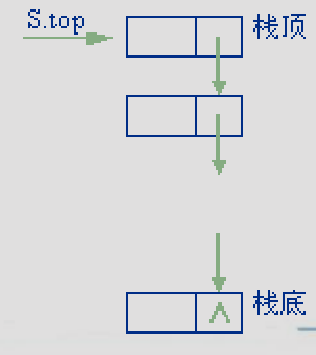

---
tags:
  - 408考研复习
  - 数据结构
---

栈
===

## 定义
{ align=right }

* 栈(Stack)是限定只能在表的一端进行插入和删除操作的线性表。在表中，允许插入和删除的一端称作“栈顶(top)”，不允许插入和删除的另一端称作“栈底(bottom)”，当表中没有元素时称为空栈
* 通常称往栈顶插入元素的操作为 “入栈”，称删除栈顶元素的操作为 “出栈”。
* 因为后入栈的元素先于先入栈的元素出栈，故被称为是一种“后进先出”的结构，因此又称LIFO（Last In First Out）表。

## ADT类型定义
* 数据对象 $D=\{a_i|a_i \in ElemSet, i=1,2,...,n, n \ge 0 \}$
* 数据关系 $R1=\{\left \langle a_{i-1},a_i\right \rangle|a_{i-1},a_i \in D, i=2,...,n \}$
    * 约定 $a_n$ 端为栈顶，$a_1$ 端为栈底
* 基本操作

    === "结构建立与销毁"
        * `InitStack(&S)`
            - 操作结果：构造一个空栈 `S`。
        * `DestroyStack(&S)`
            - 初始条件：栈 `S` 已存在。
            - 操作结果：栈 `S` 被销毁。

    === "添加及删除数据"
        * `Push(&S, e)`
            - 初始条件：栈 `S` 已存在。
            - 操作结果：插入元素 `e` 为新的栈顶元素
        * `Pop(&S, &e)`
            - 初始条件：栈 `S` 已存在且非空。
            - 操作结果：删除 `S` 的栈顶元素，并用 `e` 返回其值。

    === "查找"
        * `GetTop(S, &e)`
            - 初始条件：栈 `S` 已存在且非空。
            - 操作结果：用 `e` 返回`S`的栈顶元素

    === "遍历"
        * `StackTraverse(S,visit())`
            * 初始条件：栈 `S` 已存在且非空，`visit()` 为元素的访问函数。
            * 操作结果：从栈底到栈顶依次对 `S` 的每个元素调用函数 `visit()`。一旦 `visit()` 失败，则操作失败。

    === "其他"
        * `ClearStack(&S)`
            * 初始条件：栈 `S` 已存在。
            * 操作结果：将 `S` 清为空栈。
        * `StackEmpty(S)`
            * 初始条件：栈`S`已存在。
            * 操作结果：若 `S` 为空栈，则返回 `TRUE`，否则返回 `FALSE`。
        * `StackLength(S)`
            * 初始条件：栈 `S` 已存在。
            * 操作结果：返回 `S` 中元素个数，即栈的长度。

## 存储结构
### 顺序栈
* 和顺序表类似，对顺序栈也需要事先为它分配一个可以容纳最多元素的存储空间，`base`为这个存储空间的基地址，也即一维数组的地址

    === "静态数组表示（不建议）"
        ```c
        #define MAXSIZE 100;
        typedef struct{
            ElemType data[MAXSIZE];
            int top;  // 栈顶“指针”
        }SqStack;
        ```

    === "指针表示"
        ```c
        typedef struct {
            SElemType *base; // 存储空间基址
            SElemType *top; // 栈顶指针
            int stacksize; // 允许的最大存储空间 以元素为单位
        } SqStack;
        ```

    !!! tip ""
        之后对于基本操作实现的描述以指针表示法为准。

* 基本操作的实现

    === "初始化操作"

        === "C"
            ```c
            Status InitStack(SqStack &S)
            {
                S.base = (SElemType *)malloc(STACK_INIT_SIZE * sizeof(SElemType));
                if (!S.base) exit(OVERFLOW); // 存储分配失败
                S.top = S.base;
                S.stacksize = STACK_INIT_SIZE;
                return 1;
            }
            ```

        === "C++"
            ```c++
            void InitStack (SqStack &S，int maxsize)
            {
            // 构造一个最大存储容量为 maxsize 的空栈 S
                if (maxsize == 0) maxsize = MAXLISTSIZE;
                S.base = new SElemType[maxsize];
                if (!S.base) exit(1); // 存储分配失败
                S.stacksize = maxsize;
                S.top = 0; // 空栈中元素个数为0
            }
            ```

    === "返回栈顶元素"
        若栈不空，则用 e 返回S的栈顶元素，并返回TRUE，否则返回FALSE

        === "C"
            ```c
            Status GetTop (SqStack S, ElemType &e)
            {
                if (S.top == S.base) return 0; // 栈空
                e = *(S.top - 1);
                return 1;
            }
            ```

        === "C++"
            ```c++
            bool GetTop (SqStack S, ElemType &e)
            {
                if (S.top == 0) return false;
                e = *(S.base + S.top - 1); // 返回非空栈中栈顶元素
                return true;
            }
            ```

    === "进栈"
        若栈的存储空间不满 ，则插入元素 e 为新的栈顶元素，并返回 TRUE ，否则返回 FALSE

        === "C"
            ```c
            Status Push (SqStack &S, ElemType e)
            {
                if(S.top-S.base>=S.stacksize) return 0; // 栈满
                *S.top = e;
                S.top++;
                return 1;
            }
            ```

        === "C++"
            ```c++
            bool Push (SqStack &S, ElemType e)
            {
                if (S.top == S.stacksize) // 栈已满，无法进行插入
                return false;
                *(S.base + S.top) = e; // 插入新的元素
                ++S.top; // 栈顶指针后移
                return true;
            }
            ```

    === "出栈"
        若栈不空，则删除S的栈顶元素，用 e 返回其值，并返回 TRUE，否则返回 FALSE

        === "C"
            ```c
            Status Pop (SqStack &S, ElemType &e)
            {
                if(S.top==S.base) return 0; // 栈空
                S.top--;
                e = *S.top;
                return 1;
            }
            ```

        === "C++"
            ```c++
            bool Pop(SqStack &S, ElemType &e)
            {
                if (S.top == 0) return false;
                e = *(S.base + S.top-1); // 返回非空栈中栈顶元素
                --S.top; // 栈顶指针前移
                return true;
            }
            ```

* 共享栈

    ```text
                ------------------
                |       0        | <----- top1
                ------------------
                |                |
                |      ...       |
                ------------------
                |      ...       |
                |                |
                ------------------
      top2----> |   MaxSize-1    |
                ------------------
    ```

    - 栈满的标志：`top1+1==top2`
    - 栈空的标志
        - `top1==0`上栈空
        - `top2==MAXSIZE-1`下栈空
    - 定义：

        ```c
        typedef struct
        {
            ElemType data[StackSize];
            int top1,top2; //当前两栈栈顶
        }ShStack;
        ```

### 链栈
{ align=right width=200px }

* 链栈即为栈的链式存储结构
* 结点结构和[单链表](linear-list.md)中的结点结构相同
* 链栈中不需要头结点，但要注意链栈中指针的方向是从栈顶指向栈底的，这正好和单链表是相反的
* 结构定义
    ```c
    typedef struct node {
    	SElemType data;//数据域
    	struct node *next;//指针域
    }LinkStackNode,*LinkStack;
    ```

* 入栈
    ```c++
    bool Push(LinkStack top,SElemType x)
    {
        LinkStackNode p = new LinkStackNode;
        if (!p)  return false;    /* 申请空间失败 */
        p->data = x;
        p->next = top->next;
        top->next = p;    /* 修改当前栈顶指针 */
        return true;
    }
    ```
* 出栈
    ```c++
    bool Pop(LinkStack top,SElemType &x)
    {
        LinkStackNode * p;
        p = top->next;
        if (p == NULL)   /*栈为空*/
            return false;
        top->next = p->next;
        x = p->data;
        delete p;
        return true;
    }
    ```

## 应用
### 括号匹配
* 在编写代码的时候，表达式中的括号有三种，`()` `[]` `{}`，不管使用哪种括号，程序编译没有问题的其中一个重要因素就是所使用的括号是否能够匹配上。在编写程序时，括号可以嵌套，即：`({()})` 这种形式，但 `({)` 或者 `({}` 都不符合要求。
* 思路：很容易想到利用栈的思想来完成任务，后出现的“左括弧”，它等待与其匹配的“右括弧”出现的“急迫”心情要比先出现的左括弧高。换句话说，对“左括弧”来说，后出现的比先出现的“优先”等待检验，对“右括弧”来说，每个出现的右括弧要去找在它之前“最后”出现的那个左括弧去匹配
    * 遇到左括号就入栈
    * 遇到右括号就消耗一个配对的左括号
* 代码

    === "C"
        ```c
        /*
        #define MaxSize 50
        typedef struct Stack_arr
        {
        	char data[MaxSize];
        	int top;
        }Stack,*pStack;
        */
        int Check(char *str)
        {
        	int i=0;
        	Stack s1;
        	InitStack(&s1);
        	while(str[i]!='\0')
        	{
        		if(str[i]=='('||str[i]=='['||str[i]=='{')
        			Push(&s1,str[i]);
        		else if(str[i]==')'&&s1.data[s1.top]=='('||str[i]==']'&&s1.data[s1.top]=='['||str[i]=='}'&&s1.data[s1.top]=='{')
        			Pop(&s1);
        		else return 0;
        	    i++;
        	}
        	if(s1.top==-1) return 1;
        	else return 0;
        ```

    === "C++"
        ```c++
        #include <stack>
        #include <iostream>

        using namespace std;

        string bracketLeft = "{[(";
        string bracketRight = "}])";

        bool BracketCheck(string str)
        {
            stack<char> s;
            // 遍历字符串
            for (int i = 0; i < str.length(); i++)
            {
                char chr = str[i];
                int indexLeft = -1, indexRight = -1;
                indexLeft = bracketLeft.find(chr);
                indexRight = bracketRight.find(chr);
                // 是左括号
                if (indexLeft >= 0)
                    s.push(chr);    // 入栈
                // 是右括号
                else if (indexRight >= 0)
                {
                    // 匹配成功
                    if (!s.empty() && s.top() == bracketLeft[indexRight])
                        s.pop();    // 出栈
                    else
                        return false;
                }
            }

            return s.empty();
        }
        ```

    === "Python"
        ```python
        #-*- coding: utf-8 -*-

        BRACKETS = {'}':'{',']':'[',')':'('}
        BRACKETS_LEFT, BRACKETS_RIGHT = BRACKETS.values(), BRACKETS.keys()

        def bracket_check(string:str):
            stack = []
            for char in string:
                # 如果是左括号
                if char in BRACKETS_LEFT:
                    # 入栈
                    stack.append(char)
                # 右括号
                elif char in BRACKETS_RIGHT:
                    # stack不为空，并且括号匹配成功
                    if stack and stack[-1] == BRACKETS[char]:
                        # 出栈
                        stack.pop()
                    # 匹配成功
                    else:
                        return False

            return not stack
        ```

### 表达式求值
* 任何一个表达式都由操作数、运算符和界定符组成。
    - 操作数即可以是常量，也可以是被说明为变量或常量的标识符。
    - 运算符可以分为算术运算，关系运算和逻辑运算符。
        * 表达式求值问题以算术运算为例
    - 界定符有左右括号和结束符等。
* 算术运算符的规则是：先乘除后加减，先左后右，先括号内后括号外
* 标识符位置表示法
    - 假设 $Exp = S_1 + OP + S_2$
        * 称 $OP + S_1 + S_2$ 为表达式的前缀表示法/波兰表达式（简称前缀式）
        * 称 $S_1 + OP + S_2$ 为表达式的中缀表示法（简称中缀式）
        * 称 $S_1 + S_2 + OP$ 为表达式的后缀表示法/逆波兰表达式（简称后缀式）

    $$
        \begin{array}{c|lcr}
        原表达式 & \text{前缀表达式}  & \text{中缀表达式} & \text{后缀表达式} \\
        \hline
        a+b & +ab & a+b & ab+  \\
        a+b-c*d & -+ab*cd & a+b-c*d & ab+cd*-  \\
        a+b*(c-d)-e/f & +a-*b-cd/ef & a+b*c-d-e/f & abcd-*+ef/-
        \end{array}
    $$

    - 由原表达式求后缀式
        1. 设立运算符栈；
        2. 设表达式的结束符为`#`，预设运算符栈的栈底为`#`；
        3. 若当前字符是操作数，则直接发送给后缀式；
        4. 若当前字符为运算符且优先数大于栈顶运算符，则进栈，否则退出栈顶运算符发送给后缀式；
        5. 若当前字符是结束符，则自栈顶至栈底依次将栈中所有运算符发送给后缀式；
        6. `(`对它前后的运算符起隔离作用，若当前运算符为`(`时进栈；
        7. `)`可视为自相应左括弧开始的表达式的结束符，则从栈顶起，依次退出栈顶运算符发送给后缀式，直至栈顶字符为`(`止。

    - 后缀式的计算[^1]
        * 从左向右扫描式子，如果：
            - 遇到操作数，则压栈
            - 遇到运算符，则依次弹出两个栈顶（先弹出的为右操作数），执行运算，并压回栈顶
        * 遵循左优先原则：只要靠左边的表达式能计算，就先算左边的

    - 前缀式的计算
        * 从右向左扫描式子，如果：
            - 遇到操作数，即压栈
            - 遇到运算符，则依次弹出两个栈顶（先弹出的为左操作数），执行运算，并压回栈顶
        * 遵循右优先原则：只要靠右边的表达式能计算，就先算右边的

* 思路：首先置操作数栈为空栈，表达式起始符`#`为栈底元素。依次读入表达式中的每个字符，若是操作数则进OPND栈，若是运算符则和OPTR栈的栈顶运算符比较优先权作相应操作，直至整个表达式求值完毕（OPTR栈顶元素和当前读入的字符均为`#`）
* 代码[^2]：
    ```c
    typedef int SElemType;      /*放入堆栈的元素的类型*/
    #include <ctype.h>
    #include "stack_s.c"
    /*判断输入的某个字符是否是运算符
     *c表示输入的字符
     *op数组中存放系统能识别的运算符
     */
    Status in(char c,char op[]){
        char *p;
        p=op;
        while(*p != '\0'){
            if(c == *p)
                return TRUE;
            p++;
        }
        return FALSE;
    }
    /*比较两个运算符的优先级
     *a，b中存放待比较的运算符
     *'>'表示a>b
     *'0'表示不可能出现的比较
     */
    char Precede(char a, char b){
        int i,j;
        char pre[][7]={
    	/*运算符之间的优先级制作成一张表格*/
            {'>','>','<','<','<','>','>'},
            {'>','>','<','<','<','>','>'},
            {'>','>','>','>','<','>','>'},
            {'>','>','>','>','<','>','>'},
            {'<','<','<','<','<','=','0'},
            {'>','>','>','>','0','>','>'},
            {'<','<','<','<','<','0','='}};
        switch(a){
            case '+': i=0; break;
            case '-': i=1; break;
            case '*': i=2; break;
            case '/': i=3; break;
            case '(': i=4; break;
            case ')': i=5; break;
            case '#': i=6; break;
        }
        switch(b){
            case '+': j=0; break;
            case '-': j=1; break;
            case '*': j=2; break;
            case '/': j=3; break;
            case '(': j=4; break;
            case ')': j=5; break;
            case '#': j=6; break;
        }
        return pre[i][j];
    }
    /*进行实际的运算
     *a，b中分别以整数的形式存放两个待运算的操作数
     *theta中存放代表操作符的字符
     *结果以整数的形式返回
     */
    int Operate(int a, char theta, int b){
        int i,j,result;
        i=a;
        j=b;

        switch(theta)   {
            case '+': result = i + j; break;
            case '-': result = i - j; break;
            case '*': result = i * j; break;
            case '/': result = i / j; break;
        }
        return result;
    }
    /*从输入缓冲区中获得下一个整数或运算符，并通过n带回到主调函数
     *返回值为1表示获得的是运算符
     *返回值为0表示获得的是整形操作数
     */
    int getNext(int *n){
        char c;
        *n=0;
        while((c=getchar())==' ');  /*跳过一个或多个空格*/
        if(!isdigit(c)){            /*通过函数判断如果字符不是数字，那么只能是运算符*/
            *n=c;
            return 1;
        }
        do{                /*能执行到该条语句，说明字符是数字，此处用循环获得连续的数字*/
            *n=*n*10+(c-'0');       /*把连续的数字字符转换成相对应的整数*/
            c=getchar();
        }while(isdigit(c));         /*如果下一个字符是数字，进入下一轮循环*/
        ungetc(c,stdin);            /*新读入的字符不是数字，可能是运算符,为了不影响下次读入，把该字符放回到输入缓冲区*/
        return 0;
    }

    int EvaluateExpression(){

        int n;
        int flag;
        int c;
        char x,theta;
        int a,b;

        char OP[]="+-*/()#";
        SqStack  OPTR;
        SqStack  OPND;

        InitStack(&OPTR);
        Push(&OPTR,'#');
        InitStack(&OPND);
        flag=getNext(&c);

        GetTop(OPTR, &x);
        while(c!='#' || x != '#')
        {
            if(flag == 0){
                Push(&OPND,c);
                flag = getNext(&c);
            }else{
                GetTop(OPTR, &x);
                switch(Precede(x, c)){
                    case '<'://栈顶元素优先级低
                        Push(&OPTR,c);
                        flag = getNext(&c);
                        break;
                    case '='://脱括号并接受下一字符
                        Pop(&OPTR,&x);
                        flag = getNext(&c);
                        break;
                    case '>'：// 退栈并将运算结果入栈
                        Pop(&OPTR, &theta);
                        Pop(&OPND,&b);
                        Pop(&OPND,&a);
                        Push(&OPND, Operate(a, theta, b));
                        break;
                }
            }
            GetTop(OPTR, &x);
        }
        GetTop(OPND, &c);
        return c;
    }
    ```

[^1]:通常机算求值采用这种方法
[^2]:https://blog.csdn.net/yuluows/article/details/7657944
