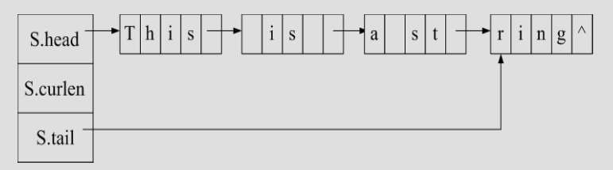

串与字符串
===

## 定义
* 串即字符串，是计算机非数值处理的主要对象之一。是由0~多个字符组成的有限序列。即

$$
S = "a_1a_2a_3 \cdots a_n"(n \ge 0) \\
当 n = 0 时，S = \emptyset（空串）
$$

* 其中S是串名，双引号括起来的字符序列是串值； $a_i(1≦i≦n)$  可以是字母、数字或其它字符；串中所包含的字符个数称为该串的长度。
    * 长度为零的串称为空串(Empty String)，它不包含任何字符
    * 将仅由一个或多个空格组成的串称为空格串(Blank String)

        !!! warning ""
            空格串 $\neq$ 空串

* 串中任意个连续字符组成的子序列称为该串的子串，包含子串的串相应地称为主串。通常将子串在主串中首次出现时的该子串的首字符对应的主串中的序号，定义为子串在主串中的序号（或位置）

    !!! warning ""
        特别地，空串是任意串的子串，任意串是其自身的子串

    !!! tip ""
        位置从1开始计数

## ADT类型定义
* 数据对象 $D=\{a_i|a_i \in CharacterSet, i=1,2,...,n, n \ge 0 \}$
* 数据关系 $R1=\{<a_{i-1},a_i>|a_{i-1},a_i \in D, i=2,...,n \}$
* 基本操作

    === "结构建立与销毁"
        * `StrAssign(&T,chars)`
            - 初始条件：chars 是串常量
            - 操作结果：赋于串T的值为 `chars`。
        * `DestroyString(&S)`
            - 初始条件：串 `S` 已存在。
            - 操作结果：串 `S` 被销毁。

    === "添加及删除数据"
        * `StrCopy (&T, S)`
            - 初始条件：串 `S` 存在。
            - 操作结果：由串 `S` 复制得串 `T`。

        * `Concat (&T, S1, S2)`
            - 初始条件：串 `S1` 和 `S2` 存在。
            - 操作结果：用 `T` 返回由 `S1` 和 `S2` 联接而成的新串（S2的第一个字符紧接S1的最后一个字符之后）。

        * `Replace (&S, T, V)`
            - 初始条件：串 `S`，`T` 和 `V` 存在，`T` 是非空串。
            - 操作结果：用`V`替换主串`S`中出现的所有与`T`相等的不重叠的子串。

                ```text
                S="abcacabcaca",T="abca",V="ab",则替换结果为S = "abcabca"
                ```

            - 实现

                ```c++
                void replace(String& S, String T, String V)
                {
                    n=StrLength(S);
                    m=StrLength(T); pos = 1;
                    StrAssign(news, NullStr); // 初始化 news 串为空串
                    i=1;
                    while ( pos <= n-m+1 && i )
                    {
                        i=Index(S, T, pos); // 从pos指示位置起查找串T
                        if (i!=0) {
                            SubString(sub, S, pos, i-pos); // 不置换子串
                            Concat(news, news, sub); // 联接S串中不被置换部分
                            Concat(news,news, V); // 联接V串
                            pos = i+m; // pos 移至继续查询的起始位置
                        } // if
                    } // while
                    SubString(sub, S, pos, n-pos+1); // 剩余串
                    Concat( S, news, sub ); // 联接剩余子串并将新的串赋给S
                }
                ```

        * `StrInsert (&S, pos, T)`
            - 初始条件：串 `S` 和 `T` 存在，`1≤pos≤StrLength(S)＋1`。
            - 操作结果：在串 S 的第 `pos` 个字符之前插入串 `T`。
        * `StrDelete (&S, pos, len)`
            - 初始条件：串 `S` 存在，`1≤pos≤StrLength(S)-len+1`。
            - 操作结果：从串 `S` 中删除第 `pos` 个字符起长度为 `len` 的子串。

    === "查找"
        * `Index (S, T, pos)`

            - 初始条件：串`S`和`T`存在，`T` 是非空串，`1≤pos≤StrLength(S)`。

            - 操作结果：若主串`S`中存在和串`T`值相同的子串，则返回它在主串S中第`pos`个字符之后第一次出现的位置；否则函数值为`0`

                ```text
                Index("This is a pen","is",pos)
                若pos = 1，则返回值为3
                若pos = 4，则返回值为6
                若pos = 6，则返回值为0
                ```

            - 实现

                ```c++
                int Index (String S, String T, int pos)
                {
                    // T为非空串 。若主串S中第 pos 个字符之后存在与T相等的子串，则返回第一个这样的子串在S中的位置，否则返回0 。
                    if (pos > 0) {
                        n = StrLength(S);
                        m = StrLength(T);
                        // 求得串长
                        i = pos;
                        while (i <= n-m+1) {
                            SubString (sub, S, i, m); // 取得从第 i 个字符起长度为 m 的子串
                            if (StrCompare(sub,T) != 0) ++i ;
                            else return i ; // 找到和 T 相等的子串
                        } // while
                    } // if
                    return 0; // S 中不存在满足条件的子串
                } // Index
                ```

    === "其他"
        * `SubString (&Sub, S, pos, len)`
            * 初始条件：串`S`存在，`1≤pos≤StrLength(S)`且`0≤len≤StrLength(S)-pos+1`。
            * 操作结果：用 `Sub` 返回串S的第 `pos` 个字符起长度为 `len` 的子串。
        * `StrCompare (S, T)`
            * 初始条件：串 `S` 和 `T` 存在。
            * 操作结果：若`S>T`，则返回值>0；若`S=T`，则返回值=0；若`S<T`，则返回值<0。
            * “串值大小”是按“词典次序”进行比较的，例如：

                ```text
                StrCompare("data","stru")<0，因为d(0x64) < s(0x73)
                StrCompare("cat"," case")>0，因为t(0x74) > s(0x73)
                ```

        * `ClearString(&S)`
            * 初始条件：串 `S` 已存在。
            * 操作结果：将 `S` 清为空串。
        * `StrEmpty(S)`
            * 初始条件：串`S`已存在。
            * 操作结果：若 `S` 为空串，则返回 `TRUE`，否则返回 `FALSE`。
        * `StrLength(S)`
            * 初始条件：串 `S` 已存在。
            * 操作结果：返回串 `S` 序列中的字符个数，即串的长度。

## 存储结构
### 顺序结构

=== "定长数组"
    ```c
    #define LENGTH 256
    typedef struct{
        char ch[LENGTH];
        int length;
    }SString;
    ```

=== "堆分配数组"
    ```c
    typedef struct{
        char *ch;
        int length;
    }HString;
    ```

### 链式存储

=== "块链式存储"
    
    ```c
    const CHUNKSIZE = 80; // 可由用户定义的块（结点）大小
    typedef struct Chunk { // 结点结构
        char ch[CUNKSIZE];
        struct Chunk *next;
    } Chunk;
    typedef struct { // 串的链表结构
        Chunk *head, *tail; // 串的头指针和尾指针
        int curlen; // 串的当前长度
    } LString;
    ```

    * 定义此时串的存储密度为

    $$
    存储密度 = \frac {串值所占的存储位}{实际分配的存储位}
    $$

## 串的模式匹配算法（重点）

!!! summary ""
    在正文串中，查询有没有和一个“给定的串”相同的子串，并返回其所在位置，是模式匹配算法的基本要求，例如

    ```text
    S ="concatenation"，T ="cat"
    则称主串S中存在和模式串T相同的子串，起始位置为4，即Index(S,T,1)=4
    ```

=== "朴素算法"
    ```c++
    int Index (SString S,SString T,int pos)
    {
        // 若串 S 中从第pos(1≤pos≤StrLength(S)) 个字符起存在和串 T 相同的子串，则称匹配成功，返回第一个这样的子串在串 S 中的位置，否则返回 0
        i = pos; j = 1;
        while ( i<=s[0]&&j<=T[0]) {
            if ( S[i] == T[j] ) { ++i;++j} // 继续比较后一字符
            else { i=i-j+2; j = 1; } // 重新开始新的一轮匹配
        }
        if(j>T[0]) return i-T[0];//匹配成功
        else return 0; // 串S中(第pos个字符起)不存在和串T相同的子串
    } // Index
    ```

    * 此算法的时间复杂度为 $O(m×n)$ ，其中 `m` 和 `n` 分别为`S`串和`T`串的长度

=== "KMP算法"

    !!! quote ""
        模式匹配的改进算法是由三位计算机学者 D.E.Knuth 与 V.R.Pratt 和J.H.Morris 同时发现的，因此人们通常简称它为 KMP 算法

    ```c++
    int Index_KMP(SString S,SString T)
    {
        int i=1,j=1;
        while(i<=S.length&&j<=T.length){
            if(j==0||S.ch[i]==T.ch[j]){
                ++i;++j;
            }
            else j = next[j];
        }
        if(j>T.length) return i-T.length;
        else return 0;
    }
    ```

    * 此算法的时间复杂度为 $O(m+n)$ ，直观地看，是因为在匹配过程中指针 i 没有回溯。
    * 求`next`数组

        * `next[j]`数组值的含义是S的最长相等前后缀长度+1

            * 其中，第j个字符匹配失效，把由前1~j-1个字符组成的串记为S

            $$
            next[j] = \begin{cases}
            0  &j=1 \\
            max\{k|1<k<j 且"p_1 \cdots p_{k-1}"= "p_{j-k+1} \cdots p_{i-1}" \} &此集合非空时 \\
            1 & others
            \end{cases}
            $$

        * 算法

            ```c++
            void get_next(SString T,int next[])
            {
                int i=1,j=0;
                next[1]=0;
                while(i<T.length){
                    if(j==0||T.ch[i]==T.ch[j]){
                        ++i;++j;
                        next[i]=j;
                    }
                    else j = next[j];
                }
            }
            ```

    * 进一步优化：`nextval`数组
        * nextval数组的计算方法有两种：一种是不依赖于next数组直接观察得到的，另一种是根据next数组进行推导得到的
        * 算法

            === "不依赖next数组"

                ```c++
                void get_nextval(SString T,int nextval[])
                {
                    int i=1;
                    nextval[1]=0;
                    int j=0;
                    while(i<T.length){
                        if(j==0||T.ch[i]==T.ch[j]){   //判断出next数组的值
                            ++i;++j;               //这是在计算next数组，next[i]=j
                            if(T.ch[i]!=T.ch[j])     //这里的j就是next[i]，判断ch[i]==ch[j]
                                nextval[i]=j;         //如果不等那么nextval[i]的值就是next[i]即j
                            else
                                nextval[i]=nextval[j];  //如果相同那么，nextval[i]的值就是nextval[next[i]](即nextval[j])的值
                        }
                        else
                            j=nextval[j];              //计算next数组
                    }
                }
                ```

            === "依赖next数组"
            
                ```c++
                void get_nextval(SString T,int next[],int nextval[])
                {
                    int i=1,j=0;
                    next[1]=0;
                    while(i<T.length){
                        if(j==0||T.ch[i]==T.ch[j]){
                            ++i;++j;
                            next[i]=j;
                        }
                        else j = next[j];
                    }

                    nextval[1] = 0;
                    for(int j=2;j<=T.length;j++){
                        if(T.ch[next[j]]==T.ch[j]) nextval[j] = nextval[next[j]];
                        else nextval[j] = next[j];
                    }
                }
                ```
