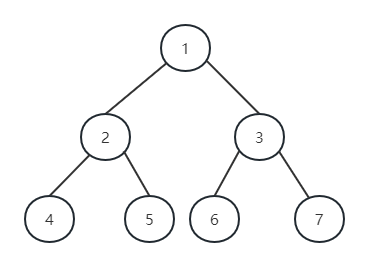

---
tags:
  - 408考研复习
  - 数据结构
---

树与二叉树
===

!!! summary ""
    树形结构是一类重要的非线性结构。树型结构是结点之间有分支，并且具有层次关系的结构。

## 树的基本概念
* 树是具有n个节点的有限集合T，它满足：
    1. 有且只有一个称为“根(root)”的结点
    2. 其余的结点可分为m个互不相交的子集，每个子集又是一棵树，称其为子树(Subtree)
* T为空时，称为空树
* 树是一种层次分明的结构，约定根的层次为1，其余元素层次的定义为：若根的层次为L，子树根的层次为 L+1。
* 树的深度定义为树中叶子结点所在最大层次数。
* 如果子树之间映射客观存在次序关系，则为“有序树”，否则为“无序树”。
* 度

    === "结点的度"
        其分支的个数定义为“结点的度”，如果该值大于0，即为“分支结点”，否则为“叶子结点”。
    
    === "树的度"
        树中所有结点度的最大值定义为“树的度”

* 结点之间的关系
    - “根”即为树中没有前驱的结点。称根结点为子树根的“双亲”
    - 称子树根为根结点的“孩子”。“最左孩子”指的是在存储结构中存放的第一棵子树的根。
    - 根的所有子树根互为“兄弟”。“右兄弟”指存储结构中确定的有相同双亲的下一棵子树的根。
    - 结点的“祖先”指从根结点到该结点所经分支上的所有结点。
    - 以某结点为根的子树中的任一结点都称为该结点的“子孙”。
* 性质
    * 树中的结点数等于所有结点的度数+1
    * 度为m的树中第i层上至多有 $m^{i-1}$ 个结点( $i\ge 1$ )
    * 高度为h的m叉树至多有 $\frac {m^h-1}{m-1}$ 个结点
    * 具有n个结点的m叉树的最小高度为 $\lceil \log_m[n(m-1)+1] \rceil$

### ADT类型定义
* 数据对象 D是具有相同特性的数据元素的集合。
* 数据关系 若D为空集，则称为空树；若D中仅含一个数据元素，则关系R为空集；否则 R={H}：
    1. 在D中存在唯一的称为根的数据元素 root，它在关系H下无前驱；
    2. 当 $n\gt 1$ 时，其余数据元素可分为 $m(m\gt 0)$ 个互不相交的(非空)有限集 $T_1,T_2, \cdots,T_m$ , 其中每一个子集本身又是一棵符合本定义的树，称为根 root 的子树，每一棵子树的根 $x_i$ 都是根 root 的后继，即 $\left \langle root,x_i\right \rangle \in H,i=1,2, \cdots,m$ 。
* 基本操作

    === "结构建立与销毁"
        * `InitTree(&T)`
            - 操作结果：构造空树 `T`。
        * `CreateTree(&T,definition)`
            - 初始条件：`definition` 给出树`T`的定义。
            - 操作结果：按 `definition` 构造树 `T`。
        * `DestroyTree(&T)`
            - 初始条件：树 `T` 存在。
            - 操作结果：销毁树 `T`。

    === "查找"
        * `Root(T)`
            - 初始条件：树 `T` 存在。
            - 操作结果：返回 `T` 的根。
        * `Value(T, cur_e)`
            - 初始条件：树 `T` 存在，`cur_e` 是 `T` 中某个结点。
            - 操作结果：返回 `cur_e` 的值。
        * `Parent(T, cur_e)`
            - 初始条件：树 `T` 存在，`cur_e` 是 `T` 中某个结点。
            - 操作结果：若 `cur_e` 是`T`的非根结点，则返回它的双亲，否则返回“空”。
        * `LeftChild(T, cur_e)`
            - 初始条件：树 `T` 存在，`cur_e` 是 `T` 中某个结点。
            - 操作结果：若 `cur_e `是`T`的非叶子结点，则返回它的最左孩子，否则返回“空”。
        * `RightSibling(T, cur_e)`
            - 初始条件：树 `T` 存在，`cur_e` 是 `T` 中某个结点。
            - 操作结果：若 `cur_e` 有右兄弟，则返回它的右兄弟，否则返回“空”。

    === "添加及删除数据"
        * `Assign(T, cur_e, value)`
            - 初始条件：树`T`存在，`cur_e` 是 `T` 中某个结点。
            - 操作结果：结点 `cur_e` 赋值为 `value`。
        * `InsertChild(&T, &p, i, c)`
            - 初始条件：树 `T` 存在，`p` 指向`T`中某个结点，`1≤i≤p 所指结点的度＋1`，非空树 `c` 与 `T` 不相交。
            - 操作结果：插入 `c` 为 `T` 中 `p` 所指结点的第 `i` 棵子树。
        * `DeleteChild(&T, &p, i)`
            - 初始条件：树 `T` 存在，`p` 指向 `T` 中某个结点，`1≤i≤p 指结点的度`。
            - 操作结果：删除 `T` 中 `p` 所指结点的第 `i` 棵子树。

    === "遍历"
        * `TraverseTree(T, visit())`
            - 初始条件：树`T`存在，`visit` 是对结点操作的应用函数。
            - 操作结果：按某种次序对 `T` 的每个结点调用函数`visit()` 一次且至多一次。一旦 `visit()` 失败，则操作失败。

    === "其他"
        * `ClearTree(&T)`
            - 初始条件：树 `T` 存在。
            - 操作结果：将树 `T` 清为空树。
        * `TreeEmpty(T)`
            - 初始条件：树 `T` 存在。
            - 操作结果：若 `T` 为空树，则返回 `true`，否则返回 `false`。
        * `TreeDepth(T)`
            - 初始条件：树`T`存在。
            - 操作结果：返回`T`的深度。//树的深度定义为树中叶子结点所在最大层次数

## 二叉树

!!! summary ""
    二叉树是由n(n>=0)个结点的有限集合构成，此集合或者为空集，或者由一个根结点及两棵互不相交的左、右子树组成，并且左右子树都是二叉树。

* 二叉树的特点
    * 每个结点至多只有两棵子树
    * 子树有左右之分，不可颠倒

### ADT类型定义
* 数据对象 D 是具有相同特性的数据元素的集合
* 数据关系 若 D 为空集，称 BinaryTree 为空二叉树；若D为非空集合，则关系 R={H}：
    1. 在 D 中存在唯一的称为根的数据元素 root，它在关系 H 下无前驱；
    2. D 中其余元素集必可分为两个互不相交的子集 L 和 R，每一个子集都是一棵符合本定义的二叉树，并分别为 root 的左子树和右子树。如果左子树 L 不空，则必存在一个根结点 $x_L$ ，它是 root 的“左后继”( $\left \langle root, x_L \right \rangle \in H$ )，如果右子树 R 不空，则必存在一个根结点 $x_R$ 为 root 的“右后继”( $\left \langle root, x_R\right \rangle \in H$ )。
* 基本操作

    === "结构建立与销毁"
        * `InitBiTree(&T)`
            - 操作结果：构造空二叉树 `T`。
        * `CreateBiTree(&T, definition)`
            - 初始条件：`definition` 给出二叉树 `T` 的定义。
            - 操作结果：按 `definition` 构造二叉树 `T`。
        * `DestroyBiTree(&T)`
            - 初始条件：二叉树 `T` 存在。
            - 操作结果：销毁二叉树 `T`。

    === "添加及删除数据"
        * `Assign(&T, &e, value)`
            - 初始条件：二叉树 `T` 存在，`e` 是 `T` 中某个结点。
            - 操作结果：结点 `e` 赋值为 `value`。
        * `InsertChild(&T, p, LR, c)`
            - 初始条件：二叉树 `T` 存在，`p` 指向 `T` 中某个结点，`LR` 为 0 或 1，非空二叉树 `c` 与 `T` 不相交且右子树为空。
            - 操作结果：根据 `LR` 为 0 或 1，插入 `c` 为 `T` 中 `p` 所指结点的左或右子树。p所指结点原有左或右子树成为 `c` 的右子树。
        * `DeleteChild(&T, p, LR)`
            - 初始条件：二叉树 `T` 存在，`p` 指向 `T` 中某个结点，`LR` 为 0 或 1。
            - 操作结果：根据 `LR` 为 0 或 1，删除 `T` 中 `p` 所指结点的左或右子树。

    === "查找"
        * `Root(T)`
            - 初始条件：二叉树 `T` 存在。
            - 操作结果：返回 `T` 的根。
        * `Value(T, e)`
            - 初始条件：二叉树 `T` 存在，`e` 是 `T` 中某个结点。
            - 操作结果：返回 `e` 的值。
        * `Parent(T, e)`
            - 初始条件：二叉树 `T` 存在，`e` 是 `T` 中某个结点。
            - 操作结果：若`e`是`T`的非根结点，则返回它的双亲，否则返回“空”。
        * `LeftChild(T, e)`
            - 初始条件：二叉树 `T` 存在，`e` 是 `T` 中某个结点。
            - 操作结果：返回 `e`的左孩子。若 `e` 无左孩子，则返回“空”。
        * `RightChild(T, e)`
            - 初始条件：二叉树 `T` 存在，`e` 是 `T` 中某个结点。
            - 操作结果：返回 `e` 的右孩子。若 `e` 无右孩子，则返回“空”。
        * `LeftSibling(T, e)`
            - 初始条件：二叉树 `T` 存在，`e` 是 `T` 中某个结点。
            - 操作结果：返回 `e` 的左兄弟。若 `e` 是其双亲的左孩子或无左兄弟，则返回“空”。
        * `RightSibling(T, e)`
            - 初始条件：二叉树 `T` 存在，`e` 是 `T` 的结点。
            - 操作结果：返回 `e` 的右兄弟。若 `e` 是其双亲的右孩子或无右兄弟，则返回“空”。

    === "遍历"
        * `PreOrderTraverse(T, visit())`
            - 初始条件：二叉树 `T` 存在，`visit` 是对结点操作的应用函数。
            - 操作结果：先序遍历 `T`，对每个结点调用函数 `visit` 一次且仅一次。一旦 `visit()`失败，则操作失败。
        * `InOrderTraverse(T, visit())`
            - 初始条件：二叉树 `T` 存在，`visit` 是对结点操作的应用函数。
            - 操作结果：中序遍历 `T`，对每个结点调用函数 `visit` 一次且仅一次。一旦 `visit()` 失败，则操作失败。
        * `PostOrderTraverse(T, visit())`
            - 初始条件：二叉树`T`存在，`visit` 是对结点操作的应用函数。
            - 操作结果：后序遍历 `T`，对每个结点调用函数 `visit` 一次且仅一次。一旦 `visit()` 失败，则操作失败。
        * `LevelOrderTraverse(T, visit())`
            - 初始条件：二叉树 `T` 存在，`visit` 是对结点操作的应用函数。
            - 操作结果：层序遍历 `T`，对每个结点调用函数 `visit` 一次且仅一次。一旦 `visit()` 失败，则操作失败。

    === "其他"
        * `BiTreeEmpty(T)`
            - 初始条件：二叉树 `T` 存在。
            - 操作结果：若`T`为空二叉树，则返回 `true`，否则返回 `false`。
        * `BiTreeDepth(T)`
            - 初始条件：二叉树 `T` 存在。
            - 操作结果：返回 `T` 的深度。
        * `ClearBiTree(&T)`
            - 初始条件：二叉树 `T` 存在。
            - 操作结果：将二叉树 `T` 清为空树。

### 性质
* 在二叉树的第 $i$ 层上至多有 $2^{i-1}$ 个结点( $i \ge 1$ )
* 深度为 $k$ 的二叉树至多有 $2^k-1$ 个结点( $k \ge 1$ )
* 对任何一棵二叉树 ，如果其终端(叶子)结点数为 $n_0$ ，度为2 的结点数为 $n_2$ ，则 $n_0 = n_2 + 1$ 。

    ??? tip "证明"
        设二叉树中度为1的结点数为 $n_1$ ，二叉树中总结点数为$N$，因为二叉树中所有结点均小于或等于2，所以有：

        $$
        \begin{equation}
        N=n_0 + n_1 + n_2 \tag{1}
        \end{equation}
        $$

        再看二叉树中的分支数，除根结点外，其余结点都有一个进入分支，设B为二叉树中的分支总数，则有：$N=B+1$ 。由于这些分支都是由度为1和2的结点射出的，所以有：

        $$
        \begin{align}
        B&=n_1 +2×n_2 \notag \\
        N&=B+1=n_1+2×n_2+1 \tag{2}
        \end{align}
        $$

        由式（1）和（2）得到：

        $$
        \begin{align}
        n_0 +n_1 +n_2 &=n_1 +2 \times n_2 +1 \\
        n_0 &=n_2 +1
        \end{align}
        $$


### 满二叉树
深度为 $k$ ，且含有 $2^k-1$个结点的二叉树。

<figure markdown>

<figcaption>一棵有7个结点的满二叉树</figcaption>
</figure>

### 完全二叉树
如果深度为k、有n个结点的二叉树中，当且仅当其每一个结点能够与深度为k的顺序编号的满二叉树从1 到n标号的结点相对应，则称这样的二叉树为完全二叉树。

<figure markdown>

<figcaption>一棵有6个结点的完全二叉树</figcaption>
</figure>

* 性质
    * 所有的叶结点只可能在层次最大的两层上出现
    * 对任一结点，如果其右子树的最大层次为L，则其左子树的最大层次为L 或 L ＋1
    * 具有n 个结点的完全二叉树的深度为 $\lfloor log_2n \rfloor +1$

        ??? tip "证明"
            假设此二叉树的深度为k，则根据性质2及完全二叉树的定义得到：
            $2^{k-1} -1<n≤2^k -1 或 2^{k-1} ≤n<2^k$

            取对数得到：$k-1≤log_2n<k$ ， 即 $\log_2 n<k≤\log_2n + 1$

            因为k是整数。所以有：$k=\lfloor log_2n \rfloor +1$

     * 如果对一棵有n个结点的完全二叉树的结点按层序编号，则对任一结点 $(1 \le i \le n)$ 有
        1. 如果i=1，则结点i无双亲，是二叉树的根；如果i>1，则其双亲PARENT(i)是结点 $\left[ i/2 \right]$ 。
        2. 如果2i>n，则结点i为叶子结点，无左孩子；否则，其左孩子LCHILD(i)是结点2i。
        3. 如果2i＋1>n，则结点i无右孩子；否则，其右孩子RCHILD(i)是结点2i＋1。

### 存储结构
#### 顺序存储
按照自上而下、自左至右的顺序，遍历完全二叉树上的结点元素，
并顺次存储在一维数组中。一般用于存储完全二叉树

```c
#define MAX_TREE_SIZE 100
typedef TElemType SqBiTree[MAX_TREE_SIZE];
SqBiTree bt;
```

```text
例：
            a
            |
       ----------
       |        |
       b        c
  -----      ----
  |          |
  d          e
的存储方式为
  1 2 3 4 5 6
  a b c d 0 e
```


#### 链式存储
二叉树的常用存储结构是链表

=== "二叉链表"
    ```c
    typedef struct BiTNode {
        TElemType data;
        struct BiTNode *lchild,*rchild; // 左右孩子指针
    } BiTNode,*BiTree;
    ```

=== "三叉链表"
    ```c
    typedef struct TriTNode {
        TElemType data;
        struct TriTNode *Lchild, *Rchild; // 左、右孩子指针
        struct TriTNode *parent; // 双亲指针
    } *TriTree;
    ```

### 遍历二叉树
遍历二叉树的问题，就是说如何按某条搜索路径巡访树中的每一个结点，使得每一个结点均被访问一次，而且仅被访问一次。

=== "先序遍历"
    !!! summary ""
        若二叉树为空，则空操作；否则（1）访问根结点；（2）先序遍历左子树；（3）先序遍历右子树。

        ```c
        void Preorder(BiTree T)
        {
            if(T!=NULL){
                visit(T);
                Preorder(T->lchild);
                Preorder(T->rchild);
            }
        }
        ```

=== "中序遍历"
    !!! summary ""
        若二叉树为空，则空操作；否则（1）中序遍历左子树；（2）访问根结点；（3）中序遍历右子树。

    === "递归算法"
        ```c
        void Inorder(BiTree T)
        {
            if(T!=NULL){
                Inorder(T->lchild);
                visit(T);
                Inorder(T->rchild);
            }
        }
        ```

    === "非递归算法"
        ```c
        void Inorder(BiTree T)
        {
            InitStack(S);
            BiTree p = T;
            while(p||!IsEmpty(S)){
                if(p){
                    push(S,p);
                    p=p->lchild;
                }
                else{
                    Pop(S,p);
                    visit(p);
                    p=p->rchild;
                }
            }
        }
        ```

=== "后序遍历"
    !!! summary ""
        若二叉树为空，则空操作；否则（1）后序遍历左子树；（2）后序遍历右子树；（3）访问根结点。

    ```c
    void Postorder(BiTree T)
    {
        if(T!=NULL){
            Postorder(T->lchild);
            Postorder(T->rchild);
            visit(T);
        }
    }
    ```

=== "层次遍历"
    !!! summary ""
        从根节点开始，由上至下，从左至右，依次访问

    ```c
    void LevelOrder(BiTree T)
    {
        InitQueue(Q);
        BiTree p;
        EnQueue(Q,T);
        while(!isEmpty(Q)){
            DeQueue(Q,p);
            visit(p);
            if(p->lchild!=NULL) EnQueue(Q,p->lchild);
            if(p->rchild!=NULL) EnQueue(Q,p->rchild);
        }
    }
    ```

### 线索二叉树

=== "先序线索树"
    

=== "中序线索树"
    

=== "后序线索树"
    

当以二叉链表作为存储结构时，只能找到结点的左右孩子的信息，而不能在结点的任一序列的前驱与后继信息，这种信息只有在遍历的动态过程中才能得到，为了能保存所需的信息，可增加标志域。以这种结构构成的二叉链表作为二叉树的存储结构，叫做线索链表，其中指向结点前驱与后继的指针叫做线索。加上线索的二叉树称之为线索二叉树。

```text

    ----------------------------------------
    | ltag | lchild | data | rchild | rtag |
    ----------------------------------------

    其中LTag = 0表示lchild指向左孩子，LTag = 1表示lchild指向前驱；
    RTag = 0表示rchild指向右孩子，RTag = 1表示rchild指向后继。
```

```c
typedef enum PointerType{ Link=0, Thread=1 };
// 定义指针类型，以 Link 表示指针，Thread 表示线索
typedef struct BiThrNode{
    TElemType data;
    struct BiThrNode *Lchild, *Rchild; // 左右指针
    PointerType LTag, RTag; // 左右指针类型标志
} BiThrNode, *BiThrTree;
```

* 线索化算法：线索化左子树→根→线索化右子树（中序）

    ```c title="对 p 指向根结点的二叉树进行中序遍历，遍历过程中进行“中序线索化”。若p所指结点的左指针为空，则将它改为“左线索”，若 pre 所指结点的右指针为空，则将它改为“右线索”。指针 pre 在遍历过程中紧随其后，即始终指向 p 所指结点在中序序列中的前驱。"
    void InThreading(BiThrTree p)
    {
        if (p) {
            InThreading(p->Lchild); // 对左子树进行线索化
            if (!p->Lchild) {
                p->LTag = Thread;
                p->Lchild = pre;
            } // 建前驱线索
            if (!pre->Rchild) {
                pre->RTag = Thread; pre->Rchild = p;
            } // 建后继线索
            pre = p; // 保持 pre 指向 p 的前驱
            InThreading(p->Rchild); // 对右子树进行线索化
        } // if
    } // InThreading
    ```

* 线索化中序遍历

    ```c
    void Inorder(BiThrNode *T){
        for(BiThrNode *P = Firstnode(T);p!=NULL;p=Nextnode(p)) visit(p);
    }

    BiThrNode *Firstnode(BiThrNode *p){
      while(p->ltag==0) p=p->lchild;
      return p;
    }

    BiThrNode *Nextnode(BiThrNode *p){
        if(p->rtag==0) return Firstnode(p->rchild);
        else return p->rchild;
    }
    ```

## 树与森林
* 定义森林为 m(m≥0) 棵互不相交的树的集合。则对树中每个结点而言，其子树的集合即为森林
* 从另外一个角度来说，可定义树是一个二元组 `Tree = (root,F)`，其中，root 是数据元素，称作树的根，F 是子树森林，记作 $F=(T_1,T_2,\cdots ,T_m)$ ，其中 $T_i=(r_i，F_i)$ 称作根 root 的第 i 棵子树，当 $m≠0$ 时，在树根和其子树森林之间存在下列关系：

    $$
    RF=\{\left \langle root，r_i\right \rangle | i=1,2,\cdots ,m, m\gt 0\}
    $$

<figure markdown>

<figcaption>某树的可能结构</figcaption>
</figure>

=== "双亲表示法"
    假设以一组连续空间存储树的结点，同时在每个结点中附设一个指示器指示其双亲结点在链表中的位置，其形式说明如下：

    ```c
    #define MAX_TREE_SIZE 100
    typedef struct PTNode { // 结点结构
        TElemType data;
        int parent; // 双亲位置域
    } PTNode;
    typedef struct { // 树结构
        PTNode nodes[MAX_TREE_SIZE];
        int r, n; // 根的位置和结点数
    } PTree;
    ```

    上述例子可以表示为

    |    |data|parent|
    |:--:|:--:|:----:|
    | 0  | A  |  -1  |
    | 1  | B  |  0   |
    | 2  | C  |  0   |
    | 3  | D  |  0   |
    | 4  | E  |  1   |
    | 5  | F  |  3   |
    | 6  | G  |  3   |
    | 7  | H  |  4   |
    | 8  | I  |  4   |
    | 9  | J  |  4   |
    | 10 | K  |  6   |
    |    |r=0 | n=11 |

=== "孩子表示法"
    由于树中每个结点可能有多棵子树，可用多重链表来表示，即每个结点有多个指针域，其中每个指针指向一个子树的根结点。

    ```c
    孩子结点结构：
    typedef struct CNode { // 孩子结点
        int child;
        struct CNode *next;
    } *CNode;
    双亲结点结构：
    typedef struct {
        ElemType data; // 结点的数据元素
        struct CNode* firstchild; // 孩子链表头指针
    } PNode;
    树结构：
    typedef struct {
        PNode nodes[MAX_TREE_SIZE];
        int n, r; // 结点数和根结点的位置
    } CTree;
    ```

    上述例子可以表示为

    

=== "孩子兄弟表示法"
    树中每个结点都设有两个指针，firstchild 指向该结点的“第一个”子树根结点，nextsibling 指向它的“下一个”兄弟结点。（二叉链表）

    ```c
    typedef struct CSNode{
        ElemType data;
        struct CSNode *firstchild, *nextsibling;
    } CSNode, *CSTree;
    ```

    上述例子可以表示为

    

### 树与二叉树的转换

=== "树→二叉树"
    每个结点左指针指向它的第一个孩子结点，右指针指向它在树中相邻的兄弟结点。

    


### 森林与二叉树的转换

=== "森林→二叉树"
    * 如果$F = \{ T_1, T_2,\cdots , T_m \}$ 是森林，则可按如下规则转换成一棵二叉树 $B =(root, LB, RB)$ ：
        1. 若森林 F 为空集，即 $m=0$ ，则二叉树 B 为空树；
        2. 若森林 F 非空，即 $m≠0$ ，则B的根root即为森林中第一棵树的根结点 $ROOT(T_1)$ ；B的左子树LB是从 $T_1$ 中根结点的子树森林 $\{T_{11} , T_{12} , \cdots, T_{1m_{1}} \}$ 转换而成的二叉树；其右子树RB是从森林中删去第一棵树之后由其余树构成的森林 $F'=\{T_2,T_3 ,\cdots , T_m \}$ 转换而成的二叉树。

=== "二叉树→森林"
    * 如果 $B =(root, LB, RB)$ 是一棵二叉树，则可按如下规则转换成森林 $F = \{ T_1, T_2 , \cdots ,T_m \}$：
        1. 若B为空，则F为空；
        2. 若B非空，则F中的第一棵树 $T_1$ 的根 $ROOT(T_1)$ 即为二叉树B的根root； $T_1$ 中根结点的子树森林 $F_1$ 是由左子树LB转换而成的森林；F中除 $T_1$ 之外其余树组成的森林 $F’=\{T_2 ,T_3 ,\cdots ,T_m \}$ 是由B的右子树RB转换而成的森林。

### 树和森林的遍历


=== "先根遍历树"
    若树不空，则先访问根结点，然后依次从左到右先根遍历根的各棵子树。

    例如，对上图的先根遍历序列为ABEHIJCDFGK

=== "后根遍历树"
    若树不空，则先依次从左到右后根遍历根的各棵子树，然后访问根结点。

    例如，对上图的后根遍历序列为HIJEBCFKGDA

=== "先序遍历森林"
    若森林不空，则可依下列次序进行遍历：(1) 访问森林中第一棵树的根结点；(2) 先序遍历第一棵树中的子树森林；(3) 先序遍历除去第一棵树之后剩余的树构成的森林。

    上述森林的先序遍历序列为ADEBCFGHK

=== "中序遍历森林"
    若森林不空，则可依下列次序进行遍历：(1) 中序遍历第一棵树中的子树森林；(2) 访问森林中第一棵树的根结点；(3) 中序遍历除去第一棵树之后剩余的树构成的森林。

    上述森林的中序遍历序列为DEABGHKFC

!!! tip ""
    * 树的先根遍历，即森林的先序遍历可对应到二叉树的先序遍历；
    * 树的后根遍历，即森林的中序遍历可对应到二叉树的中序遍历

## 树与二叉树的应用
### 并查集
并查集是一种树形的数据结构，用于处理一些不交集的合并及查询问题

=== "初始化"
    ```c
    void makeSet(int size) {
      for (int i = 0; i < size; i++) fa[i] = i;  // i就在它本身的集合里
      return;
    }
    ```

=== "查操作"
    ```c
    int fa[MAXN];
    int find(int x) {
      if (fa[x] == x)
        return x;
      else
        return find(fa[x]);
    }
    ```

=== "并操作"
    ```c
    void unionSet(int x, int y) {
      x = find(x);
      y = find(y);
      if (x == y)
        return;
      fa[x] = y;
    }
    ```

### 二叉排序树(BST)
* 性质
    * 若它的左子树不空，则左子树上所有节点的值均小于它的根节点的值。
    * 若它的右子树不空，则右子树上所有节点的值均大于其根节点的值。
    * 它的子树也是二叉排序树。

!!! tip ""
    以下，定义二叉排序树结构为
    ```c
    typedef struct BST_Node {
        ElemType data;
        struct BST_Node *lchild, *rchild;
    }BSTNode, *BSTPointer;
    ```

* 查找

    ```c++
    BSTNode* BST_Search(BiTree T,ElemType key,BSTNode *&p)
    {
        p = NULL;
        while(T!=NULL && key!=T->data){
            p = T;
            if(key<T->data) T=T->lchild;
            else T= T->rchild;
        }
        return p;
    }
    ```

* 插入
    * 插入新元素时，可以从根节点开始，遇键值较大者就向左，遇键值较小者就向右，一直到末端，就是插入点。
    
        ```c++
        bool BST_Insert(BiTree &T,KeyType k){
            if(T==NULL){
                T=(BiTree)malloc(sizeof(BSTNode));
                T->key = k;
                T->lchild = T->rchild = NULL;
                return true;
            }
            else if(k==T->key) return false;
            else if(k<T->key) return BST_Insert(T->lchild,k);
            else return BST_Insert(T->rchild,k);
        }
        ```

    * 构建一棵新的二叉排序树

        ```c++
        void Create_BST(BiTree &T,KeyType str[],int n){
            T=NULL;
            int i=0;
            while(i<n){
                BST_Insert(T,str[i]);
                i++;
            }
        }
        ```

* 删除
    * 分为三种情况

        === "是叶子结点"
            直接删除，原BST不受影响

        === "有一个子结点"
            将A的子节点连至A的父节点上，并将A删除

        === "有两个子结点"
            以右子树内的最小节点取代A

### 平衡二叉树(AVL)
定义：它或者是一颗空树，或者具有以下性质的二叉排序树

* 它的左子树和右子树的深度之差(平衡因子)的绝对值不超过1
* 它的左子树和右子树都是一颗平衡二叉树。

#### AVL树的平衡调整

!!! tip ""
    统一约定AVL树的结构为

    ```c
    typedef struct Node
    {
        int key;
        struct Node *left;
        struct Node *right;
        int height;
    }
    ```

=== "LL型调整"
    由于在A的左孩子B的左子树BL(不一定为空)中插入结点(图中阴影部分所示)而导致不平衡(h表示子树的深度)。（双右旋）调整方法如下：

    1. 将A的左孩子B提升为新的根结点
    2. 将原来的根结点A降为B的右孩子
    3. 各子树按大小关系连接(BL和AR不变，BR调整为A的左子树)。

    

=== "RR型调整"
    由于在A的右孩子B的右子树BR(不一定为空)中插入结点(图中阴影部分所示)而导致不平衡(h 表示子树的深度)。（双左旋）调整方法如下：

    1. 将A的右孩子B提升为新的根结点
    2. 将原来的根结点A降为B的左孩子
    3. 各子树按大小关系连接(AL和BR不变，BL调整为A的右子树)。

    

=== "LR型调整"
    由于在A的左孩子B的右子树(根结点为C，不一定为空)中插入结点(图中两个阴影部分之一)而导致不平衡(h表示子树的深度)。（先左旋再右旋）调整方法如下：

    1. 将B的左孩子C提升为新的根结点
    2. 将原来的根结点A降为C的右孩子
    3. 各子树按大小关系连接(BL和AR不变，CL和CR分别调整为B的右子树和A的左子树)。

    

=== "RL型调整"
    由于在A的右孩子B的左子树(根结点为C，不一定为空)中插入结点(图中两个阴影部分之一)而导致不平衡(h表示子树的深度)。（先右旋再左旋）调整方法如下：

    1. 将B的左孩子C提升为新的根结点
    2. 将原来的根结点A降为C的左孩子
    3. 各子树按大小关系连接(AL和BR不变，CL和CR分别调整为A的右子树和B的左子树)。

    

### 哈夫曼树

!!! tip ""
    WPL，是树中所有叶结点的带权路径长度之和

    $$
    WPL = \sum_{i=0}^nW_iL_i
    $$

* 哈夫曼树又称最优树，是一类带权路径长度最短的树
* 构造算法（赫夫曼算法）：
    1. 根据给定的 n 个权值 $\{w_1 ,w_2 ,\cdots ,w_n \}$，构成 n 棵二叉树的集合 $F=\{T_1 ,T_2 ,\cdots,T_n \}$，其中每棵二叉树 $T_i$ 中只有一个带权为 $w_i$ 的根结点，其左右子树均空。
    2. 在 F 中选取两棵根结点的权值最小的树作为左右子树，构造一棵新的二叉树，且置新的二叉树的根结点的权值为其左、右子树上根结点的权值之和。
    3. 在 F 中删除这两棵树，同时将新得到的二叉树加入 F 中。
    4. 重复(2)和(3)，直到 F 只含一棵树为止。这棵树便是所求的赫夫曼树
* 应用：前缀编码
