---
tags:
  - 408考研复习
  - 操作系统
comments: true
---

文件管理
===

## 文件系统基础
* 初识文件
    * 数据项、记录和文件

    === "数据项"
        在文件系统中，数据项是最低级的数据组织形式，可分为基本数据项和组合数据项两种类型

    === "记录"
        是一组相关数据项的集合，用于描述一个对象在某个方面的属性。可以唯一标识一个记录的一个或多个数据项称为关键字(key)

    === "文件"
        由创建者定义的、具有文件名的一组相关元素的集合，可分为有结构文件和无结构文件两种

    * 文件的属性
        * 文件名
            * 同一目录下不能有重名文件
        * 文件类型
            * 按用途分类：系统文件、用户文件、库文件
            * 按数据形式分类：源文件、目标文件、可执行文件
            * 按存取控制属性分类：只执行文件、只读文件、读写文件
            * 按组织形式和处理方式分类：普通文件、目录文件、特殊文件
        * 文件长度
        * 文件的物理位置
        * 文件的建立时间
        * ...

### 文件的逻辑结构

* 按文件是否有结构分类

=== "有结构文件"
    文件由若干个相关记录组成，每个记录都用于描述实体集中的一个实体，各记录有着相同或不同数目的数据项。记录的长度可分为定长和不定长两类。

    === "定长记录"
        文件中所有记录的长度都是相同的，所有记录中的各数据项都处在记录中相同的位置，具有相同的顺序和长度，文件的长度用记录数目表示。

    === "变长记录"
        文件中各个记录的长度不相同。

=== "无结构文件"
    可被看成由字符流/二进制组成。文件的长度是以字节为单位的。

* 按文件的组织方式分类

=== "顺序文件"

    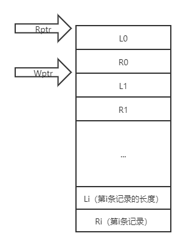

    === "串结构"
        各记录之间的顺序与关键字无关。

    === "顺序结构"
        由用户指定一个字段作为关键字，文件中的所有记录按关键字来排序。

    * 寻址方式
        * 隐式寻址——已知当前记录的逻辑地址，可以确定下一个记录的逻辑地址
        * 显式寻址——对定长记录文件实现直接或随机访问

    !!! success ""
        批量存取记录时，顺序文件的存取效率最高

    !!! failure ""
        不方便增删记录

=== "索引文件"

    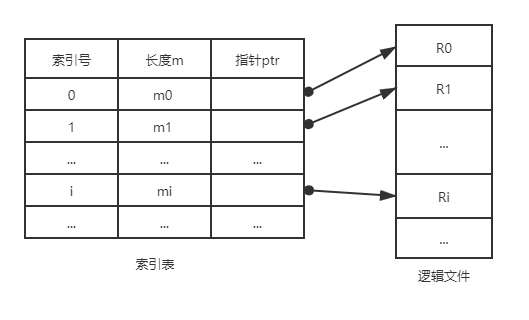

    * 为变长记录文件建立一张索引表，为主文件的每个记录在索引表中分别设置一个表项，记录指向记录的指针以及记录的长度L

    !!! success ""
        拥有较快的检索速度

    !!! failure ""
        可能占用很大存储空间

=== "索引顺序文件"
    * 索引顺序文件是对顺序文件的一种改进，克服了变长记录的顺序文件不能随机访问，以及不便于记录的删除和插入的缺点。

    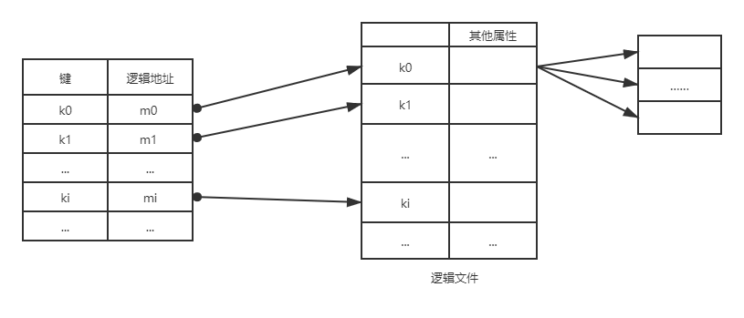

### 目录结构
* 文件控制块和索引结点
    * 文件控制块FCB(File Control Block)
        * 为了能对一个文件进行正确的存取，必须为文件设置用于描述和控制文件的数据结构，称为“文件控制块”
        * 文件控制块中，通常应含三类信息：

        === "基本信息"

            === "文件名"
                指用于标识一个文件的符号名，在每个系统中，每一个文件都必须有唯一的名字，用户利用该名字进行存取。

            === "文件物理位置"
                指文件在外存上的存储位置，它包括存放文件的设备名、文件在外存上的起始盘块号、指示文件所占用的盘块数，或字节数的文件长度。

            === "文件逻辑结构"
                指示文件是流式文件还是记录式文件、记录数，文件是定长记录还是变长记录等。

            === "文件的物理结构"
                指示文件是顺序文件，还是链接式文件或索引文件。

        === "存取控制信息"
            包括文件主的存取权限、核准用户的存取权限以及一般用户的存取权限。

        === "使用信息"
            包括文件的建立日期和时间、文件上一次修改的日期和时间，以及当前使用信息。

        ??? info "MS-DOS的文件控制块"
            FCB的长度为32个字节

            ```text
                ----------------
                |     文件名    |
                ----------------
                |     扩展名    |
                ----------------
                |     属性      |
                ----------------
                |     备用      |
                ----------------
                |     时间      |
                ----------------
                |     日期      |
                ----------------
                |   第一块号    |
                ----------------
                |     盘块数    |
                ----------------
            ```

    * 索引结点
        * 将除了文件名的信息放入“索引结点”中，称为i结点。每个目录项中仅包含文件名和指向该文件i结点的指针

        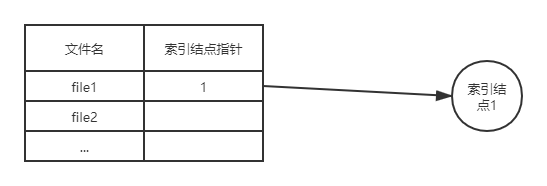

* 目录结构

=== "简单的目录结构"

    === "单级目录结构"
        在整个文件系统中只建立一张目录表，每个文件占一个目录项，除一般属性外，设置一个状态位，表明每个目录项是否空闲。

        |文件名|扩展名|文件长度|物理地址|文件类型|文件说明|状态位|...|
        |:--:|:--:|:--:|:--:|:--:|:--:|:--:|:--:|
        |文件名1||||||||
        |文件名2||||||||
        |文件名3||||||||

        * 每当要建立一个新文件时，必须先检索所有的目录项，以保证新文件名在目录中是唯一的。然后再从目录表中找出一个空白目录项，填入新文件名及其它说明信息，并置状态位为1。
        * 删除文件时，先从目录中找到该文件的目录项，回收该文件所占用的存储空间，然后再清除目录项。

        !!! success ""
            简单，实现了按名存取功能

        !!! failure ""
            查找速度慢，不允许重名，不便于实现文件共享（因此不适用于多用户操作系统）

    === "两级目录结构"

        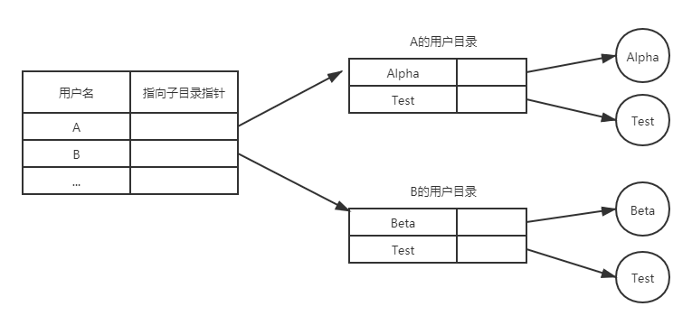

        * 除系统中的主文件目录（MFD）外，为每一个用户再建立一个单独的用户文件目录（UFD）。MFD的每一项包含用户名和指向该用户UFD的指针。
        * 每当要新建一个文件时，操作系统只需检查该用户的UFD内是否已有重名文件，若有，则必须为新文件重新命名。
        * 用户要删除一个文件时，操作系统也只需查找该用户的UFD，从中找出指定文件的目录项，在回收该文件所占用的空间后，将该目录项删除。

        !!! success ""
            提高了检索目录的速度，允许不同用户的文件重名，方便实现访问控制和文件共享

        !!! failure ""
            用户不能对自己的文件进行分类

=== "树形结构目录"
    主目录在这里被称为根目录，在每个文件目录中，只能有一个根目录，每个文件和每个目录都只能有一个父目录。把数据文件称为树叶，其他的目录均作为树的结点，或称为子目录。

    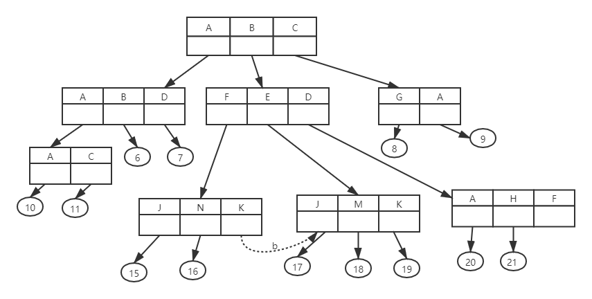

    * 从根目录到任何数据文件只有一条唯一的通路，使用`/`连接起来，就构成了该数据文件唯一的路径名，这个路径名称是绝对路径名
    * 可为每一个进程设置一个“当前目录”（或工作目录），进程对所有文件的访问相对于“当前目录”进行，从当前目录开始直到数据文件为止的路径名称被叫做相对路径名

=== "图形结构目录"
    树形目录结构可便于实现文件分类，但不便于实现文件共享，为此在树形目录结构的基础上增加了一些指向同一结点的有向边，使整个目录成为一个有向无环图。

    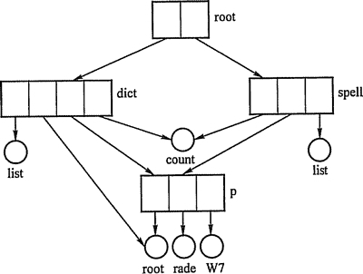

### 文件共享

=== "索引结点（硬链接）"
    文件的物理地址及其他的文件属性等信息不再放在目录项中，而是放在索引结点中。在文件目录中只设置文件名及指向相应索引结点的指针。链接计数为0时，正式删除文件。

    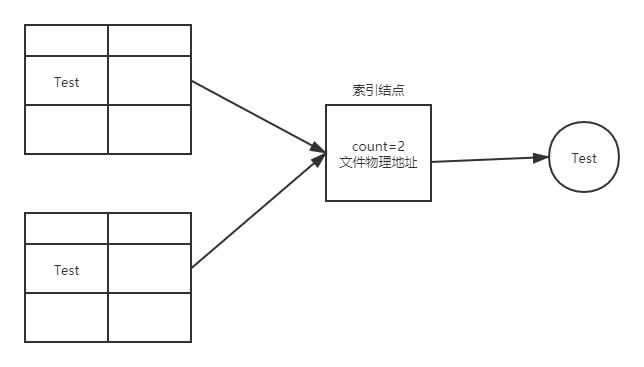

=== "符号链（软链接）"
    允许一个文件或子目录拥有多个父目录，但其中仅有一个作为主（属主）父目录，其他的几个父目录都是通过符号链接方式与之相链接的。

    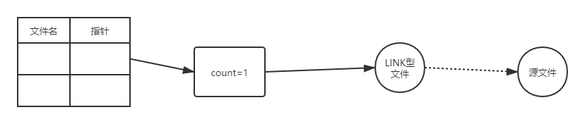

    * 直接删除源文件，符号链仍然存在，但是会失效

### 文件保护
* 为了防止文件共享可能会导致文件被破坏或未经核准的用户修改文件，文件系统必须控制用户对文件的存取，即解决对文件的读、写、执行的许可问题。为此，必须在文件系统中建立相应的文件保护机制。

=== "口令保护"
    用户在建立一个文件时提供一个口令，系统为其建立FCB时附上相应口令，同时告诉允许共享该文件的其他用户。用户请求访问时必须提供相应口令。

    !!! success ""
        时间和空间的开销不多

    !!! failure ""
        口令直接存在系统内部，不够安全

=== "加密保护"
    用户对文件进行加密，文件被访问时需要使用密钥。

    !!! success ""
        保密性强，节省了存储空间

    !!! failure ""
        编码和译码要花费一定时间

=== "访问控制"
    解决访问控制最常用的方法是根据用户身份进行控制。而实现基于身份访问的最为普通的方法是为每个文件和目录增加一个访问控制列表(Access-Control List, ACL)，以规定每个用户名及其所允许的访问类型。

    !!! success ""
        可以使用复杂的访同方法

    !!! failure ""
        长度无法预期并且可能导致复杂的空间管理，使用精简的访问列表可以解决这个问题

    * 精简的访问列表釆用拥有者、组和其他三种用户类型


## 文件系统实现
### 文件系统层次结构
<figure>
  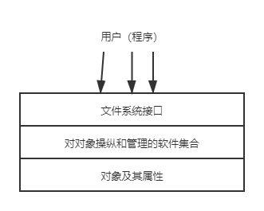
  <figcaption>文件系统模型</figcaption>
</figure>

=== "对象及其属性"
    * 文件系统管理的对象有文件、目录和磁盘存储空间三种。

=== "对对象操纵和管理的软件集合"
    文件系统的功能大多数在这一层实现，其中包括：

    1. 对文件存储空间的管理
    2. 对文件目录的管理
    3. 用于将文件的逻辑地址转换为物理地址的机制
    4. 对文件读与写的管理
    5. 对文件的共享和保护

=== "文件系统的接口"
    为方便用户的使用，文件系统以接口的形式提供了一组对文件和记录操作的方法和手段，有两种类型：

    === "命令接口"
        作为用户与文件系统直接交互的接口，用户可通过键盘终端输入命令取得文件系统的服务。

    === "程序接口"
        作为用户程序与文件系统的接口，用户程序可通过系统调用取得文件系统的服务。

### 目录实现

=== "线性列表"
    使用存储文件名和数据块指针的线性表

=== "哈希表"
    根据文件名得到一个值，并返回一个指向线性列表中元素的指针

### 文件实现

* 文件分配方式

=== "连续分配"
    每个文件在磁盘上占有一组连续的块，一个文件的目录条目包括开始块的地址和该文件所分配区域的长度。

    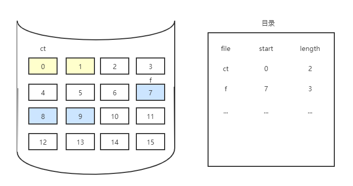

    * 连续分配支持顺序访问和直接访问。

    !!! success ""
        实现简单、存取速度快

    !!! failure ""
        文件长度不宜动态增加、反复增删文件后会产生外部碎片

=== "链接分配"
    链接分配是釆取离散分配的方式，消除了外部碎片，故而显著地提高了磁盘空间的利用率；又因为是根据文件的当前需求，为它分配必需的盘块，当文件动态增长时，可以动态地再为它分配盘块，故而无需事先知道文件的大小。此外，对文件的增、删、改也非常方便。链接分配又可以分为隐式链接和显式链接两种形式。

    === "隐式链接"
        每个文件对应一个磁盘块的链表；磁盘块分布在磁盘的任何地方，除最后一个盘块外，每一个盘块都有指向下一个盘块的指针，这些指针对用户是透明的。目录包括文件第一块的指针和最后一块的指针。

        * 仅支持顺序访问

        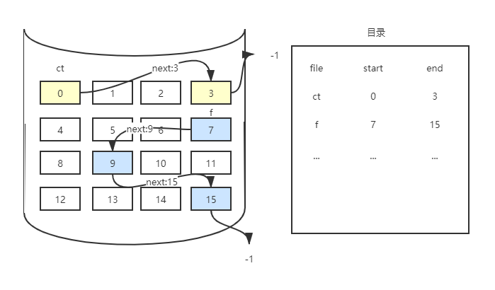

    === "显式链接"
        把用于链接文件各物理块的指针，显式地存放在内存的一张链接表中。 该表在整个磁盘仅设置一张，每个表项中存放链接指针，即下一个盘块号。

        * 支持顺序访问和随机访问
        * 在该表中，凡是属于某一文件的第一个盘块号，或者说是每一条链的链首指针所对应的盘块号，均作为文件地址被填入相应文件的FCB的“物理地址”字段中。
        * 由于查找记录的过程是在内存中进行的，因而不仅显著地提高了检索速度，而且大大减少了访问磁盘的次数。
        * 由于分配给文件的所有盘块号都放在该表中，故称该表为文件分配表（File Allocation Table, FAT)。

        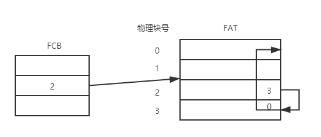

=== "索引分配"
    系统为每个文件建立一张索引表，记录了文件的各个逻辑块对应的物理块。

    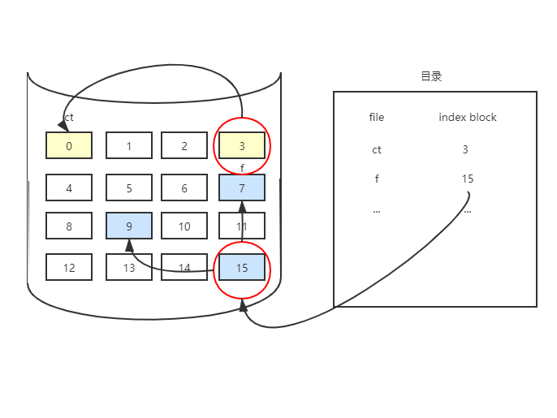

    ???+ faq "索引块太小，无法支持大文件的解决方案"
        === "链接方案"
            为了处理大文件，可以将多个索引块链接起来。

        === "多层索引"
            多层索引使第一层索引块指向第二层的索引块，第二层索引块再指向文件块。 这种方法根据最大文件大小的要求，可以继续到第三层或第四层。

            * 例如，4096B的块，能在索引块中存入1024个4B的指针。两层索引允许1048576个数据块，即允许最大文件为4GB。

        === "混合索引"
            将多种索引分配方式相结合的分配方式。

!!! summary "文件三种分配方式的比较"
    ||访问第n个记录|优点|缺点|
    |:--:|:--:|:--:|:--:|
    |顺序分配|需访问磁盘1次|顺序存取时速度怏，当文件是定长时可以根据文件起始地址及记录长度进行随机访问|文件存储要求连续的存储空间，会产生碎片，也不利于文件的动态扩充|
    |链接分配|需访问磁盘n次|可以解决外存的碎片问题，提髙了外存空间的利用率，动态增长较方便|只能按照文件的指针链顺序访问，查找效率低，指针信息存放消耗外存空间|
    |索引分配|m级需访问磁盘m+1次|可以随机访问，易于文件的增删|索引表增加存储空间的开销，索引表的查找策略对文件系统效率影响较大|

* 文件存储空间管理
    * 划分与初始化

        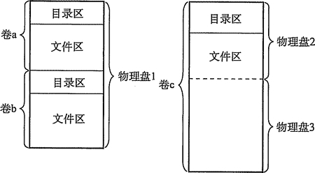

        * 在一个文件卷中，文件数据信息的空间（文件区）和存放文件控制信息FCB的空间（目录区）是分离的。

        * 逻辑卷在提供文件服务前，必须由对应的文件程序进行初始化，划分好目录区和文件区，建立空闲空间管理表格及存放逻辑卷信息的超级块。

    * 存储空间管理
        * 文件存储设备分成许多大小相同的物理块，并以块为单位交换信息，因此，文件存储设备的管理实质上是对空闲块的组织和管理，它包括空闲块的组织、分配与回收等问题。

        === "空闲表法"
            空闲表法属于连续分配方式，它与内存的动态分配方式雷同，它为每个文件分配一块连续的存储空间。即系统也为外存上的所有空闲区建立一张空闲表，每个空闲区对应于一个空闲表项，其中包括表项序号、该空闲区的第一个盘块号、该区的空闲盘块数等信息。再将所有空闲区按其起始盘块号递增的次序排列，形成空闲盘块表。

            |序号|第一空闲盘块号|空闲盘块数|
            |:--:|:--:|:--:|
            |1|2|4|
            |2|9|3|
            |3|15|5|
            |4|...|...|

        === "空闲链表法"
            将所有空闲盘区拉成一条空闲链。根据构成链所用基本元素的不同，可把链表分成两种形式：空闲盘块链和空闲盘区链

            === "空闲盘块链"
                将磁盘上所有空闲空间以盘块为单位拉成一条链，其中的每一个盘块都有指向后继盘块的指针。

                

                * 当用户因创建文件而请求分配存储空间时，系统从链首开始，依次摘下适当数目的空闲盘块分配给用户。
                * 当用户因删除文件而释放存储空间时，系统将回收的盘块依次挂在空闲盘块链的末尾。

            === "空闲盘区链"
                将磁盘上所有空闲盘区拉成一条链。在每个盘区上除含有用于指示下一个空闲盘区的指针外，还应有能指明本盘区大小（盘块数）的信息。

                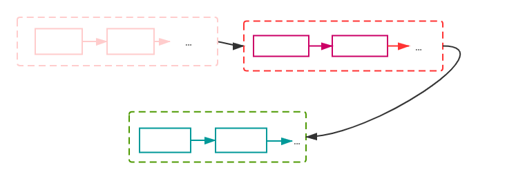

        === "位示图法*"
            利用二进制的一位来表示磁盘中一个盘块的使用情况。当其值为`0`时，表示对应的盘块空闲；为`1`时，表示已分配。(有的系统恰好相反)

            * 通常用 $m \times n$ 个位数来构成位示图，并使 $m \times n$ 等于磁盘的总块数，也可描述为一个二维数组`map[m][n]`。
            * Linux系统常用

            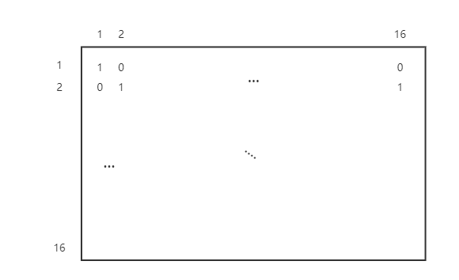

            * 分配新盘块

                ```mermaid
                graph TD
                  A["顺序扫描位示图，从中找出一个或一组其值为'0(空闲)'的二进制位"]-->B[将所找到的一个或一组二进制位转换为对应的盘块号]
                  B --> C["修改位示图，令map[i,j]=1"]
                ```
                
                - 假定找到的其值为`0`的二进制位，位于位示图的第`i`行、第`j`列，则其相应的盘块号应按下式计算

                    $$
                    \begin{align}
                    b=
                    \begin{cases}
                    n(i-1)+j,  &\text{i,j,b从1开始计数} \\
                    ni+j, &\text{i,j,b从0开始计数}
                    \end{cases}
                    \end{align}
                    $$

            * 回收空闲盘块

                ```mermaid
                graph TD
                  A["根据回收的盘块号计算出对应的字号、位号"]--> C["将相应二进制位设为0"]
                ```
                
                - 盘块号`b`转换为位示图行列`(i,j)`的公式如下

                    $$
                    \begin{align}
                    i&=
                    \begin{cases}
                      b\div n ,& \text{i,j,b从0开始计数}\\
                      (b-1)\div n+1 ,&\text{i,j,b从1开始计数}\\
                    \end{cases}\\
                    j&=
                    \begin{cases}
                      b\%n ,&\text{i,j,b从0开始计数} \\
                      (b-1)\% n+1 ,&\text{i,j,b从1开始计数}
                    \end{cases}
                    \end{align}
                    $$

        === "成组链接法"
            对所有空闲盘块分组并链接

            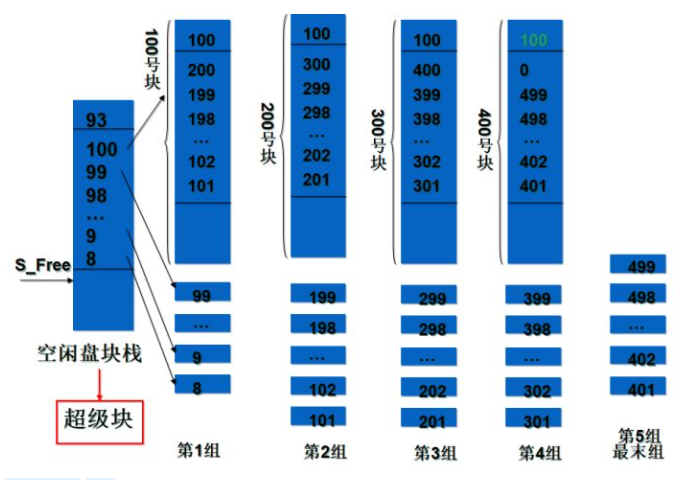 <!--source:https://zhuanlan.zhihu.com/p/31954652-->

            * 链接时，将每组（第1组除外）的总块数及相应的块号记录在前一组的最末块中：
                - 对第1组，其总块数和各块块号记录在空闲盘块栈中，放在超级块里。
                - 系统启动后，将超级块复制到主存中，并建立空闲盘块号栈，栈顶指针`S_Free=第1组总块数`。
            * UNIX系统使用此方法

            * 分配新盘块
            ``` title="伪代码"
            count=当前组空闲盘块总数;
            S_free--;
            b=*S_free;
            if (count>1)
            {
                count--;
                return b;
            }
            else if (count==1)
            {
                if (b==0)   // 是最后一个分组了，没有空闲盘块了
              	拒绝分配，返回0;
                else
                {
                    将b中内容读入空闲盘块栈;  //读入下一个分组
                    count=当前组空闲盘块总数;
                	S_free=count;
                	return b;
                }
            }
            ```
            
            * 回收空闲盘块
            ``` title="伪代码"
            count=当前组空闲盘块总数;
            b=回收块号; //如回收50、60号块
            if(count<100)
            {
                *S_Free=b;
                count++;
                S_Free++;
                return;
            }
            else if(count==100)
            {
                将空闲盘块栈内容写入b中;
                count=1；
                S_free=0;
                *S_Free=b;
                S_Free++;
                return;
            }
            ```

## 磁盘组织与管理
### 磁盘的结构
一块磁盘是由多块盘片组成，每块盘片的正反两面皆可以存放数据

* 在读/写操作期间，磁头固定，磁盘在下面高速旋转。磁盘的盘面上的数据存储在一组同心圆中，称为磁道。每个磁道与磁头一样宽, 一个盘面有上千个磁道。磁道又划分为几百个扇区，每个扇区固定存储大小（通常为512B), 一个扇区称为一个盘块。相邻磁道及相邻扇区间通过一定的间隙分隔开，以避免精度错误。
* 扇区就是磁盘可寻址的最小存储单位

<figure>
  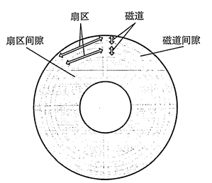
  <figcaption>磁盘盘片</figcaption>
</figure>

<figure>
  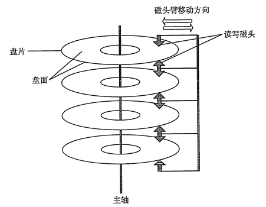
  <figcaption>磁盘驱动器</figcaption>
</figure>

* 磁盘按不同方式可以分为若干类型
    * 磁头相对于盘片的径向方向固定的称为固定头磁盘，每个磁道一个磁头；磁头可移动的称为活动头磁盘，磁头臂可以来回伸缩定位磁道。
    * 磁盘永久固定在磁盘驱动器内的称为固定盘磁盘；可移动和替换的称为可换盘磁盘。

### 磁盘调度算法
* 磁盘访问时间
    * 磁盘设备在工作时以恒定速率旋转。为了读或写，磁头必须能移动到指定的磁道上，并等待所制定的扇区的开始位置旋转到磁头下，然后再开始读或写数据
    * 一次磁盘读写操作的时间由寻找（寻道）时间、延迟时间和传输时间决定

    === "寻道时间Ts"
        活动头磁盘在读写信息前，将磁头移动到指定磁道所需要的时间。这个时间除跨越`n`条磁道的时间外，还包括启动磁臂的时间`s`，即

        $$
        T_s=m\times n + s
        $$

        * 其中`m`是与磁盘驱动器速度有关的常数
            * 对于一般磁盘，$m=0.2$ ；对高速磁盘，$m\le 0.1$
        * 磁臂的启动时间`s`约为2ms

    === "旋转延迟时间Tr"
        磁头定位到某一磁道的扇区（块号）所需要的时间

        * 设磁盘的旋转速度为`r`，则

        $$
        T_r=\frac {1}{2r}
        $$

        * 对于硬盘，典型的旋转速度为5400r/m，相当于一周11.1ms，则 $T_r$ 为5.55ms
        * 对于软盘，其旋转速度在300~600r/m之间，则 $T_r$ 为50~100ms。

    === "传输时间Tt"
        从磁盘读出或向磁盘写入数据所经历的时间，其大小与每次所读/写的字节数`b`和磁盘的旋转速度`r`相关

        $$
        T_t=\frac {b}{rN}
        $$

        * 式中，`r`为磁盘每秒钟的转数；`N`为一个磁道上的字节数

    * 总平均存取时间 $T_a$ 可以表示为 $T_a=T_s+\frac {1}{2r}+\frac {b}{rN}$

* 常用的磁盘调度算法
    * 在实际的磁盘I/O操作中，存取时间与磁盘调度算法密切相关。调度算法直接决定寻找时间，从而决定了总的存取时间。

    === "先来先服务(FCFS)"
        FCFS算法根据进程请求访问磁盘的先后顺序进行调度

        * 例如：磁盘请求队列中的请求顺序分别为55、58、39、18、90、160、150、38、184，磁头初始位置是100磁道
        <figure>
          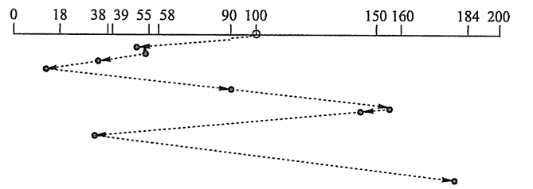
          <figcaption>FCFS算法</figcaption>
        </figure>

        磁头共移动了 $(45+3+19+21+72+70+10+112+146)=498$ 个磁道，平均寻找长度为 $498/9=55.3$

    === "最短寻道时间优先(SSTF)"
        SSTF算法选择调度处理的磁道是与当前磁头所在磁道距离最近的磁道，以使每次的寻找时间最短。

        !!! bug ""
            可能会产生“饥饿”现象

        * 例如：磁盘请求队列中的请求顺序分别为55、58、39、18、90、160、150、38、184，磁头初始位置是100磁道
        <figure>
          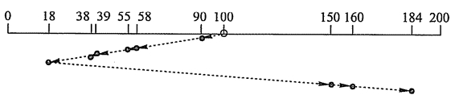
          <figcaption>SSTF算法</figcaption>
        </figure>

        磁头共移动了 $(10+32+3+16+1+20+132+10+24)=248$ 个磁道，平均寻找长度为 $248/9=27.5$

    === "扫描(SCAN)"
        在磁头当前移动方向上选择与当前磁头所在磁道距离最近的请求作为下一次服务的对象（由于磁头移动规律与电梯运行相似，故又称为电梯调度算法）

        * 例如：磁盘请求队列中的请求顺序分别为55、58、39、18、90、160、150、38、184，磁头初始位置是100磁道，磁头沿磁道号增大的顺序移动
        <figure>
          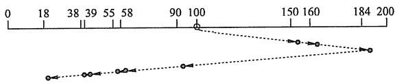
          <figcaption>SCAN算法</figcaption>
        </figure>

        磁头共移动了 $(50+10+24+94+32+3+16+1+20)=250$ 个磁道，平均寻找长度为 $250/9=27.8$

    === "循环扫描(C-SCAN)"
        在扫描算法的基础上规定磁头单向移动来提供服务，回返时直接快速移动至起始端而不服务任何请求。由于SCAN算法偏向于处理那些接近最里或最外的磁道的访问请求，所以使用改进型的C-SCAN算法来避免这个问题。

        * 釆用SCAN算法和C-SCAN算法时磁头总是严格地遵循从盘面的一端到另一端，显然，在实际使用时还可以改进，即磁头移动只需要到达最远端的一个请求即可返回，不需要到达磁盘端点。这种形式的SCAN算法和C-SCAN算法称为LOOK和C-LOOK调度。这是因为它们在朝一个给定方向移动前会查看是否有请求。
        * 例如：磁盘请求队列中的请求顺序分别为55、58、39、18、90、160、150、38、184，磁头初始位置是100磁道，磁头沿磁道号增大的顺序移动
        <figure>
          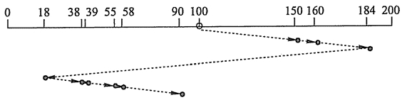
          <figcaption>C-SCAN算法</figcaption>
        </figure>

        磁头共移动了 $(50+10+24+166+20+1+16+3+32)=322$ 个磁道，平均寻找长度为 $322/9=35.8$

    ??? summary "四种算法的比较"
        ||优点|缺点|
        |:--:|:--:|:--:|
        |FCFS算法|公平、简单|平均寻道距离大，仅应用在磁盘I/O较少的场合|
        |SSTF算法|性能比“先来先服务”好|不能保证平均寻道时间最短，可能出现“饥饿”现象|
        |SCAN算法|寻道性能较好，可避免“饥饿”现象|不利于远离磁头一端的访问请求|
        |C-SCAN算法|消除了对两端磁道请求的不公平|--|

* 除减少寻找时间外，减少延迟时间也是提高磁盘传输效率的重要因素。
    * 可以对盘面扇区进行交替编号，对磁盘片组中的不同盘面错位命名。
        * 磁头读/写一个物理块后，需要经过短暂的处理时间才能开始读/写下一块。假设逻辑记录数据连续存放在磁盘空间中，若在盘面上按扇区交替编号连续存放，则连续读/写多个记录时能减少磁头的延迟时间；同柱面不同盘面的扇区若能错位编号，连续读/写相邻两个盘面的逻辑记录时也能减少磁头延迟时间。

### 磁盘的管理
* 磁盘初始化
    * 在磁盘能存储数据之前，它必须分成扇区以便磁盘控制器能进行读和写操作，这个过程称为低级格式化（物理分区）
    * 为了使用磁盘存储文件，操作系统还需要将自己的数据结构记录在磁盘上：第一步将磁盘分为由一个或多个柱面组成的分区（即我们熟悉的C盘、D盘等形式的分区）；第二步对物理分区进行逻辑格式化（创建文件系统)，操作系统将初始的文件系统数据结构存储到磁盘上，这些数据结构包括空闲和已分配的空间以及一个初始为空的目录。
* 引导块
    * 计算机启动时需要运行一个初始化程序（自举程序），它初始化CPU、寄存器、设备控制器和内存等，接着启动操作系统。
    * 自举程序通常保存在ROM中，为了避免改变自举代码需要改变ROM硬件的问题，故只在ROM中保留很小的自举装入程序，将完整功能的自举程序保存在磁盘的启动块上，启动块位于磁盘的固定位。拥有启动分区的磁盘称为启动磁盘或者系统磁盘。
* 坏块
    * 由于磁盘有移动部件且容错能力弱，所以容易导致一个或多个扇区损坏。部分磁盘甚至从出厂时就有坏扇区。根据所使用的磁盘和控制器，对这些块有多种处理方式。
        - 对于简单磁盘，如电子集成驱动器（IDE)。坏扇区可手工处理，如MS-DOS的`Format`命令执行逻辑格式化时便会扫描磁盘以检查坏扇区。坏扇区在FAT表上会标明，因此程序不会使用。
        - 对于复杂的磁盘，如小型计算机系统接口（SCSI)，其控制器维护一个磁盘坏块链表。该链表在出厂前进行低级格式化时就初始化了，并在磁盘的整个使用过程中不断更新。低级格式化将一些块保留作为备用，对操作系统透明。控制器可以用备用块来逻辑地替代坏块，这种方案称为扇区备用。
