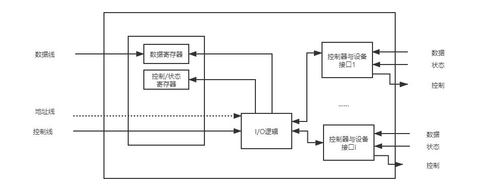
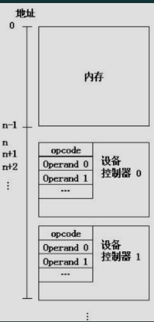
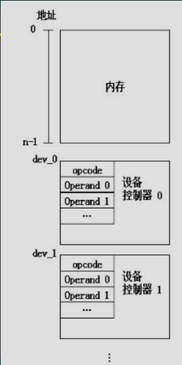
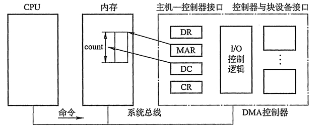
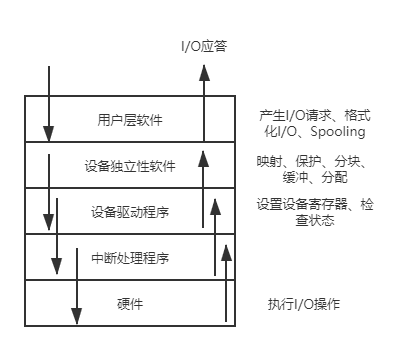
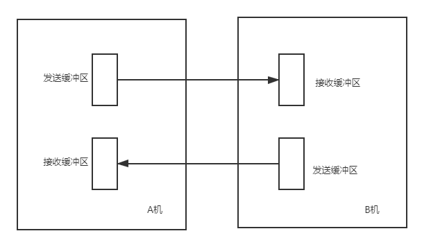
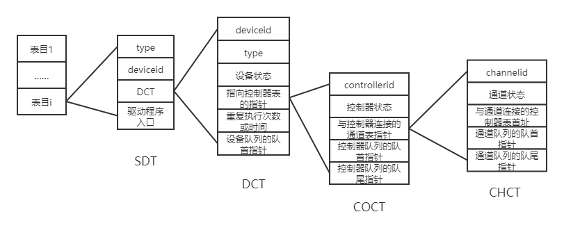
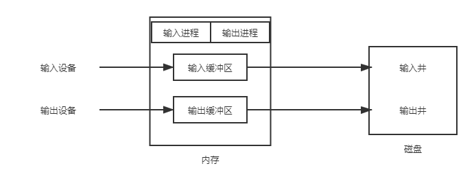
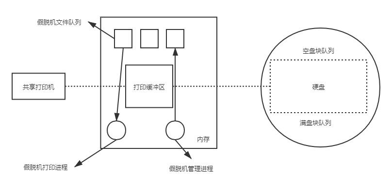

---
tags:
  - 408考研复习
  - 操作系统
comments: true
---

输入输出(I/O)管理
===

???+ summary "I/O系统的基本功能"
    1. 隐藏物理设备的细节
    2. 与设备的无关性
    3. 提高处理机和I/O设备的利用率
    4. 对I/O设备进行控制
    5. 确保对设备的正确共享
    6. 错误处理

## I/O管理简述
* I/O设备与I/O控制器
    * I/O设备的分类

        === "按设备使用特性分类"
            * 存储设备
                - 也称为外存、辅存、后备存储器等
            * 输入/输出设备
                - 输入设备、输出设备和交互式设备

        === "按传输速率分类"
            * 低速设备
                - 每秒几个字节至数百个字节
            * 中速设备
                - 每秒千字节至万字节
            * 高速设备
                - 每秒数百千个字节至数十兆字节

        === "按数据的传输单位分类"
            * 块设备 - 以块为单位
            * 字符设备 - 以字符为单位

        === "设备的共享属性"
            * 独占设备：临界资源
            * 共享设备：可寻址、可随机访问
            * 虚拟设备：通过SPOOLING技术把独享设备改造为共享设备，以提高利用率

    * 设备控制器
        * 设备控制器是计算机中的一个实体。它控制一个或多个I/O设备，实现I/O设备和计算机之间的数据交换；它接收从CPU发来的命令，并控制I/O设备工作
        * 组成
            <figure markdown>
            
            </figure>

            === "内存映像I/O"
                <figure markdown>
                
                </figure>

                在编址上不区分内存单元地址和设备控制器中的寄存器地址，当处于0~n-1范围时，是内存地址；大于等于n时，是某个控制器的寄存器地址

            === "寄存器独立编址"
                <figure markdown>
                
                </figure>

                为实现CPU和设备控制器间的通信，为每个控制寄存器分配一个I/O端口，另外还设置一些特定的I/O指令

                !!! bug ""
                    访问内存和访问设备需要两种不同的指令

* I/O系统接口

    === "块设备接口"
        块设备接口是块设备管理程序与高层之间的接口，数据的存取和传输都是以数据块为单位的设备，传输速率高，可寻址。
    
    === "流（字符）设备接口"
        流设备接口是流设备管理程序与高层的接口，数据的存取和传输是以字符为单位的设备，传输速率较低，不可寻址，常采用中断驱动方式。
    
    === "网络通信接口"
        在现代操作系统中，提供了面向网络的功能，通过某种方式把计算机连接到网络上，使计算机能通过网络与网络上的其他计算机通信。

### I/O控制方式

=== "程序直接控制方式：轮询"

    ```mermaid
    graph LR
      A[给I/O模块发出读命令] -->B[读I/O模块的状态]
      B --> C{检查状态}
      C -->|准备好| D[从I/O模块读取字]
      C -->|未准备好| B
      D -->E[往存储器中写入字]
      E -->F{完成}
      F -->|是|G[下一条指令]
      F -->|否|A
    ```

    在早期的计算机中，由于无中断机构，处理机对I/O设备的控制采用程序直接控制方式，或称为忙-等待方式。计算机从外部设备读取数据到存储器，每次读一个字的数据。对读入的每个字，CPU需要对外设状态进行循环检查，直到确定该字已经在I/O控制器的数据寄存器中。由于CPU的高速性和I/O设备的低速性，致使CPU的绝大部分时间都处于等待I/O设备完成数据I/O的循环测试中，造成了CPU资源的极大浪费

    !!! success ""
        简单易于实现

    !!! failure ""
        由于CPU和I/O设备只能串行工作，导致CPU的利用率相当低

=== "中断驱动方式"

    ```mermaid
    graph LR
       A[给I/O模块发出读命令] -->B[读I/O模块的状态]
       A-..->做其他事情
       中断-..->B
       B --> C{检查状态}
       C -->|准备好| D[从I/O模块读取字]
       C -->|未准备好| B
       D -->E[往存储器中写入字]
       E -->F{完成}
       F -->|是|G[下一条指令]
       F -->|否|A
    ```

    在每个指令周期的末尾，CPU检查中断。当有来自I/O控制器的中断时，CPU保存当前正在运行程序的上下文，转去执行中断处理程序处理该中断。这时，CPU从I/O控制器读一个字的数据传送到寄存器，并存入主存。接着，CPU恢复发出I/O命令的程序（或其他程序）的上下文，然后继续运行。

    !!! success ""
        允许I/O设备主动打断CPU的运行并请求服务，从而“解放”CPU，使得其向I/O控制器发送读命令后可以继续做其他有用的工作，CPU与I/O可以并行操作

    !!! failure ""
        数据中的每个字在存储器与I/O控制器之间的传输都必须经过CPU，这就导致了中断驱动方式仍然会消耗较多的CPU时间

=== "DMA方式"

    ```mermaid
    graph LR
        A[给I/O模块发出读命令]
        B[读DMA模块的状态]
        A-..->做其他事情
        中断-..->B
        B-->G[下一条指令]
    ```
    
    DMA（直接存储器存取）方式的基本思想是在I/O设备和内存之间开辟直接的数据交换通路，彻底“解放”CPU。

    

    * DMA方式的特点是：
        - 基本单位是数据块。
        - 所传送的数据，是从设备直接送入内存的，或者相反。
        - 仅在传送一个或多个数据块的开始和结束时，才需CPU干预，整块数据的传送是在 DMA控制器的控制下完成的。
    * 为了实现在主机与控制器之间成块数据的直接交换，必须在DMA控制器中设置如下四类寄存器

    === "命令/状态寄存器(CR)"
        用于接收从CPU发来的I/O命令或有关控制信息，或设备的状态。

    === "内存地址寄存器(MAR)"
        在输入时，它存放把数据从设备传送到内存的起始目标地址；在输出时，它存放由内存到设备的内存源地址。

    === "数据寄存器(DR)"
        用于暂存从设备到内存，或从内存到设备的数据。

    === "数据计数器(DC)"
        存放本次CPU要读或写的字（节）数。

=== "通道控制方式"

    ```mermaid
    graph LR
          A[CPU给通道发出命令] -->B[CPU进行中断处理]
          中断信号-..->B
          B-->G[下一条指令]
    ```

    I/O通道方式是DMA方式的发展，它可以进一步减少CPU的干预，即把对一个数据块的读（或写）为单位的干预，减少为对一组数据块的读（或写）及有关的控制和管理为单位的干预。

    !!! tip "I/O通道与DMA方式的区别"
        * DMA方式需要CPU来控制传输的数据块大小、传输的内存位置，而通道方式中这些信息是由通道控制的。
        * 每个DMA控制器对应一台设备与内存传递数据，而一个通道可以控制多台设备与内存的数据交换。

    * 通道程序

        - 通道是通过执行通道程序并与设备控制器共同实现对I/O设备的控制的

        - 其中，通道程序是由一系列通道指令所构成的。

        ```text
        每条指令都包含以下字段
        | 操作 | P | R | 计数 | 内存地址 |
        ```

### I/O软件层次结构
I/O软件通常组织成四个层次，低层实现与硬件相关操作，高层为用户提供简洁、友好和规范的接口

<figure markdown>

</figure>

=== "用户层软件"
    实现与用户交互的接口，用户可直接调用在用户层提供的、与I/O操作有关的库函数，对设备进行操作

=== "设备独立性软件"
    实现用户程序与设备驱动器的统一接口、设备命名、设备保护、设备的分配和回收

=== "设备驱动程序"
    与硬件直接相关，负责具体实现系统对设备发出的操作指令，驱动设备工作

=== "中断处理程序"
    用于保存被中断进程的CPU环境，转入相应中断处理程序进行处理，处理完后再恢复被中断进程的现场

## I/O核心子系统
### I/O调度
* 用某种算法确定一个好的顺序来处理各个I/O请求

??? tip "Linux提供的I/O调度的电梯算法"
    IO调度器的总体目标是希望让磁头能够总是往一个方向移动，移动到底了再往反方向走，这恰恰就是现实生活中的电梯模型，所以IO调度器也被叫做电梯(elevator)，而相应的算法也就被叫做电梯算法。

    * 而Linux中IO调度的电梯算法有好几种，一个叫做AS(Anticipatory)，一个叫做 CFQ(Complete Fairness Queueing)，一个叫做deadline，还有一个叫做noop(No Operation)。具体使用哪种算法我们可以在启动的时候通过内核参数`elevator`来指定。

### 高速缓存与（内存组成的）缓冲区
缓冲区是一个存储区域，它可以由专门的硬件寄存器组成，但由于硬件的成本比较高，容量也比较小，一般仅用在对速度要求非常高的场合，一般情况下，更多利用内存作为缓冲区。

???+ summary "引入缓冲区的原因"
    1. 缓和CPU与I/O设备间速度不匹配的矛盾。
    2. 减少对CPU的中断频率，放宽对CPU中断响应时间的限制。
    3. 解决数据粒度不匹配的问题。
    4. 提高CPU和I/O设备间的并行性。

=== "单缓冲区"
    在单缓冲情况下，每当用户进程发出一个I/O请求后，操作系统便在主存中为之分配一个缓冲区。

    * 当缓冲区不为空时不能往里面放入数据，只有缓冲区为空才能放入数据，但是一次放入的数据必须充满整个缓冲块，才能从缓冲区把数据传出

    * 采用单缓冲策略，处理一块数据平均耗时 $MAX(C,T)+M$ 。其中C是CPU处理工作区的时间，T是从I/O到缓冲区的时间，M是缓冲区的数据存到工作区的时间。

=== "双缓冲区"
    在设备输入时，先将数据送入第一缓冲区，装满后便转向第二缓冲区。此时操作系统可以从第一缓冲区中移出数据，并送入用户进程。

    * 采用双缓冲策略，处理一个数据块的平均耗时是 $Max(T, C+M)$

    * 实现两台机器之间的通信时，一般为每一台机器配置成双缓冲模式，易于实现双向数据传输。

    <figure markdown>
    
    </figure>

=== "循环缓冲区"
    将大小相等的缓冲区连接成一个循环队列。循环队列中有两种缓冲区，一种是没有数据的空闲缓冲区，一种是由数据的满缓冲区。又有两个指针分别指向空缓冲区和满缓冲区。

=== "缓冲池"
    缓冲池有系统中共用的缓冲区组成。这些缓冲区按照使用状况可以分为：空缓冲队列、装满输入数据的缓冲队列、装满输出数据的缓冲队列。

    * 根据一个缓冲区在实际运算中扮演的功能不同，又设置了四种工作缓冲区：用于收容输入数据的工作缓冲区(hin)、用于提取输入数据的工作缓冲区(sin)、用于收容输出数据的工作缓冲区(hout)、用于提取输出数据的工作缓冲区(sout)。

### 设备分配与回收
* 设备分配中的数据结构
    * 在用于设备分配的数据结构中，记录了对设备或控制器进行控制所需的信息

    <figure markdown>
    
    </figure>

    === "设备控制表DCT"
        系统为每一个设备都配置了一张设备控制表，用于记录设备的情况。

        * 设备控制表的字段：(type,deviceid,设备状态,指向控制器表的指针,重复执行次数或时间,设备队列的队首指针)

    === "控制器控制表COCT"
        系统为每一个控制器都设置了用于记录控制器情况的控制器控制表。

    === "通道控制表CHCT"
        每个通道都有一张通道控制表。

    === "系统设备表SDT"
        记录了系统中全部设备的情况，每个设备占一个条目。

* 设备分配时所考虑的因素
    * 系统在分配设备时。应考虑如下几个因素：

    === "设备的固有属性"

        === "独占设备"
            将一个设备分配给某进程后，便由该进程独占，直至该进程完成或释放该设备。

        === "共享设备"
            对于共享设备，可同时分配给多个进程使用，此时须注意对这些进程访问该设备的先后次序进行合理调度。

        === "虚拟设备"
            虚拟设备属于可共享的设备，可以将它同时分配给多个进程使用。

    === "设备分配算法"

        === "先来先服务"
            根据诸进程对某设备提出请求的先后次序，将这些进程排成一个设备请求队列，设备分配程序总是把设备首先分配给队首进程。

        === "优先级高者优先"
            将优先级高的进程排在设备队列前面，而对于优先级相同的I/O请求，则按先来先服务原则排队。

    === "设备分配中的安全性"

        === "安全分配方式"
            每当进程发出I/O请求后，便进入阻塞状态，直到其I/O操作完成时才被唤醒。

            !!! tip ""
                破坏了“请求与保持”条件，故设备分配是安全的

        === "不安全分配方式"
            进程在发出I/O请求后，仍继续运行，仅当进程所请求的设备已被另一进程占用时，才进入阻塞状态。

* 逻辑设备名到物理设备名映射的实现：LUT
    * 每个表目包含三项：逻辑设备名、物理设备名和设备驱动程序的入口地址
    * 设置方式：每个用户一张LUT，或整个系统共用一张LUT

### 假脱机技术（SPOOLing）

!!! note ""
    SPOOLing是Simultaneous Peripheral Operation On-Line （即外部设备联机并行操作）的缩写

??? tip "脱机技术回顾"
    - 脱机：脱离主机控制。
    - 脱机输入输出：将作业利用外围控制机输入至高速磁盘中（或相反）。令CPU有更多时间处理其他任务，缓解速度矛盾。

!!! summary "假脱机系统的特点"
    - 提高了I/O的速度
    - 将独占设备改造为共享设备
    - 实现了虚拟设备功能

<figure markdown>

</figure>

* SPOOLing系统主要由以下四部分组成

=== "输入井和输出井"
    它们是在磁盘上开辟的两大存储区。输入井是模拟脱机输入时的磁盘，用于收容输入设备输入的数据；输出井是模拟脱机输出时的磁盘，用于收容用户程序的输出数据。

=== "输入缓冲区和输出缓冲区"
    它们是在主存中开辟的两个缓冲区。输入缓冲区用于暂存由输入设备送来的数据，以后再传送到输入井；输出缓冲区用于暂存从输出井送来的数据，以后再传送给输出设备。

=== "输入进程和输出进程"
    输入进程模拟脱机输入时的外围控制机，将用户要求的数据从输入设备，通过输入缓冲区送到输入井。当CPU需要数据时，直接从输入井读入主存；输出进程模拟脱机输出时的外围控制机，把用户要求输出的数据，先从主存送到输出井，待输出设备空闲时，再将输出井中的数据，经过输出缓冲区送到输出设备上。

=== "井管理程序"
    用于控制作业与磁盘井之间信息的交换。当作业执行过程中向某台设备发出启动输入或输出操作请求时，由操作系统调用井管理程序，由其控制从输入井读取信息或将信息输出至输出井。

* 应用：共享打印机
    
    <figure markdown>
    
    </figure>

    * 打印机是经常用到的输出设备，属于独占设备。利用假脱机技术，可以将它改造成为一台可供多个用户共享的打印设备，从而提高设备的利用率，也方便了用户。主要分为三部分：

    === "磁盘缓冲区"
        暂存用户程序的输出数据。

    === "打印缓冲区"
        暂存从磁盘缓冲区送来的数据。

    === "假脱机管理进程和假脱机打印进程"
        由假脱机管理进程为每个要求打印的用户数据建立一个假脱机文件，并把它放入假脱机文件队列中，由假脱机打印进程依次对队列中的文件进行打印。
