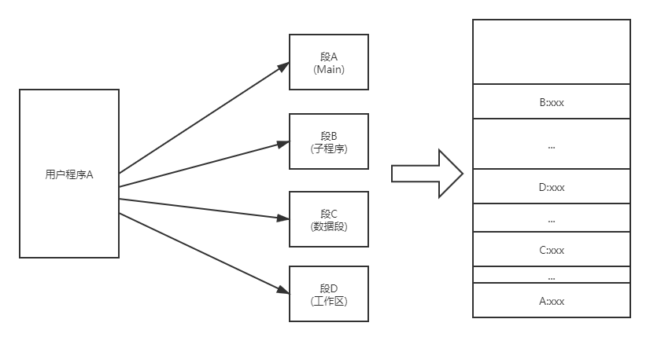

---
tags:
  - 408考研复习
  - 操作系统
comments: true
---

内存管理
===

???+ summary "内存管理的功能"
    1. 操作系统负责内存空间的分配与回收
    2. 操作系统提供某种技术，从逻辑上对内存空间进行扩充
    3. 操作系统提供地址转换功能，负责程序的逻辑地址与物理地址的转换
    4. 操作系统提供内存保护功能，保证各个进程在各自存储空间内运行，互不干扰

## 内存管理基础
### 内存管理概念
* 程序的装入与链接

    ```mermaid
    graph LR
        A(高级语言)-->|编译|B(机器语言)
        B-->|链接|C(装入模块)
        C-->|装入|D(内存)
    ```

    === "编译"
        由编译程序(Complier) 将用户源代码编译成若干个目标模块 (Object Module)

    === "链接"
        由链接程序(Linker) 将编译后形成的目标模块以及它们所需要的库函数，链接在一起，形成一个装入模块 (Load Module)

        === "静态链接"
            静态链接是在生成可执行文件时进行的。在目标模块中记录符号地址 (symbolic address) ，而在可执行文件中改写为指令直接使用的数字地址。

        === "运行时动态链接"
            将对某些模块的链接推迟到执行时才执行。

            !!! success ""
                凡在执行过程中未被用到的目标模块，都不会被调入内存和被链接到装入模块上，这样不仅可加快程序的装入过程，而且可节省大量的内存空间

        === "装入时动态链接"
            目标模块是在装入内存时，边装入边链接的。

            !!! success ""

                1. 便于修改和更新
                2. 便于实现对目标模块的共享

    === "装入"
        由装入程序(Loader) 将装入模块装入内存

        === "绝对装入"
            单道程序中，在由编译程序或程序员指定内存地址，装入时直接定位在上述(即文件中记录的地址)内存地址。逻辑地址和物理地址完全相同。

            !!! success ""
                装入过程简单，实现容易

            !!! failure ""
                需要有连续的空间，不适于多道程序系统

        === "可重定位装入"
            多道程序环境中，单一装入模块中采用逻辑地址，根据当前内存情况，将装入模块装入到适当位置。操作系统装入模块进行地址映射。地址映射（地址转换）是在装入模块装入内存时一次性进行的，即采用静态重定位，以后不能更改。

            !!! success ""
                不需硬件支持，可以装入有限多道程序

            !!! failure ""
                程序装入内存后不能移动，不易实现共享

        === "动态运行时装入"
            将装入模块原样装入内存，而地址映射工作推迟到程序真正执行时才进行，即采用动态重定位

            !!! success ""

                1. OS 可以将一个程序分散存放于不连续的内存空间，可以移动程序，有利用实现共享。
                2. 能够支持程序执行中产生的地址引用，如指针变量（而不仅是生成可执行文件时的地址引用）。

            !!! failure ""
                需要硬件支持， OS实现较复杂


* 逻辑地址与物理地址
* 内存保护

    === "采用上下界限寄存器"
        <figure markdown>
        
        </figure>
    
        OS将分区的上、下界置入上下界寄存器R上，R下。在运行过程中，将作业所形成的每一个访问存储器的物理地址D同上下界限寄存器中的内容相比较，如果不满足：下界<=D<上界，则产生地址中断，由OS进行处理。
    
    === "采用基址、限长寄存器"
        <figure markdown>
        
        </figure>
    
        采用上下界限寄存器保护是在物理地址一端设置一对寄存器进行保护，也可以在逻辑地址一端设置一对寄存器实现存储保护， 基址寄存器也起重定位的作用，存放该分区的起始地址，限长寄存器存放分配给作业的分区的大小
    
    === "采用保护键"
        <figure markdown>
        
        </figure>
    
        按块分配，一个作业各块相连，并给该作业分配一个键号，填入该作业的各块的保护键中(这个保护键相当于锁)；并把该键号置入PSW的保护键字段(相当于钥匙)。当程序执行时，如所访问的保护键与钥匙不匹配，则产生保护键违例中断

### 交换与覆盖

=== "交换（对换）"
    把内存中暂时不能运行的进程或者暂时不用的程序和数据，调出到外存上，以便腾出足够的内存空间，再把已具备运行条件的进程或进程所需要的程序和数据，调入内存。

    <figure markdown>
    
    </figure>

    * 原理：暂停执行内存中的进程，将整个进程的地址空间保存到外存的交换区中（换出 swap out ），而将外存中由阻塞变为就绪的进程的地址空间读入到内存中，并将该进程送到就绪队列（换入 swap in ）

    ???+ faq "什么时候交换？"
        系统有许多进程运行，且内存吃紧

    ???+ faq "换出什么进程？"
        首先选择处于阻塞或睡眠状态的进程，若上述进程有多个，则选择优先级最低的（某些系统中，还可能与驻留时间有关）；如果无阻塞进程，内存却不满足要求，则需要选择优先级低或驻留时间短的就绪进程

    ??? note "例子：UNIX系统"
        * 空闲区的分配采用最佳适应法
        * 对换进程就是0号进程，它是一个永远处于核心态的进程。其任务是将进程的映象在内存和对换区之间传递

=== "覆盖"
    让不可能同时访问的程序段共享存储区。

    <figure markdown>
    
    </figure>

### 连续分配管理方式

=== "单一连续分配"
    内存分为以下两个分区：系统区和用户区。操作系统使用系统区；应用程序装入到用户区，可使用用户区全部空间

    * 内存中只能有一道用户程序
        <figure markdown>
        
        </figure>

    !!! success ""
        实现简单，易于管理

    !!! failure ""
        只适用于单用户、单任务操作系统，对要求内存空间少的程序，造成内存浪费；程序全部装入，很少使用的程序部分也占用内存（内存浪费严重）。

=== "固定分区分配"
    将内存空间划分为若干个固定大小的区域。OS 占一区，其余各分区中可以装入一道作业

    * 为了便于内存分配，系统需建立一张分区使用表。当有一用户程序要装入时，从表中找出一个能满足要求的、尚未分配的分区分配给该程序，然后修改分区使用表
    * 适用于多道程序系统和分时系统，支持多个程序并发执行
        
        <figure markdown>
        
        </figure>

    * 分区划分的方法
        * 分区大小相等：适合于多个相同程序的并发执行（处理多个类型相同的对象）。缺乏灵活性。
        * 分区大小不等：多个小分区、适量的中等分区、少量的大分区。根据程序的大小，分配当前空闲的，适当大小的分区
    * 数据结构

        |分区号|大小|起始地址|状态|
        |:--:|:--:|:--:|:--:|
        |1|8K|20K|已分配|
        |..|..|..|..|

    !!! success ""
        易于实现，开销小

    !!! failure ""
        有内部碎片，利用率低；所有分区都不满足时需要依赖覆盖技术

=== "动态可变分区分配"
    * 固定分区主存利用率不高，使用不灵活，所以出现了可变分区
    * 按进程的大小动态划分分区大小（分区大小、数目可变）
    * 数据结构

    === "空闲分区表"
        分区表的表项中包含分区号、分区始址及分区大小等表目

    === "空闲分区链"
        利用各空闲分区自身的单元组成双向链表

    * 分区分配算法

        * 把一个新作业装入内存中，须按照一定的分配算法，从空闲分区表或者空闲分区链表中，选择一分区分配给该作业

        === "基于顺序搜索的动态分区分配算法"

            === "首次适应(first-fit)"
                
                <figure markdown>
                
                </figure>

                分配时，按空闲分区表（或空闲分区链）的先后次序，从头查找，找到符合要求的第一个分区

                !!! success ""

                    该算法的分配和释放的时间性能较好，较大的空闲分区可以被保留在内存高端

                !!! failure ""

                    随着低端分区不断划分而产生较多小分区，每次分配时查找时间开销会增大

            === "下次适应(next-fit)"

                分配空闲空间时，不是从链首（或表头）开始查找，而是从上次找到的空闲分区的下一个空闲分区开始查找

                !!! note ""

                    该算法使内存中的空闲区分布较均匀，可减少查找空闲块的开销，但会缺少大的空闲分区

            === "最佳适应(best-fit)"

                <figure markdown>
                
                </figure>

                按空闲分区表（或空闲分区链）的先后次序，从头查找，找到符合要求的第一个分区。就说明它是最适合的（即最佳的）

                !!! danger ""

                    分割后的空闲区将会很小，直至无法使用，造成浪费

            === "最坏适应(worst-fit)"

                <figure markdown>
                
                </figure>

                每次分配时，总是将最大的空闲区切去一部分分配给请求者，其依据是当一个很大的空闲区被切割了一部分后可能仍是一个较大的空闲区。避免了空闲区越分越小的问题

                * 最坏适应算法的空闲分区表（或空闲分区链）是按各空闲分区大小的降序方法组织的（从大到小的顺序）

        === "基于索引的动态分区分配算法"

            === "快速适应算法/分类搜索法"

                将空闲分区按容量大小进行分类，每一类具有相同容量，每一类单独设立一个空闲分区链表（空闲分区的分类根据进程常用的空间大小进行划分）

                * 在内存中设立一张管理索引表，每个表项对应一类空闲分区，并记录该类空闲分区链表表头指针

                !!! success ""

                    查找效率高；空闲分区分配时，不产生分割，能保留大分区，也不产生内存碎片

                !!! failure ""

                    为有效合并分区，分区归还主存算法复杂，系统开销大；分配分区以进程为单位，存在浪费；以空间换取时间

            === "伙伴算法"

                分区大小为2的k次幂，k为整数，$1\le k\le m$ , $2^m$ 是整个可分配内存的大小

                *  当需要为进程分配长度为n的存储空间时，首先计算i值，使 $2^{i-1}\le n \le 2^i$ ，然后在空闲分区大小为 $2^i$ 的空闲分区双向链表中查找，找到即分配；否则在空闲分区大小为 $2^{i+1}$ 的空闲分区双向链表中寻找

                * 如存在大小为 $2^{i+1}$ 的一个空闲分区，则将各分区分为相等的两个分区（伙伴），其中一个用于分配，另一个加入大小为 $2^i$ 的空闲分区双向链表。如大小为 $2^{i+1}$ 的空闲分区也不存在，则查找大小为 $2^{i+2}$ 的空闲分区，并进行两次分割

                * 一次分配可能要进行多次分割，一次回收也可能进行多次合并

                !!! summary ""

                    - 分配和回收的性能取决于查找空闲分区的位置和分割、合并空闲分区的时间

                    - 时间性能比分类搜索算法差，比顺序搜索算法好

                    - 空间性能远优于分类搜索算法，但比顺序搜索算法略差

            === "哈希算法"

                建立以空闲分区大小为关键字的哈希表

=== "动态重定位分配"

    * 拼接/紧凑技术

        <figure markdown>
        
        </figure>

        - 可变式分区也有零头问题。在系统不断地分配和回收中，必定会出现一些不连续的小的空闲区，称为外零头。虽然可能所有零头的总和超过某一个作业的要求，但是因为不连续而无法分配

        - 解决零头的方法是拼接（或称紧凑），即向一个方向（例如向低地址端）移动已分配的作业，使那些零散的小空闲区在另一方向连成一片

    * 动态重定位
        * 需硬件(重定位寄存器 R)支持,该R 中放程序在内存始址。执行时，访问的内存地址是相对地址与重定位寄存器中的地址相加而形成的
        * 地址变换过程是在程序执行期间，随着对每条指令和数据的访问而自动进行的，故称动态重定位
        * 进行“紧凑”处理时，不需对程序进行改动，只要修改重定位寄存器的值，即程序在内存中新的起始地址就可以

        <figure markdown>
        
        </figure>

### 非连续分配管理方式

??? summary "分段和分页存储管理的比较"
    * 共同点：离散分配方式，通过地址映射机构实现地址变换
    * 不同点：
        1. 段是信息的逻辑单位，用户可见，长度可变；页是信息的 物理单位，用户透明，长度固定
        2. 段式：若干独立的逻辑空间构成进程的非连续逻辑空间，二维地址空间；页式：一维地址空间。
        3. 段式：物理空间不连续，但段内连续；页式：物理空间不连续。
        4. 分页是系统管理的需要；分段是为了更好满足用户的需要

=== "分页存储管理"
    * 进程的地址空间划分成大小相等的页（页面）
    * 内存划分成与页面大小相等的块（物理块、页框）
    * 程序加载时，每页对应内存中的一块，这些块不必连续

    <figure markdown>
    
    </figure>

    * 地址结构

        * 令逻辑地址为A，页面大小（长度）为L，则有

            $$
            \begin{align}
            P&=[\frac{A}{L}]\\
            W&=A\mod{L}
            \end{align}
            $$

        * 物理地址=页面始址+页面偏移量
        * 页面大小一般为2的整数倍，如果每个页面的大小为 $2^kB$ ，用二进制数表示逻辑地址，则末尾 $k$ 位表示页内偏移量，其余部分为页号

            ```text
            | 页号P  || 位移量W |
            |<- M位 ->|<- K位 ->|

            含义：某进程最多允许有2^M个页面，页面大小为2^K个内存单元
            ```

    * 页表

        <figure markdown>
        
        </figure>

        * 系统为每个进程建一张页表(页号,物理块号)，其在内存的起始地址和长度记录在该进程的PCB中
        * 在实际的系统中，为了节省存储空间，在页表中可以省去页号这一项

    * 基本地址变换机构
        * 实现从逻辑地址到物理地址的转换
        * 借助页表，将逻辑地址中的页号转换为物理地址中的块号
        * 整个系统中设置一个页表寄存器，存放页表在内存的始址和页表的长度。当调度某进程执行时，将PCB中的页表的始址和长度装入页表寄存器中。
        * 执行内存访问指令时，逻辑地址至物理地址的地址变换过程由硬件(动态地址变换机构DAT)实现
        * 每执行一条指令，至少要访问内存两次。一次是到内存中访问页表；一次是形成物理地址后，到该内存单元中取指令或数据。这样，存取速度降低一倍，将会影响整个系统的使用效率

        <figure markdown>
        
        </figure>

    * 带有快表的地址变换结构
        * 联想寄存器也叫快表(TLB)，是可按内容并行查找的快速寄存器，比内存贵，容量小
        * 将作业中最常用的页块号置入高速缓存，提高查表速度

            <figure markdown>
            
            </figure>

        * 访问内存的有效时间(EAT)

            * 进程发出指定逻辑地址的访问请求，经过地址变换，在内存中找到实际的物理地址单元并取出数据，所需花费的总时间

            * 命中率：使用快表并在其中查找到所需页面表项的比率

                * 假设查找快表时间为 $\lambda$ ，$a$ 是命中率，则有

                    $$
                    EAT = a \times \lambda +(t+\lambda )(1-a)+t
                    $$

    * 两级页表/多级页表

        ??? note "引入两级或多级页表的原因"

            - 现代的计算机系统，都支持非常大的逻辑地址空间

            - 页表会变得很大，占用相当大的内存

            - 页表所需的内存是连续的，更加难以实现

        * 对于两级页表，是将页表再进行分页，并离散地将各个页面分别存放在不同的物理块中，同样也要为离散分配的页表再建立一张页表，称为外层页表。
            
            <figure markdown>
            
            </figure>

        * 至于更多位的系统，由于外层页表可能会过于庞大，要采用多级页表，将外层页表再进行分页，也是将各分页离散地装入到不相邻接的物理块中，再利用第2级的外层页表来映射它们之间的关系。

        * 地址变换机构

            <figure markdown>
            
            </figure>

        * N级页表，需要进行N+1次访存

=== "分段存储管理"
    引入分段存储管理方式，主要是为了满足用户和程序员更加方便编程的需求。

    * 一个用户程序往往由几个程序段（主程序、子程序和函数）所组成，当一个程序装入内存时，按段进行分配，每个段的大小是不相等的
    * 每段都有自己的名字，且都是一段连续的地址空间。

        <figure markdown>
        
        </figure>

    * 地址结构

        ```text
        | 段号S  || 段内地址W |
        |<- M位 ->|<- K位 ->|

        含义：某进程最多允许有2^M个段，每个段的最大长度为2^K个内存单元
        ```

    * 段表

        <figure markdown>
        
        </figure>

        * 段映射表，每个作业一个，实现逻辑段到物理内存区的映射

        * 本身即可实现越界保护。可在段表中设置存取权限项实现存取控制保护

    * 地址变换机构

        <figure markdown>
        
        </figure>

    * 段的信息共享与保护

        <figure markdown>
        
        </figure>

=== "段页式存储管理"
    每个作业仍按逻辑分段，但对每一段不是按单一的连续整体存放到存储器中，而是把每个段再分成若干个页面，每一段不必占据连续的主存空间，可把它按页存放在不连续的主存块中。

    <figure markdown>
    
    </figure>

    * 逻辑地址空间分段，段内分页，内存分块（页框），存储管理的分配单位是：物理块（页框）
    * 地址结构

        ```text
        | 段号S  |  页号P | 页面偏移量W |
        ```

    * 每个作业一张段表，每段一张页表。地址变换：先查段表，再查该段的页表。

        <figure markdown>
        
        </figure>

## 虚拟内存管理
* 基本概念
    * 常规存储器管理的缺点

        一次性
        : 作业必须一次性全部装入内存中方能开始运行

        驻留性
        : 在进程运行的过程中，始终“驻留”在内存。暂时不用的数据无法释放

    * <a name="denning-locality-law"></a>局部性原理(Denning.P,1968)

        时间局部性原理
        : 时间局部性是指如果程序中的某条指令一旦执行，则不久之后该指令可能再次被执行；如果某数据被访问，则不久之后该数据可能再次被访问。产生时间局限性的典型原因，是由于在程序中存在着大量的循环操作。

        空间局部性原理
        : 空间局部性是指一旦程序访问了某个存储单元，则不久之后，其附近的存储单元也将被访问。其典型情况便是程序的顺序执行。

    * 虚拟存储器：有请求调入功能和置换功能，能从逻辑上对内存容量加以扩充的一种存储器系统

        * 特征

            多次性
            : 一个作业被分成多次地调入内存运行

            对换性
            : 允许作业在运行过程中换进、换出

            离散型
            : 在内存分配时采用离散分配方式

            虚拟性
            : 从逻辑上扩充内存容量，使用户可使用的内存空间大于实际物理内存

        * 最大容量与地址结构有关，实际容量由内存+外存总容量和CPU寻址范围的较小值决定

### 请求分页管理方式
* （请求）页表机制
    * 用于将用户逻辑地址空间变换为内存的物理地址空间。在页表中增加若干项，以便于标志程序或数据的状态。

    ```text
    | 页号 | 物理块号 | 状态位P | 访问字段A | 修改位M | 外存地址 |
    状态位（存在位）P ：表示该页是否调入内存
    访问字段A ：用于记录该页在某段时间内被访问的次数
    修改位M ：表示该页在调入内存后是否被修改过
    外存地址：该页在外存上的地址，通常是物理块号
    ```

* 缺页中断机构
    * 页表中发现所要访问的页不在内存，则产生缺页中断。操作系统接到此中断信号后，就调出缺页中断处理程序，根据页表中给出的外存地址，将该页调入内存，使进程继续运行下去。
        * 如果内存中有空闲块，则分配一页，将新调入页装入内存，并修改页表中相应页表项目的状态位及相应的内存块号。
        * 若此时内存中没有空闲块，则要淘汰某页，若该页在内存期间被修改过，则要将其写回外存。

* 地址变换机构

    <figure markdown>
    
    </figure>

    ```mermaid
    flowchart TD
        A([开始])-->B{页号>页表长度?}
        B-->|是|C([越界中断])
    	B-->|否|D[CPU检索快表]
        D-->E{页表项在快表中?}
        E-->|是|I
        E-->|否|F[访问页表]
        F-->G{页在内存?}
        G-->|是|H[修改快表]
        G-->|产生缺页中断请求调页|a1
        H-->I[修改访问位和修改位]
        I-->J[形成物理地址]
        J-->K([地址变换结束])
        j1-->D
        subgraph g2 [缺页中断处理]
            a1[保留CPU现场]-->b1[从外存中找到缺页]
            b1-->c1{内存满?}
            c1-->|是|d1[选择一页换出]
            c1-->|否|g1
            d1-->e1{该页被修改否?}
            e1-->|是|f1[将该页写回外存]
            e1-->|否|g1
            f1-->g1[OS命令CPU从外存读取页]
            g1-->h1[启动I/O硬件]
            h1-->i1[将一页从外存换入内存]
            i1-->j1[修改页表]
        end
    ```

### 页面置换算法
* 需要调入页面时，选择内存中哪个物理页面被置换
* 目标：把未来不再使用的或短期内较少使用的页面调出，尽量降低缺页率
* 抖动现象
    * 不适当的算法会导致进程发生“抖动”，即刚换出的页很快就要被访问，又需重新调入，应该予以避免。
    * 产生抖动现象的原因
        * 同时运行进程太多，分配给每个进程物理块太少
        * 进程在运行时频繁缺页，必须请求调页
        * 等待页面调进调出的进程增多，磁盘访问时间急剧增加
        * 进程大部分时间用于页面换进换出，处理机利用率急剧下降并趋于0
    * 预防抖动现象发生
        * 采取局部置换策略 ：仅允许进程在自身范围内进行置换，不影响其他进程
        * 在 CPU 调度程序中引入工作集算法：调入新作业时，应该检查每个进程在内存中的驻留集是否足够大
        * L=S 准则：产生缺页的平均时间 L= 系统处理进程缺页的平均时间S
        * 挂起若干进程：使某些低优先级的进程进程挂起，从而腾出内存空间

=== "最佳置换算法(OPT)"
    每次淘汰以后永不使用，或是在最长(未来)时间内不再被访问的页面

    !!! bug ""
        这是一种理想情况，因为“未来”情况是无法预知的，所以不可能实现这样的算法，只能用作性能评价的依据

    ??? help "例子"
        假定系统为某进程分配了三个物理块，并考虑有以下的页面号引用串：7，0，1，2，0，3，0，4，2，3，0，3，2，1，2，0，1，7，0，1。其使用OPT算法的运行情况如下表所示

        |访问页面|7|0|1|2|0|3|0|4|2|3|0|3|2|1|2|0|1|7|0|1|
        |:--:|:--:|:--:|:--:|:--:|:--:|:--:|:--:|:--:|:--:|:--:|:--:|:--:|:--:|:--:|:--:|:--:|:--:|:--:|:--:|:--:|
        |1|7|7|7|2||2||2|||2|||2||||7||
        |2||0|0|0||0||4|||0|||0||||0|||
        |3|||1|1||3||3|||3|||1||||1||||
        |是否缺页|√|√|√|√||√||√|||√|||√||||√|||

        经统计，缺页中断9次，发生页面置换6次，缺页率为 $\frac{9}{20}=45 \%$

=== "先进先出置换算法(FIFO)"
    每次淘汰最早进入内存的页面。可以通过链表来表示各页的建立时间先后。

    ??? help "例子"
        假定系统为某进程分配了三个物理块，并考虑有以下的页面号引用串：3，2，1，0，3，2，4，3，2，1，0，4。其使用FIFO算法的运行情况如下表所示

        |访问页面|3|2|1|0|3|2|4|3|2|1|0|4|
        |:--:|:--:|:--:|:--:|:--:|:--:|:--:|:--:|:--:|:--:|:--:|:--:|:--:|
        |1|3|3|3|0|0|0|4|||4|4||
        |2||2|2|2|3|3|3|||1|1||
        |3|||1|1|1|2|2|||2|0||
        |是否缺页|√|√|√|√|√|√|√|||√|√||

        如果分配了四个物理块呢？运行情况如下

        |访问页面|3|2|1|0|3|2|4|3|2|1|0|4|
        |:--:|:--:|:--:|:--:|:--:|:--:|:--:|:--:|:--:|:--:|:--:|:--:|:--:|
        |1|3|3|3|3|||4|4|4|4|0|0|
        |2||2|2|2|||2|3|3|3|3|4|
        |3|||||1|1|||2|2|2|2|
        |4||||0|||0|0|0|1|1|1|
        |是否缺页|√|√|√|√|||√|√|√|√|√|√|

    !!! bug ""
        性能较差，且会发生抖动和Belady异常

        ??? faq "何谓Belady异常"
            Belady 在 1969 年发现，使用 FIFO 算法时，有时候分配给进程的物理块越多，运行时缺页次数反而变多，这种反常的现象称为 Belady 异常

=== "最近最久未使用算法(LRU)"
    每次淘汰最久未使用的页面，在页表中，用访问字段记录该页面自上次被访问以来所经历的时间

    ??? help "例子"
        假定系统为某进程分配了四个物理块，并考虑有以下的页面号引用串：1，8，1，7，8，2，7，2，1，8，3，8，2，1，3，1，7，1，3，7。其使用LRU算法的运行情况如下表所示

        |访问页面|1|8|1|7|8|2|7|2|1|8|3|8|2|1|3|1|7|1|3|7|
        |:--:|:--:|:--:|:--:|:--:|:--:|:--:|:--:|:--:|:--:|:--:|:--:|:--:|:--:|:--:|:--:|:--:|:--:|:--:|:--:|:--:|
        |1|1|1||1||1|||||1||||||1||||
        |2||8||8||8|||||8||||||7||||
        |3||||7||7|||||3||||||3||||
        |4||||||2|||||2||||||2||||
        |是否缺页|√|√||√||√|||||√||||||√||||

    !!! bug ""
        需要记录页面使用时间的先后关系，硬件开销大

=== "时钟置换算法(CLOCK)/最近未用算法(NRU)"

    === "简化型"
        - 内存中所有页面通过链接指针形成一个循环队列
        - 每页有一个使用访问位(use bit)，若该页被访问则置 `use_bit=1`。
        - 置换时采用一个指针，从当前指针位置开始按地址先后检查各页，寻找 `use_bit=0` 的页面作为被置换页。
        - 指针经过的`use_bit=1`的页都修改为`use_bit=0`，最后指针停留在被置换页的下一个页。
        - 算法表示

            ```mermaid
            graph LR
              A([入口]) --> B[查询指针前进一步 指向下一个表目]
              B-->C{页面访问位=0?}
              C-->|是|D[选择该页面淘汰]
              C-->|否|E[置页面访问位=0]
              E-->B
              D-->F([返回])
            ```

    === "改进型"
        - 改进型的Clock算法为每个页又增加了一个修改位。
        - 页面（访问位A，修改位M）有四种不同情形：
            * 1 类(A=0,M=0)既未访问，又没有修改，尽量选择此类页面淘汰
            * 2 类(A=0,M=1)未访问，但是有修改，效率低的淘汰页
            * 3 类(A=1,M=0)被访问，但没有修改
            * 4 类(A=1,M=1)既被访问，又被修改
        - 算法
            1. 指针从当前位置开始，开始第一轮扫描循环队列，寻找未使用且没有修改过的页面（第1类页面），找到则可换出。
            2. 如果找不到，则开始第二轮扫描，寻找未使用但修改过的页面（第2类页面），并且每经过一个页面时，将其访问位A设置为0 。如果找到一个第2类页面，则可换出。
            3. 如果仍旧未找到合适的换出页面，则此时指针回到初始位置，且所有页面其访问位A为0 。再转回第一步继续工作

### 页面分配策略
* 工作集
    * 某段时间间隔内，进程实际访问页面的集合
    * 基于程序运行的局部性原理，程序运行时，对页面的访问并不均匀，一段时间仅局限于较少的页面；另一段时间，有可能局限于另一些较少的页面，如果能预知这些页面，并提前调入，将大大减少缺页率
* 驻留集
    * 请求分页存储管理中给进程分配的物理块集合（≥工作集大小）
* 内存分配策略

    |固定分配局部置换|可变分配全局置换|可变分配局部置换|
    |:--:|:--:|:--:|
    |分配固定数目的内存空间，在整个运行期间都不改变|每个进程预先分配一定数目的物理块，同时 OS 也保持一个空闲物理块队列|系统根据缺页率动态调整各进程占有的物理块数目，使其保持在一个比较低的缺页率状态下|
    |如果缺页，则先从该进程在内存的页面中选中一页，进行换出操作，然后再调入一页|当缺页时，首先将对 OS 所占有的空闲块进行分配，从而增加了各进程的物理块数。当 OS 的空闲块全部用完，将引起换出操作||

* 页面调入策略

    === "何时调入页面"
        * 预调页策略：预先装入主存一页或几页（提前页）
        * 请求调页策略：当用到某页而不在主存时即缺页时取页
    
    === "从何处调入页面"
        * 外存有两个部分：文件区和对换区。
        * 对换区 I/O 操作速度比文件区相对快一些，因此一般应当尽量使用对换区来调入页面
    
    === "如何调入页面"
        1. 进程需要的页面不在内存，引起缺页中断
        2. 中断处理程序保留现场环境，转入缺页中断处理程序
        3. 中断处理程序查找页表，得到对应的外存物理块号。如果内存有空闲，则启动磁盘操作，将所缺的页面读入，并修改页表。否则，到4。
        4. 执行置换算法，选出要换出的页面，如果该页修改过，应将其写入磁盘，然后将所缺页调入内存，修改相应表项，将其存在位置为`1` ，并放入快表。
        5. 利用修改后的页表，形成物理地址，访问内存数据
