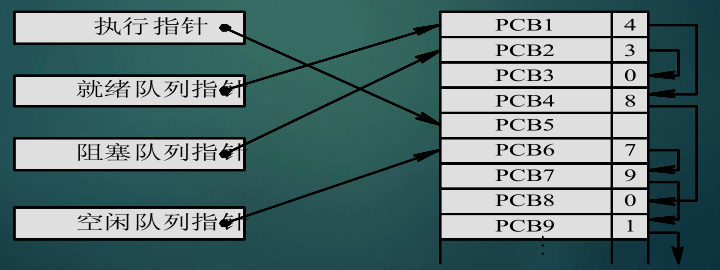
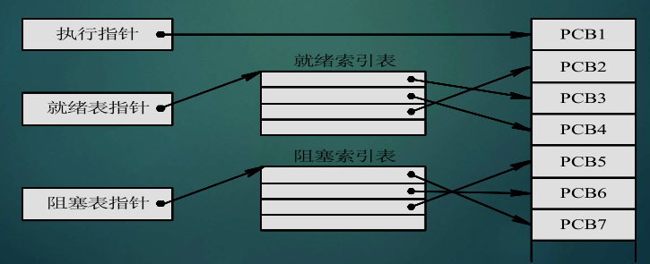
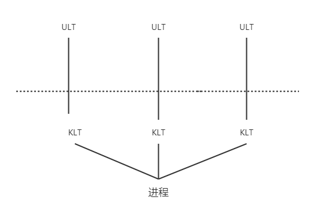
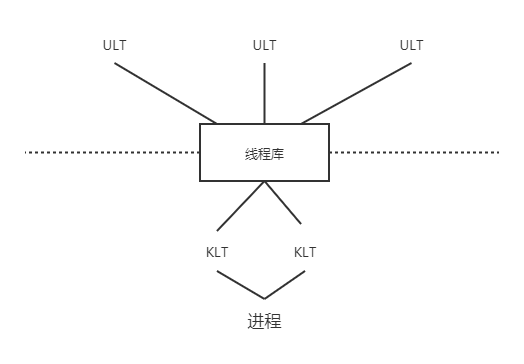
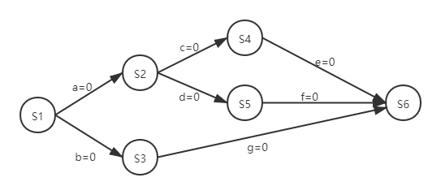
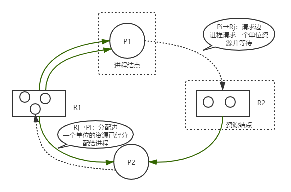
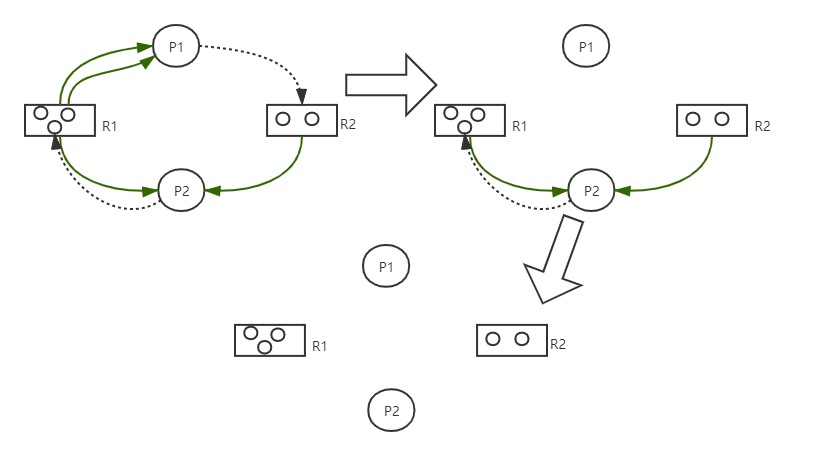
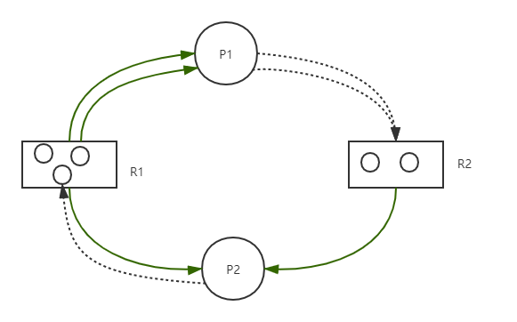

---
tags:
  - 408考研复习
  - 操作系统
---

进程管理
===

## 进程与线程

!!! summary ""
    进程是进程实体的运行过程，是系统进行资源分配和调度的一个独立单位

* 特征

=== "动态性"
    由创建而产生，由调度而执行，由撤销而消亡

=== "并发性"
    进程的重要特征，操作系统的重要特征

=== "独立性"
    独立运行、独立分配资源、独立接受调度

=== "异步性"
    按各自独立、不可预知的速度向前推进

### PCB
为描述和控制进程的运行，系统为每个进程定义了一个数据结构——进程控制块（Process Control Block），OS是根据PCB来对并发执行的进程进行控制和管理的

* <span class="stressed">进程=程序+数据+PCB</span>
* <span class="stressed">PCB是进程存在的唯一标志</span>
* PCB的组织方式

=== "线性方式"
    * 所有 PCB 组织在一张线形表，表的首址放在内存专用区域
    * 实现简单
    * 查找效率低

=== "链接方式"
    

=== "索引方式"
    

### 进程的状态与转换

=== "五状态图"
    ```mermaid
    stateDiagram-v2
        [*]-->创建态
        创建态-->就绪态
        note right of 就绪态
            处理机 ✖
            其他 ✔
        end note
        就绪态-->运行态: CPU调度
        note left of 运行态
            处理机 ✔
            其他 ✔
        end note
        运行态-->终止态
        运行态-->阻塞态:申请资源 请求等待
        note right of 阻塞态
            处理机 ✖
            其他 ✖
        end note
        阻塞态-->就绪态:资源分配 期待的事件发生
        运行态-->就绪态:时间片到
        终止态-->[*]
    ```

=== "七状态图"
    [![7-state](https://mermaid.ink/img/eyJjb2RlIjoic3RhdGVEaWFncmFtLXYyXG4gICAgWypdLS0-5Yib5bu6XG4gICAg5Yib5bu6LS0-5bCx57uqXG4gICAg5Yib5bu6LS0-5bCx57uq5oyC6LW3XG4gICAg5bCx57uq5oyC6LW3LS0-5bCx57uqOua_gOa0u1xuICAgIOWwsee7qi0tPuWwsee7quaMgui1tzrmjILotbdcbiAgICDpmLvloZ7mjILotbctLT7lsLHnu6rmjILotbc65LqL5Lu25Ye6546wXG4gICAg5bCx57uqLS0-6L-Q6KGMXG4gICAg6L-Q6KGMLS0-57uI5q2iXG4gICAg6L-Q6KGMLS0-6Zi75aGeXG4gICAg6L-Q6KGMLS0-5bCx57uq5oyC6LW3XG4gICAg6Zi75aGeLS0-5bCx57uqXG4gICAg6Zi75aGeLS0-6Zi75aGe5oyC6LW3OuaMgui1t1xuICAgIOmYu-WhnuaMgui1ty0tPumYu-Whnjrmv4DmtLtcbiAgICDov5DooYwtLT7lsLHnu6pcbiAgICDnu4jmraItLT5bKl1cbiAgICAgICAgICAgICIsIm1lcm1haWQiOnsidGhlbWUiOiJkZWZhdWx0IiwidGhlbWVWYXJpYWJsZXMiOnsiYmFja2dyb3VuZCI6IndoaXRlIiwicHJpbWFyeUNvbG9yIjoiI0VDRUNGRiIsInNlY29uZGFyeUNvbG9yIjoiI2ZmZmZkZSIsInRlcnRpYXJ5Q29sb3IiOiJoc2woODAsIDEwMCUsIDk2LjI3NDUwOTgwMzklKSIsInByaW1hcnlCb3JkZXJDb2xvciI6ImhzbCgyNDAsIDYwJSwgODYuMjc0NTA5ODAzOSUpIiwic2Vjb25kYXJ5Qm9yZGVyQ29sb3IiOiJoc2woNjAsIDYwJSwgODMuNTI5NDExNzY0NyUpIiwidGVydGlhcnlCb3JkZXJDb2xvciI6ImhzbCg4MCwgNjAlLCA4Ni4yNzQ1MDk4MDM5JSkiLCJwcmltYXJ5VGV4dENvbG9yIjoiIzEzMTMwMCIsInNlY29uZGFyeVRleHRDb2xvciI6IiMwMDAwMjEiLCJ0ZXJ0aWFyeVRleHRDb2xvciI6InJnYig5LjUwMDAwMDAwMDEsIDkuNTAwMDAwMDAwMSwgOS41MDAwMDAwMDAxKSIsImxpbmVDb2xvciI6IiMzMzMzMzMiLCJ0ZXh0Q29sb3IiOiIjMzMzIiwibWFpbkJrZyI6IiNFQ0VDRkYiLCJzZWNvbmRCa2ciOiIjZmZmZmRlIiwiYm9yZGVyMSI6IiM5MzcwREIiLCJib3JkZXIyIjoiI2FhYWEzMyIsImFycm93aGVhZENvbG9yIjoiIzMzMzMzMyIsImZvbnRGYW1pbHkiOiJcInRyZWJ1Y2hldCBtc1wiLCB2ZXJkYW5hLCBhcmlhbCIsImZvbnRTaXplIjoiMTZweCIsImxhYmVsQmFja2dyb3VuZCI6IiNlOGU4ZTgiLCJub2RlQmtnIjoiI0VDRUNGRiIsIm5vZGVCb3JkZXIiOiIjOTM3MERCIiwiY2x1c3RlckJrZyI6IiNmZmZmZGUiLCJjbHVzdGVyQm9yZGVyIjoiI2FhYWEzMyIsImRlZmF1bHRMaW5rQ29sb3IiOiIjMzMzMzMzIiwidGl0bGVDb2xvciI6IiMzMzMiLCJlZGdlTGFiZWxCYWNrZ3JvdW5kIjoiI2U4ZThlOCIsImFjdG9yQm9yZGVyIjoiaHNsKDI1OS42MjYxNjgyMjQzLCA1OS43NzY1MzYzMTI4JSwgODcuOTAxOTYwNzg0MyUpIiwiYWN0b3JCa2ciOiIjRUNFQ0ZGIiwiYWN0b3JUZXh0Q29sb3IiOiJibGFjayIsImFjdG9yTGluZUNvbG9yIjoiZ3JleSIsInNpZ25hbENvbG9yIjoiIzMzMyIsInNpZ25hbFRleHRDb2xvciI6IiMzMzMiLCJsYWJlbEJveEJrZ0NvbG9yIjoiI0VDRUNGRiIsImxhYmVsQm94Qm9yZGVyQ29sb3IiOiJoc2woMjU5LjYyNjE2ODIyNDMsIDU5Ljc3NjUzNjMxMjglLCA4Ny45MDE5NjA3ODQzJSkiLCJsYWJlbFRleHRDb2xvciI6ImJsYWNrIiwibG9vcFRleHRDb2xvciI6ImJsYWNrIiwibm90ZUJvcmRlckNvbG9yIjoiI2FhYWEzMyIsIm5vdGVCa2dDb2xvciI6IiNmZmY1YWQiLCJub3RlVGV4dENvbG9yIjoiYmxhY2siLCJhY3RpdmF0aW9uQm9yZGVyQ29sb3IiOiIjNjY2IiwiYWN0aXZhdGlvbkJrZ0NvbG9yIjoiI2Y0ZjRmNCIsInNlcXVlbmNlTnVtYmVyQ29sb3IiOiJ3aGl0ZSIsInNlY3Rpb25Ca2dDb2xvciI6InJnYmEoMTAyLCAxMDIsIDI1NSwgMC40OSkiLCJhbHRTZWN0aW9uQmtnQ29sb3IiOiJ3aGl0ZSIsInNlY3Rpb25Ca2dDb2xvcjIiOiIjZmZmNDAwIiwidGFza0JvcmRlckNvbG9yIjoiIzUzNGZiYyIsInRhc2tCa2dDb2xvciI6IiM4YTkwZGQiLCJ0YXNrVGV4dExpZ2h0Q29sb3IiOiJ3aGl0ZSIsInRhc2tUZXh0Q29sb3IiOiJ3aGl0ZSIsInRhc2tUZXh0RGFya0NvbG9yIjoiYmxhY2siLCJ0YXNrVGV4dE91dHNpZGVDb2xvciI6ImJsYWNrIiwidGFza1RleHRDbGlja2FibGVDb2xvciI6IiMwMDMxNjMiLCJhY3RpdmVUYXNrQm9yZGVyQ29sb3IiOiIjNTM0ZmJjIiwiYWN0aXZlVGFza0JrZ0NvbG9yIjoiI2JmYzdmZiIsImdyaWRDb2xvciI6ImxpZ2h0Z3JleSIsImRvbmVUYXNrQmtnQ29sb3IiOiJsaWdodGdyZXkiLCJkb25lVGFza0JvcmRlckNvbG9yIjoiZ3JleSIsImNyaXRCb3JkZXJDb2xvciI6IiNmZjg4ODgiLCJjcml0QmtnQ29sb3IiOiJyZWQiLCJ0b2RheUxpbmVDb2xvciI6InJlZCIsImxhYmVsQ29sb3IiOiJibGFjayIsImVycm9yQmtnQ29sb3IiOiIjNTUyMjIyIiwiZXJyb3JUZXh0Q29sb3IiOiIjNTUyMjIyIiwiY2xhc3NUZXh0IjoiIzEzMTMwMCIsImZpbGxUeXBlMCI6IiNFQ0VDRkYiLCJmaWxsVHlwZTEiOiIjZmZmZmRlIiwiZmlsbFR5cGUyIjoiaHNsKDMwNCwgMTAwJSwgOTYuMjc0NTA5ODAzOSUpIiwiZmlsbFR5cGUzIjoiaHNsKDEyNCwgMTAwJSwgOTMuNTI5NDExNzY0NyUpIiwiZmlsbFR5cGU0IjoiaHNsKDE3NiwgMTAwJSwgOTYuMjc0NTA5ODAzOSUpIiwiZmlsbFR5cGU1IjoiaHNsKC00LCAxMDAlLCA5My41Mjk0MTE3NjQ3JSkiLCJmaWxsVHlwZTYiOiJoc2woOCwgMTAwJSwgOTYuMjc0NTA5ODAzOSUpIiwiZmlsbFR5cGU3IjoiaHNsKDE4OCwgMTAwJSwgOTMuNTI5NDExNzY0NyUpIn19LCJ1cGRhdGVFZGl0b3IiOmZhbHNlfQ)](https://mermaid-js.github.io/mermaid-live-editor/#/edit/eyJjb2RlIjoic3RhdGVEaWFncmFtLXYyXG4gICAgWypdLS0-5Yib5bu6XG4gICAg5Yib5bu6LS0-5bCx57uqXG4gICAg5Yib5bu6LS0-5bCx57uq5oyC6LW3XG4gICAg5bCx57uq5oyC6LW3LS0-5bCx57uqOua_gOa0u1xuICAgIOWwsee7qi0tPuWwsee7quaMgui1tzrmjILotbdcbiAgICDpmLvloZ7mjILotbctLT7lsLHnu6rmjILotbc65LqL5Lu25Ye6546wXG4gICAg5bCx57uqLS0-6L-Q6KGMXG4gICAg6L-Q6KGMLS0-57uI5q2iXG4gICAg6L-Q6KGMLS0-6Zi75aGeXG4gICAg6L-Q6KGMLS0-5bCx57uq5oyC6LW3XG4gICAg6Zi75aGeLS0-5bCx57uqXG4gICAg6Zi75aGeLS0-6Zi75aGe5oyC6LW3OuaMgui1t1xuICAgIOmYu-WhnuaMgui1ty0tPumYu-Whnjrmv4DmtLtcbiAgICDov5DooYwtLT7lsLHnu6pcbiAgICDnu4jmraItLT5bKl1cbiAgICAgICAgICAgICIsIm1lcm1haWQiOnsidGhlbWUiOiJkZWZhdWx0IiwidGhlbWVWYXJpYWJsZXMiOnsiYmFja2dyb3VuZCI6IndoaXRlIiwicHJpbWFyeUNvbG9yIjoiI0VDRUNGRiIsInNlY29uZGFyeUNvbG9yIjoiI2ZmZmZkZSIsInRlcnRpYXJ5Q29sb3IiOiJoc2woODAsIDEwMCUsIDk2LjI3NDUwOTgwMzklKSIsInByaW1hcnlCb3JkZXJDb2xvciI6ImhzbCgyNDAsIDYwJSwgODYuMjc0NTA5ODAzOSUpIiwic2Vjb25kYXJ5Qm9yZGVyQ29sb3IiOiJoc2woNjAsIDYwJSwgODMuNTI5NDExNzY0NyUpIiwidGVydGlhcnlCb3JkZXJDb2xvciI6ImhzbCg4MCwgNjAlLCA4Ni4yNzQ1MDk4MDM5JSkiLCJwcmltYXJ5VGV4dENvbG9yIjoiIzEzMTMwMCIsInNlY29uZGFyeVRleHRDb2xvciI6IiMwMDAwMjEiLCJ0ZXJ0aWFyeVRleHRDb2xvciI6InJnYig5LjUwMDAwMDAwMDEsIDkuNTAwMDAwMDAwMSwgOS41MDAwMDAwMDAxKSIsImxpbmVDb2xvciI6IiMzMzMzMzMiLCJ0ZXh0Q29sb3IiOiIjMzMzIiwibWFpbkJrZyI6IiNFQ0VDRkYiLCJzZWNvbmRCa2ciOiIjZmZmZmRlIiwiYm9yZGVyMSI6IiM5MzcwREIiLCJib3JkZXIyIjoiI2FhYWEzMyIsImFycm93aGVhZENvbG9yIjoiIzMzMzMzMyIsImZvbnRGYW1pbHkiOiJcInRyZWJ1Y2hldCBtc1wiLCB2ZXJkYW5hLCBhcmlhbCIsImZvbnRTaXplIjoiMTZweCIsImxhYmVsQmFja2dyb3VuZCI6IiNlOGU4ZTgiLCJub2RlQmtnIjoiI0VDRUNGRiIsIm5vZGVCb3JkZXIiOiIjOTM3MERCIiwiY2x1c3RlckJrZyI6IiNmZmZmZGUiLCJjbHVzdGVyQm9yZGVyIjoiI2FhYWEzMyIsImRlZmF1bHRMaW5rQ29sb3IiOiIjMzMzMzMzIiwidGl0bGVDb2xvciI6IiMzMzMiLCJlZGdlTGFiZWxCYWNrZ3JvdW5kIjoiI2U4ZThlOCIsImFjdG9yQm9yZGVyIjoiaHNsKDI1OS42MjYxNjgyMjQzLCA1OS43NzY1MzYzMTI4JSwgODcuOTAxOTYwNzg0MyUpIiwiYWN0b3JCa2ciOiIjRUNFQ0ZGIiwiYWN0b3JUZXh0Q29sb3IiOiJibGFjayIsImFjdG9yTGluZUNvbG9yIjoiZ3JleSIsInNpZ25hbENvbG9yIjoiIzMzMyIsInNpZ25hbFRleHRDb2xvciI6IiMzMzMiLCJsYWJlbEJveEJrZ0NvbG9yIjoiI0VDRUNGRiIsImxhYmVsQm94Qm9yZGVyQ29sb3IiOiJoc2woMjU5LjYyNjE2ODIyNDMsIDU5Ljc3NjUzNjMxMjglLCA4Ny45MDE5NjA3ODQzJSkiLCJsYWJlbFRleHRDb2xvciI6ImJsYWNrIiwibG9vcFRleHRDb2xvciI6ImJsYWNrIiwibm90ZUJvcmRlckNvbG9yIjoiI2FhYWEzMyIsIm5vdGVCa2dDb2xvciI6IiNmZmY1YWQiLCJub3RlVGV4dENvbG9yIjoiYmxhY2siLCJhY3RpdmF0aW9uQm9yZGVyQ29sb3IiOiIjNjY2IiwiYWN0aXZhdGlvbkJrZ0NvbG9yIjoiI2Y0ZjRmNCIsInNlcXVlbmNlTnVtYmVyQ29sb3IiOiJ3aGl0ZSIsInNlY3Rpb25Ca2dDb2xvciI6InJnYmEoMTAyLCAxMDIsIDI1NSwgMC40OSkiLCJhbHRTZWN0aW9uQmtnQ29sb3IiOiJ3aGl0ZSIsInNlY3Rpb25Ca2dDb2xvcjIiOiIjZmZmNDAwIiwidGFza0JvcmRlckNvbG9yIjoiIzUzNGZiYyIsInRhc2tCa2dDb2xvciI6IiM4YTkwZGQiLCJ0YXNrVGV4dExpZ2h0Q29sb3IiOiJ3aGl0ZSIsInRhc2tUZXh0Q29sb3IiOiJ3aGl0ZSIsInRhc2tUZXh0RGFya0NvbG9yIjoiYmxhY2siLCJ0YXNrVGV4dE91dHNpZGVDb2xvciI6ImJsYWNrIiwidGFza1RleHRDbGlja2FibGVDb2xvciI6IiMwMDMxNjMiLCJhY3RpdmVUYXNrQm9yZGVyQ29sb3IiOiIjNTM0ZmJjIiwiYWN0aXZlVGFza0JrZ0NvbG9yIjoiI2JmYzdmZiIsImdyaWRDb2xvciI6ImxpZ2h0Z3JleSIsImRvbmVUYXNrQmtnQ29sb3IiOiJsaWdodGdyZXkiLCJkb25lVGFza0JvcmRlckNvbG9yIjoiZ3JleSIsImNyaXRCb3JkZXJDb2xvciI6IiNmZjg4ODgiLCJjcml0QmtnQ29sb3IiOiJyZWQiLCJ0b2RheUxpbmVDb2xvciI6InJlZCIsImxhYmVsQ29sb3IiOiJibGFjayIsImVycm9yQmtnQ29sb3IiOiIjNTUyMjIyIiwiZXJyb3JUZXh0Q29sb3IiOiIjNTUyMjIyIiwiY2xhc3NUZXh0IjoiIzEzMTMwMCIsImZpbGxUeXBlMCI6IiNFQ0VDRkYiLCJmaWxsVHlwZTEiOiIjZmZmZmRlIiwiZmlsbFR5cGUyIjoiaHNsKDMwNCwgMTAwJSwgOTYuMjc0NTA5ODAzOSUpIiwiZmlsbFR5cGUzIjoiaHNsKDEyNCwgMTAwJSwgOTMuNTI5NDExNzY0NyUpIiwiZmlsbFR5cGU0IjoiaHNsKDE3NiwgMTAwJSwgOTYuMjc0NTA5ODAzOSUpIiwiZmlsbFR5cGU1IjoiaHNsKC00LCAxMDAlLCA5My41Mjk0MTE3NjQ3JSkiLCJmaWxsVHlwZTYiOiJoc2woOCwgMTAwJSwgOTYuMjc0NTA5ODAzOSUpIiwiZmlsbFR5cGU3IjoiaHNsKDE4OCwgMTAwJSwgOTMuNTI5NDExNzY0NyUpIn19LCJ1cGRhdGVFZGl0b3IiOmZhbHNlfQ)

* 挂起操作：暂时不执行的进程会被调到外存从而转为“挂起态”

### 进程控制
进程控制是指：进程的创建、终止，进程状态转换的控制，是由操作系统内核中的原语实现的

* 原语在执行期间是不可分割的，一个操作中的所有动作要么全做，要么全不做。

=== "创建"

    * 调用进程创建原语`create()`

    ```mermaid
    graph LR
    D(start)-->E[申请空白PCB]
    E -->|申请不到| B(出错)
    E -->|申请到|F[申请内存空间]
    F -->|申请不到| B(出错)
    F -->|申请到|G[装入程序和数据]
    G -->H[分配其他资源]
    H -->I[填写PCB的相关项]
    I -->A[将PCB链入就绪队列]
    A -->C(end)
    ```

=== "终止"

    !!! summary "引起进程终止(Termination of Process)的事件"
        1. 正常结束
        2. 异常结束： 越界错误、保护错、非法指令、特权指令错、运行超时、等待超时、算术运算错、I/O故障
        3. 外界干预： 操作员或操作系统干预（如死锁）、父进程请求、父进程中止

    * 根据被终止进程的标识符，从PCB集合中检索出该进程的PCB，从中读出该进程的状态
    * 若被终止进程正处于执行状态，应立即终止该进程的执行，并置调度标志为真，用于指示该进程被终止后应重新进行调度
    * 若该进程还有子孙进程，还应将其所有子孙进程予以终止，以防他们成为不可控的进程
    * 将被终止进程所拥有的全部资源，或者归还给其父进程，或者归还给系统
    * 将被终止进程(它的PCB)从所在队列(或链表)中移出

=== "阻塞与唤醒"

    !!! summary "引起进程阻塞与唤醒的事件"
        1. 请求系统服务
        2. 启动某种操作
        3. 新数据尚未到达
        4. 无新工作可做

    * 正在执行的进程，当发现上述某事件时，由于无法继续执行，于是进程便通过调用阻塞原语`block()`把自己阻塞
        1. 立即停止执行，把进程控制块中的现行状态由“执行”改为阻塞
        2. 将PCB插入阻塞队列
        3. 转调度程序进行重新调度，将处理机分配给另一就绪进程，并进行切换

    * 当被阻塞进程所期待的事件出现时，则由有关进程调用唤醒原语`wakeup()`，将等待该事件的进程唤醒
        1. 把被阻塞的进程从阻塞队列中移出
        2. 将其PCB中的现行状态由阻塞改为就绪
        3. 然后再将该PCB插入到就绪队列中

=== "挂起"
    * 当出现了引起进程挂起的事件时，系统将利用挂起原语`suspend()`将指定进程挂起。
        1. 检查被挂起进程的状态，活动就绪改为静止就绪；活动阻塞改为静止阻塞。
        2. 把该进程的PCB复制到指定内存区域。
        3. 若被挂起的进程正在执行，则转向调度程序重新调度。

=== "激活"
    * 当发生激活进程的事件时，系统将利用激活原语`active()`将指定进程激活
        1. 将进程从外存调入内存，检查其现行状态，静止就绪改为活动就绪；静止阻塞改为活动阻塞
        2. 假如采用的是抢占调度策略，则每当有新进程进入就绪队列时，应检查是否要进行重新调度

### 进程通信

!!! summary ""
    进程通信是指进程之间的信息交换。 (各进程为了保持联系而换信息)

=== "共享存储"
    进程之间通过共享某些数据结构或存储区实现信息传送，有两种类型：

    1. 基于共享数据结构的通信方式（属于低级通信）
    2. 基于共享存储区的通信方式（传输大量数据，属于高级通信）

=== "管道通信"
    所谓“管道”，是指用于连接一个读进程和一个写进程以实现他们之间通信的一个共享文件，又名pipe文件；

    * 向管道提供输入的发送进程(即写进程) ，以字符流形式将大量的数据送入管道；而接收进程(即读进程)，可从管道中接收数据
    * 管道机制必须提供的协调能力：互斥、同步、确定对方是否存在
    * 一段时间内，一个管道内只能单向传输

=== "消息传递"
    系统提供发送消息 `Send(message)`与接收消息 `Receive(message)` 两个操作，进程间则通过使用这两个操作进行通讯，无需共享任何变量

    * 根据实现方式的不同分成直接通信方式和间接通信方式两种

    === "直接消息传递系统"
        * 发送进程利用OS所提供的发送命令，直接把消息发送给目标进程
        * 要求发送进程和接收进程都以显式方式提供对方的标识符
        * 系统提供下述两条通信命令(原语)：
            - `Send(Receiver, message)`
            - `Receive(Sender, message)`
        * 消息的组成：消息头（控制信息）+消息正文（实际数据）

    === "间接消息传递系统（信箱通信）"
        * 进程不把消息直接发给接收者进程，而把消息放在某个双方约定的信箱中
        * 系统提供若干原语，分别用于信箱的创建、撤销和消息的发送、接收
        * 信箱分为以下三类

            === "私用信箱"
                用户进程可为自己建立一个新信箱，并作为该进程的一部分。信箱的拥有者有权从信箱中读取消息，其他用户则只能将自己构成的消息发送到该信箱中。

            === "公用信箱"
                它由操作系统创建，并提供给系统中的所有核准进程使用。核准进程既可把消息发送到该信箱中，也可从信箱中读取发送给自己的消息。

            === "共享信箱"
                它由某进程创建，在创建时或创建后，指明它是可共享的，同时须指出共享进程(用户)的名字。信箱的拥有者和共享者，都有权从信箱中取走发送给自己的消息。

### 线程

!!! summary ""
    引入进程，是为了使多个程序能并发执行，以提高资源利用率和系统吞吐量；引入线程，是为了减少程序在并发执行时的时空开销，使OS有更好的并行性。

* 线程是进程内一个相对独立的、可调度的执行单元，是处理机调度的基本单位。
* 对于多线程机制而言，一个进程可以有多个线程
    - 这些线程共享该进程资源

* 线程的状态

    - 线程状态间的转换和[进程状态间的转换](#_3)是一样的

    === "执行"
        线程已获得处理机而正在运行

    === "就绪"
        线程已具备了各种执行条件，只需再获得CPU便可立即执行

    === "阻塞"
        线程在执行中因某事件受阻而处于暂停状态

* 线程控制块TCB
    * 系统为每一个线程配置了线程控制块TCB，将所有用于控制和管理线程的信息记录在线程控制块中。包含以下信息：

    === "线程标识符"
        为每个线程赋予一个唯一的线程标识符

    === "一组寄存器"
        包括程序计数器PC、状态寄存器和通用寄存器的内容

    === "线程运行状态"
        描述线程正处于何种运行状态

    === "优先级"
        描述线程执行的优先程度

    === "线程专有存储区"
        用于线程切换时存放现场保护信息和与该线程相关的统计信息等

    === "信号屏蔽"
        对某些信号加以屏蔽

    === "堆栈指针"
        在堆栈中，保存局部变量和返回地址，同时在TCB中设立指向用户自己堆栈的指针和指向核心栈的指针

* 线程实现

=== "内核支持线程KST"
    无论用户进程中的线程，还是系统进程中的线程，其创建、撤销和切换都依靠内核，在内核空间通过系统调用实现

=== "用户级线程ULT"
    用户级线程仅在用户空间中，与内核无关，所有对线程的操作(创建、撤销、同步、互斥等)也在用户空间中由线程库的函数（过程）完成，而无需内核帮助

=== "组合方式"
    内核支持多个内核支持线程的建立、调度和管理，同时，也允许用户应用程序建立、调度和管理用户级线程

    === "多对一模型"
        将许多用户级线程映射到一个内核线程

        

    === "一对一模型"
        将每一个用户级线程映射到一个内核线程

        

    === "多对多模型"
        多路复用了很多用户级线程到同样数量或更小数量的内核线程上

        

## 处理机调度

!!! summary ""
    在多道程序系统中，调度的实质是一种资源分配

??? faq "什么时候发生调度？"
    运行进程主动或被动放弃处理机

??? faq "什么时候不发生调度？"
    1. 处理中断
    2. 操作系统内核程序临界区
    3. 原子操作

* 层次

!!! summary "三种调度层次的比较"
    |调度类型|运行频率|运行时间|算法复杂性|
    |:--:|:--:|:--:|:--:|
    |低级调度|高|短|低|
    |中级调度|中等|较短|中等|
    |高级调度|低|长|高|

=== "高级调度"
    也称宏观（作业）调度，决定哪些程序可以进入系统

    * 作业（JOB）是用户在一次算题过程中或一次事务处理中，要求计算机系统所做的工作的集合
    * 作业不仅包含了通常的程序和数据，而且还配有一份作业说明书
    * 作业控制块JCB是一个作业在系统中存在的惟一标志，包含了对作业进行管理的必要信息
    * 作业运行的三个阶段和三种状态
        * 收容阶段：后备状态
        * 运行阶段：运行状态
        * 完成阶段：完成状态

=== "中级调度"
    也称内存调度，决定内存中程序的位置和状态

=== "低级调度"
    也称微观（进程）调度，决定 CPU 资源在就绪进程间的分配

    * 进程调度机制

    === "排队器"
        将就绪进程按一定方式排成队列

    === "分派器"
        把进程调度程序选定的进程，从就绪队列中取出，进行上下文切换，把处理器分配给它

    === "上下文切换器"
        * 保存当前进程上下文，装入分派程序上下文，分派程序运行
        * 移出分派程序，装入新选进程上下文

    * 进程调度方式

    === "非抢占方式"
        一旦处理机分配，便让进程一直执行，直至该进程完成或发生某事件而被阻塞时，才再把处理机分配给其它进程

        !!! summary "该情况下可能引起进程调度的因素"
            * 正在执行的进程执行完毕，或因发生某事件而不能再继续执行
            * 执行中的进程因提出 I/O 请求而暂停执行
            * 在进程通信或同步过程中执行了某种原语操作，如P操作(wait 操作)、 Block 原语、Wakeup

        !!! success ""
            实现简单、系统开销小，适用于大多数的批处理系统环境

        !!! fail ""
            难于满足需要立即执行的紧急任务，在要求比较严格的实时系统中不宜采用

    === "抢占方式"
        允许调度程序停止正在执行的进程，将已分配给该进程的处理机，重新分配给另一进程

        * 抢占的原则有时间片原则、优先权原则、短作业(进程)优先原则

        !!! success ""
            可防止长进程长时间占有处理机，为多数进程提供公平服务

        !!! fail ""
            系统开销较大

* 实时调度

<!--非考研内容，待填坑-->

### 调度算法的指标

=== "CPU利用率"

    $$
    \begin{align}
    \operatorname{CPU利用率}  & = \frac{t_{有效}}{t_总} \\
    t_总 & = t_{有效}+t_{空闲}
    \end{align}
    $$

=== "周转时间"
    从作业提交给系统开始，到作业完成为止的这段时间间隔，包括：

    1. 作业在外存后备队列上等待(作业) 调度的时间
    2. 进程在就绪队列上等待进程调度的时间
    3. 进程在 CPU 上执行的时间
    4. 等待I/O 操作完成的时间

    $$
    \begin{align}
    平均周转时间T & = \frac{1}{n}[\sum_{i=1}^{n}T_i ] \\
    若系统为作业提供的实际服务时间为&T_s，W=\frac {T}{T_s}称为带权周转时间，则\\
    平均带权周转时间W & = \frac{1}{n}[\sum_{i=1}^{n}\frac{T_i}{T_{si}}]
    \end{align}
    $$

=== "系统吞吐量"
    单位时间内所完成的作业数

=== "响应时间"
    从用户通过键盘提交一个请求开始，直至系统首次产生响应为止的时间，包括：

    1. 从键盘输入的请求信息传送到处理机的时间
    2. 处理机对请求信息进行处理的时间
    3. 将所形成的响应回送到终端显示器的时间

### 典型的调度算法

=== "FCFS(先来先服务)"
    每次调度都是选择一个或多个最先进入队列的作业或进程，为它们分配资源，创建进程或分配CPU，使之投入运行。

    * 既可用于作业调度，也可用于进程调度
    * 特点
        * 作业调度和进程调度均可，最简单，本质上属非剥夺方式
        * 有利于长作业/进程，不利于短作业
        * 有利于CPU 繁忙型的作业(如通常的科学计算)，而不利于I/O 繁忙的作业/进程（如大多数的事务处理)

=== "SJF(短作业优先)/SPF(短进程优先)"
    短作业(进程)优先调度算法 SJ(P)F，是指对短作业或短进程优先调度的算法。分别用于作业调度和进程调度

    * 以作业或进程的长短计算优先级，作业或进程越短，优先级越高
    * 特点
        * SJ(P)F 调度算法有利于短作业，与 FCFS 算法相比，大大降低短作业的周转时间，平均周转时间短，系统吞吐量高
        * SJ(P)F 调度算法对长作业不利。甚至可能导致长作业(进程)长期不被调度，发生“饥饿”现象
        * 该算法完全未考虑作业的紧迫程度，因而不能保证紧迫性作业(进程)会被及时处理
        * 此外，由于作业(进程)的长短只是根据用户所提供的估计执行时间而定的，而用户又可能会有意或无意地缩短其作业的估计运行时间，致使该算法不一定能真正做到短作业优先调度

=== "RR(时间片轮转)"
    就绪进程按照先来先服务策略排成一个队列，每次调度时将CPU分配给队首进程，并令其执行一个时间片，当执行时间片用完时，停止该进程的执行，并将其送往就绪队列的末尾，然后把处理机分配给就绪队列新的队首，令其执行一个时间片……如此循环，直至时间片用完即可

    * 分时系统普遍采用
    * 何时切换进程：时间片用完；或者时间片未用完，且正在运行的进程已完成
    * 确定时间片大小：略大于一次典型的交互所需要的时间

=== "PSA(优先级)"
    按照进程的优先级大小来调度，使高优先级进程得到优先的处理的高度策略称为优先级调度算法

    * 既可用于作业调度，也可用于进程调度

    === "非抢占式优先级调度法"
        一旦某个高优先级的进程占有了处理机，就一直运行下去，直到由于其自身的原因而主动让出处理机时(任务完成或等待事件)才让另一高优先级进程运行

    === "抢占式优先级调度法"
        任何时刻都严格按照高优先级进程在处理机上运行的原则进行进程的调度

    * 优先权的确定

    === "静态优先级"
        静态优先权是在创建进程时确定的，且在进程的整个运行期间保持不变

        * 确定进程优先权的依据有如下三个方面

        === "进程类型"
            通常系统进程的优先级高于一般用户进程的优先级

        === "进程对资源的需求"
            对资源要求少的进程应赋予较高的优先级

        === "用户要求"
            根据进程的紧迫程度及用户所付费用的多少确定优先级

    === "动态优先级"
        在创建进程时所赋予的优先权，是可以随进程的推进或随其等待时间的增加而改变的，以便获得更好的调度性能。

=== "HRRN(高响应比优先)"
    短作业优先算法的不足之处是长作业的运行得不到保证，为每个作业引入动态优先权，使长作业在等待一段时间后，有机会分配到处理机

    $$
    优先级 = R_p = \frac {等待时间+要求服务时间}{要求服务时间}=\frac{响应时间}{要求服务时间}
    $$

    * 特点
        * 如果作业的等待时间相同，则要求服务的时间愈短，其优先权愈高，因而该算法有利于短作业。
        * 当要求服务的时间相同时，作业的优先权决定于其等待时间，等待时间愈长，其优先权愈高，因而它实现的是先来先服务。
        * 对于长作业，作业的优先级可以随等待时间的增加而提高，当其等待时间足够长时，其优先级便可升到很高，从而也可获得处理机

=== "多队列及多级反馈队列"

    === "多队列"
        设置多个就绪队列，不同队列采用不同算法

        * 同一队列不同进程可设置不同优先级
        * 不同队列也可设置不同优先级
        * 调度策略灵活
        * 对多处理机系统能很好支持

    === "多级反馈队列"
        设置多个就绪队列，每个队列赋予不同的优先级。队列按FCFS原则排列，各队列时间片不同

        * 当一个新进程进入内存后，首先放在第一队列尾，按FCFS原则调度；如果该时间片内未结束，转入第二队队列尾；直到最后的第N队列，在第N队列采取按时间片轮转方式调度
        * 仅当第 `i` 队列空闲时，才调度第`i+1`队列
        * 如有新进程进入优先级较高的队列，则剥夺CPU执行新进程，旧进程放入原队列尾
        * 不必事先知道各进程所需执行时间，可满足各种进程需要，是目前被公认较好的调度算法

## 同步与互斥
* 进程同步
    * 并发性带来了异步性，有时需要通过进程同步解决这种异步问题。有的进程之间需要相互配合完成工作，各进程的工作推进需要遵循一定的先后顺序。
* 进程互斥
    * 对临界资源（只能排它使用的资源）的访问需要互斥的进行，同一时间段内只能允许一个进程访问该资源。

    ```text
    do{
        entry section; //进入区，检查并上锁
        critical section; //临界区，访问临界资源
        exit section; //退出区，解锁
        remainder section; //剩余区，其余代码部分
    }while(true);
    ```

    * 同步机制原则

        === "空闲让进"
            临界区空闲时，应允许一个进程访问。

        === "忙则等待"
            临界区忙碌时，其他试图访问的进程需等待。

        === "有限等待"
            要在有限的时间内进入临界区，保证不会饥饿。

        === "让权等待"
            进程不能进入临界区时，应释放处理机，防止忙等。

    * 互斥机制的实现

        === "软件"

            === "单标志法"
                访问完临界区后把使用临界区的权限交给另外一个进程，在进入区只检查不上锁

                ```c
                int turn = 0; //表示当前允许进入临界区的进程号

                /* P0 */
                while(turn!=0);
                critical section;  //临界区
                turn=1;
                remainder section; //剩余区

                /* P1 */
                while(turn!=1);
                critical section;  //临界区
                turn=0;
                remainder section; //剩余区
                ```

                !!! danger ""
                    违反“空闲让进”原则

            === "双标志先检查"
                在进入区先检查后上锁，退出区解锁<!--linenums="1" hl_lines="4 5 11 12"-->

                ``` c
                bool flag[2]; //flag[i]表示当前进程是否想进入临界区

                /* P0 */
                while(flag[1]);
                flag[0]=true;
                critical section;  //临界区
                flag[0]=false;
                remainder section; //剩余区

                /* P1 */
                while(flag[0]);
                flag[1]=true;
                critical section;  //临界区
                flag[1]=false;
                remainder section; //剩余区
                ```

                !!! danger ""
                    违反“忙则等待”原则

            === "双标志后检查"
                在进入区先上锁后检查，退出区解锁<!--linenums="1" hl_lines="4 5 11 12"-->

                ``` c
                bool flag[2]; //flag[i]表示当前进程是否想进入临界区

                /* P0 */
                flag[0]=true;
                while(flag[1]);
                critical section;  //临界区
                flag[0]=false;
                remainder section; //剩余区

                /* P1 */
                flag[1]=true;
                while(flag[0]);
                critical section;  //临界区
                flag[1]=false;
                remainder section; //剩余区
                ```

                !!! danger ""
                    违反“空闲让进”和“有限等待”原则，可能导致饥饿

            === "Peterson算法"
                在进入区主动争取——主动谦让——检查对方是否想进、己方是否谦让<!--linenums="1" hl_lines="4 5 6 12 13 14"-->

                ``` c
                bool flag[2]; //flag[i]表示当前进程是否想进入临界区
                int turn = 0; //表示当前允许进入临界区的进程号
                /* P0 */
                flag[0]=true;
                turn=1;
                while(flag[1]&&turn==1);
                critical section;  //临界区
                flag[0]=false;
                remainder section; //剩余区

                /* P1 */
                flag[1]=true;
                turn = 0;
                while(flag[0]&&turn==0);
                critical section;  //临界区
                flag[1]=false;
                remainder section; //剩余区
                ```

                !!! danger ""
                    违反“让权等待”原则，可能导致忙等

        === "硬件"

            === "中断屏蔽法"
                进入测试之前关闭中断，完成测试直至上锁之后才能打开中断

                !!! danger ""
                    不适用于多处理机，不适用于用户进程

            === "TestAndSet(TS/TSL指令)"
                为每类临界区设置一把锁。在程序中锁可以用一个变量`lock`来表示

                ```c
                /* C语言逻辑 */
                bool TestAndSet(bool *lock){
                    bool old;
                    old = *lock;
                    *lock = true;
                    return old;
                }

                while(TestAndSet(&lock));
                临界区代码
                lock=false;
                剩余区代码
                ```

                !!! success ""
                    可以用于多处理机环境

                !!! danger ""
                    不满足让权等待

            === "Swap指令(XCHG/Exchange指令)"
                利用Swap实现进程互斥时，可为临界资源设置一个全局布尔变量`lock`，其初值为`false`，在每个进程中再利用一个局部布尔变量`key`。

                ```c
                /* C语言逻辑 */
                void swap(bool *a,bool *b)
                {
                    bool temp;
                    temp = *a;
                    *a = *b;
                    *b = temp;
                }

                bool old = true;
                while(old==true) swap(&lock,&old);
                临界区代码
                lock = false;
                剩余区代码
                ```

                !!! danger ""
                    违背了“让权等待”原则

### 信号量
信号量机制是荷兰计算机科学家Dijkstra于1965年提出的一种卓有成效的进程同步工具。

```c
/**/
wait(s);
use the resource;
signal(s);
/**/
```

=== "整型信号量"
    最初Dijkstra把整型信号量定义为一个整型量，除初始化外，仅能通过两个标准的原子操作(Atomic Operation) `wait(S)`和`signal(S)`来访问，这两个操作一直被分别称为P、V操作。这个整型量的值表示资源的数量

    ??? faq "为什么称为PV操作"
        来自荷兰语 passeren(通过)和vrijgeven(释放)

    ```c
    /* P operation */
    void wait(int S)
    {
        while(S<=0);
        S--;
    }
    /* V operation */
    void signal(int S)
    {
        S++;
    }
    ```

    !!! bug ""
        wait操作，只要信号量`S`≤0，就会不断测试，忙等，违背让权等待。

=== "记录型信号量"

    ```c
    typedef struct{
        int value;  //剩余资源数，<0时，其绝对值表示处在等待状态的进程数量
        struct process *L;  //等待队列
    }semaphore;

    /* P operation */
    void wait(semaphore S)
    {
        S.value--;
        if(S.value<0){
            block(S.L); //运行态→阻塞态
        }
    }
    /* V operation */
    void signal(int S)
    {
        S.value++;
        if(S.value<=0){
            wakeup(S.L); //唤醒等待列表中第一个进程，使其从阻塞态进入就绪态
        }
    }
    ```

    !!! bug ""
        会出现多个进程等待访问同一临界资源的问题

* 信号量的使用

=== "互斥"
    为使多个进程能互斥地访问某临界资源，只需为该资源设置一互斥信号量`mutex`，并设其初始值为1，表示无进程进入自己的临界区。然后将各进程的临界区置于`wait(mutex)`和`signal(mutex)`操作之间即可

    * 不同的临界资源需要使用不同的互斥信号量
    * 互斥信号量初始值为1

    ```c
    wait(mutex);
    critical section
    signal(mutex);
    remainder section
    ```

    !!! warning ""
        PV操作需要在每一个进程中成对使用，且P操作在V操作的前面

    !!! failure ""
        缺少wait，系统混乱；缺少signal，资源永不释放

=== "同步"
    让并发进程按要求有序的推进

    * 同步信号量初值为0

    ```c
    /* 保证代码4在代码2之后执行 */
    P1(){
        代码1;
        代码2;
        V(S);
        代码3;
    }

    P2(){
        P(S);
        代码4;
        代码5;
        代码6;
    }
    ```

    !!! summary ""
        在“前操作”之后执行V操作；在“后操作”之前执行P操作

=== "前趋关系"
    分析问题，画出前驱图，把每一对前驱关系看成一个同步问题

    

    === "P1"
        ```c
        /* ... */
        S1;
        V(a);
        V(b);
        /* ... */
        ```

    === "P2"
        ```c
        /* ... */
        P(a);
        S2;
        V(c);
        V(d);
        /* ... */
        ```

    === "P3"
        ```c
        /* ... */
        P(b);
        S3;
        V(g);
        /* ... */
        ```

    === "P4"
        ```c
        /* ... */
        P(c);
        S4;
        V(e);
        /* ... */
        ```

    === "P5"
        ```c
        /* ... */
        V(d);
        S5;
        V(f);
        /* ... */
        ```

    === "P6"
        ```c
        /* ... */
        P(e);
        P(f);
        P(g);
        /* ... */
        ```

### 管程

!!! note ""
    引入管程，是为了解决信号量机制编程麻烦、易出错的问题

* 管程是由局部于自己的若干公共变量及其说明和所有访问这些公共变量的过程所组成的软件模块
    * 管程由四部分组成，包括管程的名称、局部于管程的共享数据结构说明、对该数据结构操作的一组过程和对局部于管程的共享数据设置初始值的语句
* 管程包含了面向对象的思想（封装——管程内的数据结构具体实现对外不可见，外部线程需要通过管程提供的特定“入口”操作共享数据），且确保每次仅有一个过程进入管程
* 使用管程解决生产者——消费者问题

    ```
    monitor ProducerConsumer
      condition full,empty;
      int count = 0; // 可用产品数
      void insert(Item item){
        if(count==N) wait(full);
        count++;
        insert_item(item);
        if(count==1) signal(empty);
      }
      Item remove(){
        if(count==0) wait(empty);
        count--;
        if(count==N-1) signal(full);
        return remove_item();
      }
      /* ... */
    end monitor;

    /* 生产者进程 */
    producer(){
      while(1){
        item = produce_item();
        ProducerConsumer.insert(item);
      }
    }
    /* 消费者进程 */
    consumer(){
      while(1){
        item = ProducerConsumer.remove();
        consume_item();
      }
    }
    ```

* 各进程互斥访问管程的特性是由编译器实现的
* Java关键字：`#!java sychronized`
    * 可用来给对象和方法或者代码块加锁，当它锁定一个方法或者一个代码块的时候，同一时刻最多只有一个线程执行这段代码。当两个并发线程访问同一个对象object中的这个加锁同步代码块时，一个时间内只能有一个线程得到执行。另一个线程必须等待当前线程执行完这个代码块以后才能执行该代码块

### 经典同步问题

=== "生产者-消费者问题"

    !!! summary "描述"
        有一个有限空间的共享缓冲区，负责存放货物；生产者向缓冲区中放物品，缓冲区满则不能放；消费者从缓冲区中拿物品，缓冲区空则不能拿。

    * 缓冲区`buf`有空位，生产者才能存放物品，可设计数信号量`empty`，初值为`n`（缓冲区容量）
    * 缓冲区`buf`只要有物品，消费者就可以取出物品，可设计数信号量`full`，初值为`0`
    * 对缓冲区应当互斥使用，设互斥信号量`mutex`初值为`1`

    ```c
    semaphore mutex=1,empty=n,full=0;

    producer(){
      while(1){
        生产一个产品
        P(empty); //消耗一个空闲缓冲区
        P(mutex);
        将产品放入缓冲区
        V(mutex);
        V(full); //增加一个产品
      }
    }

    consumer(){
      while(1){
        P(full); //消耗一个产品
        P(mutex);
        从缓冲区中取出产品
        V(mutex);
        V(empty);
        使用产品
      }
    }
    ```

    ???+ note "多生产者-多消费者问题"

        ??? summary "问题描述"
            桌子上有一只盘子，每次只能向其中放入一个水果。爸爸专向盘子中放苹果，妈妈专向盘子中放橘子，儿子专等着吃盘子中的橘子，女儿专等着吃盘子中的苹果。只有盘子空时，爸爸或妈妈才可向盘子中放入一个水果。仅当盘子中有自己需要的水果时，儿子或女儿可以从盘子中取出水果。用PV操作实现上述过程。

        === "信号量定义"
            ```
            semaphore mutex=1;  //互斥访问盘子（缓冲区）
            semaphore apple=0; //盘子中有几个苹果
            semaphore orange=0; //盘子中有几个橘子
            semaphore plate=1; //盘子中还可以放多少个水果
            ```

        === "父亲"
            ```
            dad(){
              while(1){
                准备一个苹果
                P(plate);
                P(mutex);
                把苹果放入盘子
                V(mutex);
                V(apple);
              }
            }
            ```

        === "母亲"
            ```
            mom(){
              while(1){
                准备一个橘子
                P(plate);
                P(mutex);
                把橘子放入盘子
                V(mutex);
                V(orange);
              }
            }
            ```

        === "女儿"
            ```
            daughter(){
              while(1){
                P(apple);
                P(mutex);
                从盘中取出苹果
                V(mutex);
                V(plate);
                吃掉苹果
              }
            }
            ```

        === "儿子"
            ```
            son(){
              while(1){
                P(orange);
                P(mutex);
                从盘中取出橘子
                V(mutex);
                V(plate);
                吃掉橘子
              }
            }
            ```


=== "读者-写者问题"

    !!! summary "描述"
        有读者和写者两组并发进程，共享一个文件，当两个或以上的读进程同时访问共享数据时不会产生副作用，但若某个写进程和其他进程（读进程或写进程）同时访问共享数据时则可能导致数据不一致的错误。因此要求：

        1. 允许多个读者可以同时对文件执行读操作；
        2. 只允许一个写者往文件中写信息；
        3. 任一写者在完成写操作之前不允许其他读者或写者工作；
        4. 写者执行写操作前，应让已有的读者和写者全部退出。

    === "读优先"
        ```c
        semaphore rw = 1; //实现互斥访问
        int count = 0; //有几个读进程在访问文件
        semaphore mutex = 1; //保证对于count变量的互斥访问

        writer(){
            while(1){
                P(rw); //写之前加锁
                写文件
                V(rw); //写之后解锁
            }
        }

        reader(){
            while(1){
                P(mutex);
                if(count==0) P(rw); //第一个读进程负责加锁
                count++;
                V(mutex);
                读文件
                P(mutex);
                count--;
                if(count==0) V(rw); //最后一个进程负责解锁
                V(mutex);
            }
        }
        ```

    === "写优先"
        ```c
        semaphore rw = 1; //实现互斥访问
        int count = 0; //有几个读进程在访问文件
        semaphore mutex = 1; //保证对于count变量的互斥访问
        semaphore w = 1; //实现写优先

        writer(){
            while(1){
                P(w);
                P(rw); //写之前加锁
                写文件
                V(rw); //写之后解锁
                V(w);
            }
        }

        reader(){
            while(1){
                P(w);
                P(mutex);
                if(count==0) P(rw); //第一个读进程负责加锁
                count++;
                V(mutex);
                V(w);
                读文件
                P(mutex);
                count--;
                if(count==0) V(rw); //最后一个进程负责解锁
                V(mutex);
            }
        }
        ```

=== "哲学家进餐问题"

    !!! summary "描述"
        有五个哲学家，他们的生活方式是交替地进行思考和进餐，哲学家们共用一张圆桌，分别坐在周围的五张椅子上，在圆桌上有五个碗和五支筷子，平时哲学家进行思考，饥饿时便试图取其左、右最靠近他的筷子，只有在他拿到两支筷子时才能进餐，该哲学家进餐完毕后，放下左右两只筷子又继续思考。存在以下限制：

        1. 只有拿到两只筷子时，哲学家才能吃饭。
        2. 如果筷子已被别人拿走，则必须等别人吃完之后才能拿到筷子。
        3. 任一哲学家在自己未拿到两只筷子吃完饭前，不会放下手中已经拿到的筷子。

    ```c
    semaphore chopstick[5]={1,1,1,1,1};
    ```

    === "解法1"
        只有拿起两支筷子的哲学家才可以进餐，否则，一支筷子也不拿。

        ```c
        semaphore mutex=1; //互斥地拿筷子
        philosopher(int i){
            while(true)
            {
                思考;
                wait(mutex);
                wait(stick[i]); //拿起左手边筷子
                wait(stick[(i+1)%5]); //拿起右手边筷子
                signal(mutex);
                进餐;
                signal(stick[i]);  //放下左手边筷子
                signal(stick[(i+1)%5]); //放下右手边筷子
            }
        }
        ```

    === "解法2"
        奇数号哲学家先拿他左边的筷子，偶数号哲学家先拿他右边的筷子。这样破坏了同方向环路，一个哲学家拿到一只筷子后，就阻止了他邻座的一个哲学家吃饭。

        ```c
        philosopher (int i){
            while(true)
            {
                思考;
                if(i%2==1){
                    wait(stick[i]); //拿起左手边筷子
                    wait(stick[(i+1)%5]); //拿起右手边筷子
                    进餐;
                    signal(stick[i]);  //放下左手边筷子
                    signal(stick[(i+1)%5]); //放下右手边筷子
                }
                else{
                    wait(stick[(i+1)%5]); //拿起右手边筷子
                    wait(stick[i]); //拿起左手边筷子
                    进餐;
                    signal(stick[(i+1)%5]); //放下右手边筷子
                    signal(stick[i]); //放下左手边筷子
                }
            }
        }
        ```

    === "解法3"
        至多允许四位哲学家进餐。

        ```c
        semaphore count=4; //最大数量
        philosopher (int I)
        {
            while(true){
                思考;
                wait(count);
                wait(chopstick[I]);
                wait(chopstick[I+1]%5);
                进餐;
                signal(chopstick[I]);
                signal(chopstick[I+1]%5);
                signal(count);
            }
        }
        ```

## 死锁

!!! quote ""
    各进程互相等待对方手里的资源，导致各个进程都阻塞，无法向前推进，人们把这种局面称为死锁 (deadlock) 。

* 资源问题
    * 可重用性资源：可供用户重复使用多次
        * 只能分配给一个进程使用，不允许多个进程共享
        * 使用顺序
          ```mermaid
          graph LR
              请求资源-->使用资源-->释放资源
          ```
        * 系统中资源数目相对固定
    * 可消耗性资源：又称临时性资源，进程运行过程中，动态创建和消耗的
        * 资源数目运行期间不断变化
        * 进程运行过程中，可不断创造资源
        * 进程运行过程中，可请求消耗资源
    * 可抢占性资源
        * 某进程获得后，可以被其他进程或系统抢占。如处理机、主存等。不会引起死锁
    * 不可抢占性资源
        * 资源分配给进程后，只能在进程用完后自行释放。如磁带机、打印机、刻录机

* 死锁发生的原因
    * 对不可剥夺资源的不合理分配，可能导致死锁

    === "竞争系统资源"
        各进程对不可剥夺资源的竞争可能导致死锁，对于可剥夺的资源的竞争不会引起死锁

    === "进程推进顺序非法"
        请求和释放资源顺序不当，可能导致死锁

    === "信号量使用不当"

* 死锁发生的必要条件

=== "互斥"
    进程对所分配到的资源进行排他性使用，即在某段时间内，某资源只能由一个进程使用

=== "请求和保持"
    进程因请求资源而阻塞时，对已分配给它的资源保持不放

=== "不可抢占"
    资源在未使用完前，不能被剥夺，由使用进程释放

=== "循环等待"
    发生死锁时，有向图必构成一环路

### 死锁的处理策略

=== "预防死锁"
    破坏产生死锁的四个必要条件的一个或几个，以避免发生死锁。

    ??? faq "为什么不能破坏互斥条件？"
        并不是所有的资源都可以改造成可共享的资源（SPOOLing技术），且这种情况下很难保证正确性。另外，对临界资源的访问必须互斥进行。

    === "破坏“请求与保持”条件"
        * 静态分配，进程在执行前要一次性地申请运行所需全部资源。只有资源全部到手，进程方可运行，否则进程等待
        * 允许进程只获得运行初期所需资源，便开始运行。运行过程中逐步释放资源，再请求新的资源

    === "破坏“不可抢占”条件"
        保持资源的进程申请新资源失败时，在转为阻塞状态之前，必须释放其占用的全部资源。而该进程自身则必须等到重新获得原有资源及新资源后，才能重新运行

    === "破坏“循环等待”条件"
        将系统中所有资源赋予一个全局编号，进程申请资源时，必须按编号递增顺序进行

=== "避免死锁"
    在资源动态分配过程中，防止系统进入不安全状态，以避免发生死锁。

    * 安全状态：指系统能按某种顺序如 $\langle P_1 ,P_2,\cdots ,P_n \rangle$ （称序列 $\langle P_1 , P_2 ,\cdots , P_n \rangle$ 为安全序列），来为每个进程分配其所需资源，直至最大需求，使每个进程都可顺序完成。若系统不存在这样一个安全序列，则称系统处于不安全状态

    * 银行家算法

        * 数据结构

            === "Available"

                这是一个含有`m`个元素的数组，其中的每一个元素代表一类可利用的资源数目，其初始值是系统中所配置的该类全部可用资源的数目

            === "Max"

                这是一个 $n\times m$ 的矩阵，它定义了系统中 $n$ 个进程中的每一个进程对 $m$ 类资源的最大需求

            === "Allocation"

                这也是一个 $n\times m$ 的矩阵，它定义了系统中每一类资源当前已分配给每一进程的资源数

            === "Need"

                这也是一个 $n\times m$ 的矩阵，用以表示每一个进程尚需的各类资源数


        !!! tip ""

            其中 `Need[i,j]=Max[i,j]-Allocation[i,j]`

        * 银行家算法

            [![](https://mermaid.ink/img/eyJjb2RlIjoiZ3JhcGggTFJcbiAgICBBW1JlcXVlc3RfaV0gLS0-QntcIlJlcXVlc3RfaVtqXeKJpE5lZWRbaSxqXT9cIn1cbiAgICBCIC0tPiB8Tm98QyhbZXJyb3JdKVxuICAgIEIgLS0-fFllc3wgRHtcIlJlcXVlc3RfaVtqXeKJpEF2YWlsYWJsZVtqXT9cIn1cbiAgICBEIC0tPnxOb3wgRShbd2FpdF0pXG4gICAgRCAtLT58WWVzfCBGW1wi6K-V5o6i5YiG6YWN6LWE5rqQXCJdXG4gICAgRiAtLT5HW1wi5omn6KGM5a6J5YWo5oCn566X5rOV77yM55yL5YiG6YWN5ZCO57O757uf54q25oCBXCJdXG4gICAgRyAtLT5854q25oCB5LiN5a6J5YWofEhbXCLmkqTplIDor5XliIbphY3vvIzorqlQX2nnrYnlvoVcIl1cbiAgICBHIC0tPnznirbmgIHlronlhah8SVtcIuato-W8j-WIhumFjei1hOa6kFwiXVxuICAgICAgICAgICAgIiwibWVybWFpZCI6eyJ0aGVtZSI6ImRlZmF1bHQiLCJ0aGVtZVZhcmlhYmxlcyI6eyJiYWNrZ3JvdW5kIjoid2hpdGUiLCJwcmltYXJ5Q29sb3IiOiIjRUNFQ0ZGIiwic2Vjb25kYXJ5Q29sb3IiOiIjZmZmZmRlIiwidGVydGlhcnlDb2xvciI6ImhzbCg4MCwgMTAwJSwgOTYuMjc0NTA5ODAzOSUpIiwicHJpbWFyeUJvcmRlckNvbG9yIjoiaHNsKDI0MCwgNjAlLCA4Ni4yNzQ1MDk4MDM5JSkiLCJzZWNvbmRhcnlCb3JkZXJDb2xvciI6ImhzbCg2MCwgNjAlLCA4My41Mjk0MTE3NjQ3JSkiLCJ0ZXJ0aWFyeUJvcmRlckNvbG9yIjoiaHNsKDgwLCA2MCUsIDg2LjI3NDUwOTgwMzklKSIsInByaW1hcnlUZXh0Q29sb3IiOiIjMTMxMzAwIiwic2Vjb25kYXJ5VGV4dENvbG9yIjoiIzAwMDAyMSIsInRlcnRpYXJ5VGV4dENvbG9yIjoicmdiKDkuNTAwMDAwMDAwMSwgOS41MDAwMDAwMDAxLCA5LjUwMDAwMDAwMDEpIiwibGluZUNvbG9yIjoiIzMzMzMzMyIsInRleHRDb2xvciI6IiMzMzMiLCJtYWluQmtnIjoiI0VDRUNGRiIsInNlY29uZEJrZyI6IiNmZmZmZGUiLCJib3JkZXIxIjoiIzkzNzBEQiIsImJvcmRlcjIiOiIjYWFhYTMzIiwiYXJyb3doZWFkQ29sb3IiOiIjMzMzMzMzIiwiZm9udEZhbWlseSI6IlwidHJlYnVjaGV0IG1zXCIsIHZlcmRhbmEsIGFyaWFsIiwiZm9udFNpemUiOiIxNnB4IiwibGFiZWxCYWNrZ3JvdW5kIjoiI2U4ZThlOCIsIm5vZGVCa2ciOiIjRUNFQ0ZGIiwibm9kZUJvcmRlciI6IiM5MzcwREIiLCJjbHVzdGVyQmtnIjoiI2ZmZmZkZSIsImNsdXN0ZXJCb3JkZXIiOiIjYWFhYTMzIiwiZGVmYXVsdExpbmtDb2xvciI6IiMzMzMzMzMiLCJ0aXRsZUNvbG9yIjoiIzMzMyIsImVkZ2VMYWJlbEJhY2tncm91bmQiOiIjZThlOGU4IiwiYWN0b3JCb3JkZXIiOiJoc2woMjU5LjYyNjE2ODIyNDMsIDU5Ljc3NjUzNjMxMjglLCA4Ny45MDE5NjA3ODQzJSkiLCJhY3RvckJrZyI6IiNFQ0VDRkYiLCJhY3RvclRleHRDb2xvciI6ImJsYWNrIiwiYWN0b3JMaW5lQ29sb3IiOiJncmV5Iiwic2lnbmFsQ29sb3IiOiIjMzMzIiwic2lnbmFsVGV4dENvbG9yIjoiIzMzMyIsImxhYmVsQm94QmtnQ29sb3IiOiIjRUNFQ0ZGIiwibGFiZWxCb3hCb3JkZXJDb2xvciI6ImhzbCgyNTkuNjI2MTY4MjI0MywgNTkuNzc2NTM2MzEyOCUsIDg3LjkwMTk2MDc4NDMlKSIsImxhYmVsVGV4dENvbG9yIjoiYmxhY2siLCJsb29wVGV4dENvbG9yIjoiYmxhY2siLCJub3RlQm9yZGVyQ29sb3IiOiIjYWFhYTMzIiwibm90ZUJrZ0NvbG9yIjoiI2ZmZjVhZCIsIm5vdGVUZXh0Q29sb3IiOiJibGFjayIsImFjdGl2YXRpb25Cb3JkZXJDb2xvciI6IiM2NjYiLCJhY3RpdmF0aW9uQmtnQ29sb3IiOiIjZjRmNGY0Iiwic2VxdWVuY2VOdW1iZXJDb2xvciI6IndoaXRlIiwic2VjdGlvbkJrZ0NvbG9yIjoicmdiYSgxMDIsIDEwMiwgMjU1LCAwLjQ5KSIsImFsdFNlY3Rpb25Ca2dDb2xvciI6IndoaXRlIiwic2VjdGlvbkJrZ0NvbG9yMiI6IiNmZmY0MDAiLCJ0YXNrQm9yZGVyQ29sb3IiOiIjNTM0ZmJjIiwidGFza0JrZ0NvbG9yIjoiIzhhOTBkZCIsInRhc2tUZXh0TGlnaHRDb2xvciI6IndoaXRlIiwidGFza1RleHRDb2xvciI6IndoaXRlIiwidGFza1RleHREYXJrQ29sb3IiOiJibGFjayIsInRhc2tUZXh0T3V0c2lkZUNvbG9yIjoiYmxhY2siLCJ0YXNrVGV4dENsaWNrYWJsZUNvbG9yIjoiIzAwMzE2MyIsImFjdGl2ZVRhc2tCb3JkZXJDb2xvciI6IiM1MzRmYmMiLCJhY3RpdmVUYXNrQmtnQ29sb3IiOiIjYmZjN2ZmIiwiZ3JpZENvbG9yIjoibGlnaHRncmV5IiwiZG9uZVRhc2tCa2dDb2xvciI6ImxpZ2h0Z3JleSIsImRvbmVUYXNrQm9yZGVyQ29sb3IiOiJncmV5IiwiY3JpdEJvcmRlckNvbG9yIjoiI2ZmODg4OCIsImNyaXRCa2dDb2xvciI6InJlZCIsInRvZGF5TGluZUNvbG9yIjoicmVkIiwibGFiZWxDb2xvciI6ImJsYWNrIiwiZXJyb3JCa2dDb2xvciI6IiM1NTIyMjIiLCJlcnJvclRleHRDb2xvciI6IiM1NTIyMjIiLCJjbGFzc1RleHQiOiIjMTMxMzAwIiwiZmlsbFR5cGUwIjoiI0VDRUNGRiIsImZpbGxUeXBlMSI6IiNmZmZmZGUiLCJmaWxsVHlwZTIiOiJoc2woMzA0LCAxMDAlLCA5Ni4yNzQ1MDk4MDM5JSkiLCJmaWxsVHlwZTMiOiJoc2woMTI0LCAxMDAlLCA5My41Mjk0MTE3NjQ3JSkiLCJmaWxsVHlwZTQiOiJoc2woMTc2LCAxMDAlLCA5Ni4yNzQ1MDk4MDM5JSkiLCJmaWxsVHlwZTUiOiJoc2woLTQsIDEwMCUsIDkzLjUyOTQxMTc2NDclKSIsImZpbGxUeXBlNiI6ImhzbCg4LCAxMDAlLCA5Ni4yNzQ1MDk4MDM5JSkiLCJmaWxsVHlwZTciOiJoc2woMTg4LCAxMDAlLCA5My41Mjk0MTE3NjQ3JSkifX0sInVwZGF0ZUVkaXRvciI6ZmFsc2V9)](https://mermaid-js.github.io/mermaid-live-editor/#/edit/eyJjb2RlIjoiZ3JhcGggTFJcbiAgICBBW1JlcXVlc3RfaV0gLS0-QntcIlJlcXVlc3RfaVtqXeKJpE5lZWRbaSxqXT9cIn1cbiAgICBCIC0tPiB8Tm98QyhbZXJyb3JdKVxuICAgIEIgLS0-fFllc3wgRHtcIlJlcXVlc3RfaVtqXeKJpEF2YWlsYWJsZVtqXT9cIn1cbiAgICBEIC0tPnxOb3wgRShbd2FpdF0pXG4gICAgRCAtLT58WWVzfCBGW1wi6K-V5o6i5YiG6YWN6LWE5rqQXCJdXG4gICAgRiAtLT5HW1wi5omn6KGM5a6J5YWo5oCn566X5rOV77yM55yL5YiG6YWN5ZCO57O757uf54q25oCBXCJdXG4gICAgRyAtLT5854q25oCB5LiN5a6J5YWofEhbXCLmkqTplIDor5XliIbphY3vvIzorqlQX2nnrYnlvoVcIl1cbiAgICBHIC0tPnznirbmgIHlronlhah8SVtcIuato-W8j-WIhumFjei1hOa6kFwiXVxuICAgICAgICAgICAgIiwibWVybWFpZCI6eyJ0aGVtZSI6ImRlZmF1bHQiLCJ0aGVtZVZhcmlhYmxlcyI6eyJiYWNrZ3JvdW5kIjoid2hpdGUiLCJwcmltYXJ5Q29sb3IiOiIjRUNFQ0ZGIiwic2Vjb25kYXJ5Q29sb3IiOiIjZmZmZmRlIiwidGVydGlhcnlDb2xvciI6ImhzbCg4MCwgMTAwJSwgOTYuMjc0NTA5ODAzOSUpIiwicHJpbWFyeUJvcmRlckNvbG9yIjoiaHNsKDI0MCwgNjAlLCA4Ni4yNzQ1MDk4MDM5JSkiLCJzZWNvbmRhcnlCb3JkZXJDb2xvciI6ImhzbCg2MCwgNjAlLCA4My41Mjk0MTE3NjQ3JSkiLCJ0ZXJ0aWFyeUJvcmRlckNvbG9yIjoiaHNsKDgwLCA2MCUsIDg2LjI3NDUwOTgwMzklKSIsInByaW1hcnlUZXh0Q29sb3IiOiIjMTMxMzAwIiwic2Vjb25kYXJ5VGV4dENvbG9yIjoiIzAwMDAyMSIsInRlcnRpYXJ5VGV4dENvbG9yIjoicmdiKDkuNTAwMDAwMDAwMSwgOS41MDAwMDAwMDAxLCA5LjUwMDAwMDAwMDEpIiwibGluZUNvbG9yIjoiIzMzMzMzMyIsInRleHRDb2xvciI6IiMzMzMiLCJtYWluQmtnIjoiI0VDRUNGRiIsInNlY29uZEJrZyI6IiNmZmZmZGUiLCJib3JkZXIxIjoiIzkzNzBEQiIsImJvcmRlcjIiOiIjYWFhYTMzIiwiYXJyb3doZWFkQ29sb3IiOiIjMzMzMzMzIiwiZm9udEZhbWlseSI6IlwidHJlYnVjaGV0IG1zXCIsIHZlcmRhbmEsIGFyaWFsIiwiZm9udFNpemUiOiIxNnB4IiwibGFiZWxCYWNrZ3JvdW5kIjoiI2U4ZThlOCIsIm5vZGVCa2ciOiIjRUNFQ0ZGIiwibm9kZUJvcmRlciI6IiM5MzcwREIiLCJjbHVzdGVyQmtnIjoiI2ZmZmZkZSIsImNsdXN0ZXJCb3JkZXIiOiIjYWFhYTMzIiwiZGVmYXVsdExpbmtDb2xvciI6IiMzMzMzMzMiLCJ0aXRsZUNvbG9yIjoiIzMzMyIsImVkZ2VMYWJlbEJhY2tncm91bmQiOiIjZThlOGU4IiwiYWN0b3JCb3JkZXIiOiJoc2woMjU5LjYyNjE2ODIyNDMsIDU5Ljc3NjUzNjMxMjglLCA4Ny45MDE5NjA3ODQzJSkiLCJhY3RvckJrZyI6IiNFQ0VDRkYiLCJhY3RvclRleHRDb2xvciI6ImJsYWNrIiwiYWN0b3JMaW5lQ29sb3IiOiJncmV5Iiwic2lnbmFsQ29sb3IiOiIjMzMzIiwic2lnbmFsVGV4dENvbG9yIjoiIzMzMyIsImxhYmVsQm94QmtnQ29sb3IiOiIjRUNFQ0ZGIiwibGFiZWxCb3hCb3JkZXJDb2xvciI6ImhzbCgyNTkuNjI2MTY4MjI0MywgNTkuNzc2NTM2MzEyOCUsIDg3LjkwMTk2MDc4NDMlKSIsImxhYmVsVGV4dENvbG9yIjoiYmxhY2siLCJsb29wVGV4dENvbG9yIjoiYmxhY2siLCJub3RlQm9yZGVyQ29sb3IiOiIjYWFhYTMzIiwibm90ZUJrZ0NvbG9yIjoiI2ZmZjVhZCIsIm5vdGVUZXh0Q29sb3IiOiJibGFjayIsImFjdGl2YXRpb25Cb3JkZXJDb2xvciI6IiM2NjYiLCJhY3RpdmF0aW9uQmtnQ29sb3IiOiIjZjRmNGY0Iiwic2VxdWVuY2VOdW1iZXJDb2xvciI6IndoaXRlIiwic2VjdGlvbkJrZ0NvbG9yIjoicmdiYSgxMDIsIDEwMiwgMjU1LCAwLjQ5KSIsImFsdFNlY3Rpb25Ca2dDb2xvciI6IndoaXRlIiwic2VjdGlvbkJrZ0NvbG9yMiI6IiNmZmY0MDAiLCJ0YXNrQm9yZGVyQ29sb3IiOiIjNTM0ZmJjIiwidGFza0JrZ0NvbG9yIjoiIzhhOTBkZCIsInRhc2tUZXh0TGlnaHRDb2xvciI6IndoaXRlIiwidGFza1RleHRDb2xvciI6IndoaXRlIiwidGFza1RleHREYXJrQ29sb3IiOiJibGFjayIsInRhc2tUZXh0T3V0c2lkZUNvbG9yIjoiYmxhY2siLCJ0YXNrVGV4dENsaWNrYWJsZUNvbG9yIjoiIzAwMzE2MyIsImFjdGl2ZVRhc2tCb3JkZXJDb2xvciI6IiM1MzRmYmMiLCJhY3RpdmVUYXNrQmtnQ29sb3IiOiIjYmZjN2ZmIiwiZ3JpZENvbG9yIjoibGlnaHRncmV5IiwiZG9uZVRhc2tCa2dDb2xvciI6ImxpZ2h0Z3JleSIsImRvbmVUYXNrQm9yZGVyQ29sb3IiOiJncmV5IiwiY3JpdEJvcmRlckNvbG9yIjoiI2ZmODg4OCIsImNyaXRCa2dDb2xvciI6InJlZCIsInRvZGF5TGluZUNvbG9yIjoicmVkIiwibGFiZWxDb2xvciI6ImJsYWNrIiwiZXJyb3JCa2dDb2xvciI6IiM1NTIyMjIiLCJlcnJvclRleHRDb2xvciI6IiM1NTIyMjIiLCJjbGFzc1RleHQiOiIjMTMxMzAwIiwiZmlsbFR5cGUwIjoiI0VDRUNGRiIsImZpbGxUeXBlMSI6IiNmZmZmZGUiLCJmaWxsVHlwZTIiOiJoc2woMzA0LCAxMDAlLCA5Ni4yNzQ1MDk4MDM5JSkiLCJmaWxsVHlwZTMiOiJoc2woMTI0LCAxMDAlLCA5My41Mjk0MTE3NjQ3JSkiLCJmaWxsVHlwZTQiOiJoc2woMTc2LCAxMDAlLCA5Ni4yNzQ1MDk4MDM5JSkiLCJmaWxsVHlwZTUiOiJoc2woLTQsIDEwMCUsIDkzLjUyOTQxMTc2NDclKSIsImZpbGxUeXBlNiI6ImhzbCg4LCAxMDAlLCA5Ni4yNzQ1MDk4MDM5JSkiLCJmaWxsVHlwZTciOiJoc2woMTg4LCAxMDAlLCA5My41Mjk0MTE3NjQ3JSkifX0sInVwZGF0ZUVkaXRvciI6ZmFsc2V9)

        * 安全性算法

            1. 设置两个向量`Work`和`Finish`，`Work`表示系统可提供给进程继续运行所需的各类资源数目，初始值为`Available`；`Finish`表示系统是否有足够的资源分配给进程使之运行完成，初始值为`false`

            2. 从进程集合中找到一个能满足下述条件的进程：`Finish[i]=false`且`Need[i,j]<=Work[j]`

            3. 当进程 $P_i$ 获得资源后，可顺利执行，直至完成并释放资源，更新`Work[j]`和`Finish[i]`的值，返回上一步

            4. 如果所有进程都满足`Finish[i]=true`，则系统处于安全状态，否则，系统处于不安全状态

=== "检测与解除"

    !!! tip ""
        系统必须提供检测和解除死锁的手段，为此，需要达成的条件是：

        1. 保存有关资源的请求和分配信息
        2. 提供一种算法，利用这些信息检测系统是否进入死锁状态
        3. 提供死锁解除算法

    === "检测死锁：资源分配图"

        

        

        * 死锁定理：S为死锁状态当且仅当S的资源分配图是不可完全简化的

        !!! quote "简化算法"
            1. 找只有分配边而没有请求边相连的进程结点，将其分配边删掉。
            2. 找虽有请求边，但请求边可立即全部转化成分配边的进程结点，将其请求边转化为分配边，再将分配边删掉。
            3. 经过1 和2 后，如果进程结点和资源结点全部成为孤立结点（即没有边相连），则该RAG是可完全简化的；否则，图中必定存在环路，说该RAG是不可完全简化的

    === "消除死锁"

        

        === "抢占资源法"
            从一个或多个进程中抢占足够数量的资源，分配给死锁进程，以解除死锁状态

        === "撤销进程法"
            撤销系统中一个或多个死锁进程，直到打破循环环路，从死锁状态中解脱出来

        === "进程回退法"
            将每个死锁进程回退到先前定义的某个检查点（checkpoint）， 再重新启动所有进程

        !!! tip "选择哪个进程呢？"
            综合考虑已占用处理器的时间、已产生的输出、所估计的剩余运行时间、所占用的资源、优先权五个方面
