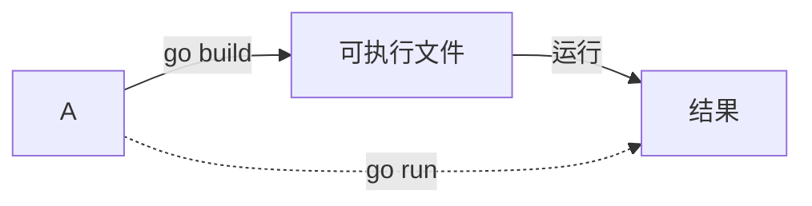

# Go 语言基础

## Go 程序基本结构

### 包声明

```go
package xxx
```

!!! summary "包名要求"
    * 与目录保持一致
    * 不要冲突标准库

### 包导入

```go
import "pkgName"
```

-   使用（公开）函数：先导入，调用时 `pkgName.funcName`
-   Go 标准库 API 存放在 `go/src/.../xxx.go` 中

### 程序主体

```go
func main(){}
```

-   `func` 为关键字，函数声明
-   转义字符：`\t`、`\n`、`\r`、`\\`、`\"` 等

#### 注释

=== "行注释"
    ```go
    // 这是一行注释
    ```

=== "块注释（多行注释）"
    ```go
    /* 这是块注释 */
    ```

    !!! info ""
        块注释不可嵌套

#### 变量

```go
var i int = 10
```

=== "指定类型"
    ```go 
    var i int = 10
    /* i 为变量名，int 为类型 */
    `

    - 先变量名后类型，若不赋值则使用默认值
    - 以后不可以改变数据类型，也不能重复定义变量

=== "类型推导"
    ```go
    var num = 10
    /* 此时num是整型 */
    ```

=== "省略var"
    ```go
    name := "tom"
    ```
    
    - 左侧不可是已声明变量

=== "多变量声明"
    ```go
    var n1, n2, n3 int // n1、n2、n3都是int
    var a,b,c=1,"tom",88 // a是int，b是string，c是int，等同于
    var(
        a=1
        b="tom"
        c=88
    )
    ```

!!! warning "Go要求"
    1. 必须以 `go` 作为扩展名
    2. 入口为 `main()` 函数
    3. 严格区分大小写
    4. 语句无需分号（自动加）
    5. 一行只能写一个语句
    6. 引入的包*必须*使用，定义的变量*必须*使用（否则编译不过）
    7. 大括号成对出现，缺一不可

## Go 控制台命令



-   `go build xxx.go` 将 `xxx.go` 文件生成可执行文件
    -   可执行文件在当前目录下生成，在命令行下可以直接执行
    -   这个文件可以拷贝到没有 go SDK 的环境下运行
-   `go run xxx.go` 包含编译和运行两步
    -   脚本式执行，速度较慢
-   `go fmt xxx.go` 格式化代码
    -   `-w` 选项将修改写入源文件

## Go 数据类型

### 基本数据类型

!!! summary "基本类型默认值"
    | 类型 | 默认值 |
    |:--:|:--:|
    |数值（int、float）|0|
    |字符串|`""`|
    |布尔|`false`|

!!! info "查看某变量占用的字节数"
    ```go
    import "unsafe"
    // func Sizeof(v ArbitraryType) uintptr
    unsafe.Sizeof(var)
    ```
#### 数值

-   `int`
    -   `uintx`（x=8，16，32，64）无符号整型，x为占用字节数
    -   `intx`（x=8，16，32，64）有符号整型，x为占用字节数
    -   `byte` 为 `int8` 别名；`rune` 为 `int32` 别名，表示一个unicode码。
-   `float`：`float32`、`float64`（默认），浮点型，支持科学计数法`a.e(E)B=a*10^B`
-   `complex`：`complex64`、`complex128`，复数

#### 字符

> 使用`byte`保存单个字符

-   如果直接输出，会输出其 ASCII 码值，所以需要使用格式化输出 `fmt.Printf()` `%c` 说明符
    -   如果需要输出中文，请使用一个可容纳的类型（如 `int`）
-   在运算时，字符类型相当于一个整数
    ```go
    fmt.Println("n1=",10+'a') // n1=107
    ```
-   Go 语言的字符是utf-8编码

#### 布尔bool

用于流程控制 `if`、`for` 等

#### 字符串string

-   Go 字符串由字节组成，一旦赋值就不可变
-   字符串的两种表示形式
    1. 双引号：`"hello"`，创建可解析的字符串字面量（支持转义，但不能用来引用多行）
    2. 反引号：`` `hello` ``，创建原生的字符串字面量，这些字符串可能由多行组成（不支持任何转义序列），原生的字符串字面量多用于书写多行消息、HTML以及正则表达式
-   字符串的拼接，用加号 `+`。
    -   多行代码中，`+` 要留在上一行
-   字符串函数
    -   统计长度 `len(str)`（按字节）
    -   遍历字符串
        ```go
        r:= []rune(str)
        for i:=0;i<len(str);i++ {...}
        ```
    -   字符串转整数 `strconv.Atoi(str)`
    -   子字符串判断 `strings.Contains(s string, substr string) bool`
    -   一个字符串有几个指定字串 `strings.Count(s string, sep string) int`
    -   不区分大小写的字符串比较 `strings.EqualFold(s1, s2 string) bool`
        -   直接 `==` 是区分大小写的比较
    -   子串第一次出现位置 `strings.Index(s string, sub string) int`
    -   字串最后一次出现位置 `strings.LastIndex(s string, sub string) int`
    -   替换 `strings.Replace(s string, origin string, substitute string, n int) string`
        -   `s` 本身不会变化
        -   `n` 替换几次，`-1` 为全部
    -   按指定字符分割 `strings.Split(s string, sep string) []string`
    -   大小写转换：`strings.ToLower(s string) string`、`strings.ToUpper(s string) string`
    -   去两边空格 `strings.TrimSpace(s string) string`
    -   去指定字符 `strings.Trim(s string, cutset string) string`
        -   去左边 `strings.TrimLeft(s string, cutset string) string`
        -   去右边 `strings.TrimRight(s string, cutset string) string`
    -   前后缀
        -   前缀 `strings.HasPrefix(s string, prefix string) bool`
        -   后缀 `strings.HasSuffix(s string, suffix string) bool`

#### 基本数据类型转换

-   显式转换 `var <varname> <type2> = <type2> (var1)`
-   转化为字符串
    -   `fmt.Sprintf("%参数", 表达式) string`
        -   `int`：`%d`
        -   `float`：`%f`
        -   `bool`：`%t`
        -   ……
    -   `strconv` 包
        -   `strconv.FormatX(i int64, base int) string`
            -   X=Bool, Int, Float, Uint
        -   `strconv.Itoa(int)`
    -   `var str = string(byte数组)`
-   字符串转基本类型
    -   `strconv` 包
        -   `strconv.ParseX(X=Bool, Int, Float, Uint)`
            -   返回值为64位的，需要32位要再次强转
        -   转化为整数 `strconv.Atoi(str)(n int, err error)`
            -   等价于 `parseInt(str, 10)`
    -   `var bytes = []byte(str)`

    !!! info ""
        不能转换的字符串，直接转换为默认值

### 派生/复杂数据类型

!!! info "引用类型"
    指针、切片、映射、管道、接口称为引用类型

    ``` title="内存表示"
             堆区
          +---------+
    ref-->|   地址   |-->值
          +---------+
    ```

-   指针：存的是变量的地址
    -   指针变量：`var ptr *<type>` 指向type类型的ptr
    -   获取地址：`&var`
    -   获取其中存储的值：`*ptr`
    -   `int`、`float`、`bool`、`string`（值类型）、数组、结构体都有对应的指针类型
-   数组：存放多个同一数据类型

    -   Go中的数组是值类型
    -   声明：`var 数组名 [数组大小]数据类型`
    -   一旦确认不可改变长度
    -   赋值：`数组名[下标]=值`
    -   访问：`数组名[下标]`
    -   初始化
        ```go
        var numArr [3]int = [3]int{1, 2, 3}
        var numArr = [3]int{1, 2, 3}
        var numArr = [...]int{1, 2, 3}
        var numArr = [...]int{1: 800, 0:900, 2:999}
        ```
    -   遍历
        ```go
        for index,value := range arr {
            /* ... */
        }
        // 只想要元素值
        for _, v := range arr {
            /* ... */
        }
        ```
    -   数组传参
        -   值传递：传递的是数组的副本，不会影响原数组 `func test(arr []int) {...}`
        -   引用传递：传递的是数组的地址，会影响原数组 `func test(arr *[3]int) {...}`
    -   二维数组 `var arr[2][3] int[][]=[2][3]int{{1,2,3}{4,5,6}}`（第一维可省略）

        -   遍历
            === "普通for"
                ```go title="普通for"
                for i:=0;i<row;i++ {
                    for j:=0;j<col;j++ {
                        /* ... */
                    }
                }
                ```

            === "for-range"
                ```go title="for-range"
                for i,v:= range arr{
                    for j,v2:= range v {
                        /* ... */
                    }
                }
                ```

-   切片：不确定数量的集合
    -   切片属于引用类型，传递也传送地址
    -   声明：`var 变量名 []类型`
    -   容量 `cap()`，元素个数 `len()`
    -   从底层来看，是一个 struct 结构体
        ```go
        type slice struct {
            ptr *[2]int
            len int
            cap int
        }
        ```
    -   使用
        -   定义切片，并引用一个数组
        -   `make([], len, [cap])`
        -   指定具体数组
        -   `[start:end]`，含 `arr[start]`，不含 `arr[end]`
            -   `arr[:end]`，从头到 `end`
            -   `arr[start:]`，从 `start` 到尾
            -   `arr[0:len(arr)]=arr[:]`，全部
        -   遍历：类似数组
    -   `append(slice[] Type, elems... Type)` 动态增加项目
        -   具体元素 `xx:=append(slice, 10, 20, 30)`
        -   切片 `xx:=append(slice, slice2...)`
    -   拷贝 `copy(para1,para2)`，从切片 `para2` 拷贝到 `para1`
-   映射

    -   声明：`var map变量名 map[keyType] valueType`，key不能重复，value可以相同
        -   slice、map、function 不可以作为key
        ```go
        var a map[string]string
        var a map[string]int
        var a map[int]string
        var a map[string]map[string]string
        ```
    -   分配内存后才能赋值和使用
        -   声明→make→使用
        -   声明时make→使用
        -   直接赋值
    -   增删改查
        -   `map["key"]=value`（实质为 `val, res:=map["key"]`，其中 `res` 为布尔值）
            -   key 存在（`res` 为 `true`），则修改
            -   key 不存在（`res` 为 `false`），则添加
        -   `delete(map,"key")`
            -   key 存在，则删除
            -   key 不存在或为 nil，则无操作（并不会报错）
    -   遍历 `for k,v:= range Map{...}`
    -   长度 `len(map)` 返回值为几对键值对
    -   切片 `[]map [keyType]valueType`，动态增加用 `append()`
    -   排序：借助切片

    !!! faq "如何清空map？"
        * 遍历，逐个删除
        * make一个新的，原来的交给gc回收处理

-   [函数](function.md)
-   [结构体](oop.md#结构体-struct)
-   [接口](oop.md#接口-interface)
-   管道

### 自定义数据类型

```go
type mySum func(int, int)int

mySum()
// 然而，Go 认为 mySum 和 func 是两种类型，需要强制转换
```

Go 支持自定义数据类型 `type <别名> <数据类型>`，相当于C的 `typedef`

## Go 标识符

-   可以使用 26 个英文字母大小写、0-9、下划线
-   变量名、函数名、常量名一般使用驼峰法
-   首字母大写是公开的（可从 GoPath 导入包名和变量名），小写是私有的（在本包使用）

## Go 运算符

!!! info ""
    自增、自减只能独立使用

    === "错误❌"
        ```go
        a:=b++
        ```

    === "正确✔"
        ```go
        b++
        a:=b
        ```

!!! info ""
    Go 无三元运算符

-   算术运算
    -   加 `+`
    -   减 `-`
    -   乘 `*`
    -   除 `/`
        -   整数除法，结果只保留整数部分（`10/4=2`，而 `10.0/4=2.5`）
    -   取模 `%`
        -   `a%b=a-a/b*b`
    -   自增 `++`
        -   只有后置自增 `i++`，没有前置自增 `++i`
    -   自减 `--`
        -   只有后置自减 `i--`，没有前置自减 `--i`
    -   位运算：`&`、`|`、`^`、`<<`、`>>`
-   判断符号：`==` `!=` `>` `<` `>=` `<=`
-   逻辑运算：`&&` `||` `!`
    -   `&&` 和 `||` 支持短路操作

## 输入与输出

> 主要使用 `fmt` 包

-   `fmt.Scanln()`：在换行时停止扫描（与C类似，扫描到变量所指向的地址（`&var`）中）
-   `fmt.Scanf()`：格式化输入
    -   常用格式符：`%d` 整数、`%f` 小数、`%s` 字符串、`%t` 布尔值
-   `fmt.Println()`：输出后换行

## 时间与日期

> 主要使用 `time` 包

-   `time.Time` 类型表示时间
-   `now:=time.Now()` 表示当前时间
    -   实例方法：年 `now.Year()`、月 `now.Month()`、日 `now.Day()`、时 `now.Hour()`、分 `now.Minute()`、秒 `now.Second()`，需要数字可以使用 `int()` 强制转换
    -   格式化：`now.Format("2006-01-02 15:04:05")`，其中 `2006-01-02 15:04:05` 是固定格式
-   时间常量：`time.Second`、`time.Minute`、`time.Hour`、`time.Day`、`time.Week`、`time.Month`、`time.Year`
-   其它常见方法
    -   `time.Sleep(d Duration)`
    -   `time.Unix()`
    -   `time.UnixNano()`

## 文件操作

> `os.File` 结构体表示文件

-   打开文件
    -   `os.Open(name string)(file *File, err error)`
    -   `os.OpenFile(name string, flag int, perm FileMode) (*File, error)`
-   关闭文件 `func (*File) Close() error`
    -   函数退出时，及时关闭File（`defer file.Close()`），否则会有内存泄漏
-   读取文件
    -   `bufio.NewReader(file) *Reader`：创建一个缓冲区（大小4096），用于读取文件
        -   `func (*Reader) ReadString() (string, error)`：读取文件内容，直到遇到换行符
    -   `ioutil.Readfile(filepath string) ([]byte, error)`：一次性读取文件内容
        -   无需调用 `Open()`、`Close()`
-   写入文件
    -   `bufio.NewWriter(file) *Writer`：创建一个缓冲区（大小4096），用于写入文件
        -   `func (*Writer) WriteString() (int, error)`：写入文件内容（到缓冲区）
        -   注意 `WriteString()` 后内容在缓存中没有进磁盘，一定要紧接调用 `Flush()`
    -   `ioutil.WriteFile(filepath string, data []byte, perm os.FileMode) error`：一次性写入文件内容
        -   无需调用 `Open()`、`Close()`
-   文件信息
    -   `os.Stat(name string) (FileInfo, error)`
    -   `os.IsExist(err error) bool`：判断文件是否存在
    -   `os.IsNotExist(err error) bool`：判断文件是否不存在
-   拷贝文件
    -   `io.Copy(dst Writer, src Reader) (written int64, err error)` 返回第一个参数是已拷贝字节数
-   命令行参数
    -   `os.Args`，类型为 `[]string`，其中第一个元素为程序名
    -   解析参数：`flag` 包 `flag.XXXVar(p *XXX, name string, value string ,usage string)`
    -   `flag.Parse()`：解析参数，必须在所有参数定义之后调用
