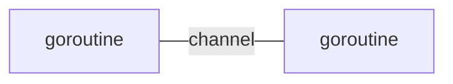

---
tags:
  - 编程语言
  - Go
---
Go语言笔记第一篇
===

## 语言特质
- [x] 静态编译语言的性能（如C）
- [x] 动态语言开发维护的效率（如Python）

### 指针使用特点
```go
func testptr(num *int){
  *num=20
}
```

### 包概念
每个文件都要归属一个“包”。
```go
package xxx
import "yyy" // 包导入
```

### 自动垃圾回收
不容易内存泄漏

### “天然”并发
- [x] 从语言层面支持并发（goroutine）
- [x] 基于CPS并发模型实现

### 管道（channel）通信机制


### 返回多值（函数）
```go
func getSumAndSub(n1 int, n2 int) (int, int){
  return n1+n2, n1-n2
}
```

### 切片（slice）

### 延时执行（defer）
!!! summary "意义"
    在函数执行完毕后，快速释放资源

执行到 `defer` 时，将其后语句压入 `defer` 栈中，暂时不执行，函数执行完毕后，按先入后出方式执行。

```go title="实践"
// 文件IO
file=openfile(文件名)
defer file.close()
// 数据库链接
connect=openDatabase()
defer connect.close()
```

## 其它资料
* API文档
    - [国外文档](https://pkg.go.dev/std)
    - [国内文档](https://studygolang.com/pkgdoc)
* 语言学习
    - [Go指南](https://tour.go-zh.org)