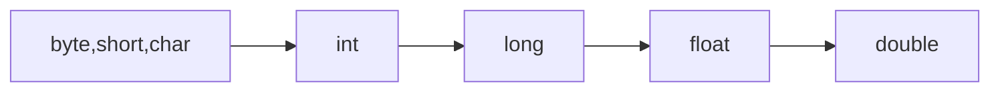

---
tags:
  - 编程语言
  - Java
---
Java 语言基础知识
===

## 标识符

Java 语言中，标识符由字母、下划线、美元符（$）开始，后接字母、下划线、美元符、数字。

!!! warning ""
    保留字不可作为标识符

## 数据类型

!!! tip "自动类型转换"
    不同类型数据转化为同一类型（向高级转换）



!!! tip "强制类型转换"
    高级→低级。可能丢失精度

    ```java
    int i;
    byte b = (byte) i;
    ```

### 类型划分

Java 语言中，数据类型分为两大类：基本类型和引用类型。

* 基本类型：byte、short、int、long、float、double、char、boolean
* 引用类型：类、接口、数组

### 常量与变量

变量定义：`#!java <typeSpecifier> <varName>[=value];`

* 变量名对大小写敏感
* 长度无限制
* 先初始化，后使用

常量定义：`#!java final <typeSpecifier> <varName>=value;`

* 一旦赋值不可被修改

### 布尔类型（boolean）

值只有 `true` 和 `false`，不能接受整数赋值

### 字符类型（char）

字符常量 `'<ch>'`，字符变量 `#!java char ch;`，16 位

### 整型数据（integer）

* 常量：十进制整数、八进制整数（`0` 开头）、十六进制整数（`0x` 开头）、二进制整数（`0b` 开头）
* 变量
    - byte：8位
    - short：16位
    - int：32位
    - long：64位

### 浮点型数据（float）

* 常量：十进制数字（+ 小数点 + 小数部分）+ `f` 或 `F`
    - 科学计数法：`#!java <mantissa>e<exponent>`，`mantissa` 和 `exponent` 均为十进制数字
* 变量：
    - float：32位
    - double：64位

### 字符串类型（String）

* String 和 StringBuffer
    - String：不可变字符串
        * 构造：`String(char chars)`、`String(char chars[], int startindex, int numChars)` 等
        * 修改：`concat()`、`replace()`、`substring()` 等
    - StringBuffer/StringBuilder：可变字符串
        * 构造：`StringBuffer()`、`StringBuffer(String str)`、`StringBuffer(int len)` 等
        * 修改：`append()`、`insert()`、`setCharAt()` 等
* 比较：`equals()`、`equalsIgnoreCase()` 等
* 转化：`toString()`
* 连接：`+`，实质为 `StringBuffer` 的多次 `append()` 操作

### 数组类型（array）

#### 一维数组 `<type> arrayName[]`

* 初始化：`int intArray[]`，`#!java intArray = new int[15]`
* 引用：`arrayName[index]`，从0开始
* 拷贝
    - 引用：`int[] a = {} int[]b = a`
    - 值：`copyOf` 方法
* 排序：`Arrays.sort()`
* 遍历：for-each循环 `#!java for (variable: collection) {statement}` 依次处理数组中每个元素，而不必指定下标值

#### 多维数组

> “数组的数组”。在 Java 中，数组空间是非连续分配的，每一维大小不必相同。

!!! summary ""
    二维数组 `type arrayName[][]` 或 `type [][]arrayName`

初始化（动态）：

```java 
arrayName = new type[arrayLength1][arrayLength2];
// 或
arrayName = new type[arrayLength1][];
arrayName[0] = new type[arrayLength2];
// ... //
arrayName[arrayLength1-1] = new type[arraylength2n];
```

!!! summary ""
    复合数据类型数组，先为最高维分配引用空间，再顺次分配低维空间。必须为每个数据元素单独分配空间。

## 运算符和表达式

### 运算符

* 算术运算符：`+`、`-`、`*`、`/`、`%`、`++`、`--`
* 关系运算符：`>`、`<`、`>=`、`<=`、`==`、`!=`
* 逻辑运算符：`&&`、`||`、`!`
* 位运算符：`&`、`|`、`^`、`~`、`<<`、`>>`、`>>>`
* 赋值运算符：`=`、`+=`、`-=`、`*=`、`/=`、`%=`、`<<=`、`>>=`、`&=`、`^=`、`|=`、`>>>=`
* 条件运算符：`?:`
* 其他
    - 分量 `.`
    - 下标 `[]`
    - 实例 `instance of`
    - 内存分配 `new`
    - 方法调用 `()`
    - 强制类型转换 `(type)`

    ...

### 表达式

运算符按优先顺序从高到低结合，同级运算符从左向右结合

!!! tip ""
    数学函数 `java.lang.Math`，若 `#!java import static java.lang.Math.*` 便可不加 `Math.` 调用其方法和常量

## 控制语句

### 块作用域

`{}` 其中的若干语句组成一个块，块中定义的变量只在块内有效。可嵌套，但不可同时在其中声明同名变量。

### 分支语句

* `if-else`
* `switch-case`

### 循环语句

* `while`
* `do-while`
* `for`

### 跳转语句

* `break`
* `continue`
* `return`

### 例外处理语句

* `try-catch-finally`
    ```java
    try{
        // 可能产生例外的代码段
    } catch (ExceptionType1 e1) {
        // 处理 e1
    } catch (ExceptionType2 e2) {
        // 处理 e2
    } finally {
    }
    ```
* `throw` 抛出例外对象

## 简单输入输出

* 读取输入
    - 需要引入 `java.util.*` 包
    - `Scanner` 类
        * 构造：`#!java Scanner sc = new Scanner(System.in)`
        * 方法：`next()`、`nextInt()`、`nextDouble()` 等
* 格式化输出
    - `System.out.print()`
    - `System.out.println()`：打印完一行后换行
    - `System.out.printf()`：C 风格格式化输出