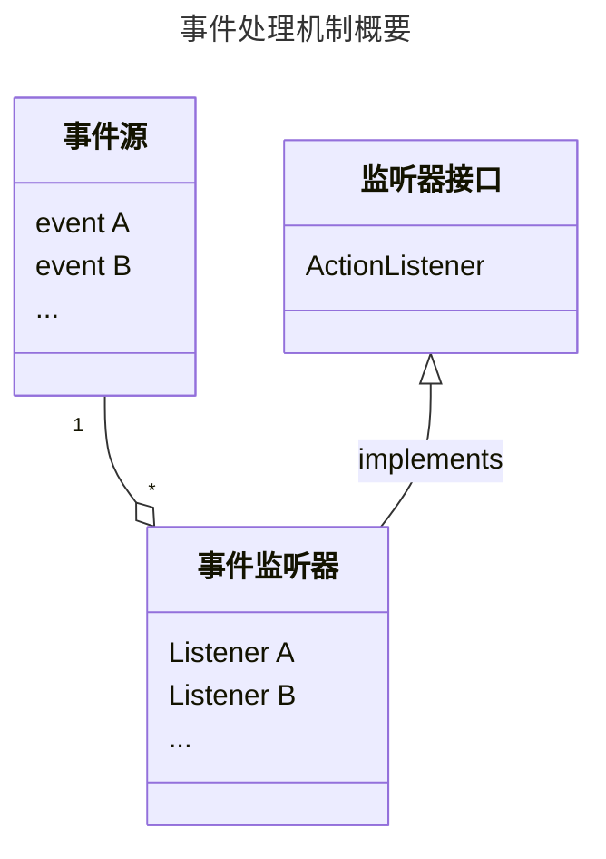
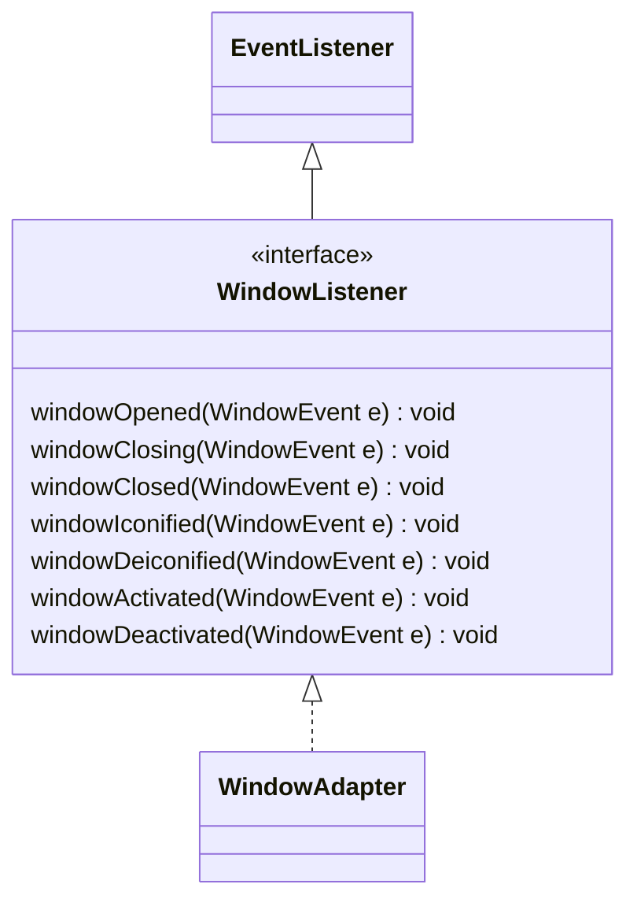
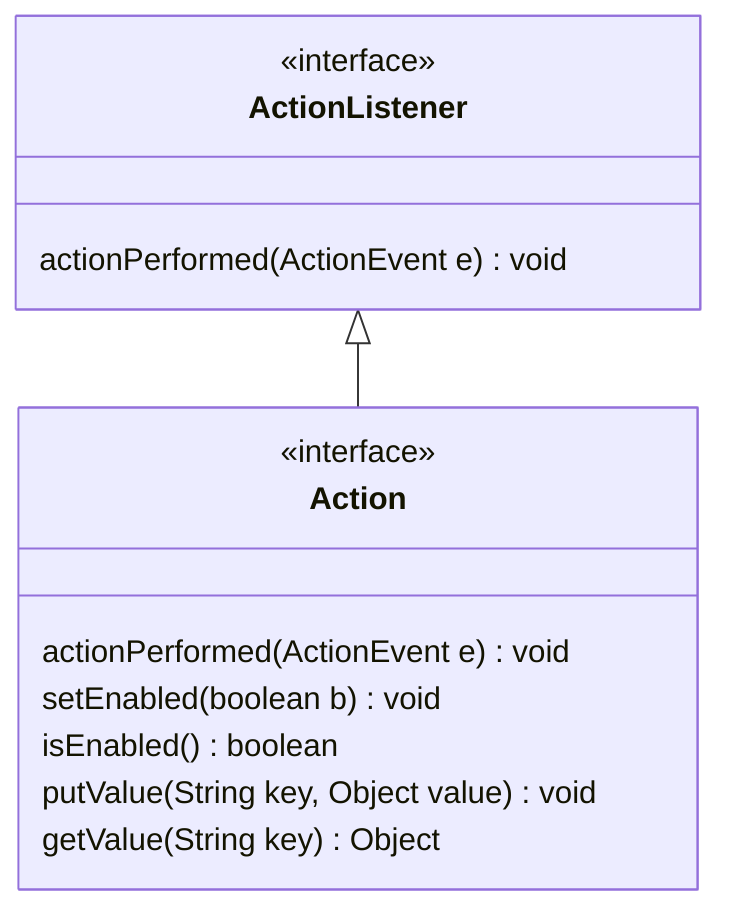
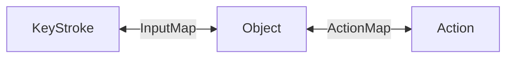
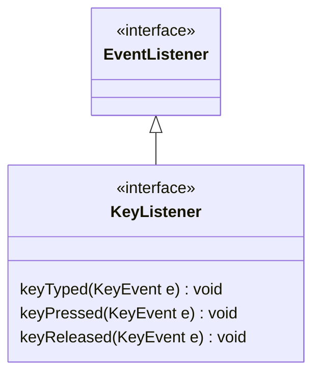
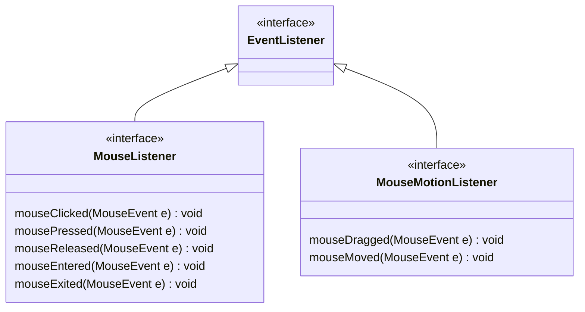

---
tags:
  - 编程语言
  - Java
---
事件处理
===



## 事件处理基础

* 注册监听器对象：`void addXXXListener(XXXListener listener)`
    - 监听器对象所属的类必须实现相应接口

        ```java
        class xxx implements ActionListener{
            // ...
            public void actionPerformed(ActionEvent event){
               // ...
            }
        }
        ```

* 监听器类的使用
    - 事件监听器类通常只在一个类中使用，因此可以将其定义为内部类
    - 事件监听器类通常只有一个方法，因此可以使用匿名类

        ```java
        void makeButton(String name, final Color bgColor){
            button.addActionListener(new ActionListener(){
                public void actionPerformed(ActionEvent event){
                    // ...
                }
            });
        }
        ```
      
* 组件作为事件监听器：`addActionListener(this)`

!!! tip "如何知道事件源"
    ```java
    Object source = event.getSource();
    if(source == sourceX){
            // ...
    }
    ```

### 捕获窗口（window）事件



可以使用适配器类 `WindowAdapter`，它实现了 `WindowListener` 接口，但是其中的方法都是空的，从而无需再手动实现接口中所有的方法

```java title="匿名适配器类"
frame.addWindowListener(
    new WindowAdapater(){
        public void windowClosing(WindowEvent event){
            System.exit(0);
        }
    }
);
```

## AWT 的语义事件和低级事件

语义事件
: 表达用户动作（如 `ActionEvent`）

低级事件
: 形成语义事件的事件（如 `MouseEvent`）

## 动作

### Action 接口

!!! tip ""
    不想实现所有方法，可以继承 `AbstractAction` 类



* key 的常用取值
    - `Action.NAME`：动作的名称
    - `Action.SHORT_DESCRIPTION`：动作的简短描述
    - `Action.SMALL_ICON`：动作的图标
    - `Action.MNEUMONIC_KEY`：动作的助记符（快捷键）
* 利用一个实现了 `Action` 接口的对象，可以实例化按钮、菜单项等

### 动作与击键关联



```java
KeyStroke a = KeyStroke.getKeyStroke("<key>");

InputMap imap = component.getInputMap();
imap.put(KeyStroke.getKeyStroke("ctrl R"), "Red");
ActionMap amap = panel.getActionMap();
amap.put("Red", redAction);
```

### 键盘事件

!!! tip ""
    存在相应的适配器类 `KeyAdapter`



虚拟键码 `VK_<key>`

* 得到键码：`getCode()`
* 判断是否按下相应键：`isShiftDown()`、`isControlDown()`、`isAltDown()`
* 得到实际字符：`getKeyChar()`

### 鼠标事件

!!! tip ""
    存在相应的适配器类 `MouseAdapter` 和 `MouseMotionAdapter`



常用方法：`getX()`、`getY()`、`getPoint()`、`getClickCount()`

#### 设置光标

* java.awt.Component：`setCursor(Cursor cursor)`
* java.awt.Cursor
    - `static Cursor getPredefinedCursor(int type)`
    - `static Cursor getDefaultCursor()`

!!! summary "常用光标类型"
    - `Cursor.DEFAULT_CURSOR`
    - `Cursor.CROSSHAIR_CURSOR`
    - `Cursor.TEXT_CURSOR`
    - `Cursor.WAIT_CURSOR`
    - `Cursor.HAND_CURSOR`
    - `Cursor.MOVE_CURSOR`
