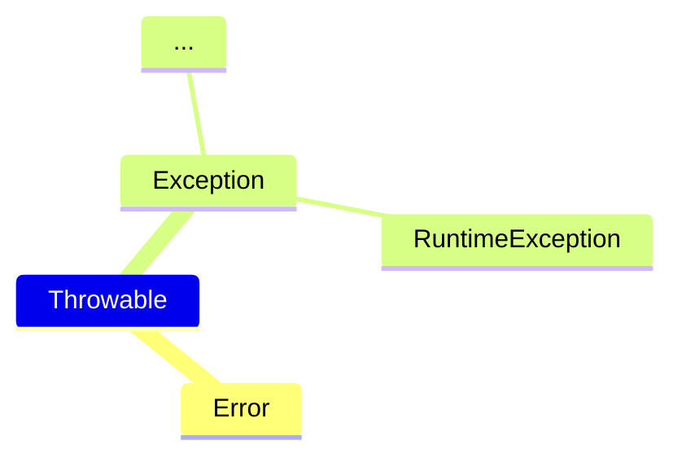

---
tags:
  - 编程语言
  - Java
---
Java 异常处理
===

!!! summary "异常"
    程序执行过程中所发生的异常事件，它中断指令的正常执行

可能存在的问题：

* 用户输入错误
* 设备错误
* 物理限制
* 代码错误

## 异常分类

<!-- todo: wait for mindmap support

-->

* `Error`：虚拟机错误等，程序无法处理
* `Exception`
    - 运行时异常：自己的程序中不应出现这类问题
    - 非运行时异常：必须处理它们

## 异常处理

!!! summary ""
    * 早抛出，晚捕获
    * 只在异常情况下使用异常机制

### 抛出异常

方法声明中使用 `throws` 子句，指定多个异常时，用逗号分隔

```java
public xxx() throws Exception1[, Exception2, ...] {
    ...
}
```

* 先生成异常对象，再抛出

    ```java
    IOException e = new IOException("文件不存在");
    throw e; 
    ```

* 必须抛出 `Throwable` 或其子类实例
* 可自定义异常类

    ```java
    class BException extends AException{
        public BException(){}
        public BEXception(String msg){
            super(msg);
        }
        // ...
    }
    ```

!!! note "注意"
    * 子类中抛出的异常必须比超类更加”特殊“。若超类中没有抛出异常，则子类中也不可以抛出受查异常
    * 一个方法可能有异常生成，但这一方法不知道如何处理这些异常，就应该声明抛出异常
    * 尽可能使抛出的异常更加明确

### 捕获异常

!!! tip ""
    捕获那些知道如何处理的异常

```java
try {
    // (1)
} catch (ExceptionType1 e1) {
    // (2)
} catch (ExceptionType2 [|ExceptionType3...] e2) { // (3)
    // (4)
} finally {
    // (5)
}
```

1. 可能会出问题的代码段
2. 先捕获较特殊的异常
3. 使用 `|` 分隔多个异常类型
4. 内部可以使用 `getMessage()` 或 `printStackTrace()`等方法
5. 此块语句一定会执行
