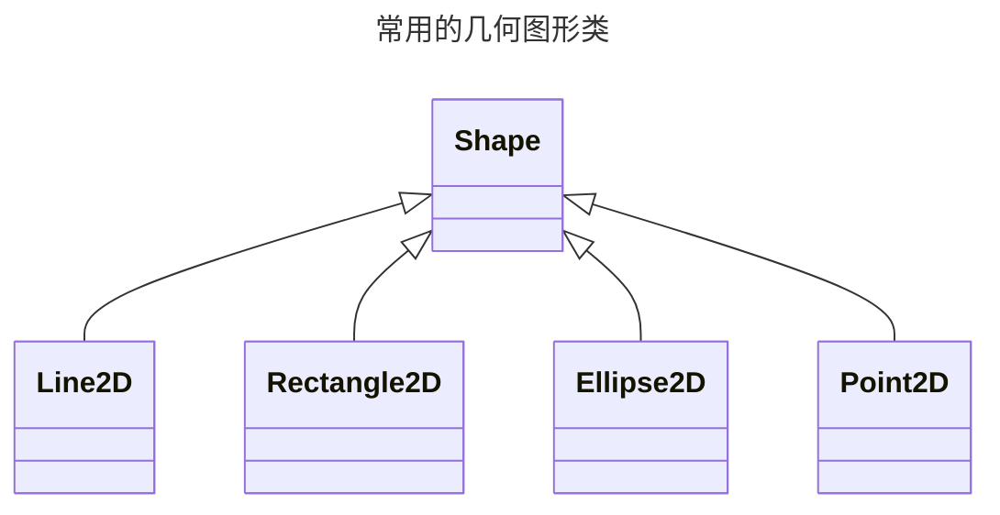

---
tags:
    - 编程语言
    - Java
---

# Java 图形程序设计

-   Java 中图形用户界面的最基本组成是组件
-   组件要放置在容器中才可以显示

## 两种基本 GUI 程序设计类库

AWT（抽象窗口工具箱）
: Java 1.0 时出现，基本的 GUI 程序设计类库。基于”对等体“支持

Swing
: Java 1.2 时作为标准库的一部分。提供了更强大的用户界面组件

## 框架（frame）

顶层窗口被称为框架。Swing 使用 JFrame 类表示框架。AWT 使用 Frame 类表示框架。

!!! info ""
    JFrame 是少数不绘制在画布上的 Swing 组件之一。

### JFrame 的使用

!!! info ""
    Swing 组件必须在事件分配线程中进行配置

    ```java
    public class SimpleFrameTest{
        public static void main(String[] args){
            EventQueue.invokeLater(() -> {
                // (1)
            });
        }
    }
    ```

    1. 在这里初始化 JFrame 等组件

-   新建一个 JFrame 对象
    -   `MyFrame extends JFrame{}`
    -   `new JFrame()`
-   设置合适框架大小 `setSize(int width, int height)`
    -   使用用户系统的分辨率信息 `Toolkit.getDefaultToolkit().getScreenSize()`，取得其中的 `width` 和 `height` 属性
-   其他信息
    -   设置框架位置 `void setLocation(int x, int y)`，x、y 是距离用户屏幕左上角的偏移
    -   设置框架标题 `void setTitle(String title)`
    -   设置图标 `void setIconImage(Image image)`
    -   设置框架关闭时的默认操作 `void setDefaultCloseOperation(int operation)`
        -   `JFrame.EXIT_ON_CLOSE`：退出程序
        -   `JFrame.HIDE_ON_CLOSE`：隐藏框架
        -   `JFrame.DISPOSE_ON_CLOSE`：释放框架
        -   `JFrame.DO_NOTHING_ON_CLOSE`：什么都不做
    -   设置框架可见性 `void setVisible(boolean b)`

## 在组件中显示信息

-   将组件添加至窗格：`frame.add(Component c);`
    -   定义一个扩展 `JComponent` 的类
    -   覆盖其中的 `paintComponent` 方法
    -   向 `frame.add()` 中传递你所创建的组件类
-   `paintComponent` 方法
    -   需要一个 Graphics 类型参数
    -   大多数情况下，无需自行调用
-   绘制文本：`drawString(String s, int x, int y)`
-   使用组件首选大小：`pack()` 方法
    -   使组件大小适合其中的组件
    -   通常在设置完组件后调用

## 处理 2D 图形

若所用版本支持 Java 2D，`paintComponent` 可以获得一个 `Graphics2D` 类对象（需要先进行类型转换）。

```java
Graphics2D g2 = (Graphics2D) g;
```



!!! info ""
    其中，每一个2D类都有Float和Double两个静态内部类

## 使用颜色

### java.awt.Color 类

-   `Color(int r, int g, int b)`：使用 RGB 值创建颜色
-   13 种预定义常量：`Color.BLACK`、`Color.BLUE`、`Color.CYAN`、`Color.DARK_GRAY`、`Color.GRAY`、`Color.GREEN`、`Color.LIGHT_GRAY`、`Color.MAGENTA`、`Color.ORANGE`、`Color.PINK`、`Color.RED`、`Color.WHITE`、`Color.YELLOW`

### 绘制操作

-   Graphics2D 类：`setPaint(Paint p)`
    -   为后续绘制操作（`fill()`、`drawString()` 等）选择颜色
-   Graphics 类：`setColor(Color c)`

### 设置组件颜色

-   前景色：`setForeground(Color c)`
-   背景色：`setBackground(Color c)`

### 填充图形

-   `fill(Shape s)`：使用当前颜料填充图形

## 设置字体

### java.awt.Font 类

-   `Font(String name, int style, int size)`：创建字体
    -   `name`：字体名称
    -   `style`：字体风格
        -   `Font.PLAIN`：普通
        -   `Font.BOLD`：粗体
        -   `Font.ITALIC`：斜体
        -   `Font.BOLD + Font.ITALIC`：粗斜体
    -   `size`：字体大小
-   列出当前系统支持的字体：`String[] getAvailableFontFamilyNames()`

    ```java
    String[] fontNames = GraphicsEnvironment.getLocalGraphicsEnvironment()
            .getAvailableFontFamilyNames();
    for(String fontName : fontNames) {
        System.out.println(fontName);
    }
    ```

!!! summary "五种映射到客户机上实际字体的逻辑字体名"
    * SansSerif
    * Serif
    * Monospaced
    * Dialog
    * DialogInput

### 字符串位置

```java
FontRenderContext context = g2.getFontRenderContext();
Rectangle2D bounds = font.getStringBounds(message, context);
double stringWidth = bounds.getWidth();
double stringHeight = bounds.getHeight();
double ascent = -bounds.getY();
```

## 显示图像

-   表示图像文件的类：`java.awt.Image`
-   读图像：`Image image = new ImageIcon(filename).getImage();`
-   画图：`drawImage(Image img, int x, int y, ImageObserver observer)`
    -   `img`：图像
    -   `x`、`y`：图像左上角的坐标
    -   `observer`：图像观察者，通常传递 `null`
