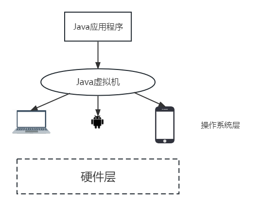
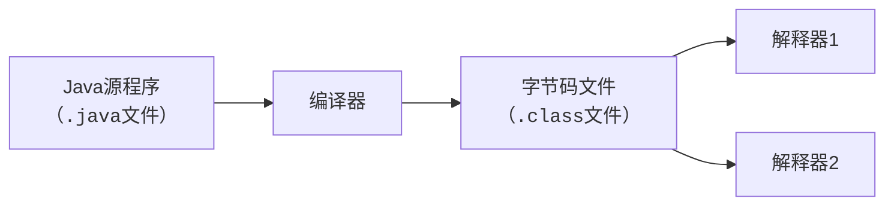

---
tags:
  - 编程语言
  - Java
---
Java 概述
===

## 产生

> JavaOne：全世界Java开发者的舞台

* 1991年，SUN公司 Oak软件
* 1994下半年，Oak应用于网络，更名为Java
* 1995年，Java语言发布
* 1996年，Javasoft分公司，发展Java

……

## 设计目标
* 100%面向对象
* 提供程序运行的解释环境
* 多线程机制
* 动态下载程序代码机制
* 安全性——代码检验机制

## 实现机制

!!! summary "三种平台"
    * J2EE，企业计算
    * J2SE，桌面计算
    * J2ME，嵌入计算

### Java虚拟机
针对不同软硬件平台做专门实现





### 无用内存收集
系统级线程控制
### 代码安全性检查
* 虚拟机“沙箱”运行，不允许程序访问所限制内存空间之外的内存和数据
* applet不可访问客户端文件系统
* 字节码执行过程中会有类文件规范检查过程，类文件是否包含非法操作也会被检查

## 建立 Java 开发环境
1. 安装 Java Development Kit(JDK)
2. 安装帮助文档
3. 配置类路径classpath和环境变量Path
    * 建立一个新的变量 `%JAVA_HOME%`，其值为jdk所在目录
    * path 中增加一项 `%JAVA_HOME%\bin`
    * classpath 中增加一项 `.;%JAVA_HOME%\lib`，注意 `.` 不能省略
    * javac 命令显示帮助文档，则 path 配置正确

### Java 程序分类
* Application
    - 编译：`javac 公共类名.java`
    - 运行：`java 公共类名`
    
    !!! summary "一个典型的Java 程序"
        ```java 
        public class HelloWorldApp {
            public static void main(String[] args) {  // main 方法
                System.out.println("Hello World!");
            }
        }
        ```

* Applet（Java 9以后建议弃用）
    - 编译：`javac 公共类名.java`
    - 运行：在 HTML 中使用 `<applet>` 标签嵌入，或使用 `appletviewer` 命令运行
  
    !!! summary "一个典型的Java Applet"
        ```java
        import java.awt.Graphics;
        import java.applet.Applet;
        public class HelloWorldApplet extends Applet {
            public String s;
            public void init(){
                s = new String("Hello world");
            }
            public void paint(Graphics g){
                g.drawString(s, 25, 50);
            }
        }
        ```

## Java 程序的基本结构

> 从开头到结尾：0或1个 `package` 语句，若干 `import` 语句，类定义（public 类0或1个，其他若干），接口定义（若干）

!!! warning ""
    `.java` 文件如果包含一个 public 类，则必须以该类名命名。

### package 语句

package 语句用于管理 `.class` 文件，把 `.class` 文件放入指定目录

用法：`javac -d <指定目录>`

### import 语句

* 可以声明类、包
* 引用类、包时，将沿 classpath 寻找相应的 `.class` 文件

### Java 编码规范（建议）

* 包名：全小写的名词，中间由点分隔。如 `java.awt.event`
* 类名：首字母大写，若由多个单词组成类名，则每个单词首字母也要大写。如 `class HelloWorldApp`
* 接口名：与类名规则相同，但通常以 `able` 或 `ible` 结尾。如 `interface Runnable`
* 方法名：多单词合成，第一个单词通常为动词，首字母小写，中间每个单词首字母大写。如 `balanceAccount`、`isButtonPressed`
* 变量名：全小写，一般为名词。如 `length`
* 常量名：基本数据类型的常量名为全大写。多个单词构成，下划线隔开。如 `int YEAR`、`int WEEK_OF_MONTH`。对象类型大小写混合，由大写字母分割单词

### 注释
* 单行注释：`//`
* 多行注释：`/* */`
* 文档注释：`/** */`，用于生成 API 文档

!!! tip "生成注释文档"
    `javadoc -d <指定目录> <文件名.java>`