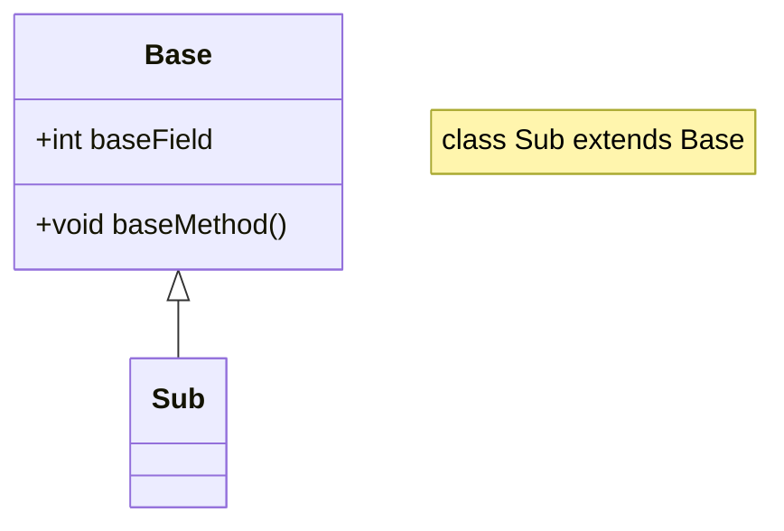
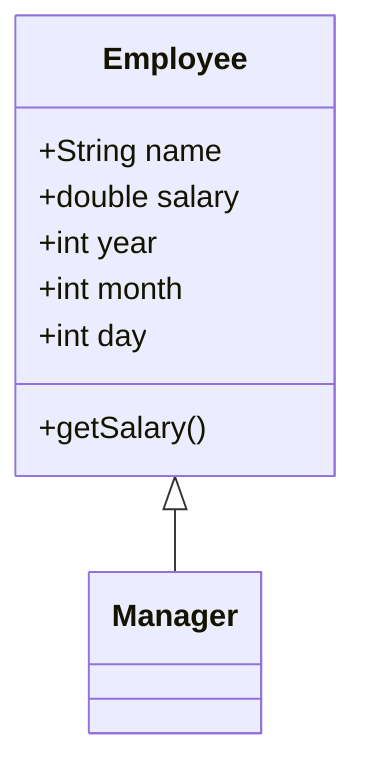
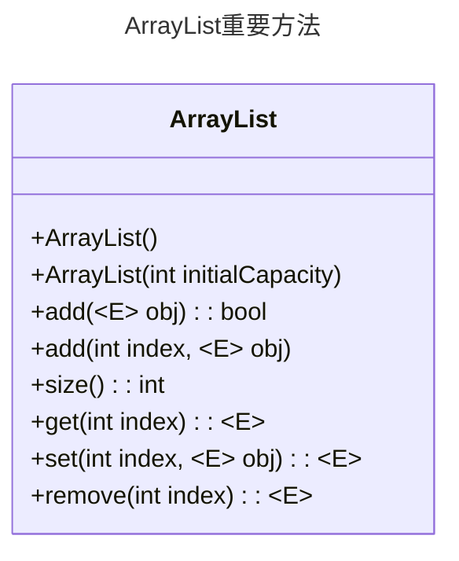
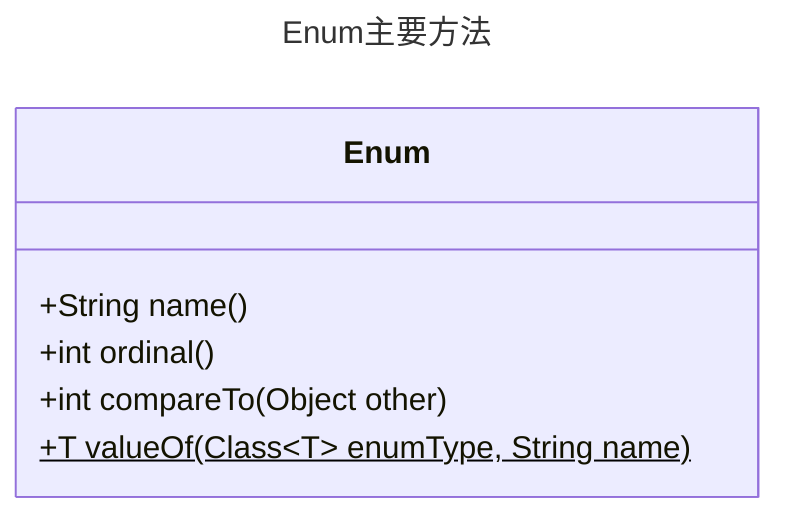

---
tags:
    - 编程语言
    - Java
---

# Java 面向对象特性

!!! summary "面向对象程序设计（OOP）"
    使用类、对象、继承、封装、消息等进行程序设计。

??? summary "对象三特性"
    * 对象的行为（behavior）：方法
    * 对象的状态（state）：属性
    * 对象的标识（identity）：引用

??? summary "类之间的关系"
    * is-a：继承
    * has-a：聚合
    * uses-a：依赖

## 类（class）

### 声明

```java
[public|private|protected] [abstract|final] class ClassName [extends superClassName] [implements interfaceNameList] {
    // ...
}
```

-   `abstract`：抽象类，不能实例化，只能作为其他类的父类
-   `final`：最终类，不能被继承（重写）
-   `extends`：继承，只能单继承
-   `implements`：实现接口，可多实现

### 类体

-   成员变量：`[public|private|protected] [static] [final] [transient] [votalie] type varName [= value];`
    -   `static`：静态变量，也叫类变量/实例变量
    -   `final`：常量，只能被赋值一次
    -   `transient`：瞬态变量，不会被序列化
    -   `votalie`：易变变量，多线程中保证变量的同步
-   成员方法：`[public|private|protected] [static] [final|abstract] [synchronized] [native] [strictfp] [returnType] methodName([paramList]) [throws exceptionList] { // ... }`
    -   `static`：静态方法，也叫类方法，可通过类名调用
    -   `final`：方法不可被重写
    -   `abstract`：抽象方法，只有声明，没有实现
    -   `native`：集成其他语言的代码（多为 C 或 C++）
    -   `synchoronized`：同步方法，多线程中保证方法的同步
-   继承：特殊类拥有一般类的全部属性和服务

### 对象（object）

-   Java 使用构造函数构造实例，可以将其传递给方法

    !!! tip ""
        Date 类的构造器名为 `Date()`，要新建一个 `Date` 类对象，使用 `#!java new Date();`

-   对象变量：引用一个对象
    -   `Date birthday;`，现在 birthday 为 `null`
    -   `Date birthday = new Date();`

### 设计自己的类

-   构造函数（总伴随 `new` 一起使用）
    -   其名字必须与类名相同
    -   没有返回值
-   成员变量
    -   通常使用 `private` 访问控制（只有所属类自身的方法可以访问）
-   隐式参数和显式参数
    ```java
    public void raiseSalary(double byPercent){
        double raise = salary * byPercent / 100;
        // salary == this.salary 被当前调用对象取代
        salary += raise;
    }
    number007.raiseSalary(5); // 隐式参数为 number007，显式参数为 5
    ```
-   封装
    -   实例域
        -   私有的数据域
        -   公有的域访问器方法 `getxxx() {return xxx;}`
        -   公有的域更改器方法 `setxxx(a) {this.xxx=a;}`
-   可以将实例域定义为 `final`，操作如同定义常量
-   用 `static` 关键字声明类变量和类方法，若不这样做，则为实例变量和实例方法
-   方法参数：值传递
    -   不能修改基本数据类型的参数
    -   不能让对象参数引用一个新的参数
    -   可以改变对象参数的状态
-   重载：多个方法享有相同的名字，不同的参数
-   构造器
    -   默认为无参构造器，若没有编写构造器，则系统会提供这样的构造器
    -   实例域初始化：声明式赋值，构造方法中赋值，初始化块中赋值
    -   调用另一个构造器：`this(...)`，需要是构造器中第一条语句

## 继承（inheritance）

基于已存在的类构造新类，新类继承已存在类的域和方法。子类和父类是is-a关系。



### 定义子类

```java
class Sub extends Base {
    // ...
}
```

使用 `extends` 关键字。一般将通用方法置于超类，将特殊用途方法置于子类。

### 方法覆盖（override）

```java
public double getSalary(){
    double baseSalary = super.getSalary();  // (1)
    return baseSalary + bonus;
}
```

1. 请调用超类的 `getSalary()` 方法

!!! tip "注意"
    * 不能直接访问超类的 `salary` 域，因为它是私有（`private`）的
    * 不能使用子类的 `getSalary()`，会无限次循环调用自己

-   （JDK 5.0 以后）新方法的返回类型可以是原方法返回类型的子类型
-   覆盖方法的可见性不能低于原方法的可见性，签名（方法名+参数列表）必须和原方法相同

!!! summary "可见性"
    * `public`：所有类可见
    * `protected`：同一包内的类和所有子类可见
    * `private`：仅同一类可见
    * 默认（无修饰符）：同一包内的类可见
    * 可见性从高到低：`public` > `protected` > 默认 > `private`

### 子类构造器：super 关键字



```java
public Manager(String name, double salary, int year, int month, int day){
    super(name, salary, year, month, day);  // (1)
    bonus = 0;
}
```

1. 调用超类中含有相同参数的构造器

### 多态

对象变量可以指示多种实际类型的现象

### 阻止继承：final 类和方法


```java
public final class xxx [extends yyy]
```

### 强制重写：抽象类与抽象方法

以 `abstract` 关键字标识，不用实现。抽象类不能被实例化，但可以被继承。

包含有至少一个抽象方法的类一定是抽象类，但抽象类不一定包含抽象方法。

抽象类中可以有具体数据和具体方法

### Object 类

所有的类都是 `Object` 的子类

-   `equals` 方法

    ```java
    public boolean equals(Object obj){
        return this===obj; // (1)
    }
    ```

    1. 判断两个对象是否有相同的引用

    !!! summary "改写 equals 方法"

          === "超类中改写"

              ```java
              public boolean equals(Object obj){
                  if (this == obj) return true;
                  if (obj == null) return false;
                  if (getClass() != obj.getClass()) return false;
                  // (1)
              }
              ```

              1. 以下强制类型转换后比较实例域，基本类型 `==`，对象域使用 `equals`

          === "子类中改写"
              先调用超类的 `equals`，若相等，则比较子类实例域

    !!! summary "equals 应具有的性质"
        * 自反性：`x.equals(x)` 为 `true`
        * 对称性：`x.equals(y)` 为 `true`，则 `y.equals(x)` 为 `true`
        * 传递性：`x.equals(y)` 为 `true`，`y.equals(z)` 为 `true`，则 `x.equals(z)` 为 `true`
        * 一致性：如果没有修改所使用的信息，则多次调用 `x.equals(y)` 都应该返回相同的结果
        * 非空性：`x.equals(null)` 应该返回 `false`

-   `hashCode` 方法
    -   `x.equals(y)` 为 `true`，则 `x.hashCode() == y.hashCode()` 为 `true`
-   `toString` 方法
    -   返回对象的字符串表示
    -   为方便调试，建议重写

### 泛型程序设计

!!! faq "泛型"
    用类型作为参数

泛型数组列表：`ArrayList<E>`



### 对象包装器和自动装箱

-   对象包装器：简单数据类型的包装类
    -   `Integer`、`Double`、`Character`、`Boolean`、`Byte`、`Short`、`Long`、`Float`、`Void`
    -   不可变，不可定义子类
-   自动装箱：自动将简单数据类型转换为包装器类型
    -   如 `list.add(3);` 等效于 `#!java list.add(new Integer(3));`

### 可变参数

参数列表中使用 `<type>... args` 表示可变参数，`args` 是一个数组

```java
public class Varargs {

    public static void test(String... args) {
        for(String arg : args) {
            System.out.println(arg);
        }
    }

    public static void main(String[] args) {
        test();//0个参数
        test("a");//1个参数
        test("a","b");//多个参数
        test(new String[] {"a", "b", "c"});//直接传递数组
    }
}
```

!!! tip ""
    调用被重载方法时，如果能同时与固定参数的重载方法匹配，也能与可变长参数的重载方法匹配，则选择固定参数的重载方法

### 枚举类（enum）

使用关键字 `enum` 声明，可以包含构造器、方法、字段

```java
enum Color{
    RED, GREEN, BLUE
}
// Color.RED
```



## 接口与内部类

### 接口（Interface）

接口不是类，是对类的一组需求描述

-   声明接口：`#!java [public] interface InterfaceName [extends ...]`
-   接口体
    -   常量：`type NAME=value`，默认具有 `public static final` 修饰符
    -   方法：`returnType methodName([paramList])`，默认具有 `public abstract` 修饰符
-   实现接口：`#!java class A implements InterfaceA[, InterfaceB, ...]`

    !!! warning ""
        必须实现接口中的所有方法！

-   注意事项
    -   接口不可实例化
    -   可声明接口变量
    -   可用 `instanceof` 判断对象是否实现了某个接口
-   clone 方法
    -   `#!java public interface Cloneable`
    -   `#!java protected Object clone() throws CloneNotSupportedException`
    -   若类中实例域有可变对象，需要重写 `clone` 方法
        ```java
        class xxx implements Cloneable{
         // ...
            @Override
            public xxx clone() throws CloneNotSupportedException{
                xxx cloned = (xxx) super.clone();  // (1)
                cloned.yyy = yyy.clone(); // (2)
                return cloned; // (3)
            }
        }
        ```
        1. 调用超类的 `clone` 方法（不可变对象）
        2. 重新开辟空间（可变对象）
        3. 返回 clone 过后的对象

### 内部类（Inner Class）

内部类对象的隐式引用指向了创建它的外围对象

外围类引用：`<OuterClass>.this`

内部类对象构造器调用：`<OuterObject> new <InnerClass>(<args>)`，编译得到 `<OuterClass>$<InnerClass>.class`

#### 局部类

在方法内部定义的类。局部类不能用 `public` 或 `private` 修饰，但可以用 `final` 修饰

可以访问包含它们包含的外部类的局部变量，此时局部变量必须声明为 `final`

#### 匿名内部类

没有类名，在定义类的同时将它实例化。

```java
new SuperType(params){
    // (1)
}

new InterfaceType(params){
    // (2)
}
```

1. 内部方法和数据
2. 实现其中方法

#### 静态内部类

```java
public class OuterClass{
    public class InnerClass{
        // ...
    }

    public static class StaticInnerClass{
        // ...
    }

    public static void main(String[] args){
        OuterClass outerClass = new OuterClass();  // (1)
        OuterClass.StaticInnerClass staticInnerClass = new OuterClass.StaticInnerClass();  // (2)
        OuterClass.InnerClass in = new OuterClass().InnerClass(); // (3)
    }
}
```

1. 访问外部类
2. 访问静态内部类
3. 报错，内部类不可通过类访问，需要通过外部类实例访问
