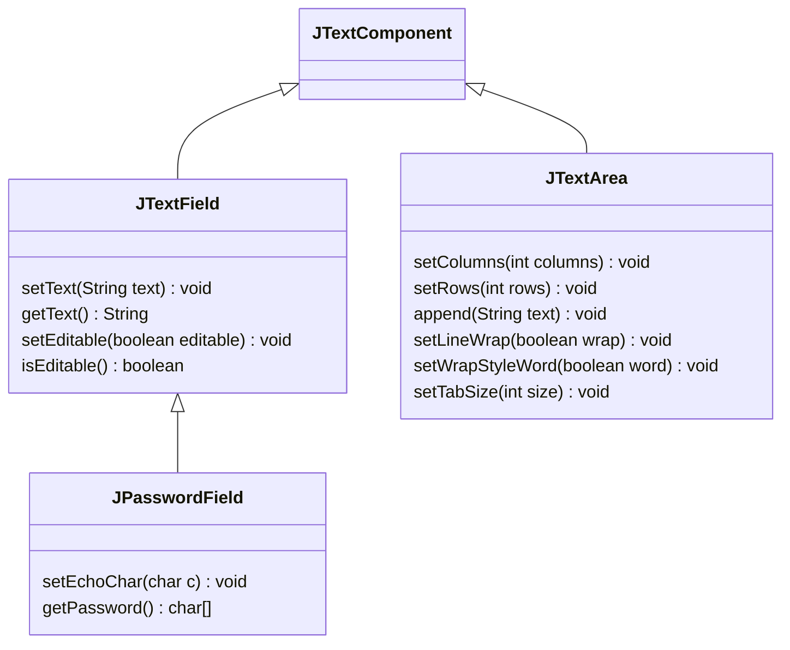
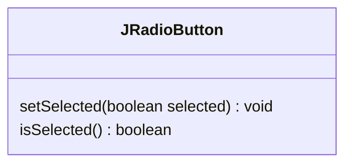
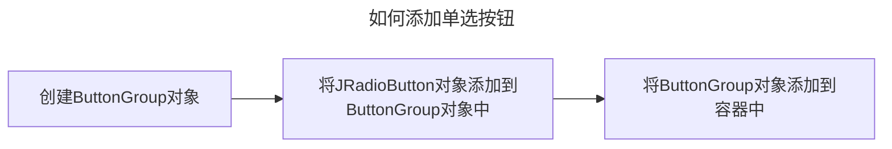
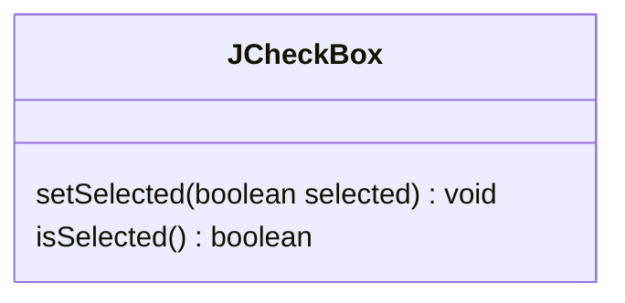

---
tags:
  - 编程语言
  - Java
---
Swing 用户界面组件
===

每个组件有三个要素：内容、外观、行为

## 布局管理器

```java
void setLayout(LayoutManager m)
Component add(Component c[, Object constraints])
```

### 边框布局

> JFrame 默认

```java
// BorderLayout(int hgap, int vgap)
frame.add(new JButton("North"), BorderLayout.NORTH);
frame.add(new JButton("South"), BorderLayout.SOUTH);
frame.add(new JButton("East"), BorderLayout.EAST);
frame.add(new JButton("West"), BorderLayout.WEST);
```

* 边框布局会扩展所有组件的尺寸以便填满可用空间
* 可能需要一个中间容器来把多个组件放在同一部分

### 流布局

> JPanel 默认

```java
FlowLayout(int align[, int hgap, int vgap])
// align = [LEFT|CENTER|RIGHT]
```

在一行上排布组件，若空间不足，开启新的一行

### 网格布局

```java
GridLayout(int rows, int cols[, int hgap, int vgap])
```

将容器按行列平均划分。从第一行第一列开始，由左至右，由上至下添加组件

## 文本输入


* 标签和标签组件 JLabel
    - `JLabel(String text[, int horizontalAlignment])`
* 文本区
    - 单行文本输入 `JTextField(String text[, int columns])`
    - 多行文本输入 `JTextArea(String text[, int rows, int columns])`
* 密码域 JPasswordField
    - `JPasswordField(String text[, int columns])`

## 选择组件

### 单选按钮 JRadioButton

`JRadioButton(String text[, boolean selected])`





```java
ButtonGroup group = new ButtonGroup();

JRadioButton small = new JRadioButton("Small", false);
group.add(small);

JRadioButton medium = new JRadioButton("Medium", true);
group.add(medium);

// ...
```

### 复选框 JCheckBox

`JCheckBox(String text[, boolean selected])`



### 菜单栏 JMenuBar

#### 创建菜单栏

```java
JFrame f = new JFrame("test1");
JMenuBar mb = new JMenuBar();
f.setJMenuBar(mb); // (1)
```

1. 设置 `JFrame` 对象 `f` 的菜单栏为 `mb` 对象

#### 创建菜单，添加到菜单栏中

```java
JMenu m1 = new JMenu("menu 1");
JMenu m2 = new JMenu("menu 2");
// ...
mb.add(m1);
mb.add(m2);
// ...
```

#### 创建菜单项，加入到菜单中

```java
JMenuItem mi1 = new JMenuItem("item 1");
mi1.setActionCommand("item 1");
m1.add(mi1);
// ...
```

#### 注册事件监听器

```java
m1.addActionListener(new MenuListener(){
    public void actionPerformed(ActionEvent e){
        // 判断 e.getActionCommand() 的值
    }    
})
```

#### 使用分隔线

`addSeparator()`

#### 定义访问键

`setMnemonic(String key)`

### 组合框 JBomboBox

当用户单击这个组件时，选择列表就会下拉出来，供用户选择

```java
faceCombo = new JComboBox<>();
faceCombo.addItem("item1");
faceCombo.addItem("item2");
// ...
```

### 滑动条 JSlider

让用户可以从一组离散值（数值等）中进行选择

```java
JSlider slider = new JSlider(int direction, int min, int max, int initialValue);
// 垂直滚动条：direction = SwingConstants.VERTICAL
```

* 获取当前值 `getValue()`
* 设置显示标尺 `setPaintTicks(boolean b)`
    - 标记值 `setMajorTickSpacing(int n)`
    - 次标记值 `setMinorTickSpacing(int n)`
* 设置显示标签 `setPaintLabels(boolean b)`
* 强制对齐 `setSnapToTicks(boolean b)`

### 弹出式菜单 JPopupMenu

不固定在菜单栏中随处浮动的菜单

```java
JPopupMenu popup = new JPopupMenu();

JMenuItem cut = new JMenuItem("Cut");
item.addActionListener(...);
popup.add(cut);
item.setEnabled(true);  // 设置启用菜单项
// ...

popup.show(panel, x, y);  // 将其显示出来

component.setComponentPopupMenu(popup); // 绑定到组件上
```

### 工具栏 JToolBar

```java
JToolBar bar = new JToolBar();
bar.add(new JButton("Button 1"));
// ...
```

#### 工具提示 tooltip

光标在某个按钮上停留片刻时，会出现工具提示文本

```java
button.setToolTipText("Button 1");

exitAction.putValue(Action.SHORT_DESCRIPTION, "Exit");
```

## 对话框

### 消息对话框

#### JOptionPane

* 对话框类型（静态方法）
    - 显示消息并等待用户点击 OK：`showMessageDialog()
        * 无返回值
    - 显示消息并等待用户点击 OK 或 Cancel：`showConfirmDialog()`
        * 返回表示被选项的整数
        * 底部允许的按钮类型有 `DEFAULT_OPTION`、`YES_NO_OPTION`、`YES_NO_CANCEL_OPTION`、`OK_CANCEL_OPTION` 四种
    - 显示消息并等待用户输入字符串：`showInputDialog()`
        * 返回用户输入的字符串
    - 显示消息并等待用户在一组选项的选择：`showOptionDialog()`
        * 返回表示被选项的整数
* 图标类型
    - `ERROR_MESSAGE`
    - `INFORMATION_MESSAGE`
    - `WARNING_MESSAGE`
    - `QUESTION_MESSAGE`
    - `PLAIN_MESSAGE`，无图标

#### JDialog


### 文件对话框 JFileChooser

```java
JFileChooser chooser = new JFileChooser();
chooser.setCurrentDirectory(new File(".")); // 设置当前目录
chooser.setSelectedFile(new File("test.txt")); // 设置默认文件名
// chooser.setMultiSelectionEnabled(true); // 允许多选
// chooser.setFileSelectionMode(JFileChooser.DIRECTORIES_ONLY); // 只允许选择目录
int result = chooser.showOpenDialog(parent); // 显示对话框 
// 或 chooser.showDialog(parent, "Select")
String filename = chooser.getSelectedFile().getPath(); // 获取用户选择的文件名
chooser.setFileFilter(new FileNameExtensionFilter("Image files", "jpg", "gif", "png")); // 设置文件过滤器
```

### 颜色对话框 JColorChooser

```java
Color selected = JColorChooser.showDialog(parent, title, initialColor);
// 或无模式对话框
chooser = new JColorChooser();
dialog = JColorChooser.createDialog(
        parent, 
        "Background Color",
        false,
        chooser,
        event -> setBackground(chooser.getColor()),
        null
);
```