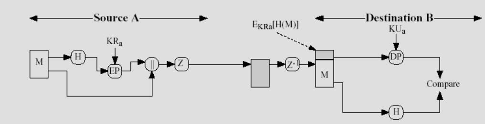
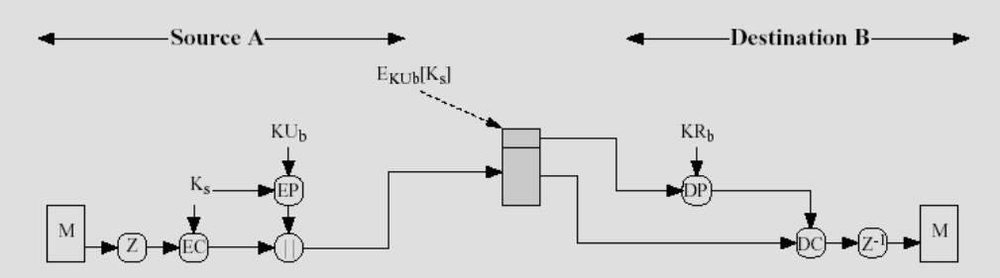
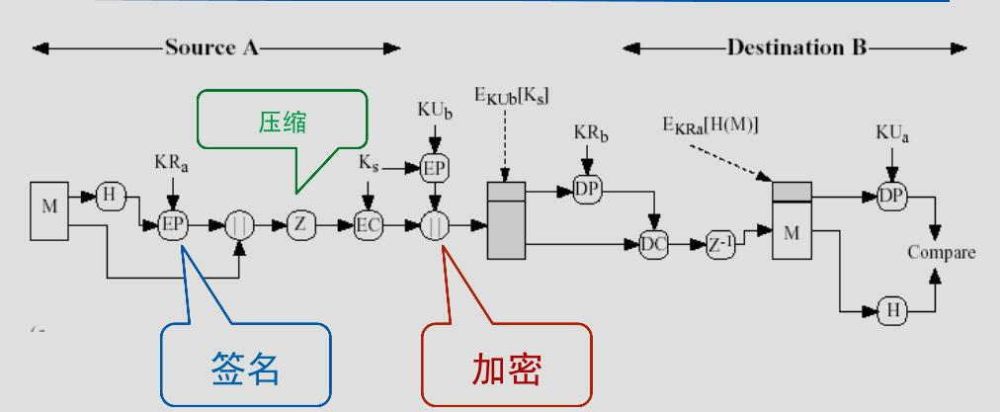
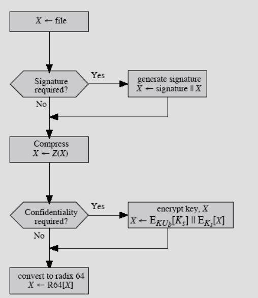
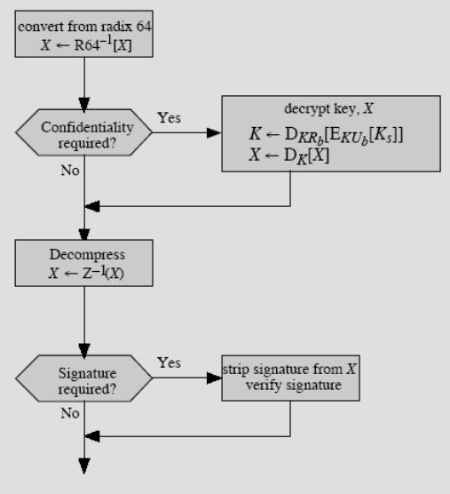
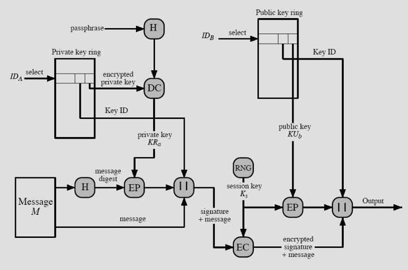
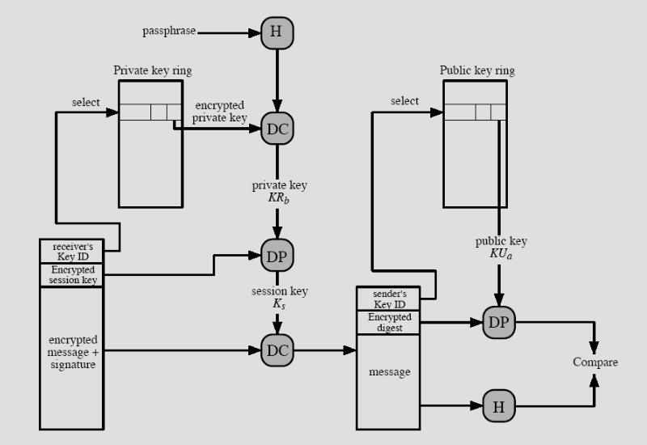

应用安全（PGP为例）
===

!!! tip ""
	应用安全不是简单的“加和”，要多多关注“应用”与“安全”的交集

## PGP

!!! tip "什么是PGP"
	Pretty Good Privacy，安全邮件系统，由菲利普·齐默曼（Philip R. Zimmermann）开发

* 为电子邮件和文件存储应用提供了认证和保密性服务
* 可以自己选择安全性算法，加密、散列算法
* 免费提供，完全开源，兼容性强
* 应用广泛

### PGP的功能

!!! summary "PGP算法中涉及到的符号"
	Ks：常规加密中的会话密钥
	KRa：公开密钥系统中用户A的私有密钥
	KUa：公开密钥系统中用户A的公开密钥
	EP：公开密钥加密
	DP：公开密钥解密
	EC：常规加密
	DC：常规解密
	H: 散列函数
	||：串接操作(并置)
	Z：使用ZIP算法进行压缩
	R64: 基数为64的ASCII格式转换

* 数字签名（与认证）
	
	- 发送者创建报文
	- 使用SHA-1生成报文的160位散列码
		* SHA-1的强度保证了签名的有效性
	- 使用<strong>发送者</strong>的<strong>私有密钥</strong>，用RSA算法对散列码加密(签名)，并置在报文前面
		* RSA强度保证了发送方身份
	- 接收者使用<strong>发送者</strong>的<strong>公开密钥</strong>，用RSA解密和恢复散列码
	- 接收者计算报文的散列码，与解密得到的进行比较，如果两者匹配，则报文通过鉴别
	- 签名也可以使用DSS/SHA-1来生成
		* PGP也支持分离的数字签名
* 消息加密
	
	- 发送方随机生成Session Key加密消息M
	- 采用CAST-128(或IDEA或3DES)对报文加密
	- 采用RSA，使用<strong>接收者</strong>的<strong>公开密钥</strong>加密会话密钥，并置到报文前面
	- 接收者采用RSA，用<strong>自己</strong>的<strong>私钥</strong>解密和恢复<strong>会话密钥</strong>
	- 接收者使用会话密钥解密报文
	- 可以使用Diffie-Hellman算法生成会话密钥
	- 用公钥算法解决了会话密钥的单向分发问题

!!! tip "保密与验证的结合"
	
	发送者先用<strong>自己的私钥</strong>签名，然后用<strong>会话密钥</strong>加密消息，再用接收者的公钥加密会话密钥。

	!!! faq "压缩位置的选择"
		Q：为什么先签名，再压缩？
		A：不需要为检验签名而保留压缩版本的消息，保证压缩一致性。
		Q：为什么先压缩，再加密？
		A：加密压缩过的报文可以加强加密的强度，因为冗余减少，密码分析更加困难

* 压缩：ZIP
	- 压缩有利于在电子邮件传输和存储时节省空间
* 邮件兼容性：Radix-64
	- PGP提供把原始8位二进制流转换成可打印ASCII字符的服务
	- 采用Radix-64转换，每三个字节的二进制数据为一组映射成四个ASCII字符，附加CRC校验
		* 报文长度增加了33%
* 数据分段
	- 电子邮件工具限制了消息的最大长度，超过这个长度必须分段
	- PGP自动将长消息分段使之可以通过电子邮件发送，分段在所有操作之后进行，包括基数64转换
	- 接收方剥去所有电子邮件头，按步骤重新组装
* 总结：PGP的一般过程
	
	
	- PGP消息的组成：会话密钥 + 签名 + 消息

### PGP密钥管理
* 四种密钥：公钥、私钥、一次性会话传统密钥、基于口令短语的传统密钥
	- 公钥和私钥：需要某种手段来标识，可能有多个公/私密钥对
	- 会话密钥：复杂的随机密钥生成算法
		* 以保证一定的真随机性
* 密钥标识符：KeyID（PGP采用公钥低64位）
	- 如何确认是哪一个公钥加密会话密钥
		* 将公钥一起传送
		* 将标识符与公钥关联，即用户ID和密钥ID标识一个密钥
	- PGP消息中包括两个KeyID，分别提供保密与认证功能。
* PGP密钥管理方案：密钥环

	=== "私钥环"
		* 存储本节点拥有的公钥/私钥对
		* 包括时间戳、KeyID、公钥、私钥、UserID
		* 私钥保存：口令短语散列码的一部分作为密钥加密私钥
	=== "公钥环"
		* 存储本节点所知道的其他用户的公钥
		* 包括时间戳、KeyID、公钥、对所有者信任度、用户ID、密钥合法度、签名、对签名者信任度
		* 用户ID：公钥拥有者，同KeyID一起可作为索引

!!! summary "总结：带有密钥环管理的PGP过程"

	=== "发送方"
		

		* 签名
			- 从私钥环中得到私钥，利用userid作为索引
			- PGP提示输入口令短语，恢复私钥
			- 构造签名部分
		* 加密
			- PGP产生一个会话密钥，并加密消息
			- PGP用接收者userid从公钥环中获取其公钥
			- 构造消息的会话密钥部分

	=== "接收方"
		

		* 解密
			- PGP用消息的会话密钥部分中的KeyID作为索引，从私钥环中获取私钥
			- PGP提示输入口令短语，恢复私钥
			- PGP恢复会话密钥，并解密消息
		* 验证
			- PGP用消息的签名部分中的KeyID作为索引，从公钥环中获取发送者的公钥
			- PGP恢复被传输过来的消息摘要
			- PGP对于接收到的消息作摘要，并与上一步的结果作比较

#### 公钥管理
- 由于PGP重在广泛地在正式或非正式环境下的应用，所以它没有建立严格的公钥管理模式
- 带来的问题：
	* 私钥泄漏后果严重
	* 公钥环包含的公钥可能是错误的，可以通过以下方式解决：
		- 物理上得到B的公钥。可靠，但有一定局限性
		- 通过电话验证公钥
		- 从双方都信任的个体D处获得B的公钥
		- 从一个信任的CA中心得到B的公钥
- 信任模型
	* Key legitimacy field：合法性或者有效性，表明PGP对“此用户公钥是合法的”的信任程度；信任级别越高，这个userID与该公钥的绑定越强。这个字段是由PGP计算的。
	* 每一个公钥项都有一个或者多个签名，这是公钥环主人收集到的、能够认证该公钥项的签名。每一个签名与一个signature trust field关联，表明这个PGP用户对“签名人对公钥签名”的信任程度。Key legitimacy field 是由多个signeture trust field导出的。
	* Owner trust field：表明该公钥被用于签名其它公钥证书时的信任程度。这个信任程度是由用户给出的
- 公钥注销：由私钥主人签发密钥注销证书，传播越快越好

## PGP用途
* 密钥管理——PGPKeys软件
	- 生成新的密钥对
	- 导出、导入
	- 指定信任关系
	- 保存和备份
	- 改变私钥的访问口令
* 邮件发送——PGP Encrypt
* 其他功能
	- 网络功能：个人防火墙、VPN、网络传输
	- 文件、当前窗口内容、剪贴板内容加解密、签名认证
