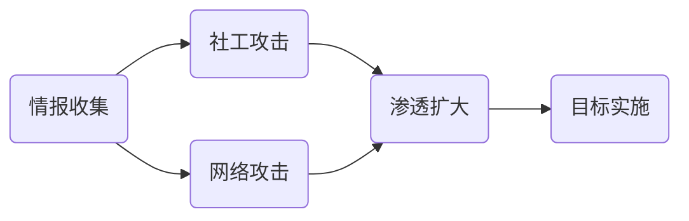
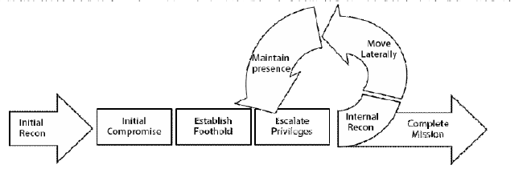
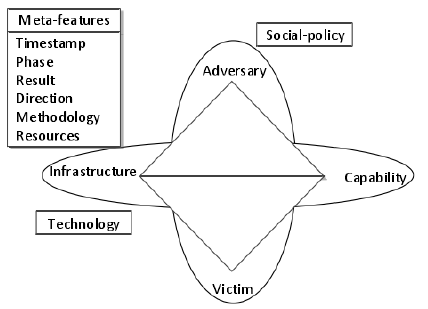
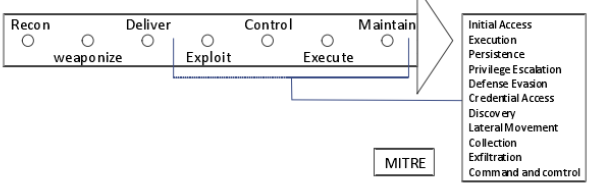
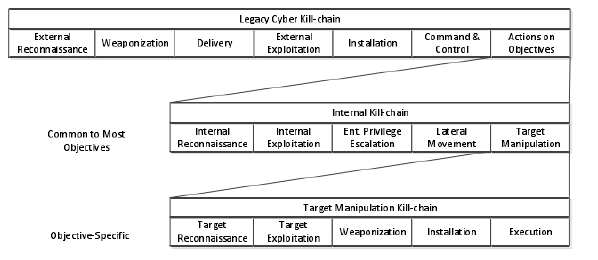
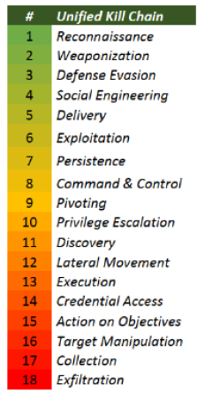
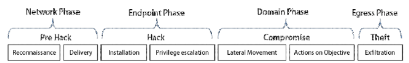
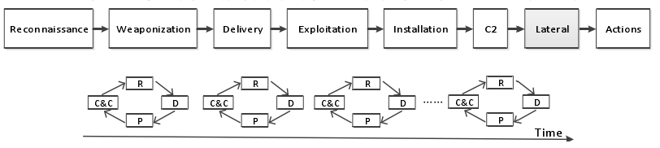

---
tags:
  - 网络安全
---
APT攻击
===

!!! summary "NIST给出的APT定义(2011)"
    APT是一种新兴的安全威胁手段，攻击者掌握先进的专业知识和丰富有效的资源，通过多种攻击途径实现在特定组织的信息技术基础设施创建立足点，以窃取机密信息，破坏或阻碍任务、计划或组织的关键环节。此外，APT会长时间重复地为实现其目标而努力，能够不断适应防御者并产生抵抗能力，并为了达到目标维持必需的交互和更新。

## APT实例
### Aurora极光
!!! info ""
    极光是首个对企业的APT攻击

* 目标：以Google为代表的高科技企业，窃取Gmail用户信息、Google等公司的登录凭据
* 技术细节：利用了1个0day漏洞，3个（恶意）文件，1个系统服务和6个（恶意）URL

### Stunex震网
!!! info ""
    震网被称为第一个网络空间战武器

* 目标：伊朗核电设施。改写了其中工业控制系统的代码，使其按照攻击者意图操作
* 技术细节：利用了4个0day漏洞，2个SCADA漏洞，3个RootKit和2个数字签名
* 恶意代码从U盘被拷贝入设施内网

## APT生命周期




!!! info ""
    APT攻击非常注重痕迹的消除，藏匿处理持续整个生命周期

* 特点
    1. 目标明确
    2. 策略清晰
    3. 手段多样
    4. 周期漫长
    5. 过程复杂
* 多种攻击手段的混合利用
* 传统安全工具无法有效检测APT攻击
    - 微观角度上，难以发现
    - 宏观角度上，攻击过程难以还原
    - 还有很多其他因素，难以发现，多被忽略
* 关联分析：将具有共同特征的数据统一处理

## 网络攻击链模型CKC(Cyber Kill Chain)
* Lockhead Martin[2011]
    ```mermaid
    %% c2 is for control
    flowchart LR
    Reconnaissance-->Weaponization-->Delivery-->Exploitation-->Installation-->C2-->Actions
    ```
    - 由洛克希德·马丁公司提出
    - 每个攻击链阶段都代表一个渗透指标IoC

* Mandiant
    <figure markdown>
    
    <figcaption>Mandiant攻击生命周期模型</figcaption>
    </figure>
    * 侧重于描述攻击者的内部网络活动
    * 它将整个攻击生命周期定义为：初始侦察、初始攻击、建立立足点、提升权限、内部侦察、横向移动、保持存在、完成任务等阶段

* 钻石模型
    <figure markdown>
    
    <figcaption>钻石模型</figcaption>
    </figure>
    * 钻石模型的名字来源于它用来描述入侵事件的基本数据结构。钻石模型描述了一个对手在基础设施上部署一种能力来对受害者发起攻击。

* MITRE ATT&CK模型
    <figure markdown>
    
    <figcaption>MITRE ATT&CK模型</figcaption>
    </figure>
    * MITRE ATT&CK 模型是指对抗性战术、技术和常识(Adversarial Tactics, Techniques, and Common Knowledge)。此模型通常用于描述攻击者可能采取的行动，以支持分析攻击者在企业网络中的具体活动。
    * 这是一个更为详细的模型，它描述了 11 个战术阶段、 27 个具体环节和 200 多项关键技术

* Malone[Malone, 2016]
    <figure markdown>
    
    <figcaption>Malone模型</figcaption>
    </figure>
    * 这是一个扩展的攻击链模型，包括内部攻击链和目标操纵攻击链

* Unified[Pols, 2017]
    <figure markdown>
    
    <figcaption>Unified模型</figcaption>
    </figure>
    * 设计了一个统一的攻击链用于分析比较和防御网络攻击
    * 将攻击链进一步细化并拆分为 18 个步骤

* Bryant
    <figure markdown>
    
    <figcaption>Bryant模型</figcaption>
    </figure>
    * 包括 7 个攻击阶段
    * 攻击链的主要改进是增加了横向移动和外部渗出阶段

* Khan[Marc Liliberte, 2018]
    <figure markdown>
    
    <figcaption>Khan模型</figcaption>
    </figure>
    * 提出了一个认知和并发的网络攻击链模型，其在指挥控制阶段之后增加了横向阶段，强化了内部网络中中间节点之间的横向移动行为。
    * 不按实施的先后顺序区分，将整个模型视为一个循环过程，每个时间点对应于一个对象和一个模型，这些模型通过时间轴串联在一起

## APT检测方案
### 基于0day漏洞和恶意软件检测
主要技术：沙箱隔离，终端执行控制

!!! warning "恶意代码软肋"
    1. 必然要落在一个终端上
    2. 必然要在此中断运行
    3. 必须要接触敏感数据，有网络行为

=== "McAfee"
    * 启发式追踪

=== "FireEye"
    * 多维沙箱，虚拟执行

=== "金山"
    * 私有云安全系统，保护主机文件

### 基于大数据分析
主要技术：大数据存储，应用和文件还原，数据关联性分析，建模是为了画出攻击图

=== "RSA Security"
    * 大数据检测策略，搜集日志信息和原始流量

=== "AT&T Security Research Center"
    * 基于上下文的大数据检测。
