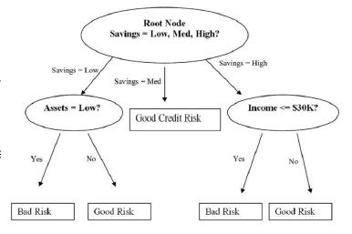

网络攻击的特征
===
## 数据集介绍
### KDD Cup
* 国际知识发现和数据挖掘竞赛[^1]
* KDD Cup 1999年主题：入侵检测[^2]
	- 攻击分为四类：probing（扫描探测）、DoS（拒绝服务）、U2R（未授权本地超级用户访问）、R2L（未授权远程访问）
    - DoS攻击又分为六种：Back、Land、Neptune、Pod、Smurf、Teardrop
    - 拥有大约4GB的TCP dump数据，500万条连接数据，是累计七周的网络流量

	??? info "基于kNN的入侵检测分类方法"
		1. 计算样本与训练集各个样本的距离
		2. 找到最近的k个邻居
		3. 如果超过k/2是Ak类，则认为样本集属于Ak类
		4. 否则选最大的Ap作为类别
		5. 都不满足，则为新类型

## 分析方法
### 降维
降维就是一种对高维度特征数据预处理方法。降维是将高维度的数据保留下最重要的一些特征，去除噪声和不重要的特征，从而实现提升数据处理速度的目的。

!!! success "优点"
    1. 数据集更易使用
    2. 降低计算开销
    3. 去除噪声
    4. 结果更易理解

### 降维算法

!!! summary ""
    奇异值分解(SVD)、主成分分析(PCA)、因子分析(FA)、独立成分分析(ICA)都是常见的降维算法

    * PCA与FA的对比

        |PCA|FA|
        |:--:|:--:|
        |||
        | $c=w_1(Y_1)+w_2(Y_2)+w_3(Y_3)+w_4(Y_4)$ | $Y_1=b_1*F+u_1$   $Y_2=b_2*F+u_2$   $Y_3=b_3*F+u_3$   $Y_4=b_4*F+u_4$ |

#### PCA
!!! summary "主成分分析在做什么"
    通过将原始变量转换为原始变量的线性组合(主成分)，在保留主要信息的基础上，达到简化和降维的目的

* 特点
    - 主成分是原始变量的线性组合
    - 主成分的数量相对于原始数量更少
    - 主成分保留了原始变量的大部分信息
    - 主成分之间相互独立

* PCA 的主要思想是将 $n$ 维特征映射到 $k$ 维上，这 $k$ 维是全新的正交特征，也被称为主成分，是在原有 $n$ 维特征的基础上重新构造出来的 $k$ 维特征 。

* 算法实现(基于特征值分解协方差矩阵，数据集 $X=\{x_1,x_2,\cdots ,x_n \}$ )
    1. 去平均值(即去中心化)，即每一位特征减去各自的平均值。
    2. 计算协方差矩阵 $\dfrac{1}{n}XX^T$
    3. 用特征值分解方法求协方差矩阵 $\dfrac{1}{n}XX^T$ 的特征值与特征向量
    4. 对特征值从大到小排序，选择其中最大的 $k$ 个。然后将其对应的 $k$ 个特征向量分别作为行向量组成特征向量矩阵 $P$ 。
    5. 将数据转换到 $k$ 个特征向量构建的新空间中， 即 $Y=PX$

* 实验：IRIS数据集(3种花，150条数据，特征为花瓣/花萼的长度和宽度)[^3]

#### FA
!!! summary "因子分析在做什么"
    通过研究众多变量之间的内部依赖关系，探求观测数据的基本结构，并用少数几个假想变量因子来表示原始数据

* 特点
    - 因子个数远远少于原始变量个数
    - 因子并非原始变量的简单取舍，而是一种新的综合
    - 因子之间没有线性关系
    - **因子具有明确解释性，可以最大限度地发挥专业分析的作用**。这个与主成分分析做对比，主成分分析只要求方差大

* 每个原始变量存在一个内部的“隐变量”

* 实验：bfi2010(25个有关个性的问题，内部与5个隐藏特征有关)[^4]
    - 这五个隐藏特征又称为“大 5 人格模型”

### 网络攻击的模型解释
随着模型越来越复杂，模型的透明性在下降。我们需要一个方法来理解这些模型

#### 全局角度
* 二分类/0-1分类：Logistic Regression(LR)
    - 使用一个线性拟合函数 $f(x)$ ，在外层套上一个Sigmold函数，其表达式如下

    $$
    P=\frac{1}{1+\mathrm{e}^{-(a+bX)} } \quad (x=a+bX)
    $$

    - 解优化方程，找出使损失函数(描述预测的值与真实值差距的函数)值最小的 $w$ 值，其表达式如下

    $$
    \begin{align}
    J(\theta )&=-\dfrac{1}{m} \sum_{i=1}^{m} [y^{(i)}\log (h_\theta (x^{(i)}))+(1-y^{(i)})\log (1-h_\theta (x^{(i)}))] \\
    其中，
    f_{w,b}(x)&=\sigma (\sum_{i}^{}w_ix_i+b ) \\
    \sigma (z)&=\frac{1}{1+ \mathrm{e}^{-z}}
    \end{align}
    $$

* LightGBM贡献度
    - LightGBM 是基于决策树的 boosting 算法

    <figure markdown>
    { loading=lazy }
    <figcaption>关于评价借款风险高低的决策树</figcaption>
    </figure>

    - boosting 算法使用多个模型组合来预测

        !!! note "Ensemble methods"
            集成算法的核心就是训练多个弱分类器，将多个弱分类器集合在一起，组成一个强分类器

        - 对抗过拟合：Bagging(Bootstrap Aggregating)，一般用于强分类模型
            * 可减少模型的方差
        - Boosting，一般用于弱分类模型
            * 每一个新的模型是从上一个模型的分类错误的结果中进行学习
        - Stacking，训练一个新的模型来合并每一个模型的预测值

        !!! summary "对于Bagging/Boosting的比较"
            | |单个模型|Bagging|Boosting|
            |:-----:|:-----:|:-----:|:------:|
            |分类器数量|单一分类器|多个分类器|多个分类器|
            |训练集使用|使用整个训练集|会对于每一个模型在训练集中进行随机抽样|增加上一个模型误分类样本的权重|
            |训练情况|只训练一个模型|可平行训练|按照顺序训练|
            |权重使用|直接使用权重|平均权重|计算每一个模型的权重|

#### 局部角度

=== "Saliency Map[^5]"
    给一张图片 $I_0$，对应的分类是 $c$，有一个模型给出图片 $I_0$ 的概率值是 $S_c(I)$ ，我们想要衡量 $I_0$ 的某个像素点对分类器 $S_c(I)$ 的影响

    $$
    \begin{align}
    S_c(I)
    \begin{cases}
       = w_c^TI+b_c \quad &S_c(I)是一个线性模型 \\
      \approx  w^TI+b \quad &S_c(I)是一个复杂模型
    \end{cases}
    \end{align}
    $$

    * 对于复杂模型，其中的 $W$ 就是模型 $S_c(I)$ 对 $I$ 的导数
    * 最终要计算出 $W$ 的值

=== "LIME[^6]"

=== "SHAP[^7][^8][^9]"

[^1]: 官方网站 https://www.kdd.org/kdd-cup
[^2]: 数据集下载 http://kdd.ics.uci.edu/databases/kddcup99/kddcup99.html
[^3]: http://www.lac.inpe.br/~rafael.santos/Docs/CAP394/WholeStory-Iris.html
[^4]: https://vincentarelbundock.github.io/Rdatasets/doc/psych/bfi.html
[^5]: Simonyan K, Vedaldi A, Zisserman A. Deep inside convolutional networks: Visualising image classification models and saliency maps[J]. arXiv preprint arXiv:1312.6034, 2013.
[^6]: Ribeiro, Marco Tulio, Sameer Singh, and Carlos Guestrin . “Why should I trust you?: Explaining the predictions of any classifier.” Proceedings of the 22nd ACM SIGKDD international conference on knowledge discovery and data mining. ACM (2016).
[^7]: Lundberg SM, Lee SI (2017), “Consistent feature attribution for tree ensembles”, presented at the 2017 ICML Workshop on Human Interpretability in Machine Learning (WHI 2017), Sydney, NSW, Australia (https://arxiv.org/abs/1706.06060)
[^8]: Lundberg SM, Lee SI (2017), “ A Unified Approach to Interpreting Model Predictions ”, Neural Information Processing Systems (NIPS) 2017 (https://arxiv.org/abs/1705.07874)
[^9]: Lundberg, Scott M., et al. "Explainable machine learning predictions for the prevention of hypoxaemia during surgery." Nature Biomedical Engineering 2.10 (2018):749.
