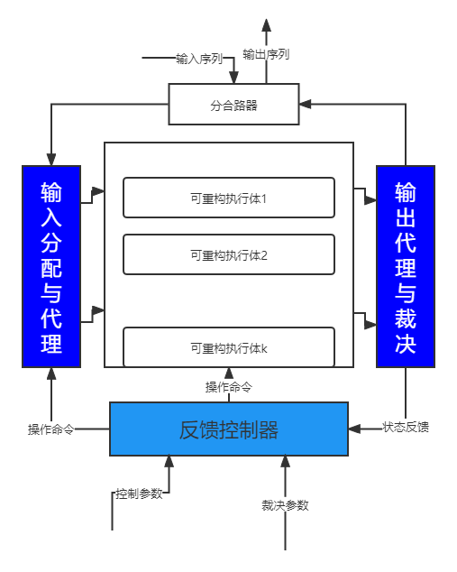

---
tags:
  - 网络安全
---
内生安全与拟态防御
===
## 拟态伪装
<figure markdown>
{ width="350" }
<figcaption>拟态括号单向联系机制</figcaption>
</figure>
### 基础理论与原理
* 生物内生的拟态行为成为拟态伪装(Mimic Disguise,MD)
* 相对正确公理
> 人人都存在这样或那样的缺点，但极少出现独立完成同样任务时，多数人在同一个地方、同一时间、犯完全一样错误的情形
* 四个基础理论：异构冗余可靠性理论、闭环反馈鲁棒控制理论、信通编解码理论、可靠性验证测试理论

- 技术特征
    * 基础：广义控制架构DHR
    * 源自构造的内生效应

    `非特异性效应`
    :    源自拟态括号对多模输出矢量实施的策略代判决功能。

    `视在的测不准效应`
    :    这是拟态伪装机制与 DHR 架构融合产生的特有构造效应。

    `问题场景自动规避效应`
    :    拟态括号内某个执行体防御场景一旦被攻击，基于后向验证的鲁棒控制反馈机制能效应拟态括号内某个执行体防御场景。

    `指数量级安全增益`
    :    拟态括号内的抗攻击性和可靠性指标与系统架构运作机理强相关。

    `拟态括号漏洞的免疫效应`
    :    拟态括号因为采用严格的单向联系机制，使输入分配与代理、输出代理与裁决、反馈控制环节中的漏洞不可达或难以利用。

### 拟态防御体系
网络空间拟态防御体系包括概念、规模和模型

`概念`
:    概念指一个结构化概念集合。CMD 概念包括功能等价可重构或软件可定义执行体、拟态防御界、拟态括号和相关核心机制等。

`规则`
:    规则告诉我们如何使用概念。CMD 的规则包括目标对象外部服务请求必须依据设定策略分发给各执行体，多模输出矢量必须依据给定策略进行裁决输出，执行体的多维动态重构和调度也必须依据反馈策略操作等。

`模型`
:    模型描述如何使用上述概念和规则指导 CMD 系统的设计。CMD 的模型就是拟态化的 “I[P]O” 模型。

* 基本特征
    1. 基于相对正确公理的威胁感知机制
    2. 基于动态异构冗余形态的广义鲁棒控制构造
    3. 基于拟态伪装思想的略裁决、策略调度和多维动态重构负反馈控制机制
    4. 拟态防御内生构造效应可验证，抗攻击性与可靠性可量化设计可度量验证。

## 结构
=== "DRS"
    非相似余度构造(Dissimilar Redundancy Structure, DRS)

    <figure markdown>
    { loading=lazy width="300" }
    <figcaption>DRS结构示意</figcaption>
    </figure>

    * 独立开发的装置或模块发生共性设计缺陷导致共模故障的情况属于小概率事件

=== "DHR"
    异构冗余体制称为动态异构冗余构造 (Dynamic Heterogeneous Redundancy,DHR)

    <figure markdown>
    { loading=lazy width="300" }
    <figcaption>DHR结构示意</figcaption>
    </figure>

=== "MB"
    输入代理和多模表决器也称为"拟态括号" (Mimic Bracket)

    <figure markdown>
    { loading=lazy width="300" }
    <figcaption>IPO模型</figcaption>
    </figure>

    * 拟态括号内通常是一个符合 IPO 模型的防护目标之集合(规模或粒度不限)
    * 拟态括号限定的保护范围称为拟态防御界 (Mimic Defense Boundary, MDB)，简称拟态界

## 抗攻击建模
* 使用GSPN（General Stochastic Petri Net，广义随机 Petri 网[^1]）建立非冗余架构。
* 可用概率 (Availability Probabilities, AP)：系统处于正常服务状态的概率。
* 逃逸概率 (Escape Probabilities, EP)：系统处于输出错误输出矢量状态的概率
* 非特异性感知概率 (Nonspecific Awareness Probabilities, NSAP)：系统处于通过裁决发现部分执行体与其他执行体有不一致输出矢量状态的概率。
* 漏洞后门休眠状态概率 (Dormancy Probabilities, DP)：系统的漏洞后门未能被攻击者利用处于休眠状态的概率。
* 降级/失效概率 (Failure or degradation Probabilities, FP)：在抗攻击性方面，对非冗余和非相似余度系统而言，指系统处于无输出状态的概率。

## 应用：基于拟态防御的Web服务器[^2]
<figure markdown>
{ loading=lazy width="300" }
<figcaption>拟态构造的Web服务器系统架构</figcaption>
</figure>

* 基于 Web 服务器的层次结构，在物理操作系统层、虚拟化层、服务器软件层、应用脚本层和数据层实现拟态防御模型

<figure markdown>
{ loading=lazy width="300" }
</figure>

[^1]: Petri网由Carl Adam Petri于1962年在他的博士论文中提出，是理论计算机科学包括自动机模型和形式语言理论的一个分支。Petri网用四个元素为系统建模，分别是：place/Transition/arc/token。
[^2]: 软件学报ISSN 1000 9825 拟态防御 Web 服务器设计与实现，拟态构造的Web 服务器异构性量化方法
