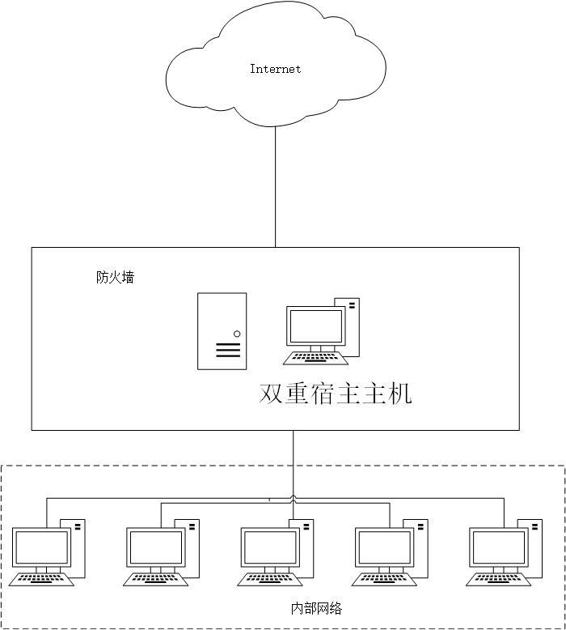
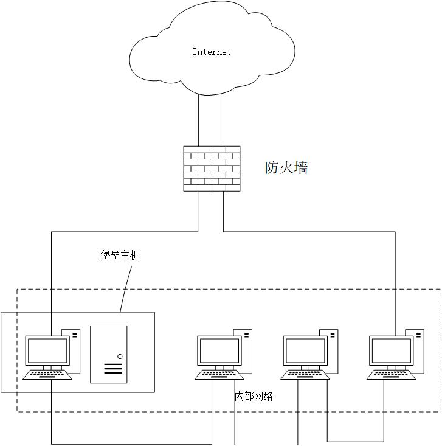
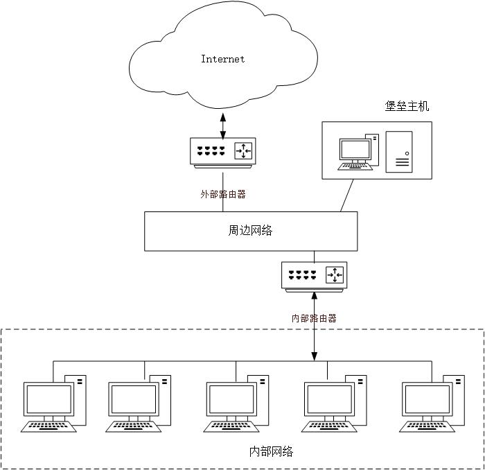
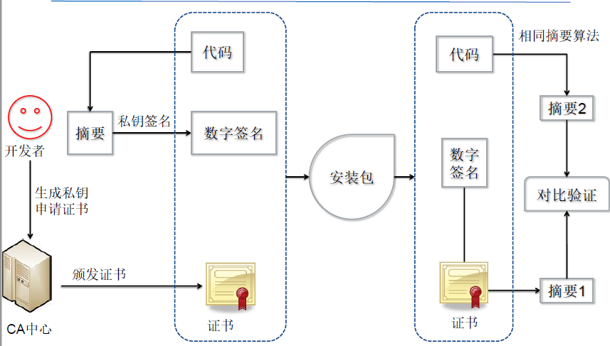
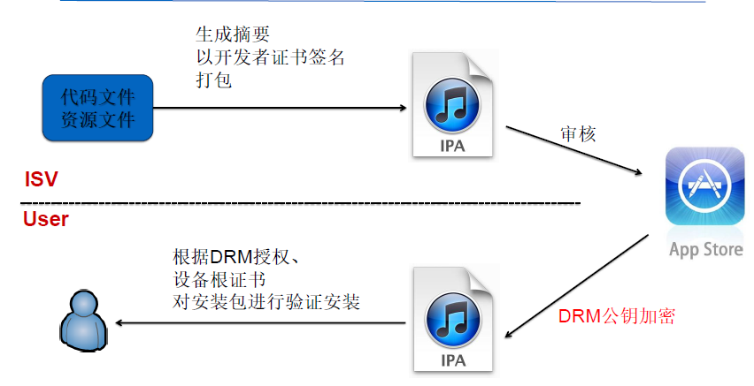
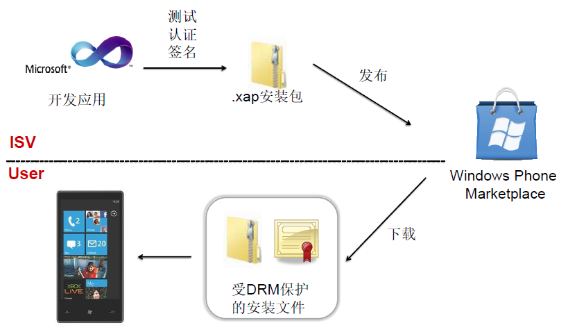

---
tags:
  - 网络安全
---
防火墙
===
## 访问控制
- 系统对用户身份及其所属的预先定义的策略组限制其使用数据资源能力的手段。

### 访问控制三要素

主体(Subject)
: 提出访问资源的具体请求

客体(Object)
: 被访问资源的实体

策略(Attribution)
: 主体对客体的相关规则集合

### 实施原则

最小特权原则
: 主体执行操作时，按照主题所需权利的最小化原则分配给主体权力。

最小泄露原则
: 主体执行任务时，按照主体所知道的信息最小化的原则分配给主体权力。

多级安全策略
: 主体与客体间的数据流向和权限控制按照安全级别分为TS，S，C，RS，U五级：绝密级别（Top Secret），秘密级别（Secret），机密级别（Confidential），限制级别（Restricted）和无级别级（Unclassified）

??? info "主体对客体的访问方式"
	1. 向下读（rd，read down）：主体安全级别高于客体信息资源的安全级别时允许查阅的读操作；
    2. 向上读（ru，read up）：主体安全级别低于客体信息资源的安全级别时允许的读操作；
	3. 向下写（wd，write down）：主体安全级别高于客体信息资源的安全级别时允许执行的动作或是写操作；
	4. 向上写（wu，write up）：主体安全级别低于客体信息资源的安全级别时允许执行的动作或是写操作。

### 访问控制模型
* 自主访问控制模型（DAC）
	- 允许合法用户以用户或用户组的身份访问策略规定的客体，同时阻止非授权用户访问客体。
	- 一般采用访问控制矩阵和访问控制列表来存放不同主体的访问控制信息
* 强制访问控制模型（MAC）
	- 一种多级访问控制策略，系统先对访问主体和受控对象的安全级别属性进行比较，再决定访问主体能否访问该受控对象。
	- Lattice模型（实现安全分级）
		* 每个资源和用户都服从于一个安全类别。这些安全类别我们称为安全级别。
		* 在整个安全模型中，信息资源对应一个安全类别，用户所对应的安全级别必须比可以使用的客体资源高才能进行访问。
	- Bell-LaPadula模型（1976,保密性 → 军事系统）
		* 无上读，无下写
	- Biba模型（1977,完整性）
		* 禁止向上写，没有向下读
	- RBAC Model（基于角色）
		* 从控制主体的角度出发，根据管理中相对稳定的职权和责任来划分角色，将访问权限与角色相联系。
		* RBAC0 = User + Role + Session（一个用户和一组激活的角色） + Permission
			* 用户分配（User Assignment)，用户集合到角色集合的多对多映射。
			* 权限分配（Permission Assignment）权限集合到角色集合的多对多映射。
		* RBAC1 = RBAC0 + 角色继承
			* 角色层次（RH，Role Hierarchy）反映层次结构，支持成员和权限继承以方便权限管理。
		* RBAC2 = RBAC0 + 约束
			* 约束是角色之间及角色与权限之间的一种限制关系。
			* 不同的约束规则：
				- 互斥角色：角色静态互斥是限制某些角色不能同时分配给一个用户，角色动态互斥是一个用户开始会话，不能同时激活某些角色。
				- 基数约束：可以限制一个角色可以分配的最大和最小用户数。
				- 先决角色：用户为获得某些高级角色必须先拥有低等级角色。
				- 会话约束：限制仅在特定会话中才允许激活某个角色，还可以限制一个用户在同一时间可以激活的会话数量。
				- 等级约束：限制角色的层次不能超过多少层。
		* RBAC3 = RBAC0 + 角色继承 + 约束
	- TBAC Model（基于任务）
		* 对象的访问权限控制并不是静止不变的，而是随着执行任务的上下文环境发生变化。
		* 由工作流、授权结构体、受托人集、许可集四部分组成。
* 模型实现
	* 访问控制表（ACLs）
		- 以文件为中心建立的访问权限表
	* 访问控制矩阵（ACM）
		- 通过矩阵形式表示访问控制规则和授权用户权限的方法
		- 对每个主体而言，都拥有对哪些客体的哪些访问权限；而对客体而言，又有哪些主体对他可以实施访问
	* 访问控制能力列表（ACCLs）
		- 以用户为中心建立访问权限表

		!!! note "能力"
			能力是访问控制中的一个重要概念，它是指请求访问的发起者所拥有的一个有效标签(ticket)。

	* 访问控制标签列表（ACSLLs）
		- 限定一个用户对一个客体目标访问的安全属性集合

		!!! note "标签"
			安全标签是限制和附属在主体或客体上的一组安全属性信息。


## 防火墙
- 传统意义：防止火从大厦的一部分传播到另一部分
- 定义：位于两个(或多个)网络间实施网间访问控制的一组组件的集合

	!!! warning "防火墙应满足的条件"
		* 所有进出被保护网络的通信必须通过防火墙
		* 所有通过防火墙的通信必须经过安全策略的过滤或者防火墙的授权
		* 防火墙自身应对渗透(penetration)免疫

- 必要性：保护内部不受Internet的攻击
- 功能
	1. 访问控制
		* 服务控制
			能访问什么
		* 方向控制
			哪些特定的服务请求可以发起并允许通过防火墙（访问“方向”）
		* 用户控制
			谁可以访问，谁不可以访问
		* 行为控制
			怎么访问
	2. 应用程序代理
	3. 用户认证
	4. VPN
	5. 日志
	6. NAT
	7. IDS与报警
	8. 内容过滤
- 局限性：无法做到绝对的安全
- 分类
	* 形态：软/硬件防火墙
	* 实现技术：包过滤防火墙、应用网关防火墙、代理防火墙、状态检测防火墙、电路级网关
	* 部署位置：主机/网络防火墙

### 防火墙技术
* 包过滤防火墙
	- 对所接收的每一个数据包做允许、拒绝的决定
	- 分为静态包过滤和动态包过滤两类

		!!! info "静态包过滤和动态包过滤的区别"
			* 静态包过滤 ~ 单个数据包，根据固定的规则和每个包头的信息
			* 动态包过滤 ~ 捕获一个“连接”，是一段会话（Session）

	- 原理：防火墙拆开数据包，根据策略处理并作出相应的操作
		* 过滤依据主要是TCP/IP报头里面的信息，不能对应用层数据进行处理

* 电路级网关
	- 是一个通用代理服务器
	- 工作于OSI互联模型的会话层或是TCP/IP协议的TCP层
	- 不能抵御应用层攻击
	- 实现：简单重定向
* 应用网关（AGF）
	- 在应用层处理信息
	- 对数据也做解析
	- 先验证用户身份
* 状态检测防火墙
	- 在动态包过滤防火墙基础上，增加了状态检测机制
	- 具有连接的跟踪能力
	- 结合前后数据包里的数据信息进行综合分析决定是否允许该包通过
* 网络地址翻译（NAT）
	* NAT的意义
		- 解决IP地址空间不足问题

			!!! hint "三种解决方式"
				多对一（多个内部网址对应1个IP地址）、一对一（简单翻译）、多对多（地址池）

		- 向外界隐藏内部网结构

	* NAT的三种类型
		- 静态NAT
			* 内部网络每个主机都永久映射成外部合法的地址
		- NAT池
			* 在外部网络中定义了一系列合法地址，采用动态分配的方法映射到内部网络
		- 端口NAT
			* PNAT：把内部地址映射到外部网络的一个IP地址的不同端口上

			!!! info "虚拟IP模式"
				相同的Untrusted IP，不同端口对应不同的Trusted IP

### 防火墙的结构
* 双重宿主主机体系

	{ loading=lazy }

	- 围绕双重宿主主机构成，双重宿主主机至少有两个网络接口
	- 网络间的通信可通过应用层数据共享和应用层代理服务的方法实现。一般情况下采用代理服务的方法。

	!!! fail "缺点"
		双重宿主主机是隔开内外网络的唯一屏障，一旦它被入侵，内部网络便向入侵者敞开大门。

* 屏蔽主机体系

	{ loading=lazy }

	- 由防火墙和内部网络的堡垒主机承担安全责任。
		* 一般这种防火墙较简单，可能就是简单的路由器。
	- 典型构成：包过滤路由器＋堡垒主机

	!!! success "优点"
		安全性更高，双重保护：实现了网络层安全（包过滤）和应用层安全（代理服务）。

	!!! fail "缺点"
		过滤路由器能否正确配置是安全与否的关键。如果路由器被损害，堡垒主机将被穿过，整个网络对侵袭者是开放的。

* 屏蔽子网体系

	{ loading=lazy }

	- 本质上与屏蔽主机体系结构一样，但添加了额外的一层保护体系——周边网络。
		* 堡垒主机位于周边网络上，周边网络和内部网络被内部路由器分开。
	- 结构：堡垒主机-外部路由器-内部路由器
		* 壁垒机运行各种代理程序
			- 入站服务必须经过壁垒主机
		* 访问路由器（外部路由器）
			- 作用：保护周边网络和内部不受不受外部网络的侵犯。
		* 阻塞路由器（内部路由器）
			- 作用：保护内部网络不受外部网络和周边网络的侵害，它执行大部分过滤工作。

	!!! success "优点"
		1. 入侵者需突破3个不同的设备才能入侵内部网络。
		2. 只对外通告DMZ区的网络，保证内部网络不可见。
		3. 内部网络用户通过堡垒主机或代理服务器访问外部网络。

	??? info "其他结构"
		(1) 合并“非军事区”的外部路由器和堡垒主机结构
		(2) 合并内部路由器和堡垒主机结构
		(3) 合并DMZ的内部路由器和外部路由器结构
		(4) 两个堡垒主机和两个非军事区结构
		(5) 牺牲主机结构
		(6) 使用多台外部路由器的体系结构

## 应用实例
### iptables
* 与Linux内核集成的包过滤工具，Iptables信息包过滤系统由两个组件netfilter和Iptables组成。
	- netfilter组件也被称为“内核空间”
	- 数据包沿链传播
		* 路径
			- 进入本机
                ```mermaid
                flowchart LR
                    PREROUTING链 --> INPUT链 --> OUTPUT链 --> POSTROUTING链
                ```
			- 转发
                ```mermaid
                flowchart LR
                    PREROUTING链 --> FORWARD链 --> POSTROUTING链
                ```

	!!! note "iptables中的规则表和规则链"
		- 主要的规则表有四个，分别是mangle表、filter表、nat表和raw表
			* mangle表主要用来修改数据包；
			* filter表是专门过滤包的；
			* nat表的主要用处是网络地址转换，做过NAT操作的数据包的地址就被改变了，当然这种改变是根据我们的规则进行的；
			* raw表主要用作数据跟踪处理。
		- 主要的规则链有五个，分别是：
			* INPUT——进来的数据包应用此规则链中的策略；
			* OUTPUT——外出的数据包应用此规则链中的策略；
			* FORWARD——转发数据包时应用此规则链中的策略；
			* PREROUTING— —对数据包作路由选择前应用此链中的规则；
			* POSTROUTING——对数据包作路由选择后应用此链中的规则。

* 命令：`iptables [-A|-I 链][-io 网卡接口][-p 协议][-s 源ip/网段][-d 目标ip/网段] [-j 操作]`
	- `-AI` 链：针对某条链进行规则的“插入”或“添加”（影响规则生效顺序）
		* `-A`：新增加一条规则
		* `-I`：插入一条规则
	- `-io` 网络接口：`-i`：进入口 `-o`：传出口
	- `-p` 协议：tcp或udp或icmp或all
	- `-s` 源IP/网段：设置此规则的数据包来源地址，可以是IP，也可以是一个网段
	- `-d` 目标IP/网段：同`-s`一样，只是这里指的是目标IP/网段
	- `-j`后接操作，主要有接受ACCEPT，丢弃DROP和记录LOG
* 保护例子
	- 拒绝其他主机访问本机Telnet服务（TCP 23端口）：`iptables -A INPUT -p tcp --dport 23 -j DROP`
	- 防御SYN Flood：`iptables -A FORWARD -p tcp --syn -m limit --limit 1/s -j ACCEPT`
	- 防御ping of death拒绝服务攻击：`iptables -A FORWARD -p icmp --icmp-type echo-request -m limit --limit 1/s -j ACCEPT`
	- 防御端口扫描(Furtive port scanner)：`iptables -A FORWARD -p tcp --tcp-flags SYN,ACK,FIN,RST RST -m limit --limit 1/s -j ACCEPT`

	!!! warning ""
		iptables的检测存在延迟——需要使用`--limit`和`--limit-burst`

### 应用控制
<!--for 手机恶意应用-->
* 手机系统恶意应用的防止，需要可靠的应用发布机制保障
* 目前常见的控制方法：代码签名和DRM(数字版权管理)

    === "代码签名"
        { loading=lazy }

    === "DRM"

* 应用发布流程

    === "安卓应用发布流程"

    === "iOS应用发布流程"
        <figure markdown>
        { loading=lazy }
        <figcaption>iOS应用发布流程示意</figcaption>
        </figure>

    === "Windows Phone应用发布流程"
        <figure markdown>
        { loading.lazy }
        <figcaption>Windows Phone应用发布流程示意</figcaption>
        </figure>

### 单点登录(SSO)[^1]
!!! summary ""
    在多个应用系统中，用户只需要登录一次就可以访问所有相互信任的应用系统

* 要点在于存储信任以及验证信任上

=== "使用Cookie"

    ```mermaid
    sequenceDiagram
        User->>System: Login
        activate System
        activate User
        System->>User: Generate Cookie
        deactivate System
        User->>Subsystem: request session
        activate Subsystem
        Subsystem->>Subsystem: verify cookie
        Subsystem->>User: request success
        deactivate User
        deactivate Subsystem
    ```

    !!! fail "缺点"
        1. Cookie不够安全，源代码泄露更是可以伪造特定用户身份
        2. 不能跨域免登录

=== "使用JSONP"

    ```mermaid
    sequenceDiagram
        User->>System: Login
        activate System
        activate User
        System->>User: Login success
        deactivate System
        User->>Subsystem: request session
        activate Subsystem
        Subsystem->>+System: access JSONP interfaces
        System->>-Subsystem: return encrypted credentials
        Subsystem->>Subsystem: verfiy credentials
        Subsystem->>User: request success
        deactivate User
        deactivate Subsystem
    ```

    !!! fail "缺点"
        虽然解决了跨域问题，但依然可以伪造父应用，以登录特定用户

=== "使用页面重定向"

    ```mermaid
    sequenceDiagram
        User->>System: Login
        activate System
        activate User
        System->>User: Login success
        deactivate System
        User->>Subsystem: request session
        activate Subsystem
        Subsystem->>+System: redirect request
        System->>System: check if user has logged in
        System->>-Subsystem: redirect response with token
        Subsystem->>Subsystem: verfiy token
        Subsystem->>User: request success
        deactivate User
        deactivate Subsystem
    ```

### 边界控制
> 解决溢出漏洞，需要进行边界控制

=== "ASLR"
    * 对堆、栈、共享库映射等布局的随机化，增加攻击者预测目的地址的难度

=== "DEP"
    * 数据执行保护，是一套软硬件技术，阻止恶意代码插入与执行
    * 具体来说，DEP将阻止应用程序从标记为NX的内存位置执行代码

=== "SafeSEH"
    * 检验异常函数的有效性，不可靠会阻止其调用

### 手机权限控制
<!-- title: 常见的android手机权限 -->
| 值(android.permission.*) | 说明 |
|:---:|:---:|
| INTERNET | 访问网络 |
| ACCESS_FINE_LOCATION | 通过GPS获取位置 |
| BLUETOOTH | 使用蓝牙 |
| CALL_PHONE | 拨打电话 |
| PROCESS_OUTGOING_CALLS | 获得打出电话状态 |
| READ_CONTACTS | 读取联系人 |
| READ_SMS | 读取短信 |
| RECEIVE_SMS | 接收短信 |
| SEND_SMS | 发送短信 |

* Android的权限授予

    ```mermaid
    flowchart TD
    A("配置文件、代码资源等")-->B("提取、解析Permisson")-->C(为Package分配UID)
    C-->D(建立PackageSetting数据结构)-->E(Package轮询对Permission授权)
    ```

### 网络隔离技术
* 防火墙：保障互联互通的情况下，尽可能安全
* 物理隔离：保证必须安全的前提下，尽可能互联互通
	- 安全要求
		1. 物理传导上隔断内外网
		2. 物理辐射上隔断内外网
		3. 物理存储上隔断内外网
	- 实现原理
		1. 数据二极管技术
		2. 存储池交换技术
* 网络隔离技术分类
	- 第一代隔离技术：完全的隔离
	- 第二代隔离技术：硬件卡隔离
	- 第三代隔离技术：数据转播隔离
	- 第四代隔离技术：空气开关隔离
	- 第五代隔离技术：安全通道隔离（网闸技术）

[^1]: https://www.jianshu.com/p/613e44d4a464
