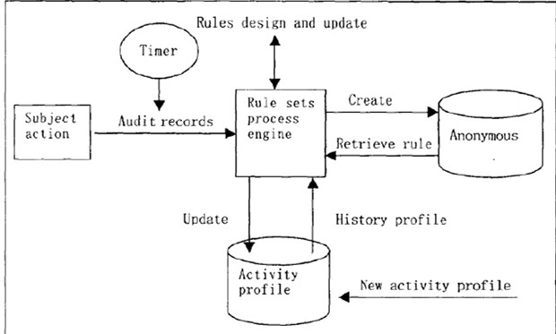

---
tags:
  - 网络安全
---
入侵检测（IDS）
===
## 入侵检测技术

??? info "IDS的含义"
	入侵检测系统——Intrusion Detection System

!!! important "需要IDS的意义"
	1. <a href="#intrusion">入侵</a>很容易
	2. <a href="firewall">防火墙</a>也不是绝对的安全

### 概念
* <a name="intrusion"></a> 入侵
	- 是未经授权蓄意尝试访问信息、窜改信息，使系统不可靠或不能使用的行为。
	- 企图破坏计算机资源的完整性、机密性、可用性、可控性
	- 入侵者：发出命令（人or计算机）
	- 系统性很强
* 入侵检测
	- 是一种主动保护自己的网络和系统免遭非法攻击的网络安全技术。
	- 是从计算机网络或计算机系统中的若干关键点搜集信息并对其进行分析，从中发现网络或系统中是否有违反安全策略的行为和遭到袭击的迹象的一种机制。
* 入侵检测功能
	- 监控、分析用户和系统活动
	- 发现入侵企图或异常现象
	- 记录、报警和响应
	- 审计系统的配置和弱点、评估关键系统和数据文件的完整性等
### 入侵检测分类

=== "原始数据的来源"

	=== "基于主机系统结构：HIDS"
		- 目标主要是主机系统和系统本地用户
		- 原理：根据主机的审计数据和系统的日志发现可疑事件
		- 可以运行在被检测的主机或单独的主机上

		!!! summary "HIDS的优点和缺点"
			优点 | 缺点
			:--: | :--:
			性能价格比高|IDS的运行影响服务器的性能
			细腻性，审计内容全面|HIDS依赖性强，依赖于审计数据或系统日志准确性和完整性，以及安全事件的定义。
			视野集中|如果主机数目多，代价过大
			适用于加密及交换环境|不能监控网络上的情况


	=== "基于网络系统结构：NIDS"
		- 原理：根据网络流量、协议分析、单台或多台主机的审计数据检测入侵

		!!! summary "NIDS的优点和缺点"
			优点 | 缺点
			:--: | :--:
			服务器平台独立性|不能检测不同网段的网络包
			配置简单|很难检测复杂的需要大量计算的攻击
			众多攻击标识|难以处理加密会话
			-|协同工作能力弱

=== "检测原理"

	=== "异常入侵检测"
		- 异常检测模型：总结正常操作应该具有的特征（用户轮廓），当用户活动与正常行为有重大偏离时即被认为是入侵
		- 典型算法：统计分析
			* 依据系统中特征变量的历史数据建立统计模型，并运用该模型对特征变量未来的取值进行预测和检测偏离
			常用的模型：神经网络、多元模型等

		!!! summary "异常检测技术的优缺点"
			优点 | 缺点
			:--: | :--:
			可以检测未知的入侵|漏报、误报率高
			可以检测冒用他人帐号的行为|统计算法的计算量大、效率低
			具有自适应、自学习功能|统计点的选取和参考库的建立很困难
			不需要系统先验知识|-

	=== "误用入侵检测"
		- 通过某种方式预先定义入侵行为，然后监视系统，从中找出符合预先定义规则的入侵行为
		- 典型算法：专家系统、模型推理、完整性分析
			* 专家系统：将有关入侵的知识转化为if-then结构的规则，即将构成入侵所要求的条件转化为if部分，将发现入侵后采取的相应措施转化成then部分
			* 模型推理：结合攻击脚本推理出入侵行为是否出现
			* 完整性分析：通过检查系统的当前系统配置，诸如系统文件的内容或者系统表，来检查系统是否已经或者可能会遭到破坏

		!!! summary "误用检测技术的优缺点"
			优点 | 缺点
			:--: | :--:
			算法简单|被动
			系统开销小|模式库的建立和维护难
			准确率高|-
			效率高|-

	=== "其他检测技术"
		- 完整性分析：通过检查系统的当前系统配置，来检查系统是否已经或者可能会遭到破坏
		- 计算机免疫技术：通过正常行为的学习来识别不符合常态的行为序列
		- 数据融合：针对一个系统中使用多个和(或)多类的传感器这一特定问题展开的一种新的数据处理方法
		- 遗传算法：利用若干字符串序列来定义用于分析检测的指令组，用以识别正常或者异常行为的这些指令在初始训练阶段中不断进化，提高分析能力
		- 模糊证据理论
		- 基于数据挖掘的检测方法：利用分析工具在大量数据中提取隐含在其中且潜在有用的信息和知识
			* 关联、序列、聚类分析

=== "体系结构"

	=== "集中式"
		- 多个分布于不同主机上的审计程序，一个入侵检测服务器
		- 缺陷：对于大规模的分布式攻击，中央控制台的负荷将会超过其处理极限，这种情况会造成大量信息处理的遗漏，导致漏警率的增高

	=== "等级式"
		- 定义了若干个分等级的监控区域，每个IDS负责一个区域，然后将当地的分析结果传送给上一级IDS

	=== "分布（协作）式"
		- 将中央检测服务器的任务分配给多个基于主机的IDS，这些IDS不分等级，各司其职，负责监控当地主机的某些活动
		- 协作：每个agent监控整个网络信息流的一个小的方面。有些情况下，可能需要数个agent一起涵盖可能入侵的所有方面

=== "工作方式"

	=== "离线检测"
		非实时工作系统，在事件发生后分析审计事件，从中检查入侵事件。

	=== "在线检测"
		对网络数据包或主机的审计事件进行实时分析，可以快速反应，保护系统的安全；但系统规模较大时，难以保证实时性

## 入侵检测结构（CIDF）

??? info "CIDF的含义"
	Common Intrusion Detection Framework，由DARPA于1997年3月开始着手制定。

* 四要素

	=== "事件产生器(Event Generators)"
		* 从整个计算环境中获得事件，并向系统的其他部分提供此事件
		* 获取：系统日志、应用程序日志、系统调用、网络数据、用户行为、其他IDS的信息……

    === "事件分析器(Event analyzers)"
		* 分析得到的数据，并产生分析结果
		* 是核心，效率高低决定IDS性能

    === "响应单元(Response units)"
		* 对分析结果作出反应的功能单元

    === "事件数据库(Event databases)"
		* 存放各种中间和最终数据的地方

* Denning模型（1987）
	
	- 主体(Subjects)：在目标系统上活动的实体，如用户。
	- 对象(Objects)：指系统资源，如文件、设备、命令等。
	- 审计记录(Audit records)：由主体、活动(主体对目标的操作)、异常条件(系统对主体的该活动的异常情况的报告)、资源使用状况(系统的资源消耗情况)和时间戳(Time-Stamp)等组成。
	- 活动档案(Active Profile)：即系统正常行为模型，保存系统正常活动的有关信息。
	- 异常记录(Anomaly Record)：由事件、时间戳和审计记录组成，表示异常事件的发生情况。
	- 活动规则(Active Rule)：判断是否为入侵的准则及相应要采取的行动。

??? info "IDWG"
	* IDWG = Intrusion Detection Work Group
	* 系统之间所用的工作方式，使用共享的数据格式、统一的通信规程
	* 草案：IDMEF(入侵检测消息交换格式），IDXP（入侵检测交换协议）

## 入侵检测部署
* 检测器部署位置
	- 放在边界防火墙之内
	- 放在边界防火墙之外
	- 放在主要的网络中枢
		* 监控大量的网络数据，可提高检测黑客攻击的可能性
	- 放在一些安全级别需求高的子网
		* 对非常重要的系统和资源的入侵检测

## 入侵检测实例
### Snort
* 典型的误用检测技术
* 基于攻击特征匹配的原理，准确度高，误报率低，无法检测未知攻击，需要准确定义检测规则

#### Snort规则编写
- 格式
	* 规则头

        === "规则动作"
            * 规则的头包含了定义一个包的who，where和what信息，以及当满足规则定义的所有属性的包出现时要采取的行动。规则的第一项是"规则动作"（rule action），"规则动作"告诉snort在发现匹配规则的包时要干什么。

            === "alert"
                使用选择的报警方法生成一个警报，然后记录（log）这个包

            === "log"
                记录这个包

            === "pass"
                丢弃（忽略）这个包

            === "activate"
                报警并且激活另一条dynamic规则

            === "dynamic"
                保持空闲直到被一条activate规则激活，被激活后就作为一条log规则执行

            * 你可以定义你自己的规则类型并且附加一条或者更多的输出模块给它，然后你就可以使用这些规则类型作为snort规则的一个动作
                ```conf
                # 创建一条规则，记录到系统日志和MySQL数据库
                ruletype redalert
                {
                type alert output
                alert_syslog: LOG_AUTH LOG_ALERT
                output database: log, mysql, user=snort dbname=snort host=localhost
                }
                ```

        === "协议"
            * 规则的下一部分是协议。Snort当前分析可疑包的ip协议有四种：tcp 、udp、icmp和ip。将来可能会更多，例如ARP、IGRP、GRE、OSPF、RIP、IPX等。

        === "IP地址"
            * 规则头的下一个部分处理一个给定规则的ip地址和端口号信息。关键字`any`可以被用来定义任何地址。Snort没有提供根据ip地址查询域名的机制。地址就是由直接的数字型ip地址和一个cidr块组成的。
            * 有一个操作符可以应用在ip地址上，它是否定运算符（negation operator）。这个操作符告诉snort匹配除了列出的ip地址以外的所有ip地址。否定操作符用`!`表示。
            * 你也可以指定ip地址列表，一个ip地址列表由逗号分割的ip地址和CIDR块组成，并且要放在方括号内`[` `]`。此时，ip列表可以不包含空格在ip地址之间。

        === "端口号"
            * 端口号可以用几种方法表示，包括"any"端口、静态端口定义、范围、以及通过否定操作符。
            * 除any端口外，端口否定操作符均可用"!"表示。

            === "any"
                是一个通配符，表示任何端口。

            === "静态端口定义"
                表示一个单个端口号，例如111表示portmapper，23表示telnet，80表示http等等。

            === "范围"
                用范围操作符":"表示，具体表现形式为`[min]:[max]`(包括`min`和`max`值)

        === "方向操作符"
            * 方向操作符`->`表示规则所施加的流的方向。方向操作符左边的ip地址和端口号被认为是流来自的源主机，方向操作符右边的ip地址和端口信息是目标主机
            * 双向操作符`<>`告诉snort把地址/端口号对既作为源，又作为目标来考虑。

        === "规则选项"
            * 所有的snort规则选项用分号";"隔开。规则选项关键字和它们的参数用冒号":"分开。

            ??? faq "snort的42个规则选项关键字"
                * snort中有42个规则选项关键字，它们的含义分别如下
                ```text
                msg - 在报警和包日志中打印一个消息。
                logto - 把包记录到用户指定的文件中而不是记录到标准输出。
                ttl - 检查ip头的ttl的值。
                tos 检查IP头中TOS字段的值。
                id - 检查ip头的分片id值。
                ipoption 查看IP选项字段的特定编码。
                fragbits 检查IP头的分段位。
                dsize - 检查包的净荷尺寸的值。
                flags -检查tcp flags的值。
                seq - 检查tcp顺序号的值。
                ack - 检查tcp应答（acknowledgement）的值。
                window - 测试TCP窗口域的特殊值。
                itype - 检查icmp type的值。
                icode - 检查icmp code的值。
                icmp_id - 检查ICMP ECHO ID的值。
                icmp_seq - 检查ICMP ECHO 顺序号的值。
                content - 在包的净荷中搜索指定的样式。
                content-list 在数据包载荷中搜索一个模式集合。
                offset - content选项的修饰符，设定开始搜索的位置 。
                depth - content选项的修饰符，设定搜索的最大深度。
                nocase - 指定对content字符串大小写不敏感。
                session - 记录指定会话的应用层信息的内容。
                rpc - 监视特定应用/进程调用的RPC服务。
                resp - 主动反应（切断连接等）。
                react - 响应动作（阻塞web站点）。
                reference - 外部攻击参考ids。
                sid - snort规则id。
                rev - 规则版本号。
                classtype - 规则类别标识。
                priority - 规则优先级标识号。
                uricontent - 在数据包的URI部分搜索一个内容。
                tag - 规则的高级记录行为。
                ip_proto - IP头的协议字段值。
                sameip - 判定源IP和目的IP是否相等。
                stateless - 忽略刘状态的有效性。
                regex - 通配符模式匹配。
                distance - 强迫关系模式匹配所跳过的距离。
                within - 强迫关系模式匹配所在的范围。
                byte_test - 数字模式匹配。
                byte_jump - 数字模式测试和偏移量调整。
                ```

	* 规则体
        - 规则体的作用是在规则头信息的基础上进一步分析，有了它才能确认复杂的攻击(Snort的规则定义中可以没有规则体)。规则体由若干个被分别隔开的片断组成，每个片断定义了一个选项和相应的选项值。一部分选项是对各种协议的详细说明，包括IP、ICMP和TCP协议，其余的选项是：规则触发时提供给管理员的参考信息，被搜索的关键字，Snort规则的标识和大小写不敏感选项。

- 规则实例

	=== "DoS 检测 —— Land"
		- 原理：一个特别打造的SYN包中的源地址和目标地址都被设置成某一个服务器地址，这时将导致接受服务器向它自己的地址发送SYN一ACK消息，结果这个地址又发回ACK消息并创建一个空连接，每一个这样的连接都将保留直到超时掉。
		- 检测方法：判断网络数据包的源地址和目标地址是否相同
			```text
			alert ip $HOME_NET any -> $HOME_NET any (msg:"DoS Land attack"; flags:S; flow:stateless; classtype:attempted-dos; sid:6001; rev:1; sameip)
			# 含义：过滤筛选ip数据包，来自本地地址的任意端口，发往本地地址的任意端口，在报警和包日志中打印“DoS Land attack”
			# flags 中的S代表SYN
			# sameip 关键字允许规则检测源 IP 和目的 IP 是否相等
			```
	=== "扫描检测 —— TCP NULL 扫描"
		- 原理：根据RFC 793，类Unix系统接收到没有设置任何标志位的数据包，端口关闭的情况下舍弃掉该数据包并且发送一个RST数据包，端口开放的话不会响应；而Windows系统不满足RFC 793，当收到该数据包的情况下，无论端口开放或者关闭，都会响应一个RST数据包给发送方
		- 检测方法：验证数据包中所有标志位是否都为0
			```text
			alert tcp $EXTERNAL_NET any -> $HOME_NET any (msg:"SCAN NULL"; flags:0; flow:from_client; classtype:attempted-recon; sid:6002; rev:1;)
			# 含义：过滤筛选tcp协议的数据包，来自外部网络的任意端口，发往本地的任意端口，并且 tcp 包标志位全部为0，在报警和包日志中打印“SCAN NULL”
			# Flow表示规则只应用到来自客户端的TCP数据包；规则类别标识是attempted-recon（Attempted Information Leak）
			```
	=== "漏洞利用检测 —— SQL 注入"
		- 原理：`#`可以注释掉SQL语句后面的一行SQL代码，相当于去掉了后面的where条件，而且前面的`1=1`永远都是成立的，即where子句总是为真，例如
		```sql
		select * from users where username='' or 1=1 #' and password=md5('xxxxx')
		```
		- 检测方法：验证数据包中的内容中是否存在"`#!sql 'or 1=1 #`"
			```text
			alert tcp $EXTERNAL_NET any -> $HOME_NET any (msg:"SQL Injection found"; flow :from_client，established; content :"’%20and%201=1#"; classtype:web-application-attack; sid:6003; rev:1;)
			# 含义：过滤筛选来自客户端的tcp数据包，来自外部网络的任意端口，发往本地的任意端口，并且包的净荷中含有“ ’% 20and%201=1#”，在报警和包日志中打印“SQL Injection found”
			# Flow表示规则只应用到已经建立的来自客户端的TCP连接
			```
    === "Web攻击检测 —— WEB-CGI"
        - 原理：WEB-CGI 攻击是对 `hsx.cgi` 脚本的目录遍历漏洞检测
        - 检测方法：查看 HTTP 请求中的 URL 是否包含 `hsx.cgi` 文件名，并检查数据区是否包含`../../`字串
            ```text
            alert tcp $EXTERNAL_NET any -> $HTTP_SERVERS $HTTP_PORTS(msg:"WEB CGI HyperSeek hsx.cgi directory traversal attempt"; flow:to_server,established ; content:"/hsx.cgi"; http_uri ; content:"../../"; content:"%00"; distance:1 ;metadata:service http; reference:bugtraq, 2314; reference: cve,2001-0253;reference:nessus,10602; classtype:web-application-attack;sid: 803; rev: 16)
            ```
    === "FTP服务攻击检测"
        - 描述：检测攻击者通过目标系统中的ftp 服务的安全漏洞实施的各种攻击行为，如用户口令猜测、使用空用户或超级用户登录、读取或修改一些特殊的系统文件的行为。
        - 检测方法：利用FTP 的 MDTM 命令的缓冲区溢出攻击 对 FTP 协议的 21 端口、包含MDTM 命令，命令参数以 14 个数字字节开始，以及一些`+` 或`-` 字符之后紧跟 48 字节以上的非空格数据进行检测分析
            ```text
            alert tcp $EXTERNAL_NET any --> $HOME_NET 21(msg:"FTP MDTM overflow attempt"; flow:to_server,established ; content:"MDTM"; nocase;isdataat:100 ,relative; pcre :"/^MDTM(?!\n)\s[^\n]{100}/smi"; metadata:policy balanced[ips drop, policy connectivity-ips drop, policy security-ips drop, service ftp; reference:bugtraq, 9751;reference:cve, 2001-1021; reference: cve,2004-0330;reference: nessus,12080 ;classtype:attempted-admin;sid:2546;rev: 10;)
            ```
    === "Telnet服务攻击检测"
        - 描述：检测攻击者通过目标系统中的telnet 服务的安全漏洞实施的各种攻击行为，如用户口令猜测、修改系统环境变量、缓冲区溢出攻击等行为
        - 检测方法：SGI telnet格式漏洞，通过检测数据流中是否包含 `"_RLD"` 与数据包负载中是否包含 `"bin/sh"` 进行检测。
            ```text
            alert tcp $EXTERNAL_NET any --> $TELNET_SERVERS 23 (msg:"TELNET SGI telnetd format bug"; flow:to_server,established ; content:"_RLD "; fast_pattern:only ;content:"bin/sh"; metadata:service telnet; reference:arachnids,304; reference:bugtraq, 1572 ; reference: cve,2000-0733 ; classtype:attempted-admin;sid:711;rev:13;)
            ```
