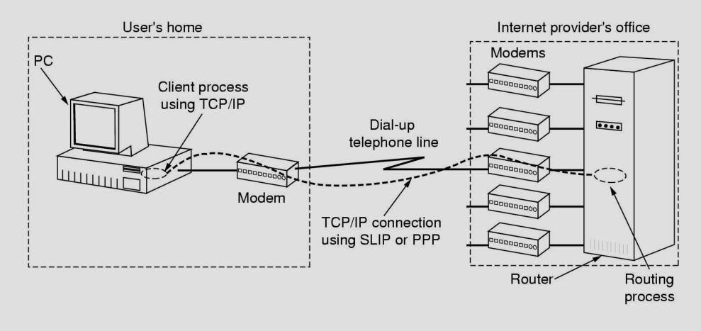
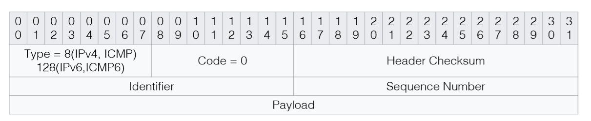
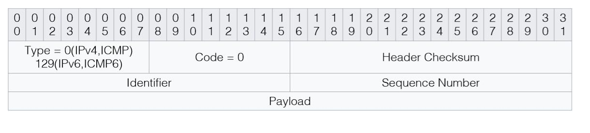
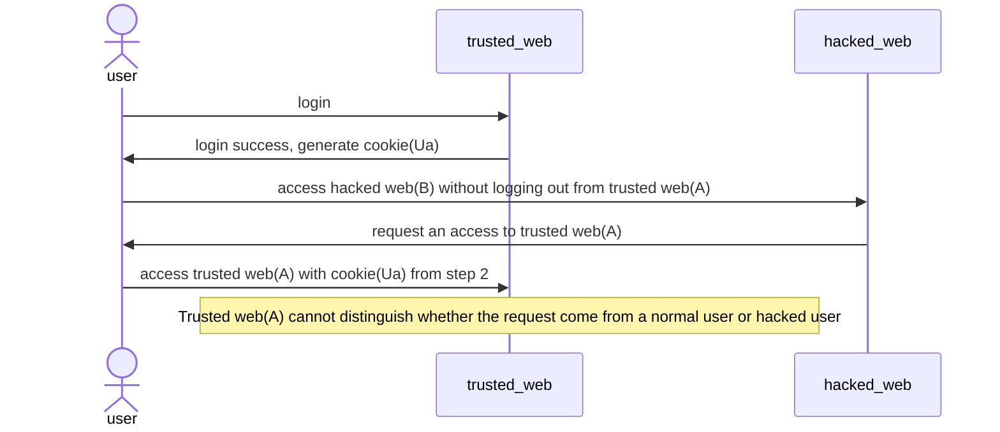

网络攻击
===
## 网络安全扫描
* 网络安全扫描是对计算机网络系统进行相关的安全检测，进而找出安全隐患和漏洞。
* 发现目标主机或网络 → 搜集目标信息

|    名称    |           方法            |        优点         |                      缺点                      |
|:--------:|:-----------------------:|:-----------------:|:--------------------------------------------:|
|  ICMP扫射  |    使用ICMP回显请求轮询目标主机     |       使用简单        |       速度较慢；如果目标关闭了对ICMP回显请求的响应，就不能被发现   |     
|  广播ICMP  | 发送ICMP回显请求到目标的网络地址或广播地址 |  使用简单，速度比ICMP扫射快  | 不能发现Windows主机；目标主机关闭ICMP请求会导致扫不到；可能造成扫描中的DoS |
| 非回显ICMP  |   发送其他类型的ICMP报文到目标主机    | 不受目标阻止ICMP回显请求的影响 |            某些类型的ICMP请求在探测目标时会受到限制            |
|  TCP扫射   |   发送TCP SYN/ACK到目标主机    |    最有效的目标发现方法     |            对入侵者而言，防火墙可能影响这种方法的可靠性            |
|  UDP扫射   |  发送UDP数据报到目标网络广播地址或主机   | 不受目标阻止ICMP回显请求的影响 |           可靠性低；对于非Windows目标主机，速度慢         |   

### 端口扫描
- 原理：向目标主机的TCP/IP服务端口发送探测数据包，并记录目标主机的响应，通过分析响应来判断服务端口是打开还是关闭，即可得知端口提供的服务或信息
	* 分类：全连接扫描、半连接扫描、秘密扫描
- 取得目标主机的开放端口和服务信息
	* 常用端口映射[RFC 1700](https://www.freesoft.org/CIE/RFC/1700/index.htm)
		- 21 & 20/tcp ~ FTP
		- 53/udp ~ DNS
		- 23/tcp ~ Telnet
		- 25/tcp ~ SMTP
		- 80/tcp ~ HTTP
		- 110/tcp ~ POP3
	* 但是，有在非标准端口处开设服务的可能性
- 过程：
	```mermaid
	flowchart LR
		start(发送数据到目标主机) --> id(从目标主机接收数据) --> id1(分析返回数据) --> id2(判断端口状态)
	```
- 常用扫描器：[Nmap](https://nmap.org/)和[Nessus](https://www.tenable.com/products/nessus)
- 扫描方法

	=== "全连接扫描"
		- TCP `connect()` 扫描
			* 调用`connect()`成功 → 端口在监听状态
			* 优点：迅速、准确、权限要求低；缺点：会留下大量扫描痕迹，容易被拦截
		- TCP 反向Ident扫描
			* ident协议（RFC 1413）允许看到TCP连接的任何进程的拥有者的用户名

    === "半连接扫描"
		- TCP SYN扫描
			* 发送SYN报文 → 看返回报文含有ACK+SYN（→ open）还是RST标志（→ closed）
			* 优点：隐蔽、速度快；缺点：构造SYN包权限要求高
		- IP ID头dumb扫描

    === "秘密扫描"
		- TCP FIN扫描
			* 发送FIN报文 → 没有回复（→ open）或含有RST标志（→ closed）
			* 仅UNIX TCP/IP协议栈有效
			* 变种：TCP NULL/TCP XMAS扫描
				- 向目标发送
					* NULL：所有标志位均为0
					* XMAS：URG/FIN/PSH报文
				- 接到RST包——目标相应端口关闭
			* 优点：隐蔽性好；缺点：数据包构造要求高，Windows系统不支持
		- TCP ACK扫描
			* 利用标志位ACK
			* 并非确定目标开启了哪些端口，而是用来：
				- 扫描防火墙的配置
				- 发现防火墙规则
				- 确定它们是有状态还是无状态的
				- 确定哪些端口是被过滤的
				- 确定防火墙是简单的包过滤还是状态检测机制
		- TCP 分段扫描
			* 拆分TCP头为小的数据包，包过滤器很难探测到
			* 优点：隐蔽性好，可以穿过防火墙；缺点：需要被丢弃，某些程序处理小数据包异常

	=== "其他扫描技术"
		- FTP反弹扫描
			* 通过代理FTP服务器扫描端口
			* 优点：难以跟踪，可以穿过防火墙；缺点：速度慢，代理功能可能被关闭
		- UDP ICMP端口不可到达扫描
			* 发送UDP数据包给目标机UDP端口，若及时收到“ICMP端口不可到达”，则目标端口为关闭状态
			* 若超时也未能接收到端口不可到达ICMP信息，则表明目标端口可能处于监听状态

- 漏洞扫描
	- 基于漏洞库的匹配法
		* 大部分为Web漏洞
	- 基于攻击性扫描的模拟黑客法

### 操作系统探测
- 目的：有针对性的评估目标机的安全性
- 主动探测技术
	* 标识攫取
		- 正常交互或抓取目标机上的任意文件
		- 优点：提供的大部分服务足以暴露目标机的身份；缺点：手动获取，效率低
	* 网络协议栈特征探测
		- ICMP、TCP报文响应分析，TCP报文延时分析
- 被动探测技术
	* 基于TCP/IP协议栈的被动指纹探测技术
		- TTL（生存时间，8位）、窗口大小、DF（分段标志，3位）、TOS（服务类型，8位）
	* 基于应用层协议的被动探测技术
		- Mail、Usenet、Web服务

### 漏洞检测
- 安全漏洞
	* 又称“脆弱性(vulnerability)”
	* 是硬件、软件或策略上存在的安全缺陷
	* 来源
		1. 软件或协议设计时的瑕疵
		2. 软件本身的瑕疵
		3. 系统和网络的错误配置
		4. 公开的漏洞信息
	* 发现与防御
		* 漏洞发现技术：基于主机、基于网络
		* 防御
			- 基于源码
				* 安全编写源码
				* 源码审计
			- 基于操作系统
				* 底层系统防护：SEH、GS、DEP、ASLR等
				* 系统安全管理
				* 主动防御
			- 漏洞信息发布机制
				* 注重实时性、检测粒度、发布方式
- 漏洞检测方法
	* 直接检测：使用针对漏洞特点设计的脚本或程序
	* 推断：寻找漏洞存在的证据
	* 带凭证的测试：将攻击者的权限提升至超级用户（目标）

### 网络协议安全
* 一些协议本身存在漏洞，这些漏洞是无法通过修改来弥补的。

    === "数据链路层"
        - <a href="#arp-attack">ARP</a>：中间人攻击、ARP欺骗、拒绝服务攻击
            * ARP请求以广播方式进行，可随意发送ARP应答包且无需经过认证
        - VLAN中继攻击
            * 思科设备在处理特定的VLAN中继协议（VTP）数据包的发生一个未知错误，利用这个漏洞可以发送一个定制的VTP数据包给一个思科的网络设备，可以导致系统重新加载，从而引起拒绝服务攻击（DoS）。
        - 生成树（STP）协议[^1]攻击

            ???+ help "STP Protocol"
                生成树协议主要应用于计算机网络中树形拓扑结构的建立，防止网络中出现环路。

            * 恶意黑客把一台计算机连接到不止一个交换机，然后发送网桥ID很低的精心设计的BPDU，就可以欺骗交换机，使它以为这是根网桥，这会导致STP重新收敛(reconverge)，从而引起回路，导致网络崩溃。

        - DHCP：耗竭攻击
            * 利用伪造的 MAC 地址来广播DHCP 请求的方式来进行如果所发出的请求足够多的话，网络攻击者就可以在一段时间内耗竭由 DHCP 所提供的地址空间。

    === "传输层"
        - TCP：TCP SYN Flood攻击、WinNuke攻击、TCP序列号预测攻击
            * RFC 5961引入了challenge ACK响应和TCP控制封包的速率限制。新的漏洞可让攻击者推断出互联网上任意两台主机之间是否使用了TCP连接进行通信，并且无需进行中间人攻击即可远程劫持会话
            ```mermaid
            sequenceDiagram
            participant c as cilent
            participant s as server
            c ->> s: SYN
            s ->> c: SYN + ACK
            c -x s: ACK
            ```

        - UDP：UDP洪水攻击

    === "网络层"
        - IP：IP地址欺骗、Land攻击、IP碎片攻击
    	- ICMP：ICMP重定向、淹没攻击
    	- RIP：IP松散源路径选项、路由信息伪造

    === "应用层"
        - SMTP：电子邮件炸弹、Spam DoS
        - FTP：FTP反弹漏洞、口令明文传送
        - <a href="#dns-attack">DNS</a>：没有认证机制、DNS欺骗或拒绝服务攻击

* 改进

	=== "数据链路层"
		* 增加了安全算法协商和数据加密/解密处理的功能和过程，通过密码技术保证数据机密性和完整性
		
        * 局域网安全协议
			1. IEEE 802.10标准(互操作局域网/城域网安全标准)
			    ```text
			    802.10帧结构
		    	 ---------------------------------------------
		    	|  Clear Header(CH)    | Protected Header(PH)|
		    	----------------------------------------------
		    	 802.10 LSAP + SAID + MDF    Source Address（从MAC 头中的源地址字段复制过来）
			       安全联盟标识符 管理定义(可选)
		    	 --------------------------------------------
		    	|  MAC帧头 |  802.10帧头 | Data      | ICV    |
		    	 --------------------------------------------
		    	               ↑
		    				   |

		    	不可否认性：PH中的源地址字段可防止其他节点冒充源节点
		    	完整性：ICV（用于数据完整性检查，以防止未经许可对内部数据的修改）
		    	机密性：加密（可对PH和ICV之间的数据进行加密）
		    	```

			2. 在LAN中，每种MAC帧都设有一帧校验序列（FCS）字段，用于对MAC帧的正确性和完整性检查。通常采用CRC校验，每种MAC协议本身具有一定的数据完整性检查能力
			3. 应用：SAID用于标识数据流所属VLAN
				* 但这时数据帧是不定长的，引起了兼容性问题
			4. 引申标准：IEEE 802.1P，IEEE 802.1D，IEEE 802.1Q
		* 广域网安全协议
			

			- PPP（点到点）协议
				```text
				 ------------------------------------
				| Protocol   | Payload(with padding) |
				 ------------------------------------
			    payload的协议类型（1~2个字节）
				```

				* PPTP本身没有提供安全保护措施，在隧道中传送的PPP数据包也没有加密保护，存在着信息可能被窃听和篡改的安全隐患

			- PAP（口令认证）协议

				* 是两次握手协议

    			??? info "过程"

    				1. 在建立PPP连接后，首先由被认证方向认证方发送PAP认证请求包，PAP认证请求中含有标识被认证身份的用户名和口令等认证信息

    				2. 认证方接收到PAP认证请求后，根据认证信息对被认证方的身份合法性进行认证，然后根据认证结果返回PAP认证确认包或PAP认证否认包

    				3. 如果认证方确认了被认证方的身份合法性，则认证过程结束，准备转入传输数据包。否则，重复进行上述的两次握手认证过程，直至确认了被认证方的身份合法性，或者重复一定次数后，认证方终止PPP连接

   				!!! bug ""

                    PAP在PPP连接上传送用户名和口令等认证信息时没有加密保护，以明文形式传送，容易被监听和窃取

			- CHAP（询问-握手）协议

				* 是三次握手协议

				* 密钥及其密码算法必须由通信双方事先约定

    				??? info "过程"

        				1. 在建立PPP连接后，首先由认证方向被认证方发送CHAP询问包，在CHAP询问包中含有标识符和询问值等信息。其中，询问值是由提供者随机产生的杂乱字节流，具有全局唯一性和不可预测性，以提高询问值的抗攻击能力

        				2. 被认证方接收到CHAP询问包后，根据CHAP询问包中的标识符和询问值，使用单向散列函数计算出响应值，并使用单密钥密码算法加密响应值，然后通过CHAP响应包传送给对方，以证明自己的身份

        				3. 认证方接收到CHAP响应包后，将返回的响应值和期望的响应值进行比较。如果两者相同，则说明对方的身份是合法的，继续维持PPP连接；否则，说明对方的身份不是合法的，认证方将终止PPP连接。

			- PPTP（点到点隧道）协议

				1. 控制连接

					* 用于传送PPTP呼叫控制和管理信息。目的端口为1723，源端口可以是任意空闲的端口号（在PAC（PPTP访问集中器）和PNS（PPTP网络服务器）之间建立PPP隧道之前）

					* 双方建立一个PPP会话，并为这个PPP会话分配一个唯一的呼叫号，PAC和PNS之间将在这个会话上以隧道方式传送PPP数据包

					* 通话结束，任意一方释放连接资源时，除使用相应的控制消息释放这个会话外，同时还要使用释放控制连接消息对释放对应的控制连接

				2. 隧道协议

					* PPTP采用一种增强的GRE协议来封装PPP数据包

	=== "网络层"
        * IP封装技术
		* IP安全协议（IPSP）包含认证头（AH）和有效负载（ESP）两部分

    === "传输层"
        1. 思路：加密和认证
        2. [SSL](vpn.md#SSL)
            * 主要包含SSL记录协议和SSL握手协议
            * 提供基于进程对进程的安全服务

    === "应用层"
        S/MIME、SET

## <a id="arp-attack"></a>ARP攻击
### 嗅探技术
* 网卡的四种接收工作模式：广播、多播、直接、混杂
	
    广播
	: 接收局域网内目的地址为广播地址（全1地址）的所有数据报。
	
    多播
	: 可以接收目的地址为多播地址的所有数据报。
	
    直接
	: 只接收目的地址为本机MAC地址的所有数据报（=单播）。

    混杂
	: 能够接收通过网卡的所有数据报。

* （二层）交换机：电（光）信号转发的网络设备
    * 工作在数据链路层（OSI第二层），MAC地址和端口对应 => MAC表
* ARP协议：IP地址 ~ 物理地址 是一个TCP/IP协议
	* 工作在数据链路层的交换机只识别MAC地址。
	* 主机设有一个ARP高速缓存，存放局域网中主机的IP地址和MAC地址对。
	* 每一个地址项都有生存时间，定期更新。

### 攻击
* 集线器环境：直接嗅探
* 交换机环境
    - 发送大量虚假MAC地址数据报（针对交换机，使交换机“降级”），占用交换机地址表资源
        * 不适合采用静态地址映射表的交换机
    - ARP欺骗
	    * 主机C为了达到嗅探的目的，会向主机A和主机B分别发送ARP应答包，告诉它们IP地址为IPB的主机MAC地址为MACC，IP地址为IPA的主机MAC地址为MACC。这样，主机A和主机B的数据都流向了主机C
    - 修改本机MAC地址
	    * 修改本地MAC地址为目标主机MAC地址来实现嗅探。只适用于动态生成地址映射表的交换机
* 攻击溯源
    - 抓包分析
	    * ARP攻击行为方式主要有两种，一是欺骗网关，二是欺骗网内的所有主机。最终的结果是，在网关的ARP缓存表中，网内所有活动主机的MAC地址均为中毒主机的MAC地址；网内所有主机的ARP缓存表中，网关的MAC地址也成为中毒主机的MAC地址。前者保证了从网关到网内主机的数据包被发到中毒主机，后者相反，使得主机发往网关的数据包均发送到中毒主机。

		!!! tip ""
			某个IP不断发送ARP Request请求包，一般为攻击源

    - 查看两台不能上网主机的arp缓存
	    * 一般情况下，网内的主机只和网关通信。正常情况下，一台主机的ARP缓存中应该只有网关的MAC地址。如果有其他主机的MAC地址，说明本地主机和这台主机最后有过数据通信发生。如果某台主机既不是网关也不是服务器，但和网内的其他主机都有通信活动，且此时又是ARP攻击发作时期，那么攻击源也就是它了
    - tracert任意外网地址
	    * 中毒主机在受影响主机和网关之间，扮演了“中间人”的角色。所有本应该到达网关的数据包，由于错误的MAC地址，均被发到了中毒主机。此时，中毒主机越俎代庖，起到了缺省网关的作用

		!!! tip ""
			看第一跳IP（与缺省网关不同）

* 防御方法：（针对ARP欺骗）

	=== "减少（缓存）过期时间，使得攻击更加困难"
		```shell
		ndd -set /dev/arp arp_cleanup_interval 60000
		ndd -set /dev/ip ip_ire_flush_interval 60000
		# 60000=60000毫秒 默认是300000
		```

	=== "静态ARP表"
		```text
		test.nsfocus.com 08:00:20:ba:a1:f2
		user.nsfocus.com 08:00:20:ee:de:1f
		```

		* 缺点是破坏了动态ARP协议；一旦合法主机的网络硬件地址改变，就必须手动刷新这个arp文件。
		* `arp –f filename`加载进去，此时这条数据不会过期和被新的arp数据刷新，仅有`arp –d`才能删除。

	=== "禁用ARP"
		```shell
		ipconfig interface –arp
		```
		网卡不会发送ARP和接受ARP包。但是使用前提是已经使用了静态的ARP表，不在ARP表中的计算机将不能通信。

    === "ARP防护软件 & 网络设备监测"

## 拒绝服务(Denial of Service)攻击

!!! summary "DoS的目标"
	使目标计算机或网络无法提供正常的服务

### 典型的拒绝服务攻击

=== "ping of death"
    * ping：发送ICMP/ICMP6协议包，并等待ICMP Echo 回复。
        * echo request("ping")：8位type字段，8位code字段（固定为零），16位头部校验和字段，16位标识符字段，16位序列号字段，32位载荷字段。
            
        * echo reply：与request包结构基本一致。
            
    * 早期操作系统处理ICMP分组时，只开辟64kb缓冲区用来存放数据包。
        - 攻击者故意在ICMP Echo数据包(Ping包)之后附加非常多的冗余信息，使数据包的尺寸超过65535个字节的上限。
        - 接收方对这种数据包进行处理时就会出现内存分配错误，导致TCP/IP堆栈溢出，从而引起系统崩溃，挂起或重启。

=== "Teardrop"
    * 利用TCP/IP协议栈中分片重组代码中的bug，向目标机器发送损坏的IP包，诸如重叠的包或过大的包载荷。
    * Windows 3.1x，Windows 95，Windows NT，Linux 2.0.32，Linux 2.1.63均容易受到攻击

=== "Land攻击"
    * SYN包的源地址和目的地址设为同样地址
    * 导致服务器向它自己的地址发送SYN-ACK消息，结果这个地址又发回ACK消息并创建一个空连接。被攻击的服务器每接收一个这样的连接都将保留，直到超时

=== "SYN洪水"
    * 每个机器都需要为半开连接分配一定的资源，资源量有限。
    * 攻击方利用TCP连接三次握手过程，打开大量半开TCP连接。一定程度后，目标机便再也不能接受任何连接请求。
    * 攻击方发送一个SYN请求 → 服务器回复一个SYN+ACK请求 → 攻击方继续发送下一个SYN请求...
    * 源IP地址通常是伪造的，攻击方发送SYN包的速度比目标机器清除半开连接的速度要快。

=== "Smurf"
    向广播地址发送ICMP Echo请求（广播地址网络上的每台机器响应这些 Echo 请求），源地址填写受害者的IP地址，利用大量的ICMP Echo-Reply淹没受害者主机。

=== "HTTP洪水"
    发送大量HTTP请求，耗费系统资源

=== "传统DoS的升级"

    === "CC攻击"
        * CC（ChallengeCollapsar）攻击：攻击者控制某些主机不停地发大量数据包给对方服务器造成服务器资源耗尽，一直到宕机崩溃。
            - 发送给受害主机的请求是合法的，真实度高，检测困难

    === "慢速攻击（HTTP Post）"
        - 原理：对HTTP服务器，先建立一个连接，指定一个比较大的`content-length`，然后以非常低的速度发包，比如1-10s发一个字节，然后维持住这个连接不断开
        - 种类
            * Slow headers：Web应用在处理HTTP请求之前都要先接收完所有的HTTP头部，因为HTTP头部中包含了一些Web应用可能用到的重要的信息。攻击者利用这点，发起一个HTTP请求，一直不停的发送HTTP头部，消耗服务器的连接和内存资源。
            * Slow body：攻击者发送一个HTTP POST请求，该请求的Content-Length头部值很大，使得Web服务器或代理认为客户端要发送很大的数据。
            * Slow read：客户端与服务器建立连接并发送了一个HTTP请求，客户端发送完整的请求给服务器端，然后一直保持这个连接，以很低的速度读取Response，比如很长一段时间客户端不读取任何数据，通过发送Zero Window到服务器，让服务器误以为客户端很忙，直到连接快超时前才读取一个字节，以消耗服务器的连接和内存资源。

    === "LDoS"
        * 网络协议或应用服务协议的自适应机制中存在安全漏洞
        * 模仿TCP拥塞控制机制中的RTO和AIMD机制，发动脉冲攻击（特征）
        * 服务器负荷可能不升反降，传统DoS攻击检测无法奏效

### 攻击检测
* 按检测模式分类的检测方法
	- 基于误用的DDoS检测：找特征
		* 利用了特征匹配、模型推理、状态转换和专家系统的方法
	- 基于异常的DDoS检测：审计
		* 主要包括统计检测、模式预测、智能检测和机器学习检测四种方法
	- 混合模式DDoS检测
		* 前两种检测方法混合使用
* 按算法部署位置分类的检测方法
	- 源端检测：边界路由器
	    * 攻击数据流在进入网络之前被阻止。
	- 中间网络检测：路由器、交换机或其他设备
	    * 在核心路由器上部署分布式的DDoS防御检测系统。
	- 目的端检测：被攻击的主机和相关网络设备
	    * 目前应用得最多的攻击检测位置。
	- SDN下的DoS检测

## Web攻击
### XSS(Cross Site Scripting)攻击
反射性XSS
: 发生请求时，XSS代码出现在请求URL中，作为参数提交到服务器

存储型XSS
: 将XSS代码发送至服务器，下次请求页面时无需带上XSS代码

### CSRF(Cross Site Request Forgery)跨站域请求伪造
* 伪装来自受信任用户的请求访问有权限的资源



### SQL注入攻击

??? info "什么是SQL和SQL注入"
	* SQL：结构化查询语言，与数据库交互，包含SELECT、INSERT、UPDATE、DELETE、CREATE以及DROP在内的命令几乎可以完成所有的数据库工作。
	* SQL注入攻击：把SQL命令插入到web表单递交或输入域名或页面请求的查询字符串，欺骗服务器执行恶意SQL命令。

#### 本质
用户输入数据作为代码执行
#### 关键条件
- [x] 用户能够控制输入 
- [x] 原本程序要执行的代码，拼接了用户输入的数据

!!! example "示例"
	```sql
    select * from users where username='x' and password='y'
    ```
	令username = `'or 1=1 --`（mssql）或 `'or 1=1 #`（php），password = `<任意值>`，可跳过用户名密码验证

#### 具体技巧
* 有错误信息回显——猜测数据库后端和查询语句

    !!! example "示例"
        参数中输入单引号`'`后，服务器返回

        ```text
        MicrosoftJETDatabaseEngine错误‘80040e14’
        字符串的语法错误在查询表达式’ID=49’’中。
        /showdetail.asp,行8
        ```
    
        可以猜测后端为Access数据库，查询语句伪代码为`#!sql select xxx from table_X where id=$id`

* 关闭错误信息回显——盲注

	!!! example "示例"
		对于 `#!urlencoded http://someweb/somepage.php?id=xxx` ，猜测执行`#!sql select * from sometable where id = xxx`
		
        构造 `#!urlencoded http://someweb/somepage.php?id=xxx and 1=2`，显示页面为空或错误页面；`#!urlencoded http://someweb/somepage.php?id=xxx and 1=1`，正常返回，证明"and"成功执行，“id”参数存在SQL注入漏洞。

* timing attack时间攻击
	- 主要思路：假如返回结果的时间比平时长，说明函数被成功执行了。

	=== "mysql"

		```sql
		benchmark(count,expr)
		```

	=== "PostgreSQL"

		```sql
		PG_SLEEP(5)
		GENERATE_SERIES(1,100000)
		```

	=== "MSSQL"

		```sql
		WAITFOR DELAY '0:0:5'
		```

* 可以获得有用信息的其他函数：`database()` `system_user()` `current_user()` `last_insert_id()`
* 其他技巧

	=== "猜版本"

		```sql
		id = 5 and substring(@@version,1,1)=4 /* (1)! */
		```
        
        1. 检查 mysql 版本是不是 4 开头

	=== "猜列名"

		```sql
		id = 5 union select 1,2,passwd from admin /* (1)! */
		```

        1. 检查 admin 表中是否有 passwd 字段

	=== "读写文件（如果具有相应权限）"

		```sql
		/* mysql */
		load_file()，select into dumpfile
		```

	=== "执行命令"
		* 可以执行 webshell 或用户自定义函数（UDF）

        === "mysql"
            ```sql
            sys_eval()
            sys_exec()
            sys_get()
            ```

        === "sql server"
            ```sql
            xp_cmdshell
            ```

        === "oracle"
            利用java环境

	=== "攻击存储过程"
		* mssql server：`xp_cmdshell` sysadmin权限可以使用`sp_configure`重新开启
		* 除此之外，`xp_regread` `xp_regaddmultistring` `xp_regdeletekey` `xp_regdeletevalue` `xp_regenumkeys` `xp_regenumvalues`可以操作注册表。还有很多别的API可以完成更多操作
		* 存储过程注入
            ```sql
            procedure get_item (
                item_cv IN OUT ItmCurTyp,
                usr in varchar2,
                itm in varchar2)
            is
                open itm_cv for ' SELECT * FROM items WHERE ' || 'owner = ''' || usr ||
                ' AND itemname = ''' || itm || '''';
            end get_item;
            ```

	=== "宽字符攻击"
		* 数据库编码未经限制，若每个字符占2个字节，可以吃掉转义字符`\`，从而绕过过滤
		    - `0x 5c → 0x bf 5c`（斜杠 `\` &rarr; 一个中文乱码字）
		    - `0x 27 → 0x bf 27`（单引号 `'` &rarr; 一个倒立问号+单引号）
		    - 转义：`0x bf5c27` 0xbf5c被解析成了一个字符，转义失效

	=== "字符截断"
		* 默认情况下，mysql对于用户输入的超长值只会提示`warning`而不是`error`。
		* WordPress 2.6.1同名admin密码修改漏洞

#### SQL注入过程
* 注入点查询
	* 带参数页面（形如`.asp?id=1`或`.php?id=2`，（使用paros工具等）爬虫寻找到的接口）、表单等
		* 可供插入的SQL源字符

			=== "字符串"
				单引号`'`或双引号`"`，适用于字符型查找（`some SQL where id='11' `）

			=== "注释"
				* 单行注释 `--` `#`
					- `--`（mssql）`#`（access）可判断数据库类型
				* 多行注释 `/* */`

			=== "特殊符号"
				* 加号，连接符，或url中的空格 `+`
				* 连接符 `||`
				* 通配符 `%`
				* url参数 `?Param1=foo&Param2=bar`
			=== "不执行的指令"
				`PRINT`
			=== "变量"
				* 本地变量 `@variable`
				* 全局变量 `@@variable`
			=== "其他指令"
				`waitfor delay'0:0:10'` 延时

	* 信息采集：数据库名、数据库类型、数据库用户、数据库表名和字段名……
		* 系统变量
			```urlencoded
			http://someweb/somepage.asp?id=11' and (select count(*) from sysobjects)>0--
			http://someweb/somepage.asp?id=11' and (select count(*) from msysobjects)>0--
			```

            !!! note "意义"
        		Access和SQL Server都有自己的系统表，比如存放数据库所有对象的表，Access是在系统表[msysobjects]中，但在Web环境下读此表会提示“没有权限”。SQLServer是在表[sysobjects]中，Web环境下可以正常读取。

                - SQL Server：第一个页面正常，第二个页面出错。
            	- Access：第一个页面与原页面不同，第二个页面也完全不同。（一般设置为不允许读系统表）

		* 其他语句：（`%20` → 空格，`%3E` → 大于号`>`）
			```text
			url + '%20and%20@@version%3E1--    数据库软件版本
			url + '%20and%20db_name()%3E0--    当前数据库名
			url + '%20and%20@@servername%3E0-- 服务器名
			url + '%20and%20host_name()%3E0--  主机名
			url + '%20and%20system_user%3E0--  系统用户
			url + '%20and%20user%3E0--         当前用户
			......
			```
		* 软件工具采集：Pangolin

* 权限判断
	* SQLServer的“root”：sa
	* 获取权限：`user`、`current_user`、`session_user`、`system_user`、`' if user ='dbo' waitfor delay '0:0:5 '--`
		- 利用IIS错误回显信息

* 攻击系统
	* 利用web远程管理，上传木马等
	* 注入攻击，绕过验证
	* 猜测表中各种内容
	* 远程执行命令

#### SQL攻击防范
* 服务器安全

    === "IIS安全配置"
        * 自行设置返回语句显示内容，所有错误只返回一种信息
    	* 不给静态网站设置脚本可执行权限，动态网站也只是赋予其纯脚本的权限
    	* 取消匿名登陆
    	* 禁止不常用的文件句柄映射，禁止作为例程的脚本及其所在目录的映射
    	* 删除IIS危险组件（比如Internet服务管理器）

    === "MySQL安全配置"
    	* 最小权利法则（分用户分配权限）
    	* 用户帐号安全法则 （禁用默认的root 管理员账号，新建一个复杂的用户名和密码管理数据库）
    	* 内容加密
    	* 存储过程控制（用户应该无权通过SQL语句来实现对系统命令的调用）
    	* 系统补丁（及时更新补丁）

    === "SQL Server安全配置"
    	* 用户设置（权限分配）
    	* 文件设置（对通过特定文件连接数据库的方式最好加密此文件）
    	* 系统设置（关闭TCP1433/UDP1434端口对外的连接、打上最新补丁等）

    === "数据库加密"
        * 使用密码或密钥对其中的数据模糊化

* 代码安全

	=== "ASP代码安全"
		- 源代码泄露缺陷（备份文件的保护等）
		- 禁止返回错误提示语句
		- 禁止直接存放敏感文件

	=== "PHP代码安全"
		- “register_globals” → “off”：防止用户输入被创建为全局变量
		- “magic_quotes_gpc” → “on”：特殊字符自动转义
		- “safe_mode” → “on"
		- “open_basedir” → “off”：解决`include()`函数攻击
		- “display_errors” → “off”：阻止基于报错进行攻击
		- “allow_url_fopen” → “off”
		- 处理变量：`intval()`或`addslashes()`
		- 传输数据加密：`#!php username = md5($HTTP_POST_VARS[“username”])`
		- 限制输入长度与类型

	=== "保护实例"

		=== "参数过滤"

			=== "vb"
				```vbnet
				If request.QueryString("id") = "" or not IsNumeric(request.QueryString("id")) Then
					Call infoback("err param")
				End If
				```

			=== "php"
				```php
				mysql_real_escape_string(string,conn)
				```

			=== "java"
				```java title="预编译语句，假设要查询的条件为字符d"
				String query = "select a from b where c = ?";  // (1)!
				PreparedStatement pstmt = connection.prepareStatement(query);
				pstmt.setString(1,d);
				ResultSet rs = pstmt.executeQuery();
				// (2)!
				```

                1. 用问号表示要填入sql语句的参数
                2. 攻击者无法改变sql语句的结构

		=== "使用安全的存储过程"

			=== "java"
				```java
				CallableStatement cs = connection.prepareCall("{call sp_getAccountBalance(?)}");
				cs.setString(1,custname);
				ResultSet rs = cs.executeQuery();
				```

		=== "检查数据类型"

			=== "php"
				```php
				/* 1.settype(var,typename) */
				settype($offset, 'integer');
				$query = "SELECT id, name FROM products ORDER BY name LIMIT 20 OFFSET $offset;";
				/* 2.sprintf()中的%d */
				$query = sprintf("SELECT id, name FROM products ORDER BY name LIMIT 20 OFFSET %d;",$offset);
				```

		=== "使用安全的API编码"
			- 使用安全编码字符，安全函数
			- OWASP ESAPI： `ESAPI.encoder().encodeForSQL(new OracleCodec(),queryparam)`

## DNS威胁与防范

??? info "何谓DNS"
	域名系统（Domain Name System，DNS)负责在域名和IP地址之间进行转换，是Internet中最重要的基础设施。

* 标准：RFC1034、RFC1035
* 结构
	- DNS系统被设计为一个联机分布式数据库系统，并采用客户服务器（C/S）方式运行。
	- 命名结构：层次树状结构，各分量之间用点分隔

	!!! info ""
        早期域名必须以英文句号 `.` 结尾才能解析，现在这个点可以自动补上

		```text
		http://www.wikipedia.org.
                ↑               ↑
			提供www服务 	 注意这个点！
		```

* DNS资源记录
	* 五元组：`(Domain_name,Time_to_live,Class,Type,Value)`
	* 常用记录类型：A（ipv4地址）、AAAA（ipv6地址）、NS（该域名所在域的权威服务器）、CNAME（当前域名的别名）、MX（接受特定域名电子邮件的服务器别名）
	* DNS常用命令
		- `ipconfig /all`：查看网络配置情况，包括DNS服务器IP
		- `ipconfig /flushdns`：清除DNS缓存
		- `ipconfig /displaydns`：查看DNS缓存
		- `nslookup`：查看DNS解析结果
* WHOIS：进一步了解域名、名字服务器的详细信息
	* WHOIS系统是一个Client/Server系统，Server端默认监听43号TCP端口，接收查询请求并产生响应

### DNS工作流程：递归查询 vs 迭代查询

!!! tip "" 
	`dig`工具可以了解解析过程

=== "递归"
	* DNS服务器如果未能在本地找到相应的信息，就代替用户向其它服务器进行查询，这时它是代替用户扮演了解析器（resolver）的角色
	* 一般客户机和服务器之间是这样的
=== "迭代"
	* DNS服务器返回的要么是本地存在的结果信息，要么是一个错误码，告诉查询者你要的信息这里没有，然后再返回一个可能会有查询结果的DNS服务器地址，让查询者到那里去查一查。
	*  一般服务器与服务器之间是这样的

### DNS协议
* 工作在应用层
* TCP和UDP均可以使用，端口号为53
	- DNS主从服务器之间区传送传输时使用TCP协议
	- 客户端与DNS服务器之间传输时用的是UDP协议

### <a id="dns-attack"></a>安全威胁和防范
#### 安全威胁
* 安全缺陷
	- 单点故障
	- 软件实现漏洞

		=== "缓冲区溢出"
			* BIND 软件的许多版本存在缓冲区溢出漏洞，当攻击者获取了管理员的权限时，就可以入侵BIND所在的主机，并可执行任意指令
			* 攻击者构造特定的畸形数据包，更改MX、A记录，或利用其作为跳板继续发动攻击
		=== "拒绝服务"
			* 向运行BIND的设备（BIND 9版本）发送特定的DNS数据包请求，BIND就会自动关闭
			* 域名无法解析为IP地址，用户将不能通过域名访问互联网
			* 攻击者只能令BIND停止解析，而不能执行任意指令

* 恶意攻击
	- 欺骗（DNS spoofing）
		* “受害者”是客户端
            ```mermaid
            flowchart LR
                h(Hacker)
                s(DNS Server)
                c("Client #times;")
                subgraph sc
                c --Query-->s
                s --"Real answer(discards!)"-->c
                end
                h --fake answer-->c
            ```
	- 缓存中毒（cache poisoning）
		* “受害者”是服务端
            ```mermaid
            flowchart LR
              h(Hacker)
              s(DNS Server)
              c(Client)
              subgraph sc
                c --Query-->s
                s --"Real answer(discards!)"-->c
              end
              h --fake answer-->s
              s --"Cache #times;"-->s
            ```
	- 缓冲区溢出漏洞攻击
	- 拒绝服务攻击

* 操作脆弱性
	- 域名配置攻击
		* 有意攻击、⽆意攻击
	- 域名注册攻击
		* 域名注册管理公司的注册域名记录
		* 域名劫持、类似域名注册
	- 信息泄露
		* BIND软件默认允许区传送（Zone Transfer），用于主DNS和辅DNS之间的数据同步
		* 设置不合理，就会泄露主域名服务器的网络结构

#### 安全防范
* 选择安全的BIND版本
	- 根据调查，V9版本的BIND是最安全的
* DNS服务器配置正确可靠
	- 隔离，DNS服务器上不应再运行其他服务
	- 为BIND创建chroot，限制它只在指定目录下运行
	- 隐藏BIND版本号

		```apacheconf title="/etc/bind/named.conf"
		options{
			version "secret";  // 这里只要不是版本号就行
		}
		```

	- 请求限制
		* DNS服务器响应任何人的任何请求是不安全的。限制DNS服务器的服务范围很重要，可以把许多入侵者拒之门外。修改BIND的配置文件/etc/named.conf，添加相应内容即可
			```apacheconf title="/etc/bind/named.conf"
			options{      //或特定zone区域下
				...
				allow-query{
					<address-match-list>  //指定允许域名查询的主机列表
				};
				...
			}
			```
	- 限制区传送
		* 默认情况下BIND的区传送是全部开放的，如果没有限制，DNS服务器允许任何人进行区传送，那么网络架构中的主机名、主机ip地址表、路由器名及路由IP表，甚至包括各主机所在的位置和硬件配置信息等情况很容易被入侵者得到。因此需要对区传送进行必要的限制
			```apacheconf title="/etc/bind/named.conf"
			options{      //或特定zone区域下
				...
				allow-transfer{
					<address-match-list>  //指定允许区域记录传输的主机列表
				};
				blackhole{
					<address-match-list>  //指定不接受哪些服务器的区域传输请求的主机列表
				};
				...
			}
			```
	- 关闭动态更新
		* DNS客户端IP地址或名称出现更改时，可以利用DNS服务器注册和动态更新其资源记录。虽然DNS动态更新规定了怎样的系统才允许更新一台DNS服务器中的记录，但是DNS仍然可能受到威胁，比如攻击者利用IP欺骗，伪装成DNS服务器信任的主机对系统进行更新或者删减、增加、修改资源记录
			```apacheconf title="/etc/bind/named.conf"
			options{      //或特定zone区域下
				...
				allow-update{
					<address-match-list>  //指定允许动态更新的主机列表
				};
				allow-update-forwarding{
					<address-match-list>  //辅DNS上做这个设置，指定允许转发动态更新的主机列表
				};
				...
			}
			```

* 其他加固措施
	- 事务签名技术
		* TSIG 为共享密码，相互信任时使用
        * SIG0 采用非对称密码算法，非完全信任时使用
	- DNSSEC
		* 意图解决DNS欺骗问题
		* 引入了两个全新的资源记录类型：KEY和SIG，它们允许客户端和域名服务器对任何DNS数据的来源进行验证
		* 利用了非对称密码算法和签名技术
	- 配置DNS Flood Detector

		!!! info "什么是DNS Flood Detector"
			DNS Flood Detector是针对DNS服务器的Flood攻击的检测工具，用于侦测恶意的使用DNS的查询功能。

		* 它会监控向服务器查询名称解析的数量

## 恶意代码

!!! summary "什么是恶意代码"
	未经授权，在信息系统中安装、执行并达到不正当目的的程序。

### 病毒
感染性、潜伏性、破坏性 → 借生物学意义

!!! quote "计算机病毒定义"
	计算机病毒是指编制或者在计算机程序中插入的破坏计算机功能或数据，影响计算机使用并能自我复制的一组计算机指令或者程序代码——1994年《中华人民共和国计算机安全保护条例》

* 基本特征

	可执行性
	: 即程序性，计算机病毒是一段代码（可执行程序）。

    传染性
	: 病毒具有把自身复制到其它程序的能力。

    隐蔽性
	: 计算机病毒具有隐蔽能力，其传染过程也具有隐蔽能力。

    潜伏性
	: 计算机病毒往往在感染系统后，首先进入潜伏期，等待触发时机。

    可触发性
	: 计算机病毒在触发条件满足时会自动从潜伏期进入活动阶段。

    破坏性
	: 计算机病毒大都具有破坏性，如：占用系统资源（内存、硬盘、CPU），破坏数据等。

    寄生性
	: 计算机病毒嵌入到宿主程序中，依赖于宿主程序而生存。

    衍生性
	: 计算机病毒可以衍生出与原版本不同的变种。

    诱骗性
	: 有些病毒通过一些特殊的方式，诱骗用户触发、激活病毒。

* 生命周期
	```mermaid
	flowchart LR
	a(开发期) --> b(传染期) --> c(潜伏期) --> d(发作期) --> e(发现期) --> f(消化期) --> g(消亡期)-->a
	```
* 分类
	- 目标（机型）：大型机、小型机、工作站、微型机……
	- 媒介：单机病毒、网络病毒……
	- 操作系统：DOS、Windows、Unix、Macintosh、嵌入式操作系统……
	- 链接方式：源码型、入侵型、外壳型、译码型、操作系统型……
	- 表现（破坏）情况：良性、恶性
	- 寄生方式：引导性、文件型、混合型
* 通用命名规则：发作时间、发作症状、字节长度、自身包含标志、发现地……
	- 一般为`<病毒前缀>.<病毒名>.<病毒后缀>`
		* 病毒前缀：病毒的种类
		* 病毒名：病毒名称和家庭特性
		* 病毒后缀：一个病毒的变种特性
* 结构组成（三大模块）
	- 引导模块
	- 感染模块
	- 表现（破坏）模块
* 传播途径
	- 通过不可移动的计算机硬件设备进行传播
	- 通过移动存储设备传播
	- 通过有线网络系统传播
	- 通过无线通信系统传播
* 感染
	- 感染对象：磁盘引导扇区或可执行文件中
	- 感染过程
		```mermaid
		flowchart LR
		id1(获取控制权) --> id2(寻找感染突破口) --> id3(将病毒代码放入新的宿主程序)
		```
	- 感染机理

		引导型病毒
		: 利用在开机引导时窃取中断控制权，并在计算机运行过程中监视软盘读写时机，趁机完成对软盘的引导区感染，被感染的软盘又会传染给其它计算机。
		
        文件型病毒
		: 执行被感染的可执行文件后，病毒进驻内存，监视系统运行，并查找可能被感染的文件进行感染。
		
        ???+ info "感染方式"
            寄生感染
			: 替代磁盘引导扇区或文件中的全部或部分内容（引导区病毒），或将自身代码作为正常程序的一部分与宿主HOST链接在一起（可执行文件病毒）
			
            无入口点感染
			: 在不修改宿主原入口点的前提下，通过在宿主代码体内某处插入跳转指令来使病毒获得控制权
			
            滋生感染
			: 为被感染文件创建一个伴随文件（病毒），当用户执行被感染文件时会激活病毒
			
            链式感染
			: 完全不改动宿主程序本体，而是改动或利用与宿主程序相关的信息，将病毒程序与宿主程序链成一体，当宿主程序欲运行时，利用相关关系使病毒部分首先运行
			
            OBJ、LIB和源码感染
			: 感染编译器生成的中间对象文件或库文件，或直接对源代码进行修改，在源代码文件中增加病毒的内容

	!!! note "混合感染 & 交叉感染"
		* 混合感染：既感染引导扇区又感染文件
		* 交叉感染：一个宿主程序上感染多种病毒

### 木马

!!! quote "什么是木马[RFC 1244]"
	特洛伊木马程序是这样一种程序，它提供了一些有用的，或仅仅是有意思的功能。但是通常要做一些用户不希望的事，诸如在你不了解的情况下拷贝文件或窃取你的密码

* 木马程序的“两端”
	- 服务端是黑客植入到目标机器的独立的木马模块，等待接受客户端的各种命令操作。
	- 客户端是控制端，被使用木马的黑客操控，享有服务端各种操作的最大权限。
* 与病毒的最大区别：自我复制不是它的功能所在，或者根本不具有复制性

### 蠕虫

!!! quote "蠕虫的定义"
	“蠕虫可以独立运行，并且自动复制自身并传播到另一台主机。”——Spaford

* 结构
	- 基本功能模块
		- 探索模块：寻找下一台要感染的机器
		- 攻击模块：利用攻击目标上存在的漏洞
		- 传输模块：蠕虫副本在不同机器之间传递
		- 信息搜集模块：充分利用本机上搜集到的信息来确定新的攻击目标
		- 繁殖模块：建立自身的多个副本
	- 扩展功能模块
		- 通信模块：使蠕虫间、蠕虫同黑客间进行交流
		- 隐藏模块：大大提高蠕虫的生存能力
		- 破坏模块：对指定目标做某种方式的攻击，或在被感染计算机上留下后门
		- 控制模块：调整蠕虫行为，更新其他模块，控制被感染机器
* 扫描策略
	- 选择性随机扫描(selective random scan)
		* 随机抽取IP进行扫描
	- 顺序扫描(sequential scan)
		* 随机选择一个C类网址进行传播（本地优先）
	- 基于目标列表的扫描(hit-list scan)
		* 预先生成一份可能易传染的目标列表，然后对该列表进行攻击尝试和传播
	- 基于路由的扫描(routable scan)
		* 根据网络中的路由信息，对IP地址空间进行选择性扫描的一种方法
		* 利用 BGP 路由表公开的信息获取互连网路由的IP 地址前辍，然后来验证BGP数据库的可用性
	- 基于DNS扫描(DNS scan)
		* 从 DNS 服务器获取IP地址来建立目标地址库
* 传播途径
	Email、FTP、HTTP、NetBios、RPC、数据库

!!! summary "病毒、木马和蠕虫的比较"
	特性 | 病毒 | 蠕虫 | 木马
	:-- | :--: | :--: | :--:
	传染性|强|很少|很少
	传播能力|强|极强|一般
	感染对象|文件|进程|进程
	主要传播方式|文件|网络|网络
	破坏性|强|强|很少
	隐蔽性|强|强|极强
	顽固性|较强|较强|极强
	欺骗性|一般|一般|强
	主要攻击目的|破坏数据和信息|耗尽计算机资源|窃取信息、提供后门


### 恶意代码技术
* 启动
	1. 通过注册表（Registry）启动
		* `HKEY_LOCAL_MACHINE\Software\Microsoft\Windows\CurrentVersion`下Run打头的子键可被利用
			- `Run`：系统启动时执行
			- `RunOnce`：在系统下次重新启动时执行的程序
				* 执行完即被清空——有些病毒利用了这一点
			- `RunOnceEx`：在启动过程中要运行的脚本和程序，作为其它各种进程中独立的线程调用
				* 只有Windows XP/2003具有此项注册表项
			- `RunServices`：在系统启动时提供的服务列表
		* 其他位置
			- `HKEY_LOCAL_MACHINE\Software\Microsoft\WindowsNT\CurrentVersion\[Winlogon|Userinit]`：用户登录时系统启动的程序
			- `HKEY_LOCAL_MACHINE\Policies\Microsoft\Windows\System\Scripts`：系统启动时要执行的脚本
			- `HKEY_CURRENT_USER\Software\Microsoft\WindowsNT\CurrentVersion\Windows\Load`：用户登录时装载的程序
	2. 通过启动项启动
		* 在开始菜单的“程序\启动”中，对应注册表的`HKEY_CURRENT_USER\Software\Microsoft\Windows\CurrentVersion\Explorer\ShellFolders\Startup`
	3. 通过任务计划启动
		* 利用Windows API
			- 增加任务计划`NetScheduleJobAdd()`
			- 删除任务计划`NetScheduleJobDel()`
			- 枚举特定主机上的所有任务计划`NetScheduleJobEnum()`
			- 获取特定主机上的任务计划信息`NetScheduleJobGetInfo()`
			- 获得任务计划服务的帐户名称`GetNetScheduleAccountInformation()`
			- 设置任务计划服务的帐户和密码`SetNetScheduleAccountInformation()`
	4. 通过配置文件启动
		* 批处理文件
			- 利用`Autoexec.BAT和config.sys`文件
		* `System.ini`，`Win.ini`文件
			- 留意`Win.ini`的`[Windows]`字段中的`load=`和`run=`命令
			- 留意`System.ini`的`[boot]`字段中的`shell=`
		* 通过应用程序的配置文件启动
			- 创建带有木马启动命令的同名`*.ini`文件
	5. 通过文件关联启动

		??? help "何谓文件关联"
			规定某种格式的文件用哪个程序打开，或用某个程序来打开哪些文件。

			* 比如双击.txt文件，一般情况下使用Notepad.exe打开。

		* 在`HKEY_CLASSES_ROOT`下可以找到扩展名所对应的标识主键名，我们主要关心的是其`Shell`子键的`open`子键，改变其`command`值就改变了它的打开方式

	6. 伪装成一个服务启动
		* 注册表里的服务项：`HKEY_LOCAL_MACHINE\System\CurrentControlSet\Services`
		* 服务型木马：注册为服务型程序，设置对应的服务启动类型为0x00、0x01或0x02，就可以自启动。
		* Windows 也提供了服务接口
			- 打开某台主机的服务控制管理器`OpenSCManager()`
			- 创建服务`CreateService()`
			- 启动服务`StartService()`
			- 枚举服务`EnumServicesStatusEx()`
			- 更改服务配置属性`ChangeServiceConfig()`
	7. 通过其它特定程序启动
		* 寄生在特定程序中
		* 代替其他程序启动
		* 映射劫持方法
			- 在`HKEY_CURRENT_USER\Software\Microsoft\WindowsNT\CurrentVersion\Image File Execution Options`下添加子键
		* 通过API HOOK技术启动
			- 针对DLL木马
			- 可通过在`HKEY_LOCAL_MACHINE\System\CurrentControlSet\Control\SessionManager\KnownDlls`键值下修改DLL的默认启动路径来绕过DLL保护
	8. 通过驱动启动
		- 系统扫描注册表的`HKEY_LOCAL_MACHINE\System\CurrentControlSet\Services`键下的键值来构造驱动程序列表。这个键下的每一个子键都有一个名称为“Start”的REG_DWORD型键值，表示该驱动程序加载的时间
		- 在安装驱动程序时，将Start值设为0、1、2，该驱动程序就可以在系统重新启动时启动了。
	9. 通过自动运行功能启动
		* 利用`Autorun.inf`文件，其中的`Open=`的值可能被指定为一个木马文件。
	10. 通过浏览器启动
		* BHO启动
			- 将木马注册为BHO插件，就可以随浏览器启动而启动。

			??? info "BHO"
				BHO全称Brower Helper Object，即浏览器辅助对象，是微软推出的作为浏览器对第三方程序员开放交互接口。通过这个接口，程序员可以编写代码来获取浏览器的行为，还可以编写代码来控制浏览行为。开发好的BHO插件以COM组件的形式存在。在注册表特定的位置注册好后，每当微软浏览器启动，BHO实例就会被创建，并且和浏览器运行在相同的内存上下文里，因此能在可用的窗口和模块里完成任何操作。

		* Java Applet启动
			- 若Applet是一段恶意代码，一旦下载到用户的缓存中，就可能修改注册表，启动木马程序。

			??? info "Java Applet"
				Java Applet是用Java语言编写的一些小应用程序，这些程序直接嵌入到网页中，当用户访问这样的网页时，Applet被下载到用户的计算机上，由支持Java的浏览器解释执行。

* 隐藏
	- 任务栏隐藏
		* 使程序不出现在任务栏
	- 进程隐藏
		* 躲避任务管理器等进程管理工具
		* 伪隐藏：木马程序的进程仍然存在，只不过是消失在进程列表里
			- 利用技术：API HOOK等
		* 真隐藏：让木马程序彻底的消失，不以一个进程或者服务的方式工作
			- 将木马核心代码以线程，DLL等的方式插入到远程进程中
	- 端口隐藏
		* 躲避嗅探工具，使用户无法发现隐蔽的网络通信
	- 通信隐藏
		* 进行通信时，将目标端口设定为常用的80、21等端口，可以躲过防火墙的过滤
		* 在用户毫无感知的情况下完成木马客户端与服务器端的数据交互
		* 利用技术：隐秘通道、用户态下进行网络数据包拦截、内核态拦截网络数据包
	- 隐藏加载方式
		* 通过各类脚本允许木马；修改设备驱动程序或修改动态链接库 (DLL)来加载木马
* 传播
	- 传播模型
		* 传染病模型
		* SI（Susceptible-Infected）模型（简单传播模型）
		* SIS（Susceptible-Infected-Susceptible）模型
			- 已感主机被治愈后恢复为易感状态
		* SIR（Susceptible-Infected-Removed）模型
			- SIR模型考虑了已感染主机，经过查杀蠕虫后成为免疫主机的过程
		* 无尺度网络模型
			- 基于无尺度网络的传播模型更符合实际情形，因而更具有研究价值
			- 具有增长（Growth）和偏好连接（Preferential attachment）两个特性，第一个特性表明无尺度网络可以不断地扩张，第二个特性则意味着两个节点连接能力的差异可以随着网络的扩张而增大，即“富者愈富”

[^1]: https://info.support.huawei.com/info-finder/encyclopedia/zh/STP.html
