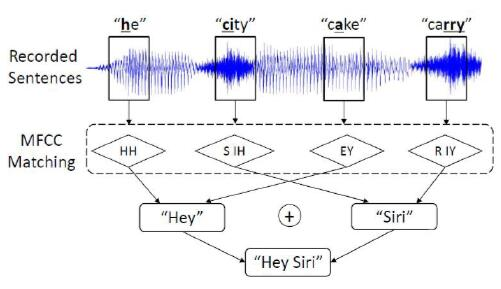
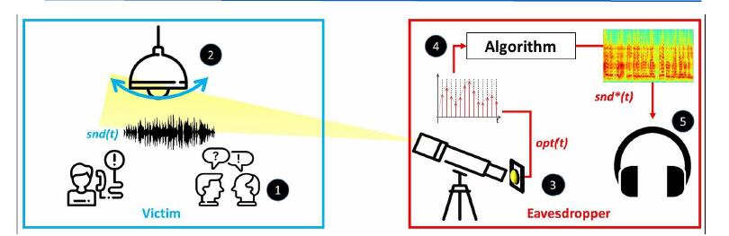
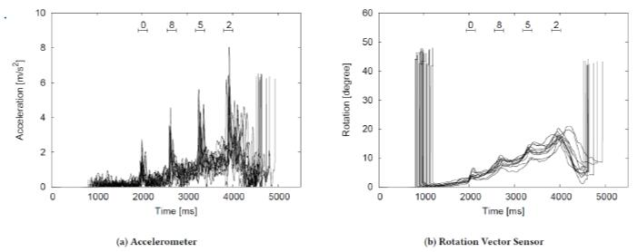

侧信道攻击
===

## Meltdown攻击

!!! tip "Meltdown[^1]"
    叫做“熔断幽灵”。由于乱序执行导致的缓存数据偷取，可以表示为

    ```asm
    ; rcx = kernel addr, rbx = probe array
    xor rax,rax
    retry:
    mov al, byte [rcx]
    shl rax, 0xc
    jz retry
    mov rbx, qword [rbx + rax]
    ```

* Meltdown依靠现代处理器的乱序执行副作用来读取内核任意位置的数据，此攻击与具体操作系统无关

!!! summary "一个简单的示例"
    ```c
    raise_exception();
    // assume the line below is never reached
    access(probe_array[data*4096]);
    ```

    * 即使抛出了异常导致`access`函数不会执行，由于乱序执行的原因，下方的大数组仍可能被访问到

* 攻击过程
    1. 执行瞬态指令
    2. 构建隐蔽通道

### 缓存攻击

=== "Evict+Reload型"
    * Spy进程利用冲突地址填满缓存（给目标进程留一个探查地址），然后等待目标进程访问该缓存
    * 由于只留下了一个地址，Spy程序稍后访问此地址即可探查到该程序运行的信息

=== "Prime+Probe型"
    * 攻击者用预先准备的数据填充多个缓存组，目标进程访问缓存时，会更新相应区域的缓存数据
    * 重新读取用于填充的数据，这些数据变化会在Probe阶段被抓到

=== "Flush+Reload型"
    * 攻击者先将特定位置的缓存数据驱逐（清空），目标进程访问缓存时，会更新相应区域的缓存数据
    * 然后重载被驱逐的内存块，这些数据变化会在Reload阶段被抓到

## 海豚攻击(Dolphin Attack)[^2]
* 麦克风一般使用薄膜，通过振动响应由声波引起的气压变化
* 利用超声频率生成目标音调，或利用已有话语录音重新剪接成目标语音，使用了调幅(AM)技术



## 光波注入音频控制系统[^3]
* 用于攻击声控系统

## 从灯泡振动获取音声信息
Lamphone



## 传感器泄露PIN等信息
Sensor Fusion

* 用陀螺仪和加速度计测量的输入十次0852键获得结果（模拟PIN输入）



[^1]: Meltdown: Reading Kernel Memory from User Space, 2015 IEEE Symposium on Security and Privacy
[^2]: DolphinAttack: Inaudible Voice Commands, CCS '17: Proceedings of the 2017 ACM SIGSAC Conference on Computer and Communications Security
[^3]: Light Commands: Laser Based Audio Injection Attacks on Voice Controllable Systems,arXiv:2006.11946v1 [cs.CR] 22 Jun 2020
[^4]: There Goes Your PIN :Exploiting Smartphone Sensor Fusion Under Single and Cross User Setting, ARES 2018 13th International Conference on Availability, Reliability and Security
