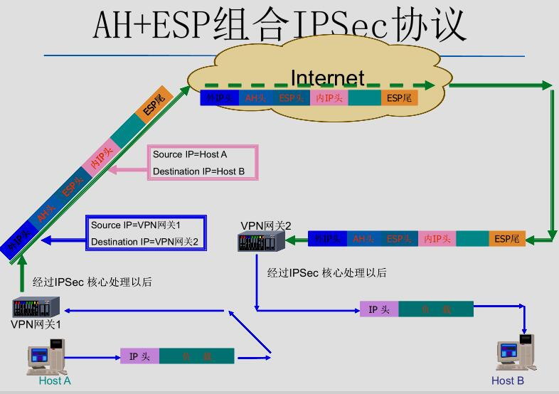
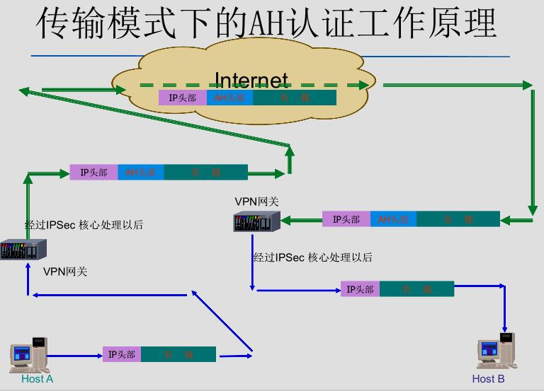
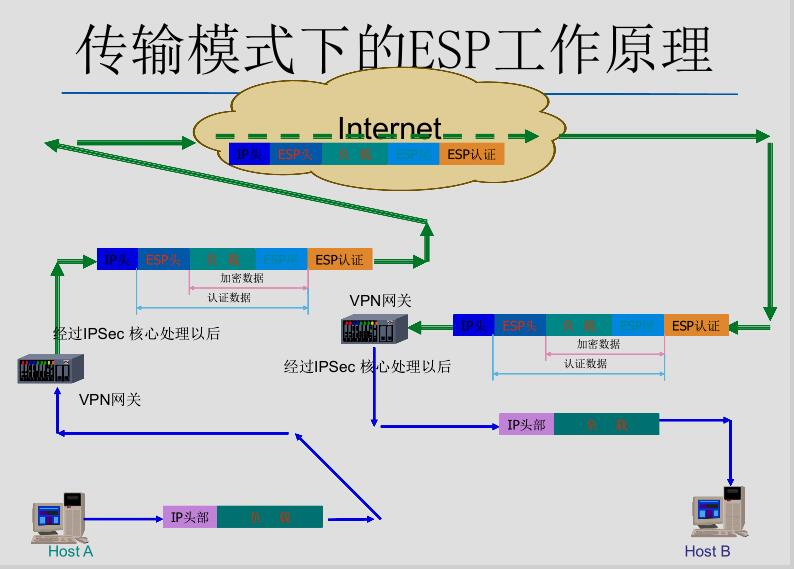
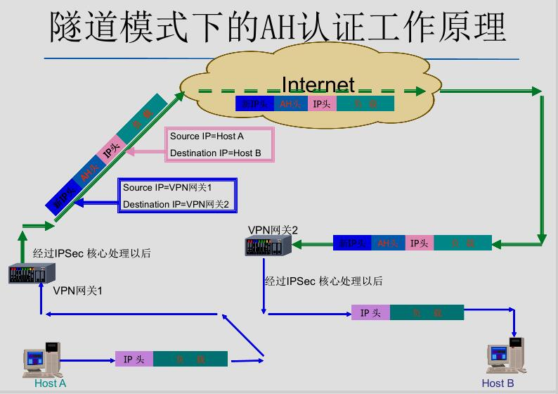
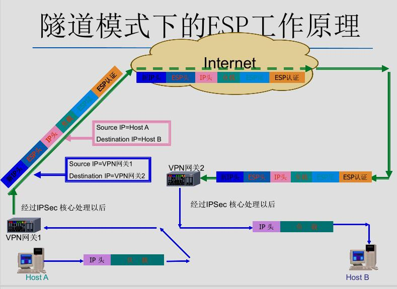
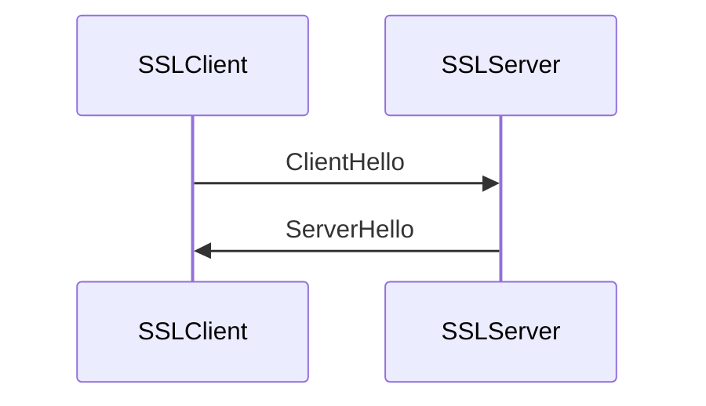
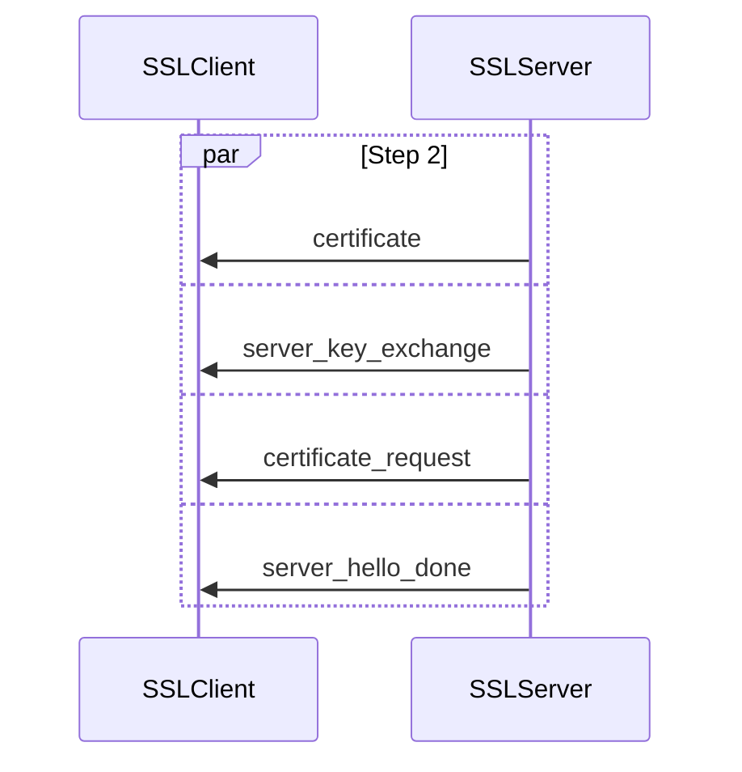
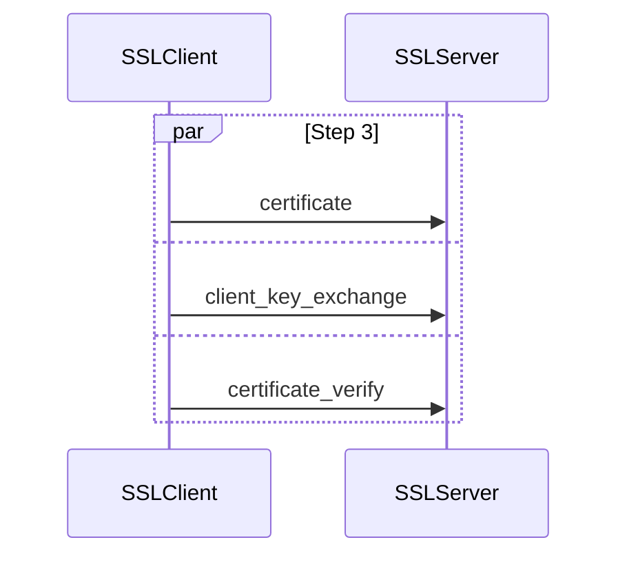
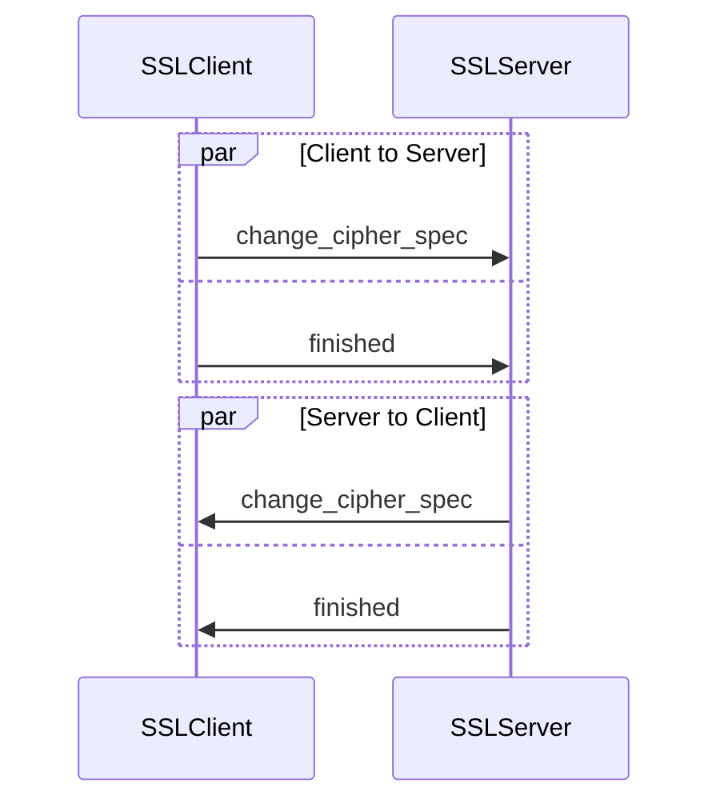

---
tags:
  - 网络安全
---
虚拟专用网
===
## VPN简介
* 保证端到端的数据安全性

??? bug "端到端的数据通路安全风险"
	- 拨入段用户数据是明文传给ISP的
	- 传输到ISP的路上，经过的所有路由器可能都会被监听
	- 内部网可能也存在不安全的因素

* VPN：Virtual Private Network（虚拟专用网）
	- 构成：VPN服务器 + VPN客户机 + 隧道
	- 应用：合作伙伴、远程访问、分支机构
* 隧道技术
	- 定义：是一种封装，将一种协议封装在另一种协议中进行传输
	- 三种协议
		* 乘客协议
		* 封装协议
		* 运载协议
* 密钥管理协议：IKE协议、SKIP协议、Kerberos协议
* VPN 分类
    - 公共主干网是否为IP协议
        * 是：IP VPN，在公共网上通过IPSec隧道传输IP数据包
        * 否：Non-IP VPN，客户端和服务器可能使用IPX协议，VPN隧道携带了IPX数据包
	- 业务类型
		* Intranet VPN（内部公文流转）
		* Access VPN（远程拨号VPN）
		* Extranet VPN（各分支机构互联）
	- 发起主体
		* 客户：基于客户的VPN
		* 服务器：基于网络的VPN
	- 隧道协议层次
		* 二层隧道协议：L2F/L2TP 、PPTP
		* 三层隧道协议：GRE（通用路由封装协议）、IPSec
		* 介于二/三层之间的隧道协议：MPLS
		* 基于SOCKS V5的VPN
	- 实现方式
		* 软件
		* 硬件
        * 辅助硬件
    - 路由管理模式
        * 叠加模式
        * 对等模式
	- 网络类型
		* Client-LAN（又称为Access VPN，即远程访问的VPN）
			- 又分为基于internet远程访问的VPN，和基于intranet远程访问的VPN
		* LAN-LAN（当用来构建内联网时称为Intranet VPN，用于企业和合作企业进行网络互联时称为Extranet VPN）
* VPN 功能
	- 数据机密性保护
	- 数据完整性保护
	- 数据源身份认证
	- 重放攻击保护

## 链路层安全

### PPTP
- PPTP，即Point to Point Tunneling Protocol，点对点通道协议，由微软公司提出
- 将PPP分组通过IP网络封装传输
- 数据封装：+GRE报头，+PPP报头
- 虚拟连接通道安全性保证：RC4算法

	??? info "通过PPTP接入公共IP网络的过程"
		客户按常规方式拨号到ISP接入服务器（NAS），建立PPP连接；然后，客户进行二次拨号建立到PPTP服务器的连接，该连接称为PPTP 隧道， 实质上是基于IP 协议上的另一个PPP 连接

	- 仅支持IP传输协议

### L2F
- L2F，即Layer 2 Forwarding，二层转发协议，由Cisco公司提出
- 可以在多种介质下，建立多协议的安全虚拟专用网

	??? info "通过L2F接入公共IP网络的过程"
		首先按常规方式拨号到ISP 的接入服务器（NAS），建立PPP连接；NAS 根据用户名等信息，发起第二重连接，通向HGW（家庭网关）服务器。
		* 在这种情况下隧道的配置和建立对用户是完全透明的。


### L2TP
- L2TP，即Layer 2 Tunneling Protocol，二层通道协议
- 结合了L2F和PPTP的优点， 可以让用户从客户端或访问服务器端发起VPN 连接
- L2TP主要由LAC(L2TP Access Concentrator)和LNS(L2TP Network Server)构成，LAC(L2TP访问集中器)支持客户端的L2TP，它用于发起呼叫，接收呼叫和建立隧道；LNS(L2TP网络服务器)是所有隧道的终点。在传统的PPP连接中，用户拨号连接的终点是LAC，L2TP使得PPP协议的终点延伸到LNS
- 支持多种协议，支持多个PPP链路的捆绑问题，扩展了PPP连接
- 封装格式：IP头 + UDP头 + L2TP头 + PPP数据


!!! summary "L2TP和PPTP的不同点"
	PPTP | L2TP
	:--: | :--:
	互联网络为IP网络 | 隧道媒介提供面向数据包的点对点的连接，介质不限
	单一隧道 | 多隧道
	较大的包头开销，6字节 | 可以提供包头压缩，当开启时，开销为4字节
	不支持隧道验证 | 可以提供隧道验证

	注：L2TP或PPTP与IPSEC共同使用时，可以由IPSEC提供隧道验证

## 网络层安全
### IPSec
- 基于IPSec的VPN解决方案
	* 网络层是可能实现端到端安全通信的最低层，它为所有应用层数据提供透明的安全保护，用户无需修改应用层协议
	* 它通过对IP报文的封装以实现TCP/IP网络上数据的安全传送
	* 可以解决的问题
		- 数据源身份认证：证实数据报文是所声称的发送者发出的。
		- 数据完整性：证实数据报文的内容在传输过程中没被修改过，无论是被故意改动或是由于发生了随机的传输错误。
		- 数据保密：隐藏明文的消息，通常靠加密来实现。
		- 重放攻击保护：保证攻击者不能截获数据报文，且稍后某个时间再发放数据报文，而不会被检测到。
		- 自动的密钥管理和安全关联管理：保证只需少量或根本不需要手工配置，就可以在扩展的网络上方便精确地实现公司的虚拟使用网络方针
- IPSec协议框架
	* 协议框架：RFC2401
	* 安全协议：AH协议-RFC2402 ESP协议-RFC2406
	* 密钥管理协议：IKE－RFC2409 、ISAKMP－RFC2408、OAKLEY协议－RFC2412。
	* 密码算法：HMAC－RFC2104/2404、CAST－RFC2144、ESP加密算法－RFC2405/2451等
	* 其他：解释域DOI－RFC2407、IPComp－RFC2393、Roadmap－RFC2411
- AH和ESP
	* AH协议
		- 认证部分：IP头部 + AH头部 + 负载
		- 没有加密功能
		- AH的组成
			```text
			---------------------------------------------
			|  下一头部   |    负载长度    |    保留        |
			---------------------------------------------
			|          安全参数索引（SPI）                 |
			---------------------------------------------
			|           序列号                            |
			---------------------------------------------
			|           认证数据                          |
			---------------------------------------------
			|←----------------- 32 比特 ----------------→|
			认证数据：一个变长字段，也叫Integrity Check Value，由SA初始化时指定的算法来计算。长度=整数倍32位比特
			下一头部：8比特，标识认证头后面的下一个负载类型
			负载长度：8比特，表示以32比特为单位的AH头部长度减2，Default=4
			保留字段：16比特，保留将来使用，Default=0
			SPI：32比特，用于标识有相同IP地址和相同安全协议的不同SA。由SA的创建者定义，只有逻辑意义
			序列号：32比特，一个单项递增的计数器，用于防止重放攻击，SA建立之初初始化为0，序列号不允许重复
			```
		* AH在传输模式和隧道模式下的区别：传输模式IP不变（Host1 → Host2），隧道模式IP变化（VPN网关1 → VPN网关2）
	* ESP协议
		- 加密部分：TCP头 + 数据 + ESP尾部
		- 认证部分：ESP头部 + 加密部分
		- ESP的组成
			```text
			---------------------------------------------
			|          安全参数索引（SPI）                 |
			---------------------------------------------
			|           序列号 （32比特）                  |
			---------------------------------------------
			|           ESP静载荷（变长）                  |
			~               ____________________________~
			|              |       填充（0~255字节）      |
			---------------------------------------------
			|         |填充长度（8比特）|下一负载头部（8比特）|
			---------------------------------------------
			|                认证数据（长度可变）          |
			---------------------------------------------
			|←----------------- 32 比特 ----------------→|
			认证数据：一个变长字段，也叫Integrity Check Value，由SA初始化时指定的算法来计算。长度=整数倍32位比特
			下一头部：8比特，标识认证头后面的下一个负载类型
			填充字段：8比特，大多数加密加密算法要求输入数据包含整数个分组，因此需要填充
			负载数据：包含由下一头部字段给出的变长数据
			SPI：32比特，用于标识有相同IP地址和相同安全协议的不同SA。由SA的创建者定义，只有逻辑意义
			填充长度：8比特，给出前面填充字段的长度，置0时表示没有填充
			序列号：32比特，一个单项递增的计数器，用于防止重放攻击，SA建立之初初始化为0，序列号不允许重复
			```
	* AH + ESP组合
		- AH认证，ESP加密
			

		??? faq "既然ESP和AH都有认证部分，能否用ESP取代AH？"
			不行的，ESP提供认证的部分与AH不一样，它不认证IP头。

- 传输模式
	* 封装格式（IPv4）
		- AH：原IP头 + AH + TCP头 + 数据（除可变字段外全部参与认证）
		- ESP：原IP头部 + ESP头部 + TCP头 + 数据 + ESP尾部 + ESP认证数据（认证：ESP头~ESP尾，加密：TCP头 + 数据 + ESP尾部）
	* AH的传输模式
		
	* ESP的传输模式
		
- 隧道模式
	* 封装格式（IPv4）
		- AH：新IP头 + AH头 + 原IP头 + TCP头 + 数据（除可变字段外全部参与认证）
		- ESP：新IP头 + ESP头 + 原IP头 + TCP头 + 数据 + ESP尾部 + ESP认证数据（认证：ESP头~ESP尾，加密：原IP头 + TCP头 + 数据 + ESP尾部）
	* AH的隧道模式
		
	* ESP的隧道模式
		

- 安全数据库
	* SA(Security Association)是两个IPSec通信实体之间经协商建立起来的一种共同协定，它规定了通信双方使用哪种IPSec协议保护数据安全、应用的算法标识、加密和验证的密钥取值以及密钥的生存周期等等安全属性值
	* SADB（安全联盟数据库）
		- 安全联盟常用参数：
			* 加密及验证密钥。
			* 密码算法在系统中的标识。
			* 序列号，32位的字段，在处理外出的数据包时，一个SA被应用一次，它的序列号号字段就递增一，并被填充到数据包的IPSec头中，接收方可以利用此字段进行抗重播攻击。
			* 抗重播窗口。接收方使用滑动窗口算法来进行对恶意主机重复发出的数据包进行检测。
			* 生存周期。规定了该SA的有效使用周期，可以按照建立至今的时间或者处理的流量来计算。
			* 实施模式。即通道模式还是传输模式。
			* IPSec隧道目的地址。
			* 安全参数索引(SPI)。参与唯一标识某SA。
	* SPD（安全策略数据库）
		- SP是一个描述规则，定义了对什么样的数据流实施什么样的安全处理，至于安全处理需要的参数在SP指向的一个结构SA(安全联盟)中存储

			!!! quote "一个SP描述例子"
				对本地子网和远程网关后的子网间的Telnet通信流，实施ESP通道保护，采用3DES加密算法和HMAC-SHA1验证算法

		- 系统中的安全策略组成了SPD，每个记录就是一条SP，定义类似上例中的描述规则，一般分为应用IPSec处理、绕过、丢弃

- IPSec流程
	1. 数据包输出
		数据包被从网络设备发送出去之前，截取到IP包，然后从中提取选择符信息，依据之搜索SPD，产生如下可能结果：
		* SP决定丢弃此包，于是直接丢弃，或者还可以向源主机发送ICMP信息；
		* SP决定通过此包，直接将数据包投放到网络设备的发送队列；
		* SP决定应用IPSec，此时SP要么指向一个SA,可以根据它进行安全处理，要么需要的SA不存在，则触发IKE模块协商建立SA，协商周期内数据包进入等待队列等待协商完成，若协商超时，也会丢弃该包。
	2. 数据包输入
		系统收到IP包后，判断如果是IPSec包，则从头部取到`(src_ip,protocol,SPI)`，搜索SADB。
		* 若找不到SA，丢弃包；
		* 若找到，对其进行解封装，得到去通道化后的原始IP包，再从原始IP包中提取选择符，搜索到SPD中某一条目，检查收到包的安全处理是否符合描述规则，不符合则丢弃包，符合则转入系统IP协议栈进行后继处理。

### IKE

??? info "何为IKE"
	Internet Key Exchange，互联网密钥交换

* 基本情况
	- 用IPSec保护数据包，必须首先建立一个IPSec的安全联盟，这个安全联盟可以手工建立，也可以动态由特定进程来创建。这个特定的进程就是Internet Key Exchange，即IKE。IKE的用途就是在IPSec通信双方之间通过协商建立起共享安全参数及验证过的密钥，也就是建立安全联盟。
	- IKE协议是Oakley和SKEME协议的混合，在由ISAKMP规定的一个框架内运作，可以为多种需要安全服务的协议进行策略磋商和密钥建立，比如SNMPv3、OSPFv2、IPSec等

* 密钥交换包格式（ISAKMP）
	```text
    -------------------------------------------
	|             发起方Cookie（32位）          |
	------------------------------------------
	|             应答方Cookie（32位）          |
	-------------------------------------------
	| 下一个载荷 | 主版本 | 次版本 | 交换类型| 标志 |
	-------------------------------------------
	|               消息ID（32位）              |
	-------------------------------------------
	|               报文长度（32位）             |
	-------------------------------------------
	↓          ↓       ↓       ↓        ↓      ↓
	0		   8      12      16       24     32
	发起方Cookie：启动SA建立、SA通知或SA删除的实体Cookie
	应答方Cookie：响应SA建立、SA通知或SA删除的实体Cookie
	下一个载荷：信息中的Next Payload字段类型
	主、次版本：使用的ISAKMP协议的主、次要版本
	交换类型：正在使用的交换类型
	标志：为ISAKMP交换设置的各类选项
	消息ID：唯一的消息标识符，用来识别第二阶段的协议状态
	报文长度：全部信息（头+有效载荷）长（八位）
	```
* 载荷类型
	- 安全联盟载荷
	- 转码载荷表示协商时供对方选择的一组安全属性字段的取值，比如算法，安全联盟的存活期，密钥长度等等
	- 密钥交换载荷，表示了实施密钥交换必需的信息。散列载荷，是一个散列函数的运算结果值
	- nonce载荷，是一串伪随机值，用以衍生加密材料
	- 证书载荷，在身份验证时向对方提供证书
	- 证书请求载荷
* 交换过程
	- 第一阶段
		* 建立ISAKMP安全联盟（IKE SA），为后面的交换提供一个安全通信信道
		* 协商流程简述：SA交换、密钥交换、ID及验证交换
		* 主模式和野蛮模式都支持四种不同的验证方法
			1. 预共享密钥
			2. DSS数字签名
			3. RSA数字签名
			4. 交换加密
		* 主模式交换：三个步骤，交换六条消息
			1. 策略协商交换
			2. Diffie Hellman共享值
			3. nonce交换 + 身份验证交换
		* 野蛮模式交换：三个步骤，交换三条消息
			- 协商能力受限，不提供身份保护
				* 没有身份保护是因为密钥交换与身份认证一起进行
			- 交换了什么东西
				1. 协商策略，交换Diffie Hellman公开值必需的辅助数据以及身份信息

					!!! info "D-H密钥交换"
						D-H交换的安全性源于在有限域上计算离散对数比计算指数更为困难。看起来有“交换”二字，实际上双方共有的密钥是计算而来的。

                        * 设交换的两人为Alice和Bob，他们约定了一个参数数组`(p,g)`，其中p为质数，两人分别选择一个随机私人数字a和b，计算

                        $$
                        \begin{align}
                        A&=g^a \mod p \qquad Alice \\
                        B&=g^b \mod p \qquad Bob
                        \end{align}
                        $$

                        * 通过开放信道，两人交换A和B，再次进行乘幂计算，使用收到的数字作为底数，生成共享的一个公共值：

                        $$
                        B^a \mod p = g ^{ab} \mod p = A^b \mod p
                        $$

                        * 在整个交换过程中，只有a和b需要保密，其他数字都不用保密

				2. 认证响应方
				3. 认证发起方，为发起方提供在场的证据

	- 第二阶段
		* 所有消息从ISAKMP头之后都是加密传输的，并且在消息头之后紧跟了散列值进行验证。如果使用了完美向前加密(PFS)，则消息交换中还包含一次DH交换的公开值载荷KE，身份载荷表示的是要保护的通信流的源和目的，通常是子网内的主机或主机的集合。
		* IKE实体会在阶段一建立起来的安全信道中，为某种进程协商和产生需要的密钥材料和安全参数
			- 在VPN实现中，双方建立IPSec安全联盟
		* 快速模式交换
			- 双方分别向对方认证自己，建议安全关联、交换公开值、选择nonce等
			- 双方可以根据上述交换的nonce 和 Diffie-Hellman公开值等信息各自生成一对密钥，分别用于保护两个方向上的通信
			- 任意一方向对方发送一个消息来证明自己的活性，该消息只包含一个Hash值
			- 此时两个系统就可用协商好的安全协议保护用户数据流了

	??? faq "为什么要建立两个阶段"
		首先要建立安全的协商环境！（ISAKMP不仅仅为IPSec而设）

## 传输层安全
### SSL

??? info "什么是SSL"
	Secure Socket Layer，安全套接字层，1994年Netscape开发，专门用于保护Web通讯
	TLS 1.0(Transport Layer Security, 也被称为SSL 3.1)

!!! info "SSL中两个重要的概念"

	=== "SSL连接（connection)"
		1. 一个连接是一个提供一种合适类型服务的传输（OSI分层的定义）
		2. SSL的连接是点对点的关系
		3. 连接是暂时的，每一个连接和一个会话关联

	=== "SSL会话（session）"
		1. 一个SSL会话是在客户与服务器之间的一个关联。会话由Handshake Protocol创建。会话定义了一组可供多个连接共享的加密安全参数。
		2. 会话用以避免为每一个连接提供新的安全参数所需昂贵的谈判代价。

* 为上层协议提供保密性、身份认证和数据完整性，使用TCP提供一个可靠的端到端安全服务
* 协议分为两层

	=== "底层"
		* SSL记录协议建立在可靠的传输协议(如TCP)之上，为更高层提供基本安全服务。特别是HTTP，它提供了Web的client/server交互的传输服务，可以构造在SSL之上
		* 它提供连接安全性：保密性（对称加密算法）和完整性（HMAC算法）

	=== "上层"
		SSL Handshake Protocol（握手协议），SSL Change Cipher Spec Protocol（密码变化协议），SSL Alert Protocol（警告协议）是SSL的高层协议，用于管理SSL交换。

#### SSL记录层协议

* 第一步，fragmentation
	- 上层消息的数据被分片成 $2^{14}$ 字节大小的块，或者更小
* 第二步，compression(可选)
	- 必须是无损压缩，如果数据增加（这些主要是压缩状态信息）的话，则增加部分的长度不超过1024字节
* 第三步，计算消息认证码(MAC)
	- 计算公式：`HMAC_hash(MAC_write_secret, seq_num ||TLSCompressed.type ||TLSCompressed.version ||TLSCompressed.length|| TLSCompressed.fragment)`
* 第四步，encryption
	- 采用CBC，算法由CipherSpec指定
	- 数据长度不超过 $2^{14} +2048$ 字节
* 结果可作如下表示
	```c
	struct {
		ContentType type; // (1)
		ProtocolVersion version; // (2)
		uint16 length; // (3)
		EncryptedData fragment; // (4)
	} TLSCiphertext;
	```

    1. 8位，上层协议类型
    2. 16位，主次版本
    3. 加密后数据的长度，不超过 $2^{14} +2048$ 字节
    4. 密文数据

#### SSL高层协议
* 密码变化协议(Change Cipher Spec Protocol)
	- 它位于TLS记录协议之上，它用到了TLS记录协议的处理过程
	- 协议只包含一条消息，一个字节 1
	- 用途：切换状态；把密码参数设置为当前状态；在握手协议中，当安全参数协商一致后，发送此消息
        * 客户方和服务器用这个消息来通知对方，将采用新的密码规范和密钥来加密和解密数据记录
* 警告协议(Alert Protocol)
	- 位于TLS记录协议之上，也用到了TLS记录协议的处理过程
	- 协议数据包含两个字节：第一个字节为level，分别为warning(1，关闭警告)和fatal(2，错误警告)两种情况；第二个字节为情况说明
	- Fatal类型的alert消息导致连接立即终止，此时，对应该会话的其他连接可以继续，但是会话标识符无效，以免利用此失败的连接来建立新的连接
* 握手协议
	- SSL握手协议定义了若干握手消息，用于在通信双方之间建立会话和协商安全属性。握手消息将提交给SSL记录层，由记录层封装一个或多个SSL_Plaintext结构

    === "HelloRequest"
        服务器可以在任何时候发送HelloRequest 消息，要求客户方重新开始协商过程。客户方在收到该消息后使用ClientHello消息进行响应，同意重新开始协商过程

    === "ClientHello"
        客户方在下列情况下要发送ClientHello消息：
        1. 主动请求建立一个新的会话连接；
        2. 对服务方HelloRequest消息进行响应；
        3. 在现有的会话连接上主动请求重新协商安全参数。

    === "ServerHello"
        服务器方对ClientHello消息进行处理，然后回应一个响应消息。如果同意握手，则返回ServerHello消息；否则返回握手失败警告消息。


### SSL密钥交换
* 功能
	- 客户和服务器之间相互认证
	- 协商加密算法和密钥
	- 提供连接安全性：至少对一方实现认证，协商而得到的共享密钥是安全的，过程可靠
* 规范
	- 位于TLS记录协议之上，也用到了TLS记录协议的处理过程
	- 1 byte Type + 3 byte Length，剩余的是Content
* 交换流程
	1. 交换Hello消息，对于算法、交换随机值等协商一致
	2. 交换必要的密码参数，以便双方得到统一的premaster secret
	3. 交换证书和相应的密码信息，以便进行身份认证
	4. 产生master secret
	5. 把安全参数提供给TLS记录层
	6. 检验双方是否已经获得同样的安全参数
* 简化交互过程：重用一个TLS会话ID，这样就跳过了第二、三阶段交互
    ```mermaid
    sequenceDiagram
    participant c as SSLClient
    participant s as SSLServer
    c->>s:client_hello
    s->>c:server_hello
    par Step 2
    rect rgba(205,51,0,.2)
    c->>+s:change_cipher_spec
    end
    and
    c->>+s:finished
    end
    par Step 3
    rect rgba(205,51,0,.2)
    s->>+c:change_cipher_spec
    end
    and
    s->>+c:finished
    c->>s:Application Data
    end
    ```
* 密钥生成
	- TLS记录协议需要：CipherSuite，master secret和 client、server端的随机值
	- 在hello消息中，交换随机数以及各种算法
	- 对于各种密钥交换算法，从pre_master_secret计算得到master_secret，然后从内存中删除
	- Master_secret总是48字节长，而pre_master_secret长度不定，取决于密钥交换算法
	- 两类密钥交换算法：
		1. RSA，客户产生一个48字节的pre_master_secret，然后通过服务器的公钥传递给服务器
		2. Diffie-Hellman，双方协商得到的密钥被用作pre_master_secret

#### 第一阶段交互


- 客户发送一个client_hello消息，包括以下参数：版本、随机数(32位时间戳+28字节随机序列)、会话ID、客户支持的密码算法列表(CipherSuite)、客户支持的压缩方法列表
- 然后，客户等待服务器的server_hello消息
- 服务器发送server_hello消息，参数：客户建议的低版本以及服务器支持的最高版本、服务器产生的随机数、会话ID、服务器从客户建议的密码算法中挑出一套、服务器从客户建议的压缩方法中挑出一个
- 关于会话ID
	* 客户方的会话ID = 0，表示在一个新的会话上建立新的连接，否则，基于当前会话更新已有连接的安全参数
	* 服务器或同意客户方的指定ID，或返回新的ID
- 关于CipherSuite
	* 第一个元素指定了密钥交换的方法，TLS支持以下一些方法：RSA、DH、EDH(Ephemeral Diffie-Hellman)、匿名的DH
	* 然后，指定以下信息：加密算法和类型(流还是分组密码算法)、HMAC算法（MD5还是SHA-1）、是否可出口、HashSize、Key Material、IV Size

#### 第二阶段交互


- 服务器发送自己的证书，消息包含一个X.509证书，或者一条证书链
	* 除了匿名DH之外的密钥交换方法都需要
- 服务器发送server_key_exchange消息
	* 可选的，有些情况下可以不需要。只有当服务器的证书没有包含必需的数据的时候才发送此消息
	* 消息包含签名，被签名的内容包括两个随机数以及服务器参数
- 服务器发送certificate_request消息
	* 非匿名server可以向客户请求一个证书
	* 包含证书类型和CAs
- 服务器发送server_hello_done, 然后等待应答

#### 第三阶段交互


- 客户收到server_done消息后，它根据需要检查服务器提供的证书，并判断server_hello的参数是否可以接受，如果都没有问题的话，发送一个或多个消息给服务器
- 如果服务器请求证书的话，则客户首先发送一个certificate消息，若客户没有证书，则发送一个no_certificate警告
- 然后客户发送client_key_exchange消息，消息的内容取决于密钥交换的类型
- 最后，客户发送一个certificate_verify消息，其中包含一个签名，对从第一条消息以来的所有握手消息的HMAC值(用master_secret)进行签名

#### 第四阶段交互


- 客户发送一个change_cipher_spec消息，并且把协商得到的CipherSuite拷贝到当前连接的状态之中
- 然后，客户用新的算法、密钥参数发送一个finished消息，这条消息可以检查密钥交换和认证过程是否已经成功。其中包括一个校验值，对所有以来的消息进行校验。
- 服务器同样发送change_cipher_spec消息和finished消息。
- 握手过程完成，客户和服务器可以交换应用层数据

### SSL安全性分析

=== "信息泄露"
    * OpenSSL心脏滴血漏洞：OpenSSL 有一个叫 Heartbeat（心跳检测）的拓展。它通过建立一个 Client Hello 问询来检测对方服务器是不是正常在线 ，服务器发回 Server hello，表明正常树立SSL通讯。每次问询都会附加一个问询的字符长度 pad length，如果这个 pad length 大于实际的长度，服务器仍是会回来相同规模的字符信息，于是形成了内存里信息的越界访问。就这样，每发起一个心跳，服务器就能泄露一点点数据（理论上最多泄露 64KB），这些数据里可能包括用户的登录账号密码、电子邮件甚至是加密秘钥等信息，也可能并没有包含这些信息，但攻击者可以不断利用 “心跳”来获取更多的信息。就这样，服务器一点一点泄露越来越多的信息，就像是心脏慢慢在出血，心脏出血漏洞的名字由此而来。

	    ```mermaid
        sequenceDiagram
        participant u as User
        participant s as Server
        u->>s:reply me with 'BIRD'(4 letters)
        s->>u:'BIRD'
        u->>s:reply me with 'BIRD'(500 letters)
        s->>u:'BIRD........'
        Note over u,s: 这里可能会暴露敏感信息
        %% important information may leak there!
    	```

### 实现
- [OpenSSL](https://www.openssl.org/source/)
    * 实现了SSL2、3，TLS1.0
- SSLeay
- Microsoft Win2k SSL implementation


!!! summary "IPSec VPN vs SSL VPN：两种不同VPN网关架构的比较"
    * IPSec VPN网关工作在网络层，提供所有在网络层上的数据保护和透明的安全通信;
    * SSL VPN网关工作在应用层(基于HTTP协议和TCP层之间的)，从整体的安全等级来看，两者都能够提供安全的远程接入。
    * IPSec VPN网关在部署时一般放置在网络网关处，因而需要考虑网络的拓扑结构，如果增添新的设备，往往要改变网络结构。而SSL VPN网关却有所不同，它一般部署在内网中防火墙之后，可以随时根据需要，添加需要VPN网关保护的服务器，因此无需影响原有网络结构。


??? faq "我们为什么选择了SSL VPN"

    === "支持Web应用"
        通过SSL VPN网关建立的安全通道访问基于Web的电子邮件系统收发邮件。

    === "支持非Web应用"
        终端用户要实现非Web页面的文件共享，那么SSL VPN网关必须将与内网FTP服务器的通信内容转化为HTTPS协议和HTML格式发往客户端，使终端用户感觉这些应用就是一些基于Web的应用。

    === "支持基于客户/服务器应用的代理"
        这种应用需要在终端系统上运行一个非常小的Java或ActiveX程序作为端口转发器，监听某个端口上的连接。当数据包进入这个端口时，它们通过SSL连接中的隧道被传送到SSL VPN网关中，SSL VPN网关解开封装的数据包，将它们转发给目的应用服务器。
