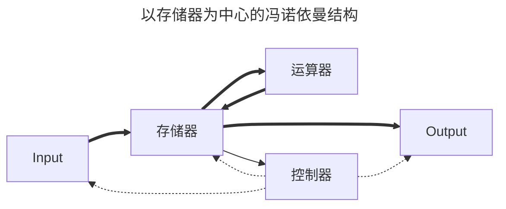
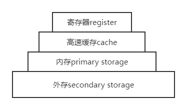
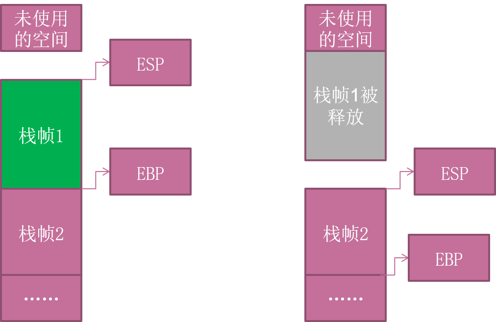

---
tags:
  - 软件安全
comments: true
---
# 软件安全——软件基础

## 冯诺依曼体系



* 程序和数据以二进制形式存储
* 输入、存储、表示

## 计算机启动

!!! summary ""
	前提：BIOS → 内存

* BIOS
	1. 处理器复位（Reset)
		* CS=FFFFH，IP=0000H，其余寄存器清零
		* 第一个要执行的指令是位于CS：IP中的指令，它的物理地址为0FFFF0H，所以将存储器的高地址分配给ROM BIOS，作为BIOS的入口地址
	2. 主机自检
		确保系统的每一个部分都得到了电源支持，内存储器、主板上的其它芯片、键盘、鼠标、磁盘控制器及一些I/O端口正常可用
	3. 自检程序将控制权还给BIOS
		得到引导驱动器的信息，调用引导驱动器的引导扇区
		* BIOS将所检查磁盘的第一个扇区（512B）载入内存，放在0x0000:0x7c00处
		* 如果这个扇区的最后两个字节是"55AAH"，那么这就是一个引导扇区
* 主引导记录MBR
    * 计算机开机以后访问硬盘所必须要读取的第一个扇区，记录着硬盘本身的相关信息以及硬盘各个分区的大小及位置信息。
* 硬盘启动
	* 加载`.com`，`.exe`程序
* 操作系统启动

	=== "Windows :material-microsoft-windows:"
		```mermaid
		graph LR
		id1(预启动) --> id2(启动) --> id3(装载内核 Ntoskrnl.exe) --> id4(内核初始化) --> id5(用户登录 winlogon.exe)
		```

	=== "Linux :material-linux:"
		```mermaid
		graph LR
		id1(系统初始化 /etc/rc.d/rc.sysinit) --> id2(启动服务 /etc/rc.d/rcX.d) --> id3(用户登录)
		```


## Win32存储
* 存储体系示意图
    
	
	
    * 高速缓存：Data Cache、TLB(Translation Lookaside Buffer)
	* 内存：DRAM, SDRAM等
	* 外存：软盘、硬盘、光盘、磁带等

* 寄存器
	* Intel x86
		* 通用寄存器：EAX、EBX、ECX、EDX、ESP、EBP、ESI和EDI（32位）
			* EAX一般用来做返回值
			* ECX用于记数
			* EIP：扩展指令指针。在调用一个函数时，这个指针被存储在堆栈中，用于后面的使用。在函数返回时，这个被存储的地址被用于决定下一个将被执行的指令的地址。
			* ESP：扩展堆栈指针。这个寄存器指向堆栈的当前位置，并允许通过使用push和pop操作或者直接的指针操作来对堆栈中的内容进行添加和移除。
			* EBP：扩展基指针。主要用于存放在进入call以后的ESP的值，便于退出的时候回复ESP的值，达到堆栈平衡的目的。
		* 段寄存器：CS、SS、DS、ES、FS、GS
            * CS指向一个代码段的开始
            * SS是一个堆栈段
            * DS、ES、FS、GS和各种其他数据段，例如存储静态数据的段
		* 程序控制流寄存器
		* 其他寄存器

!!! info "虚拟内存"
    通常，在用户模式下，我们用调试器看到的地址都是虚拟内存；虽然每个进程都“相信”自己拥有4GB的空间，但实际上它们运行时真正能用到的空间根本没有那么多。


## PE(Portable Executable)文件
* Win32平台下可执行文件遵守的数据格式，`*.exe`、`*.dll`都是典型的PE文件
* 结构（若干数据节）

    === ".text"
		二进制的机器代码，反汇编和调试的对象

    === ".data"
		初始化的数据块，宏定义、全局变量、静态变量等

    === ".idata"
		动态链接库

    === ".rsrc"
		程序资源

    === "其他"
		.reloc .edata .tls .rdata ...

	文件偏移地址(File Offset)
	: 数据在PE文件中的地址叫做文件偏移地址。这是文件在磁盘上存放时相对于文件开头的偏移。
	
	装载基址(Image Base)
	: PE装入内存时的基地址。默认情况下，EXE文件在内存中的基地址是0x00400000，DLL文件是0x10000000。这些位置可以通过修改编译选项更改。
	
	虚拟内存地址(Virtual Address,VA)
	: PE文件中的指令被装入内存后的地址。
	
	相对虚拟地址(Relative Virtual Address,RVA)
	: 相对虚拟地址是内存地址相对于映射基址的偏移量。

* VA = Image Base + RVA (+ 节偏移，下述)
* PE：0x200字节 ~ 内存：0x1000字节
    - 存在节偏移

## 进程空间分区

* 内存的四个部分及用途

    代码区
    : 这个区域存储着被装入执行的二进制机器代码，处理器会到这个区域取指并执行。

    数据区
    : 用于存储全局变量等。

    堆区
    : 进程可以在堆区动态地请求一定大小的内存，并在用完之后归还给堆区。动态分配和回收是堆区的特点。

    栈区
    : 用于动态地存储函数之间的调用关系，以保证被调用函数在返回时恢复到父函数中继续执行。

* 栈与系统栈
    - 程序中所使用的缓冲区可以是堆区、栈区和存放静态变量的数据区。缓冲区溢出的利用方法和缓冲区到底属于上面哪个内存区域密不可分，本课主要介绍在系统栈发生溢出的情形。
    - 系统栈==内存的栈区

### 系统栈工作
例子：
```c
int funcb()
{
	...
}
int funca()
{
	funcb();
}
int main()
{
	funca();
}
```

???+ faq "发生了什么？"
    === "代码空间"

        ```mermaid
        graph TD
        A["程序被装入，由main函数代码空间依次取指执行"]-->B["执行到main代码区的call指令时，跳转到funca的代码区继续执行"]-->C["执行到funca代码区的call指令时，跳转到funcb的代码区继续执行"]-->D["funcb代码执行完毕，弹出自己的栈帧并从中获得返回地址，跳回funca代码区继续执行"]-->E["funca代码执行完毕，弹出自己的栈帧并从中获得返回地址，跳回main代码区继续执行"]
        ```

    === "系统栈空间"

        ```mermaid
        graph TD
        A["系统栈栈顶为当前正在执行的main函数栈帧"]-->B["为配合funca的执行，在系统栈中为其开辟新的栈帧并压入"]-->C["为配合funcb的执行，在系统栈中为其开辟新的栈帧并压入"]-->D["弹出funcb的栈帧。对应于当前正在执行的函数，当前栈顶栈帧重新恢复成funca函数栈帧"]-->E["弹出funca的栈帧。对应于当前正在执行的函数，当前栈顶栈帧重新恢复成main函数栈帧"]
        ```

* 函数栈帧

	=== "局部变量"
        为函数局部变量开辟的内存空间

	=== "栈帧状态值"
        保存前栈帧的顶部和底部（实际上只保存前栈帧的底部，前栈帧的顶部可以通过堆栈平衡计算得到），用于在本帧被弹出后恢复出上一个栈帧

	=== "函数返回地址"
        保存当前函数调用前的“断点”信息，也就是函数调用前的指令位置，以便在函数返回时能够恢复到函数被调用前的代码区中继续执行指令

* 寄存器（Win32）
	* EBP：基址指针寄存器(extended base pointer)，其内存放着一个指针，该指针永远指向系统栈最上面的一个栈帧的底部。
	* ESP：栈指针寄存器(extended stack pointer)，其内存放着一个指针，该指针永远指向系统栈最上面的一个栈帧的栈顶。
		
	* EIP：指令寄存器(Extended Instruction Pointer)，其内存放着一个指针，该指针永远指向一条等待执行的指令地址。

* 函数调用约定
	* 过程描述

        ```mermaid
        flowchart LR
		    id1(参数入栈)--> id2(返回地址入栈)--> id3(代码区跳转) --> id4(栈帧调整)
		```

		- 参数从右向左一次压入系统栈
		- 当前代码区调用指令的下一跳指令地址压入栈中，供函数返回时继续执行

	* 栈帧调整

        ```asm
        push ebp # (1)
		mov ebp,esp # (2)
		sub esp,xxx # (3)
		```

        1. 保存当前栈帧的状态值，以备后面恢复本栈帧时使用
        2. 将当前栈帧切换到新栈帧
        3. 给新栈帧分配空间

* `_stdcall`调用约定指令序列

    ```asm
    push param3  # (1)
    push param2
    push param1
    call 函数地址  # (2)
    push ebp # (3)
    mov ebp,esp # (4)
    sub esp,xxx # (5)
	```

    1. 假设该函数有三个参数，从右向左依次入栈
    2. `call`指令将同时完成两项工作
        1. 向栈中压入当前指令在内存中的位置，即保存返回地址
        2. 跳转到所调用函数的入口地址函数入口处
    3. 保存旧栈帧的底部
    4. 设置新栈帧的底部(栈帧切换)
    5. 设置新栈帧的顶部(抬高栈顶，为新栈帧开辟空间)

* 函数返回(Win32，C语言为例)

    ```asm
    add esp,xxx  # (1)
    pop ebp   # (2)
    retn 	  # (3)
	```

    1. 回收栈顶
    2. 将上一个栈帧底部位置恢复到ebp
    3. 这条指令有两个功能
        1. 弹出当前栈顶元素，即弹出栈帧中的返回地址。至此，栈帧恢复工作完成。
        2. 让处理器跳转到弹出的返回地址，恢复调用前的代码区
