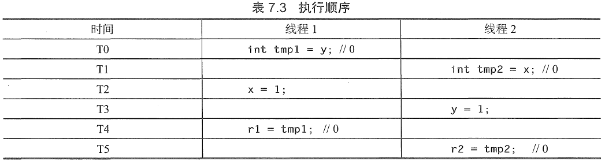

---
tags:
  - 软件安全
---
# 并发
## 多线程
* 并发
	- 系统中几个计算同时执行，并可能彼此交互
	- 多线程并不一定是并发的，每个线程都作为一个单独的程序，但所有线程都在相同的内存中工作，并共享相同的内存
	- 线程之间切换比进程之间切换要快
* 多线程安全
	- 多线程因执行次序易产生潜在灾难性问题
	- 单线程程序可能有并发问题

        ```c linenums="1" hl_lines="8 9"
		char *err_msg;
		#define MAX_MSG_SIZE = 24;
		void handler(int signum) {
			strcpy(err_msg , "SIGINT encountered.");
		}

		int main(void){
			signal(SIGINT, handler);
			err_msg = (char*)malloc(MAX_MSG_SIZE);
			if(err_msg == NULL){
			/* (1) */
			}
			strcpy(err_msg , "No errors yet.");
			/* (2) */
			return 0;
		}
		```

        1. 处理错误条件
        2. 主代码可能会循环

* 并行与并发
	- 并发和并行不等价，所有的并行程序都是并发的，但不是所有的并发程序都是并行的（还有并发交错的）
		* 并发并行：需要多核或多处理器
	- 这意味着并发程序既可以用交错、时间分片的方式执行又可以并行执行
* 数据并行和任务并行

    === "数据并行"
        * 把问题分解成数据段，且并行应用一个函数。
		* 举例：计算二维数组的总和，数据并行是将问题划分为单个行，并行地汇总每一行以得到一个子求和列表，然后汇总每个子求和

	=== "任务并行"
        * 将一个问题分解成可以共享数据的不同任务。各任务在同一时间执行，但执行不同的功能。
		* 举例：通过给一个计算分配独立的任务，就能同时计算数据集的平均值、最小值、二进制或和几何平均数

* 性能目标：并行度
	- 用来表示工作(所有指令花费的总时间)跨度(执行最长的并行执行路径或关键路径所花费的时间)比
	- 所得到的值是沿关键路径的每个步骤完成的平均值，并且是任意数量的处理器可能获得的最大加速比；并行度受限于程序结构，依赖于它的关键路径和工作量。

## 竞争条件
* 不受控制的并发可能会导致不确定的行为（即对相同的一组输入，一个程序可能表现出不同的行为）
* 竞争条件存在的三个属性
	- [x] 并发属性：至少有两个必须同时执行的控制流。
	- [x] 共享对象属性：两个并发流都必须访问一个共享的竞争对象。
	- [x] 改变状态属性：至少有一个控制流一定会改变竞争对象的状态。
* 特点：难以察觉、重现和消除，并可能导致错误，如数据损坏或崩溃
* 成因：竞争条件是运行时环境导致的，这个运行时环境包括必须对共享资源的访问进行控制的操作系统，特别是通过进程调度进行控制的。

### 损坏的值
例如：8位存储平台上写入16位数值
`short int x = 0;`

| 时间 | 线程一 | 线程二 | `x` |
| :--: | :--: | :--: |  :--: |
| T0 |  | `x.low = 44;`(300%256)| 44 |
| T1 |`x.low = 100;`|  | 100|
| T2 |`x.high = 0;` |  | 100|
| T3 |  | `x.high = 1;`(floor(300/256)) | 356 |

* 缓解措施：使`x`成为原子类型，两次写入不可交织进行

### 易变的对象
* 编译器优化机制：下列程序中，对`interrupted`的读取可能被编译器优化掉，导致尽管在信号处理程序中对该变量赋了值，而循环可能永远不会终止

    ```c hl_lines="3 6 10"
	#include <signal.h>

	sig_atomic_t interrupted; /* (1) */

	void sigint_handler(int signum) {
		interrupted = 1; /* (2) */
	}
	int main(void) {
		signal(SIGINT, sigint_handler);
		while (!interrupted) { /* (3) */
		/* (4) */
		}
		return 0;
	}
	```

    1. 错误 - 未声明为`volatile`
    2. 赋值可能是在`main()`不可见的
    3. 循环可能永远不会终止
    4. 做一些工作

    !!! info
        - 通过在`interrupted`变量声明中加入`volatile`限定，就保证`while`循环的每次迭代以及信号处理程序都从原来的地址访问它
        - `volatile`声明风险
            * 具有`volatile`类型限定符的对象不保证多个线程之间的同步，不防止并发内存访问，也不保证对对象的原子性访问
            * 当一个变量被声明为`volatile`时就会禁止编译器对该内存位置的读取和写入顺序进行重新排列
            * 编译器可能对这些读取、写入和对其他的内存位置的读取和写入的相对顺序进行重新排列

## 内存模型
* C/C++ 的内存模型必须提供线程安全性，同时仍然允许细粒度访问硬件，特别是一个平台可能会提供的任何低级别的线程原语。
* 当两个线程禁止同时访问同一个对象时，程序已经是正确的；然而，因为编译器重新排序(compiler reordering)和可见性(visibility)，这样的程序仍然是危险的。
	- 在重组程序方面，编译器具有非常大的自由度
		```
		int x = 0, y = 0, r1 = 0, r2 = 0;

		//线程1                   //线程2
		x = 1;                     y = 1;
		r1 = y;                    r2 = x;
		运行结束后，r1,r2分别是多少？
		（1）r1 = r2 = 1
		（2）r1 = 0，r2 = 1
		（3）r1 = 1，r2 = 0
		（4）r1 = r2 = 0
		都是有可能的！
		```

		<figure markdown>
		
        <figcaption>均为0的情况</figcaption>
        </figure>

	- 可见性
		* 即使编译器以这种方式避免了对语句重新排序，但硬件配置仍然可能允许这种情况发生

* 数据竞争
	- 如果某个程序在不同的线程中包含两个相互矛盾的动作，其中至少有一个不是原子的，并且两者都不在另一个之前发生，那么执行这个程序包含数据竞争
	- 任何这样的数据竞争都会导致未定义的行为
		* 如果两个表达式中一个修改某一内存位置，而另一个读取或修改相同的内存位置，那么这两个表达式求值发生冲突。

* “发生在之前”

### 同步原语（synchronization primitive）
* c和c++都支持几种不同类型的同步原语，包括互斥变量(mutex variable)、条件变量(condition variable)和锁变量(lock variable)。底层操作系统还支持额外的同步原语，如信号量(semaphore)、管道(pipe)、命名管道(named pipe)和临界区对象(critical section object)。
* 在竞争窗口之前获取同步对象，然后在窗口结束后释放它，使竞争窗口中关于使用相同的同步机制的其他代码是原子的。
* 竞争窗口最终成为一个代码临界区。所有临界区对执行临界区的线程以外的所有适当的同步线程都是原子的。

#### 锁机制
* 防止临界区并发执行

    ```c++ hl_lines="1 3 5 10"
	int shared_lock = 0;
	void thread_function(int id){
		while(shared_lock)          // (1)
			sleep(1);
		shared_lock = 1;            // (2)
		shared_data = id;           // (3)
		cout << "Thread id:" << id << " set shared value to " << shared_data << endl;
		usleep(id * 100);
		cout << "Thread id:" << id << " has shared value as " << shared_data << endl;    // (4)
		shared_lock = 0;
	}
	int main(void){
		const size_t thread_size = 10;
		thread threads[thread_size];
		for(size_t i = 0; i < thread_size; i++){
			threads[i]=thread(thread_function,i);
		}
		for(size_t i = 0; i < thread_size; i++){
			threads[i].join();
		}
	}
	```

    1. shared_lock start
    2. shared_lock end
    3. shared_data start
    4. shared_data end

* 导致一个或多个线程等待，直到另一个线程退出临界区

#### 互斥量（mutex）
* 最简单的一种锁机制
* 互斥量有两种可能的状态：锁定和解锁。
	- 一个线程锁定一个互斥量后，任何后续试图锁定该互斥量的线程都将被阻止，直到此互斥量被解锁为止。
	- 当互斥量解锁后，阻塞线程可以恢复执行，并锁定互斥量以继续。
* 互斥量可确保一次只有一个线程可以运行花括号内的代码，从而使程序是线程安全的。互斥量不与任何其他数据关联，只是作为锁对象
	```c++ hl_lines="1 3 8"
	mutex shared_lock;
	void thread_function(int id){
		shared_lock.lock();
		shared_data = id;
		cout << "Thread id:" << id << " set shared value to " << shared_data << endl;
		usleep(id * 100);
		cout << "Thread id:" << id << " has shared value as " << shared_data << endl;
		shared_lock.unlock();
	}
	```
	- 当对已经锁定的互斥量执行`lock()`操作时，该函数会被阻塞直到当前持有该锁的线程释放它。
	- `try_lock()`方法试图锁定互斥量，但如果该互斥量已经锁定，它就立即返回，以允许线程执行其他操作。
	- C++支持定时互斥量`try_lock_for()` 和`try_lock_until()`、递归互斥量及既是定时又是递归的互斥量

        `定时互斥量`
        :    这些方法会被阻塞，直到互斥量成功锁定或经过指定长度的时间

        `递归互斥量`
        :    它们允许单个线程不止一次地获取锁，而中间不用解锁。多次锁定一个互斥量的线程，必须解锁相同的次数，之后此互斥量才可以被任何其他线程锁定。非递归互斥量在没有干预解锁时不能被同一个线程多次锁定

??? info "原子操作"
	原子操作是不可分割的，一个原子操作不能被任何其他的操作中断，当正在执行原子操作时，它访问的内存，也不可以被任何其他机制改变。因此，必须在一个原子操作运行完成后，其他任何事物才能出问该操作所使用的内存。原子操作不能被划分成更小的部分。


### 不可变的数据结构
* 提供线程安全的一种常用的方法是简单地防止线程修改共享数据，在本质上，即是使数据只读。保护不可改变的共享数据不需要锁。
	- C和C++：声明一个共享对象为`const`的，或复制一个线程可能要修改的任何对象
		* 再想修改，则只能创建共享对象的副本

## 并发代码属性
* 可重入函数一定也是线程安全的，但线程安全的函数却可能无法重入
	- 从多个线程调用时，下面的函数是线程安全的，但不可重入

        ```c++  hl_lines="4 5 8"
		#include <pthread.h>
		int increment_counter(){            //(1)
			static int count = 0;
			static pthread mutex_t mutex = PTHREAD_MUTEX_INITIALIZER;
			pthread_mutex_lock(&mutex);
			count++;
			int result = count;
			pthread_mutex_unlock(&mutex);
			return result;
		}
		```

        1. 使用互斥量同步访问`count`变量

### 线程安全
* 线程安全函数的使用可以帮助消除竞争条件
* 如果一个函数不使用静态数据或共享资源，它明显是线程安全的。
* 然而，使用全局数据引发了线程安全的红旗，且任何对全局数据的使用必须同步，以避免竞争条件。
	- 为了使一个函数成为线程安全的，它必须同步访问共享资源
* 特定数据的访问或整个库可以锁定
	- 然而，在库上使用全局锁会导致争用

### 可重入(reentrant)
* 函数是可重入的，是指相同函数的多个实例可以同时运行在相同的地址空间中，而不会创建潜在的不一致的状态。
* IBM定义的可重入函数，是指它在连续调用时不持有静态数据，也不会返回一个指向静态数据的指针

	??? info "IBM定义的道理所在"
		可重入函数使用的所有数据都由调用者提供，并且可重入函数不能调用不可重入函数。可重入函数可以中断，重新进入(reentered)而不会丢失数据的完整性。

## 并发常见错误
* 没有用锁保护共享数据(即数据竞争)
* 当锁确实存在时，不使用锁访问共享数据
* 过早释放锁
* 对操作的一部分获取正确的锁，释放它，后来再次取得它，然后又释放它，而正确的做法是一直持有该锁
* 在想要用局部变量时，意外地通过使用全局变量共享数据
* 在不同的时间对共享数据使用两个不同的锁

### 死锁
* 通过使冲突的竞争窗口互斥，使得一旦一个临界区开始执行时，没有额外的线程可以执行，直到前一个线程退出临界区为止，从而消除竞争条件。
* 当两个或多个控制流以彼此都不可以继续执行的方式阻止对方时，就会发生死锁
* 特别是，对于一个并发执行流的循环，如果其中在循环中的每个流都已经获得了导致在循环中随后的流悬停的同步对象，则会发生死锁。

    ```c++ linenums="1" hl_lines="12-13 17-18"
	#include <iostream>
	#include <thread>
	#include <mutex>
	using namespace std;

	int shared_data = 0;
	mutex *locks = NULL;
	int thread_size;

	void thread_function(int id){  //(1)
		for(int i=0;i<thread_size;i++)
			locks[i].lock();
		shared_data = id;
		cout << "Thread "<<id<<" set data to "<<id<<endl;

		for(int i=thread_size;i>=0;i--)
			locks[i].unlock();
	}

	int main(int argc,char **argv){
		thread_size = atoi(argv[1]);
		thread* threads = new thread[thread_size];
		locks = new mutex[thread_size];
		for(int i =0;i<thread_size;i++)
			thread[i]=thread(thread_function,i);
		for(int i = 0;i<thread_size;i++)
			threads[i].join();
		delete[] locks;
		delete[] threads;

		return 0;
	}
	```

    1. 每个线程都以同一顺序获取锁，可以消除潜在的死锁

* 死锁对以下条件敏感
	- 处理器速度
	- 进程或线程调度算法的变动
	- 在执行的时候，强加的不同内存限制
	- 任何异步事件中断程序执行的能力
	- 其他并发执行进程的状态

### 过早释放锁
考虑此组代码，其中的写操作有锁保护，但是读操作没有

=== "含有漏洞"
    ```c++ linenums="1" hl_lines="7"
    int shared_data = 0;
    mutex shared_lock;
    void thread_function(int id){
        shared_lock.lock();
        shared_data = id;
        cout << "Thread "<<id<<" set shared value to "<<shared_data<<endl;
        shared_lock.unlock(); //oops...
        // do other stuff
        cout << "Thread" << id << " has shared value as "<<shared_data<<endl;
    }
    ```

=== "漏洞修复后"
    ```c++ linenums="1" hl_lines="9"
    int shared_data = 0;
    mutex shared_lock;
    void thread_function(int id){
        shared_lock.lock();
        shared_data = id;
        cout << "Thread "<<id<<" set shared value to "<<shared_data<<endl;
        // do other stuff
        cout << "Thread" << id << " has shared value as "<<shared_data<<endl;
        shared_lock.unlock(); //should be here
    }
    ```

### 争用
* 当一个线程试图获取另一个线程持有的锁时，就会发生锁争用。
* 减少持有锁的时间量或通过降低每个锁保护的粒度或资源量，可以解决锁争用导致的性能差的问题
* 锁的粒度也可以影响争用。增加由一个单一锁保护的共享资源的数量，或扩大共享资源的范围(例如，锁定整个表以访问一个单元格)，将使在同一时间多个线程尝试访问该资源的概率增大。
* 在选择锁的数量时，增加锁的开销和减少锁争用之间有一个权衡。更细的粒度(每个保护少量的数据)需要更多的锁，使得锁本身的开销增加。额外的锁也会增加死锁的风险。锁一般是相当快的，但是，当然单个执行线程运行速度会比没有锁更慢。

## 著名漏洞
* 在多核动态随机访问存储器系统中的DoS攻击
	- 随机存取存储器(DRAM)内存系统不区分运行在不同的核上的不同线程的内存访问请求[Moscibroda 2007]
		* 这种区分的缺乏使得多核系统容易受到利用内存系统中的不公平发起的攻击
	- DRAM 内存系统中为何一个线程可以拒绝另一个线程的服务：
		1. 不公平的行命中优先(row-hit-first) 调度
		2. 固不公平的最旧优先(oldest-first) 调度
* 系统调用包装器中的并发漏洞
	- 系统调用插入是用于提高操作系统安全策略的一个内核扩展技术(被商业杀毒软件广泛使用)，但在与当前的操作系统结合时，它变得脆弱，并可能导致权限提升和绕过审计
	- 已确定在系统调用包装器中存在三种形式的并发漏洞[Watson 2007]
		1. 包装器逻辑中的同步错误导致不正确的操作，如不正确地锁定数据。
		2. 在复制系统调用参数时，包装器和内核之间缺乏同步导致数据竞争，使得包装器和内核处理的参数不同。
		3. 在解释系统调用参数时，包装器和内核之间缺乏同步导致数据竞争。
	- 利用[Watson 2007]
		1. 检查时间到使用时间(time-of-check-to-time-of-use, TOCTTOU; 也被称为检查时间，使用时间，或TOCTOU) 漏洞，其中访问控制检查与它们所保护的操作是非原子的，允许攻击者违反访问控制规则。
		2. 审核时间到使用时间(time-of-audit-to-time-of-use, TOATTOU) 漏洞，其中因为非原子性，跟踪偏离实际访问，违反精度要求。这允许攻击者掩盖活动，避免触发入侵检测软件(IDS)。
		3. 替换时间到使用时间(time-of-replacement-to-time-of-use, TORTTOU) 漏洞，对于包装器是唯一的，其中攻击者在包装器替换系统调用参数后，但在此内核访问它们之前修改这些参数，从而违反安全策略。
