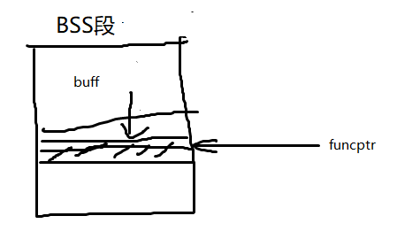

# 指针安全
## 指针安全
* 修改指针值，利用程序漏洞
* 缓冲区溢出覆写指针：从低向高

!!! note "unix可执行文件利用：data段 & BSS段"
   	* data段：已初始化的全局变量和常数
   	* BSS段：所有未初始化的全局变量
	```c
	static int GLOBAL_INIT = 1;     /* (1)data segment, global */
	static int global_uninit;        /* (2)BSS segment, global */
	void main(int argc, char **argv) {
		int local_init = 1;                   /* (3)stack, local */
		int local_uninit;                     /* (4)stack, local */
		static int local_static_init = 1;  /* (5)data seg, local */
		static int local_static_uninit; /* (6)BSS segment, local */
		/* (7)storage for buff_ptr is stack, local */
		int *buff_ptr = (int *)malloc(4);	 /* (8)allocated memory is heap, local */
	}
	```

* example

	=== "指针函数"
		

		```c linenums="1" hl_lines="13-14"
		void good_function(const char *str) {
			//do something
		}

		int main(int argc, char **argv) {
			if (argc !=2){
				printf("Usage: prog_name <string1>\n");
				exit(-1);
			}
			static char buff[BUFFSIZE];  //在BSS段
			static void (*funcPtr)(const char *str);    // (1)定义一个接受 char* 指针为参数的函数指针，由于是static的，没有初始化，也在BSS段
			funcPtr = &good_function;
			strncpy(buff, argv[1], strlen(argv[1])); // (2)当argv[1]的长度大于BUFFSIZE的时候，就会发生缓冲区溢出
			(void)(*funcPtr)(argv[2]);    // (3)还会调用good_function()吗？
			return 0;
		}
		```
	=== "指针对象"
		

		```c linenums="1" hl_lines="5-6"
		void foo(void* arg, size_t len)	{
			char buff[100];
			long val = ...;
			long *ptr = ...;
			memcpy(buff, arg, len);     // (1)buff有限，而len没有限制，容易溢出
			*ptr = val;    // (2)*ptr还指向原来的地址吗？val还是原来的值吗？任意地址写
			...
			return;
		}
		```
* 指针调用和直接调用：指针调用地址可以改（`call dword ptr xxx`）直接调用不行（`call good_function`）

    === "函数指针调用`(void)(*funcPtr)("hi")`"
		```asm
		;(void)(*funcPtr)("hi")
		00424178 mov esi, esp
		0042417A push offset string "hi" (46802Ch)
		0042417F call dword ptr [funcPtr (478400h)]
		00424185 add  esp, 4
		00424188 cmp  esi, esp
		```

		- IC的下一个值，存储在内存中，其可以被改变
		- 间接的函数引用与无法在编译期间决定的函数调用可以被利用，从而使程序的控制权转移到任意代码

	=== "直接调用`good_function("there!\n")`"

        ```asm
		;good_function("there!\n")
		0042418F push offset string "there!\n" (468020h)
		00424194 call good_function (422479h)
		00424199 add  esp, 4
		```

		- 静态调用对于函数地址使用立即数
			* 指令中地址被编码
			* 计算地址，然后放入IC
			* 不改变执行指令，IC不会改变

## 攻击利用
控制IC（下一条指令地址），修改指针

### <a name="got-table"></a>全局偏移表Global Offset Table
* Linux适用
* 首次使用一个函数前，函数的地址先由RTL（运行时连接器）的地址拿到，实际地址被确定并插入GOT表中，以后再调用，就直接取GOT表内存储的的地址
	- GOT中存放绝对地址
* `objdump`命令查看某一个函数的GOT入口项位置
* 攻击者：用自己的shellcode地址覆盖GOT地址

### <a name="dtors"></a>.dtors
* gcc允许用户自定义构造和析构函数。
    ```c
	static void start(void) __attribute__ ((constructor));
	static void stop(void) __attribute__ ((destructor));
    ```
* 程序执行顺序：constructor → `main()` → destructor
* 构造函数和析构函数分别存储于生成的ELF可执行映像的.ctors和.dtors区中，映射到进程地址空间后，默认属性为可写
* `objdump`可以看.dtors区中的内容
* 攻击者：利用析构函数和.dtors区
	- 用GCC编译和链接的程序中，dtors区总会存在，并且会映射到内存中，即使没有指定任何析构函数
	- 攻击者可以通过覆写.dtors区中的函数指针的地址从而将程序控制权转移到任意的代码

### <a name="virtual-fun"></a>虚函数(**virtual** *returntype* funname)
* 虚函数使用
	```c++
	#include <iostream>
	using namespace std;

	class a {
	public:	void f(void) {cout << "base f" << endl;};
		virtual void g(void) {cout << "base g" << endl;};
	};

	class b: public a {
	public:	void f(void) {cout << "derived f" << endl;};
		void g(void) {cout << "derived g" << endl;};
	};

	int main(int argc, char *argv[]) {
		a *my_b = new b();
		my_b->f();
		my_b->g();
		return 0;
	}
	```
* 面向对象编程特征，可被派生类中的同名函数重写
* 实现：虚函数表（VTBL）
	* VTBL是一个函数指针数组，用于在运行时派发虚函数调用。
	* 在每一个对象的头部，都包含一个指向VTBL的虚指针VPTR（Virtual Pointer）
	* VTBL含有指向虚函数的每一个实现的指针
	* 攻击者：修改VTBL的函数指针或改写VPTR指向其他VTBL
<!--补上实验的那个利用例子-->

### <a name="exit"></a>`atexit()`或`on_exit()`
* `atexit()`是在C99标准定义的通用工具函数，向一个退出时将被调用的已有函数数组中添加指定的函数
	```c
	/* 使用atexit一例 */
	#include <stdio.h>
	char *glob;
	void test(void) {
		printf("%s", glob);
	}

	int main(void) {
		atexit(test);
		glob = "Exiting.\n";
	}
	```
* `exit()`以后进先出顺序（LIFO）调用函数
* 攻击者：覆写`__exit_funcs`结构
* 本质类似<a href="#dtors"></a>析构函数

### <a name="jmp"></a>`longjmp()`
* C99定义的可选函数调用和返回规则
* `setjmp()` 宏
	保存调用环境
* `longjmp()`, `siglongjmp()`
	非局部的跳转到保存的栈环境
	* `longjmp()`返回控制权给调用`setjmp()`的指针

	```c
	/* longjmp setjmp使用一例 */
	#include <setjmp.h>

	jmp_buf buf;
	void g(int n);
	void h(int n);
	int n = 6;

	void f(void){ setjmp(buf); g(n);}

	void g(int n){ h(n);}

	void h(int n) { longjmp(buf, 2);}

	int main (void){
		f();
		return 0;
	}
	```

* 修改JB_PC域
	Linux下`jmp_buf`实现
	```c linenums="1" hl_lines="7"
	typedef int __jmp_buf[6];
	#define JB_BX 0
	#define JB_SI 1
	#define JB_DI 2
	#define JB_BP 3
	#define JB_SP 4
	#define JB_PC 5          //exploit target
	#define JB_SIZE 24

	typedef struct __jmp_buf_tag {
		__jmp_buf __jmpbuf;
		int __mask_was_saved;
		__sigset_t __saved_mask;
	} jmp_buf[1]
	```

### <a name="exception-handler"></a>异常处理
* Windows适用
* VEH、SEH、系统默认异常处理
	* Windows XP增加了对VEH异常处理程序的支持
    * SEH：try...catch块实现，储存在栈上
		- `__finally`清理`try`块说明的任何东西
		- 使用`EXECPTION_REGISTRATION`结构(prev + handler)，栈上分配
			* 异常处理程序地址紧跟在局部变量之后 → 栈变量发生缓冲区溢出，异常处理程序地址可以被覆写。
			* 替换TEB中的指针
	* 未处理异常过滤器 → 重定向执行任意代码
		- 未处理异常过滤器函数利用`SetUnhandledExceptionFilter()`函数进行设置
* 消除“允许内存被不正确地覆写”的漏洞
* 减少目标暴露：W^X
	- 降低有漏洞的进程的权限
	- 内存区域要么可写要么可执行，但不可同时二者兼备
* 栈探测仪
	- 可以防护通过溢出栈缓冲区来覆写栈指针或者其他保护区域的漏洞利用
	- 防不住：包括栈段在内的任何位置发生缓冲区溢出，修改变量、对象指针、函数指针的漏洞利用
<!-- http://www.doc88.com/p-6901578248934.html -->
