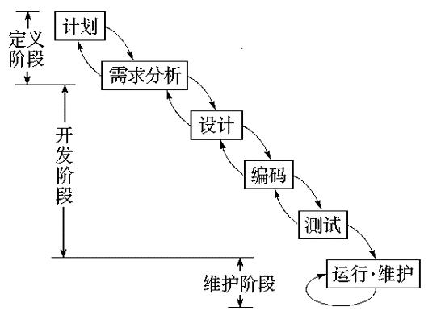
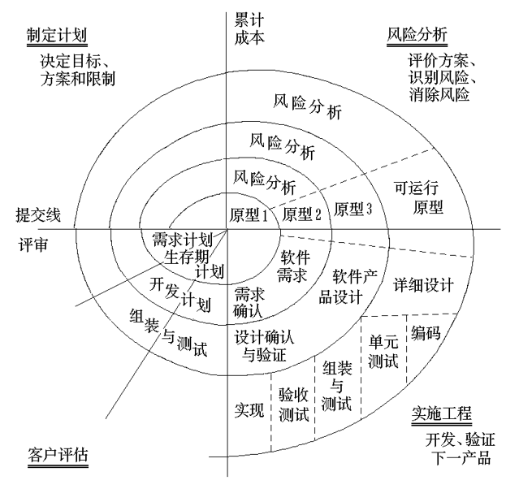
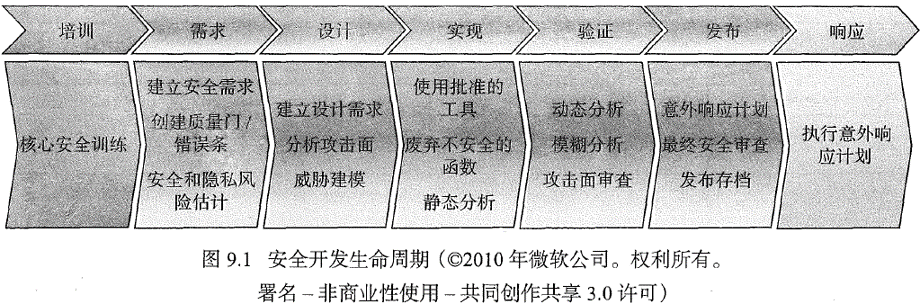
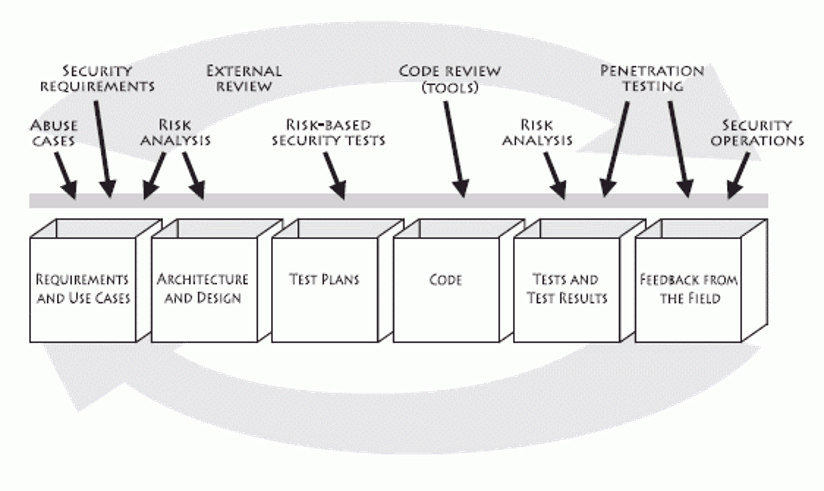
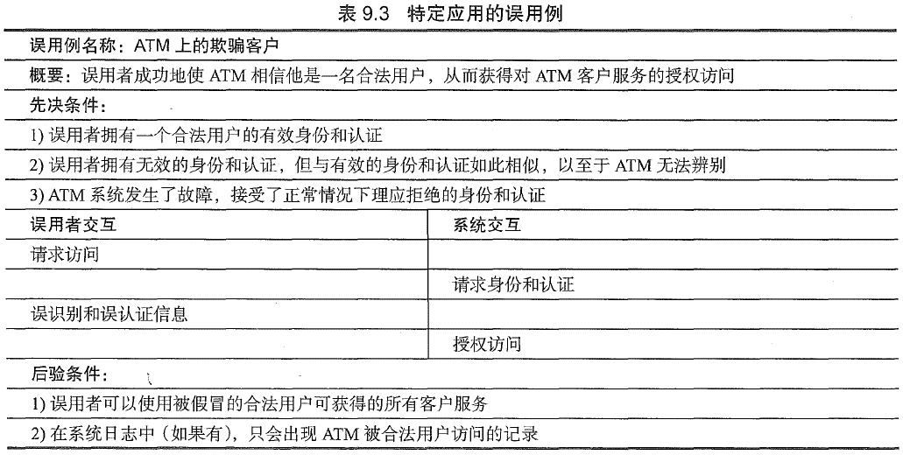
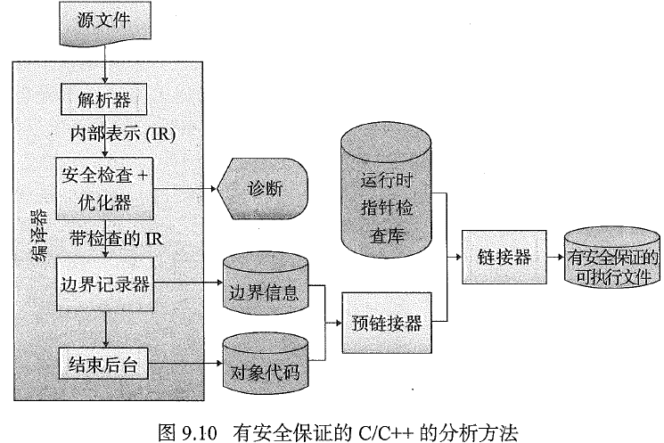

---
tags:
  - 软件安全
---
# 软件安全实践
## 安全生命周期
* 软件危机

	!!! info "软件危机"
		在软件开发和维护中所产生的一系列严重的问题。

	* 软件危机主要表现在
		1. 用户需求不明确、变更过多
		2. 软件成本日益增长
		3. 开发进度难以控制
		4. 软件质量差
		5. 软件维护困难
	* 软件危机产生的原因
		1. 软件开发无计划性
		2. 软件需求不充分
		3. 软件开发过程无规范
		4. 软件产品无评测手段
	* 解决软件危机的途径
		1. 加强软件开发过程的管理
		2. 推广使用开发软件的成功技术与方法
		3. 开发和使用好的软件工具

* 软件生命周期：划分为计划、开发、运行与维护三个时期，而每个时期又划分为若干个阶段
	- 计划时期：主要任务是调查和分析。计划时期有问题定义和可行性研究两个阶段。
	- 开发时期：完成设计和实现两大任务。设计任务包括需求分析和软件设计两个阶段；实现任务包括编码和测试。
	- 运行时期：已交付的软件投入正式使用，便进入运行时期。这是软件生存期的最后一个时期，可能要持续若干年甚至几十年。在运行过程中，可能由于多方面的原因，需要对它进行修改。因此，软件人员在这一时期的主要工作，就是做好软件维护。

### 软件开发模型
* 软件生存周期模型

    === "瀑布模型"
		* 特点：
			1. 阶段间的顺序性和依赖性
			2. 推迟实现
			3. 质量保证

		

    === "演化模型"
		* 先做试验开发，其目标只是在于探索可行性，弄清软件需求；然后在此基础上获得较为满意的软件产品。通常把第一次得到的试验性产品称为“原型”

    === "螺旋模型"
		* 沿螺线自内向外每旋转一圈便开发出更为完善的一个新的软件版本

		

### 软件安全生命周期
* SDL(Security Development Lifecycle，安全开发周期)
	
	- 微软提出
	- 适用于所有符合以下标准的软件：
		1. 广泛应用于企业、商业机构、政府部门或其他机构的软件；
		2. 广泛处理个人或敏感信息的软件；
		3. 广泛接入互联网的软件（不适用于连入微软互联网服务器进行在线升级代码、数据库的软件）
* Gary McGraw 软件安全过程
  

## 安全需求
### 安全编码标准
* 鼓励程序员遵循按照项目和组织的要求确定的一套统一规则和指引，而不是按程序员自己的习惯或偏好行事
* 定义了一组可以对源代码的符合性进行评估的要求
* 安全编码标准，如[OWASP安全编码指南](http://www.owasp.org.cn/owasp-project/secure-coding)

### 安全质量需求工程
* 安全质量需求工程过程(Security Quality Requirements Engineering Process, SQUARE)用于引出和分析安全需求，由9个步骤组成：


### 用例与误用例
* 安全误用例(security misuse case)是用例(use case)的一个变种，用于从攻击者的角度描述一种场景。用例已经被证明在描述正常的使用场景方面很有效，同样的道理，误用例在描述入侵者使用场景以及最终识别安全需求方面是有效的

|  | 误用例 | 安全用例 |
|:---:|:---:|:---:|
| 用法 | 分析并指定安全威胁 | 分析并指定安全需求 |
| 成功准则 | 攻击成功 | 应用程序成功 |
| 制造者 | 安全团队 | 安全团队 |
| 使用者 | 安全团队 | 需求团队 |
| 外部参与者 | 攻击者、用户 | 用户 |
| 驱动者 | 信息资产漏洞分析、威胁分析 | 误用例 |



## 安全设计
* 安全的软件开发原则
	- 机制经济性原则：安全机制应该相对精练、简单，以便于实现和校验
	- 失败-保险默认原则：访问判定建立在显式授权而不是隐式授权的基础上，这意味着在默认情况下，访问是被拒绝的，保护方案会识别出在什么条件下访问是经过许可的
	- 完全仲裁原则：一个保护系统的主要基础是要求检查对每一个对象的访问是否得到授权
	- 开放式设计原则：安全的设计不应该依赖于对潜在攻击者或模糊代码的忽视
	- 特权分离原则：要求一个以上的条件来授予权限（双因素认证方案是典型的实例）
	- 最小特权原则：应限定网络中每个主体所必须的最小特权，确保可能的事故、错误、网络部件的篡改等原因造成的损失最小
	- 最少公共机制原则：应该把由一个以上用户所共用的机制的数量减到最小（重点在于保证共享数据的安全）
	- 心理可接受性原则：和“可用性”大体一致，它常常需要与安全性进行权衡

        !!! info ""
            可用性也是安全性的一种形式，因为用户错误常常可能导致违反安全问题

* 威胁建模
	- 威胁模型：由应用程序的架构定义和针对应用场景的威胁列表构成
	- 微软结构化建模过程
        ```mermaid
        graph LR
        id1(识别资产) --> id2(创建蓝图) --> id3(分解应用程序) --> id4(识别威胁) --> id5(记录威胁) --> id6(评估威胁)
        ```

* 分析攻击面
	- 攻击面，是对手可以进入系统，并可能导致损害的方法的集合。重点是可能提供进攻机会的系统资源
	- 提高系统安全性的一种方法是减少其攻击面（比如限制对资源的访问权限的集合）
	- 或者，加强相对于一个进程的先决条件和后决条件以便只允许预期的影响

* 输入验证
	- 必须识别所有的输入源
	- 指定规范并验证数据
	- 制定的规范必须处理各种限制、最小值和最大值、最小长度和最大长度、有效内容、初始化和重新初始化需求，以及存储和传输的加密需求
	- 确保所有输入都符合规范

## 安全实现
* 编译器检查
	- C和C++编译器对于类型检查通常都不严格，但是一般可以提升检查级别，从而能够自动侦测到某些错误
    - 例如，利用gcc编译c或c++程序时，利用以下标记并尝试消除所有警告

	```bash
	gcc -Wall -Wpointer-arith -Wstrict-prototypes -O2 # (1)
	```

    1. 使用`-W-pedantic`(允许发出ANSI C标准所列的全部警告信息)或更专门的标记(如`-Wstrict-verflow=3`)可诊断可能导致边界检查错误的代数简化

* 有安全保证的C和C++
	- CERT开发，开放源码的编译器
	

* 静态分析
	- 静态分析器在源代码上操作，生产潜在的错误或意外的运行时行为的诊断警告
	- 容易漏报或误报，所以需要完善和可靠的规则

* 深层防御
	- 使用复合防御策略来管理风险，这样的话当某一层防御失效的时候，另一层防御能够防止安全缺陷演变为可利用的漏洞，并且可以限制得逞的利用所导致的后果
	- 比如，如果所有输入字符串都能经过校验且具备有效的长度，那么就不必使用有界字符串复制操作了，而且可以毫无顾忌地使用`strcpy()` 、`memcpy()`及类似的操作

## 安全验证
* 渗透攻击
	- 渗透测试(penetration testing)通常意味着从攻击者的角度探测应用程序、系统或网络，从而搜寻其潜在的漏洞
* 模糊测试
	- 故意向程序接口输入无效数据或格式有误的数据。模糊测试通常是暴力破解的方法，并且需要执行大量的测试(包括使用多种变体以及测试多次)，因此模糊测试一般需要自动地进行
* 开发人员准则与检查清单
	- 可以通过执行基于检查清单的设计和代码检验来确保软件的设计和实现远离那些己知的问题
	- 检查清单有三个目的
		1. 作为一种对已知问题的提醒而存在，这样我们就能记得查找它们。
		2. 用于记录设计和代码中检查出的问题以及这些检查发生的时间。
		3. **作为开发人员之间交流常见问题的一种手段。**

* 独立安全审查
	- 独立审查常常是在开发团队之外发起的，外部审查者会带来独立的观点，例如识别和纠正无效的假定
